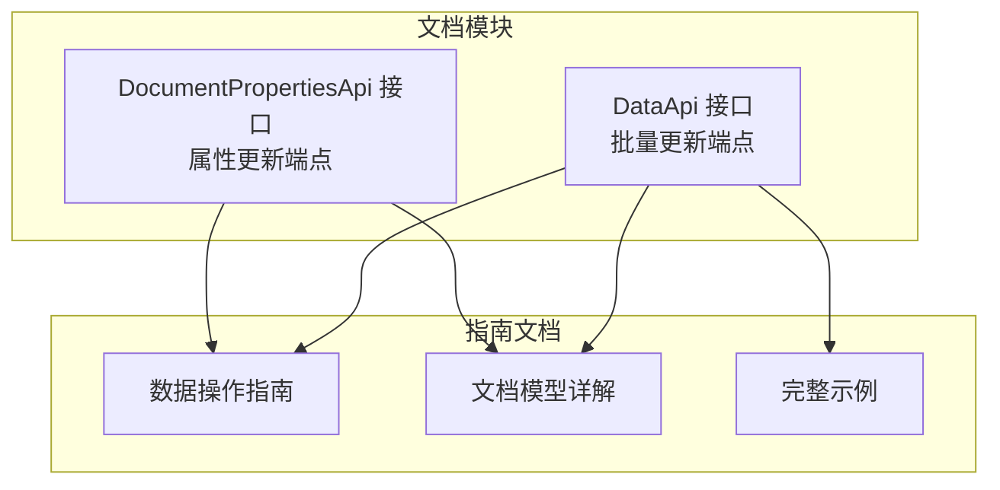
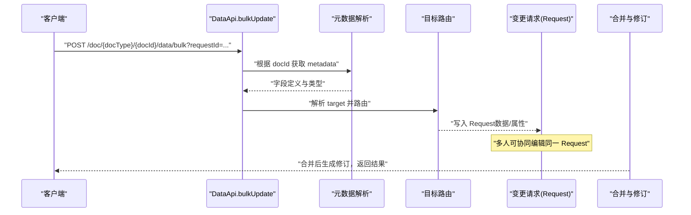
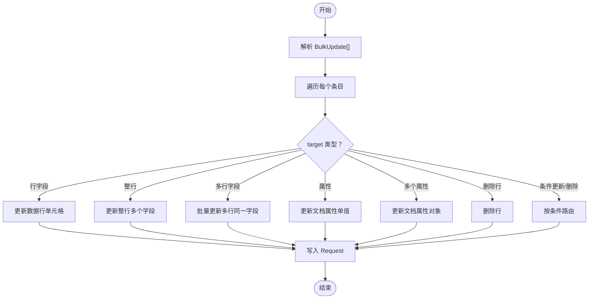
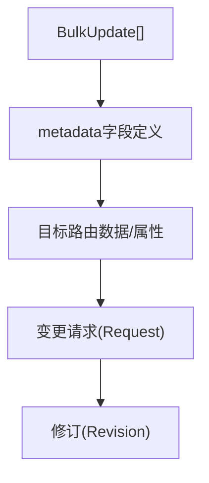

# 批量更新集成

<cite>
**本文引用的文件**
- [api/document/core/data.tsp](file://api/document/core/data.tsp)
- [api/document/core/properties.tsp](file://api/document/core/properties.tsp)
- [docs-src/guides/data-operations.md](file://docs-src/guides/data-operations.md)
- [docs-src/guides/document-model.md](file://docs-src/guides/document-model.md)
- [docs-src/guides/examples.md](file://docs-src/guides/examples.md)
</cite>

## 目录
1. [简介](#简介)
2. [项目结构](#项目结构)
3. [核心组件](#核心组件)
4. [架构总览](#架构总览)
5. [详细组件分析](#详细组件分析)
6. [依赖分析](#依赖分析)
7. [性能考虑](#性能考虑)
8. [故障排查指南](#故障排查指南)
9. [结论](#结论)
10. [附录](#附录)

## 简介
本指南聚焦于推荐使用的统一批量更新接口：POST /doc/{docType}/{docId}/data/bulk。该接口通过统一的 target 与 value 结构，支持对数据行与文档属性进行混合更新，显著降低请求次数、提升一致性与可审计性。本文将详细说明三种典型使用场景：修改单个属性、修改多个属性、混合更新（数据+属性），并强调必须配合 requestId 使用以支持协同编辑与变更请求工作流。

## 项目结构
- 批量更新能力由文档模块下的数据与属性子模块共同提供：
  - 数据行批量更新：位于数据模块接口定义中
  - 文档属性批量更新：位于属性模块接口定义中
- 指南文档提供了批量更新的使用流程、示例与最佳实践。

图表来源
- [api/document/core/data.tsp](file://api/document/core/data.tsp#L574-L666)
- [api/document/core/properties.tsp](file://api/document/core/properties.tsp#L200-L441)
- [docs-src/guides/data-operations.md](file://docs-src/guides/data-operations.md#L156-L213)
- [docs-src/guides/document-model.md](file://docs-src/guides/document-model.md#L239-L272)
- [docs-src/guides/examples.md](file://docs-src/guides/examples.md#L366-L409)

章节来源
- [api/document/core/data.tsp](file://api/document/core/data.tsp#L574-L666)
- [api/document/core/properties.tsp](file://api/document/core/properties.tsp#L200-L441)
- [docs-src/guides/data-operations.md](file://docs-src/guides/data-operations.md#L156-L213)
- [docs-src/guides/document-model.md](file://docs-src/guides/document-model.md#L239-L272)
- [docs-src/guides/examples.md](file://docs-src/guides/examples.md#L366-L409)

## 核心组件
- 统一批量更新模型：BulkUpdate[]
  - target：灵活的目标结构，支持单行字段、整行、多行字段、单个属性、多个属性、按条件更新/删除等
  - value：原始值（单值/对象/数组），服务端基于 metadata 自动解析类型
- 数据行批量更新接口：POST /doc/{docType}/{docId}/data/bulk
  - 支持修改单个字段、整行、多行同一字段、多行不同值、删除行、按条件更新/删除
  - 所有写操作均进入变更请求（Request），需携带 requestId
- 文档属性批量更新接口：PATCH /doc/{docType}/{docId}/properties
  - 支持部分更新属性（单个或多个字段），合并/覆盖模式可选，需携带 requestId 与版本号

章节来源
- [api/document/core/data.tsp](file://api/document/core/data.tsp#L71-L188)
- [api/document/core/data.tsp](file://api/document/core/data.tsp#L574-L666)
- [api/document/core/properties.tsp](file://api/document/core/properties.tsp#L200-L441)

## 架构总览
批量更新的端到端流程如下：
- 客户端构造 BulkUpdate[]，通过 requestId 协同编辑
- 服务端解析 metadata，路由到数据行或属性更新路径
- 将变更写入 Request，等待审批合并
- 合并后生成修订（Revision），完成持久化

图表来源
- [api/document/core/data.tsp](file://api/document/core/data.tsp#L574-L666)
- [docs-src/guides/data-operations.md](file://docs-src/guides/data-operations.md#L156-L213)

章节来源
- [api/document/core/data.tsp](file://api/document/core/data.tsp#L574-L666)
- [docs-src/guides/data-operations.md](file://docs-src/guides/data-operations.md#L156-L213)

## 详细组件分析

### 统一批量更新模型（BulkUpdate）
- target 支持的典型形式
  - 单行字段：{"row": "...", "field": "..."}
  - 整行：{"row": "..."}
  - 多行同一字段：{"rows": ["...","..."], "field": "..."}
  - 单个属性：{"property": "..."}
  - 多个属性：{"properties": true}
  - 删除行：{"row": "...", "delete": true}
  - 按条件更新/删除：{"condition": {...}, "field": "..."/"delete": true}
- value 支持的典型形式
  - 单个原始值：数值/字符串/布尔
  - 对象（多字段）：{"field1": ..., "field2": ...}
  - 数组（多行不同值）：[..., ..., ...]
- 服务端处理要点
  - 根据 docId 获取 metadata
  - 对每个 target，解析目标类型（行/属性）
  - 查找字段定义获取类型
  - 将原始值转换为类型化值
  - 验证值的有效性
  - 添加到指定的 Request

图表来源
- [api/document/core/data.tsp](file://api/document/core/data.tsp#L71-L188)
- [api/document/core/data.tsp](file://api/document/core/data.tsp#L574-L666)

章节来源
- [api/document/core/data.tsp](file://api/document/core/data.tsp#L71-L188)
- [api/document/core/data.tsp](file://api/document/core/data.tsp#L574-L666)

### 使用场景与示例

#### 场景一：修改单个属性
- 适用：仅更新文档属性中的某个字段
- 请求体结构
  - target: {"property": "<属性名>"}
  - value: 原始值（如数字/字符串/布尔）
- 示例参考
  - 单个属性更新示例（cURL）：参见接口注释中的示例片段
- 说明
  - 该操作进入变更请求（Request），需携带 requestId

章节来源
- [api/document/core/data.tsp](file://api/document/core/data.tsp#L134-L141)
- [api/document/core/data.tsp](file://api/document/core/data.tsp#L622-L633)
- [docs-src/guides/data-operations.md](file://docs-src/guides/data-operations.md#L156-L213)

#### 场景二：修改多个属性
- 适用：批量更新文档属性中的多个字段
- 请求体结构
  - target: {"properties": true}
  - value: 对象（包含多个属性键值对）
- 示例参考
  - 多个属性更新示例（cURL）：参见接口注释中的示例片段
- 说明
  - 该操作进入变更请求（Request），需携带 requestId

章节来源
- [api/document/core/data.tsp](file://api/document/core/data.tsp#L142-L152)
- [api/document/core/data.tsp](file://api/document/core/data.tsp#L628-L633)
- [docs-src/guides/data-operations.md](file://docs-src/guides/data-operations.md#L156-L213)

#### 场景三：混合更新（数据 + 属性）
- 适用：在同一请求中同时更新数据行字段与文档属性
- 请求体结构
  - 第一项：target: {"row": "...", "field": "..."}, value: 原始值
  - 第二项：target: {"property": "..."}, value: 原始值
- 示例参考
  - 混合更新示例（cURL）：参见接口注释中的示例片段
- 说明
  - 该操作进入变更请求（Request），需携带 requestId

章节来源
- [api/document/core/data.tsp](file://api/document/core/data.tsp#L635-L640)
- [api/document/core/data.tsp](file://api/document/core/data.tsp#L636-L639)
- [docs-src/guides/data-operations.md](file://docs-src/guides/data-operations.md#L156-L213)

### 与属性更新接口的关系
- 文档属性更新接口（PATCH /doc/{docType}/{docId}/properties）
  - 支持部分更新属性（单个或多个字段），合并/覆盖模式可选，需携带 requestId 与版本号
  - 适合细粒度的属性更新场景
- 统一批量更新接口（POST /doc/{docType}/{docId}/data/bulk）
  - 同时支持数据与属性更新，减少请求次数，统一走变更请求工作流
  - 更适合批量与混合场景

章节来源
- [api/document/core/properties.tsp](file://api/document/core/properties.tsp#L200-L441)
- [api/document/core/data.tsp](file://api/document/core/data.tsp#L574-L666)

### 与批量导入/导出示例的结合
- 批量导入示例展示了如何使用批量更新接口进行大规模数据写入
- 批量导出示例展示了如何从系统中导出数据，便于后续处理与比对

章节来源
- [docs-src/guides/examples.md](file://docs-src/guides/examples.md#L366-L409)

## 依赖分析
- 批量更新接口依赖文档元数据（metadata）以解析字段类型与校验值
- 所有写操作（创建/更新/删除/批量更新）均需携带 requestId，进入变更请求（Request）并最终生成修订（Revision）
- 并发控制通过版本号（version）实现乐观锁，避免冲突

图表来源
- [api/document/core/data.tsp](file://api/document/core/data.tsp#L574-L666)
- [docs-src/guides/data-operations.md](file://docs-src/guides/data-operations.md#L234-L272)

章节来源
- [api/document/core/data.tsp](file://api/document/core/data.tsp#L574-L666)
- [docs-src/guides/data-operations.md](file://docs-src/guides/data-operations.md#L234-L272)

## 性能考虑
- 优先使用批量操作：相比多次单条写入，批量更新能显著减少请求次数与网络开销
- 批量导入示例展示了按批次（如每批 100 行）进行导入的实践
- 合理设置分页大小与过滤条件，减少不必要的数据传输

章节来源
- [docs-src/guides/data-operations.md](file://docs-src/guides/data-operations.md#L273-L306)
- [docs-src/guides/examples.md](file://docs-src/guides/examples.md#L366-L409)

## 故障排查指南
- requestId 缺失或错误
  - 所有写操作必须携带 requestId，否则无法进入变更请求工作流
- 版本冲突（VERSION_CONFLICT）
  - 更新时需提供正确的版本号，否则会因并发冲突导致失败
- apply 参数已废弃
  - 批量更新不再支持 apply 参数，请统一通过 requestId 工作流

章节来源
- [docs-src/guides/data-operations.md](file://docs-src/guides/data-operations.md#L227-L233)
- [docs-src/guides/data-operations.md](file://docs-src/guides/data-operations.md#L234-L272)

## 结论
统一批量更新接口（POST /doc/{docType}/{docId}/data/bulk）通过 target 与 value 的灵活结构，实现了对数据行与文档属性的混合更新，显著降低了请求次数、提升了操作一致性与可审计性。配合 requestId 的协同编辑工作流，能够更好地支持团队协作与变更管理。建议在批量与混合场景中优先使用该接口，并遵循版本控制与工作流规范。

## 附录
- 接口与模型参考
  - 统一批量更新接口定义与示例：参见数据模块接口定义
  - 文档属性更新接口定义与示例：参见属性模块接口定义
- 使用建议
  - 在批量导入/导出场景中，结合批次大小与分页策略
  - 在混合更新场景中，将数据与属性更新放在同一请求中，减少往返

章节来源
- [api/document/core/data.tsp](file://api/document/core/data.tsp#L574-L666)
- [api/document/core/properties.tsp](file://api/document/core/properties.tsp#L200-L441)
- [docs-src/guides/document-model.md](file://docs-src/guides/document-model.md#L239-L272)
- [docs-src/guides/examples.md](file://docs-src/guides/examples.md#L366-L409)