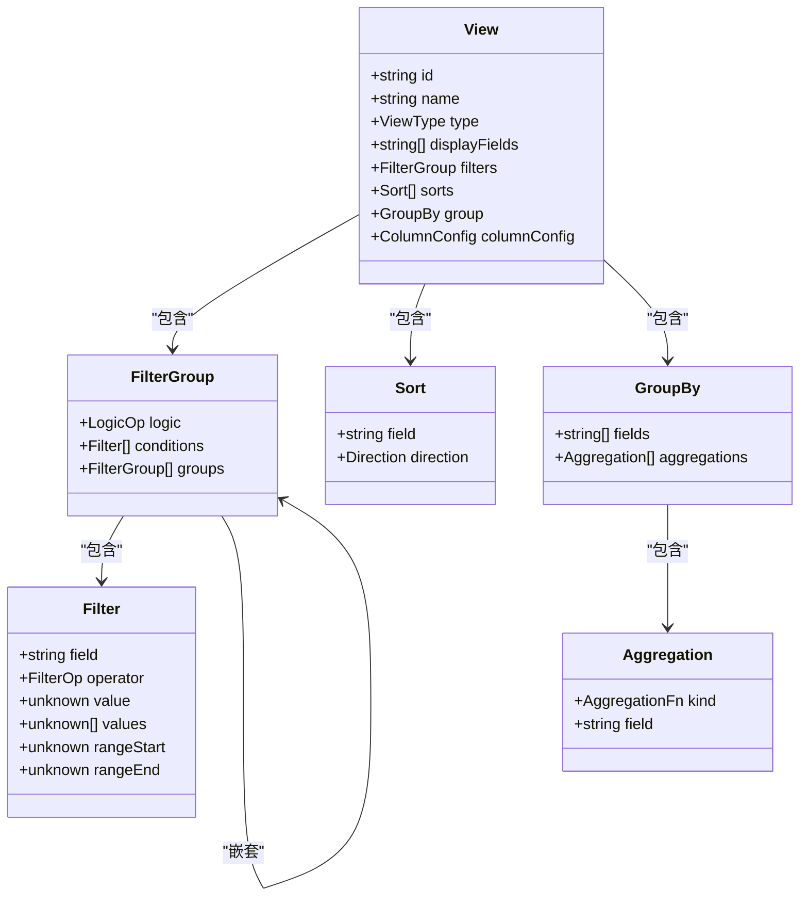

# 视图类型

<cite>
**本文档引用的文件**
- [views.tsp](file://api/document/core/views.tsp#L1-L171)
- [constants.tsp](file://api/shared/constants.tsp#L87-L139)
- [common.tsp](file://api/shared/common.tsp#L277-L331)
- [data.tsp](file://api/document/core/data.tsp#L319-L373)
- [index.tsp](file://api/document/aggregate/index.tsp#L48-L90)
- [document-model.md](file://docs-src/guides/document-model.md)
- [api-reference.md](file://docs-src/references/api-reference.md)
- [development.md](file://docs-src/guides/development.md)
</cite>

## 目录
1. [引言](#引言)
2. [核心视图类型](#核心视图类型)
3. [视图配置模型](#视图配置模型)
4. [业务场景与技术实现](#业务场景与技术实现)
5. [配置示例](#配置示例)
6. [视图选择策略](#视图选择策略)
7. [扩展机制](#扩展机制)
8. [性能优化建议](#性能优化建议)
9. [结论](#结论)

## 引言
NexusBook.AI 提供了灵活的多视图系统，支持多种数据展示方式，以满足不同业务场景的需求。该系统允许用户根据数据特征和使用目的选择最合适的视图类型，从而提升数据的可读性和操作效率。本文档详细说明了四种核心视图类型：表格（Grid）、相册（Gallery）、看板（Kanban）和文档（Document），并阐述了它们的适用场景、技术实现方式、配置方法以及扩展机制。

**本文档引用的文件**
- [views.tsp](file://api/document/core/views.tsp#L1-L171)
- [constants.tsp](file://api/shared/constants.tsp#L87-L139)

## 核心视图类型
NexusBook.AI 支持多种视图类型，每种类型针对特定的数据展示需求进行了优化。以下是四种核心视图类型的详细介绍：

### 表格视图（Grid）
表格视图是数据展示的基础形式，适用于需要进行数据浏览和编辑的场景。它以行和列的形式组织数据，支持排序、过滤和分组等操作，便于用户快速查找和修改数据。

### 相册视图（Gallery）
相册视图适用于图片类数据的展示，能够以缩略图的形式呈现每个数据项，提供直观的视觉体验。这种视图类型特别适合用于产品目录、项目展示等需要突出视觉效果的场景。

### 看板视图（Kanban）
看板视图基于看板方法论，适用于工作流和进度管理。它将数据项按照状态或阶段进行分类，形成多个列，用户可以通过拖拽操作来更新任务的状态，非常适合项目管理和任务跟踪。

### 文档视图（Document）
文档视图用于详细内容的查看，适合展示包含丰富文本和多媒体内容的数据。这种视图类型通常用于查看报告、文章或其他长篇文档，提供沉浸式的阅读体验。

**本文档引用的文件**
- [constants.tsp](file://api/shared/constants.tsp#L87-L139)
- [views.tsp](file://api/document/core/views.tsp#L21-L25)

## 视图配置模型
视图配置模型定义了视图的结构和行为，包括字段显示、过滤、排序、分组设置等。通过灵活的配置，用户可以根据具体需求定制视图的外观和功能。

### View 模型
`View` 模型是视图配置的核心，包含了视图的基本信息和配置选项。其主要属性如下：
- `id`: 视图的唯一标识符。
- `name`: 视图的显示名称。
- `type`: 视图类型，如 `table`、`gallery`、`kanban` 等。
- `displayFields`: 用于渲染的字段列表。
- `filters`: 过滤条件组合。
- `sorts`: 排序条件。
- `group`: 分组与聚合设置。
- `columnConfig`: 列展示配置，包括宽度、顺序、固定和隐藏设置。

### FilterGroup 模型
`FilterGroup` 模型用于定义复杂的过滤条件，支持逻辑组合（AND/OR）和嵌套条件。它包含以下属性：
- `logic`: 逻辑操作符，如 `and` 或 `or`。
- `conditions`: 条件集合，每个条件包含字段、操作符和值。
- `groups`: 嵌套的过滤组合。

### Sort 模型
`Sort` 模型用于定义排序规则，包含字段和排序方向（升序或降序）。通过多个 `Sort` 对象的组合，可以实现多级排序。

### GroupBy 模型
`GroupBy` 模型用于定义分组和聚合规则，支持按一个或多个字段进行分组，并对分组结果进行统计计算，如计数、求和、平均值等。



**图表来源**
- [views.tsp](file://api/document/core/views.tsp#L28-L84)
- [common.tsp](file://api/shared/common.tsp#L277-L331)

## 业务场景与技术实现
不同的视图类型适用于不同的业务场景，选择合适的视图类型可以显著提升用户体验和工作效率。

### 表格视图的应用场景
表格视图适用于需要频繁进行数据操作的场景，如财务报表、库存管理等。通过排序和过滤功能，用户可以快速定位到所需的数据，并进行编辑或删除操作。

### 相册视图的应用场景
相册视图适用于需要展示大量图片的场景，如产品目录、项目展示等。通过缩略图的形式，用户可以快速浏览所有图片，并点击进入详情页面查看大图。

### 看板视图的应用场景
看板视图适用于项目管理和任务跟踪，如软件开发、市场营销活动等。通过将任务按状态分类，用户可以清晰地看到项目的整体进度，并通过拖拽操作更新任务状态。

### 文档视图的应用场景
文档视图适用于需要详细阅读和编辑的场景，如报告撰写、文章发布等。通过丰富的文本格式和多媒体支持，用户可以获得更好的阅读体验。

**本文档引用的文件**
- [document-model.md](file://docs-src/guides/document-model.md)
- [api-reference.md](file://docs-src/references/api-reference.md)

## 配置示例
以下是一些常见的视图配置示例，展示了如何根据实际需求设置视图。

### 表格视图配置
```json
{
  "id": "view-pending",
  "name": "待处理订单",
  "type": "table",
  "config": {
    "columns": ["productName", "quantity", "price"],
    "filters": [
      {
        "fieldId": "status",
        "operator": "equals",
        "value": "pending"
      }
    ],
    "sort": [
      {
        "fieldId": "orderTime",
        "direction": "desc"
      }
    ]
  }
}
```

### 相册视图配置
```json
{
  "id": "view-products",
  "name": "产品展示",
  "type": "gallery",
  "config": {
    "columns": ["productName", "image", "price"],
    "filters": [
      {
        "fieldId": "category",
        "operator": "in",
        "values": ["electronics", "furniture"]
      }
    ]
  }
}
```

### 看板视图配置
```json
{
  "id": "view-kanban",
  "name": "项目进度",
  "type": "kanban",
  "config": {
    "groupBy": "status",
    "columns": ["taskName", "assignee", "dueDate"],
    "sort": [
      {
        "fieldId": "priority",
        "direction": "desc"
      }
    ]
  }
}
```

### 文档视图配置
```json
{
  "id": "view-report",
  "name": "年度报告",
  "type": "document",
  "config": {
    "columns": ["title", "author", "content"],
    "filters": [
      {
        "fieldId": "year",
        "operator": "range",
        "rangeStart": "2023-01-01",
        "rangeEnd": "2023-12-31"
      }
    ]
  }
}
```

**本文档引用的文件**
- [document-model.md](file://docs-src/guides/document-model.md#L277-L352)

## 视图选择策略
选择合适的视图类型是提升数据展示效果的关键。以下是一些选择视图类型的建议：

### 数据特征分析
- **结构化数据**：如果数据具有明确的行和列结构，适合使用表格视图。
- **图像数据**：如果数据包含大量图片，适合使用相册视图。
- **流程数据**：如果数据涉及多个状态或阶段，适合使用看板视图。
- **文本数据**：如果数据包含大量文本内容，适合使用文档视图。

### 用户需求分析
- **数据操作**：如果用户需要频繁进行数据的增删改查操作，推荐使用表格视图。
- **视觉展示**：如果用户更关注数据的视觉效果，推荐使用相册视图。
- **进度跟踪**：如果用户需要跟踪任务的进度，推荐使用看板视图。
- **内容阅读**：如果用户需要详细阅读和理解数据内容，推荐使用文档视图。

**本文档引用的文件**
- [document-model.md](file://docs-src/guides/document-model.md)
- [api-reference.md](file://docs-src/references/api-reference.md)

## 扩展机制
NexusBook.AI 的视图系统设计为可扩展的，允许开发者添加新的视图类型以满足特定需求。

### 添加新视图类型
1. 在 `ViewType` 枚举中添加新类型。
2. 定义新的视图配置模型，继承或扩展现有的 `View` 模型。
3. 实现前端渲染逻辑，确保新视图类型能够在界面上正确显示。

### 示例：添加日历视图
1. 在 `constants.tsp` 文件中添加 `calendar` 类型：
   ```typescript
   enum ViewType {
     table,
     gallery,
     kanban,
     document,
     calendar
   }
   ```
2. 定义日历视图的配置模型：
   ```typescript
   model CalendarView extends View {
     dateField: string;
     eventFields: string[];
   }
   ```
3. 实现前端渲染逻辑，使用日历组件展示数据。

**本文档引用的文件**
- [development.md](file://docs-src/guides/development.md#L386-L391)
- [constants.tsp](file://api/shared/constants.tsp#L91-L139)

## 性能优化建议
为了确保视图系统的高性能，以下是一些优化建议：

### 分页策略
对于大数据集，使用分页策略避免一次性加载过多数据。推荐使用游标分页，以提高深分页的性能。

### 按需加载
只加载当前视图所需的字段和数据，避免不必要的网络请求和内存占用。

### 缓存策略
对频繁访问的数据进行缓存，减少重复请求。可以设置合理的缓存过期时间，确保数据的及时性。

### 示例：缓存元数据
```javascript
class ApiClient {
  constructor() {
    this.cache = new Map();
    this.cacheTTL = 60000; // 1 分钟
  }
  
  async getMetadata(docType, docId) {
    const key = `metadata:${docType}:${docId}`;
    const cached = this.cache.get(key);
    
    if (cached && Date.now() - cached.time < this.cacheTTL) {
      return cached.data;
    }
    
    const data = await api.get(`/doc/${docType}/${docId}/metadata`);
    this.cache.set(key, { data, time: Date.now() });
    
    return data;
  }
}
```

**本文档引用的文件**
- [best-practices.md](file://docs-src/guides/best-practices.md#L256-L277)

## 结论
NexusBook.AI 的多视图系统为用户提供了一个灵活且强大的数据展示平台。通过合理选择和配置视图类型，用户可以更高效地管理和分析数据。同时，系统的可扩展性也为未来的功能增强提供了坚实的基础。希望本文档能帮助您更好地理解和使用 NexusBook.AI 的视图功能。