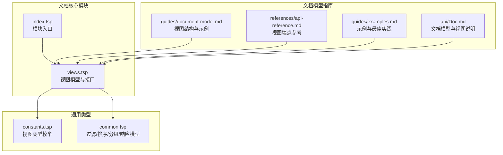
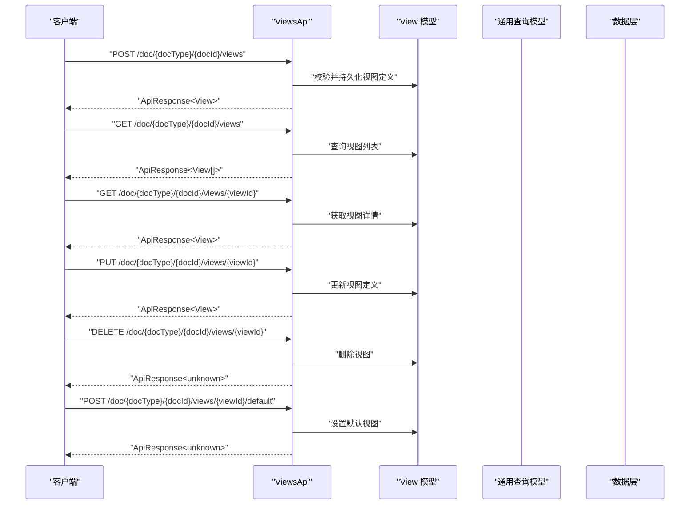
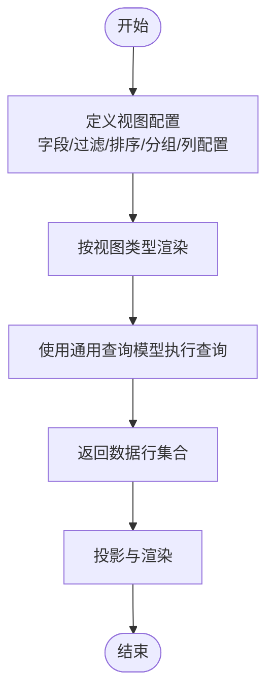
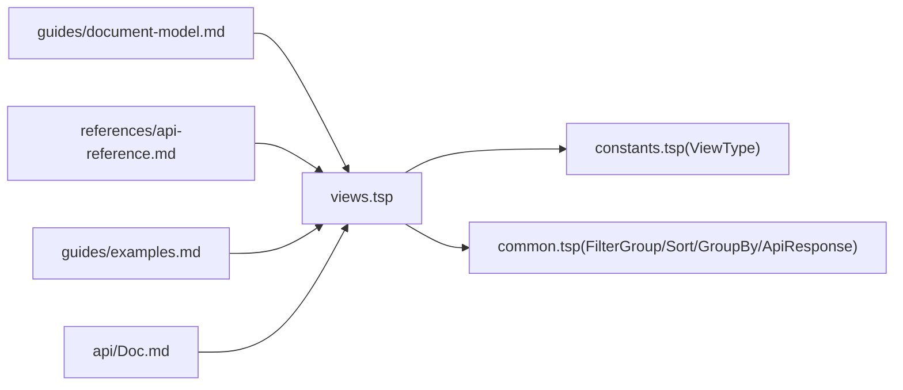

# 视图配置

<cite>
**本文引用的文件**
- [api/document/core/views.tsp](file://api/document/core/views.tsp)
- [api/shared/constants.tsp](file://api/shared/constants.tsp)
- [api/shared/common.tsp](file://api/shared/common.tsp)
- [api/document/core/index.tsp](file://api/document/core/index.tsp)
- [docs-src/references/api-reference.md](file://docs-src/references/api-reference.md)
- [docs-src/guides/document-model.md](file://docs-src/guides/document-model.md)
- [docs-src/guides/examples.md](file://docs-src/guides/examples.md)
- [api/Doc.md](file://api/Doc.md)
</cite>

## 目录
1. [简介](#简介)
2. [项目结构](#项目结构)
3. [核心组件](#核心组件)
4. [架构总览](#架构总览)
5. [详细组件分析](#详细组件分析)
6. [依赖分析](#依赖分析)
7. [性能考量](#性能考量)
8. [故障排查指南](#故障排查指南)
9. [结论](#结论)
10. [附录](#附录)

## 简介
本文件面向 nexusbook-api 的“视图配置”能力，系统化阐述支持的视图类型（表格、相册、看板、日历、图表、表单、地图、时间线），以及视图配置的组成要素（字段显示、过滤、排序、分组、列配置：宽度、顺序、固定、隐藏）。文档还覆盖视图管理功能（创建、编辑、删除、设置默认视图），并给出视图 API 的完整端点规范与使用示例，帮助开发者实现数据的多样化展示与个性化定制。

## 项目结构
视图配置位于文档核心模块中，与通用常量、通用类型、数据与元数据模块共同构成文档模型的展示层与查询层基础。

**图表来源**
- [api/document/core/views.tsp](file://api/document/core/views.tsp#L1-L171)
- [api/shared/constants.tsp](file://api/shared/constants.tsp#L87-L139)
- [api/shared/common.tsp](file://api/shared/common.tsp#L210-L331)
- [api/document/core/index.tsp](file://api/document/core/index.tsp#L1-L21)
- [docs-src/guides/document-model.md](file://docs-src/guides/document-model.md#L302-L352)
- [docs-src/references/api-reference.md](file://docs-src/references/api-reference.md#L140-L171)
- [docs-src/guides/examples.md](file://docs-src/guides/examples.md#L98-L118)
- [api/Doc.md](file://api/Doc.md#L248-L298)

**章节来源**
- [api/document/core/index.tsp](file://api/document/core/index.tsp#L1-L21)

## 核心组件
- 视图模型（View）
  - 标识、名称、类型（来自通用枚举）、显示字段、过滤、排序、分组、列配置（宽度/顺序/固定/隐藏）。
- 视图类型（ViewType）
  - 支持 table、gallery、kanban、calendar、chart、form、map、timeline 等八种类型。
- 查询与过滤（FilterGroup、Sort、GroupBy）
  - 用于表达复杂筛选、排序与分组聚合。
- API 接口（ViewsApi）
  - 列出、创建、获取、更新、删除视图，以及将指定视图设为默认视图。

**章节来源**
- [api/document/core/views.tsp](file://api/document/core/views.tsp#L28-L84)
- [api/shared/constants.tsp](file://api/shared/constants.tsp#L87-L139)
- [api/shared/common.tsp](file://api/shared/common.tsp#L210-L331)
- [docs-src/references/api-reference.md](file://docs-src/references/api-reference.md#L140-L171)

## 架构总览
视图配置与数据查询解耦：视图仅保存配置（字段、过滤、排序、分组、列配置），实际数据由数据层提供；视图类型决定渲染形态，列配置决定表格列的呈现细节。

**图表来源**
- [api/document/core/views.tsp](file://api/document/core/views.tsp#L86-L170)
- [api/shared/common.tsp](file://api/shared/common.tsp#L153-L177)

## 详细组件分析

### 视图类型与适用场景
- 表格（table）
  - 适用于数据浏览与编辑，支持列配置（宽度、顺序、固定、隐藏）。
- 相册（gallery）
  - 适用于图片类数据展示，强调视觉浏览与缩略图。
- 看板（kanban）
  - 适用于工作流与进度管理，按状态分组展示。
- 日历（calendar）
  - 适用于按日期组织的数据，如事件、排班、里程碑。
- 图表（chart）
  - 适用于统计与可视化，结合分组与聚合。
- 表单（form）
  - 适用于表单录入与编辑，强调字段布局与交互。
- 地图（map）
  - 适用于地理数据，按地理位置展示与筛选。
- 时间线（timeline）
  - 适用于事件序列与时间轴展示。

上述类型来源于通用枚举，支持八种视图类型。

**章节来源**
- [api/shared/constants.tsp](file://api/shared/constants.tsp#L87-L139)
- [docs-src/references/api-reference.md](file://docs-src/references/api-reference.md#L140-L171)

### 视图配置组成
- 字段显示（displayFields）
  - 指定渲染时使用的字段集合。
- 过滤（filters）
  - 使用 FilterGroup 表达嵌套逻辑与条件组合。
- 排序（sorts）
  - 使用 Sort 指定字段与方向。
- 分组与聚合（group）
  - 使用 GroupBy 指定分组字段与聚合函数集合。
- 列配置（columnConfig）
  - width：字段列宽数组
  - order：列顺序数组
  - pinned：固定列数组
  - hidden：隐藏列数组

以上配置均在视图模型中定义，用于驱动前端渲染与数据投影。

**章节来源**
- [api/document/core/views.tsp](file://api/document/core/views.tsp#L28-L84)
- [api/shared/common.tsp](file://api/shared/common.tsp#L210-L331)

### 视图管理功能
- 创建视图
  - 通过 POST /doc/{docType}/{docId}/views，提交 View 定义。
- 编辑视图
  - 通过 PUT /doc/{docType}/{docId}/views/{viewId} 更新视图定义。
- 删除视图
  - 通过 DELETE /doc/{docType}/{docId}/views/{viewId} 删除视图。
- 设置默认视图
  - 通过 POST /doc/{docType}/{docId}/views/{viewId}/default 将指定视图设为默认。

这些端点在视图接口中定义，返回统一 ApiResponse 包装。

**章节来源**
- [api/document/core/views.tsp](file://api/document/core/views.tsp#L86-L170)
- [docs-src/references/api-reference.md](file://docs-src/references/api-reference.md#L140-L171)

### 视图 API 接口规范
- 列出视图
  - 方法：GET
  - 路径：/doc/{docType}/{docId}/views
  - 返回：ApiResponse<View[]>
- 创建视图
  - 方法：POST
  - 路径：/doc/{docType}/{docId}/views
  - 请求体：View
  - 返回：ApiResponse<View>
- 获取视图详情
  - 方法：GET
  - 路径：/doc/{docType}/{docId}/views/{viewId}
  - 返回：ApiResponse<View>
- 更新视图
  - 方法：PUT
  - 路径：/doc/{docType}/{docId}/views/{viewId}
  - 请求体：View
  - 返回：ApiResponse<View>
- 删除视图
  - 方法：DELETE
  - 路径：/doc/{docType}/{docId}/views/{viewId}
  - 返回：ApiResponse<unknown>
- 设置默认视图
  - 方法：POST
  - 路径：/doc/{docType}/{docId}/views/{viewId}/default
  - 返回：ApiResponse<unknown>

**章节来源**
- [api/document/core/views.tsp](file://api/document/core/views.tsp#L86-L170)
- [docs-src/references/api-reference.md](file://docs-src/references/api-reference.md#L140-L171)

### 视图配置与数据查询的关系
- 视图不持有数据，仅保存配置（字段、过滤、排序、分组、列配置）。
- 数据查询使用通用查询模型（FilterGroup、Sort、GroupBy、Page）进行复杂筛选、排序、分组与分页。
- 视图类型决定渲染形态，列配置决定表格列的呈现细节。

**图表来源**
- [api/document/core/views.tsp](file://api/document/core/views.tsp#L28-L84)
- [api/shared/common.tsp](file://api/shared/common.tsp#L210-L331)

**章节来源**
- [docs-src/guides/document-model.md](file://docs-src/guides/document-model.md#L302-L352)
- [api/Doc.md](file://api/Doc.md#L248-L298)

### 实际使用示例与最佳实践
- 示例：创建“待处理”视图（表格）
  - 通过 POST /doc/{docType}/{docId}/views 创建视图，配置过滤为状态等于“pending”，排序为下单时间降序。
- 示例：低库存预警视图（表格）
  - 通过 POST /doc/{docType}/{docId}/views 创建视图，配置过滤为库存小于等于阈值，排序为库存升序。
- 最佳实践
  - 为常用场景创建专用视图，减少前端重复计算。
  - 使用列配置优化表格列宽、顺序与固定，提升可读性。
  - 使用分组与聚合构建统计视图，辅助决策。
  - 通过设置默认视图，统一团队入口体验。

**章节来源**
- [docs-src/guides/examples.md](file://docs-src/guides/examples.md#L98-L118)
- [docs-src/guides/examples.md](file://docs-src/guides/examples.md#L314-L331)

## 依赖分析
- 视图模型依赖
  - 视图类型枚举（ViewType）：来自通用常量模块。
  - 查询模型（FilterGroup、Sort、GroupBy）：来自通用公共模块。
- 视图接口依赖
  - 统一响应模型（ApiResponse）：来自通用公共模块。
- 模块耦合
  - 视图模块与通用模块松耦合，通过类型与枚举引用，便于扩展与维护。

**图表来源**
- [api/document/core/views.tsp](file://api/document/core/views.tsp#L1-L171)
- [api/shared/constants.tsp](file://api/shared/constants.tsp#L87-L139)
- [api/shared/common.tsp](file://api/shared/common.tsp#L153-L177)
- [docs-src/guides/document-model.md](file://docs-src/guides/document-model.md#L302-L352)
- [docs-src/references/api-reference.md](file://docs-src/references/api-reference.md#L140-L171)
- [docs-src/guides/examples.md](file://docs-src/guides/examples.md#L98-L118)
- [api/Doc.md](file://api/Doc.md#L248-L298)

**章节来源**
- [api/document/core/views.tsp](file://api/document/core/views.tsp#L1-L171)
- [api/shared/constants.tsp](file://api/shared/constants.tsp#L87-L139)
- [api/shared/common.tsp](file://api/shared/common.tsp#L153-L177)

## 性能考量
- 列配置优化
  - 合理设置列宽与顺序，减少首屏渲染压力。
  - 固定关键列，提升滚动时的可见性。
  - 隐藏非必要列，降低渲染与网络传输成本。
- 查询与分页
  - 使用分组与聚合减少前端计算。
  - 通过分页与游标分页控制数据规模。
- 默认视图
  - 为常用视图设置默认视图，减少重复查询与配置。

[本节为通用指导，无需特定文件来源]

## 故障排查指南
- 常见错误码
  - VIEW_NOT_FOUND：视图不存在。
  - VIEW_INVALID_DEFINITION：视图定义无效。
- 建议排查步骤
  - 确认视图 ID 与文档类型/文档 ID 是否匹配。
  - 检查视图定义中的字段 ID 是否存在于元数据。
  - 校验过滤、排序、分组字段是否存在且类型正确。
  - 若设置默认视图失败，确认视图存在且未被删除。

**章节来源**
- [api/shared/common.tsp](file://api/shared/common.tsp#L80-L120)

## 结论
nexusbook-api 的视图配置提供了强大的数据展示与个性化能力。通过八种视图类型与完善的配置项（字段、过滤、排序、分组、列配置），开发者可以灵活地构建多样化的数据视图。配合统一的 API 接口与通用查询模型，能够高效实现数据的多样化展示与团队协作。

[本节为总结性内容，无需特定文件来源]

## 附录

### 视图类型对照表
- table：表格
- gallery：相册/网格
- kanban：看板
- calendar：日历
- chart：图表
- form：表单
- map：地图
- timeline：时间线

**章节来源**
- [api/shared/constants.tsp](file://api/shared/constants.tsp#L87-L139)

### 视图 API 端点一览
- 列出视图：GET /doc/{docType}/{docId}/views
- 创建视图：POST /doc/{docType}/{docId}/views
- 获取视图详情：GET /doc/{docType}/{docId}/views/{viewId}
- 更新视图：PUT /doc/{docType}/{docId}/views/{viewId}
- 删除视图：DELETE /doc/{docType}/{docId}/views/{viewId}
- 设置默认视图：POST /doc/{docType}/{docId}/views/{viewId}/default

**章节来源**
- [api/document/core/views.tsp](file://api/document/core/views.tsp#L86-L170)
- [docs-src/references/api-reference.md](file://docs-src/references/api-reference.md#L140-L171)