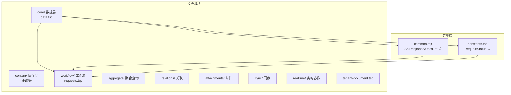
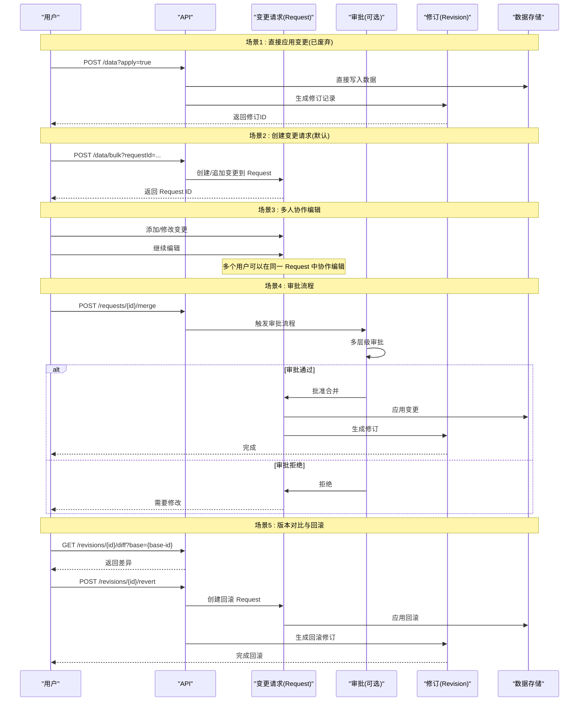
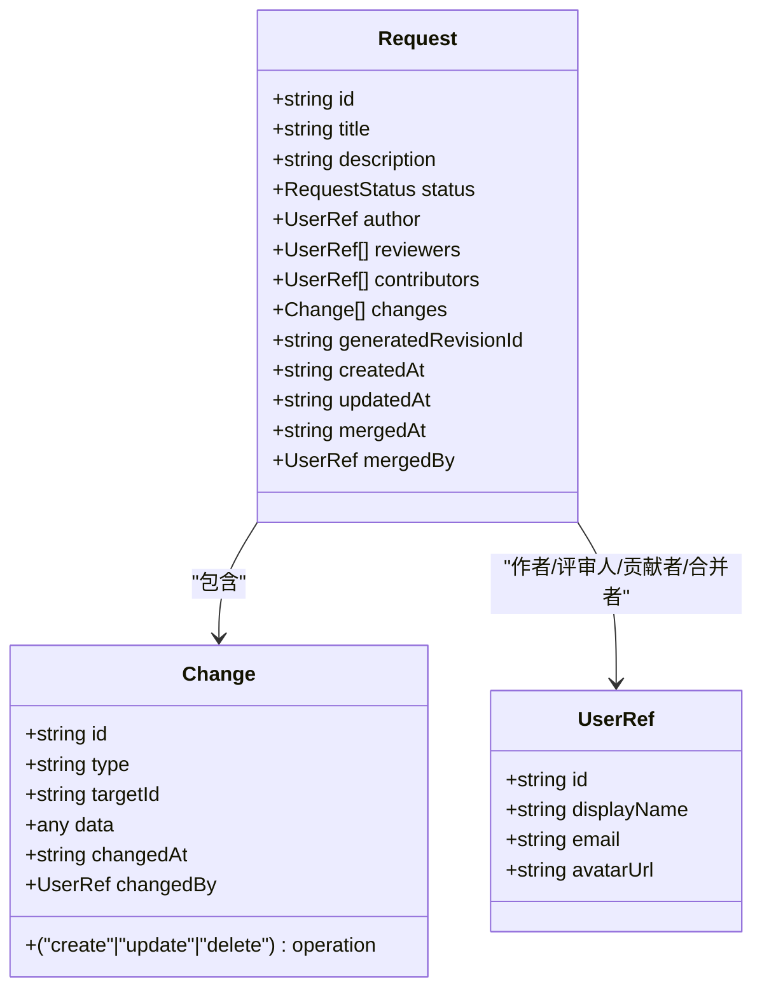
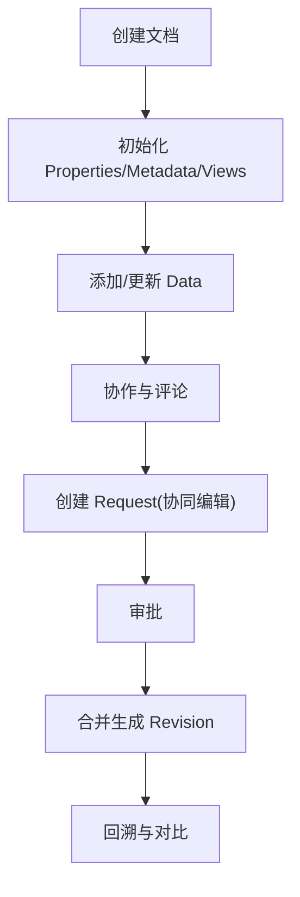
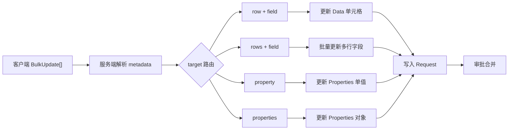
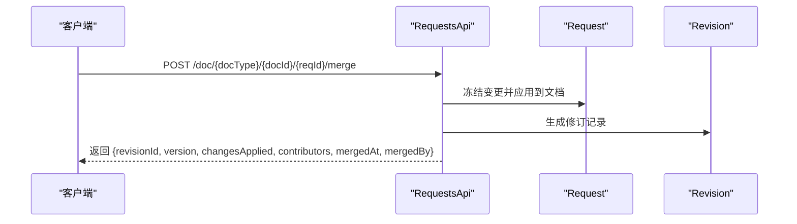
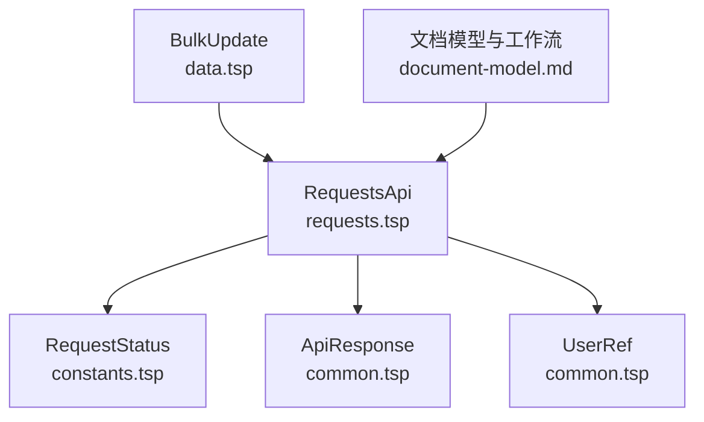

# 变更请求

<cite>
**本文引用的文件**
- [api/document/workflow/requests.tsp](file://api/document/workflow/requests.tsp)
- [api/shared/constants.tsp](file://api/shared/constants.tsp)
- [api/shared/common.tsp](file://api/shared/common.tsp)
- [api/document/core/data.tsp](file://api/document/core/data.tsp)
- [docs-src/guides/document-model.md](file://docs-src/guides/document-model.md)
- [docs-src/guides/data-operations.md](file://docs-src/guides/data-operations.md)
- [docs-src/guides/architecture.md](file://docs-src/guides/architecture.md)
</cite>

## 目录
1. [简介](#简介)
2. [项目结构](#项目结构)
3. [核心组件](#核心组件)
4. [架构总览](#架构总览)
5. [详细组件分析](#详细组件分析)
6. [依赖分析](#依赖分析)
7. [性能考虑](#性能考虑)
8. [故障排查指南](#故障排查指南)
9. [结论](#结论)
10. [附录](#附录)

## 简介
本章节面向使用 nexusbook-api 的开发者，系统性讲解“变更请求（Requests）”能力：如何通过 requestId 强制工作流完成所有写操作，如何使用 createRequest/listRequests/getRequest 等端点管理变更请求，以及合并请求时的变更冻结、应用流程与贡献者记录机制。文档还结合 document-model.md 的生命周期图，完整呈现从 Draft → Edit → Review → Merge 的工作流，并给出携带 requestId 进行数据创建/更新/删除的示例，以及 BulkUpdate 在请求中的应用说明。

## 项目结构
变更请求功能位于文档工作流模块下，核心接口定义于 requests.tsp；状态枚举定义于 constants.tsp；通用响应模型与用户引用类型定义于 common.tsp；数据层的 BulkUpdate 格式定义于 data.tsp；生命周期与工作流说明详见文档模型指南与架构指南。

图表来源
- [api/document/index.tsp](file://api/document/index.tsp#L1-L31)
- [api/document/workflow/requests.tsp](file://api/document/workflow/requests.tsp#L202-L390)
- [api/shared/common.tsp](file://api/shared/common.tsp#L153-L177)
- [api/shared/constants.tsp](file://api/shared/constants.tsp#L12-L31)
- [api/document/core/data.tsp](file://api/document/core/data.tsp#L189-L216)

章节来源
- [api/document/index.tsp](file://api/document/index.tsp#L1-L31)

## 核心组件
- 变更请求模型 Request：包含 id、title、description、status、author、reviewers、contributors、changes、generatedRevisionId、createdAt、updatedAt、mergedAt、mergedBy 等字段，用于承载待合并的变更集合与合并后的修订信息。
- 变更项 Change：描述单条变更，包含 id、type、operation（create/update/delete）、targetId、data、changedAt、changedBy。
- 请求状态 RequestStatus：open/merged/closed 三态流转。
- RequestsApi 接口：提供 listRequests/createRequest/getRequest/mergeRequest/closeRequest/reopenRequest/getRequestConflicts 等端点。
- BulkUpdate：统一的数据/属性批量更新格式，所有写操作均通过 requestId 聚合到变更请求中。

章节来源
- [api/document/workflow/requests.tsp](file://api/document/workflow/requests.tsp#L39-L81)
- [api/document/workflow/requests.tsp](file://api/document/workflow/requests.tsp#L83-L200)
- [api/shared/constants.tsp](file://api/shared/constants.tsp#L12-L31)
- [api/document/workflow/requests.tsp](file://api/document/workflow/requests.tsp#L202-L390)
- [api/document/core/data.tsp](file://api/document/core/data.tsp#L189-L216)

## 架构总览
变更请求工作流围绕“请求（Request）→ 审批（可选）→ 合并（Merge）→ 修订（Revision）”展开。所有写操作（创建/更新/删除/批量更新）必须通过 requestId 聚合到变更请求中，多人可在同一请求上协同编辑；审批通过后，系统冻结请求中的变更，应用到文档并生成修订，记录贡献者与合并信息。

图表来源
- [docs-src/guides/architecture.md](file://docs-src/guides/architecture.md#L254-L304)

章节来源
- [docs-src/guides/architecture.md](file://docs-src/guides/architecture.md#L254-L304)

## 详细组件分析

### 变更请求模型与状态
- Request：承载变更请求的元信息与状态，支持作者、评审人、贡献者、变更集合、生成修订ID、时间戳等。
- Change：描述单条变更，包含变更类型、操作类型、目标ID、变更数据、变更时间与变更人。
- RequestStatus：open/merged/closed 三态，分别表示开放、已合并、已关闭。

图表来源
- [api/document/workflow/requests.tsp](file://api/document/workflow/requests.tsp#L39-L81)
- [api/document/workflow/requests.tsp](file://api/document/workflow/requests.tsp#L83-L200)
- [api/shared/common.tsp](file://api/shared/common.tsp#L617-L653)
- [api/shared/constants.tsp](file://api/shared/constants.tsp#L12-L31)

章节来源
- [api/document/workflow/requests.tsp](file://api/document/workflow/requests.tsp#L39-L81)
- [api/document/workflow/requests.tsp](file://api/document/workflow/requests.tsp#L83-L200)
- [api/shared/constants.tsp](file://api/shared/constants.tsp#L12-L31)
- [api/shared/common.tsp](file://api/shared/common.tsp#L617-L653)

### API 端点与参数说明
- 列出变更请求
  - 方法与路径：GET /doc/{docType}/{docId}/requests
  - 功能：列出文档的未生效变更请求
  - 返回：ApiResponse<Request[]>
- 创建变更请求
  - 方法与路径：POST /doc/{docType}/{docId}/requests
  - 请求体：Request
  - 返回：ApiResponse<Request>
- 获取变更请求详情
  - 方法与路径：GET /doc/{docType}/{docId}/{reqId}
  - 返回：ApiResponse<Request>
- 合并变更请求
  - 方法与路径：POST /doc/{docType}/{docId}/{reqId}/merge
  - 请求体（可选）：message、squash、deleteBranch
  - 返回：ApiResponse<{revisionId, version, changesApplied, contributors, mergedAt, mergedBy}>
- 关闭变更请求
  - 方法与路径：POST /doc/{docType}/{docId}/{reqId}/close
  - 返回：ApiResponse<unknown>
- 重新打开变更请求
  - 方法与路径：POST /doc/{docType}/{docId}/{reqId}/reopen
  - 返回：ApiResponse<unknown>
- 检查冲突
  - 方法与路径：GET /doc/{docType}/{docId}/{reqId}/conflicts
  - 返回：ApiResponse<unknown>

章节来源
- [api/document/workflow/requests.tsp](file://api/document/workflow/requests.tsp#L202-L390)

### 合并选项与行为
- squash：是否将请求中的多个变更合并为单一变更再应用。
- message：合并时的说明信息。
- deleteBranch：合并后是否删除关联分支（与分支概念相关，若无分支概念可忽略）。
- 合并时的系统行为：
  - 冻结请求中的所有变更
  - 应用变更到文档
  - 生成新的修订记录整个变更历史
  - 记录所有贡献者（对请求做过修改的人）
  - 返回生成的修订ID、版本号、应用变更数量、贡献者列表、合并时间与合并者

章节来源
- [api/document/workflow/requests.tsp](file://api/document/workflow/requests.tsp#L245-L347)

### 生命周期与工作流（Draft → Edit → Review → Merge）
- Draft：初始化 Properties/Metadata/Views
- Edit：在 Request 上协作修改 Data/Properties
- Review：审批流程（可选）
- Merge：合并生成 Revision，冻结操作历史
- Audit：通过 Revisions/Operations/Diff 进行审计或回溯

图表来源
- [docs-src/guides/document-model.md](file://docs-src/guides/document-model.md#L771-L822)

章节来源
- [docs-src/guides/document-model.md](file://docs-src/guides/document-model.md#L67-L73)
- [docs-src/guides/document-model.md](file://docs-src/guides/document-model.md#L771-L822)

### requestId 强制工作流与 BulkUpdate
- 所有写操作（创建/更新/删除/批量更新）必须携带 requestId，系统将变更写入对应的变更请求（Request）。多人可在同一 Request 上进行协同编辑；审批通过后变更才生效。
- apply 参数已废弃，统一通过 requestId 工作流进行。
- BulkUpdate 格式：
  - 支持多种 target 指定方式：单行、多行、单字段、多字段、属性、多属性、按条件更新/删除、删除行等。
  - value 可为单值、对象或数组，服务端根据 metadata 自动解析与校验。
  - 可在一次请求中混合更新数据与属性。

图表来源
- [docs-src/guides/data-operations.md](file://docs-src/guides/data-operations.md#L156-L176)
- [api/document/core/data.tsp](file://api/document/core/data.tsp#L189-L216)

章节来源
- [docs-src/guides/data-operations.md](file://docs-src/guides/data-operations.md#L213-L233)
- [api/document/core/data.tsp](file://api/document/core/data.tsp#L189-L216)

### API 调用序列（合并请求）

图表来源
- [api/document/workflow/requests.tsp](file://api/document/workflow/requests.tsp#L245-L347)

## 依赖分析
- RequestsApi 依赖：
  - Request 模型（来自 requests.tsp）
  - RequestStatus 枚举（来自 constants.tsp）
  - ApiResponse 与 UserRef 等通用类型（来自 common.tsp）
- 数据层与变更请求的关系：
  - BulkUpdate 通过 requestId 聚合到 Request，再由合并流程应用到数据层并生成修订。
- 文档模型与工作流：
  - document-model.md 明确“审批先行：所有写入通过 Request，审批通过后生成 Revision 并落库”，与 RequestsApi 的设计一致。

图表来源
- [api/document/workflow/requests.tsp](file://api/document/workflow/requests.tsp#L202-L390)
- [api/shared/constants.tsp](file://api/shared/constants.tsp#L12-L31)
- [api/shared/common.tsp](file://api/shared/common.tsp#L153-L177)
- [api/document/core/data.tsp](file://api/document/core/data.tsp#L189-L216)
- [docs-src/guides/document-model.md](file://docs-src/guides/document-model.md#L52-L60)

章节来源
- [api/document/workflow/requests.tsp](file://api/document/workflow/requests.tsp#L202-L390)
- [api/shared/constants.tsp](file://api/shared/constants.tsp#L12-L31)
- [api/shared/common.tsp](file://api/shared/common.tsp#L153-L177)
- [api/document/core/data.tsp](file://api/document/core/data.tsp#L189-L216)
- [docs-src/guides/document-model.md](file://docs-src/guides/document-model.md#L52-L60)

## 性能考虑
- 优先使用批量更新（BulkUpdate）减少请求次数与网络开销。
- 使用分页与过滤减少传输与处理的数据量。
- 合理设置 pageSize，避免过大响应导致延迟。
- 仅查询需要的字段，降低序列化与传输成本。
- 使用条件更新/删除减少不必要的变更写入。

[本节为通用指导，无需章节来源]

## 故障排查指南
- 常见错误码（与请求相关）：
  - REQUEST_NOT_FOUND：请求不存在
  - REQUEST_CONFLICT：请求冲突
  - REQUEST_ALREADY_CLOSED：请求已关闭
- 合并失败排查：
  - 检查请求状态是否为 open
  - 使用冲突检查端点确认与当前文档是否存在冲突
  - 确认审批流程是否已完成
- 版本冲突：
  - 数据层写操作使用版本号进行乐观锁控制，若版本不匹配将返回冲突错误，需刷新后重试。

章节来源
- [api/shared/common.tsp](file://api/shared/common.tsp#L80-L120)

## 结论
变更请求（Requests）通过 requestId 强制工作流，将所有写操作纳入协同编辑与审批流程，确保变更可审计、可回溯、可合并。配合 BulkUpdate 的灵活 target/value 结构，可在一次请求中完成数据与属性的混合更新。合并时系统冻结变更、应用到文档并生成修订，记录贡献者与合并信息，形成完整的生命周期闭环。

[本节为总结，无需章节来源]

## 附录

### API 端点一览与参数
- 列出变更请求
  - 方法：GET
  - 路径：/doc/{docType}/{docId}/requests
  - 返回：ApiResponse<Request[]>
- 创建变更请求
  - 方法：POST
  - 路径：/doc/{docType}/{docId}/requests
  - 请求体：Request
  - 返回：ApiResponse<Request>
- 获取变更请求详情
  - 方法：GET
  - 路径：/doc/{docType}/{docId}/{reqId}
  - 返回：ApiResponse<Request>
- 合并变更请求
  - 方法：POST
  - 路径：/doc/{docType}/{docId}/{reqId}/merge
  - 请求体（可选）：message、squash、deleteBranch
  - 返回：ApiResponse<{revisionId, version, changesApplied, contributors, mergedAt, mergedBy}>
- 关闭变更请求
  - 方法：POST
  - 路径：/doc/{docType}/{docId}/{reqId}/close
  - 返回：ApiResponse<unknown>
- 重新打开变更请求
  - 方法：POST
  - 路径：/doc/{docType}/{docId}/{reqId}/reopen
  - 返回：ApiResponse<unknown>
- 检查冲突
  - 方法：GET
  - 路径：/doc/{docType}/{docId}/{reqId}/conflicts
  - 返回：ApiResponse<unknown>

章节来源
- [api/document/workflow/requests.tsp](file://api/document/workflow/requests.tsp#L202-L390)

### 生命周期与工作流（基于文档模型）
- Draft：初始化 Properties/Metadata/Views
- Edit：在 Request 上协作修改 Data/Properties
- Review：审批流程（可选）
- Merge：合并生成 Revision，冻结操作历史
- Audit：通过 Revisions/Operations/Diff 进行审计或回溯

章节来源
- [docs-src/guides/document-model.md](file://docs-src/guides/document-model.md#L67-L73)
- [docs-src/guides/document-model.md](file://docs-src/guides/document-model.md#L771-L822)