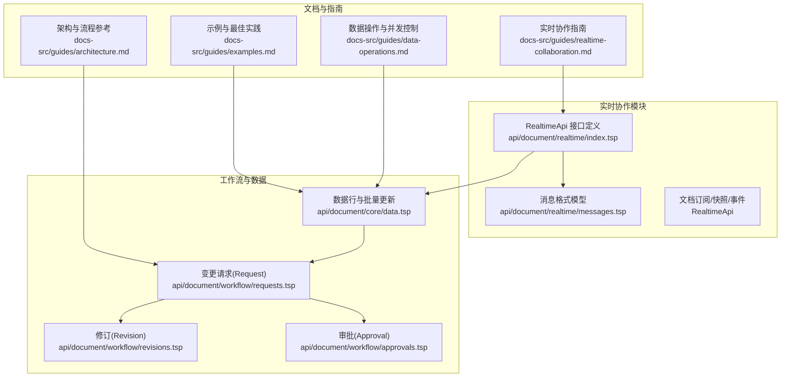
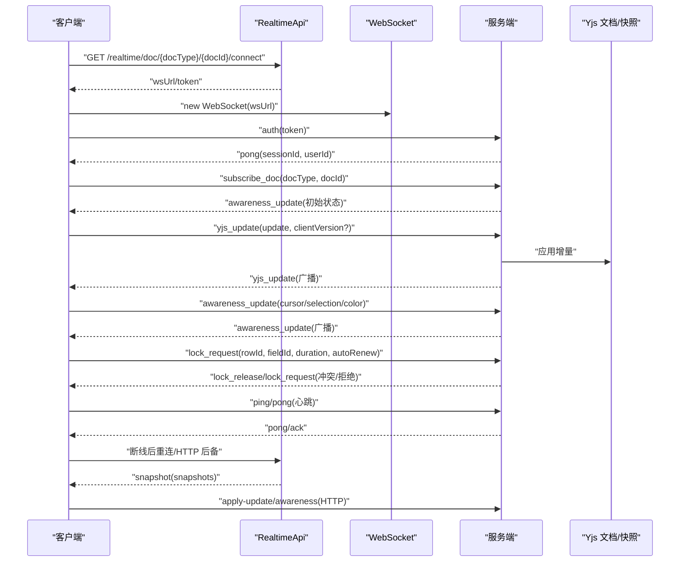
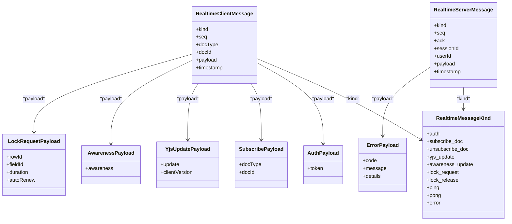
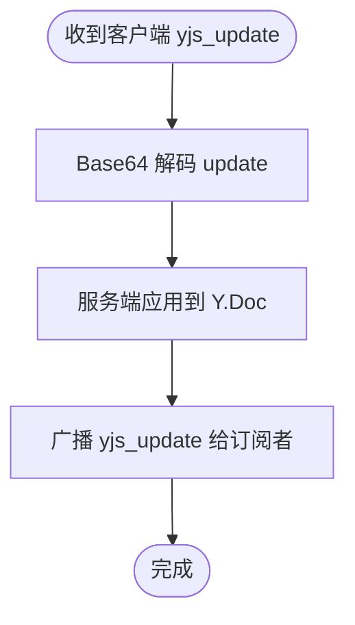
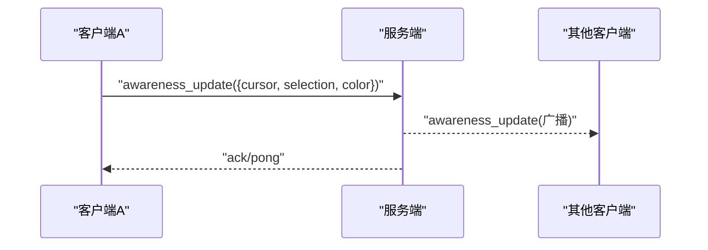
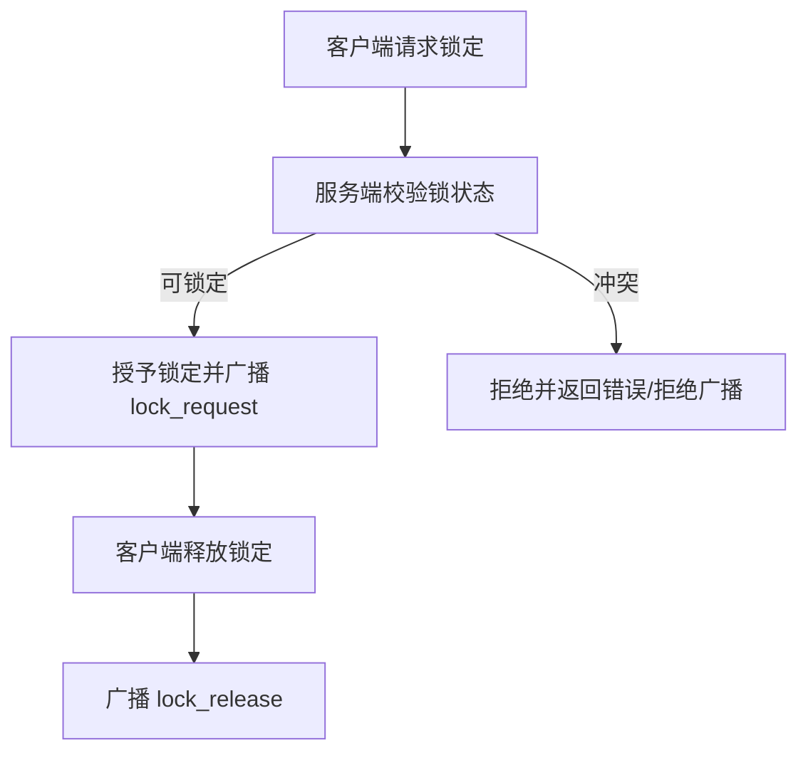
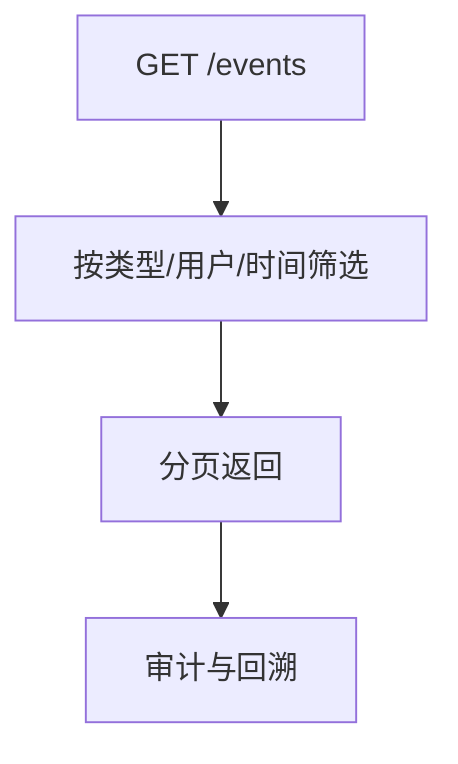
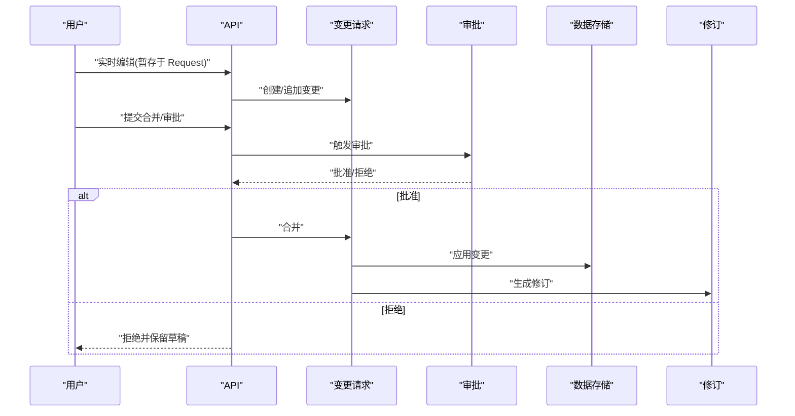
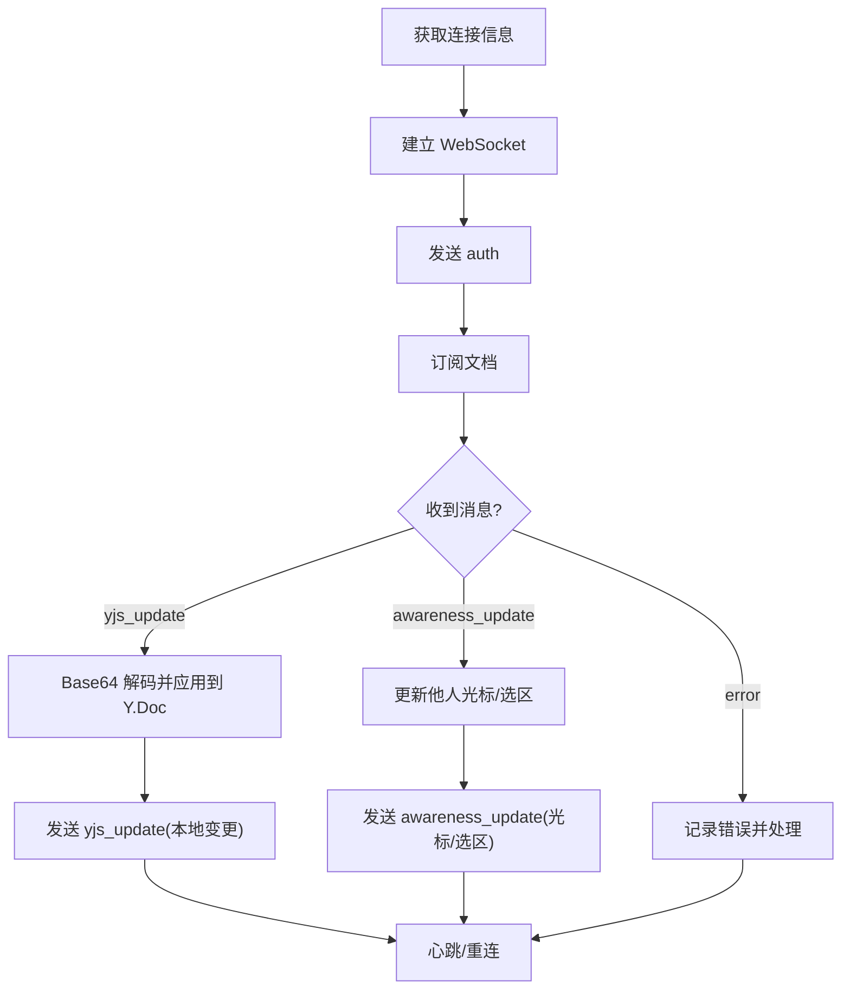
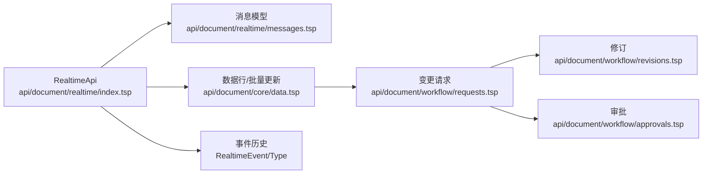

# 实时协作

<cite>
**本文引用的文件**
- [api/document/realtime/index.tsp](file://api/document/realtime/index.tsp)
- [api/document/realtime/messages.tsp](file://api/document/realtime/messages.tsp)
- [docs-src/guides/realtime-collaboration.md](file://docs-src/guides/realtime-collaboration.md)
- [api/document/core/data.tsp](file://api/document/core/data.tsp)
- [api/document/workflow/requests.tsp](file://api/document/workflow/requests.tsp)
- [api/document/workflow/revisions.tsp](file://api/document/workflow/revisions.tsp)
- [api/document/workflow/approvals.tsp](file://api/document/workflow/approvals.tsp)
- [docs-src/guides/architecture.md](file://docs-src/guides/architecture.md)
- [docs-src/guides/data-operations.md](file://docs-src/guides/data-operations.md)
- [docs-src/guides/examples.md](file://docs-src/guides/examples.md)
</cite>

## 目录
1. [简介](#简介)
2. [项目结构](#项目结构)
3. [核心组件](#核心组件)
4. [架构总览](#架构总览)
5. [详细组件分析](#详细组件分析)
6. [依赖关系分析](#依赖关系分析)
7. [性能考虑](#性能考虑)
8. [故障排查指南](#故障排查指南)
9. [结论](#结论)
10. [附录](#附录)

## 简介
本文件面向 nxb-api 的实时协作能力，围绕基于 Yjs 的 CRDT 实时协同、OT（操作变换）冲突解决、WebSocket/SSE 消息通道、操作广播与状态同步、光标与选择共享、以及与变更请求工作流的协同机制进行系统化说明。文档还提供客户端接入要点（连接建立、消息监听、错误处理）与性能优化建议（批处理、网络延迟补偿等）。

## 项目结构
实时协作相关能力主要分布在以下模块：
- 实时 API 定义与消息格式：api/document/realtime/*
- 实时协作指南：docs-src/guides/realtime-collaboration.md
- 数据与变更工作流：api/document/core/data.tsp、api/document/workflow/*
- 架构与流程参考：docs-src/guides/architecture.md、docs-src/guides/data-operations.md、docs-src/guides/examples.md

图表来源
- [api/document/realtime/index.tsp](file://api/document/realtime/index.tsp#L426-L820)
- [api/document/realtime/messages.tsp](file://api/document/realtime/messages.tsp#L1-L154)
- [api/document/core/data.tsp](file://api/document/core/data.tsp#L574-L706)
- [api/document/workflow/requests.tsp](file://api/document/workflow/requests.tsp#L1-L68)
- [api/document/workflow/revisions.tsp](file://api/document/workflow/revisions.tsp#L44-L279)
- [api/document/workflow/approvals.tsp](file://api/document/workflow/approvals.tsp#L96-L156)
- [docs-src/guides/realtime-collaboration.md](file://docs-src/guides/realtime-collaboration.md#L1-L212)
- [docs-src/guides/architecture.md](file://docs-src/guides/architecture.md#L254-L304)
- [docs-src/guides/data-operations.md](file://docs-src/guides/data-operations.md#L227-L293)
- [docs-src/guides/examples.md](file://docs-src/guides/examples.md#L482-L546)

章节来源
- [api/document/realtime/index.tsp](file://api/document/realtime/index.tsp#L426-L820)
- [api/document/realtime/messages.tsp](file://api/document/realtime/messages.tsp#L1-L154)
- [docs-src/guides/realtime-collaboration.md](file://docs-src/guides/realtime-collaboration.md#L1-L212)

## 核心组件
- 实时 API 接口族：提供连接信息、订阅/取消订阅、Yjs 增量更新、Awareness 更新、单元格锁定/解锁、快照获取/保存、事件历史、SSE 事件流、消息模式等。
- WebSocket 消息模型：定义 RealtimeClientMessage、RealtimeServerMessage、RealtimeMessageKind 及各类负载（认证、订阅、Yjs 更新、Awareness、锁定、错误）。
- Yjs 文档与快照：提供 Yjs 状态向量与增量更新的序列化存储，支持快照历史与恢复。
- 在线用户与 Awareness：共享光标、选区、用户颜色等状态，用于实时反馈。
- 单元格锁定：通过 HTTP 或 WS 请求锁定，避免编辑冲突。
- 事件模型：RealtimeEvent 与 RealtimeEventType，用于事件历史与审计。
- 与变更请求工作流协同：实时编辑内容暂存于变更请求，经审批后生效。

章节来源
- [api/document/realtime/index.tsp](file://api/document/realtime/index.tsp#L426-L820)
- [api/document/realtime/messages.tsp](file://api/document/realtime/messages.tsp#L1-L154)
- [docs-src/guides/realtime-collaboration.md](file://docs-src/guides/realtime-collaboration.md#L1-L212)

## 架构总览
实时协作的整体交互路径如下：
- 客户端先调用连接信息接口获取 wsUrl/token，随后建立 WebSocket 连接。
- 发送认证消息，认证成功后订阅文档。
- 实时广播：Yjs 增量更新与 Awareness 状态双向广播。
- 单元格锁定：客户端请求锁定，服务端校验并广播锁定/解锁事件。
- 断线重连：心跳 ping/pong，失败后指数退避重连，必要时使用 HTTP 后备接口。
- 与工作流协同：实时编辑内容进入变更请求，审批通过后合并生效。

图表来源
- [api/document/realtime/index.tsp](file://api/document/realtime/index.tsp#L426-L820)
- [api/document/realtime/messages.tsp](file://api/document/realtime/messages.tsp#L1-L154)
- [docs-src/guides/realtime-collaboration.md](file://docs-src/guides/realtime-collaboration.md#L1-L212)

## 详细组件分析

### WebSocket 消息通道与协议
- 消息类型：认证(auth)、订阅/取消订阅(subscribe_doc/unsubscribe_doc)、Yjs 增量更新(yjs_update)、Awareness 更新(awareness_update)、单元格锁定请求(lock_request/lock_release)、心跳(ping/pong)、错误(error)。
- 客户端消息帧包含 kind、seq、docType/docId、payload、timestamp；服务端消息帧包含 kind、seq、ack、sessionId、userId、payload、timestamp。
- 认证：客户端发送 token；成功返回 pong 并下发 sessionId/userId；失败返回 error。
- 订阅：客户端订阅目标文档，服务端返回初始 Awareness 状态。
- Yjs 增量：客户端发送 Base64 编码的 update；服务端广播给同订阅者。
- Awareness：双向更新，包含 cursor/selection/color 等。
- 锁定：客户端请求锁定，服务端校验冲突后广播 lock_request/lock_release。
- 心跳：建议 15 秒 ping/pong；断线后指数退避重连；失败时使用 HTTP 后备接口。

图表来源
- [api/document/realtime/messages.tsp](file://api/document/realtime/messages.tsp#L1-L154)

章节来源
- [api/document/realtime/messages.tsp](file://api/document/realtime/messages.tsp#L1-L154)
- [docs-src/guides/realtime-collaboration.md](file://docs-src/guides/realtime-collaboration.md#L62-L115)

### Yjs 与 OT 冲突解决
- Yjs 基于 CRDT，天然支持无冲突并发编辑；服务端接收客户端 Yjs 增量更新后，应用到 Y.Doc 并广播给订阅者。
- 客户端建议在本地也应用增量更新，以获得一致的视图。
- 文档提供了快照接口，支持保存与获取 Yjs 快照（stateVector + update），用于断线恢复与对齐。
- 与传统 OT 的区别在于：Yjs 通过因果关系与操作合并实现最终一致性，无需显式操作变换；但在协作编辑中仍需结合业务规则（如单元格锁定）避免冲突。

图表来源
- [docs-src/guides/realtime-collaboration.md](file://docs-src/guides/realtime-collaboration.md#L117-L124)
- [api/document/realtime/index.tsp](file://api/document/realtime/index.tsp#L611-L657)

章节来源
- [docs-src/guides/realtime-collaboration.md](file://docs-src/guides/realtime-collaboration.md#L117-L124)
- [api/document/realtime/index.tsp](file://api/document/realtime/index.tsp#L611-L657)

### Awareness 状态与光标共享
- Awareness 包含 cursor、selection、editingCell、color 等字段，用于实时显示他人光标位置与选区。
- 服务端广播 awareness_update，客户端更新 UI。
- 与单元格锁定结合：当 editingCell 与锁状态冲突时，服务端可拒绝广播或返回错误。

图表来源
- [docs-src/guides/realtime-collaboration.md](file://docs-src/guides/realtime-collaboration.md#L125-L130)
- [api/document/realtime/messages.tsp](file://api/document/realtime/messages.tsp#L81-L85)

章节来源
- [docs-src/guides/realtime-collaboration.md](file://docs-src/guides/realtime-collaboration.md#L125-L130)
- [api/document/realtime/messages.tsp](file://api/document/realtime/messages.tsp#L81-L85)

### 单元格锁定与冲突控制
- 客户端可通过 HTTP 或 WS 请求锁定单元格；服务端返回 lock_request/lock_release。
- 锁定包含 rowId、fieldId、duration、autoRenew 等；查询锁定接口返回当前活跃锁。
- 与 Awareness 结合：editingCell 可用于提示当前编辑位置，冲突时拒绝广播或返回错误。

图表来源
- [docs-src/guides/realtime-collaboration.md](file://docs-src/guides/realtime-collaboration.md#L131-L140)
- [api/document/realtime/index.tsp](file://api/document/realtime/index.tsp#L520-L593)
- [api/document/realtime/messages.tsp](file://api/document/realtime/messages.tsp#L88-L93)

章节来源
- [api/document/realtime/index.tsp](file://api/document/realtime/index.tsp#L520-L593)
- [api/document/realtime/messages.tsp](file://api/document/realtime/messages.tsp#L88-L93)
- [docs-src/guides/realtime-collaboration.md](file://docs-src/guides/realtime-collaboration.md#L131-L140)

### 实时事件历史与审计
- 提供事件历史接口，支持按事件类型、用户、时间范围筛选。
- 事件类型包括 yjs_update、awareness_update、user_joined、user_left、cell_locked、cell_unlocked、cursor_moved、selection_changed、comment_added、data_changed 等。
- data_changed 可与变更请求关联，便于审计与追溯。

图表来源
- [api/document/realtime/index.tsp](file://api/document/realtime/index.tsp#L734-L755)
- [api/document/realtime/index.tsp](file://api/document/realtime/index.tsp#L258-L322)

章节来源
- [api/document/realtime/index.tsp](file://api/document/realtime/index.tsp#L734-L755)
- [api/document/realtime/index.tsp](file://api/document/realtime/index.tsp#L258-L322)

### 与变更请求工作流的协同机制
- 实时编辑内容暂存于变更请求（Request）中，不直接写入数据存储。
- 审批通过后，Request 合并生效，生成修订（Revision）。
- 事件历史中 data_changed 可标注与 Request 的关联 ID，便于审计。
- 架构流程参考“数据流与工作流”。

图表来源
- [docs-src/guides/architecture.md](file://docs-src/guides/architecture.md#L254-L304)
- [docs-src/guides/realtime-collaboration.md](file://docs-src/guides/realtime-collaboration.md#L168-L173)
- [api/document/workflow/requests.tsp](file://api/document/workflow/requests.tsp#L1-L68)
- [api/document/workflow/revisions.tsp](file://api/document/workflow/revisions.tsp#L44-L279)
- [api/document/workflow/approvals.tsp](file://api/document/workflow/approvals.tsp#L96-L156)

章节来源
- [docs-src/guides/architecture.md](file://docs-src/guides/architecture.md#L254-L304)
- [docs-src/guides/realtime-collaboration.md](file://docs-src/guides/realtime-collaboration.md#L168-L173)
- [api/document/workflow/requests.tsp](file://api/document/workflow/requests.tsp#L1-L68)
- [api/document/workflow/revisions.tsp](file://api/document/workflow/revisions.tsp#L44-L279)
- [api/document/workflow/approvals.tsp](file://api/document/workflow/approvals.tsp#L96-L156)

### 客户端接入要点与示例
- 连接建立：调用连接信息接口获取 wsUrl 与 token，建立 WebSocket 连接。
- 认证：发送 auth 消息，携带 token；成功后订阅文档。
- 订阅：发送 subscribe_doc，开始接收 yjs_update 与 awareness_update。
- 发送更新：将 Yjs update Base64 编码后发送 yjs_update。
- 监听消息：onmessage 中根据 kind 分发处理（yjs_update、awareness_update、error）。
- 错误处理：收到 error 时记录并提示；必要时断线重连或降级为 HTTP 后备。
- 断线重连：心跳 ping/pong；断线后指数退避重连；失败使用 HTTP 后备接口 apply-update/awareness；重连后拉取最新快照并对齐状态向量。

图表来源
- [docs-src/guides/realtime-collaboration.md](file://docs-src/guides/realtime-collaboration.md#L1-L212)
- [api/document/realtime/messages.tsp](file://api/document/realtime/messages.tsp#L1-L154)

章节来源
- [docs-src/guides/realtime-collaboration.md](file://docs-src/guides/realtime-collaboration.md#L174-L201)
- [api/document/realtime/messages.tsp](file://api/document/realtime/messages.tsp#L1-L154)

## 依赖关系分析
- RealtimeApi 依赖消息模型（RealtimeClientMessage/RealtimeServerMessage/RealtimeMessageKind）。
- RealtimeApi 与数据模块（批量更新、行管理）存在协作：实时编辑内容进入变更请求，最终合并生效。
- 工作流模块（Request/Revision/Approval）与实时事件（data_changed）形成闭环，便于审计与回溯。

图表来源
- [api/document/realtime/index.tsp](file://api/document/realtime/index.tsp#L426-L820)
- [api/document/realtime/messages.tsp](file://api/document/realtime/messages.tsp#L1-L154)
- [api/document/core/data.tsp](file://api/document/core/data.tsp#L574-L706)
- [api/document/workflow/requests.tsp](file://api/document/workflow/requests.tsp#L1-L68)
- [api/document/workflow/revisions.tsp](file://api/document/workflow/revisions.tsp#L44-L279)
- [api/document/workflow/approvals.tsp](file://api/document/workflow/approvals.tsp#L96-L156)

章节来源
- [api/document/realtime/index.tsp](file://api/document/realtime/index.tsp#L426-L820)
- [api/document/realtime/messages.tsp](file://api/document/realtime/messages.tsp#L1-L154)
- [api/document/core/data.tsp](file://api/document/core/data.tsp#L574-L706)
- [api/document/workflow/requests.tsp](file://api/document/workflow/requests.tsp#L1-L68)
- [api/document/workflow/revisions.tsp](file://api/document/workflow/revisions.tsp#L44-L279)
- [api/document/workflow/approvals.tsp](file://api/document/workflow/approvals.tsp#L96-L156)

## 性能考虑
- 操作批处理：优先使用批量更新接口，减少网络往返与服务端压力。
- 网络延迟补偿：合理设置心跳间隔（建议 15 秒），在弱网环境下适当增大；断线重连采用指数退避。
- 增量传输：Yjs 增量更新仅传输变更，避免全量同步；Base64 编解码在客户端完成。
- 快照对齐：断线重连后拉取最新快照并对齐状态向量，缩短恢复时间。
- 速率限制：建议每用户最大会话数与每秒最大消息数，防止滥用。
- 并发控制：数据写操作采用乐观锁（version）避免冲突；实时编辑内容走变更请求，降低直接写入带来的竞争。

章节来源
- [docs-src/guides/realtime-collaboration.md](file://docs-src/guides/realtime-collaboration.md#L141-L167)
- [docs-src/guides/data-operations.md](file://docs-src/guides/data-operations.md#L227-L293)
- [docs-src/guides/examples.md](file://docs-src/guides/examples.md#L482-L546)

## 故障排查指南
- 认证失败：检查 token 是否正确、是否过期；查看 error 消息中的 code/message。
- 订阅失败：确认 docType/docId 是否有效；检查权限范围。
- Yjs 更新失败：确认 update Base64 编码正确；检查 clientVersion 是否匹配。
- Awareness 更新异常：检查 payload 结构是否符合 cursor/selection/color 约束。
- 单元格锁定冲突：检查 lock_request 是否与现有锁冲突；必要时释放锁或延长自动续期。
- 断线重连：观察 ping/pong 心跳；失败后启用 HTTP 后备接口 apply-update/awareness；重连后拉取快照恢复。
- 事件历史：使用事件历史接口定位 data_changed 与 Request 关联 ID，辅助审计与回溯。

章节来源
- [api/document/realtime/messages.tsp](file://api/document/realtime/messages.tsp#L95-L103)
- [docs-src/guides/realtime-collaboration.md](file://docs-src/guides/realtime-collaboration.md#L141-L167)
- [api/document/realtime/index.tsp](file://api/document/realtime/index.tsp#L734-L755)

## 结论
nxb-api 的实时协作以 Yjs CRDT 为核心，结合 Awareness、单元格锁定与事件历史，实现了高可用的多人协作体验。通过 WebSocket 消息通道与 HTTP 后备接口，系统在强网与弱网环境下均具备良好的稳定性。实时编辑内容通过变更请求工作流进行暂存与审批，确保变更可控、可审计、可回溯。配合批处理、网络延迟补偿与速率限制等性能策略，可在大规模并发下保持稳定与高效。

## 附录
- 客户端接入要点清单
  - 获取连接信息：wsUrl、token、expiresAt
  - 建立 WebSocket 连接并发送 auth
  - 订阅文档：subscribe_doc
  - 发送 yjs_update 与 awareness_update
  - 监听 error 并处理
  - 断线重连与 HTTP 后备
  - 快照恢复与状态向量对齐

章节来源
- [docs-src/guides/realtime-collaboration.md](file://docs-src/guides/realtime-collaboration.md#L1-L212)
- [api/document/realtime/messages.tsp](file://api/document/realtime/messages.tsp#L1-L154)