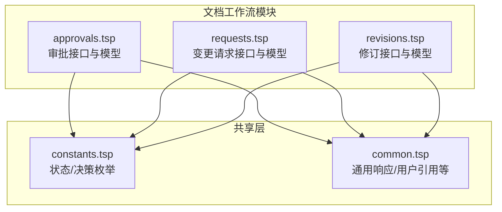
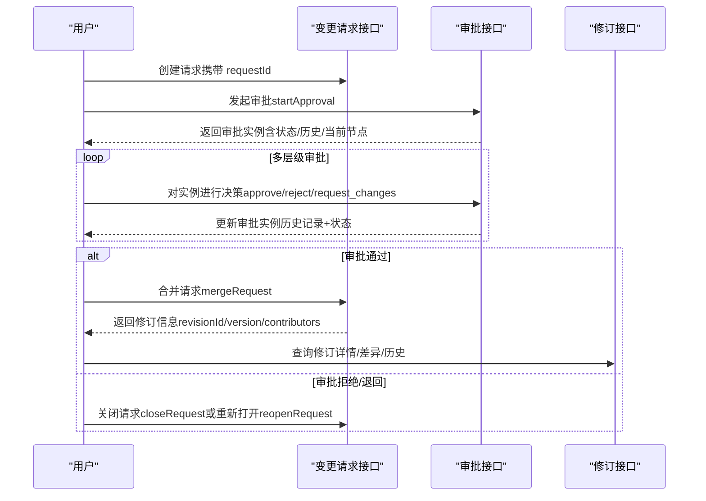
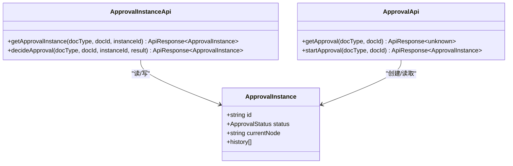
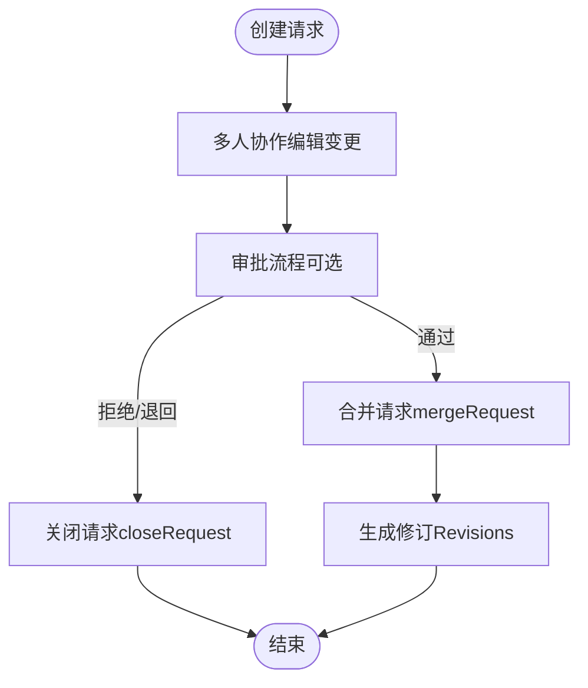
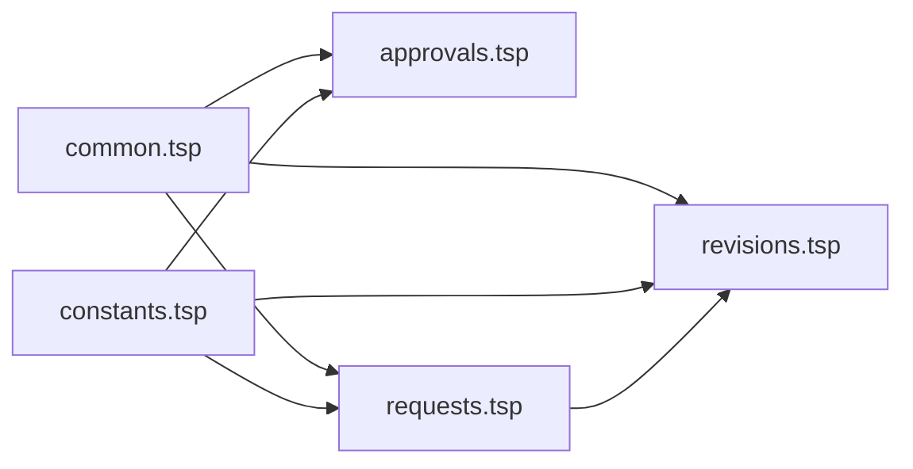

# 审批工作流

<cite>
**本文引用的文件**
- [approvals.tsp](file://api/document/workflow/approvals.tsp)
- [requests.tsp](file://api/document/workflow/requests.tsp)
- [revisions.tsp](file://api/document/workflow/revisions.tsp)
- [constants.tsp](file://api/shared/constants.tsp)
- [common.tsp](file://api/shared/common.tsp)
- [document-model.md](file://docs-src/guides/document-model.md)
- [WEBHOOK_GUIDE.md](file://api/extensions/webhooks/WEBHOOK_GUIDE.md)
- [webhooks.md](file://docs-src/guides/webhooks.md)
</cite>

## 目录
1. [简介](#简介)
2. [项目结构](#项目结构)
3. [核心组件](#核心组件)
4. [架构总览](#架构总览)
5. [详细组件分析](#详细组件分析)
6. [依赖关系分析](#依赖关系分析)
7. [性能与可扩展性](#性能与可扩展性)
8. [故障排查指南](#故障排查指南)
9. [结论](#结论)
10. [附录：API 与配置示例](#附录api-与配置示例)

## 简介
本文件面向 nxb-api 的审批工作流（Approvals）能力，系统性说明审批流程如何与变更请求（Requests）集成，如何启用 requiresApproval 配置项，以及多层级审批机制的设计与执行逻辑。文档还覆盖审批通过后自动触发合并生成修订的完整流程，审批拒绝与退回的处理机制及其对变更请求状态的影响，并结合文档模型的工作流图，给出从创建请求到审批通过的完整路径。最后提供配置文档级审批规则与查询审批状态的 API 示例。

## 项目结构
审批工作流位于文档工作流子模块下，与变更请求、修订历史紧密耦合，共享通用类型与常量定义。

图表来源
- [approvals.tsp](file://api/document/workflow/approvals.tsp#L1-L156)
- [requests.tsp](file://api/document/workflow/requests.tsp#L1-L391)
- [revisions.tsp](file://api/document/workflow/revisions.tsp#L1-L547)
- [constants.tsp](file://api/shared/constants.tsp#L1-L86)
- [common.tsp](file://api/shared/common.tsp#L1-L200)

章节来源
- [approvals.tsp](file://api/document/workflow/approvals.tsp#L1-L156)
- [requests.tsp](file://api/document/workflow/requests.tsp#L1-L391)
- [revisions.tsp](file://api/document/workflow/revisions.tsp#L1-L547)
- [constants.tsp](file://api/shared/constants.tsp#L1-L86)
- [common.tsp](file://api/shared/common.tsp#L1-L200)

## 核心组件
- 审批实例模型与接口：定义审批状态、历史记录、节点信息，提供获取审批、发起审批、查询实例、审批决策等接口。
- 变更请求模型与接口：定义请求状态、作者、评审人、贡献者、变更集、生成修订等，提供创建、合并、关闭、重新打开、冲突检查等接口。
- 修订模型与接口：定义修订版本、源请求、贡献者、变更操作、统计、前后修订关系等，提供列表、详情、操作列表、差异对比、历史查询、回滚、导出等接口。
- 状态与决策枚举：集中定义请求状态、审批状态、审批决策，确保跨模块一致。
- 通用类型：统一响应格式、分页、用户引用等。

章节来源
- [approvals.tsp](file://api/document/workflow/approvals.tsp#L40-L155)
- [requests.tsp](file://api/document/workflow/requests.tsp#L83-L200)
- [revisions.tsp](file://api/document/workflow/revisions.tsp#L158-L314)
- [constants.tsp](file://api/shared/constants.tsp#L13-L86)
- [common.tsp](file://api/shared/common.tsp#L153-L203)

## 架构总览
审批工作流与变更请求、修订历史的协作关系如下：

图表来源
- [approvals.tsp](file://api/document/workflow/approvals.tsp#L96-L155)
- [requests.tsp](file://api/document/workflow/requests.tsp#L202-L390)
- [revisions.tsp](file://api/document/workflow/revisions.tsp#L323-L546)

章节来源
- [approvals.tsp](file://api/document/workflow/approvals.tsp#L96-L155)
- [requests.tsp](file://api/document/workflow/requests.tsp#L202-L390)
- [revisions.tsp](file://api/document/workflow/revisions.tsp#L323-L546)

## 详细组件分析

### 审批模块（Approvals）
- 审批状态：pending、approved、rejected、canceled。
- 审批决策：approve、reject、request_changes。
- 审批实例模型包含：实例ID、状态、当前节点、历史记录（节点ID、操作人、决策、备注、时间戳）。
- 接口：
  - 获取审批：查询审批流程定义或实例概述。
  - 发起审批：在文档上启动审批流程，返回审批实例。
  - 获取审批实例：查询审批实例详情。
  - 审批决策：对审批实例进行通过/拒绝/要求修改的决策。

图表来源
- [approvals.tsp](file://api/document/workflow/approvals.tsp#L40-L155)
- [constants.tsp](file://api/shared/constants.tsp#L37-L86)

章节来源
- [approvals.tsp](file://api/document/workflow/approvals.tsp#L40-L155)
- [constants.tsp](file://api/shared/constants.tsp#L37-L86)

### 变更请求模块（Requests）
- 请求状态：open、merged、closed。
- 请求模型包含：ID、标题、描述、状态、作者、评审人、贡献者、变更集、生成的修订ID、时间戳、合并者等。
- 接口：
  - 列出请求、创建请求、获取请求详情。
  - 合并请求：将变更应用到文档并生成修订，返回修订ID、版本、应用变更数量、贡献者、合并时间与合并者。
  - 关闭/重新打开请求。
  - 检查与当前文档的冲突。

图表来源
- [requests.tsp](file://api/document/workflow/requests.tsp#L202-L390)
- [revisions.tsp](file://api/document/workflow/revisions.tsp#L323-L546)

章节来源
- [requests.tsp](file://api/document/workflow/requests.tsp#L83-L200)
- [requests.tsp](file://api/document/workflow/requests.tsp#L202-L390)

### 修订模块（Revisions）
- 修订模型包含：修订ID、版本号、源请求ID、标题/描述、主要贡献者、合并者、变更操作集合、统计、时间戳、前置修订ID等。
- 接口：
  - 列表、详情、操作列表、差异对比、历史查询、回滚、查询源请求、导出。

章节来源
- [revisions.tsp](file://api/document/workflow/revisions.tsp#L158-L314)
- [revisions.tsp](file://api/document/workflow/revisions.tsp#L323-L546)

### 审批与请求的集成
- 审批通过后，通常由评审人或管理员触发合并请求，系统将冻结请求中的变更并应用到文档，生成修订。
- 审批拒绝或退回时，请求保持 open 状态，评审人可要求修改（request_changes），或直接关闭（closed）。

章节来源
- [requests.tsp](file://api/document/workflow/requests.tsp#L244-L347)
- [approvals.tsp](file://api/document/workflow/approvals.tsp#L141-L155)

### 多层级审批机制
- 审批实例包含历史记录数组，每条历史记录包含节点ID、操作人、决策、备注、时间戳。
- 当前节点（currentNode）用于标识当前所处审批阶段。
- 决策支持 approve、reject、request_changes，分别对应通过、拒绝、要求修改。
- 审批状态包含 pending、approved、rejected、canceled，用于反映整体流程状态。

章节来源
- [approvals.tsp](file://api/document/workflow/approvals.tsp#L40-L94)
- [constants.tsp](file://api/shared/constants.tsp#L37-L86)

### 审批通过后自动触发合并生成修订
- 审批完成后，调用合并接口（mergeRequest）将请求中的变更应用到文档并生成修订。
- 合并接口返回修订ID、版本号、应用变更数量、贡献者、合并时间与合并者。
- 修订接口可用于后续审计、对比与回滚。

章节来源
- [requests.tsp](file://api/document/workflow/requests.tsp#L285-L347)
- [revisions.tsp](file://api/document/workflow/revisions.tsp#L323-L546)

### 审批拒绝与退回的处理机制
- 审批决策支持 reject 与 request_changes。
- 拒绝后通常关闭请求（closed），退回时可要求修改（request_changes），随后重新进入评审流程。
- 关闭/重新打开接口用于管理请求生命周期。

章节来源
- [constants.tsp](file://api/shared/constants.tsp#L66-L86)
- [requests.tsp](file://api/document/workflow/requests.tsp#L350-L390)
- [approvals.tsp](file://api/document/workflow/approvals.tsp#L141-L155)

### 与文档模型工作流图的对应
- 文档模型工作流强调“审批先行”，所有写入通过 Request，审批通过后生成 Revision 并落库。
- 审批工作流与该原则一致：变更必须在 Request 中协作编辑，经审批后合并生成修订。

章节来源
- [document-model.md](file://docs-src/guides/document-model.md#L52-L70)

## 依赖关系分析
- 审批模块依赖通用状态枚举（RequestStatus、ApprovalStatus、ApprovalDecision）与通用响应格式。
- 变更请求模块同样依赖这些枚举与通用响应格式。
- 修订模块依赖请求模块（源请求ID）与通用响应格式。

图表来源
- [common.tsp](file://api/shared/common.tsp#L153-L203)
- [constants.tsp](file://api/shared/constants.tsp#L13-L86)
- [approvals.tsp](file://api/document/workflow/approvals.tsp#L1-L156)
- [requests.tsp](file://api/document/workflow/requests.tsp#L1-L391)
- [revisions.tsp](file://api/document/workflow/revisions.tsp#L1-L547)

章节来源
- [common.tsp](file://api/shared/common.tsp#L153-L203)
- [constants.tsp](file://api/shared/constants.tsp#L13-L86)
- [approvals.tsp](file://api/document/workflow/approvals.tsp#L1-L156)
- [requests.tsp](file://api/document/workflow/requests.tsp#L1-L391)
- [revisions.tsp](file://api/document/workflow/revisions.tsp#L1-L547)

## 性能与可扩展性
- 审批历史记录按时间顺序累积，建议在查询审批实例详情时限制历史记录数量或分页。
- 合并请求时，系统会冻结请求中的变更并生成修订，建议在大规模变更场景下启用 squashing 以减少修订体量。
- 差异对比与历史查询支持分页与过滤，有助于在大数据量场景下提升性能。

章节来源
- [approvals.tsp](file://api/document/workflow/approvals.tsp#L125-L155)
- [requests.tsp](file://api/document/workflow/requests.tsp#L285-L347)
- [revisions.tsp](file://api/document/workflow/revisions.tsp#L323-L546)

## 故障排查指南
- 审批相关错误码：APPROVAL_NOT_FOUND、APPROVAL_INVALID_STATE、APPROVAL_DECISION_REQUIRED。
- 请求相关错误码：REQUEST_NOT_FOUND、REQUEST_CONFLICT、REQUEST_ALREADY_CLOSED。
- 建议排查步骤：
  - 确认审批实例是否存在且处于有效状态。
  - 确认请求状态为 open 且未被关闭。
  - 确认合并请求时未出现冲突。
  - 若审批决策缺失，需补充决策后再尝试合并。

章节来源
- [common.tsp](file://api/shared/common.tsp#L80-L152)
- [requests.tsp](file://api/document/workflow/requests.tsp#L377-L390)
- [approvals.tsp](file://api/document/workflow/approvals.tsp#L141-L155)

## 结论
审批工作流通过审批实例与历史记录实现多层级审批，与变更请求和修订历史形成闭环：变更在 Request 中协作编辑，经审批后合并生成修订，支持审计、对比与回滚。requiresApproval 配置项可强制启用审批流程，确保关键操作合规。通过 Webhook 可订阅审批事件，实现外部系统的自动化联动。

## 附录：API 与配置示例

### 启用 requiresApproval 配置项
- 文档设置中包含 workflow.requiresApproval 与 approvers 字段，用于启用审批并指定审批人。
- 示例配置（JSON 结构）：
  - requiresApproval: true
  - approvers: ["user-manager"]

章节来源
- [document-model.md](file://docs-src/guides/document-model.md#L554-L586)

### 查询审批状态的 API
- 获取审批流程定义或实例概述
  - 方法：GET
  - 路径：/api/v1/doc/{docType}/{docId}/approval
  - 响应：ApiResponse<unknown>
- 发起审批
  - 方法：POST
  - 路径：/api/v1/doc/{docType}/{docId}/approval/start
  - 响应：ApiResponse<ApprovalInstance>
- 获取审批实例详情
  - 方法：GET
  - 路径：/api/v1/doc/{docType}/{docId}/approval/{instanceId}
  - 响应：ApiResponse<ApprovalInstance>
- 对审批实例进行决策
  - 方法：POST
  - 路径：/api/v1/doc/{docType}/{docId}/approval/{instanceId}/decision?result={approve|reject|request_changes}
  - 响应：ApiResponse<ApprovalInstance>

章节来源
- [approvals.tsp](file://api/document/workflow/approvals.tsp#L96-L155)

### 审批通过后合并生成修订的 API
- 合并请求
  - 方法：POST
  - 路径：/api/v1/doc/{docType}/{docId}/requests/{reqId}/merge
  - 请求体（可选）：message、squash、deleteBranch
  - 响应：ApiResponse<{ revisionId, version, changesApplied, contributors, mergedAt, mergedBy }>
- 查询修订详情/差异/历史
  - 方法：GET
  - 路径：/api/v1/doc/{docType}/{docId}/revisions/{revId}
  - 路径：/api/v1/doc/{docType}/{docId}/revisions/{revId}/diff?base={revId}
  - 路径：/api/v1/doc/{docType}/{docId}/revisions/history?targetKind=row&rowId={rowId}

章节来源
- [requests.tsp](file://api/document/workflow/requests.tsp#L285-L347)
- [revisions.tsp](file://api/document/workflow/revisions.tsp#L323-L546)

### 审批拒绝与退回的 API
- 关闭请求
  - 方法：POST
  - 路径：/api/v1/doc/{docType}/{docId}/requests/{reqId}/close
- 重新打开请求
  - 方法：POST
  - 路径：/api/v1/doc/{docType}/{docId}/requests/{reqId}/reopen
- 审批决策（reject/request_changes）
  - 方法：POST
  - 路径：/api/v1/doc/{docType}/{docId}/approval/{instanceId}/decision?result={reject|request_changes}

章节来源
- [requests.tsp](file://api/document/workflow/requests.tsp#L350-L390)
- [approvals.tsp](file://api/document/workflow/approvals.tsp#L141-L155)

### Webhook 事件参考
- 审批相关事件：approval_started、approval_approved、approval_rejected、approval_canceled、approval_node_completed
- 载荷包含：event、timestamp、webhookId、deliveryId、docType、docId、triggeredBy、payload（含实例ID、状态、当前节点、审批人、决策、备注、完成时间等）

章节来源
- [WEBHOOK_GUIDE.md](file://api/extensions/webhooks/WEBHOOK_GUIDE.md#L40-L80)
- [webhooks.md](file://docs-src/guides/webhooks.md#L50-L91)