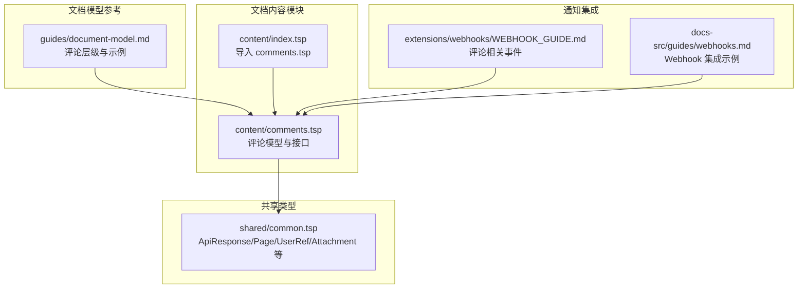
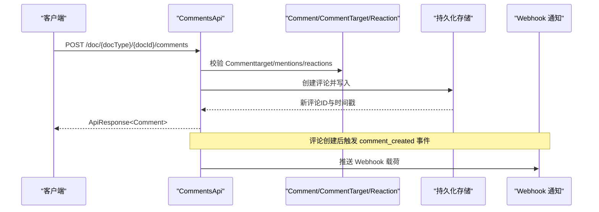
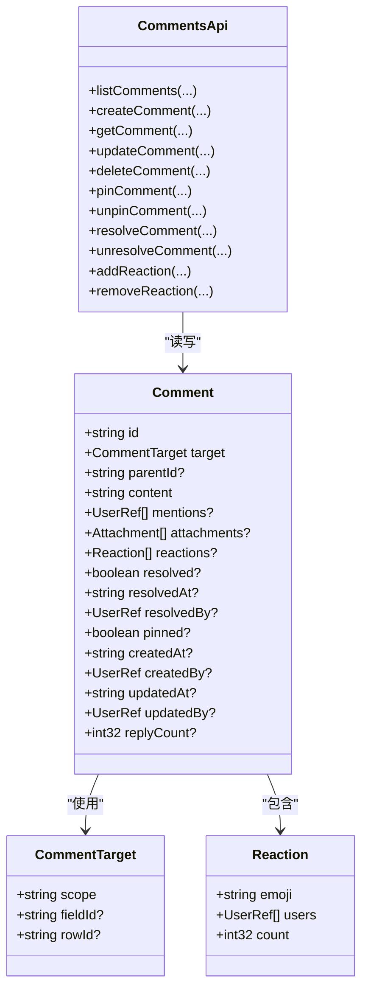

# 评论系统

<cite>
**本文引用的文件**
- [comments.tsp](file://api/document/content/comments.tsp)
- [index.tsp](file://api/document/content/index.tsp)
- [common.tsp](file://api/shared/common.tsp)
- [document-model.md](file://docs-src/guides/document-model.md)
- [WEBHOOK_GUIDE.md](file://api/extensions/webhooks/WEBHOOK_GUIDE.md)
- [webhooks.md](file://docs-src/guides/webhooks.md)
</cite>

## 目录
1. [简介](#简介)
2. [项目结构](#项目结构)
3. [核心组件](#核心组件)
4. [架构总览](#架构总览)
5. [详细组件分析](#详细组件分析)
6. [依赖分析](#依赖分析)
7. [性能考虑](#性能考虑)
8. [故障排查指南](#故障排查指南)
9. [结论](#结论)
10. [附录](#附录)

## 简介
本文件面向 NexusBook API 的评论系统，围绕 Comments 模型与 CommentsApi 接口，系统性阐述以下主题：
- 如何通过 target.scope、fieldId、rowId 等字段实现文档、字段、行、单元格四级精确定位
- 线程化评论机制（parentId）的实现方式与嵌套结构处理
- 表情反应（reactions）的数据结构设计与增删改操作
- 已解决状态（resolved）的业务意义与 UI 呈现建议
- 结合文档模型示例，给出创建文档级、行级、单元格级评论的完整 API 调用路径
- 评论查询的分页策略与过滤条件
- 评论通知机制的集成建议（基于现有 Webhook 事件）

## 项目结构
评论系统位于文档内容模块下，采用 TypeSpec 定义统一的评论模型与 API 接口，并通过共享类型提供通用响应与分页能力。

图表来源
- [index.tsp](file://api/document/content/index.tsp#L1-L13)
- [comments.tsp](file://api/document/content/comments.tsp#L1-L40)
- [common.tsp](file://api/shared/common.tsp#L153-L203)
- [document-model.md](file://docs-src/guides/document-model.md#L354-L410)
- [WEBHOOK_GUIDE.md](file://api/extensions/webhooks/WEBHOOK_GUIDE.md#L72-L111)
- [webhooks.md](file://docs-src/guides/webhooks.md#L83-L121)

章节来源
- [index.tsp](file://api/document/content/index.tsp#L1-L13)
- [comments.tsp](file://api/document/content/comments.tsp#L1-L40)

## 核心组件
- 评论目标定位器（CommentTarget）
  - scope：支持 "document"、"field"、"row"、"cell"
  - fieldId：当 scope 为 field 或 cell 时必填
  - rowId：当 scope 为 row 或 cell 时必填
- 统一评论模型（Comment）
  - target：定位评论位置
  - parentId：回复其他评论形成线程
  - content：富文本内容
  - mentions：@提及用户集合
  - attachments：附件集合
  - reactions：表情反应集合
  - resolved/resolvedAt/resolvedBy：已解决标记与信息
  - pinned：置顶标记
  - createdAt/createdBy/updatedAt/updatedBy：元信息
  - replyCount：直接回复数
- 表情反应（Reaction）
  - emoji：表情代码
  - users：反应用户集合
  - count：反应数量
- 评论 API（CommentsApi）
  - listComments：按位置与线程过滤查询
  - createComment：创建评论（含回复）
  - getComment：获取评论详情
  - updateComment：更新评论
  - deleteComment：删除评论（连同回复）
  - pinComment/unpinComment：置顶/取消置顶
  - resolveComment/unresolveComment：标记已解决/取消
  - addReaction/removeReaction：添加/移除表情反应

章节来源
- [comments.tsp](file://api/document/content/comments.tsp#L43-L99)
- [comments.tsp](file://api/document/content/comments.tsp#L108-L237)
- [comments.tsp](file://api/document/content/comments.tsp#L246-L471)
- [common.tsp](file://api/shared/common.tsp#L153-L203)

## 架构总览
评论系统通过 CommentsApi 暴露 REST 接口，统一使用 Comment 模型承载评论生命周期与协作能力。查询与分页遵循通用 Page 结构，通知通过 Webhook 事件推送。

图表来源
- [comments.tsp](file://api/document/content/comments.tsp#L246-L376)
- [common.tsp](file://api/shared/common.tsp#L153-L203)
- [WEBHOOK_GUIDE.md](file://api/extensions/webhooks/WEBHOOK_GUIDE.md#L72-L111)

## 详细组件分析

### 评论模型与定位语义
- target.scope
  - "document"：对整个文档进行讨论
  - "field"：针对某字段的讨论，需提供 fieldId
  - "row"：针对某一行的讨论，需提供 rowId
  - "cell"：针对某单元格的讨论，需提供 rowId 与 fieldId
- fieldId、rowId
  - 用于在多层级定位中精确锁定目标
  - 与文档模型中的字段与行概念一致，确保评论与数据结构对齐
- parentId
  - 若存在，表示该评论是对另一条评论的回复，形成讨论线程
  - 删除评论会级联删除其所有回复（见接口注释）

章节来源
- [comments.tsp](file://api/document/content/comments.tsp#L43-L75)
- [comments.tsp](file://api/document/content/comments.tsp#L122-L131)
- [comments.tsp](file://api/document/content/comments.tsp#L360-L376)

### 线程化评论与嵌套结构
- 线程化评论通过 parentId 建立父子关系
- 嵌套结构处理建议
  - 展示时按 createdAt/updatedAt 排序，支持展开/折叠
  - 递归渲染子评论，避免无限深度导致的性能问题
  - 限制最大嵌套层级或采用“查看更多回复”分页加载
- 删除行为
  - 删除父评论时，应级联删除其所有子评论，保证数据一致性

章节来源
- [comments.tsp](file://api/document/content/comments.tsp#L122-L131)
- [comments.tsp](file://api/document/content/comments.tsp#L360-L376)

### 表情反应（reactions）数据结构与操作
- 数据结构
  - emoji：表情代码（如 👍、❤️ 等）
  - users：对该表情做出反应的用户集合
  - count：该表情的总次数
- 增删改操作
  - 添加反应：POST /doc/{docType}/{docId}/comments/{commentId}/reactions?emoji=...
  - 移除反应：DELETE /doc/{docType}/{docId}/comments/{commentId}/reactions/{emoji}
- UI 建议
  - 展示每个表情的总数与参与者头像
  - 支持一键切换自己的反应（添加/移除）
  - 对重复点击进行去抖处理，避免频繁请求

章节来源
- [comments.tsp](file://api/document/content/comments.tsp#L81-L99)
- [comments.tsp](file://api/document/content/comments.tsp#L447-L471)

### 已解决状态（resolved）的业务意义与 UI 呈现
- 业务意义
  - 标记评论及其讨论线程为已解决，便于追踪问题闭环
  - 可记录 resolvedAt 与 resolvedBy，形成审计线索
- UI 建议
  - 在评论卡片上展示“已解决”状态与解决人信息
  - 可将已解决评论置灰或加横线，降低视觉权重
  - 提供“标记为已解决/取消解决”的快捷按钮

章节来源
- [comments.tsp](file://api/document/content/comments.tsp#L169-L204)
- [comments.tsp](file://api/document/content/comments.tsp#L408-L437)

### API 调用示例（结合文档模型示例）
以下示例基于文档模型中的示例与 CommentsApi 接口，展示如何创建不同层级的评论。请将占位符替换为真实值。

- 创建文档级评论
  - 方法与路径：POST /doc/{docType}/{docId}/comments
  - 请求体要点：target.scope = "document"
  - 参考示例路径：[文档模型示例（文档级评论）](file://docs-src/guides/document-model.md#L412-L423)

- 创建行级评论
  - 方法与路径：POST /doc/{docType}/{docId}/comments
  - 请求体要点：target.scope = "row"，target.rowId = "{rowId}"
  - 参考示例路径：[文档模型示例（行级评论）](file://docs-src/guides/document-model.md#L424-L433)

- 创建单元格级评论
  - 方法与路径：POST /doc/{docType}/{docId}/comments
  - 请求体要点：target.scope = "cell"，target.rowId = "{rowId}"，target.fieldId = "{fieldId}"
  - 参考示例路径：[文档模型示例（单元格评论）](file://docs-src/guides/document-model.md#L434-L444)

- 回复评论（线程）
  - 方法与路径：POST /doc/{docType}/{docId}/comments
  - 请求体要点：parentId = "{commentId}"（对已有评论的回复）
  - 参考示例路径：[文档模型示例（回复评论）](file://docs-src/guides/document-model.md#L445-L451)

- 添加表情反应
  - 方法与路径：POST /doc/{docType}/{docId}/comments/{commentId}/reactions?emoji=👍
  - 参考示例路径：[文档模型示例（添加反应）](file://docs-src/guides/document-model.md#L452-L457)

章节来源
- [comments.tsp](file://api/document/content/comments.tsp#L246-L376)
- [document-model.md](file://docs-src/guides/document-model.md#L412-L457)

### 评论查询的分页策略与过滤条件
- 过滤条件
  - scope：document/field/row/cell
  - fieldId：当 scope 为 field 或 cell 时
  - rowId：当 scope 为 row 或 cell 时
  - parentId：指定评论的回复
- 分页参数
  - page/pageSize：与通用 Page 结构配合使用
  - 响应结构：ApiResponse<Page<Comment>>
- 建议
  - 默认 pageSize 控制在合理范围（例如 20~50），避免一次性拉取过多数据
  - 对深层线程评论采用“展开加载更多回复”的交互模式
  - 对高频查询建立索引（scope、rowId、fieldId、parentId）

章节来源
- [comments.tsp](file://api/document/content/comments.tsp#L271-L282)
- [common.tsp](file://api/shared/common.tsp#L179-L203)

### 评论通知机制集成建议
- 可用事件
  - comment_created：创建评论
  - comment_updated：更新评论
  - comment_deleted：删除评论
  - comment_resolved：标记已解决
  - comment_mentioned：@提及用户
- Webhook 集成步骤
  - 在平台配置 Webhook，获取密钥与回调地址
  - 服务端接收事件后，验证签名（使用提供的示例代码）
  - 根据事件类型触发内部流程（如发送邮件、站内信、Slack 集成等）
- 参考示例
  - 事件类型与载荷示例：[Webhook 指南（评论事件）](file://api/extensions/webhooks/WEBHOOK_GUIDE.md#L72-L111)
  - Webhook 集成示例（Express）：[Webhook 集成示例](file://docs-src/guides/webhooks.md#L235-L319)

章节来源
- [WEBHOOK_GUIDE.md](file://api/extensions/webhooks/WEBHOOK_GUIDE.md#L72-L111)
- [webhooks.md](file://docs-src/guides/webhooks.md#L83-L121)
- [webhooks.md](file://docs-src/guides/webhooks.md#L235-L319)

## 依赖分析
- CommentsApi 依赖共享类型
  - ApiResponse<T>：统一响应包装
  - Page<T>：分页结构
  - UserRef/Attachment：用户引用与附件
- 评论模型依赖
  - CommentTarget：定位器
  - Reaction：表情反应
- 文档模型参考
  - 文档模型中对 Comments 的层级定位与示例，为 API 使用提供上下文

图表来源
- [comments.tsp](file://api/document/content/comments.tsp#L43-L99)
- [comments.tsp](file://api/document/content/comments.tsp#L108-L237)
- [comments.tsp](file://api/document/content/comments.tsp#L246-L471)
- [common.tsp](file://api/shared/common.tsp#L153-L203)

章节来源
- [comments.tsp](file://api/document/content/comments.tsp#L43-L237)
- [common.tsp](file://api/shared/common.tsp#L153-L203)

## 性能考虑
- 分页与游标
  - 使用 page/pageSize 控制列表规模
  - 对深分页场景建议引入游标（cursor）以提升稳定性
- 线程深度控制
  - 限制嵌套层级，避免过深树形渲染导致卡顿
- 查询优化
  - 为 scope、rowId、fieldId、parentId 建立复合索引
  - 对高频过滤字段增加覆盖索引
- 附件与富文本
  - 附件数量与大小应受控，避免影响列表加载性能
  - 富文本内容建议延迟加载或懒渲染

[本节为通用指导，无需特定文件来源]

## 故障排查指南
- 常见错误码
  - COMMENT_NOT_FOUND：评论不存在
  - PAGE_OUT_OF_RANGE：分页超出范围
- 排查步骤
  - 确认请求参数：scope、fieldId、rowId、parentId 是否符合目标层级
  - 检查权限：仅评论创建者或管理员可编辑/删除
  - 校验响应：使用 ApiResponse 结构核对 success/code/message/payload
- 建议的日志
  - 记录关键操作（创建/更新/删除/置顶/解决/反应）与触发用户
  - 记录异常错误码与堆栈信息，便于定位问题

章节来源
- [common.tsp](file://api/shared/common.tsp#L80-L152)
- [comments.tsp](file://api/document/content/comments.tsp#L271-L282)

## 结论
评论系统通过统一的 Comment 模型与 CommentsApi，实现了文档、字段、行、单元格四级精确定位，支持线程化讨论、表情反应、置顶与已解决标记，并通过 Webhook 提供通知集成能力。结合合理的分页策略与索引设计，可在大规模协作场景中保持良好的性能与用户体验。

[本节为总结，无需特定文件来源]

## 附录
- 相关文档与示例
  - 文档模型与评论示例：[文档模型](file://docs-src/guides/document-model.md#L354-L457)
  - Webhook 事件与集成示例：[Webhook 指南](file://api/extensions/webhooks/WEBHOOK_GUIDE.md#L72-L111)，[Webhook 集成示例](file://docs-src/guides/webhooks.md#L235-L319)

[本节为补充材料，无需特定文件来源]