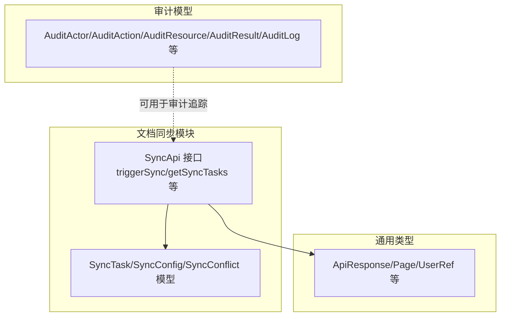
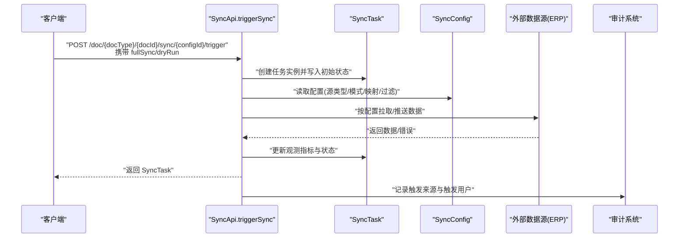
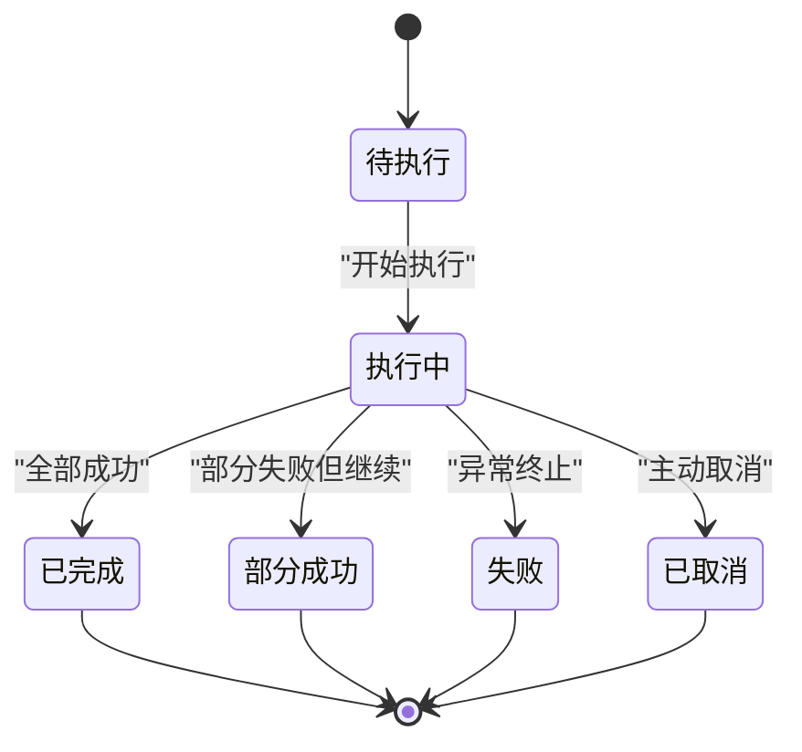
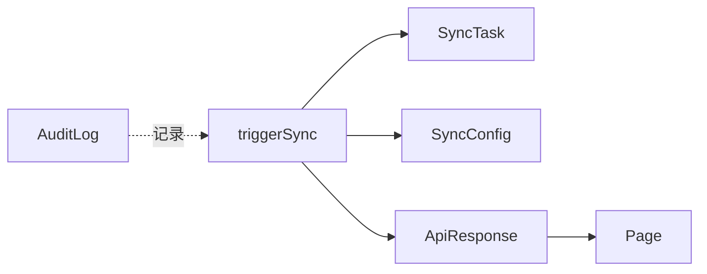

# 同步任务执行

<cite>
**本文引用的文件**
- [api/document/sync/index.tsp](file://api/document/sync/index.tsp)
- [api/shared/common.tsp](file://api/shared/common.tsp)
- [api/audit/models.tsp](file://api/audit/models.tsp)
- [docs-src/guides/examples.md](file://docs-src/guides/examples.md)
</cite>

## 目录
1. [简介](#简介)
2. [项目结构](#项目结构)
3. [核心组件](#核心组件)
4. [架构概览](#架构概览)
5. [详细组件分析](#详细组件分析)
6. [依赖分析](#依赖分析)
7. [性能考虑](#性能考虑)
8. [故障排查指南](#故障排查指南)
9. [结论](#结论)
10. [附录](#附录)

## 简介
本文件面向使用 nexusbook-api 的开发者与运维人员，聚焦“同步任务执行”的完整工作流与可观测性指标。重点包括：
- 如何通过 triggerSync 接口手动触发同步任务，以及 fullSync 与 dryRun 参数的使用场景
- SyncTask 模型的状态机与关键监控指标
- 触发来源（triggeredBy）与触发用户（triggeredUser）的审计追踪
- 从 ERP 系统导出订单数据的实际调用示例
- 如何通过 getSyncTasks 分页查询任务历史

## 项目结构
同步能力由文档模块下的同步子模块提供，核心接口与数据模型集中在同步接口定义文件中；通用响应与分页模型位于公共类型文件；审计模型位于审计模块。

图表来源
- [api/document/sync/index.tsp](file://api/document/sync/index.tsp#L560-L823)
- [api/shared/common.tsp](file://api/shared/common.tsp#L153-L203)
- [api/audit/models.tsp](file://api/audit/models.tsp#L136-L245)

章节来源
- [api/document/sync/index.tsp](file://api/document/sync/index.tsp#L560-L823)
- [api/shared/common.tsp](file://api/shared/common.tsp#L153-L203)
- [api/audit/models.tsp](file://api/audit/models.tsp#L136-L245)

## 核心组件
- SyncApi 接口族：提供同步配置管理、手动触发、任务历史查询、任务详情、取消任务、冲突查询与解决、连接测试等能力。
- SyncTask 模型：描述一次同步任务的生命周期与观测指标。
- SyncConfig 模型：描述同步配置，包括数据源类型、同步模式、增量策略、定时计划等。
- SyncConflict 模型：描述同步冲突，用于人工介入解决。
- 公共类型：ApiResponse、Page、UserRef 等，统一响应格式与分页结构。
- 审计模型：用于审计追踪与合规记录。

章节来源
- [api/document/sync/index.tsp](file://api/document/sync/index.tsp#L560-L823)
- [api/shared/common.tsp](file://api/shared/common.tsp#L153-L203)
- [api/audit/models.tsp](file://api/audit/models.tsp#L136-L245)

## 架构概览
下图展示了“手动触发同步任务”的典型调用链路与关键数据流转。

图表来源
- [api/document/sync/index.tsp](file://api/document/sync/index.tsp#L654-L674)
- [api/document/sync/index.tsp](file://api/document/sync/index.tsp#L366-L474)
- [api/audit/models.tsp](file://api/audit/models.tsp#L136-L245)

## 详细组件分析

### triggerSync 手动触发同步
- 路径与方法：POST /doc/{docType}/{docId}/sync/{configId}/trigger
- 请求体参数：
  - fullSync: boolean（是否忽略增量设置，进行全量同步）
  - dryRun: boolean（是否仅检查，不实际执行同步）
- 响应：SyncTask 对象，包含任务状态、观测指标、触发来源与触发用户等

使用场景建议
- fullSync：当需要强制重建目标系统的数据一致性时使用，例如修复历史偏差或迁移后对账。
- dryRun：在正式执行前预检，评估影响范围与潜在冲突，避免生产风险。

章节来源
- [api/document/sync/index.tsp](file://api/document/sync/index.tsp#L654-L674)

### SyncTask 状态机与观测指标
- 状态枚举（SyncTaskStatus）：pending、running、completed、failed、cancelled、partial
- 关键观测指标（SyncTask 字段）：
  - startedAt/completedAt：任务开始与结束时间
  - recordsProcessed/recordsSucceeded/recordsFailed/recordsCreated/recordsUpdated/recordsDeleted/recordsConflicted：处理/成功/失败/新增/更新/删除/冲突记录数
  - errorMessage/errorDetails：错误信息与详情
  - logs：任务日志数组
  - triggeredBy：触发来源（manual、schedule、webhook、api）
  - triggeredUser：触发用户（UserRef）

状态流转示意

图表来源
- [api/document/sync/index.tsp](file://api/document/sync/index.tsp#L172-L208)
- [api/document/sync/index.tsp](file://api/document/sync/index.tsp#L366-L474)

章节来源
- [api/document/sync/index.tsp](file://api/document/sync/index.tsp#L172-L208)
- [api/document/sync/index.tsp](file://api/document/sync/index.tsp#L366-L474)

### 触发来源与审计追踪（triggeredBy 与 triggeredUser）
- triggeredBy：manual（手动）、schedule（定时）、webhook（Webhook）、api（API）
- triggeredUser：UserRef（id/displayName/email/avatarUrl 等）
- 审计模型（AuditActor/AuditAction/AuditResource/AuditResult/AuditLog）可用于将同步任务纳入统一审计体系，记录操作者、操作类别、资源、结果与上下文信息。

章节来源
- [api/document/sync/index.tsp](file://api/document/sync/index.tsp#L463-L474)
- [api/audit/models.tsp](file://api/audit/models.tsp#L136-L245)

### 从 ERP 系统导出订单数据的实际调用示例
- 场景：将订单数据从系统导出至 ERP
- 建议步骤：
  1) 在文档中配置同步配置（SyncConfig），设置 sourceType 为 ERP 相关类型、同步模式为 one_way_export 或 bidirectional
  2) 使用 triggerSync 接口手动触发导出，必要时开启 fullSync 保证全量覆盖
  3) 通过 getSyncTasks 分页查询任务历史，核对 recordsProcessed/recordsSucceeded/recordsFailed 等指标
  4) 若出现冲突，使用 getSyncConflicts 与 resolveSyncConflict 进行人工干预

参考示例（批量导出与 CSV 导出的思路可类比用于 ERP 导出）
- 批量导出示例路径：[docs-src/guides/examples.md](file://docs-src/guides/examples.md#L409-L451)

章节来源
- [api/document/sync/index.tsp](file://api/document/sync/index.tsp#L560-L823)
- [docs-src/guides/examples.md](file://docs-src/guides/examples.md#L409-L451)

### 通过 getSyncTasks 分页查询任务历史
- 路径与方法：GET /doc/{docType}/{docId}/sync/{configId}/tasks
- 查询参数：
  - status：筛选特定状态的任务
  - page/pageSize：分页控制
- 响应：Page<SyncTask>，包含 items、page、pageSize、total

章节来源
- [api/document/sync/index.tsp](file://api/document/sync/index.tsp#L684-L694)
- [api/shared/common.tsp](file://api/shared/common.tsp#L179-L203)

## 依赖分析
- SyncApi 依赖：
  - SyncTask/SyncConfig/SyncConflict 模型
  - ApiResponse/Page/UserRef 等通用类型
  - 审计模型（可选，用于审计追踪）
- 数据流向：
  - 触发 → 读取配置 → 访问外部数据源 → 更新任务观测指标与状态 → 返回任务结果
- 审计集成：
  - 可将 triggeredBy/triggeredUser 等信息写入审计日志，形成合规与审计闭环

图表来源
- [api/document/sync/index.tsp](file://api/document/sync/index.tsp#L560-L823)
- [api/shared/common.tsp](file://api/shared/common.tsp#L153-L203)
- [api/audit/models.tsp](file://api/audit/models.tsp#L136-L245)

章节来源
- [api/document/sync/index.tsp](file://api/document/sync/index.tsp#L560-L823)
- [api/shared/common.tsp](file://api/shared/common.tsp#L153-L203)
- [api/audit/models.tsp](file://api/audit/models.tsp#L136-L245)

## 性能考虑
- 增量同步：通过 SyncConfig.incremental 与 SyncTask.recordsProcessed 等指标配合，减少不必要的全量扫描
- 并行与批处理：在客户端侧对大量数据采用分页与批量处理策略，降低单次请求压力
- 干运行（dryRun）：在执行前预检，避免无效 IO 与网络往返
- 定时与触发策略：合理设置 schedule 与 manual 触发频率，避免并发冲突

## 故障排查指南
- 常见问题定位
  - 任务状态长期停留在 pending/running：检查外部数据源连通性与凭据
  - recordsFailed 较高：结合 errorDetails 与 logs 定位具体失败条目
  - 冲突频繁：通过 getSyncConflicts 与 resolveSyncConflict 介入，必要时调整冲突解决策略
- 审计与溯源
  - 通过 triggeredBy/triggeredUser 快速定位责任人与触发来源
  - 将关键操作写入审计日志，便于合规审计与复盘

章节来源
- [api/document/sync/index.tsp](file://api/document/sync/index.tsp#L366-L474)
- [api/audit/models.tsp](file://api/audit/models.tsp#L136-L245)

## 结论
本文围绕 nexusbook-api 的同步任务执行提供了从接口使用、状态机与观测指标、审计追踪到实际导出场景与历史查询的完整说明。建议在生产环境中结合 dryRun、增量同步与审计日志，确保同步过程可控、可观测、可追溯。

## 附录
- 接口与模型参考路径
  - [SyncApi 接口定义](file://api/document/sync/index.tsp#L560-L823)
  - [SyncTask 模型](file://api/document/sync/index.tsp#L366-L474)
  - [SyncConfig 模型](file://api/document/sync/index.tsp#L214-L360)
  - [SyncConflict 模型](file://api/document/sync/index.tsp#L476-L558)
  - [ApiResponse/Page/UserRef](file://api/shared/common.tsp#L153-L203)
  - [审计模型](file://api/audit/models.tsp#L136-L245)
- 实际导出示例参考
  - [批量导出示例](file://docs-src/guides/examples.md#L409-L451)