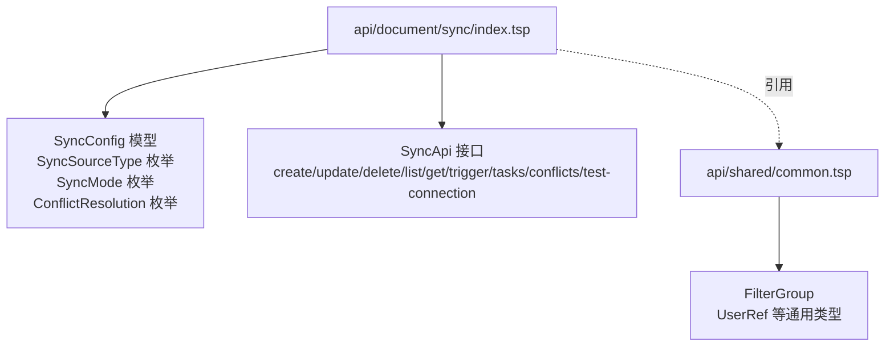
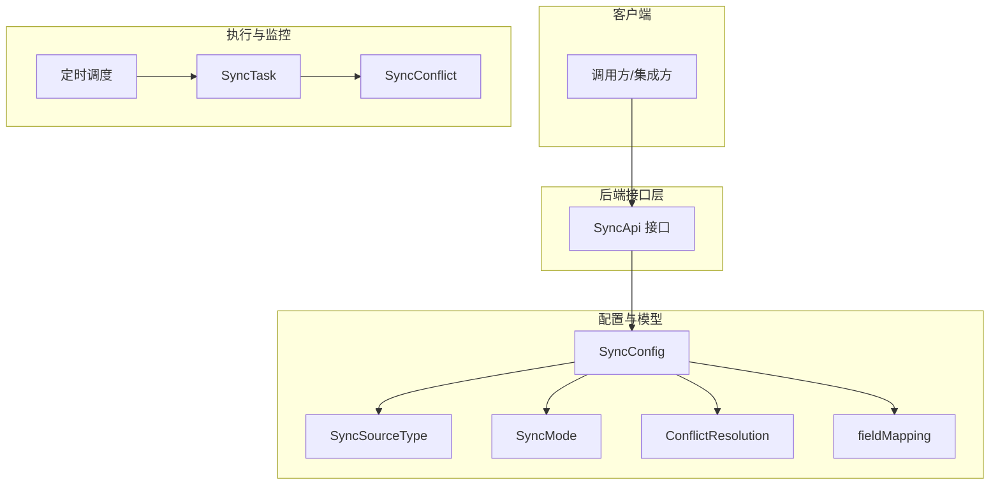
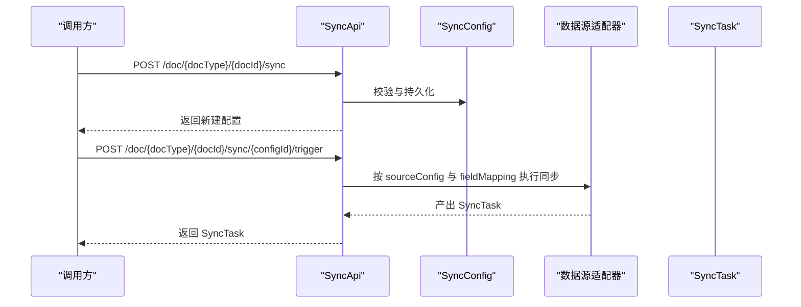
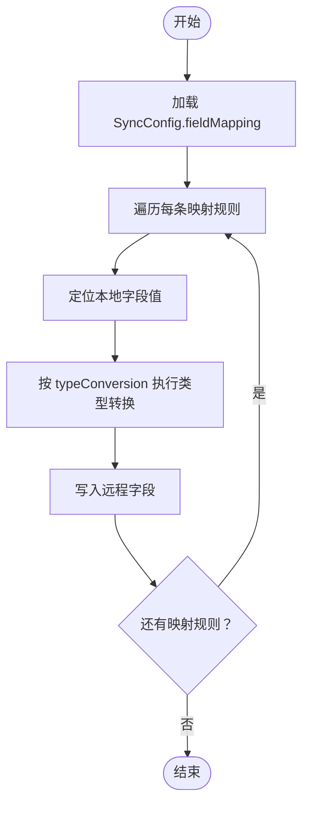
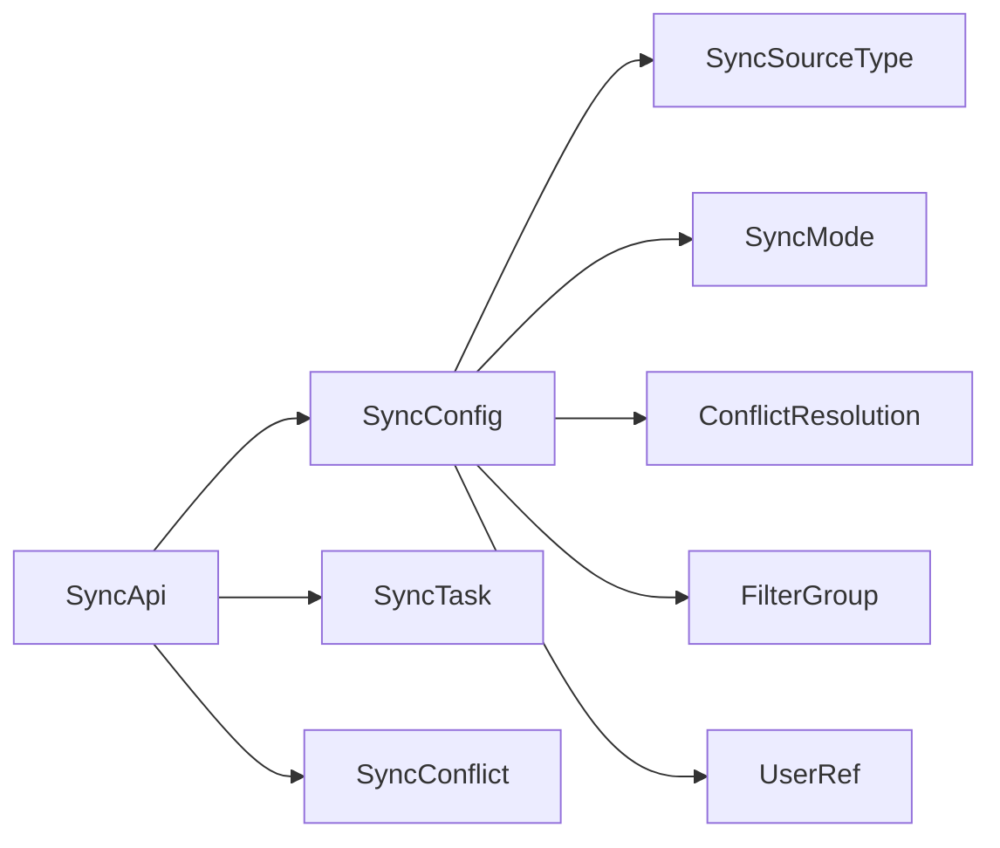

# 同步配置管理

<cite>
**本文引用的文件**
- [api/document/sync/index.tsp](file://api/document/sync/index.tsp)
- [api/shared/common.tsp](file://api/shared/common.tsp)
</cite>

## 目录
1. [简介](#简介)
2. [项目结构](#项目结构)
3. [核心组件](#核心组件)
4. [架构概览](#架构概览)
5. [详细组件分析](#详细组件分析)
6. [依赖分析](#依赖分析)
7. [性能考虑](#性能考虑)
8. [故障排查指南](#故障排查指南)
9. [结论](#结论)
10. [附录](#附录)

## 简介
本文件面向 nxb-sync（nexusbook-api 的文档同步能力）的使用者与维护者，系统化梳理“同步配置管理”的模型、接口与实践。重点覆盖以下方面：
- SyncConfig 模型字段定义与语义
- 同步源类型（SyncSourceType）与 sourceConfig 的动态结构设计
- 同步模式（SyncMode）、冲突解决策略（ConflictResolution）、定时调度（Schedule）与增量同步（Incremental）等关键属性
- 通过 createSyncConfig、updateSyncConfig、deleteSyncConfig 管理同步配置的流程
- 字段映射（fieldMapping）与类型转换（typeConversion）机制
- 实战示例：Google Sheets 单向导入配置、数据库双向同步配置

## 项目结构
同步配置相关的核心定义位于文档模块下的 sync 子模块，采用 TypeSpec 定义接口与数据模型，统一输出 OpenAPI 文档，供前端与集成方消费。

图表来源
- [api/document/sync/index.tsp](file://api/document/sync/index.tsp#L50-L823)
- [api/shared/common.tsp](file://api/shared/common.tsp#L272-L359)

章节来源
- [api/document/sync/index.tsp](file://api/document/sync/index.tsp#L50-L823)
- [api/shared/common.tsp](file://api/shared/common.tsp#L272-L359)

## 核心组件
- SyncConfig：同步配置主体模型，承载名称、描述、目标文档、数据源类型、源配置、同步模式、字段映射、过滤器、冲突策略、定时计划、启用状态、增量同步、时间戳等。
- SyncSourceType：数据源类型枚举，涵盖 Google Sheets、Excel Online、CSV、JSON API、REST API、GraphQL API、数据库、Webhook、Airtable、Notion 等。
- SyncMode：同步模式枚举，one_way_import、one_way_export、two_way。
- ConflictResolution：冲突解决策略枚举，keep_local、keep_remote、ask_user、latest_wins、merge。
- SyncApi：同步相关接口集合，包括创建、更新、删除、查询、触发、任务历史、冲突处理、连接测试等。

章节来源
- [api/document/sync/index.tsp](file://api/document/sync/index.tsp#L50-L166)
- [api/document/sync/index.tsp](file://api/document/sync/index.tsp#L210-L360)
- [api/document/sync/index.tsp](file://api/document/sync/index.tsp#L560-L823)

## 架构概览
下图展示了同步配置管理的高层交互：客户端通过 SyncApi 对 SyncConfig 进行生命周期管理；SyncConfig 中的 sourceConfig 与 sourceType 动态决定数据源适配器的行为；字段映射与类型转换确保本地与远程字段的正确映射与转换；定时器与触发器驱动同步任务执行。

图表来源
- [api/document/sync/index.tsp](file://api/document/sync/index.tsp#L50-L166)
- [api/document/sync/index.tsp](file://api/document/sync/index.tsp#L210-L360)
- [api/document/sync/index.tsp](file://api/document/sync/index.tsp#L560-L823)

## 详细组件分析

### SyncConfig 字段定义与语义
- id：配置唯一标识（系统生成）
- name：配置名称（必填）
- description：配置描述（可选）
- docType/docId：目标文档类型与文档 ID（用于绑定到具体文档）
- sourceType：数据源类型（必填，来自 SyncSourceType）
- sourceConfig：数据源配置（必填，类型为 unknown，实际结构随 sourceType 动态变化）
- syncMode：同步模式（必填，来自 SyncMode）
- fieldMapping：字段映射（可选，数组，元素包含 localFieldId、remoteFieldName、typeConversion）
- filters：同步过滤器（可选，基于通用 FilterGroup）
- conflictResolution：冲突解决策略（可选，来自 ConflictResolution）
- schedule：定时任务（Cron 表达式，可选）
- enabled：是否启用（可选）
- incremental：是否增量同步（可选）
- lastSyncedAt/nextSyncAt：最后/下次同步时间（可选）
- createdAt/createdBy/updatedAt：创建与更新时间及用户（可选）

章节来源
- [api/document/sync/index.tsp](file://api/document/sync/index.tsp#L210-L360)

### 同步源类型与 sourceConfig 结构设计
- sourceType 决定 sourceConfig 的结构。例如：
  - google_sheets：通常包含 spreadsheetId、sheetName 等
  - csv：可能包含文件路径、分隔符、列映射等
  - rest_api：可能包含 baseUri、headers、auth、endpoint、pagination 等
  - database：可能包含连接串、查询 SQL、主键字段、分页参数等
- sourceConfig 为 unknown 类型，允许在不同 sourceType 下灵活扩展，但需与后端适配器约定一致的结构。

章节来源
- [api/document/sync/index.tsp](file://api/document/sync/index.tsp#L50-L106)
- [api/document/sync/index.tsp](file://api/document/sync/index.tsp#L245-L259)

### 同步模式与冲突解决策略
- SyncMode：one_way_import（仅导入）、one_way_export（仅导出）、two_way（双向）
- ConflictResolution：keep_local、keep_remote、ask_user、latest_wins、merge
- filters：通过通用 FilterGroup 支持多条件、嵌套组合，仅同步满足条件的数据

章节来源
- [api/document/sync/index.tsp](file://api/document/sync/index.tsp#L112-L166)
- [api/shared/common.tsp](file://api/shared/common.tsp#L272-L359)

### 字段映射与类型转换机制
- fieldMapping：本地字段 ID 到远程字段名的映射，支持可选的 typeConversion 字符串，用于指示转换规则（如日期格式、单位换算、枚举映射等）
- 类型转换由后端适配器解析与执行，确保本地值与远程值在类型与格式上兼容

章节来源
- [api/document/sync/index.tsp](file://api/document/sync/index.tsp#L266-L301)

### 同步任务与冲突
- SyncTask：记录单次同步任务的状态、方向、处理统计、错误信息、日志、触发方式与用户等
- SyncConflict：记录冲突详情（本地/远程值、修改时间、解决方案、解决状态等），支持手动解决

章节来源
- [api/document/sync/index.tsp](file://api/document/sync/index.tsp#L362-L558)

### 接口与流程
- 列表/创建/获取/更新/删除：listSyncConfigs/createSyncConfig/getSyncConfig/updateSyncConfig/deleteSyncConfig
- 手动触发：triggerSync（支持 fullSync、dryRun）
- 历史与冲突：getSyncTasks/getSyncTask/cancelSyncTask/getSyncConflicts/resolveSyncConflict
- 连接测试：testSyncConnection（返回 success、message、detectedFields）

图表来源
- [api/document/sync/index.tsp](file://api/document/sync/index.tsp#L560-L823)

章节来源
- [api/document/sync/index.tsp](file://api/document/sync/index.tsp#L560-L823)

### 字段映射与类型转换流程

图表来源
- [api/document/sync/index.tsp](file://api/document/sync/index.tsp#L266-L301)

## 依赖分析
- SyncConfig 依赖：
  - SyncSourceType、SyncMode、ConflictResolution（枚举）
  - NexusBook.Api.Common.FilterGroup（过滤器）
  - NexusBook.Api.Common.UserRef（创建/更新用户引用）
- SyncApi 依赖：
  - SyncConfig、SyncTask、SyncConflict
  - FilterGroup、UserRef

图表来源
- [api/document/sync/index.tsp](file://api/document/sync/index.tsp#L50-L166)
- [api/document/sync/index.tsp](file://api/document/sync/index.tsp#L210-L360)
- [api/document/sync/index.tsp](file://api/document/sync/index.tsp#L362-L558)
- [api/shared/common.tsp](file://api/shared/common.tsp#L272-L359)

章节来源
- [api/document/sync/index.tsp](file://api/document/sync/index.tsp#L50-L166)
- [api/document/sync/index.tsp](file://api/document/sync/index.tsp#L210-L360)
- [api/document/sync/index.tsp](file://api/document/sync/index.tsp#L362-L558)
- [api/shared/common.tsp](file://api/shared/common.tsp#L272-L359)

## 性能考虑
- 增量同步（incremental）：仅同步变更，降低网络与计算开销
- 定时调度（schedule）：合理设置 Cron，避免高并发风暴
- 过滤器（filters）：在远端侧尽早过滤，减少传输与处理量
- 字段映射（fieldMapping）：仅映射必要字段，避免冗余转换
- 批量与分页：结合后端数据接口的批量与分页能力，提升吞吐

## 故障排查指南
- 连接测试：使用 testSyncConnection 验证 sourceConfig 是否有效，关注返回的 detectedFields 与 message
- 冲突处理：通过 getSyncConflicts 获取未解决冲突，resolveSyncConflict 指定策略与可选自定义值
- 任务诊断：通过 getSyncTasks/getSyncTask 查看任务状态、错误信息与日志
- 手动触发：triggerSync 支持 dryRun 与 fullSync，先空运行再正式执行

章节来源
- [api/document/sync/index.tsp](file://api/document/sync/index.tsp#L783-L823)
- [api/document/sync/index.tsp](file://api/document/sync/index.tsp#L732-L782)

## 结论
nxb-sync 通过 SyncConfig 将“数据源类型 + 配置 + 同步模式 + 字段映射 + 冲突策略 + 定时与增量”等要素统一建模，配合 SyncApi 的全生命周期管理与任务/冲突监控，形成一套可扩展、可观测、可治理的同步体系。实践中建议：
- 明确 sourceConfig 结构与约束，确保与后端适配器一致
- 合理设置 fieldMapping 与 typeConversion，保证类型与格式兼容
- 使用 filters 与增量同步降低开销
- 借助定时与手动触发，结合冲突解决策略，保障数据一致性

## 附录

### 实战示例：Google Sheets 单向导入配置
- 目标：将 Google Sheets 的某张表导入到指定文档
- 关键点：
  - sourceType 设为 google_sheets
  - sourceConfig 包含 spreadsheetId、sheetName 等（具体字段以后端适配器为准）
  - syncMode 设为 one_way_import
  - 若需筛选，配置 filters
  - 若需定时，配置 schedule
  - 若需字段映射，配置 fieldMapping（含 typeConversion）

章节来源
- [api/document/sync/index.tsp](file://api/document/sync/index.tsp#L50-L106)
- [api/document/sync/index.tsp](file://api/document/sync/index.tsp#L112-L166)
- [api/document/sync/index.tsp](file://api/document/sync/index.tsp#L210-L360)

### 实战示例：数据库双向同步配置
- 目标：与数据库建立双向同步，保持本地与远程一致
- 关键点：
  - sourceType 设为 database
  - sourceConfig 包含连接串、查询 SQL、主键字段、分页参数等（具体字段以后端适配器为准）
  - syncMode 设为 two_way
  - 配置 conflictResolution（如 latest_wins 或 merge）
  - 配置 schedule 与 incremental
  - 配置 fieldMapping 与 typeConversion，确保主键与时间戳等关键字段正确映射

章节来源
- [api/document/sync/index.tsp](file://api/document/sync/index.tsp#L50-L106)
- [api/document/sync/index.tsp](file://api/document/sync/index.tsp#L112-L166)
- [api/document/sync/index.tsp](file://api/document/sync/index.tsp#L210-L360)

### 字段映射与类型转换机制说明
- fieldMapping：本地字段 ID → 远程字段名
- typeConversion：字符串形式的转换规则，由后端适配器解析执行，常见用途包括日期格式、单位换算、枚举映射等
- 建议在 sourceConfig 中提供必要的元数据（如字段类型、默认值、精度等），辅助适配器进行转换

章节来源
- [api/document/sync/index.tsp](file://api/document/sync/index.tsp#L266-L301)