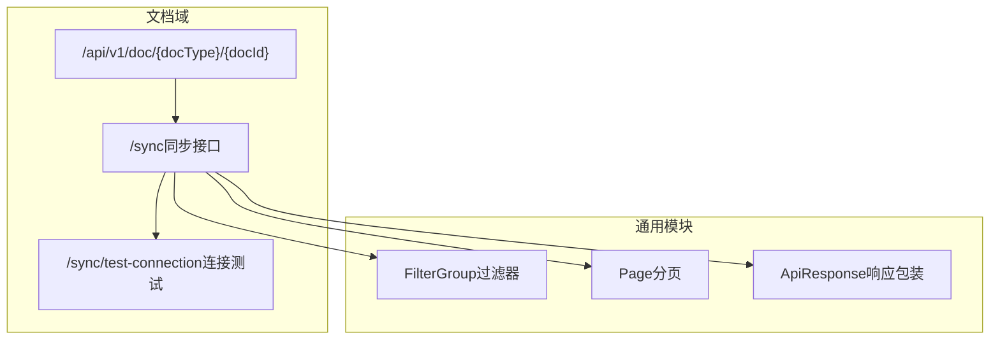
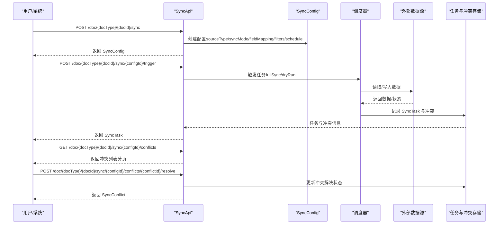
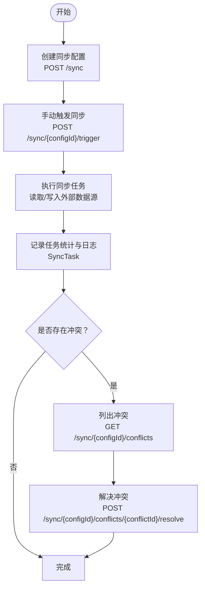
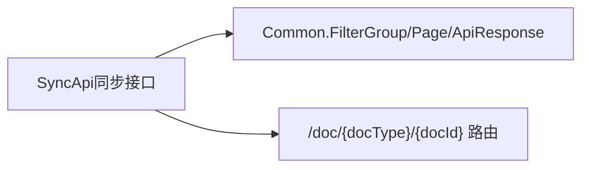

# 数据同步

<cite>
**本文引用的文件**
- [api/document/sync/index.tsp](file://api/document/sync/index.tsp)
- [api/shared/common.tsp](file://api/shared/common.tsp)
- [docs-src/guides/examples.md](file://docs-src/guides/examples.md)
</cite>

## 目录
1. [简介](#简介)
2. [项目结构](#项目结构)
3. [核心组件](#核心组件)
4. [架构概览](#架构概览)
5. [详细组件分析](#详细组件分析)
6. [依赖分析](#依赖分析)
7. [性能考虑](#性能考虑)
8. [故障排查指南](#故障排查指南)
9. [结论](#结论)
10. [附录](#附录)

## 简介
本文件面向使用 nexusbook-api 的开发者与实施工程师，系统化梳理“数据同步”能力，覆盖以下主题：
- SyncConfig 同步配置模型：支持的数据源类型、同步模式、冲突解决策略、字段映射、过滤器、定时任务等
- 同步生命周期：创建配置、手动触发、任务状态与统计、冲突检测与解决
- 实战示例：从 Google Sheets 导入产品数据、将订单数据导出到 ERP 系统

## 项目结构
数据同步能力位于文档域下的同步模块，统一通过路由 /api/v1/doc/{docType}/{docId}/sync 提供 REST 接口；同时复用通用的过滤器模型与分页结构。

图表来源
- [api/document/sync/index.tsp](file://api/document/sync/index.tsp#L560-L823)
- [api/shared/common.tsp](file://api/shared/common.tsp#L153-L203)

章节来源
- [api/document/sync/index.tsp](file://api/document/sync/index.tsp#L560-L823)
- [api/shared/common.tsp](file://api/shared/common.tsp#L153-L203)

## 核心组件
- 同步配置 SyncConfig
  - 支持的数据源类型：google_sheets、excel_online、csv、json_api、rest_api、graphql_api、database、webhook、airtable、notion
  - 同步模式：one_way_import、one_way_export、two_way
  - 冲突解决策略：keep_local、keep_remote、ask_user、latest_wins、merge
  - 字段映射：本地字段到远程字段的映射及可选类型转换
  - 过滤器：基于 FilterGroup 的复杂条件筛选
  - 定时任务：Cron 表达式 schedule
  - 其他：enabled、incremental、lastSyncedAt、nextSyncAt、createdBy、updatedAt 等
- 同步任务 SyncTask
  - 状态：pending、running、completed、failed、cancelled、partial
  - 统计：recordsProcessed、recordsSucceeded、recordsFailed、recordsCreated、recordsUpdated、recordsDeleted、recordsConflicted
  - 日志与错误：logs、errorMessage、errorDetails
  - 触发方式：manual、schedule、webhook、api
- 同步冲突 SyncConflict
  - 冲突定位：taskId、rowId、fieldId
  - 值对比：localValue、remoteValue、localModifiedAt、remoteModifiedAt
  - 解决：resolution、resolved、resolvedBy、resolvedAt

章节来源
- [api/document/sync/index.tsp](file://api/document/sync/index.tsp#L214-L360)
- [api/document/sync/index.tsp](file://api/document/sync/index.tsp#L366-L474)
- [api/document/sync/index.tsp](file://api/document/sync/index.tsp#L476-L558)

## 架构概览
下图展示了“创建同步配置 → 手动触发 → 任务执行 → 冲突处理”的端到端流程。

图表来源
- [api/document/sync/index.tsp](file://api/document/sync/index.tsp#L560-L823)

## 详细组件分析

### SyncConfig 同步配置模型
- 数据源类型
  - 支持 Google Sheets、Excel Online、CSV、JSON API、REST API、GraphQL、数据库、Webhook、Airtable、Notion 等
- 同步模式
  - one_way_import：仅导入
  - one_way_export：仅导出
  - two_way：双向同步
- 冲突解决策略
  - keep_local：保留本地
  - keep_remote：保留远程
  - ask_user：交由用户决定
  - latest_wins：以最新修改为准
  - merge：合并（可携带自定义值）
- 字段映射
  - localFieldId → remoteFieldName
  - 可选 typeConversion 用于类型转换
- 过滤器
  - 使用通用 FilterGroup，支持 and/or 逻辑、条件数组与嵌套组
- 定时任务
  - schedule 采用 Cron 表达式，支持每 6 小时、每日午夜、工作日早间等常见周期
- 其他
  - enabled 控制开关
  - incremental 控制增量同步
  - lastSyncedAt/nextSyncAt 记录时间点
  - createdBy/updatedBy 记录操作人

章节来源
- [api/document/sync/index.tsp](file://api/document/sync/index.tsp#L54-L106)
- [api/document/sync/index.tsp](file://api/document/sync/index.tsp#L112-L130)
- [api/document/sync/index.tsp](file://api/document/sync/index.tsp#L136-L166)
- [api/document/sync/index.tsp](file://api/document/sync/index.tsp#L214-L360)
- [api/shared/common.tsp](file://api/shared/common.tsp#L277-L295)

### SyncTask 同步任务模型
- 状态枚举：pending、running、completed、failed、cancelled、partial
- 统计指标：处理总数、成功数、失败数、新增/更新/删除/冲突数
- 日志与错误：支持 logs、errorMessage、errorDetails
- 触发方式：manual、schedule、webhook、api
- 触发用户：triggeredBy、triggeredUser

章节来源
- [api/document/sync/index.tsp](file://api/document/sync/index.tsp#L172-L208)
- [api/document/sync/index.tsp](file://api/document/sync/index.tsp#L366-L474)

### SyncConflict 同步冲突模型
- 冲突定位：task、row、field
- 值与时间：localValue、remoteValue、localModifiedAt、remoteModifiedAt
- 解决闭环：resolution、resolved、resolvedBy、resolvedAt
- 创建时间：createdAt

章节来源
- [api/document/sync/index.tsp](file://api/document/sync/index.tsp#L476-L558)

### API 接口与流程
- 列出/创建/获取/更新/删除同步配置
- 手动触发同步（支持 fullSync、dryRun）
- 获取任务历史（分页、按状态过滤）
- 获取任务详情、取消任务
- 获取冲突、解决冲突（支持 merge 的自定义值）
- 测试连接（sourceType + sourceConfig）

图表来源
- [api/document/sync/index.tsp](file://api/document/sync/index.tsp#L560-L823)

章节来源
- [api/document/sync/index.tsp](file://api/document/sync/index.tsp#L560-L823)

### 字段映射与过滤器
- 字段映射
  - 本地字段 ID → 远程字段名，支持可选类型转换
- 过滤器
  - FilterGroup 支持 and/or 逻辑、条件数组、嵌套组，可用于仅同步满足条件的数据

章节来源
- [api/document/sync/index.tsp](file://api/document/sync/index.tsp#L273-L301)
- [api/shared/common.tsp](file://api/shared/common.tsp#L277-L295)

### 冲突检测与解决机制
- 冲突检测
  - 在双向或导入/导出过程中，若同一记录在同一字段上出现本地与远程值不一致，系统记录 SyncConflict
- 冲突解决
  - 支持策略：keep_local、keep_remote、ask_user、latest_wins、merge
  - merge 可携带自定义值，用于精细合并
  - 解决后更新 resolved、resolvedBy、resolvedAt

章节来源
- [api/document/sync/index.tsp](file://api/document/sync/index.tsp#L476-L558)
- [api/document/sync/index.tsp](file://api/document/sync/index.tsp#L136-L166)

### 定时同步任务（Cron）
- schedule 字段支持 Cron 表达式，典型用法：
  - 每 6 小时一次
  - 每天午夜
  - 工作日早上 9 点
- 系统将据此调度执行同步任务，记录 nextSyncAt 与 lastSyncAt

章节来源
- [api/document/sync/index.tsp](file://api/document/sync/index.tsp#L310-L317)

## 依赖分析
- 对通用模块的依赖
  - FilterGroup：用于 filters 字段
  - Page/ApiResponse：用于分页与统一响应包装
- 对文档域的依赖
  - 路由约定：/api/v1/doc/{docType}/{docId}/sync
  - 与文档的 Properties/Metadata/Data 概念配合，实现字段映射与过滤

图表来源
- [api/document/sync/index.tsp](file://api/document/sync/index.tsp#L560-L823)
- [api/shared/common.tsp](file://api/shared/common.tsp#L153-L203)

章节来源
- [api/document/sync/index.tsp](file://api/document/sync/index.tsp#L560-L823)
- [api/shared/common.tsp](file://api/shared/common.tsp#L153-L203)

## 性能考虑
- 增量同步（incremental）：仅同步变更，降低网络与计算开销
- 字段映射与过滤器：在源头减少传输与处理的数据量
- 并发与幂等：触发同步时可结合 dryRun 进行预检，避免重复写入
- 任务统计：通过 recordsProcessed/recordsSucceeded/recordsFailed 等指标评估性能与健康度

[本节为通用指导，无需引用具体文件]

## 故障排查指南
- 连接测试
  - 使用 /sync/test-connection 接口传入 sourceType 与 sourceConfig，验证数据源连通性与字段探测
- 任务诊断
  - 通过 /sync/{configId}/tasks 获取历史与详情，关注 status、recordsFailed、errorMessage、errorDetails
- 冲突处理
  - 使用 /sync/{configId}/conflicts 获取未解决冲突，结合冲突详情进行策略选择
- 常见问题
  - Cron 表达式无效导致不触发：检查 schedule 格式
  - 字段映射不匹配：核对 localFieldId 与 remoteFieldName
  - 过滤器条件过于严格：适当放宽逻辑与条件

章节来源
- [api/document/sync/index.tsp](file://api/document/sync/index.tsp#L783-L823)
- [api/document/sync/index.tsp](file://api/document/sync/index.tsp#L676-L713)
- [api/document/sync/index.tsp](file://api/document/sync/index.tsp#L732-L761)

## 结论
nexusbook-api 的数据同步模块提供了从多数据源导入、导出到双向同步的全链路能力，配合灵活的字段映射、过滤器、冲突策略与 Cron 定时任务，能够满足从产品数据导入到订单数据导出 ERP 的多种业务场景。通过任务统计与冲突解决闭环，系统在保证一致性的同时兼顾了可运维性与可观测性。

[本节为总结性内容，无需引用具体文件]

## 附录

### 使用示例：从 Google Sheets 导入产品数据
- 步骤要点
  - 创建同步配置：sourceType 为 google_sheets，syncMode 为 one_way_import
  - 配置字段映射：将本地字段映射到远程 Sheet 列名
  - 可选：设置 filters 仅导入特定状态的产品
  - 可选：配置 schedule 定时拉取
- 参考接口
  - POST /doc/{docType}/{docId}/sync
  - POST /doc/{docType}/{docId}/sync/{configId}/trigger
  - GET /doc/{docType}/{docId}/sync/{configId}/tasks
  - GET /doc/{docType}/{docId}/sync/{configId}/conflicts

章节来源
- [api/document/sync/index.tsp](file://api/document/sync/index.tsp#L560-L713)
- [docs-src/guides/examples.md](file://docs-src/guides/examples.md#L366-L452)

### 使用示例：将订单数据导出到 ERP 系统
- 步骤要点
  - 创建同步配置：sourceType 为 rest_api（或 json_api），syncMode 为 one_way_export
  - 配置字段映射：将本地订单字段映射到 ERP 接口字段
  - 可选：filters 限定导出待处理/已确认的订单
  - 可选：schedule 每日定时推送
- 参考接口
  - POST /doc/{docType}/{docId}/sync
  - POST /doc/{docType}/{docId}/sync/{configId}/trigger
  - GET /doc/{docType}/{docId}/sync/{configId}/tasks
  - POST /doc/{docType}/{docId}/sync/{configId}/conflicts/{conflictId}/resolve

章节来源
- [api/document/sync/index.tsp](file://api/document/sync/index.tsp#L560-L781)
- [docs-src/guides/examples.md](file://docs-src/guides/examples.md#L366-L452)