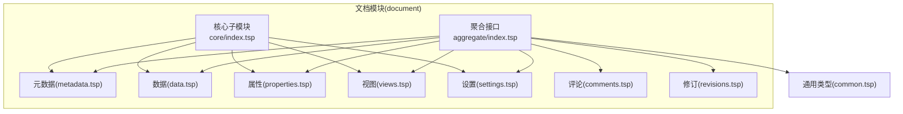
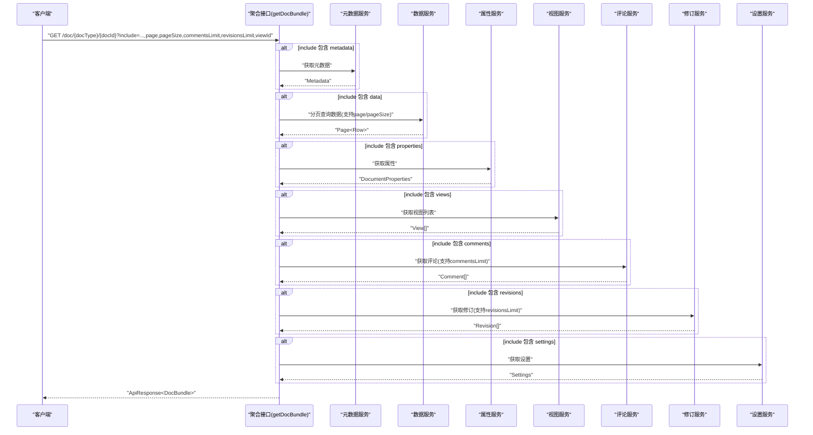
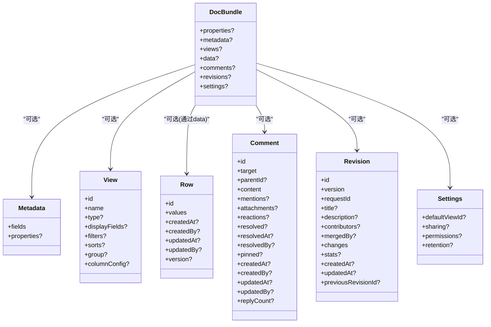
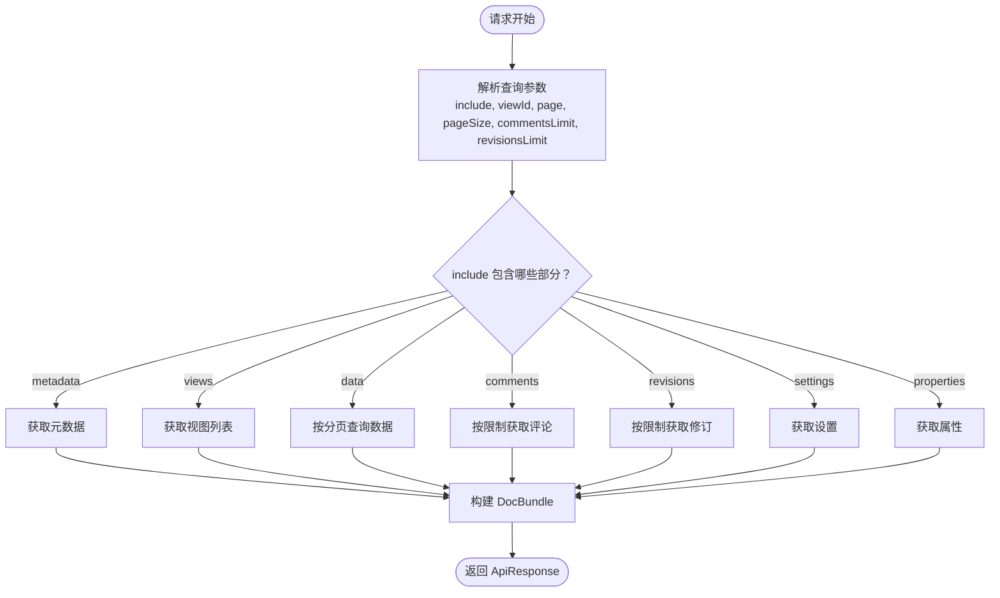
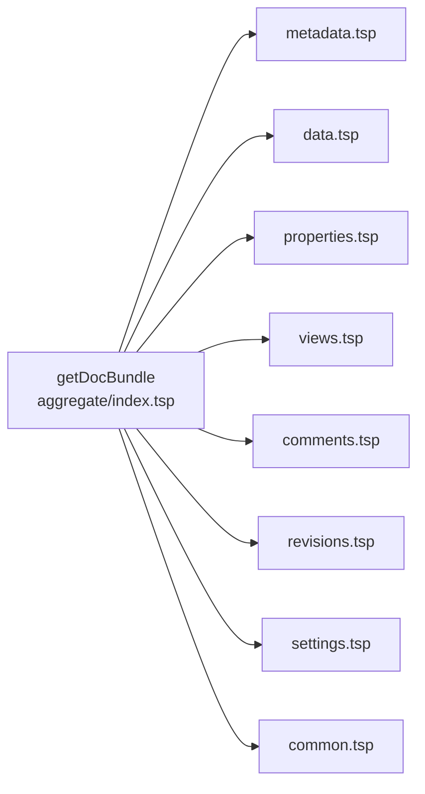

# 聚合查询

<cite>
**本文引用的文件**
- [aggregate/index.tsp](file://api/document/aggregate/index.tsp)
- [core/index.tsp](file://api/document/core/index.tsp)
- [core/metadata.tsp](file://api/document/core/metadata.tsp)
- [core/data.tsp](file://api/document/core/data.tsp)
- [core/properties.tsp](file://api/document/core/properties.tsp)
- [core/views.tsp](file://api/document/core/views.tsp)
- [core/settings.tsp](file://api/document/core/settings.tsp)
- [content/comments.tsp](file://api/document/content/comments.tsp)
- [workflow/revisions.tsp](file://api/document/workflow/revisions.tsp)
- [shared/common.tsp](file://api/shared/common.tsp)
- [shared/constants.tsp](file://api/document/shared/constants.tsp)
- [document-model.md](file://docs-src/guides/document-model.md)
- [examples.md](file://docs-src/guides/examples.md)
</cite>

## 目录
1. [简介](#简介)
2. [项目结构](#项目结构)
3. [核心组件](#核心组件)
4. [架构总览](#架构总览)
5. [详细组件分析](#详细组件分析)
6. [依赖分析](#依赖分析)
7. [性能考虑](#性能考虑)
8. [故障排查指南](#故障排查指南)
9. [结论](#结论)
10. [附录](#附录)

## 简介
本篇文档聚焦于 nexusbook-api 的“聚合查询”能力，即 DocBundle 模型与 getDocBundle 接口的设计与使用。通过 include 查询参数，客户端可以在单次请求中按需获取文档的多个层次数据（属性、元数据、视图、数据、评论、修订、设置），从而显著降低客户端请求数量、减少网络往返与并发控制开销，提升页面首屏与交互加载性能。

## 项目结构
- 聚合查询位于文档模块的聚合子模块，核心定义在聚合接口与 DocBundle 数据模型中。
- DocBundle 将文档的属性、元数据、视图、数据、评论、修订、设置等层次整合为单一响应载荷，便于前端一次性渲染。
- 通用的分页 Page、值类型 ValueEntry、错误码等公共类型在共享模块中定义，被各子模块复用。

图表来源
- [aggregate/index.tsp](file://api/document/aggregate/index.tsp#L92-L126)
- [core/index.tsp](file://api/document/core/index.tsp#L1-L21)

章节来源
- [aggregate/index.tsp](file://api/document/aggregate/index.tsp#L1-L126)
- [core/index.tsp](file://api/document/core/index.tsp#L1-L21)

## 核心组件
- DocBundle：聚合响应载体，包含属性、元数据、视图、数据、评论、修订、设置等可选字段。
- getDocBundle：聚合查询入口，支持 include 选择、分页、数量限制与视图切换。
- 通用类型：ApiResponse、Page、ValueEntry、ErrorCode 等，统一响应格式与错误处理。

章节来源
- [aggregate/index.tsp](file://api/document/aggregate/index.tsp#L48-L90)
- [aggregate/index.tsp](file://api/document/aggregate/index.tsp#L92-L126)
- [shared/common.tsp](file://api/shared/common.tsp#L153-L203)

## 架构总览
聚合查询通过 getDocBundle 接口，按需组装 DocBundle。客户端通过 include 参数声明需要的部分，服务端据此从各子模块拉取数据并合并到 DocBundle 中返回。

图表来源
- [aggregate/index.tsp](file://api/document/aggregate/index.tsp#L92-L126)
- [core/metadata.tsp](file://api/document/core/metadata.tsp#L183-L211)
- [core/data.tsp](file://api/document/core/data.tsp#L375-L418)
- [core/properties.tsp](file://api/document/core/properties.tsp#L200-L224)
- [core/views.tsp](file://api/document/core/views.tsp#L86-L100)
- [content/comments.tsp](file://api/document/content/comments.tsp#L246-L283)
- [workflow/revisions.tsp](file://api/document/workflow/revisions.tsp#L323-L356)
- [core/settings.tsp](file://api/document/core/settings.tsp#L86-L113)

## 详细组件分析

### DocBundle 数据模型
DocBundle 是聚合查询的统一响应载体，包含以下可选字段：
- properties：文档属性（如订单时间、门店、金额、数量等）
- metadata：字段定义与显示配置
- views：视图列表
- data：数据分页结果（Page<Row>）
- comments：评论集合
- revisions：修订记录
- settings：文档设置

图表来源
- [aggregate/index.tsp](file://api/document/aggregate/index.tsp#L48-L90)
- [core/metadata.tsp](file://api/document/core/metadata.tsp#L160-L181)
- [core/views.tsp](file://api/document/core/views.tsp#L28-L84)
- [core/data.tsp](file://api/document/core/data.tsp#L241-L312)
- [content/comments.tsp](file://api/document/content/comments.tsp#L108-L238)
- [workflow/revisions.tsp](file://api/document/workflow/revisions.tsp#L151-L315)
- [core/settings.tsp](file://api/document/core/settings.tsp#L33-L84)

章节来源
- [aggregate/index.tsp](file://api/document/aggregate/index.tsp#L48-L90)

### getDocBundle 接口与查询参数
- 路径参数：docType、docId
- 查询参数：
  - include：逗号分隔的选择列表，支持 metadata、views、data、comments、revisions、settings、properties
  - viewId：指定视图ID，用于按特定视图查询数据
  - page/pageSize：数据分页控制
  - commentsLimit：限制返回的评论数量
  - revisionsLimit：限制返回的修订数量

图表来源
- [aggregate/index.tsp](file://api/document/aggregate/index.tsp#L92-L126)

章节来源
- [aggregate/index.tsp](file://api/document/aggregate/index.tsp#L92-L126)

### 数据分页与数量限制
- 数据分页：page/pageSize 控制 data 的分页结果，返回 Page<Row>，包含 items、page、pageSize、total。
- 评论限制：commentsLimit 控制 comments 的数量上限。
- 修订限制：revisionsLimit 控制 revisions 的数量上限。

章节来源
- [core/data.tsp](file://api/document/core/data.tsp#L375-L418)
- [shared/common.tsp](file://api/shared/common.tsp#L179-L203)
- [content/comments.tsp](file://api/document/content/comments.tsp#L246-L283)
- [workflow/revisions.tsp](file://api/document/workflow/revisions.tsp#L323-L356)

### 视图切换与渲染
- 通过 viewId 指定视图，服务端可按该视图的过滤、排序、分组等配置查询数据，实现“按视图渲染”的数据投影。
- 视图定义包含 displayFields、filters、sorts、group、columnConfig 等，用于控制渲染行为。

章节来源
- [core/views.tsp](file://api/document/core/views.tsp#L28-L84)
- [core/views.tsp](file://api/document/core/views.tsp#L86-L171)

### 响应格式与错误码
- 统一响应格式 ApiResponse<T>，包含 success、code、message、payload 字段。
- 常见错误码包括认证失败、文档不存在、视图不存在、数据行不存在、请求冲突等。

章节来源
- [shared/common.tsp](file://api/shared/common.tsp#L153-L177)
- [shared/common.tsp](file://api/shared/common.tsp#L80-L152)

## 依赖分析
- DocBundle 依赖各子模块的模型：
  - properties → DocumentProperties
  - metadata → Metadata
  - views → View[]
  - data → Page<Row>
  - comments → Comment[]
  - revisions → Revision[]
  - settings → Settings
- getDocBundle 依赖各子模块的 API：
  - 元数据：/doc/{docType}/{docId}/metadata
  - 数据：/doc/{docType}/{docId}/data
  - 属性：/doc/{docType}/{docId}/properties
  - 视图：/doc/{docType}/{docId}/views
  - 评论：/doc/{docType}/{docId}/comments
  - 修订：/doc/{docType}/{docId}/revisions
  - 设置：/doc/{docType}/{docId}/settings

图表来源
- [aggregate/index.tsp](file://api/document/aggregate/index.tsp#L92-L126)
- [core/metadata.tsp](file://api/document/core/metadata.tsp#L183-L211)
- [core/data.tsp](file://api/document/core/data.tsp#L375-L418)
- [core/properties.tsp](file://api/document/core/properties.tsp#L200-L224)
- [core/views.tsp](file://api/document/core/views.tsp#L86-L100)
- [content/comments.tsp](file://api/document/content/comments.tsp#L246-L283)
- [workflow/revisions.tsp](file://api/document/workflow/revisions.tsp#L323-L356)
- [core/settings.tsp](file://api/document/core/settings.tsp#L86-L113)
- [shared/common.tsp](file://api/shared/common.tsp#L153-L203)

章节来源
- [aggregate/index.tsp](file://api/document/aggregate/index.tsp#L1-L31)
- [core/index.tsp](file://api/document/core/index.tsp#L1-L21)

## 性能考虑
- 减少请求数量：通过 include 一次性拉取多个部分，避免多次往返。
- 分页与限制：合理设置 page/pageSize、commentsLimit、revisionsLimit，避免一次性传输大量数据。
- 视图驱动查询：通过 viewId 与视图配置，服务端可按过滤/排序/分组裁剪数据，减少客户端二次处理。
- 并发控制：数据更新通过变更请求工作流，避免直接写入导致的并发冲突与重复请求。
- 缓存友好：聚合查询适合做客户端缓存，结合 ETag/Last-Modified 可进一步优化。

## 故障排查指南
- 认证失败：检查 Authorization 头与令牌有效性。
- 文档不存在：确认 docType 与 docId 是否正确。
- 视图不存在：确认 viewId 是否存在且属于该文档。
- 请求冲突：检查是否存在未合并的变更请求，或版本号不匹配。
- 分页异常：确认 page 与 pageSize 合法范围，注意最大页大小限制。

章节来源
- [shared/common.tsp](file://api/shared/common.tsp#L80-L152)

## 结论
DocBundle 通过聚合查询将文档的多层数据整合到一次请求中，配合 include、分页与数量限制，显著降低了客户端的请求次数与网络开销，提升了页面加载与渲染性能。结合视图切换与统一响应格式，开发者可以以更少的代码实现更丰富的文档展示与协作体验。

## 附录

### cURL 使用示例
以下示例基于仓库中的示例与接口定义，展示如何使用聚合查询获取不同组合的数据。

- 获取完整的订货单信息（属性、元数据、视图、数据、评论、修订、设置，带分页）
  - 示例路径：[示例文档](file://docs-src/guides/document-model.md#L704-L718)
  - 示例路径：[示例文档](file://docs-src/guides/examples.md#L1-L210)

- 只获取元数据和数据（带分页）
  - 示例路径：[示例文档](file://docs-src/guides/document-model.md#L711-L713)

- 获取属性和最近的评论/修订（限制数量）
  - 示例路径：[示例文档](file://docs-src/guides/document-model.md#L715-L717)

### 响应示例
- 完整响应结构参考：[示例文档](file://docs-src/guides/document-model.md#L720-L769)