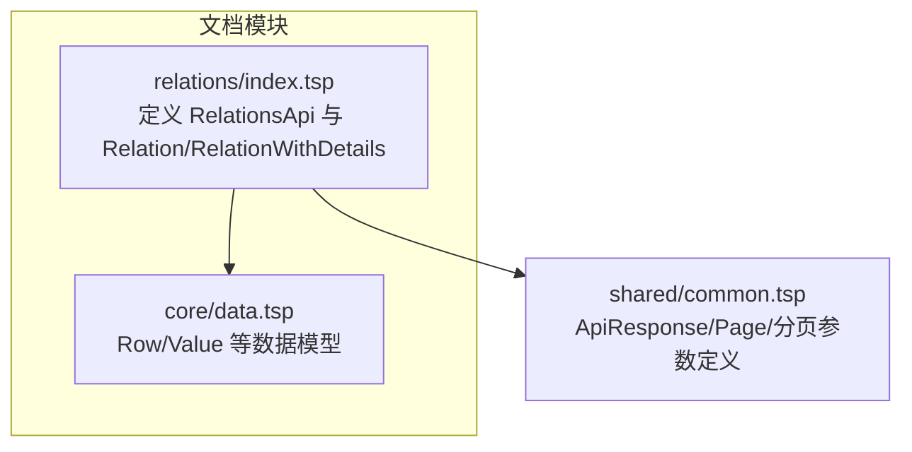
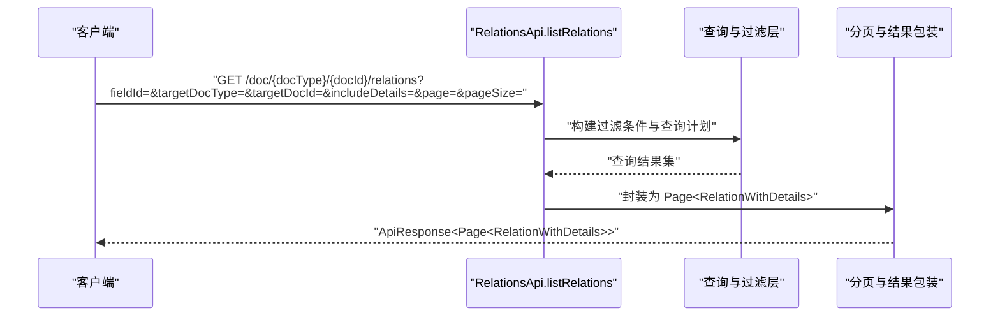
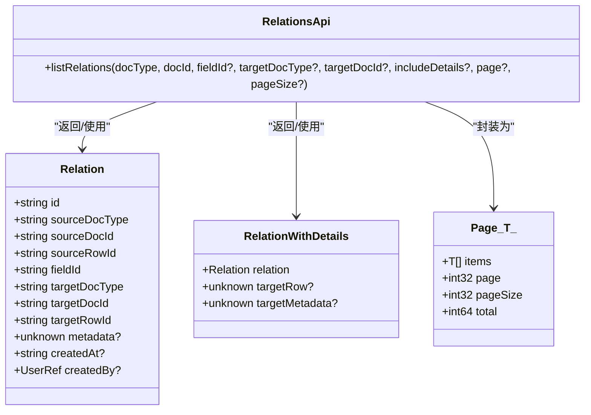

# 关联关系查询

<cite>
**本文引用的文件**
- [api/document/relations/index.tsp](file://api/document/relations/index.tsp)
- [api/shared/common.tsp](file://api/shared/common.tsp)
- [api/document/core/data.tsp](file://api/document/core/data.tsp)
- [docs-src/guides/document-model.md](file://docs-src/guides/document-model.md)
</cite>

## 目录
1. [简介](#简介)
2. [项目结构](#项目结构)
3. [核心组件](#核心组件)
4. [架构概览](#架构概览)
5. [详细组件分析](#详细组件分析)
6. [依赖分析](#依赖分析)
7. [性能考虑](#性能考虑)
8. [故障排查指南](#故障排查指南)
9. [结论](#结论)
10. [附录](#附录)

## 简介
本文档聚焦于 nexusbook-api 的“关联关系查询”能力，围绕 listRelations API 的参数与行为进行系统化说明，帮助开发者正确使用 fieldId、targetDocType、targetDocId 进行过滤，理解 includeDetails 参数在返回 RelationWithDetails 时的行为差异，并掌握分页参数 page 与 pageSize 的默认值与使用方式。同时，文档给出 RelationWithDetails 模型的结构说明以及典型业务场景示例，如查询某订单关联的所有产品、查找某成员参与的所有项目等。

## 项目结构
与关联关系查询直接相关的代码位于文档模块的 relations 子模块中，公共分页与响应模型定义在 shared 模块，文档行与值模型在 document/core 中。

图表来源
- [api/document/relations/index.tsp](file://api/document/relations/index.tsp#L188-L278)
- [api/shared/common.tsp](file://api/shared/common.tsp#L179-L203)
- [api/document/core/data.tsp](file://api/document/core/data.tsp#L248-L256)

章节来源
- [api/document/relations/index.tsp](file://api/document/relations/index.tsp#L188-L278)
- [api/shared/common.tsp](file://api/shared/common.tsp#L179-L203)
- [api/document/core/data.tsp](file://api/document/core/data.tsp#L248-L256)

## 核心组件
- listRelations 接口：提供对文档关联关系的查询，支持按字段、目标文档类型与目标文档 ID 过滤，支持 includeDetails 控制返回详情，支持分页。
- Relation 模型：描述一条具体的关联关系，包含源/目标文档类型与 ID、行 ID、字段 ID、元数据与审计信息。
- RelationWithDetails 模型：在 Relation 基础上，可选择返回目标行数据与目标文档元数据，用于减少客户端多次拉取。
- Page 响应模型：统一的分页容器，包含 items、page、pageSize、total。

章节来源
- [api/document/relations/index.tsp](file://api/document/relations/index.tsp#L324-L335)
- [api/document/relations/index.tsp](file://api/document/relations/index.tsp#L188-L278)
- [api/shared/common.tsp](file://api/shared/common.tsp#L179-L203)

## 架构概览
下图展示了 listRelations 的调用序列，从客户端到 RelationsApi，再到内部查询与分页返回。

图表来源
- [api/document/relations/index.tsp](file://api/document/relations/index.tsp#L324-L335)
- [api/shared/common.tsp](file://api/shared/common.tsp#L179-L203)

## 详细组件分析

### listRelations API 参数与行为
- 路径参数
  - docType：源文档类型
  - docId：源文档 ID
- 查询参数
  - fieldId：可选，按源字段 ID 过滤
  - targetDocType：可选，按目标文档类型过滤
  - targetDocId：可选，按目标文档 ID 过滤
  - includeDetails：可选布尔值
    - false 或省略：返回 Relation 实例
    - true：返回 RelationWithDetails，包含 relation、targetRow（可选）、targetMetadata（可选）
  - page：可选整数，默认值见“分页参数默认值”
  - pageSize：可选整数，默认值见“分页参数默认值”
- 返回类型
  - ApiResponse<Page<RelationWithDetails>>
  - Page 结构包含 items、page、pageSize、total

章节来源
- [api/document/relations/index.tsp](file://api/document/relations/index.tsp#L324-L335)
- [api/shared/common.tsp](file://api/shared/common.tsp#L179-L203)

### RelationWithDetails 模型结构
- relation：必填，Relation 实例
- targetRow：可选，目标行数据（当 includeDetails=true 且后端可获取时）
- targetMetadata：可选，目标文档元数据（当 includeDetails=true 且后端可获取时）

章节来源
- [api/document/relations/index.tsp](file://api/document/relations/index.tsp#L260-L278)

### Relation 模型结构
- id：关联 ID
- sourceDocType/sourceDocId/sourceRowId：源文档类型/ID/行 ID
- fieldId：源字段 ID
- targetDocType/targetDocId/targetRowId：目标文档类型/ID/行 ID
- metadata：可选，关联元数据
- createdAt/createdBy：可选，创建时间与创建人

章节来源
- [api/document/relations/index.tsp](file://api/document/relations/index.tsp#L188-L254)

### 分页参数 page 与 pageSize 的使用与默认值
- page：页码，默认值为 1
- pageSize：每页数量，默认值为 20
- pageSize 上限：在通用分页参数定义中，最大为 200
- 游标：支持 cursor 用于深分页（在通用分页参数中定义）

章节来源
- [api/document/core/data.tsp](file://api/document/core/data.tsp#L347-L373)
- [api/document/tenant-document.tsp](file://api/document/tenant-document.tsp#L406-L416)
- [api/shared/common.tsp](file://api/shared/common.tsp#L179-L203)

### includeDetails 参数的作用与返回差异
- includeDetails=false（默认）：返回 Relation 实例，仅包含关系主体信息
- includeDetails=true：返回 RelationWithDetails，额外携带目标行数据与目标文档元数据，便于前端一次性渲染完整上下文

章节来源
- [api/document/relations/index.tsp](file://api/document/relations/index.tsp#L324-L335)
- [api/document/relations/index.tsp](file://api/document/relations/index.tsp#L260-L278)

### 关系类型与业务建模参考
- 文档 ↔ 文档：如发票依赖订货单
- 行 ↔ 行：明细行对齐
- 行 ↔ 文档：某库存行关联到产品资料文档
- 基数：一对一/一对多/多对多均通过边表示

章节来源
- [docs-src/guides/document-model.md](file://docs-src/guides/document-model.md#L588-L628)

## 依赖分析
- RelationsApi.listRelations 依赖：
  - Relation/RelationWithDetails 模型（定义于 relations/index.tsp）
  - Page 响应模型（定义于 shared/common.tsp）
  - 通用分页参数（定义于 document/core/data.tsp）

图表来源
- [api/document/relations/index.tsp](file://api/document/relations/index.tsp#L188-L278)
- [api/document/relations/index.tsp](file://api/document/relations/index.tsp#L324-L335)
- [api/shared/common.tsp](file://api/shared/common.tsp#L179-L203)

## 性能考虑
- includeDetails=true 会增加后端查询与拼装成本，建议仅在需要时开启
- 合理设置 pageSize，避免过大导致单页响应体积膨胀
- 使用过滤参数（fieldId、targetDocType、targetDocId）缩小结果集，提升查询效率
- 对高频查询可结合游标分页（cursor）实现深分页，降低偏移开销

## 故障排查指南
- 404/文档不存在：确认 docType 与 docId 是否正确
- 403/权限不足：确保对源/目标文档具备访问权限
- 400/参数非法：检查 page、pageSize 的取值范围与 includeDetails 的布尔值
- 500/服务异常：重试或联系管理员

章节来源
- [api/shared/common.tsp](file://api/shared/common.tsp#L80-L123)

## 结论
listRelations 提供了灵活的关联关系查询能力，通过字段与目标维度过滤、includeDetails 控制返回详情、以及标准分页参数，能够满足多样化的业务需求。建议在保证用户体验的前提下，合理使用 includeDetails 与过滤参数，以获得更优的性能与更低的网络负载。

## 附录

### 实际使用场景示例
以下示例以“路径与参数”的形式给出，便于对照接口定义进行调用。

- 查询某订单关联的所有产品
  - 方法与路径：GET /doc/{docType}/{docId}/relations
  - 参数：
    - docType：订单文档类型
    - docId：订单文档 ID
    - fieldId：订单中的“产品”字段 ID
    - includeDetails：true（若需同时获取产品行与元数据）
    - page/pageSize：按需设置
  - 说明：通过 fieldId 精确限定“产品”字段，includeDetails 使前端可直接渲染目标产品行与元数据

- 查找某成员参与的所有项目
  - 方法与路径：GET /doc/{docType}/{docId}/relations
  - 参数：
    - docType：成员文档类型
    - docId：成员文档 ID
    - fieldId：成员与项目之间的关联字段 ID
    - includeDetails：true（若需同时获取项目行与元数据）
    - page/pageSize：按需设置
  - 说明：通过 fieldId 指定“参与项目”字段，includeDetails 便于一次性展示项目详情

- 按目标文档类型过滤
  - 在上述任一场景中追加：
    - targetDocType：项目/产品等目标文档类型
  - 说明：进一步缩小结果集，仅返回目标类型为指定类型的关联

- 按目标文档 ID 过滤
  - 在上述任一场景中追加：
    - targetDocId：特定项目或产品的文档 ID
  - 说明：精确到某个目标文档，适合“查看某产品被哪些订单引用”等场景

章节来源
- [api/document/relations/index.tsp](file://api/document/relations/index.tsp#L324-L335)
- [api/document/relations/index.tsp](file://api/document/relations/index.tsp#L260-L278)