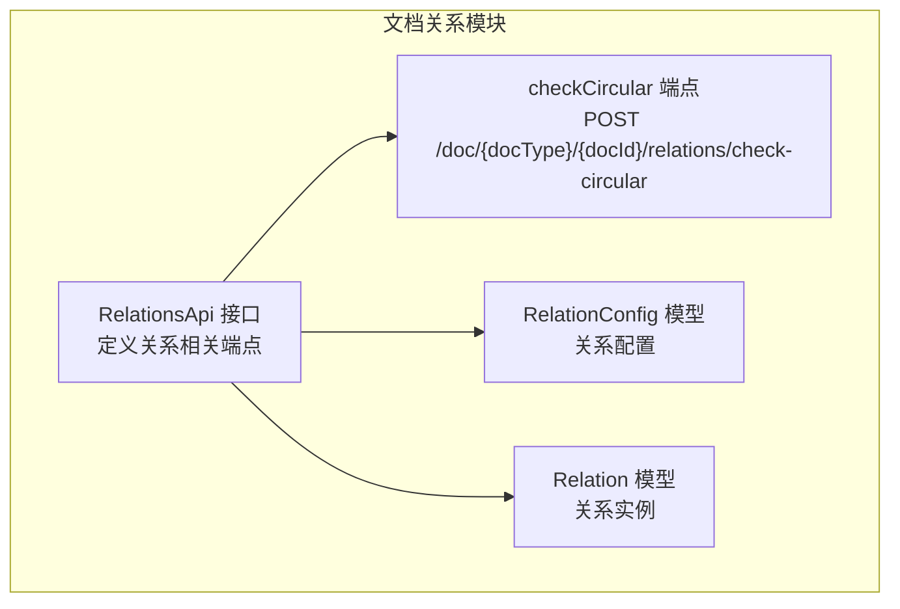
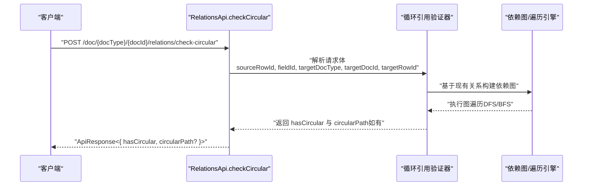
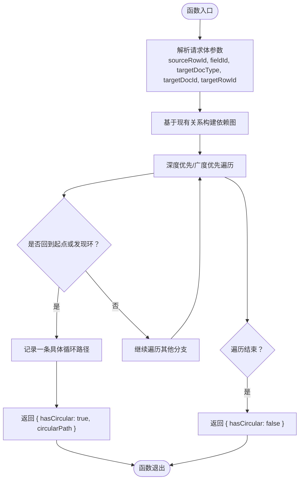

# 循环引用检测

<cite>
**本文引用的文件**
- [api/document/relations/index.tsp](file://api/document/relations/index.tsp)
- [docs-src/guides/best-practices.md](file://docs-src/guides/best-practices.md)
- [docs-src/references/api-reference.md](file://docs-src/references/api-reference.md)
</cite>

## 目录
1. [简介](#简介)
2. [项目结构](#项目结构)
3. [核心组件](#核心组件)
4. [架构总览](#架构总览)
5. [详细组件分析](#详细组件分析)
6. [依赖分析](#依赖分析)
7. [性能考虑](#性能考虑)
8. [故障排查指南](#故障排查指南)
9. [结论](#结论)
10. [附录](#附录)

## 简介
本文件聚焦于 nexusbook-api 的“循环引用检测”能力，围绕 checkCircular API 的设计与使用展开，解释其在创建新关联前预测是否会导致循环依赖的机制，并结合 RelationConfig 中的 preventCircular 配置，给出在构建复杂依赖关系网络时的最佳实践与使用示例。

## 项目结构
与循环引用检测相关的核心位于文档关系模块，该模块提供了关系配置、关系查询、批量关系操作以及循环引用检测等能力。



图表来源
- [api/document/relations/index.tsp](file://api/document/relations/index.tsp#L280-L526)

章节来源
- [api/document/relations/index.tsp](file://api/document/relations/index.tsp#L280-L526)

## 核心组件
- RelationsApi：定义关系相关端点，包含 list、create、batchCreate、delete、batchDelete 以及 checkCircular。
- RelationConfig：关系配置模型，其中 validation.preventCircular 控制是否启用循环引用预防。
- Relation：关系实例模型，包含源/目标文档类型、文档ID、行ID、字段ID等。
- checkCircular：检查创建关联是否会导致循环引用，返回 hasCircular 与可选的 circularPath。

章节来源
- [api/document/relations/index.tsp](file://api/document/relations/index.tsp#L280-L526)

## 架构总览
checkCircular 的调用流程如下：



图表来源
- [api/document/relations/index.tsp](file://api/document/relations/index.tsp#L491-L525)

## 详细组件分析

### checkCircular API 设计与行为
- 端点：POST /doc/{docType}/{docId}/relations/check-circular
- 请求体字段
  - sourceRowId：源文档行ID
  - fieldId：源字段ID
  - targetDocType：目标文档类型
  - targetDocId：目标文档ID
  - targetRowId：目标文档行ID
- 返回体字段
  - hasCircular：布尔值，表示创建该关联是否会引入循环
  - circularPath：字符串数组（可选），当存在循环时返回一条具体循环路径（例如若干个文档类型/文档ID的序列）

该端点的作用是在真正创建关联之前，预测性地检测是否存在循环依赖，从而避免破坏数据完整性与一致性。

章节来源
- [api/document/relations/index.tsp](file://api/document/relations/index.tsp#L491-L525)

### RelationConfig 与 preventCircular 配置
RelationConfig.validation.preventCircular 用于声明是否启用循环引用预防策略。当该配置开启时，系统在执行关系变更（尤其是双向关联或跨文档关系）时，应结合 checkCircular 的结果进行决策，以确保不会形成不可达或循环的依赖链。

章节来源
- [api/document/relations/index.tsp](file://api/document/relations/index.tsp#L109-L133)

### 输入参数详解
- sourceRowId：用于标识源文档中的具体行，确保在该行上建立关联。
- fieldId：源字段ID，限定关联发生的字段范围。
- targetDocType/targetDocId/targetRowId：目标文档类型、文档ID与行ID，共同唯一标识目标端点。

这些参数构成一次“从某行的某字段指向另一文档某行”的完整意图表达，checkCircular 将据此评估是否会产生循环。

章节来源
- [api/document/relations/index.tsp](file://api/document/relations/index.tsp#L491-L525)

### 返回结果详解
- hasCircular：布尔值，指示是否存在循环依赖。
- circularPath：可选的字符串数组，当存在循环时返回一条具体路径，便于定位与诊断。

章节来源
- [api/document/relations/index.tsp](file://api/document/relations/index.tsp#L512-L524)

### 图遍历算法与检测流程
checkCircular 的内部实现采用图遍历算法，核心思路如下：



说明
- 依赖图由 Relation 实例构成，边的方向通常由“源→目标”定义；若配置为双向关联，则同时考虑反向边。
- 遍历过程中使用访问标记（如已访问/当前路径栈）来识别环。
- 若存在环，返回一条可复现的路径以便定位问题。

章节来源
- [api/document/relations/index.tsp](file://api/document/relations/index.tsp#L184-L254)
- [api/document/relations/index.tsp](file://api/document/relations/index.tsp#L491-L525)

### 实际使用示例：订单与产品关联
场景：在创建“订单A→产品P”的关联前，先调用 checkCircular，确保不会意外形成“订单A→产品P→订单A”的循环。

步骤
1. 调用 checkCircular，传入：
   - sourceRowId：订单行ID
   - fieldId：订单中的“产品”字段
   - targetDocType：产品
   - targetDocId：产品ID
   - targetRowId：产品行ID
2. 若返回 hasCircular=false，则安全创建关联；若为 true，结合 circularPath 定位环路并调整业务逻辑或配置。

章节来源
- [api/document/relations/index.tsp](file://api/document/relations/index.tsp#L491-L525)

### 与 RelationConfig.preventCircular 的协同
- preventCircular=true：启用循环预防策略，建议在执行 createRelation 前先调用 checkCircular，并将返回的 hasCircular 作为决策依据。
- preventCircular=false：关闭循环预防，系统仍可能在运行时进行约束校验，但默认不强制阻断。

章节来源
- [api/document/relations/index.tsp](file://api/document/relations/index.tsp#L109-L133)

### 最佳实践
- 在创建/更新关系前，总是先调用 checkCircular，尤其在双向关联或跨文档关系场景。
- 当 preventCircular=true 时，拒绝 hasCircular=true 的请求，并提示 circularPath 以协助修复。
- 对复杂依赖网络，建议定期扫描关键路径，避免隐式环路。
- 在批量关系操作中，先对候选集进行预检，再分批提交，降低整体失败概率。

章节来源
- [docs-src/guides/best-practices.md](file://docs-src/guides/best-practices.md#L1-L474)

## 依赖分析
- RelationsApi 依赖 RelationConfig 与 Relation 模型，用于定义关系配置与实例。
- checkCircular 依赖 Relation 实例集合与图遍历算法，返回 hasCircular 与 circularPath。
- RelationConfig.validation.preventCircular 与 checkCircular 协同，决定是否允许存在环。

```mermaid
classDiagram
class RelationsApi {
+checkCircular(docType, docId, body) ApiResponse
+createRelation(...)
+listRelations(...)
+batchCreateRelations(...)
+deleteRelation(...)
+batchDeleteRelations(...)
}
class RelationConfig {
+id : string
+sourceDocType : string
+sourceDocId : string
+fieldId : string
+targetDocType : string
+targetDocId : string
+bidirectional? : boolean
+reverseFieldId? : string
+cascadeDelete? : CascadeDeleteStrategy
+validation? : {
allowDuplicates? : boolean
maxLinks? : int32
minLinks? : int32
preventCircular? : boolean
}
}
class Relation {
+id : string
+sourceDocType : string
+sourceDocId : string
+sourceRowId : string
+fieldId : string
+targetDocType : string
+targetDocId : string
+targetRowId : string
+metadata? : unknown
}
RelationsApi --> RelationConfig : "使用"
RelationsApi --> Relation : "使用"
```

图表来源
- [api/document/relations/index.tsp](file://api/document/relations/index.tsp#L280-L526)

章节来源
- [api/document/relations/index.tsp](file://api/document/relations/index.tsp#L280-L526)

## 性能考虑
- 预检成本：checkCircular 的图遍历复杂度与关系总数、字段数量、文档规模相关。建议在高频场景下缓存近期的图快照或增量更新。
- 批量操作：对批量创建/删除关系，先进行预检，减少失败回滚成本。
- 路径长度：circularPath 可能较长，前端展示时建议截断并提供“展开详情”能力，避免长路径影响交互体验。

## 故障排查指南
- hasCircular=true 且 circularPath 为空：系统可能未收集到足够上下文，建议补充更多关系或扩大查询范围。
- preventCircular=true 但仍有环：检查是否存在隐藏的反向关系或跨字段间接依赖，必要时调整字段设计或拆分关系。
- 高延迟：检查关系总数与索引情况，必要时对热点字段建立索引或分批处理。

## 结论
checkCircular 为构建复杂依赖关系网络提供了关键的预防性保障。通过与 RelationConfig.validation.preventCircular 的协同，开发者可以在创建新关联前及时发现并规避循环依赖，提升系统的稳定性与可维护性。建议在所有涉及双向或多文档关系的操作中，都将 checkCircular 作为前置步骤。

## 附录
- 统一响应格式参考：所有 API 返回统一的 ApiResponse 结构，包含 success、code、message、payload 等字段，便于前端统一处理。

章节来源
- [docs-src/references/api-reference.md](file://docs-src/references/api-reference.md#L1-L665)