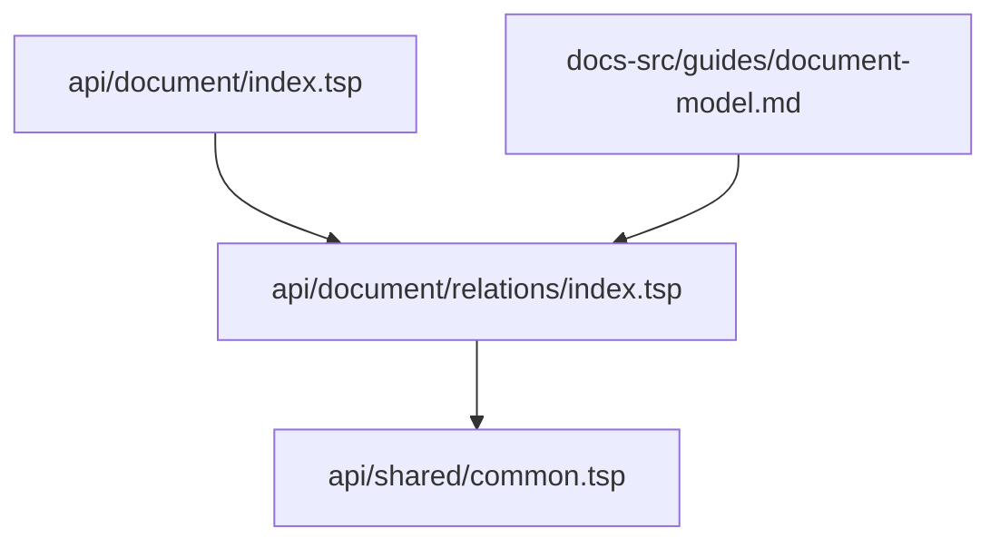
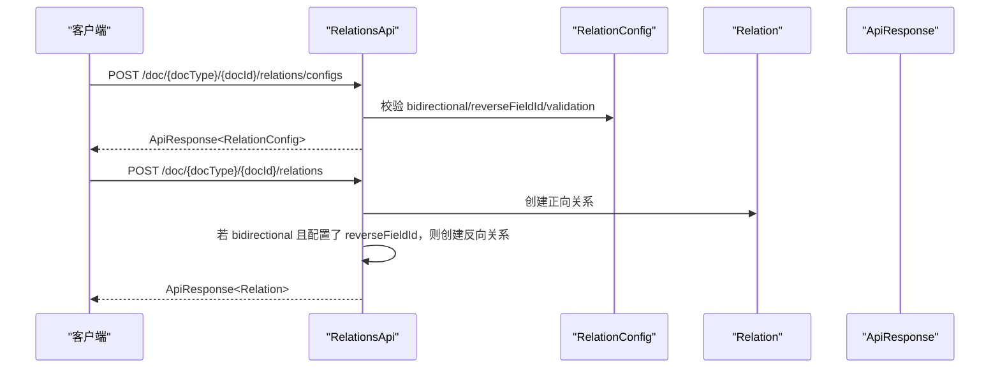
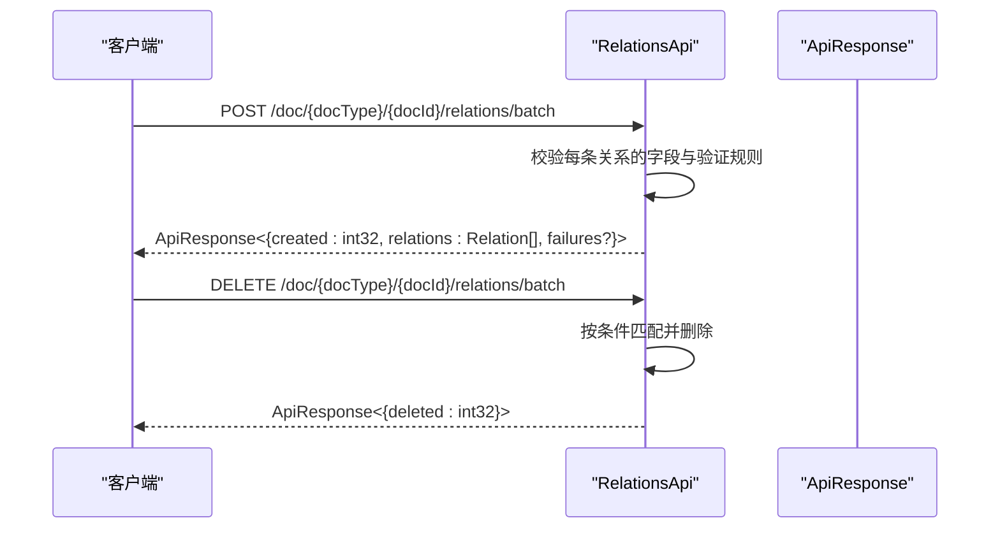
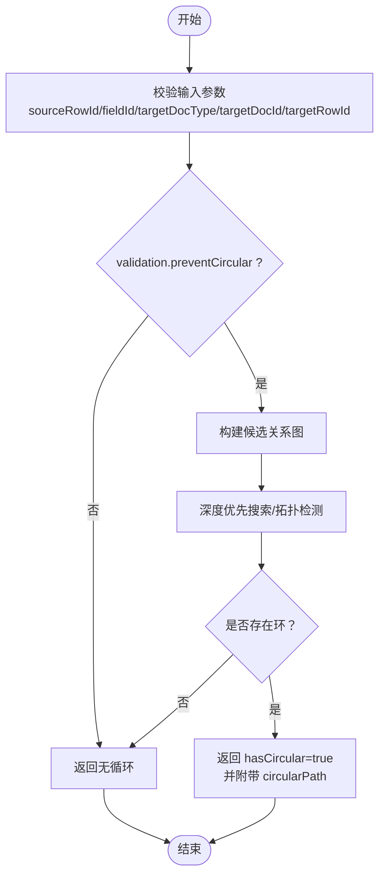
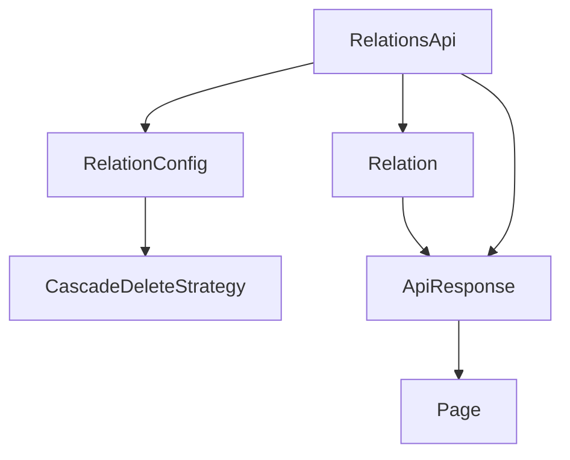

# 跨文档关联

<cite>
**本文引用的文件**
- [api/document/relations/index.tsp](file://api/document/relations/index.tsp)
- [api/shared/common.tsp](file://api/shared/common.tsp)
- [api/document/index.tsp](file://api/document/index.tsp)
- [docs-src/guides/document-model.md](file://docs-src/guides/document-model.md)
</cite>

## 目录
1. [简介](#简介)
2. [项目结构](#项目结构)
3. [核心组件](#核心组件)
4. [架构概览](#架构概览)
5. [详细组件分析](#详细组件分析)
6. [依赖分析](#依赖分析)
7. [性能考虑](#性能考虑)
8. [故障排查指南](#故障排查指南)
9. [结论](#结论)
10. [附录](#附录)

## 简介
本文件系统化阐述 nexusbook-api 的跨文档关联能力，重点围绕 Relation 模型作为“边（Edge）”的一等公民设计，支持文档↔文档、行↔行等多粒度关联。文档详细说明 RelationConfig 配置模型中的双向关联（bidirectional）、级联删除策略（cascadeDelete）与关联验证规则（如防止循环引用），并给出 createRelationConfig 配置关联规则、createRelation 建立关联（自动处理双向关联）、listRelations、batchCreateRelations、batchDeleteRelations 等 API 的使用方法。最后提供订单-产品一对多、项目-成员多对多两类典型示例，并说明如何使用 checkCircular 接口检测循环引用。

## 项目结构
跨文档关联能力位于文档模块的 relations 子模块中，采用 TypeSpec/OpenAPI 描述，统一由公共响应模型 ApiResponse/Page 提供标准化输出。



图表来源
- [api/document/index.tsp](file://api/document/index.tsp#L1-L30)
- [api/document/relations/index.tsp](file://api/document/relations/index.tsp#L1-L60)
- [api/shared/common.tsp](file://api/shared/common.tsp#L153-L203)
- [docs-src/guides/document-model.md](file://docs-src/guides/document-model.md#L580-L628)

章节来源
- [api/document/index.tsp](file://api/document/index.tsp#L1-L30)
- [api/document/relations/index.tsp](file://api/document/relations/index.tsp#L1-L60)
- [api/shared/common.tsp](file://api/shared/common.tsp#L153-L203)

## 核心组件
- RelationConfig：文档字段级的关联规则配置，支持 bidirectional、reverseFieldId、cascadeDelete、validation（allowDuplicates、maxLinks、minLinks、preventCircular）等。
- CascadeDeleteStrategy：删除策略枚举，包括 none、unlink、soft、hard、prevent。
- Relation：关联关系实例，包含源/目标文档类型与ID、源/目标行ID、字段ID、可选 metadata、创建人等。
- RelationsApi：关联相关接口集合，包括获取/创建配置、列出关系、创建/批量创建/删除关系、检查循环引用。

章节来源
- [api/document/relations/index.tsp](file://api/document/relations/index.tsp#L50-L146)
- [api/document/relations/index.tsp](file://api/document/relations/index.tsp#L148-L182)
- [api/document/relations/index.tsp](file://api/document/relations/index.tsp#L184-L254)
- [api/document/relations/index.tsp](file://api/document/relations/index.tsp#L280-L525)

## 架构概览
下图展示了 Relation 模型与 RelationsApi 的关系，以及与通用响应模型的关系。

```mermaid
classDiagram
class RelationConfig {
+string id
+string sourceDocType
+string sourceDocId
+string fieldId
+string targetDocType
+string targetDocId
+boolean bidirectional?
+string reverseFieldId?
+CascadeDeleteStrategy cascadeDelete?
+validation.allowDuplicates?
+int32 validation.maxLinks?
+int32 validation.minLinks?
+boolean validation.preventCircular?
+string createdAt?
+string updatedAt?
}
class CascadeDeleteStrategy {
+none
+unlink
+soft
+hard
+prevent
}
class Relation {
+string id
+string sourceDocType
+string sourceDocId
+string sourceRowId
+string fieldId
+string targetDocType
+string targetDocId
+string targetRowId
+unknown metadata?
+string createdAt?
+UserRef createdBy?
}
class RelationsApi {
+getRelationConfigs(docType, docId) ApiResponse~RelationConfig[]~
+createRelationConfig(docType, docId, body) ApiResponse~RelationConfig~
+listRelations(docType, docId, fieldId?, targetDocType?, targetDocId?, includeDetails?, page?, pageSize?) ApiResponse~Page~RelationWithDetails~~
+createRelation(docType, docId, body) ApiResponse~Relation~
+batchCreateRelations(docType, docId, body[]) ApiResponse~{created : int32, relations : Relation[], failures?}~
+deleteRelation(docType, docId, relationId) ApiResponse~unknown~
+batchDeleteRelations(docType, docId, sourceRowId?, fieldId?, targetDocType?, targetRowId?) ApiResponse~{deleted : int32}~
+checkCircular(docType, docId, body) ApiResponse~{hasCircular : boolean, circularPath?}~
}
class ApiResponse {
+boolean success
+ErrorCode code?
+Message message?
+T payload?
}
RelationConfig --> CascadeDeleteStrategy : "使用"
RelationsApi --> RelationConfig : "创建/读取"
RelationsApi --> Relation : "创建/读取/删除"
RelationsApi --> ApiResponse : "返回"
```

图表来源
- [api/document/relations/index.tsp](file://api/document/relations/index.tsp#L50-L146)
- [api/document/relations/index.tsp](file://api/document/relations/index.tsp#L148-L182)
- [api/document/relations/index.tsp](file://api/document/relations/index.tsp#L184-L254)
- [api/document/relations/index.tsp](file://api/document/relations/index.tsp#L280-L525)
- [api/shared/common.tsp](file://api/shared/common.tsp#L153-L177)

## 详细组件分析

### RelationConfig 配置模型
- 关键字段
  - id：配置唯一标识
  - sourceDocType/sourceDocId/fieldId：源文档类型、ID与字段ID
  - targetDocType/targetDocId：目标文档类型与ID
  - bidirectional：是否启用双向关联
  - reverseFieldId：反向字段ID（当 bidirectional=true 时使用）
  - cascadeDelete：级联删除策略（CascadeDeleteStrategy）
  - validation：验证规则
    - allowDuplicates：是否允许重复关联
    - maxLinks/minLinks：最大/最小关联数
    - preventCircular：是否启用循环引用预防
- 作用
  - 为某个字段建立跨文档/跨行的关联规则，决定创建/删除关系时的行为与约束。

章节来源
- [api/document/relations/index.tsp](file://api/document/relations/index.tsp#L50-L146)

### CascadeDeleteStrategy 级联删除策略
- none：不级联
- unlink：仅删除关联关系
- soft：软删除关联记录
- hard：硬删除关联记录
- prevent：若存在关联则阻止删除

章节来源
- [api/document/relations/index.tsp](file://api/document/relations/index.tsp#L148-L182)

### Relation 关联关系实例
- 关键字段
  - id：关系唯一标识
  - sourceDocType/sourceDocId/sourceRowId/fieldId：源文档类型、ID、行ID、字段ID
  - targetDocType/targetDocId/targetRowId：目标文档类型、ID、行ID
  - metadata：可选元数据
  - createdAt/createdBy：创建时间与创建人

章节来源
- [api/document/relations/index.tsp](file://api/document/relations/index.tsp#L184-L254)

### RelationsApi 接口族
- 获取关联配置
  - GET /doc/{docType}/{docId}/relations/configs
  - 返回该文档字段的关联配置数组
- 创建/更新关联配置
  - POST /doc/{docType}/{docId}/relations/configs
  - 请求体为 RelationConfig
- 列出关联关系
  - GET /doc/{docType}/{docId}/relations
  - 支持按 fieldId、targetDocType、targetDocId、includeDetails、分页参数过滤
- 创建关联关系
  - POST /doc/{docType}/{docId}/relations
  - 请求体包含 sourceRowId、fieldId、targetDocType、targetDocId、targetRowId、metadata
  - 若配置为 bidirectional，会在目标端自动创建反向关联
- 批量创建关联
  - POST /doc/{docType}/{docId}/relations/batch
  - 请求体为数组，每项包含上述字段
  - 返回 created、relations 与 failures（失败项索引与原因）
- 删除关联关系
  - DELETE /doc/{docType}/{docId}/relations/{relationId}
  - 若为双向关联，会同时删除反向关联
- 批量删除关联
  - DELETE /doc/{docType}/{docId}/relations/batch
  - 支持按 sourceRowId、fieldId、targetDocType、targetRowId 过滤
  - 返回 deleted 数量
- 检查循环引用
  - POST /doc/{docType}/{docId}/relations/check-circular
  - 请求体包含 sourceRowId、fieldId、targetDocType、targetDocId、targetRowId
  - 返回 hasCircular 与可选 circularPath

章节来源
- [api/document/relations/index.tsp](file://api/document/relations/index.tsp#L280-L525)

### 关系验证与循环引用预防
- validation.preventCircular：启用后，创建关系前可通过 checkCircular 接口预检是否存在循环引用
- validation.allowDuplicates/maxLinks/minLinks：控制重复关联与数量边界
- bidirectional：在创建关系时自动在目标端写入反向关系，确保两端一致

章节来源
- [api/document/relations/index.tsp](file://api/document/relations/index.tsp#L50-L146)
- [api/document/relations/index.tsp](file://api/document/relations/index.tsp#L491-L525)

### API 调用序列（创建双向关联）


图表来源
- [api/document/relations/index.tsp](file://api/document/relations/index.tsp#L280-L525)

### API 调用序列（批量创建/删除）


图表来源
- [api/document/relations/index.tsp](file://api/document/relations/index.tsp#L337-L489)

### 算法流程（检查循环引用）


图表来源
- [api/document/relations/index.tsp](file://api/document/relations/index.tsp#L491-L525)

## 依赖分析
- RelationsApi 依赖 RelationConfig、Relation、ApiResponse/Page 等类型
- RelationConfig 引用 CascadeDeleteStrategy
- ApiResponse/Page 由 shared/common.tsp 提供，统一了响应结构与分页模型



图表来源
- [api/document/relations/index.tsp](file://api/document/relations/index.tsp#L50-L146)
- [api/document/relations/index.tsp](file://api/document/relations/index.tsp#L148-L182)
- [api/document/relations/index.tsp](file://api/document/relations/index.tsp#L184-L254)
- [api/document/relations/index.tsp](file://api/document/relations/index.tsp#L280-L525)
- [api/shared/common.tsp](file://api/shared/common.tsp#L153-L203)

章节来源
- [api/document/relations/index.tsp](file://api/document/relations/index.tsp#L50-L146)
- [api/document/relations/index.tsp](file://api/document/relations/index.tsp#L148-L182)
- [api/document/relations/index.tsp](file://api/document/relations/index.tsp#L184-L254)
- [api/document/relations/index.tsp](file://api/document/relations/index.tsp#L280-L525)
- [api/shared/common.tsp](file://api/shared/common.tsp#L153-L203)

## 性能考虑
- 批量接口优先：批量创建/删除可显著降低网络往返与事务开销
- 分页查询：listRelations 支持分页，避免一次性拉取大量关系
- 验证前置：通过 checkCircular 预检可减少无效写入导致的回滚成本
- 索引建议（基于文档模型指南）：复合索引（source/docType,docId,rowId,type）、（target/docType,docId,rowId,type），并优先使用游标分页

章节来源
- [api/document/relations/index.tsp](file://api/document/relations/index.tsp#L337-L489)
- [docs-src/guides/document-model.md](file://docs-src/guides/document-model.md#L658-L662)

## 故障排查指南
- 常见错误码（来自通用响应模型）
  - DOC_NOT_FOUND、DOC_TYPE_UNKNOWN、DOC_ACCESS_DENIED：文档不存在或无权限
  - ROW_NOT_FOUND：行不存在
  - CONSTRAINT_VIOLATION：违反约束（如重复关联、超出数量上限）
  - REQUEST_CONFLICT、REQUEST_ALREADY_CLOSED：工作流冲突或已关闭
- 排查步骤
  - 确认文档/行存在且有读取权限
  - 检查 RelationConfig.validation 配置（allowDuplicates、maxLinks、minLinks、preventCircular）
  - 使用 checkCircular 预检潜在循环
  - 对批量接口关注 failures 列表定位失败项

章节来源
- [api/shared/common.tsp](file://api/shared/common.tsp#L80-L152)
- [api/document/relations/index.tsp](file://api/document/relations/index.tsp#L50-L146)
- [api/document/relations/index.tsp](file://api/document/relations/index.tsp#L491-L525)

## 结论
nexusbook-api 将 Relation 模型作为“边”的一等公民，独立存储于 RelationsApi 下，提供文档↔文档、行↔行等多粒度关联能力。通过 RelationConfig 的 bidirectional、cascadeDelete、validation 等配置，结合 checkCircular 的循环预防，可在保证引用完整性的同时灵活地表达复杂的业务图谱。推荐优先使用批量接口与分页查询，配合前置验证提升整体性能与稳定性。

## 附录

### 使用示例：订单-产品（一对多）
- 步骤
  1) 为订单文档的“产品”字段创建 RelationConfig，设置 bidirectional=false 或根据需要配置 reverseFieldId
  2) 使用 createRelation 在订单行与产品行之间建立关联
  3) 如需反向关联，可在产品文档的“订单”字段上创建对应 RelationConfig，并在创建时启用 bidirectional
- 适用场景
  - 订单明细行引用产品资料行
  - 通过 listRelations 查询某订单的所有产品关联

章节来源
- [api/document/relations/index.tsp](file://api/document/relations/index.tsp#L280-L525)

### 使用示例：项目-成员（多对多）
- 步骤
  1) 为项目文档的“成员”字段创建 RelationConfig，bidirectional=true，reverseFieldId 指向成员文档的“项目”字段
  2) 为成员文档的“项目”字段创建 RelationConfig，bidirectional=true，reverseFieldId 指向项目文档的“成员”字段
  3) 使用 createRelation 在项目行与成员行之间建立关联，系统会自动在另一端写入反向关系
  4) 使用 listRelations 查询某项目/成员的所有关联，或使用 checkCircular 预检循环
- 适用场景
  - 项目与成员的双向引用
  - 成员参与多个项目、项目包含多个成员

章节来源
- [api/document/relations/index.tsp](file://api/document/relations/index.tsp#L280-L525)

### API 参考要点
- 获取配置：GET /doc/{docType}/{docId}/relations/configs
- 创建配置：POST /doc/{docType}/{docId}/relations/configs
- 列出关系：GET /doc/{docType}/{docId}/relations?fieldId=&targetDocType=&targetDocId=&includeDetails=&page=&pageSize=
- 创建关系：POST /doc/{docType}/{docId}/relations
- 批量创建：POST /doc/{docType}/{docId}/relations/batch
- 删除关系：DELETE /doc/{docType}/{docId}/relations/{relationId}
- 批量删除：DELETE /doc/{docType}/{docId}/relations/batch?sourceRowId=&fieldId=&targetDocType=&targetRowId=
- 检查循环：POST /doc/{docType}/{docId}/relations/check-circular

章节来源
- [api/document/relations/index.tsp](file://api/document/relations/index.tsp#L280-L525)