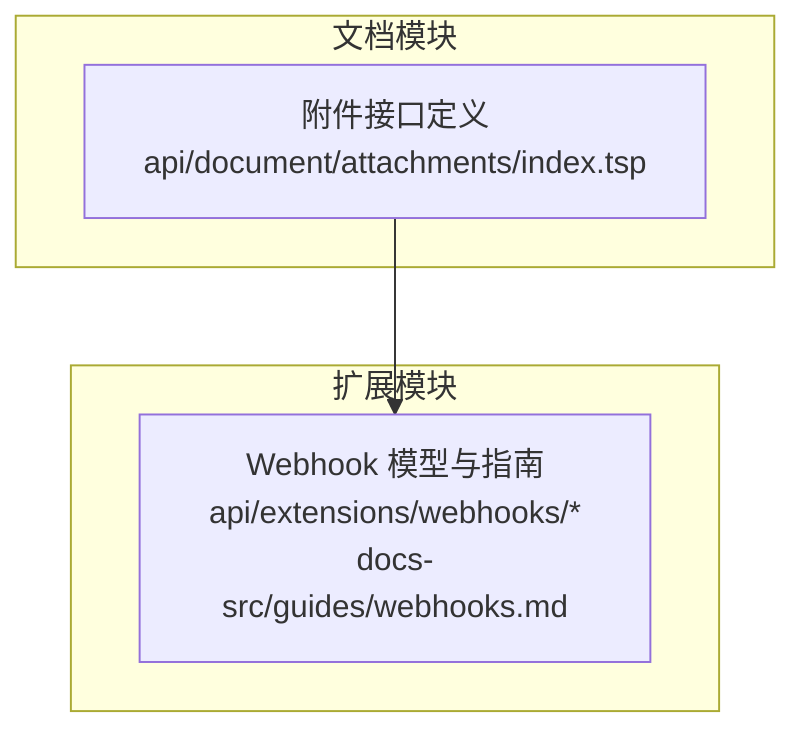
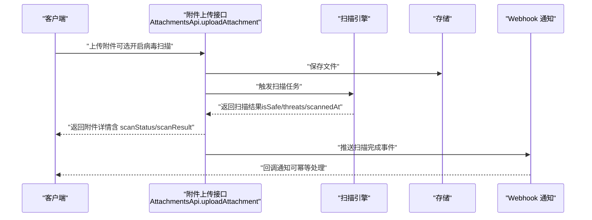
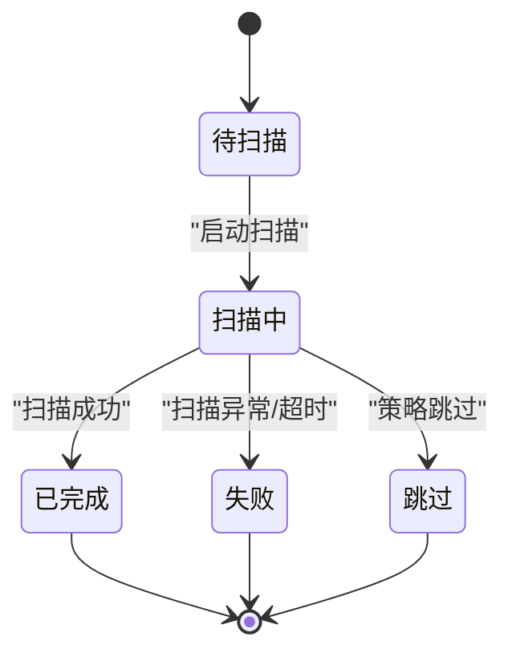
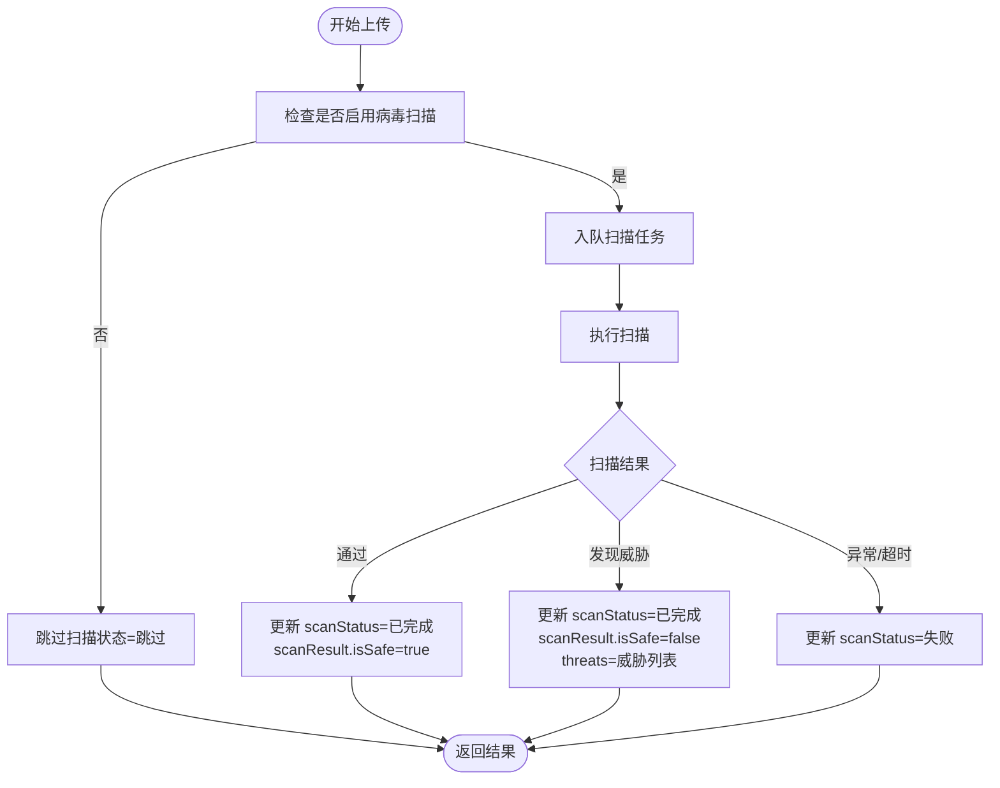
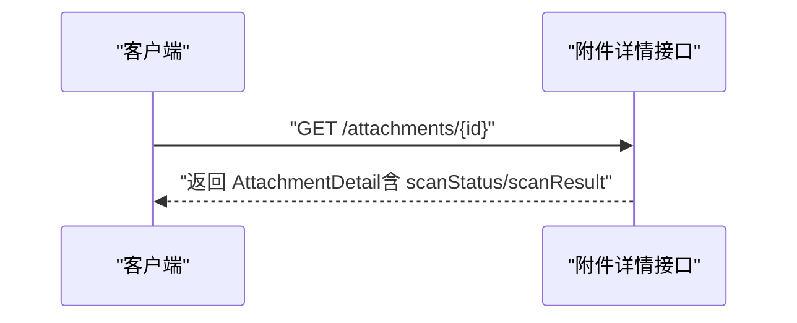
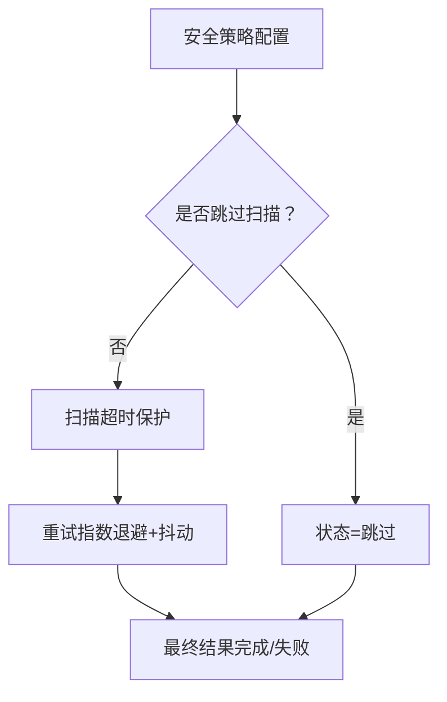
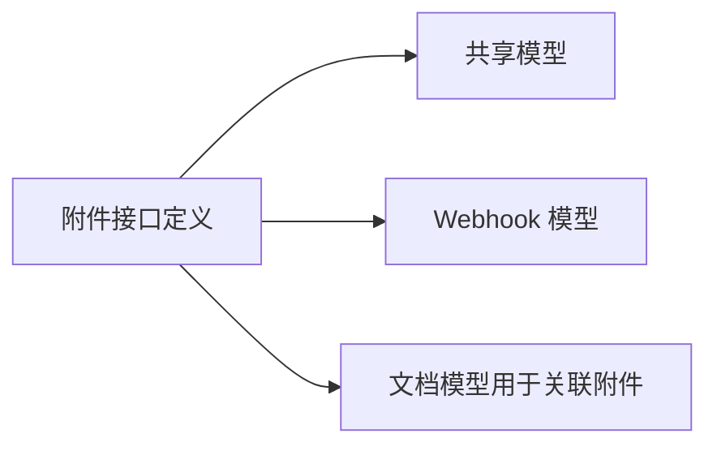

# 安全扫描

<cite>
**本文引用的文件**
- [api/document/attachments/index.tsp](file://api/document/attachments/index.tsp)
- [docs-src/guides/webhooks.md](file://docs-src/guides/webhooks.md)
- [api/extensions/webhooks/models.tsp](file://api/extensions/webhooks/models.tsp)
</cite>

## 目录
1. [简介](#简介)
2. [项目结构](#项目结构)
3. [核心组件](#核心组件)
4. [架构总览](#架构总览)
5. [详细组件分析](#详细组件分析)
6. [依赖关系分析](#依赖关系分析)
7. [性能考量](#性能考量)
8. [故障排查指南](#故障排查指南)
9. [结论](#结论)

## 简介
本文件面向 naxusbook-api 的附件安全扫描能力，聚焦以下目标：
- 详述 ScanStatus 枚举的五种状态及其转换逻辑
- 解释 scanResult 对象中 isSafe、threats、scannedAt 字段的语义
- 说明系统在上传时如何自动触发病毒扫描
- 说明如何通过 API 查询扫描结果
- 说明安全策略配置方式（跳过扫描的文件类型、扫描超时与重试机制）

## 项目结构
附件安全扫描能力主要位于文档模块的附件接口定义中，同时结合 Webhook 机制实现事件通知与重试策略。

**图表来源**
- [api/document/attachments/index.tsp](file://api/document/attachments/index.tsp#L1-L120)
- [docs-src/guides/webhooks.md](file://docs-src/guides/webhooks.md#L1-L120)
- [api/extensions/webhooks/models.tsp](file://api/extensions/webhooks/models.tsp#L45-L87)

**章节来源**
- [api/document/attachments/index.tsp](file://api/document/attachments/index.tsp#L1-L120)
- [docs-src/guides/webhooks.md](file://docs-src/guides/webhooks.md#L1-L120)
- [api/extensions/webhooks/models.tsp](file://api/extensions/webhooks/models.tsp#L45-L87)

## 核心组件
- ScanStatus 枚举：定义附件扫描生命周期状态
- AttachmentDetail.scanResult：承载扫描结果数据
- 上传接口：支持自动触发病毒扫描
- Webhook：用于扫描完成后异步通知与重试

**章节来源**
- [api/document/attachments/index.tsp](file://api/document/attachments/index.tsp#L144-L350)
- [api/document/attachments/index.tsp](file://api/document/attachments/index.tsp#L453-L520)
- [docs-src/guides/webhooks.md](file://docs-src/guides/webhooks.md#L643-L681)
- [api/extensions/webhooks/models.tsp](file://api/extensions/webhooks/models.tsp#L45-L87)

## 架构总览
附件安全扫描的端到端流程如下：
- 客户端调用上传接口，携带是否扫描病毒的参数
- 服务端接收文件并持久化，同时启动扫描任务
- 扫描完成后，将结果写入附件记录，并通过 Webhook 通知订阅方
- 订阅方可基于 scanResult 字段判断是否允许访问或继续处理

**图表来源**
- [api/document/attachments/index.tsp](file://api/document/attachments/index.tsp#L453-L520)
- [api/document/attachments/index.tsp](file://api/document/attachments/index.tsp#L144-L350)
- [docs-src/guides/webhooks.md](file://docs-src/guides/webhooks.md#L643-L681)
- [api/extensions/webhooks/models.tsp](file://api/extensions/webhooks/models.tsp#L45-L87)

## 详细组件分析

### ScanStatus 状态机与转换逻辑
- pending：待扫描。通常在文件入库后立即进入该状态
- scanning：扫描中。扫描任务已启动，正在执行病毒/恶意内容检测
- completed：已完成。扫描结束，结果已写入 scanResult
- failed：失败。扫描过程中出现异常或超时
- skipped：跳过。由于策略配置或文件类型原因未执行扫描

状态转换建议遵循以下顺序：
- pending -> scanning -> completed 或 failed
- pending -> scanning -> skipped（策略跳过）
- completed/failed/skipped 之间不再回退

**章节来源**
- [api/document/attachments/index.tsp](file://api/document/attachments/index.tsp#L316-L350)

### scanResult 字段语义
- isSafe：布尔值，表示扫描结果是否安全
- threats：字符串数组，记录检测到的威胁标识或类别
- scannedAt：字符串，记录扫描完成的时间戳

这些字段共同构成附件安全状态的最终判定依据。

**章节来源**
- [api/document/attachments/index.tsp](file://api/document/attachments/index.tsp#L166-L184)

### 上传时自动触发病毒扫描
- 上传接口支持开启病毒扫描的参数
- 上传成功后，系统会将文件放入扫描队列
- 扫描完成后，附件记录中的 scanStatus 与 scanResult 将被更新

**图表来源**
- [api/document/attachments/index.tsp](file://api/document/attachments/index.tsp#L453-L520)
- [api/document/attachments/index.tsp](file://api/document/attachments/index.tsp#L144-L350)

**章节来源**
- [api/document/attachments/index.tsp](file://api/document/attachments/index.tsp#L453-L520)

### 通过 API 查询扫描结果
- 列出附件与详情接口均返回 scanStatus 与 scanResult
- 订阅方可通过轮询或 Webhook 事件获知扫描完成

**图表来源**
- [api/document/attachments/index.tsp](file://api/document/attachments/index.tsp#L541-L560)

**章节来源**
- [api/document/attachments/index.tsp](file://api/document/attachments/index.tsp#L541-L560)

### 安全策略配置与扫描范围
- 跳过扫描的文件类型：由安全策略决定，常见策略包括对静态资源、已知安全类型或白名单文件的跳过
- 扫描超时与重试：扫描任务应具备超时保护与重试机制，避免阻塞上传流程
- Webhook 重试：系统提供指数退避与抖动的重试策略建议，确保事件可靠投递

**图表来源**
- [docs-src/guides/webhooks.md](file://docs-src/guides/webhooks.md#L643-L681)

**章节来源**
- [docs-src/guides/webhooks.md](file://docs-src/guides/webhooks.md#L643-L681)

## 依赖关系分析
- 附件模块依赖共享常量与通用响应模型
- Webhook 模块提供事件载荷与签名验证规范
- 附件接口与 Webhook 通过扫描完成事件耦合

**图表来源**
- [api/document/attachments/index.tsp](file://api/document/attachments/index.tsp#L1-L120)
- [api/extensions/webhooks/models.tsp](file://api/extensions/webhooks/models.tsp#L45-L87)

**章节来源**
- [api/document/attachments/index.tsp](file://api/document/attachments/index.tsp#L1-L120)
- [api/extensions/webhooks/models.tsp](file://api/extensions/webhooks/models.tsp#L45-L87)

## 性能考量
- 扫描任务应异步执行，避免阻塞上传接口
- 对大文件与高并发场景，建议采用队列限流与超时阈值
- Webhook 重试采用指数退避与抖动，降低峰值压力

[本节为通用指导，无需具体文件引用]

## 故障排查指南
- 若扫描状态长期停留在“待扫描/扫描中”，检查扫描队列与超时配置
- 若 scanResult.isSafe=false 且 threats 非空，应根据威胁类型采取隔离或告警
- 若 Webhook 未收到通知，检查签名验证、重试策略与回调幂等性

**章节来源**
- [docs-src/guides/webhooks.md](file://docs-src/guides/webhooks.md#L643-L681)

## 结论
- ScanStatus 与 scanResult 提供了清晰的附件安全状态表达
- 上传接口支持自动触发病毒扫描，并通过 Webhook 通知订阅方
- 安全策略可配置跳过扫描的文件类型，扫描应具备超时与重试保障
- 建议在客户端侧结合 scanResult 做访问控制与后续处理决策