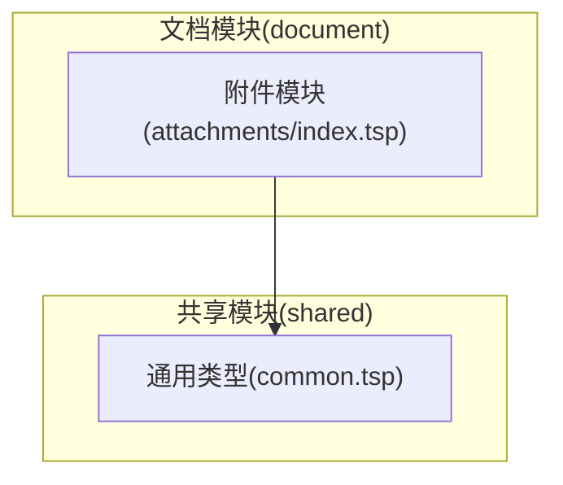
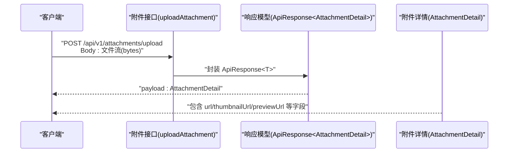
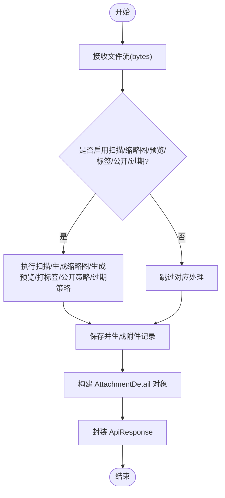
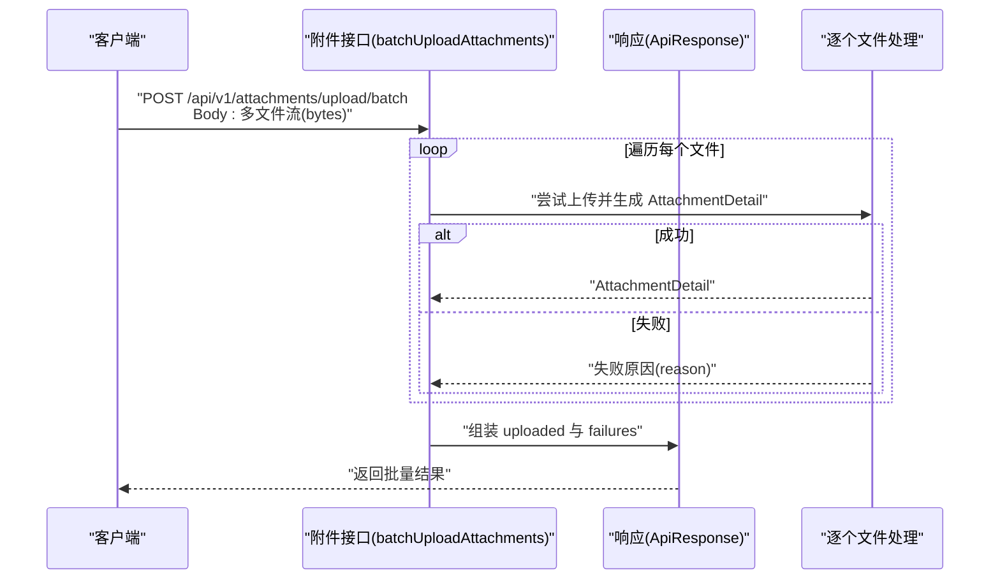
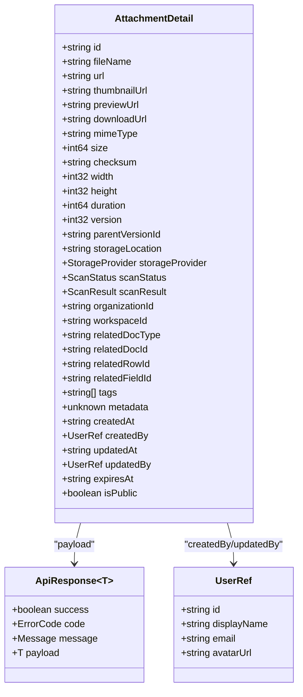

# 文件上传

<cite>
**本文引用的文件**
- [api/document/attachments/index.tsp](file://api/document/attachments/index.tsp)
- [api/shared/common.tsp](file://api/shared/common.tsp)
- [docs-src/references/api-reference.md](file://docs-src/references/api-reference.md)
- [README.md](file://README.md)
</cite>

## 目录
1. [简介](#简介)
2. [项目结构](#项目结构)
3. [核心组件](#核心组件)
4. [架构概览](#架构概览)
5. [详细组件分析](#详细组件分析)
6. [依赖分析](#依赖分析)
7. [性能考虑](#性能考虑)
8. [故障排查指南](#故障排查指南)
9. [结论](#结论)
10. [附录](#附录)

## 简介
本章节面向使用 nexusbook-api 的开发者，系统性说明“文件上传”能力，重点覆盖以下内容：
- uploadAttachment 接口如何接收文件流并返回包含 URL、缩略图 URL、预览 URL 的 AttachmentDetail 对象
- 支持的关键参数：scanForVirus、generateThumbnail、generatePreview、tags、isPublic、expiresIn 的语义与使用方式
- 响应结构中各字段的含义，包括文件 ID、存储位置、校验和、访问控制信息等
- batchUploadAttachments 批量上传接口的使用方法与成功/失败处理机制
- 通过 curl 展示单文件上传示例与响应解读

## 项目结构
文件上传能力位于文档模块下的附件子模块，采用 TypeSpec 定义 API，统一输出 OpenAPI 规范，便于生成客户端 SDK 与文档站点。

图表来源
- [api/document/attachments/index.tsp](file://api/document/attachments/index.tsp#L1-L60)
- [api/shared/common.tsp](file://api/shared/common.tsp#L1-L40)

章节来源
- [api/document/attachments/index.tsp](file://api/document/attachments/index.tsp#L1-L60)
- [api/shared/common.tsp](file://api/shared/common.tsp#L1-L40)

## 核心组件
- 附件接口定义：位于附件模块，提供 uploadAttachment 与 batchUploadAttachments 端点
- 附件详情模型：AttachmentDetail，承载上传后的文件元信息与访问链接
- 通用响应包装：ApiResponse<T>，统一返回结构
- 附件相关枚举：StorageProvider、ScanStatus、PreviewSize 等

章节来源
- [api/document/attachments/index.tsp](file://api/document/attachments/index.tsp#L453-L509)
- [api/document/attachments/index.tsp](file://api/document/attachments/index.tsp#L47-L269)
- [api/shared/common.tsp](file://api/shared/common.tsp#L153-L177)
- [api/document/attachments/index.tsp](file://api/document/attachments/index.tsp#L271-L351)
- [api/document/attachments/index.tsp](file://api/document/attachments/index.tsp#L723-L751)

## 架构概览
下图展示了上传流程从客户端到服务端的交互，以及返回的 AttachmentDetail 结构关键字段。

图表来源
- [api/document/attachments/index.tsp](file://api/document/attachments/index.tsp#L453-L479)
- [api/shared/common.tsp](file://api/shared/common.tsp#L153-L177)
- [api/document/attachments/index.tsp](file://api/document/attachments/index.tsp#L47-L269)

## 详细组件分析

### uploadAttachment 接口
- 功能：接收文件流，返回附件详情（包含 URL、缩略图 URL、预览 URL 等）
- 请求体：bytes（二进制文件流）
- 响应：ApiResponse<AttachmentDetail>
- 关键参数（注释中明确列出）：
  - scanForVirus：是否扫描病毒
  - generateThumbnail：是否生成缩略图
  - generatePreview：是否生成预览
  - tags：标签（逗号分隔字符串）
  - isPublic：是否公开访问
  - expiresIn：过期时间（秒）

图表来源
- [api/document/attachments/index.tsp](file://api/document/attachments/index.tsp#L456-L479)

章节来源
- [api/document/attachments/index.tsp](file://api/document/attachments/index.tsp#L456-L479)

### AttachmentDetail 字段说明
- 基本信息：id、fileName、originalFileName、mimeType、size、extension、checksum、width、height、duration、version、parentVersionId
- 访问链接：url、thumbnailUrl、previewUrl、downloadUrl
- 存储信息：storageLocation、storageProvider
- 安全扫描：scanStatus、scanResult（isSafe、threats、scannedAt）
- 关联信息：organizationId、workspaceId、relatedDocType、relatedDocId、relatedRowId、relatedFieldId
- 元数据与时间：tags、metadata、createdAt、createdBy、updatedAt、updatedBy、expiresAt、isPublic

章节来源
- [api/document/attachments/index.tsp](file://api/document/attachments/index.tsp#L47-L269)

### 批量上传 batchUploadAttachments
- 功能：一次性上传多个文件
- 请求体：bytes（多文件流）
- 响应：ApiResponse<{ uploaded: AttachmentDetail[]; failures?: { fileName: string; reason: string }[] }>
- 处理机制：
  - uploaded：成功上传的附件列表
  - failures：失败项列表，包含失败原因与对应文件名

图表来源
- [api/document/attachments/index.tsp](file://api/document/attachments/index.tsp#L488-L509)

章节来源
- [api/document/attachments/index.tsp](file://api/document/attachments/index.tsp#L488-L509)

### 通用响应结构
- ApiResponse<T>：success、code、message、payload
- 适用于所有接口，包括附件上传

章节来源
- [api/shared/common.tsp](file://api/shared/common.tsp#L153-L177)

### 附件相关枚举
- StorageProvider：本地、AWS S3、阿里云 OSS、腾讯云 COS、七牛云、Azure Blob、Google Cloud Storage
- ScanStatus：pending、scanning、completed、failed、skipped
- PreviewSize：small、medium、large、original

章节来源
- [api/document/attachments/index.tsp](file://api/document/attachments/index.tsp#L271-L351)
- [api/document/attachments/index.tsp](file://api/document/attachments/index.tsp#L723-L751)

## 依赖分析
- 附件模块依赖共享模块的通用类型（ApiResponse、UserRef 等）
- 附件详情模型复用共享模块中的 UserRef，用于记录创建人信息

图表来源
- [api/shared/common.tsp](file://api/shared/common.tsp#L153-L177)
- [api/shared/common.tsp](file://api/shared/common.tsp#L617-L653)
- [api/document/attachments/index.tsp](file://api/document/attachments/index.tsp#L47-L269)

章节来源
- [api/shared/common.tsp](file://api/shared/common.tsp#L153-L177)
- [api/shared/common.tsp](file://api/shared/common.tsp#L617-L653)
- [api/document/attachments/index.tsp](file://api/document/attachments/index.tsp#L47-L269)

## 性能考虑
- 大文件上传建议：
  - 合理设置超时与分块策略（客户端侧）
  - 服务端对文件大小与类型进行限制（服务端侧）
- 扫描与预览：
  - scanForVirus 与 generateThumbnail/generatePreview 会增加处理时间，建议按需开启
- 批量上传：
  - 合理拆分批次，避免单次请求过大导致内存压力

[本节为通用指导，无需特定文件引用]

## 故障排查指南
- 统一错误格式
  - 所有接口遵循 ApiResponse<T>，失败时包含 success=false、code、message
  - 可结合错误码参考文档定位问题
- 常见问题
  - 未携带 Authorization 或 Token 失效：检查认证流程与令牌有效期
  - 文件类型不支持：确认服务端允许的 MIME 类型范围
  - 存储配额不足：可通过配额接口查询组织存储使用情况
- 定位步骤
  - 使用 curl 直接调用接口，观察响应结构与状态码
  - 若 scanForVirus 或预览生成失败，检查对应服务可用性与网络策略

章节来源
- [docs-src/references/api-reference.md](file://docs-src/references/api-reference.md#L14-L55)
- [README.md](file://README.md#L63-L96)

## 结论
- uploadAttachment 提供了标准化的文件上传能力，返回包含 URL、缩略图 URL、预览 URL 的 AttachmentDetail
- 参数 scanForVirus、generateThumbnail、generatePreview、tags、isPublic、expiresIn 可按需启用
- batchUploadAttachments 支持批量上传，返回 uploaded 与 failures，便于精细化处理
- 建议结合错误码与 API 参考文档进行集成与排错

[本节为总结，无需特定文件引用]

## 附录

### curl 单文件上传示例
- 基本用法
  - 使用 multipart/form-data 上传文件
  - 可选参数：scanForVirus、generateThumbnail、generatePreview、tags、isPublic、expiresIn
- 示例路径
  - 参考附件模块中的示例注释，展示 curl 上传单文件的基本形式

章节来源
- [api/document/attachments/index.tsp](file://api/document/attachments/index.tsp#L31-L40)

### 响应字段含义对照
- 基本信息
  - id：附件唯一标识
  - fileName/originalFileName：规范化与原始文件名
  - mimeType/size/extension：媒体类型、大小、扩展名
  - checksum：完整性校验（SHA256）
  - width/height/duration：图像/视频宽高与音频时长
  - version/parentVersionId：版本号与父版本 ID
- 访问链接
  - url/downloadUrl/thumbnailUrl/previewUrl：可访问的下载/缩略图/预览地址
- 存储与安全
  - storageLocation/storageProvider：存储位置与提供商
  - scanStatus/scanResult：扫描状态与结果
- 关联与控制
  - organizationId/workspaceId/related*：所属组织/工作区与关联文档/行/字段
  - tags/metadata：标签与自定义元数据
  - createdAt/createdBy/updatedAt/updatedBy：创建与更新信息
  - expiresAt/isPublic：过期时间与公开访问标记

章节来源
- [api/document/attachments/index.tsp](file://api/document/attachments/index.tsp#L47-L269)

### 批量上传成功与失败处理
- 成功：uploaded 字段包含每个文件对应的 AttachmentDetail
- 失败：failures 字段包含失败文件名与原因，便于前端提示与重试

章节来源
- [api/document/attachments/index.tsp](file://api/document/attachments/index.tsp#L488-L509)