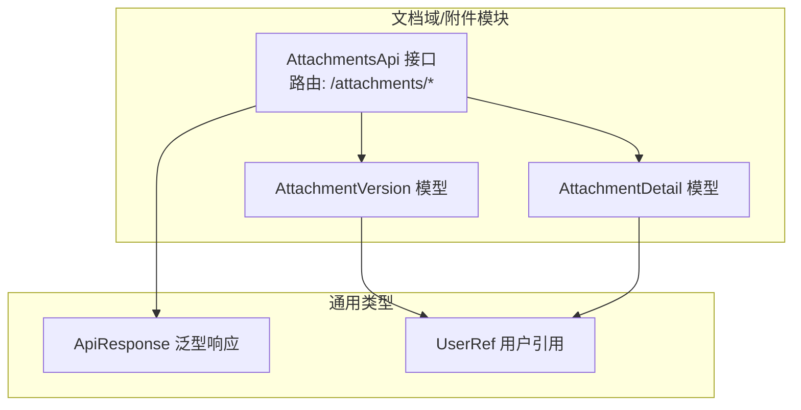
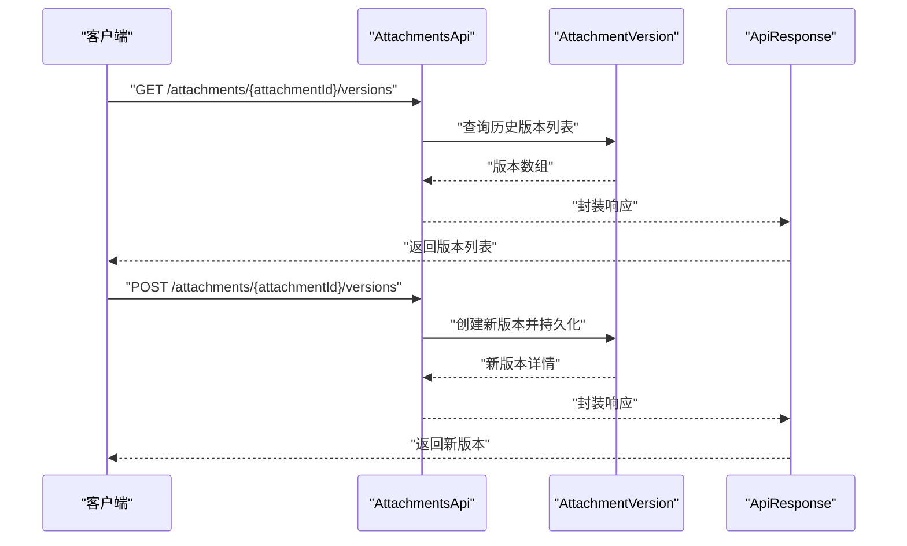
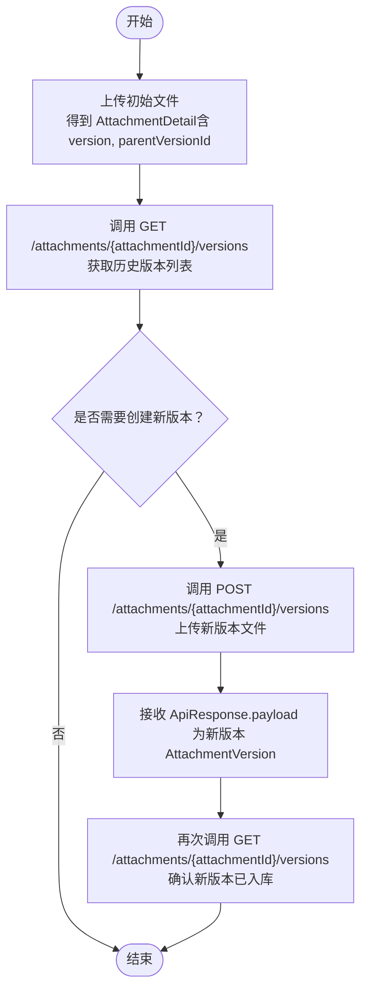
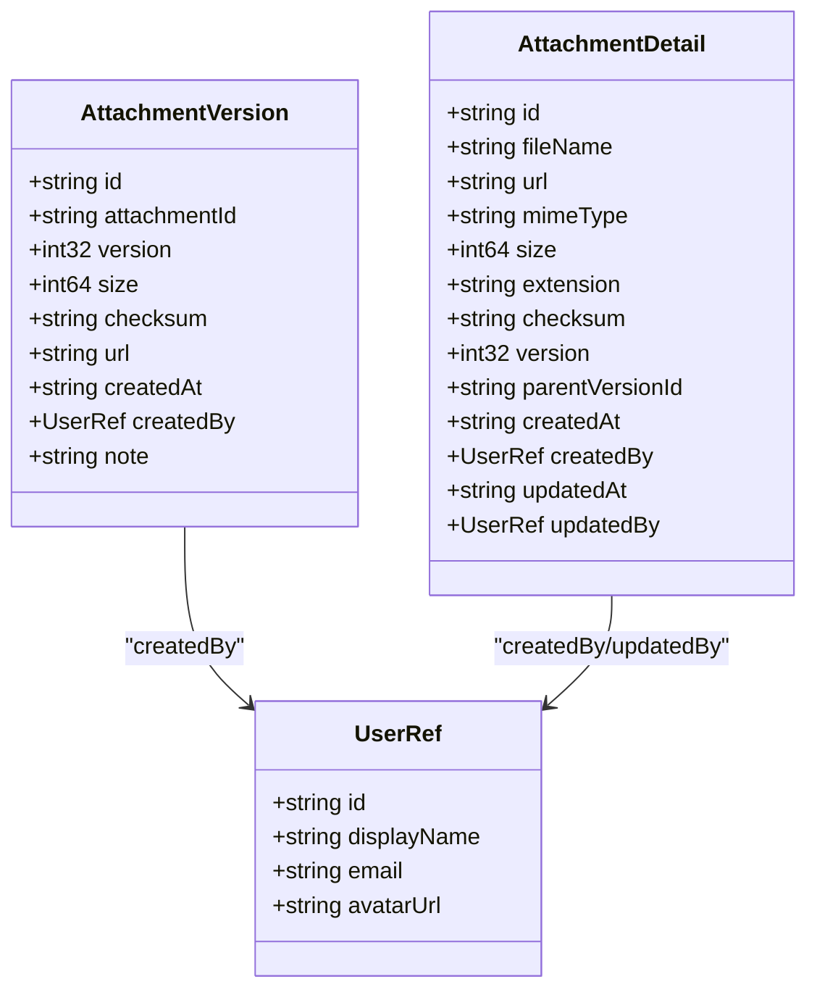

# 版本管理

<cite>
**本文引用的文件**
- [api/document/attachments/index.tsp](file://api/document/attachments/index.tsp)
- [api/shared/common.tsp](file://api/shared/common.tsp)
</cite>

## 目录
1. [简介](#简介)
2. [项目结构](#项目结构)
3. [核心组件](#核心组件)
4. [架构概览](#架构概览)
5. [详细组件分析](#详细组件分析)
6. [依赖分析](#依赖分析)
7. [性能考虑](#性能考虑)
8. [故障排查指南](#故障排查指南)
9. [结论](#结论)
10. [附录](#附录)

## 简介
本章节面向使用 nexusbook-api 的开发者，系统性说明附件版本管理能力。重点覆盖：
- AttachmentVersion 模型的字段定义与含义
- getAttachmentVersions 接口如何获取附件历史版本列表
- createAttachmentVersion 接口如何为现有附件创建新版本
- 版本间的父子关系与版本递增机制
- 使用示例：版本更新流程
- 版本删除策略（随附件删除而清除）

## 项目结构
附件版本管理位于文档域下的附件模块中，核心接口与模型均在此处定义。

图表来源
- [api/document/attachments/index.tsp](file://api/document/attachments/index.tsp#L533-L721)
- [api/shared/common.tsp](file://api/shared/common.tsp#L153-L177)

章节来源
- [api/document/attachments/index.tsp](file://api/document/attachments/index.tsp#L533-L721)

## 核心组件
- AttachmentVersion：描述附件的某个历史版本，包含版本号、文件大小、校验和、URL、创建人等关键信息。
- AttachmentsApi 接口：提供获取版本列表与创建新版本的能力。
- ApiResponse：统一响应包装，承载业务结果。

章节来源
- [api/document/attachments/index.tsp](file://api/document/attachments/index.tsp#L356-L409)
- [api/document/attachments/index.tsp](file://api/document/attachments/index.tsp#L593-L615)
- [api/shared/common.tsp](file://api/shared/common.tsp#L153-L177)

## 架构概览
下图展示了“获取版本列表”和“创建新版本”的典型调用序列。

图表来源
- [api/document/attachments/index.tsp](file://api/document/attachments/index.tsp#L593-L615)

## 详细组件分析

### AttachmentVersion 模型
AttachmentVersion 描述附件的一个历史版本，字段如下：
- id：版本唯一标识
- attachmentId：所属附件的标识
- version：版本号（整型，递增）
- size：文件大小（字节）
- checksum：校验和（SHA256）
- url：可访问的下载/预览 URL
- createdAt：创建时间
- createdBy：创建人（用户引用）
- note：变更说明（可选）

该模型未包含 parentVersionId 字段；父版本关系由版本号的递增与时间顺序共同体现。

章节来源
- [api/document/attachments/index.tsp](file://api/document/attachments/index.tsp#L356-L409)

### getAttachmentVersions 接口
- 路由：GET /attachments/{attachmentId}/versions
- 功能：返回指定附件的所有历史版本列表
- 返回：AttachmentVersion 数组，封装在 ApiResponse 中

使用要点：
- 该接口返回的是历史版本列表，通常按版本号或创建时间排序
- 客户端可据此进行版本对比、回溯与选择

章节来源
- [api/document/attachments/index.tsp](file://api/document/attachments/index.tsp#L593-L598)
- [api/shared/common.tsp](file://api/shared/common.tsp#L153-L177)

### createAttachmentVersion 接口
- 路由：POST /attachments/{attachmentId}/versions
- 功能：为现有附件上传新版本
- 输入：二进制文件体
- 返回：新版本的 AttachmentVersion，封装在 ApiResponse 中

版本递增机制：
- 该接口负责创建新版本，版本号遵循递增规则（例如按时间先后递增）
- 新版本通常继承附件的元信息，但文件内容与校验和可能不同

章节来源
- [api/document/attachments/index.tsp](file://api/document/attachments/index.tsp#L608-L615)
- [api/shared/common.tsp](file://api/shared/common.tsp#L153-L177)

### 版本删除策略
- 删除附件时，其“所有版本”会被一并删除
- 该行为不可逆，删除后无法通过版本接口恢复

章节来源
- [api/document/attachments/index.tsp](file://api/document/attachments/index.tsp#L577-L583)

### 与 AttachmentDetail 的关系
- AttachmentDetail 是“当前版本”的完整信息，包含版本号、父版本ID等字段
- AttachmentVersion 是“历史版本”的轻量信息，包含版本号、文件大小、校验和、URL 等

两者的关系体现在：
- AttachmentDetail.version 表示当前版本号
- AttachmentDetail.parentVersionId 表示父版本 ID（用于版本链路）
- AttachmentVersion.version 表示历史版本号，用于版本列表展示

章节来源
- [api/document/attachments/index.tsp](file://api/document/attachments/index.tsp#L132-L142)
- [api/document/attachments/index.tsp](file://api/document/attachments/index.tsp#L356-L409)

### 版本更新流程（使用示例）
以下流程基于接口定义与模型字段，帮助你理解版本更新的典型步骤：

图表来源
- [api/document/attachments/index.tsp](file://api/document/attachments/index.tsp#L593-L615)

## 依赖分析
- AttachmentVersion 依赖通用类型 UserRef（用于 createdBy）
- 接口返回统一使用 ApiResponse 包装
- 附件详情与版本详情分别服务于“当前版本”和“历史版本”的不同视角

图表来源
- [api/document/attachments/index.tsp](file://api/document/attachments/index.tsp#L356-L409)
- [api/document/attachments/index.tsp](file://api/document/attachments/index.tsp#L47-L269)
- [api/shared/common.tsp](file://api/shared/common.tsp#L617-L653)

章节来源
- [api/document/attachments/index.tsp](file://api/document/attachments/index.tsp#L356-L409)
- [api/document/attachments/index.tsp](file://api/document/attachments/index.tsp#L47-L269)
- [api/shared/common.tsp](file://api/shared/common.tsp#L617-L653)

## 性能考虑
- 版本列表查询建议结合分页参数（若后续扩展）以避免一次性返回大量历史版本
- 新版本上传建议启用文件校验与压缩策略，降低网络传输与存储成本
- 对频繁访问的预览/下载 URL，建议配合 CDN 或缓存策略提升响应速度

## 故障排查指南
- 版本列表为空：确认附件是否存在且已有历史版本；检查 attachmentId 是否正确
- 创建新版本失败：检查文件大小限制、存储配额、权限与病毒扫描状态
- 版本删除后无法恢复：删除接口明确“删除附件及其所有版本”，请谨慎操作

章节来源
- [api/document/attachments/index.tsp](file://api/document/attachments/index.tsp#L577-L583)

## 结论
- AttachmentVersion 提供了对附件历史版本的结构化描述，便于版本对比、回溯与审计
- getAttachmentVersions 与 createAttachmentVersion 构成了版本管理的核心能力
- 版本删除策略确保数据一致性，删除不可逆
- 建议在业务侧维护版本号递增与父版本链路，以满足复杂场景的版本演进需求

## 附录
- 版本号递增与父版本链路：当前模型未显式提供 parentVersionId 字段，但可通过版本号与时间顺序推导版本关系；如需强约束，可在上层业务逻辑中维护 parentVersionId 字段
- 响应格式：统一使用 ApiResponse 包装，便于错误处理与国际化消息