# 附件管理

<cite>
**本文档引用的文件**
- [index.tsp](file://api/document/attachments/index.tsp)
- [common.tsp](file://api/shared/common.tsp)
- [metadata.tsp](file://api/document/core/metadata.tsp)
- [data.tsp](file://api/document/core/data.tsp)
- [properties.tsp](file://api/document/core/properties.tsp)
- [constants.tsp](file://api/shared/constants.tsp)
</cite>

## 目录
1. [简介](#简介)
2. [核心模型](#核心模型)
3. [文件上传](#文件上传)
4. [版本管理](#版本管理)
5. [安全扫描](#安全扫描)
6. [存储配额](#存储配额)
7. [访问控制](#访问控制)
8. [预览与下载](#预览与下载)
9. [清理过期附件](#清理过期附件)
10. [集成与使用场景](#集成与使用场景)

## 简介

nexusbook-api 的附件管理功能提供了一套完整的文件存储和管理解决方案，支持在数据行和文档属性中使用。该功能不仅支持基本的文件上传和下载，还提供了版本管理、安全扫描、存储配额控制和访问权限管理等高级特性。

附件管理模块的核心是 `AttachmentDetail` 模型，它包含了文件的元数据、访问信息和安全状态。通过 `uploadAttachment` 接口可以上传文件并获取包含 URL、缩略图 URL 和预览 URL 的详细信息。批量上传功能 `batchUploadAttachments` 允许一次性上传多个文件。`getAttachmentDownloadUrl` 可以生成临时下载链接，而 `getAttachmentPreview` 则用于生成文件预览。

该模块还支持附件版本历史追踪，通过 `AttachmentVersion` 模型记录每次变更，并提供 `createAttachmentVersion` 接口创建新版本。`StorageQuota` 模型用于管理组织级别的存储限额。系统还提供了 `cleanupExpiredAttachments` 接口来清理过期的临时附件。

**Section sources**
- [index.tsp](file://api/document/attachments/index.tsp#L8-L29)

## 核心模型

### AttachmentDetail 模型

`AttachmentDetail` 模型是附件管理的核心数据结构，包含了文件的完整信息。该模型不仅包含基本的文件元数据，还包含了访问控制、安全状态和版本信息。

```mermaid
classDiagram
class AttachmentDetail {
+id : string
+fileName : string
+originalFileName? : string
+url : string
+thumbnailUrl? : string
+previewUrl? : string
+downloadUrl? : string
+mimeType : string
+size : int64
+extension? : string
+checksum? : string
+width? : int32
+height? : int32
+duration? : int64
+version? : int32
+parentVersionId? : string
+storageLocation? : string
+storageProvider? : StorageProvider
+scanStatus? : ScanStatus
+scanResult? : ScanResult
+organizationId? : string
+workspaceId? : string
+relatedDocType? : string
+relatedDocId? : string
+relatedRowId? : string
+relatedFieldId? : string
+tags? : string[]
+metadata? : unknown
+createdAt : string
+createdBy : UserRef
+updatedAt? : string
+updatedBy? : NexusBook.Api.Common.UserRef
+expiresAt? : string
+isPublic? : boolean
}
class ScanResult {
+isSafe : boolean
+threats? : string[]
+scannedAt? : string
}
class UserRef {
+id : string
+displayName : string
+email? : string
+avatarUrl? : string
}
enum StorageProvider {
local
s3
oss
cos
qiniu
azure
gcs
}
enum ScanStatus {
pending
scanning
completed
failed
skipped
}
AttachmentDetail --> ScanResult : "包含"
AttachmentDetail --> UserRef : "创建者"
AttachmentDetail --> StorageProvider : "存储提供商"
AttachmentDetail --> ScanStatus : "扫描状态"
```

**Diagram sources**
- [index.tsp](file://api/document/attachments/index.tsp#L47-L269)

**Section sources**
- [index.tsp](file://api/document/attachments/index.tsp#L47-L269)

### AttachmentVersion 模型

`AttachmentVersion` 模型用于管理附件的版本历史，支持版本追踪和回滚功能。每个版本记录了文件的快照信息，包括大小、校验和和创建信息。

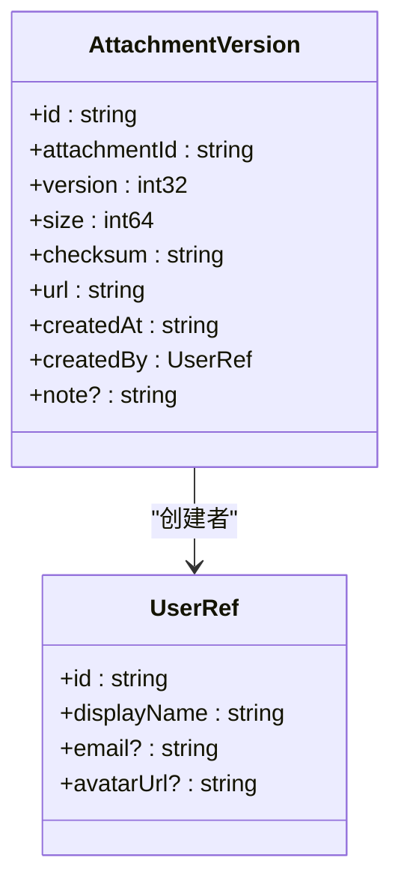

**Diagram sources**
- [index.tsp](file://api/document/attachments/index.tsp#L356-L409)

**Section sources**
- [index.tsp](file://api/document/attachments/index.tsp#L356-L409)

### StorageQuota 模型

`StorageQuota` 模型用于管理组织级别的存储配额，跟踪已使用和剩余的存储空间。

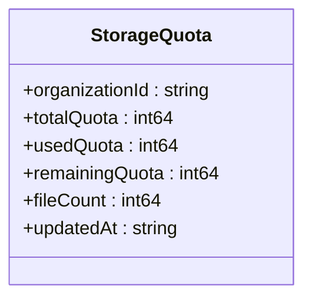

**Diagram sources**
- [index.tsp](file://api/document/attachments/index.tsp#L415-L451)

**Section sources**
- [index.tsp](file://api/document/attachments/index.tsp#L415-L451)

## 文件上传

### 单文件上传

通过 `uploadAttachment` 接口可以上传单个文件。该接口支持多种参数来控制上传行为，包括病毒扫描、缩略图生成和预览生成。

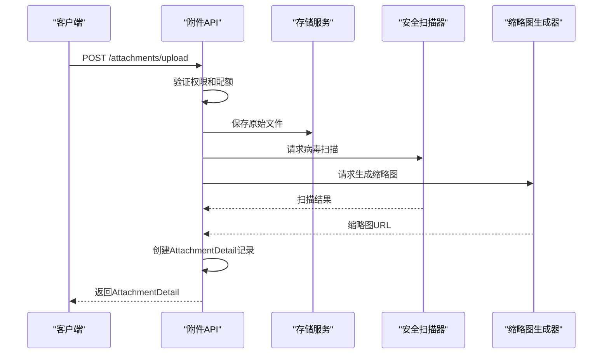

**Diagram sources**
- [index.tsp](file://api/document/attachments/index.tsp#L473-L478)

**Section sources**
- [index.tsp](file://api/document/attachments/index.tsp#L473-L478)

### 批量上传

`batchUploadAttachments` 接口支持一次性上传多个文件，提高批量操作的效率。

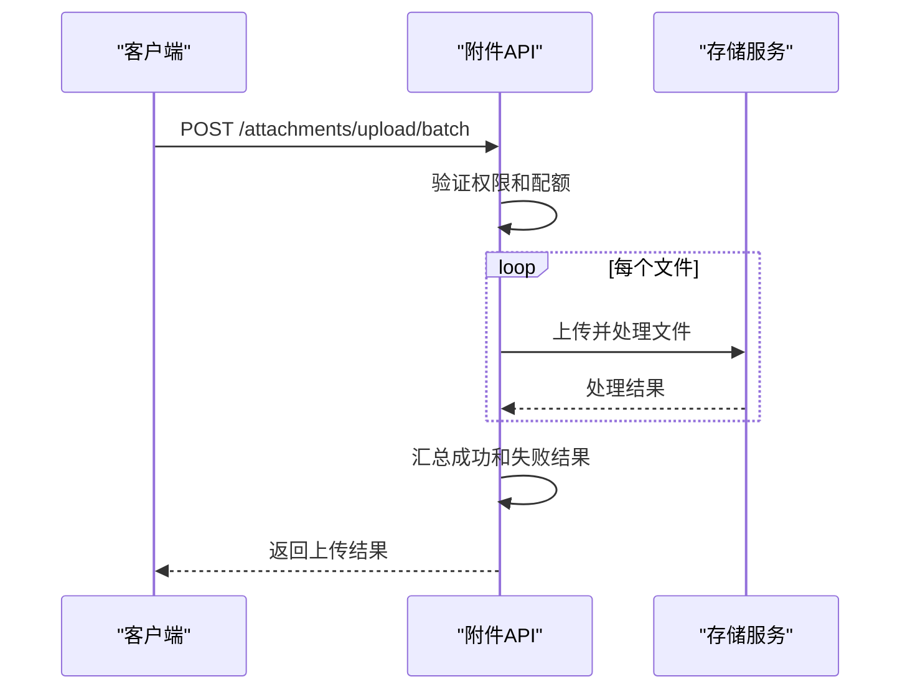

**Diagram sources**
- [index.tsp](file://api/document/attachments/index.tsp#L488-L508)

**Section sources**
- [index.tsp](file://api/document/attachments/index.tsp#L488-L508)

## 版本管理

### 版本历史追踪

附件管理模块支持完整的版本历史追踪功能。每次对附件进行更新都会创建一个新的版本记录，保留文件的历史状态。

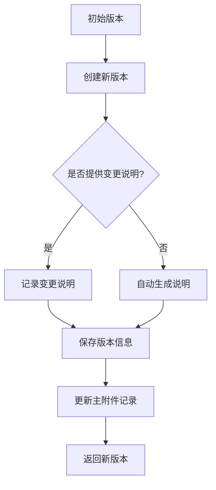

**Diagram sources**
- [index.tsp](file://api/document/attachments/index.tsp#L593-L598)

**Section sources**
- [index.tsp](file://api/document/attachments/index.tsp#L593-L598)

### 创建新版本

通过 `createAttachmentVersion` 接口可以为现有附件创建新版本。这个操作会保留原始文件的历史版本，同时更新主附件记录指向最新版本。

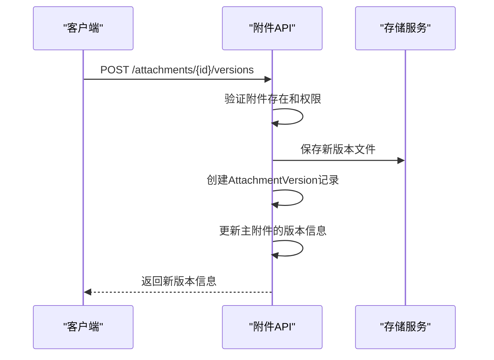

**Diagram sources**
- [index.tsp](file://api/document/attachments/index.tsp#L608-L614)

**Section sources**
- [index.tsp](file://api/document/attachments/index.tsp#L608-L614)

## 安全扫描

附件管理模块集成了安全扫描功能，确保上传的文件不包含病毒或恶意内容。

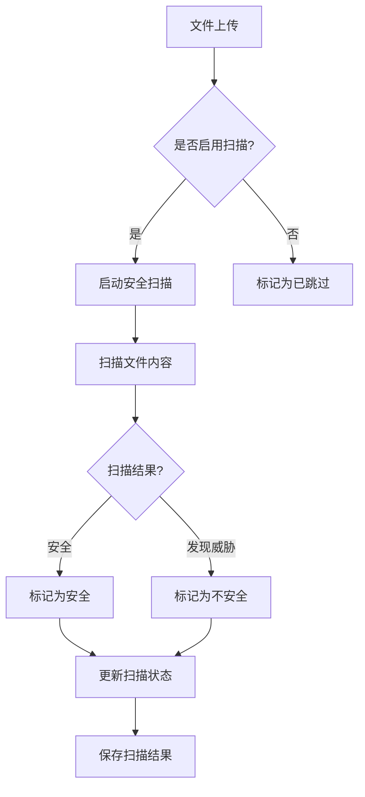

**Diagram sources**
- [index.tsp](file://api/document/attachments/index.tsp#L156-L184)

**Section sources**
- [index.tsp](file://api/document/attachments/index.tsp#L156-L184)

## 存储配额

### 配额管理

`StorageQuota` 模型用于管理组织级别的存储限额，确保资源的合理分配和使用。

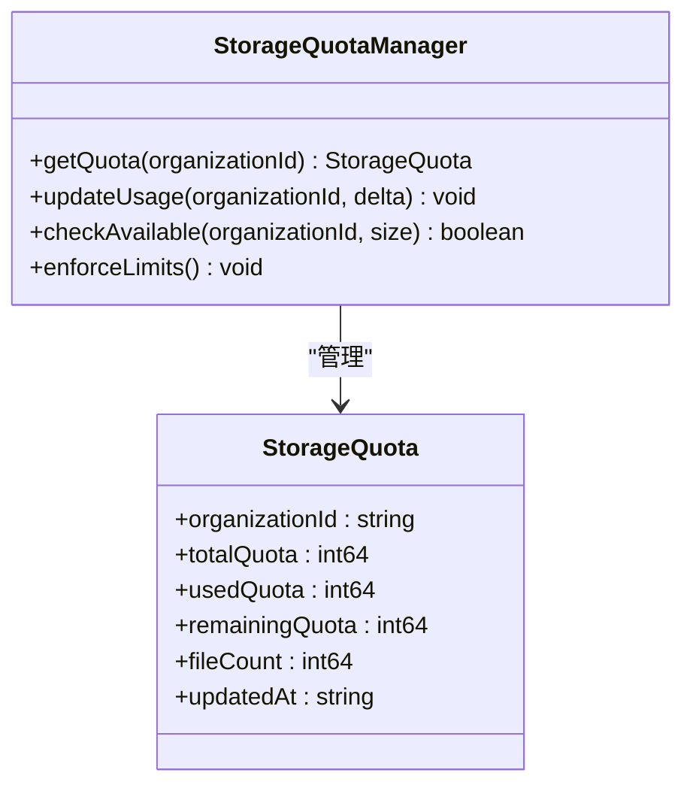

**Diagram sources**
- [index.tsp](file://api/document/attachments/index.tsp#L681-L686)

**Section sources**
- [index.tsp](file://api/document/attachments/index.tsp#L681-L686)

## 访问控制

附件管理模块提供了基于权限的访问控制机制，确保只有授权用户才能访问特定附件。

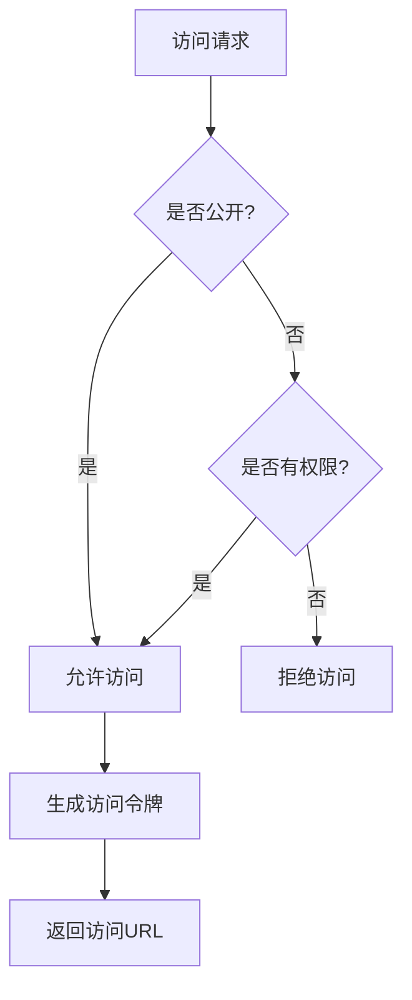

**Diagram sources**
- [index.tsp](file://api/document/attachments/index.tsp#L265-L268)

**Section sources**
- [index.tsp](file://api/document/attachments/index.tsp#L265-L268)

## 预览与下载

### 生成预览

`getAttachmentPreview` 接口用于生成附件的预览URL，支持不同尺寸的预览图。

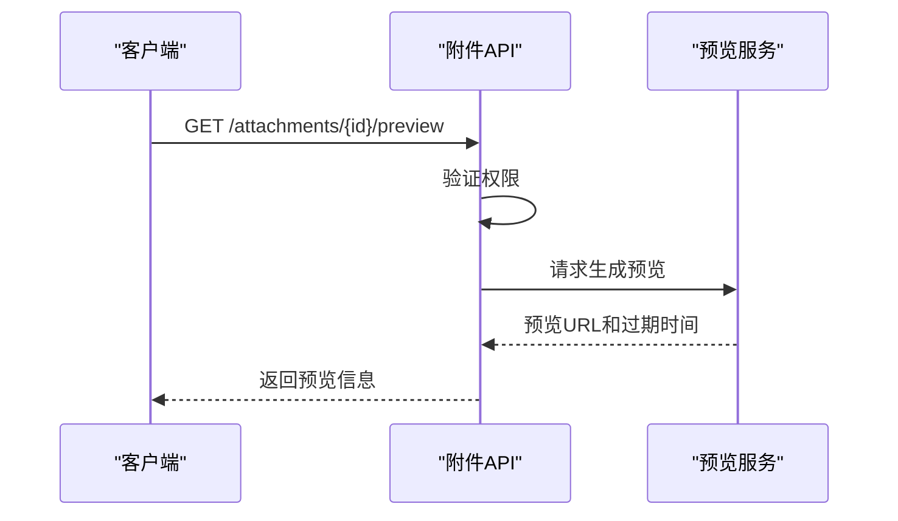

**Diagram sources**
- [index.tsp](file://api/document/attachments/index.tsp#L624-L643)

**Section sources**
- [index.tsp](file://api/document/attachments/index.tsp#L624-L643)

### 生成下载链接

`getAttachmentDownloadUrl` 接口用于生成临时下载URL，确保文件的安全访问。

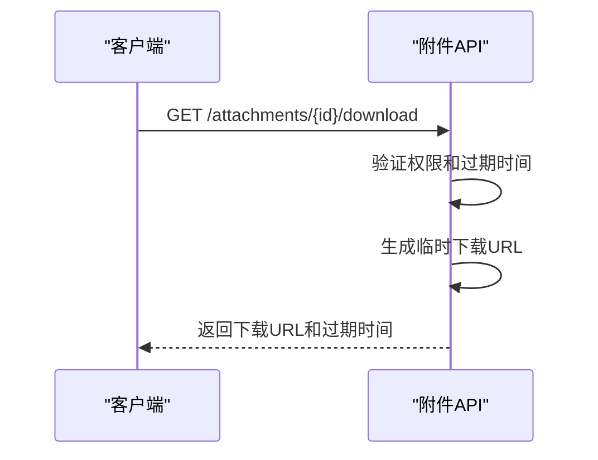

**Diagram sources**
- [index.tsp](file://api/document/attachments/index.tsp#L653-L671)

**Section sources**
- [index.tsp](file://api/document/attachments/index.tsp#L653-L671)

## 清理过期附件

`cleanupExpiredAttachments` 接口用于清理已过期的临时附件，释放存储空间。

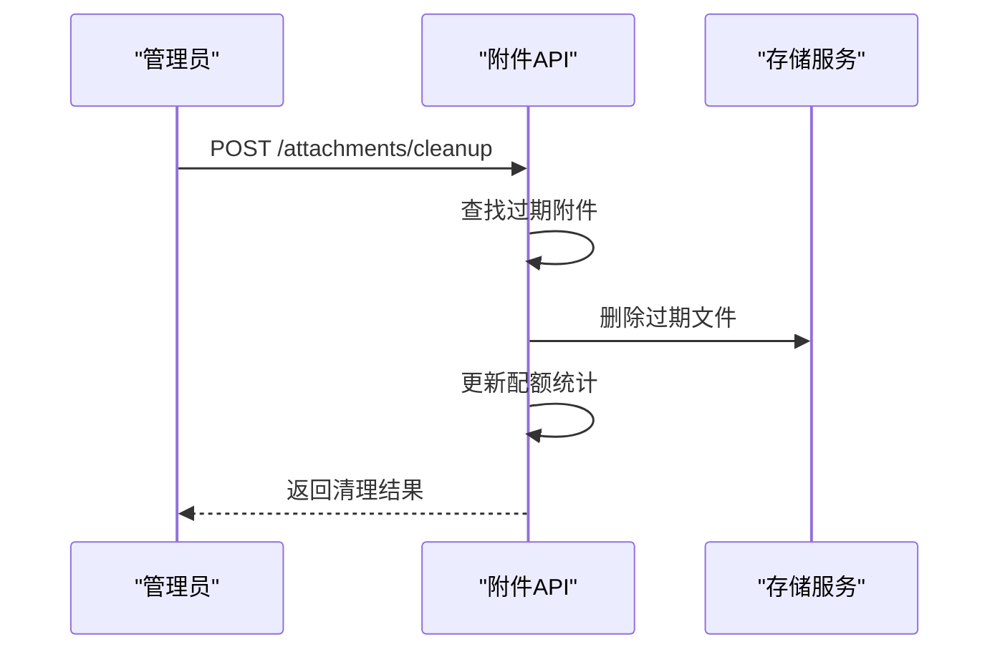

**Diagram sources**
- [index.tsp](file://api/document/attachments/index.tsp#L696-L720)

**Section sources**
- [index.tsp](file://api/document/attachments/index.tsp#L696-L720)

## 集成与使用场景

### 在数据行中使用附件

附件可以作为数据行的字段值使用，通过 `FieldType.attachment` 类型定义。

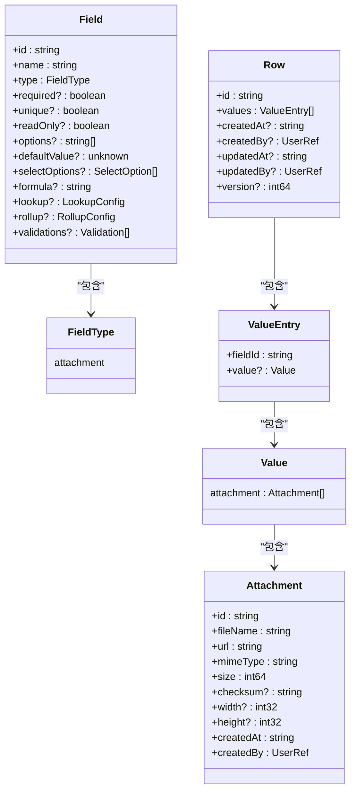

**Diagram sources**
- [metadata.tsp](file://api/document/core/metadata.tsp#L29-L40)
- [data.tsp](file://api/document/core/data.tsp#L248-L311)
- [common.tsp](file://api/shared/common.tsp#L525-L580)

**Section sources**
- [metadata.tsp](file://api/document/core/metadata.tsp#L29-L40)
- [data.tsp](file://api/document/core/data.tsp#L248-L311)
- [common.tsp](file://api/shared/common.tsp#L525-L580)

### 在文档属性中使用附件

附件也可以作为文档级别的属性使用，例如文档封面图或Logo。

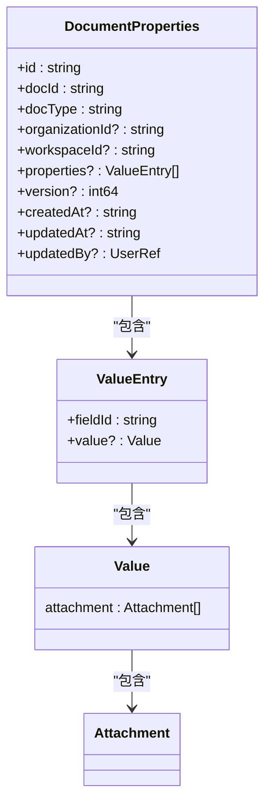

**Diagram sources**
- [properties.tsp](file://api/document/core/properties.tsp#L94-L198)
- [common.tsp](file://api/shared/common.tsp#L721)

**Section sources**
- [properties.tsp](file://api/document/core/properties.tsp#L94-L198)
- [common.tsp](file://api/shared/common.tsp#L721)