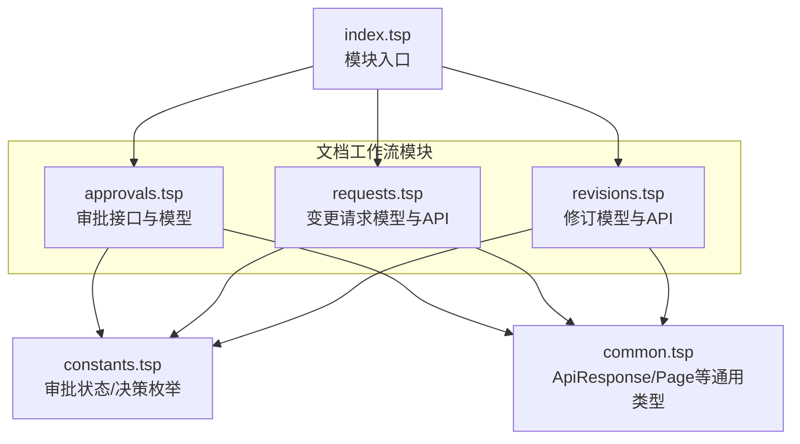
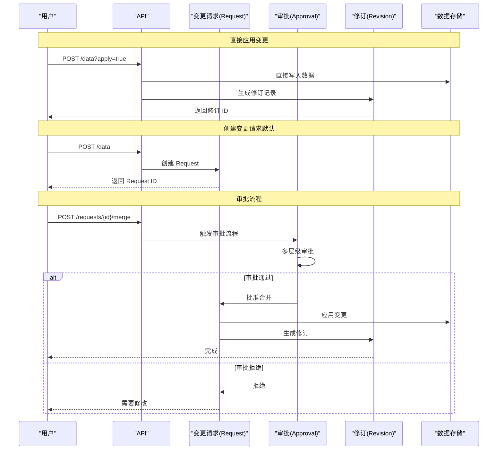
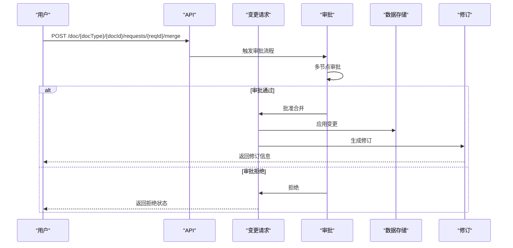
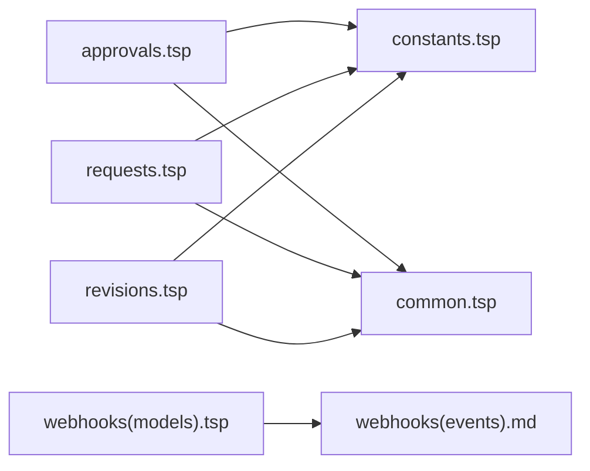

# 审批流程

<cite>
**本文引用的文件**
- [approvals.tsp](file://api/document/workflow/approvals.tsp)
- [index.tsp](file://api/document/workflow/index.tsp)
- [requests.tsp](file://api/document/workflow/requests.tsp)
- [revisions.tsp](file://api/document/workflow/revisions.tsp)
- [constants.tsp](file://api/shared/constants.tsp)
- [common.tsp](file://api/shared/common.tsp)
- [WEBHOOK_GUIDE.md](file://api/extensions/webhooks/WEBHOOK_GUIDE.md)
- [webhooks.md](file://docs-src/guides/webhooks.md)
- [models.tsp](file://api/extensions/webhooks/models.tsp)
- [architecture.md](file://docs-src/guides/architecture.md)
</cite>

## 目录
1. [简介](#简介)
2. [项目结构](#项目结构)
3. [核心组件](#核心组件)
4. [架构总览](#架构总览)
5. [详细组件分析](#详细组件分析)
6. [依赖分析](#依赖分析)
7. [性能考虑](#性能考虑)
8. [故障排查指南](#故障排查指南)
9. [结论](#结论)
10. [附录](#附录)

## 简介
本技术文档聚焦 nexusbook-api 的审批流程（Approvals）能力，围绕 ApprovalInstance 模型、审批历史记录、审批接口与多节点审批流程展开，帮助开发者与使用者理解如何通过审批保障关键数据变更的安全与合规。文档还说明审批流程与变更请求（Requests）的集成方式，以及如何利用 Webhook 实时感知审批状态变化。

## 项目结构
审批流程位于文档工作流模块下，与变更请求（Requests）和修订（Revisions）紧密协作，形成“变更 -> 请求 -> 审批 -> 合并 -> 修订”的闭环。

图表来源
- [index.tsp](file://api/document/workflow/index.tsp#L1-L17)
- [approvals.tsp](file://api/document/workflow/approvals.tsp#L96-L155)
- [requests.tsp](file://api/document/workflow/requests.tsp#L202-L390)
- [revisions.tsp](file://api/document/workflow/revisions.tsp#L323-L546)
- [constants.tsp](file://api/shared/constants.tsp#L33-L85)
- [common.tsp](file://api/shared/common.tsp#L153-L177)

章节来源
- [index.tsp](file://api/document/workflow/index.tsp#L1-L17)

## 核心组件
- ApprovalInstance：审批实例的核心数据结构，包含实例标识、状态、当前节点与审批历史。
- ApprovalApi：提供获取审批定义/概述与发起审批的能力。
- ApprovalInstanceApi：提供获取审批详情与对审批实例做决策的能力。
- 审批状态与决策：由共享常量定义，统一约束审批生命周期与决策语义。
- 变更请求与修订：审批通常与变更请求合并流程联动，合并后生成修订记录。

章节来源
- [approvals.tsp](file://api/document/workflow/approvals.tsp#L40-L94)
- [approvals.tsp](file://api/document/workflow/approvals.tsp#L96-L155)
- [constants.tsp](file://api/shared/constants.tsp#L33-L85)
- [requests.tsp](file://api/document/workflow/requests.tsp#L83-L200)
- [revisions.tsp](file://api/document/workflow/revisions.tsp#L158-L314)

## 架构总览
审批流程与变更请求、修订的关系如下：

图表来源
- [architecture.md](file://docs-src/guides/architecture.md#L254-L304)

## 详细组件分析

### ApprovalInstance 模型
- 字段说明
  - id：审批实例唯一标识。
  - status：审批状态，取值范围见“审批状态”。
  - currentNode：当前处于的审批节点标识（若存在）。
  - history：审批历史记录数组，每条记录包含：
    - nodeId：节点标识。
    - actor：操作人标识（可选）。
    - decision：决策（approve/reject/request_changes），见“审批决策”。
    - comment：备注（可选）。
    - timestamp：决策时间戳。

- 数据复杂度
  - history 数组长度取决于审批节点数量与决策次数，典型为 O(N)。
  - currentNode 为可选字符串，空间复杂度 O(1)。

- 错误处理与边界
  - currentNode 可能为空，表示流程尚未进入任何节点或流程结束。
  - actor 与 comment 可为空，表示匿名或未留备注。

章节来源
- [approvals.tsp](file://api/document/workflow/approvals.tsp#L40-L94)

### 审批历史记录条目
- 审批历史用于审计与追溯，每条记录包含：
  - 节点标识：用于定位流程中的具体审批环节。
  - 操作人：执行决策的用户标识。
  - 决策：通过、拒绝或要求修改。
  - 备注：决策说明。
  - 时间戳：决策发生时刻。

- 审批历史的审计价值
  - 可用于合规审计、责任追踪与争议溯源。
  - 结合 Webhook 可实现外部系统的实时通知与自动化处理。

章节来源
- [approvals.tsp](file://api/document/workflow/approvals.tsp#L63-L94)

### 审批接口说明

#### ApprovalApi
- getApproval(docType, docId)
  - 功能：获取审批流程定义或实例概述。
  - 返回：通用响应包装未知类型数据。
- startApproval(docType, docId)
  - 功能：在文档上发起审批流程。
  - 返回：审批实例对象。

章节来源
- [approvals.tsp](file://api/document/workflow/approvals.tsp#L96-L123)

#### ApprovalInstanceApi
- getApprovalInstance(docType, docId, instanceId)
  - 功能：获取审批实例详情。
  - 返回：审批实例对象。
- decideApproval(docType, docId, instanceId, result)
  - 功能：对审批实例进行决策（通过/拒绝/要求修改）。
  - 参数：result 为审批决策枚举。
  - 返回：更新后的审批实例对象。

章节来源
- [approvals.tsp](file://api/document/workflow/approvals.tsp#L125-L155)

### 多节点审批流程与推进机制
- 多节点审批意味着流程可能包含多个审批节点，系统通过 currentNode 标识当前节点。
- 通过 decideApproval 推进流程：
  - 当前节点完成决策后，系统根据流程规则决定下一步节点或结束流程。
  - 若全部节点通过，流程状态变为已批准；若任一节点拒绝，流程状态变为已拒绝；若发起人取消，状态变为已取消。
- 审批历史会记录每个节点的决策与时间戳，便于审计。

章节来源
- [approvals.tsp](file://api/document/workflow/approvals.tsp#L40-L94)
- [approvals.tsp](file://api/document/workflow/approvals.tsp#L125-L155)

### 审批流程与变更请求的集成
- 变更请求（Request）用于承载待合并的变更，支持多人协作编辑。
- 合并请求（mergeRequest）时，系统可触发审批流程；审批通过后才应用变更并生成修订。
- 合并完成后返回修订信息，包含修订 ID、版本号、应用变更数量、贡献者列表与合并时间等。

图表来源
- [requests.tsp](file://api/document/workflow/requests.tsp#L285-L347)
- [revisions.tsp](file://api/document/workflow/revisions.tsp#L158-L314)
- [architecture.md](file://docs-src/guides/architecture.md#L254-L304)

章节来源
- [requests.tsp](file://api/document/workflow/requests.tsp#L83-L200)
- [requests.tsp](file://api/document/workflow/requests.tsp#L285-L347)
- [revisions.tsp](file://api/document/workflow/revisions.tsp#L158-L314)

### 审批状态与决策枚举
- 审批状态（ApprovalStatus）
  - pending：待审批。
  - approved：已批准。
  - rejected：已拒绝。
  - canceled：已取消。
- 审批决策（ApprovalDecision）
  - approve：批准。
  - reject：拒绝。
  - request_changes：要求修改。

章节来源
- [constants.tsp](file://api/shared/constants.tsp#L33-L85)

### 审批接口与响应模型
- 所有审批接口返回通用响应结构（ApiResponse），包含 success、code、message 与 payload。
- 页面分页使用 Page 模型，支持 items、page、pageSize、total。

章节来源
- [common.tsp](file://api/shared/common.tsp#L153-L177)
- [common.tsp](file://api/shared/common.tsp#L179-L203)

### Webhook 集成（审批事件）
- 支持的审批事件类型：
  - approval_started：审批流程开始。
  - approval_approved：审批全部通过。
  - approval_rejected：审批被拒绝。
  - approval_canceled：审批流程被取消。
  - approval_node_completed：单个审批节点完成。
- Webhook 事件类型枚举与状态管理在 Webhook 模块中定义，便于订阅与消费。

章节来源
- [WEBHOOK_GUIDE.md](file://api/extensions/webhooks/WEBHOOK_GUIDE.md#L40-L70)
- [webhooks.md](file://docs-src/guides/webhooks.md#L51-L81)
- [models.tsp](file://api/extensions/webhooks/models.tsp#L89-L135)

## 依赖分析
- 模块耦合
  - approvals.tsp 依赖 shared/constants.tsp（审批状态/决策枚举）与 shared/common.tsp（通用响应模型）。
  - requests.tsp 与 revisions.tsp 也依赖 shared/constants.tsp 与 shared/common.tsp。
- 外部依赖
  - Webhook 模块提供事件类型与状态枚举，便于与审批事件对接。

图表来源
- [approvals.tsp](file://api/document/workflow/approvals.tsp#L1-L20)
- [requests.tsp](file://api/document/workflow/requests.tsp#L1-L10)
- [revisions.tsp](file://api/document/workflow/revisions.tsp#L1-L10)
- [constants.tsp](file://api/shared/constants.tsp#L1-L10)
- [common.tsp](file://api/shared/common.tsp#L1-L20)
- [models.tsp](file://api/extensions/webhooks/models.tsp#L89-L135)
- [webhooks.md](file://docs-src/guides/webhooks.md#L51-L81)

章节来源
- [approvals.tsp](file://api/document/workflow/approvals.tsp#L1-L20)
- [requests.tsp](file://api/document/workflow/requests.tsp#L1-L10)
- [revisions.tsp](file://api/document/workflow/revisions.tsp#L1-L10)
- [constants.tsp](file://api/shared/constants.tsp#L1-L10)
- [common.tsp](file://api/shared/common.tsp#L1-L20)
- [models.tsp](file://api/extensions/webhooks/models.tsp#L89-L135)
- [webhooks.md](file://docs-src/guides/webhooks.md#L51-L81)

## 性能考虑
- 审批历史记录规模
  - history 数组随节点与决策次数增长，建议在前端分页展示与按需加载。
- 并发与一致性
  - 多节点审批时，建议在服务端保证决策原子性与状态一致性，避免竞态。
- Webhook 处理
  - Webhook 接收端应快速响应并进行幂等处理，避免重复消费导致的副作用。

## 故障排查指南
- 常见错误码（审批相关）
  - APPROVAL_NOT_FOUND：审批实例不存在。
  - APPROVAL_INVALID_STATE：审批状态不合法（例如在已完成状态下再次决策）。
  - APPROVAL_DECISION_REQUIRED：缺少必要的决策输入。
- 建议排查步骤
  - 确认实例 ID 是否正确。
  - 检查当前状态是否允许决策（仅在 pending 状态可决策）。
  - 确认传入的决策值符合枚举定义。
  - 查看审批历史以确认最近一次决策与节点。

章节来源
- [common.tsp](file://api/shared/common.tsp#L80-L110)

## 结论
审批流程通过 ApprovalInstance 与审批接口实现了对关键数据变更的可控化与可审计化。结合变更请求与修订机制，系统能够在确保合规的前提下高效地完成变更合并，并通过 Webhook 实现与外部系统的事件驱动集成。建议在生产环境中严格遵循审批状态机与决策规范，配合历史审计与 Webhook 通知，构建完善的工作流闭环。

## 附录

### 实际场景示例

- 场景一：为关键数据变更发起审批
  - 步骤：创建变更请求 -> 启动审批 -> 多节点评审 -> 决策推进 -> 合并并生成修订。
  - 关键点：合并前触发审批，审批通过后才应用变更。

- 场景二：评审人做出通过或拒绝的决策
  - 通过：调用 decideApproval 并传入 approve。
  - 拒绝：调用 decideApproval 并传入 reject。
  - 要求修改：调用 decideApproval 并传入 request_changes，流程回到修改阶段。

- 场景三：追踪完整的审批历史
  - 获取审批详情 -> 查看 history 数组 -> 审计责任人与时间线。

章节来源
- [approvals.tsp](file://api/document/workflow/approvals.tsp#L96-L155)
- [requests.tsp](file://api/document/workflow/requests.tsp#L285-L347)
- [revisions.tsp](file://api/document/workflow/revisions.tsp#L158-L314)