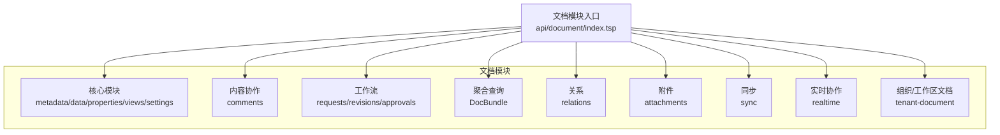
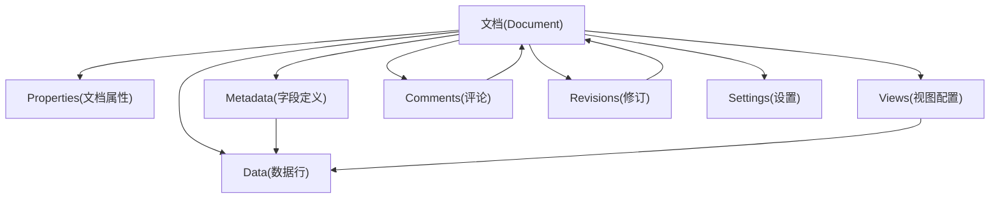
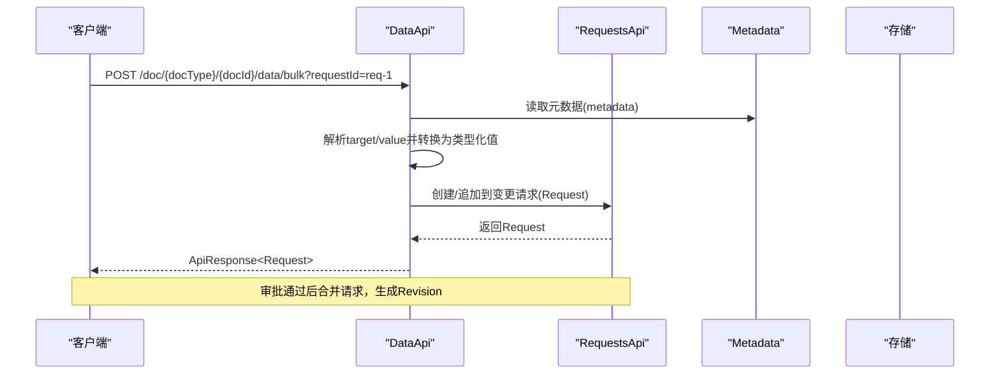
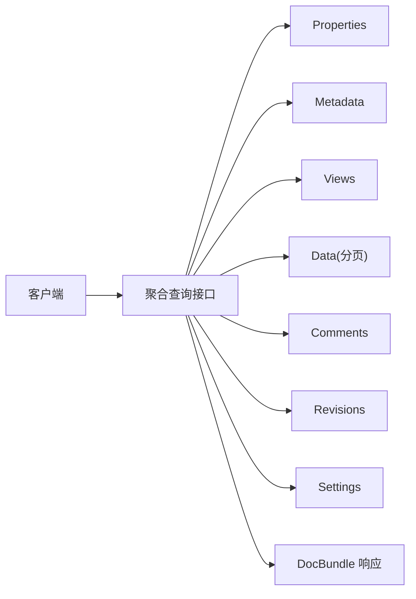
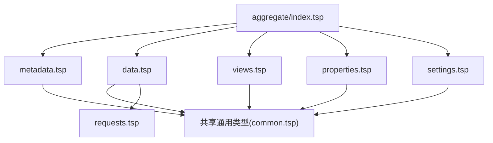

# 文档模型

<cite>
**本文引用的文件**
- [文档模型设计文档](file://docs-src/guides/document-model.md)
- [文档模块入口](file://api/document/index.tsp)
- [核心模块入口](file://api/document/core/index.tsp)
- [元数据模块](file://api/document/core/metadata.tsp)
- [数据模块](file://api/document/core/data.tsp)
- [属性模块](file://api/document/core/properties.tsp)
- [视图模块](file://api/document/core/views.tsp)
- [设置模块](file://api/document/core/settings.tsp)
- [聚合查询模块](file://api/document/aggregate/index.tsp)
- [工作流-请求模块](file://api/document/workflow/requests.tsp)
- [共享通用类型](file://api/shared/common.tsp)
</cite>

## 目录
1. [简介](#简介)
2. [项目结构](#项目结构)
3. [核心组件](#核心组件)
4. [架构总览](#架构总览)
5. [详细组件分析](#详细组件分析)
6. [依赖关系分析](#依赖关系分析)
7. [性能考量](#性能考量)
8. [故障排查指南](#故障排查指南)
9. [结论](#结论)
10. [附录](#附录)

## 简介
本文件面向 nexusbook-api 的“文档模型”能力，系统化阐述文档抽象框架的分层结构与交互关系，重点覆盖五大核心数据层：Properties（文档属性）、Metadata（字段定义）、Data（数据行）、Views（视图配置）、Settings（文档设置）。文档还解释设计原则（清晰分层、一致性约束、不可变记录等）、变更工作流（Request/Revision）、聚合查询（DocBundle）与批量更新（BulkUpdate）机制，并给出各层 API 端点、数据结构定义与使用示例路径，帮助开发者快速理解与落地。

## 项目结构
文档模块采用“分层+子模块”的组织方式：
- 文档模块顶层聚合多个子模块：核心数据模型（core）、内容协作（content）、工作流（workflow）、聚合查询（aggregate）、关系（relations）、附件（attachments）、同步（sync）、实时协作（realtime）、组织/工作区文档（tenant-document）。
- 核心模块进一步拆分为：metadata、data、properties、views、settings。

图表来源
- [文档模块入口](file://api/document/index.tsp#L1-L31)

章节来源
- [文档模块入口](file://api/document/index.tsp#L1-L31)

## 核心组件
- Properties（文档属性）：存储文档级元信息（如订单时间、门店、金额、数量等），支持创建、替换、部分更新、历史查询与删除。
- Metadata（字段定义）：定义数据行字段结构、类型、验证规则、计算字段（公式/查找/汇总）、选项与显示配置。
- Data（数据行）：承载实际数据行集合，支持分页查询、结构化查询、单行/批量更新、删除，以及基于 requestId 的变更工作流。
- Views（视图配置）：定义多种视图类型（表格/看板/日历/统计/自定义）及其配置（列、过滤、排序、分组）。
- Settings（文档设置）：管理文档级权限、分享、保留策略、默认视图等配置。

章节来源
- [属性模块](file://api/document/core/properties.tsp#L1-L441)
- [元数据模块](file://api/document/core/metadata.tsp#L1-L211)
- [数据模块](file://api/document/core/data.tsp#L1-L628)
- [视图模块](file://api/document/core/views.tsp#L1-L171)
- [设置模块](file://api/document/core/settings.tsp#L1-L141)

## 架构总览
下图展示文档模型五大核心层的职责与相互关系，以及与 Comments、Revisions、Settings 的协作关系。

图表来源
- [文档模型设计文档](file://docs-src/guides/document-model.md#L35-L50)
- [元数据模块](file://api/document/core/metadata.tsp#L160-L181)
- [数据模块](file://api/document/core/data.tsp#L375-L628)
- [视图模块](file://api/document/core/views.tsp#L86-L171)
- [属性模块](file://api/document/core/properties.tsp#L200-L441)
- [设置模块](file://api/document/core/settings.tsp#L86-L141)

## 详细组件分析

### Properties（文档属性）
- 职责：存储文档级元信息，支持并发控制、审计追踪与变更工作流。
- 关键点：
  - 属性值采用类型化结构，与数据行 cell 值设计一致。
  - 支持完全替换（Replace）与部分更新（Patch，合并/覆盖模式）。
  - 历史查询用于审计与回溯。
- API 端点与示例路径：
  - 获取属性：GET /doc/{docType}/{docId}/properties
  - 创建属性：POST /doc/{docType}/{docId}/properties
  - 替换属性：PUT /doc/{docType}/{docId}/properties
  - 部分更新属性：PATCH /doc/{docType}/{docId}/properties
  - 查看属性历史：GET /doc/{docType}/{docId}/properties/history
  - 删除属性：DELETE /doc/{docType}/{docId}/properties
- 使用示例路径：
  - 订货单属性创建与部分更新示例见“文档模型设计文档”。

章节来源
- [属性模块](file://api/document/core/properties.tsp#L1-L441)
- [共享通用类型](file://api/shared/common.tsp#L153-L203)
- [文档模型设计文档](file://docs-src/guides/document-model.md#L102-L141)

### Metadata（字段定义）
- 职责：定义数据行字段结构、类型、验证规则、计算字段（公式/查找/汇总）、选项与只读/唯一/必填等。
- 关键点：
  - 字段类型覆盖文本、数值、日期时间、布尔、选择、附件、用户、关联、计算型等。
  - 支持 lookup/rollup/formula 等计算配置。
  - 支持属性字段定义（用于 DocumentProperties）。
- API 端点与示例路径：
  - 获取元数据：GET /doc/{docType}/{docId}/metadata
  - 更新元数据：PUT /doc/{docType}/{docId}/metadata
- 使用示例路径：
  - 字段定义示例与说明见“文档模型设计文档”。

章节来源
- [元数据模块](file://api/document/core/metadata.tsp#L1-L211)
- [共享通用类型](file://api/shared/common.tsp#L297-L331)
- [文档模型设计文档](file://docs-src/guides/document-model.md#L143-L204)

### Data（数据行）
- 职责：承载实际数据行集合，提供 CRUD、批量更新、结构化查询、分页与变更工作流。
- 关键点：
  - 所有写操作（创建/更新/删除/批量更新）均通过变更请求（Request）协同编辑，审批合并后生成修订（Revision）。
  - 批量更新采用统一的 BulkUpdate 结构，支持单行/多行、单字段/多字段、属性与数据混合更新。
  - 支持 requestId 叠加视图，预览变更效果。
- API 端点与示例路径：
  - 列出数据：GET /doc/{docType}/{docId}/data
  - 结构化查询：POST /doc/{docType}/{docId}/data/query
  - 创建行：POST /doc/{docType}/{docId}/data?requestId={reqId}
  - 更新行：PUT /doc/{docType}/{docId}/data/{rowId}?requestId={reqId}
  - 删除行：DELETE /doc/{docType}/{docId}/data/{rowId}?requestId={reqId}
  - 批量更新：POST /doc/{docType}/{docId}/data/bulk?requestId={reqId}
- BulkUpdate 结构与示例路径：
  - BulkUpdate 定义与使用示例见“数据模块”与“文档模型设计文档”。

图表来源
- [数据模块](file://api/document/core/data.tsp#L560-L628)
- [工作流-请求模块](file://api/document/workflow/requests.tsp#L202-L391)
- [元数据模块](file://api/document/core/metadata.tsp#L160-L181)

章节来源
- [数据模块](file://api/document/core/data.tsp#L1-L628)
- [共享通用类型](file://api/shared/common.tsp#L153-L203)
- [文档模型设计文档](file://docs-src/guides/document-model.md#L206-L299)

### Views（视图配置）
- 职责：定义多种视图类型与配置（列、过滤、排序、分组、列展示配置），用于投影 Data。
- 关键点：
  - 支持 grid/gallery/kanban/document 等视图类型。
  - 支持默认视图设置。
- API 端点与示例路径：
  - 列出视图：GET /doc/{docType}/{docId}/views
  - 创建视图：POST /doc/{docType}/{docId}/views
  - 获取视图：GET /doc/{docType}/{docId}/views/{viewId}
  - 更新视图：PUT /doc/{docType}/{docId}/views/{viewId}
  - 删除视图：DELETE /doc/{docType}/{docId}/views/{viewId}
  - 设为默认视图：POST /doc/{docType}/{docId}/views/{viewId}/default

章节来源
- [视图模块](file://api/document/core/views.tsp#L1-L171)
- [共享通用类型](file://api/shared/common.tsp#L205-L295)

### Settings（文档设置）
- 职责：管理文档级权限、分享、保留策略、默认视图等。
- 关键点：
  - 文档级设置与类型级设置分别提供。
  - 支持公共链接开关与密码保护。
- API 端点与示例路径：
  - 获取文档设置：GET /doc/{docType}/{docId}/settings
  - 更新文档设置：PUT /doc/{docType}/{docId}/settings
  - 获取类型设置：GET /doc/{docType}/setting
  - 更新类型设置：PUT /doc/{docType}/setting

章节来源
- [设置模块](file://api/document/core/settings.tsp#L1-L141)
- [共享通用类型](file://api/shared/common.tsp#L153-L203)

### Comments（评论）与 Revisions（修订）
- Comments：支持在文档/字段/行/单元格级别评论，支持回复链、表情反应与解决状态。
- Revisions：记录变更历史（变更操作序列），支持修订对比、回滚与审计。
- API 端点与示例路径：
  - 评论：GET/POST/PUT/DELETE /doc/{docType}/{docId}/comments 与相关子操作
  - 修订：GET /doc/{docType}/{docId}/revisions 与 /revisions/{revId}/diff、/revisions/{revId}/revert 等

章节来源
- [文档模型设计文档](file://docs-src/guides/document-model.md#L354-L552)

### DocBundle（聚合查询）
- 概念：一次性获取文档的多个层次的数据，避免多次请求。
- 使用场景：页面初始化、文档预览、数据导出。
- API 端点与示例路径：
  - GET /doc/{docType}/{docId}?include=properties,metadata,views,data,comments,revisions,settings&page=1&pageSize=20
  - 支持按需 include、分页与限制数量（commentsLimit/revisionsLimit）。

图表来源
- [聚合查询模块](file://api/document/aggregate/index.tsp#L92-L127)
- [共享通用类型](file://api/shared/common.tsp#L153-L203)

章节来源
- [聚合查询模块](file://api/document/aggregate/index.tsp#L1-L127)
- [文档模型设计文档](file://docs-src/guides/document-model.md#L694-L770)

## 依赖关系分析
- 模块耦合与内聚：
  - 核心模块内部高内聚：metadata、data、properties、views、settings 各司其职，边界清晰。
  - 聚合模块对核心模块进行组合，提供一次性渲染能力。
  - 工作流模块贯穿数据与属性的变更路径，确保所有写入通过 Request/Revision。
- 外部依赖：
  - 共享通用类型（ApiResponse、Page、Filter/Sort/Group、ValueEntry 等）被各模块广泛使用，统一了响应格式与查询模型。

图表来源
- [共享通用类型](file://api/shared/common.tsp#L1-L576)
- [元数据模块](file://api/document/core/metadata.tsp#L1-L211)
- [数据模块](file://api/document/core/data.tsp#L1-L628)
- [属性模块](file://api/document/core/properties.tsp#L1-L441)
- [视图模块](file://api/document/core/views.tsp#L1-L171)
- [设置模块](file://api/document/core/settings.tsp#L1-L141)
- [聚合查询模块](file://api/document/aggregate/index.tsp#L1-L127)
- [工作流-请求模块](file://api/document/workflow/requests.tsp#L1-L391)

章节来源
- [共享通用类型](file://api/shared/common.tsp#L1-L576)
- [文档模块入口](file://api/document/index.tsp#L1-L31)

## 性能考量
- 分页与深分页：Data 查询支持 page/pageSize 与 cursor，建议在大数据量场景使用 cursor 实现深分页。
- 结构化查询：复杂过滤/排序/分组/聚合建议使用结构化查询接口，减少客户端拼装成本。
- 聚合查询：DocBundle 通过 include 参数按需加载，避免多次往返。
- 批量更新：BulkUpdate 统一格式，服务端按 metadata 自动解析类型，减少客户端负担。
- 缓存与叠加视图：Data 支持 requestId 叠加视图，预览变更效果，减少重复请求。

## 故障排查指南
- 常见错误码（来自共享通用类型）：
  - 文档相关：DOC_NOT_FOUND、DOC_TYPE_UNKNOWN、DOC_ACCESS_DENIED
  - 数据相关：ROW_NOT_FOUND、FIELD_TYPE_MISMATCH、CONSTRAINT_VIOLATION、PAGE_OUT_OF_RANGE
  - 评论相关：COMMENT_NOT_FOUND
  - 审批相关：APPROVAL_NOT_FOUND、APPROVAL_INVALID_STATE、APPROVAL_DECISION_REQUIRED
  - 请求相关：REQUEST_NOT_FOUND、REQUEST_CONFLICT、REQUEST_ALREADY_CLOSED
  - 用户/组织/工作区相关：USER_NOT_FOUND、ORG_NOT_FOUND、WORKSPACE_NOT_FOUND 等
- 定位方法：
  - 使用 ApiResponse.code/message 快速判断错误类型。
  - 对数据行/属性的并发更新，检查 version 参数与合并冲突。
  - 对批量更新，核对 target/value 与 metadata 类型定义是否匹配。

章节来源
- [共享通用类型](file://api/shared/common.tsp#L80-L151)

## 结论
文档模型通过清晰的五层分层（Properties/Metadata/Data/Views/Settings）与严格的约束（Metadata 定义字段，Data 遵守约束；不可变记录 Revisions；审批先行 Request/Revision），实现了结构化文档的可扩展、可审计与可协作。配合 DocBundle 聚合查询与 BulkUpdate 批量更新机制，开发者可以在保证一致性的同时，获得良好的开发体验与运行效率。

## 附录
- 设计原则与一致性规范：
  - 清晰分层：Properties/Metadata/Data/Views/Comments/Revisions/Settings。
  - 一致性原则：Metadata 定义字段，Data 必须遵守；Properties 与 Data 分离。
  - 不可变记录：Revision 为只读历史，通过 Revert 创建新的变更而非修改历史。
  - 审批先行：所有写入通过 Request，审批通过后生成 Revision 并落库。
  - 可审计性：每次写入都有 Request → Revision 链路，附带 contributors、timestamp。
  - 可扩展性：Attachment 与 Relation 为一等公民，可在 Properties 或 Data 中使用。

章节来源
- [文档模型设计文档](file://docs-src/guides/document-model.md#L52-L66)