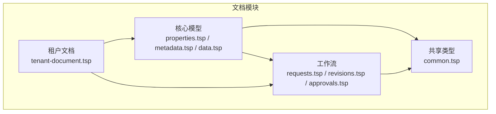
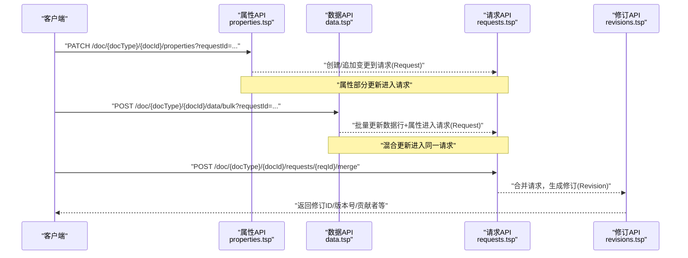
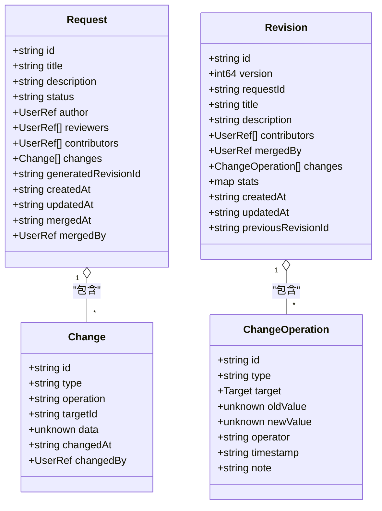
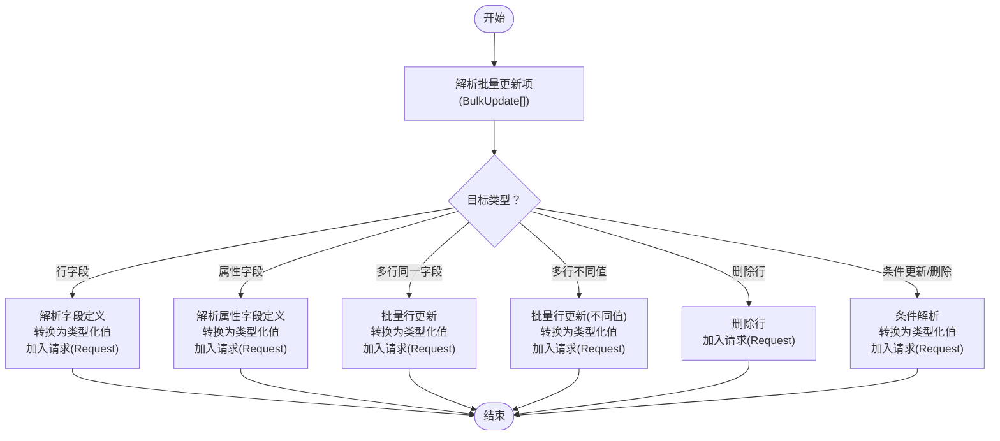
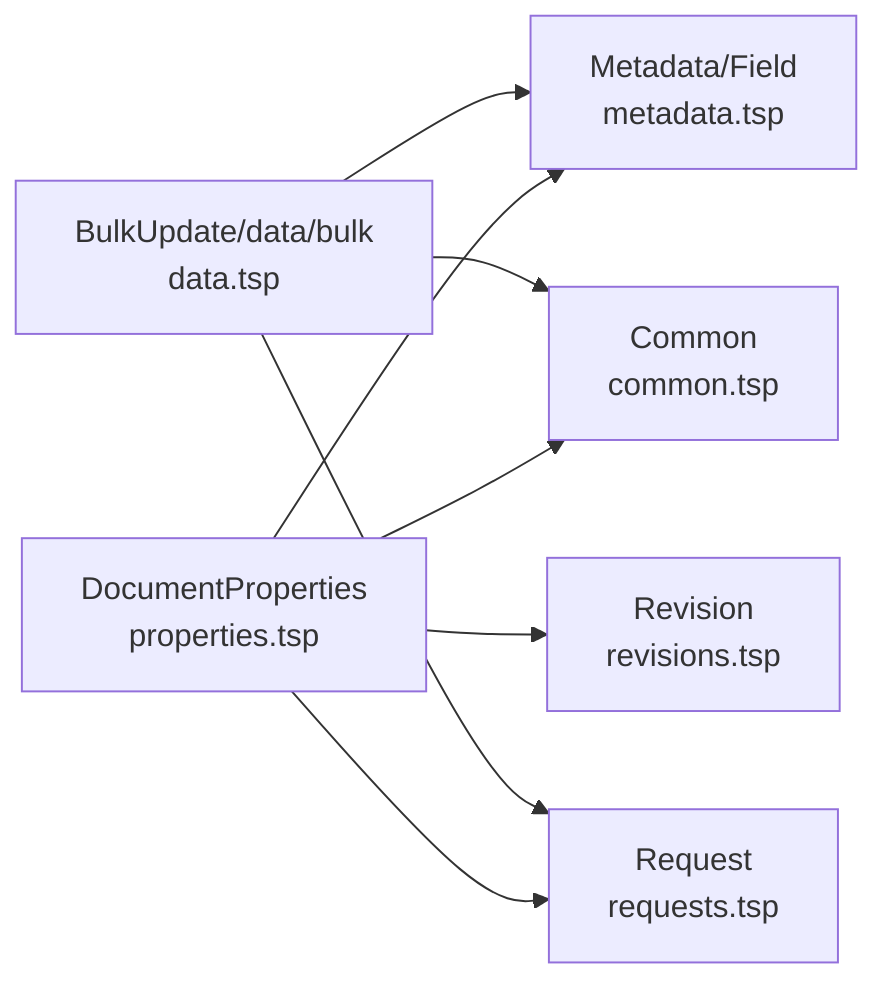

# 文档属性

<cite>
**本文引用的文件**
- [api/document/core/properties.tsp](file://api/document/core/properties.tsp)
- [api/document/core/metadata.tsp](file://api/document/core/metadata.tsp)
- [api/document/core/data.tsp](file://api/document/core/data.tsp)
- [api/document/workflow/requests.tsp](file://api/document/workflow/requests.tsp)
- [api/document/workflow/revisions.tsp](file://api/document/workflow/revisions.tsp)
- [api/document/workflow/approvals.tsp](file://api/document/workflow/approvals.tsp)
- [api/shared/common.tsp](file://api/shared/common.tsp)
- [api/document/tenant-document.tsp](file://api/document/tenant-document.tsp)
</cite>

## 目录
1. [简介](#简介)
2. [项目结构](#项目结构)
3. [核心组件](#核心组件)
4. [架构概览](#架构概览)
5. [详细组件分析](#详细组件分析)
6. [依赖分析](#依赖分析)
7. [性能考虑](#性能考虑)
8. [故障排查指南](#故障排查指南)
9. [结论](#结论)
10. [附录](#附录)

## 简介
本章节聚焦“文档属性（DocumentProperties）”在 nexusbook-api 中的角色与能力，阐明其作为文档级元信息存储的核心定位，并系统讲解：
- 文档属性的字段结构与数据类型
- 变更工作流（请求/审批/修订）如何保障属性修改的协作与一致性
- 批量更新接口如何在混合更新数据行与文档属性时保持原子性与一致性
- 并发控制（版本号）、审计追踪（创建/更新/更新人）与典型业务场景（订货单、发票等）的属性定义与操作

## 项目结构
文档属性属于“文档模块”的核心子模块之一，与元数据、数据行、工作流（请求/修订/审批）以及共享类型紧密协作，形成统一的文档级数据模型与变更治理框架。

图表来源
- [api/document/core/properties.tsp](file://api/document/core/properties.tsp#L1-L60)
- [api/document/core/metadata.tsp](file://api/document/core/metadata.tsp#L1-L60)
- [api/document/core/data.tsp](file://api/document/core/data.tsp#L1-L60)
- [api/document/workflow/requests.tsp](file://api/document/workflow/requests.tsp#L1-L60)
- [api/document/workflow/revisions.tsp](file://api/document/workflow/revisions.tsp#L1-L60)
- [api/document/workflow/approvals.tsp](file://api/document/workflow/approvals.tsp#L1-L60)
- [api/shared/common.tsp](file://api/shared/common.tsp#L1-L60)
- [api/document/tenant-document.tsp](file://api/document/tenant-document.tsp#L1-L60)

章节来源
- [api/document/index.tsp](file://api/document/index.tsp#L1-L31)

## 核心组件
- 文档属性模型（DocumentProperties）
  - 用于存储文档本身的元信息，如订货单的时间、门店、金额、数量等
  - 支持灵活键值对存储，适配不同文档类型
  - 字段包括：id、docId、docType、organizationId、workspaceId、properties、version、createdAt、updatedAt、updatedBy
- 元数据模型（Metadata）
  - 定义文档级属性字段定义（properties 字段集合）
  - 与 DocumentProperties.properties 的值结构保持一致
- 变更工作流（Request/Revision/Approval）
  - 所有属性修改均进入变更请求（Request），经评审与合并后生成修订（Revision）
  - 支持审批流程（Approval）与冲突检测
- 批量更新接口（POST /doc/{docType}/{docId}/data/bulk）
  - 支持混合更新：同时修改数据行字段与文档属性
  - 通过 requestId 将变更纳入同一请求，最终合并生效

章节来源
- [api/document/core/properties.tsp](file://api/document/core/properties.tsp#L94-L198)
- [api/document/core/metadata.tsp](file://api/document/core/metadata.tsp#L160-L181)
- [api/document/core/data.tsp](file://api/document/core/data.tsp#L575-L666)
- [api/document/workflow/requests.tsp](file://api/document/workflow/requests.tsp#L83-L200)
- [api/document/workflow/revisions.tsp](file://api/document/workflow/revisions.tsp#L158-L314)
- [api/document/workflow/approvals.tsp](file://api/document/workflow/approvals.tsp#L38-L95)

## 架构概览
文档属性的变更治理遵循“先请求、后合并、再修订”的闭环流程，确保数据一致性与可追溯性。

图表来源
- [api/document/core/properties.tsp](file://api/document/core/properties.tsp#L282-L376)
- [api/document/core/data.tsp](file://api/document/core/data.tsp#L575-L666)
- [api/document/workflow/requests.tsp](file://api/document/workflow/requests.tsp#L285-L390)
- [api/document/workflow/revisions.tsp](file://api/document/workflow/revisions.tsp#L323-L394)

## 详细组件分析

### 文档属性模型（DocumentProperties）
- 字段结构与含义
  - id：属性记录唯一标识
  - docId：所属文档ID
  - docType：文档类型（如 purchaseOrder、invoice、product 等）
  - organizationId/workspaceId：可选，用于多租户隔离与工作区级文档
  - properties：属性值集合，采用类型化值结构（ValueEntry），与数据行 cell 值设计一致
  - version：版本号，用于并发控制（乐观锁）
  - createdAt/updatedAt/updatedBy：审计追踪（创建/更新时间与更新人）

- 值结构（ValueEntry 与 Value）
  - ValueEntry：fieldId + value
  - Value：统一的类型化值联合体，覆盖文本、数值、日期时间、布尔、单/多选、附件、用户、协作人、关联、评分、时长等类型
  - 与元数据（Field.type）配合，服务端可自动解析原始值为类型化值

- 典型业务场景
  - 订货单：订单时间、门店、总金额、总数量、状态等
  - 发票：发票号、开票时间、付款期限、税率、金额等
  - 产品：SKU、品牌、分类、供应商、封面图等
  - 项目：项目名称、负责人、预算、截止日期等

章节来源
- [api/document/core/properties.tsp](file://api/document/core/properties.tsp#L94-L198)
- [api/shared/common.tsp](file://api/shared/common.tsp#L710-L742)

### 元数据与字段定义（Metadata/Field）
- Metadata.properties：定义文档级属性的字段集合（Field[]）
- Field：定义字段类型、必填/唯一/只读、默认值、选项、公式/查找/汇总、校验规则等
- DocumentProperties.properties 的值必须与 Field 定义匹配，确保类型一致性与校验

章节来源
- [api/document/core/metadata.tsp](file://api/document/core/metadata.tsp#L160-L181)
- [api/document/core/metadata.tsp](file://api/document/core/metadata.tsp#L65-L110)

### 变更工作流（Request/Revision/Approval）
- Request
  - 记录待合并的变更（Change），支持多类型（数据行、属性、视图、元数据等）
  - 状态：open/merged/closed；支持评审人、贡献者、合并者等审计信息
- Revision
  - 合并请求后生成修订记录，包含变更操作集合、统计、贡献者、合并者等
  - 支持修订历史查询、差异对比、按目标查询变更历史、回滚等
- Approval
  - 支持审批流程定义、实例、决策（通过/拒绝）与历史记录

图表来源
- [api/document/workflow/requests.tsp](file://api/document/workflow/requests.tsp#L39-L200)
- [api/document/workflow/revisions.tsp](file://api/document/workflow/revisions.tsp#L44-L150)
- [api/document/workflow/revisions.tsp](file://api/document/workflow/revisions.tsp#L158-L314)

章节来源
- [api/document/workflow/requests.tsp](file://api/document/workflow/requests.tsp#L202-L390)
- [api/document/workflow/revisions.tsp](file://api/document/workflow/revisions.tsp#L316-L546)
- [api/document/workflow/approvals.tsp](file://api/document/workflow/approvals.tsp#L38-L156)

### 批量更新接口与混合更新模式（POST /doc/{docType}/{docId}/data/bulk）
- 设计目标
  - 统一的批量更新入口，支持：
    - 修改单个/多个字段
    - 修改单行/多行
    - 修改单个/多个属性
    - 值始终为原始格式，服务端根据元数据自动解析类型
- 混合更新
  - 同一批次中同时包含数据行更新与属性更新
  - 通过 requestId 将所有变更纳入同一请求，合并后统一生效
- BulkUpdate 结构
  - target：灵活的目标结构，支持 row、rows、field、property、properties、delete、condition 等
  - value：原始值（单值/对象/数组），服务端自动转换为类型化值

图表来源
- [api/document/core/data.tsp](file://api/document/core/data.tsp#L189-L239)
- [api/document/core/data.tsp](file://api/document/core/data.tsp#L575-L666)

章节来源
- [api/document/core/data.tsp](file://api/document/core/data.tsp#L575-L666)

### 并发控制与审计追踪
- 并发控制（版本号）
  - 属性与数据行更新均支持 version 参数，服务端使用乐观锁避免并发冲突
- 审计追踪
  - DocumentProperties：createdAt/updatedAt/updatedBy
  - Row：createdAt/createdBy、updatedAt/updatedBy、version
  - Request：author、contributors、mergedBy、mergedAt
  - Revision：contributors、mergedBy、stats、previousRevisionId

章节来源
- [api/document/core/properties.tsp](file://api/document/core/properties.tsp#L161-L198)
- [api/document/core/data.tsp](file://api/document/core/data.tsp#L248-L311)
- [api/document/workflow/requests.tsp](file://api/document/workflow/requests.tsp#L118-L200)
- [api/document/workflow/revisions.tsp](file://api/document/workflow/revisions.tsp#L214-L314)

### 实际使用示例（订货单、发票等）
- 订货单
  - 属性建议：orderTime（datetime）、store（text）、amount（currency）、quantity（number）、status（single_select）
  - 可通过属性 API 或批量更新接口进行部分更新或完全替换
- 发票
  - 属性建议：invoiceNo（text）、issueDate（date）、dueDate（date）、taxRate（percent）、amount（currency）
  - 可与数据行（明细行）混合更新，统一走 requestId 合并
- 产品/项目等
  - 属性建议：SKU/text、品牌/text、分类/text、供应商/relation、预算/currency、截止日期/date 等

章节来源
- [api/document/core/properties.tsp](file://api/document/core/properties.tsp#L74-L93)
- [api/document/core/metadata.tsp](file://api/document/core/metadata.tsp#L29-L52)
- [api/shared/common.tsp](file://api/shared/common.tsp#L710-L742)

## 依赖分析
- DocumentProperties 依赖
  - 共享类型：ValueEntry、Value、UserRef、ApiResponse、Page 等
  - 元数据：Field/FieldType/SelectOption 等，用于属性值类型解析与校验
  - 工作流：Request/Revision/Approval，用于变更治理与审计
- 批量更新依赖
  - 元数据：用于根据 docId 获取 Field 定义，解析原始值为类型化值
  - 工作流：批量更新统一进入 Request，合并后生成 Revision

图表来源
- [api/document/core/properties.tsp](file://api/document/core/properties.tsp#L161-L198)
- [api/document/core/metadata.tsp](file://api/document/core/metadata.tsp#L160-L181)
- [api/document/core/data.tsp](file://api/document/core/data.tsp#L189-L239)
- [api/shared/common.tsp](file://api/shared/common.tsp#L710-L742)

章节来源
- [api/document/core/properties.tsp](file://api/document/core/properties.tsp#L1-L60)
- [api/document/core/metadata.tsp](file://api/document/core/metadata.tsp#L1-L60)
- [api/document/core/data.tsp](file://api/document/core/data.tsp#L1-L60)
- [api/shared/common.tsp](file://api/shared/common.tsp#L1-L60)

## 性能考虑
- 批量更新
  - 合理使用 requestId 将多个变更合并，减少多次请求往返
  - value 保持原始格式，服务端批量解析类型，避免客户端重复转换
- 查询与叠加视图
  - 通过 requestId 查询参数获取“生产数据 + Request 变更”的叠加视图，避免客户端自行合并
- 并发控制
  - 使用 version 参数进行乐观锁，降低冲突概率；冲突时重试或提示用户

## 故障排查指南
- 常见错误与定位
  - 字段类型不匹配：检查 Field.type 与传入值是否一致
  - 版本冲突：更新时提供最新 version，若失败则重新拉取最新版本
  - 请求状态异常：确认 Request 状态（open/merged/closed），合并后不可再修改
  - 审批未通过：检查 Approval 实例状态与决策历史
- 审计与回溯
  - 通过修订历史（/revisions）查看变更详情、对比差异、按目标查询历史
  - 通过请求详情（/requests/{reqId}）查看贡献者与变更集合

章节来源
- [api/shared/common.tsp](file://api/shared/common.tsp#L80-L152)
- [api/document/workflow/revisions.tsp](file://api/document/workflow/revisions.tsp#L323-L546)
- [api/document/workflow/requests.tsp](file://api/document/workflow/requests.tsp#L202-L390)
- [api/document/workflow/approvals.tsp](file://api/document/workflow/approvals.tsp#L96-L156)

## 结论
文档属性（DocumentProperties）通过灵活的键值对存储与强一致的变更工作流，实现了跨业务场景的文档级元信息管理。结合元数据驱动的类型解析、批量更新的混合模式、版本号并发控制与完善的审计追踪，系统在保证数据一致性的同时，提供了强大的协作与治理能力。推荐在新增业务场景时，优先通过元数据定义属性字段，再通过属性 API 或批量更新接口进行操作，并统一纳入请求与修订体系，确保可追溯与可回滚。

## 附录
- 多租户与作用域
  - 支持组织级与工作区级文档，属性可绑定 organizationId/workspaceId
- 常用接口路径参考
  - 属性：GET/POST/PATCH/PUT/DELETE /doc/{docType}/{docId}/properties
  - 批量更新：POST /doc/{docType}/{docId}/data/bulk
  - 请求：GET/POST/PUT/DELETE /doc/{docType}/{docId}/requests
  - 修订：GET /doc/{docType}/{docId}/revisions
  - 审批：GET/POST /doc/{docType}/{docId}/approval

章节来源
- [api/document/tenant-document.tsp](file://api/document/tenant-document.tsp#L1-L120)
- [api/document/core/properties.tsp](file://api/document/core/properties.tsp#L200-L441)
- [api/document/core/data.tsp](file://api/document/core/data.tsp#L575-L726)
- [api/document/workflow/requests.tsp](file://api/document/workflow/requests.tsp#L202-L390)
- [api/document/workflow/revisions.tsp](file://api/document/workflow/revisions.tsp#L323-L546)
- [api/document/workflow/approvals.tsp](file://api/document/workflow/approvals.tsp#L96-L156)