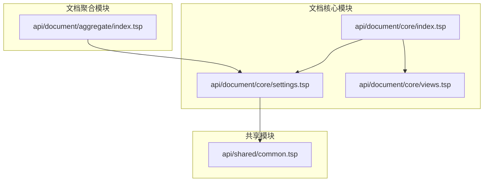
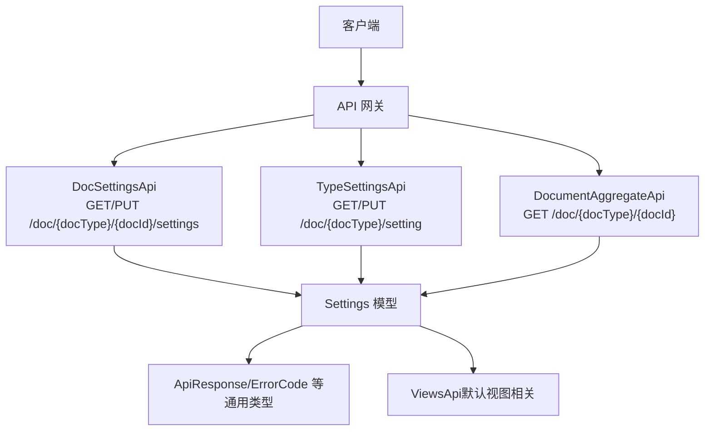
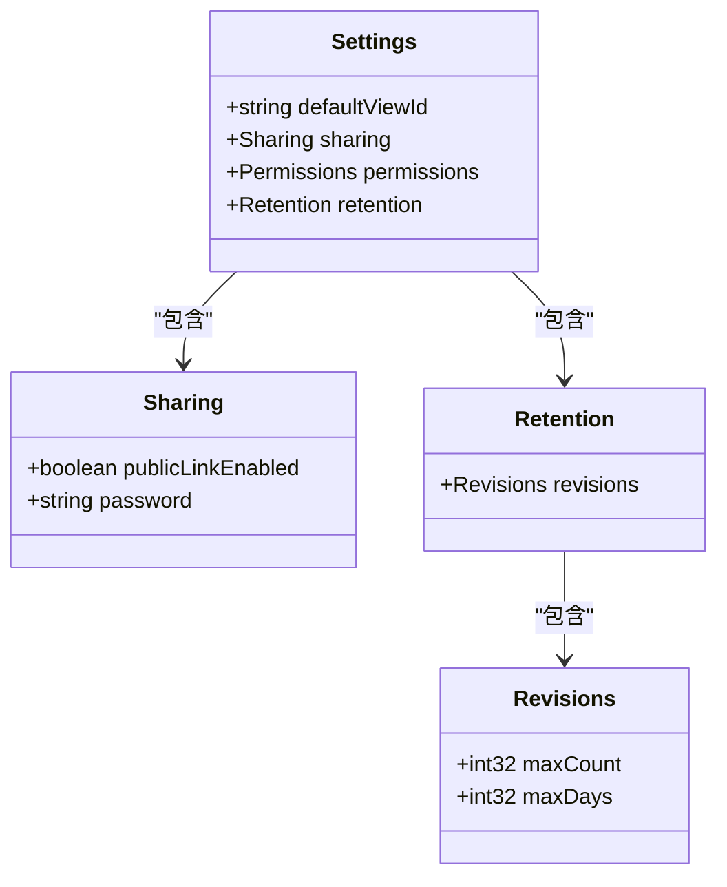
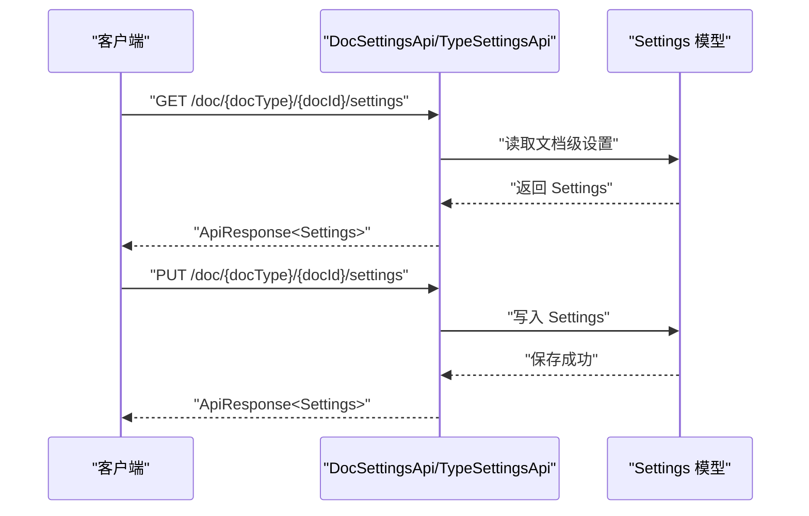
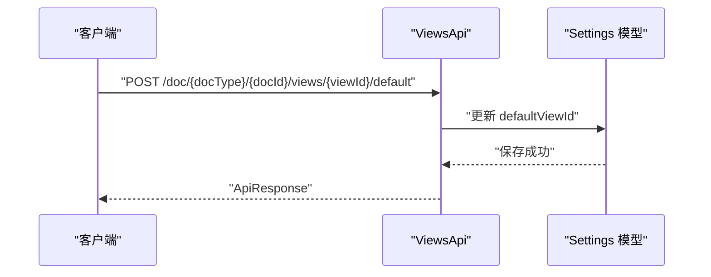
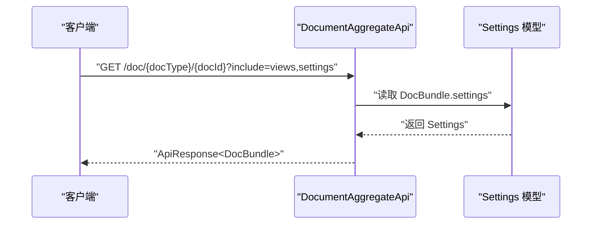
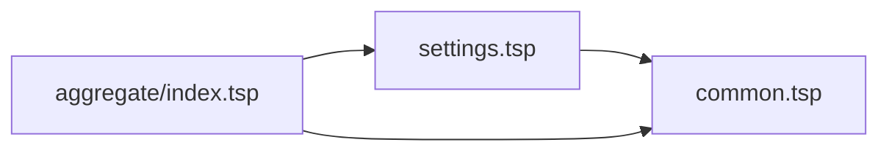

# 文档设置

<cite>
**本文引用的文件**
- [settings.tsp](file://api/document/core/settings.tsp)
- [index.tsp](file://api/document/core/index.tsp)
- [common.tsp](file://api/shared/common.tsp)
- [views.tsp](file://api/document/core/views.tsp)
- [index.tsp](file://api/document/aggregate/index.tsp)
- [STORY.md](file://STORY.md)
</cite>

## 目录
1. [简介](#简介)
2. [项目结构](#项目结构)
3. [核心组件](#核心组件)
4. [架构概览](#架构概览)
5. [详细组件分析](#详细组件分析)
6. [依赖分析](#依赖分析)
7. [性能考虑](#性能考虑)
8. [故障排查指南](#故障排查指南)
9. [结论](#结论)
10. [附录](#附录)

## 简介
本章节面向“文档设置（Settings）”主题，系统阐述其在配置管理层中的作用与定位。Settings 模型负责管理两类配置：
- 文档级设置：影响单个文档的行为与展示
- 类型级设置：为某一文档类型提供默认配置

同时，Settings 还涵盖分享配置（公开链接与密码）、权限策略占位、以及保留策略（修订记录的最大条数与天数）等能力。本文将结合接口定义与数据模型，说明两类设置接口（DocSettingsApi、TypeSettingsApi）的调用方式，并给出典型应用场景与最佳实践。

## 项目结构
Settings 的核心定义位于文档核心模块，同时被聚合查询模块引用，以便在一次请求中返回文档的完整上下文（包含设置）。

图表来源
- [index.tsp](file://api/document/core/index.tsp#L1-L21)
- [settings.tsp](file://api/document/core/settings.tsp#L1-L141)
- [views.tsp](file://api/document/core/views.tsp#L1-L171)
- [common.tsp](file://api/shared/common.tsp#L1-L742)
- [index.tsp](file://api/document/aggregate/index.tsp#L1-L127)

章节来源
- [index.tsp](file://api/document/core/index.tsp#L1-L21)
- [index.tsp](file://api/document/aggregate/index.tsp#L1-L127)

## 核心组件
- Settings 模型
  - defaultViewId：默认视图标识，用于指定文档的默认展示视图
  - sharing：分享配置，包含 publicLinkEnabled（公开链接开关）与 password（分享密码）
  - permissions：权限策略占位，用于后续扩展基于角色的权限控制
  - retention：保留策略，包含 revisions（修订记录）子配置，支持 maxCount（最大修订条数）与 maxDays（最大保留天数）

- DocSettingsApi
  - GET /doc/{docType}/{docId}/settings：获取文档级设置
  - PUT /doc/{docType}/{docId}/settings：更新文档级设置

- TypeSettingsApi
  - GET /doc/{docType}/setting：获取类型级设置
  - PUT /doc/{docType}/setting：更新类型级设置

- DocBundle（聚合查询）
  - DocBundle.settings：在聚合查询中可包含文档设置，便于一次性渲染视图

章节来源
- [settings.tsp](file://api/document/core/settings.tsp#L33-L140)
- [index.tsp](file://api/document/aggregate/index.tsp#L48-L90)

## 架构概览
下图展示了 Settings 在系统中的位置与交互关系，以及与视图、聚合查询的关系。

图表来源
- [settings.tsp](file://api/document/core/settings.tsp#L86-L140)
- [index.tsp](file://api/document/aggregate/index.tsp#L92-L127)
- [common.tsp](file://api/shared/common.tsp#L153-L203)
- [views.tsp](file://api/document/core/views.tsp#L157-L171)

## 详细组件分析

### Settings 模型与层级结构
- 层级关系
  - 文档级设置：仅影响单个文档，路径为 /doc/{docType}/{docId}/settings
  - 类型级设置：影响该类型的所有文档，路径为 /doc/{docType}/setting
- 字段说明
  - defaultViewId：用于指定默认视图；可通过 ViewsApi 的“设为默认视图”接口完成设置
  - sharing.publicLinkEnabled：是否启用公开链接分享
  - sharing.password：分享访问密码（若启用）
  - permissions：权限策略占位，用于后续扩展
  - retention.revisions.maxCount/maxDays：修订记录保留上限（条数与天数）

图表来源
- [settings.tsp](file://api/document/core/settings.tsp#L33-L84)

章节来源
- [settings.tsp](file://api/document/core/settings.tsp#L33-L84)

### DocSettingsApi 与 TypeSettingsApi
- DocSettingsApi
  - 获取文档级设置：GET /doc/{docType}/{docId}/settings
  - 更新文档级设置：PUT /doc/{docType}/{docId}/settings
- TypeSettingsApi
  - 获取类型级设置：GET /doc/{docType}/setting
  - 更新类型级设置：PUT /doc/{docType}/setting

图表来源
- [settings.tsp](file://api/document/core/settings.tsp#L86-L140)

章节来源
- [settings.tsp](file://api/document/core/settings.tsp#L86-L140)

### 与视图系统的集成
- 默认视图
  - Settings.defaultViewId 指向某视图 ID
  - 可通过 ViewsApi 的“设为默认视图”接口设置某视图为默认视图
- 视图模型与查询
  - ViewsApi 提供视图的增删改查与默认视图设置
  - 聚合查询支持 include=views 与 include=settings，便于一次性获取视图与设置

图表来源
- [views.tsp](file://api/document/core/views.tsp#L157-L171)
- [settings.tsp](file://api/document/core/settings.tsp#L33-L40)

章节来源
- [views.tsp](file://api/document/core/views.tsp#L157-L171)
- [settings.tsp](file://api/document/core/settings.tsp#L33-L40)

### 聚合查询中的设置
- DocBundle.settings：在聚合查询中可包含文档设置，便于一次性渲染视图
- include 参数支持 settings，配合 include=views 实现“视图+设置”的一次性拉取

图表来源
- [index.tsp](file://api/document/aggregate/index.tsp#L92-L127)
- [index.tsp](file://api/document/aggregate/index.tsp#L48-L90)

章节来源
- [index.tsp](file://api/document/aggregate/index.tsp#L48-L90)
- [index.tsp](file://api/document/aggregate/index.tsp#L92-L127)

## 依赖分析
- Settings 依赖共享模块的通用响应结构与错误码
- DocSettingsApi/TypeSettingsApi 通过 ApiResponse 返回标准化响应
- 聚合查询模块引用 Settings，形成“一次性获取文档上下文”的能力闭环

图表来源
- [settings.tsp](file://api/document/core/settings.tsp#L1-L141)
- [common.tsp](file://api/shared/common.tsp#L153-L203)
- [index.tsp](file://api/document/aggregate/index.tsp#L1-L127)

章节来源
- [settings.tsp](file://api/document/core/settings.tsp#L1-L141)
- [common.tsp](file://api/shared/common.tsp#L153-L203)
- [index.tsp](file://api/document/aggregate/index.tsp#L1-L127)

## 性能考虑
- 聚合查询 include=views,settings 可减少多次往返，提升首屏渲染效率
- 通过分页与限制数量（commentsLimit/revisionsLimit）控制返回体量
- 保留策略（maxCount/maxDays）有助于控制修订数据规模，避免无限增长

## 故障排查指南
- 通用响应结构
  - ApiResponse.success：布尔值，指示请求是否成功
  - ApiResponse.code：错误码（当失败时）
  - ApiResponse.message：多语言消息
  - ApiResponse.payload：载荷（成功时）
- 常见错误码（与文档相关）
  - DOC_NOT_FOUND：文档不存在
  - DOC_TYPE_UNKNOWN：文档类型未知
  - DOC_ACCESS_DENIED：文档访问被拒绝
- 建议排查步骤
  - 确认路径参数 docType 与 docId 正确
  - 确认请求头 Authorization 有效
  - 若失败，检查 ApiResponse.code 与 ApiResponse.message 获取具体原因

章节来源
- [common.tsp](file://api/shared/common.tsp#L80-L177)

## 结论
Settings 作为文档配置管理层的关键组件，提供了文档级与类型级的配置能力，并与视图系统、聚合查询紧密集成。通过 DocSettingsApi 与 TypeSettingsApi，开发者可以灵活地为单个文档或某一类型设置默认视图、分享策略、权限占位与保留策略。结合聚合查询，可在一次请求中返回完整的文档上下文，显著提升前端渲染效率与用户体验。

## 附录

### 实际应用场景示例
- 配置分享链接
  - 启用公开链接：将 sharing.publicLinkEnabled 设为开启
  - 设置访问密码：设置 sharing.password
  - 适用：对外发布只读文档或临时共享
- 设置默认视图
  - 通过 ViewsApi 将某视图设为默认视图
  - 或在 Settings.defaultViewId 中直接指向目标视图 ID
  - 适用：统一团队的默认展示方式
- 定义保留策略
  - 设置 retention.revisions.maxCount 与 maxDays
  - 适用：控制修订记录规模，平衡存储与审计需求

章节来源
- [settings.tsp](file://api/document/core/settings.tsp#L33-L84)
- [views.tsp](file://api/document/core/views.tsp#L157-L171)
- [index.tsp](file://api/document/aggregate/index.tsp#L92-L127)
- [STORY.md](file://STORY.md#L92-L102)