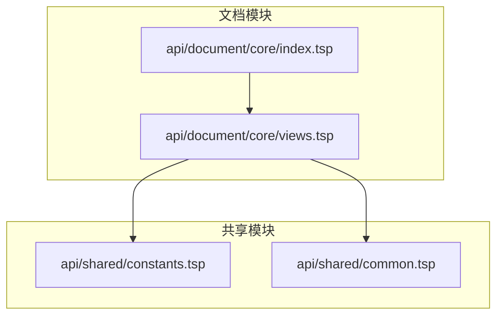
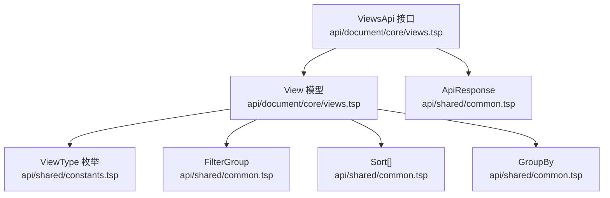
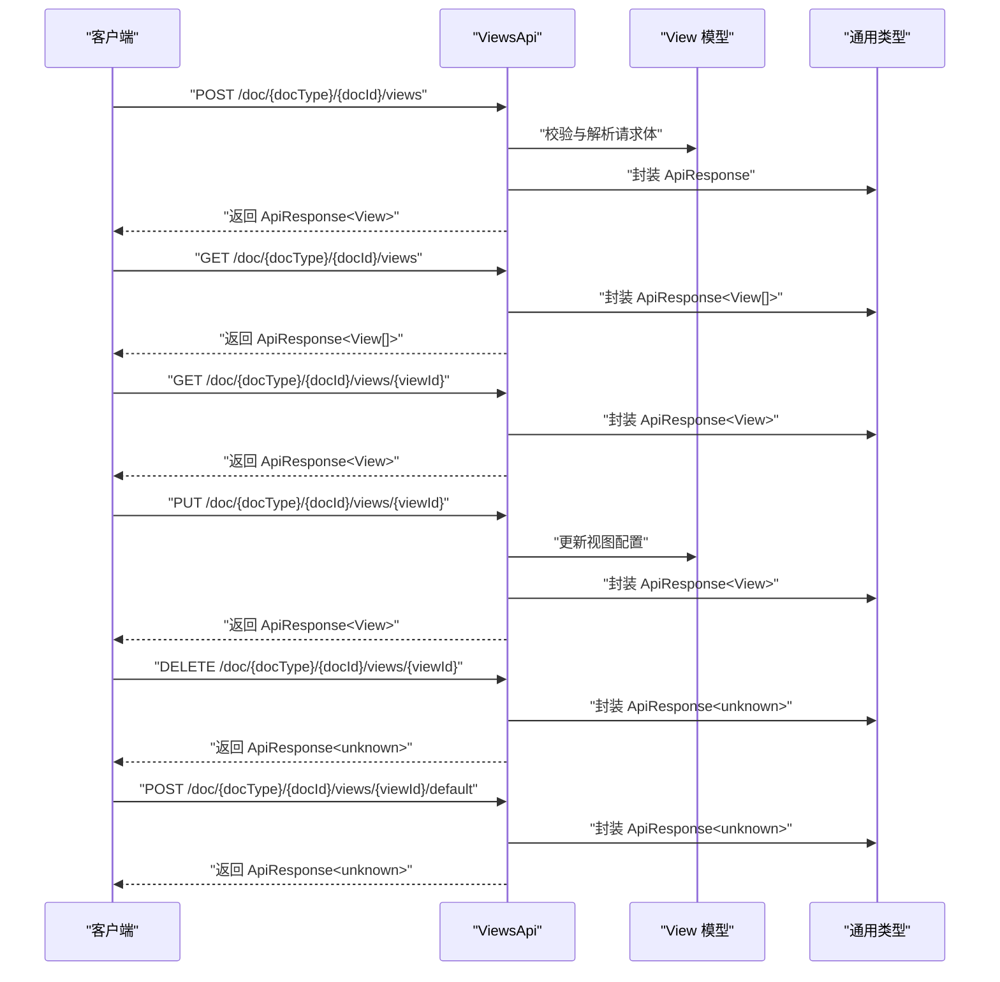
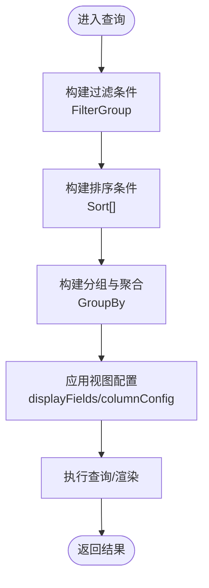
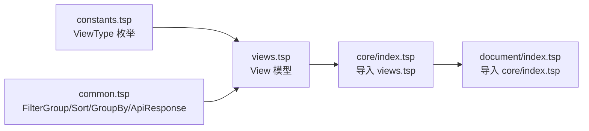

# 视图配置

<cite>
**本文引用的文件**
- [api/document/core/views.tsp](file://api/document/core/views.tsp)
- [api/shared/constants.tsp](file://api/shared/constants.tsp)
- [api/shared/common.tsp](file://api/shared/common.tsp)
- [api/document/core/index.tsp](file://api/document/core/index.tsp)
- [api/document/index.tsp](file://api/document/index.tsp)
</cite>

## 目录
1. [简介](#简介)
2. [项目结构](#项目结构)
3. [核心组件](#核心组件)
4. [架构概览](#架构概览)
5. [详细组件分析](#详细组件分析)
6. [依赖分析](#依赖分析)
7. [性能考虑](#性能考虑)
8. [故障排查指南](#故障排查指南)
9. [结论](#结论)
10. [附录](#附录)

## 简介
本章节面向“视图配置（Views）”能力，系统性阐述其作为数据展示层的核心作用与扩展能力。视图配置允许用户针对同一份文档数据，以多种可视化形态进行呈现，覆盖表格、相册、看板、文档等多种使用场景，并通过统一的配置模型支持字段显示、过滤、排序、分组聚合以及列展示细节（列宽、顺序、固定、隐藏）。同时，ViewsApi 提供了对视图的全生命周期管理：列出视图、创建视图、获取视图详情、更新视图、删除视图以及将指定视图设为默认视图。

## 项目结构
视图配置位于文档核心模块中，由共享常量与通用类型共同支撑。下图展示了与视图相关的关键文件及其关系。

图表来源
- [api/document/core/index.tsp](file://api/document/core/index.tsp#L1-L21)
- [api/document/core/views.tsp](file://api/document/core/views.tsp#L1-L171)
- [api/shared/constants.tsp](file://api/shared/constants.tsp#L90-L139)
- [api/shared/common.tsp](file://api/shared/common.tsp#L1-L200)

章节来源
- [api/document/core/index.tsp](file://api/document/core/index.tsp#L1-L21)
- [api/document/index.tsp](file://api/document/index.tsp#L1-L31)

## 核心组件
- 视图模型（View）
  - id：视图唯一标识
  - name：视图显示名称
  - type：视图类型（来自共享常量中的枚举）
  - displayFields：渲染所用字段列表
  - filters：过滤条件组合（嵌套逻辑与条件）
  - sorts：排序条件集合
  - group：分组与聚合（支持多级分组与聚合函数）
  - columnConfig：列展示配置（列宽、顺序、固定、隐藏）

- 视图接口（ViewsApi）
  - listViews：列出指定文档的所有视图
  - createView：创建新视图
  - getView：获取视图详情
  - updateView：更新视图定义与配置
  - deleteView：删除指定视图
  - setDefaultView：将指定视图设为默认视图

章节来源
- [api/document/core/views.tsp](file://api/document/core/views.tsp#L28-L84)
- [api/document/core/views.tsp](file://api/document/core/views.tsp#L86-L170)

## 架构概览
下图展示了视图配置在文档模块中的位置与依赖关系，以及视图类型与通用查询模型之间的协同。

图表来源
- [api/document/core/views.tsp](file://api/document/core/views.tsp#L28-L84)
- [api/document/core/views.tsp](file://api/document/core/views.tsp#L86-L170)
- [api/shared/constants.tsp](file://api/shared/constants.tsp#L90-L139)
- [api/shared/common.tsp](file://api/shared/common.tsp#L200-L399)

## 详细组件分析

### 视图模型（View）
- 字段说明
  - id：字符串，唯一标识视图
  - name：字符串，视图显示名称
  - type：可选，取值来自 ViewType 枚举（table、gallery、kanban、calendar、chart、form、map、timeline）
  - displayFields：可选，字符串数组，指定渲染字段
  - filters：可选，FilterGroup，支持 AND/OR 逻辑与嵌套组合
  - sorts：可选，Sort[]，每个 Sort 包含 field 与 direction
  - group：可选，GroupBy，支持多级分组与聚合函数
  - columnConfig：可选，包含 width（字段列宽）、order（列顺序）、pinned（固定列）、hidden（隐藏列）

- 视图类型应用场景
  - 表格视图（table）：适合数据浏览与编辑
  - 相册/网格视图（gallery）：适合图片类数据展示
  - 看板视图（kanban）：适合工作流与进度管理
  - 日历视图（calendar）：适合日程与时间维度展示
  - 图表视图（chart）：适合统计与可视化分析
  - 表单视图（form）：适合表单录入与详情查看
  - 地图视图（map）：适合地理空间数据展示
  - 时间线视图（timeline）：适合事件序列与进度追踪

- 列展示配置（columnConfig）
  - width：按字段 ID 指定列宽
  - order：按字段 ID 指定列顺序
  - pinned：固定列（如首列）
  - hidden：隐藏列

章节来源
- [api/document/core/views.tsp](file://api/document/core/views.tsp#L28-L84)
- [api/shared/constants.tsp](file://api/shared/constants.tsp#L90-L139)

### 视图接口（ViewsApi）
- 路由与标签
  - 路由前缀：/doc/{docType}/{docId}/views
  - 标签：Document - Views

- 方法说明
  - listViews：GET，返回指定文档的所有视图
  - createView：POST，创建新视图
  - getView：GET，按视图 ID 获取详情
  - updateView：PUT，按视图 ID 更新视图
  - deleteView：DELETE，按视图 ID 删除视图
  - setDefaultView：POST，将指定视图设为默认视图

- 响应模型
  - 所有方法统一返回 ApiResponse<T>，其中 payload 为具体业务载荷（如 View 或 View[]）

图表来源
- [api/document/core/views.tsp](file://api/document/core/views.tsp#L86-L170)
- [api/shared/common.tsp](file://api/shared/common.tsp#L153-L177)

章节来源
- [api/document/core/views.tsp](file://api/document/core/views.tsp#L86-L170)
- [api/shared/common.tsp](file://api/shared/common.tsp#L153-L177)

### 过滤、排序与分组聚合
- 过滤（FilterGroup）
  - 支持逻辑运算（AND/OR）
  - 支持嵌套组合
  - 条件支持多值、区间、空值判断等

- 排序（Sort[]）
  - 每个 Sort 包含字段与方向（asc/desc）

- 分组与聚合（GroupBy）
  - 支持多级分组
  - 支持多种聚合函数（count、sum、avg、min、max）

图表来源
- [api/shared/common.tsp](file://api/shared/common.tsp#L200-L399)
- [api/document/core/views.tsp](file://api/document/core/views.tsp#L28-L84)

章节来源
- [api/shared/common.tsp](file://api/shared/common.tsp#L200-L399)
- [api/document/core/views.tsp](file://api/document/core/views.tsp#L28-L84)

### 视图类型与应用场景
- 表格视图（table）
  - 适合数据浏览与编辑
  - 可结合 columnConfig 控制列宽、顺序、固定与隐藏
- 相册/网格视图（gallery）
  - 适合图片类数据展示
  - 可通过 displayFields 指定缩略图字段
- 看板视图（kanban）
  - 适合工作流与进度管理
  - 可通过 group 将数据按状态分组
- 日历视图（calendar）、图表视图（chart）、表单视图（form）、地图视图（map）、时间线视图（timeline）
  - 分别适用于时间维度、统计分析、表单录入、地理空间与事件序列展示

章节来源
- [api/shared/constants.tsp](file://api/shared/constants.tsp#L90-L139)

## 依赖分析
- 视图模型依赖
  - ViewType 枚举：来自共享常量
  - FilterGroup、Sort、GroupBy：来自通用类型
  - ApiResponse：来自通用类型

- 模块导入关系
  - 文档核心模块导入 views.tsp
  - 文档模块入口导入核心模块

图表来源
- [api/shared/constants.tsp](file://api/shared/constants.tsp#L90-L139)
- [api/shared/common.tsp](file://api/shared/common.tsp#L1-L200)
- [api/document/core/index.tsp](file://api/document/core/index.tsp#L1-L21)
- [api/document/index.tsp](file://api/document/index.tsp#L1-L31)

章节来源
- [api/shared/constants.tsp](file://api/shared/constants.tsp#L90-L139)
- [api/shared/common.tsp](file://api/shared/common.tsp#L1-L200)
- [api/document/core/index.tsp](file://api/document/core/index.tsp#L1-L21)
- [api/document/index.tsp](file://api/document/index.tsp#L1-L31)

## 性能考虑
- 列展示配置（columnConfig）可减少不必要的字段传输与渲染开销，提升页面加载速度
- 过滤与排序在服务端执行，建议合理使用索引与分页参数，避免一次性返回大量数据
- 分组与聚合可能带来较高的计算成本，建议在必要时启用并限制聚合字段数量
- 对于大文档数据，优先使用分页与游标分页，避免深翻页带来的性能问题

## 故障排查指南
- 视图不存在（VIEW_NOT_FOUND）
  - 现象：调用 getView/updateView/deleteView/setDefaultView 时返回视图不存在错误
  - 排查：确认视图 ID 是否正确；检查文档与视图的归属关系
- 视图定义无效（VIEW_INVALID_DEFINITION）
  - 现象：创建或更新视图时返回定义无效错误
  - 排查：核对 displayFields、filters、sorts、group、columnConfig 的字段名与类型是否匹配
- 常见错误码
  - DOC_NOT_FOUND、DOC_TYPE_UNKNOWN、DOC_ACCESS_DENIED：文档相关错误
  - ROW_NOT_FOUND、FIELD_TYPE_MISMATCH、CONSTRAINT_VIOLATION：数据相关错误
  - COMMENT_NOT_FOUND、APPROVAL_NOT_FOUND、REQUEST_NOT_FOUND：业务相关错误
  - USER_NOT_FOUND、ORG_NOT_FOUND、WORKSPACE_NOT_FOUND：租户与用户相关错误

章节来源
- [api/shared/common.tsp](file://api/shared/common.tsp#L80-L151)

## 结论
视图配置通过统一的 View 模型与 ViewsApi 接口，为文档数据提供了灵活多样的展示能力。借助过滤、排序、分组聚合与列展示配置，用户可以快速构建符合业务场景的视图。同时，清晰的错误码与统一响应模型有助于前后端协作与问题定位。

## 附录
- 视图类型清单（来自 ViewType 枚举）
  - table、gallery、kanban、calendar、chart、form、map、timeline
- 常用字段类型（来自 FieldType 枚举）
  - text、long_text、number、currency、percent、boolean、date、datetime、single_select、multi_select、attachment、user、collaborator、relation、lookup、rollup、formula、rating、duration

章节来源
- [api/shared/constants.tsp](file://api/shared/constants.tsp#L90-L139)
- [api/shared/constants.tsp](file://api/shared/constants.tsp#L145-L259)