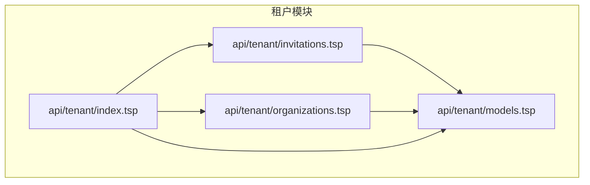
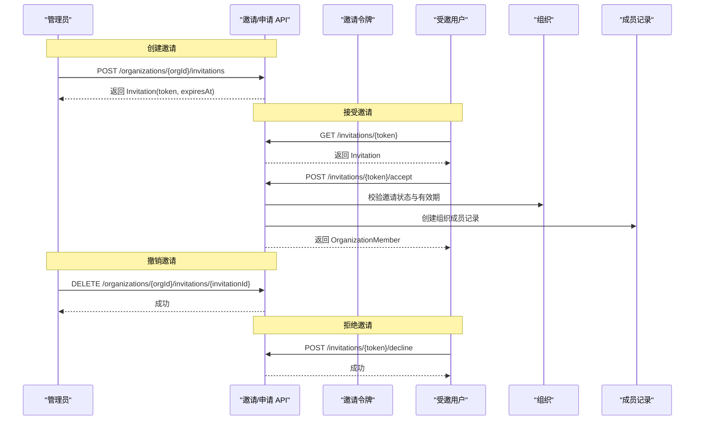
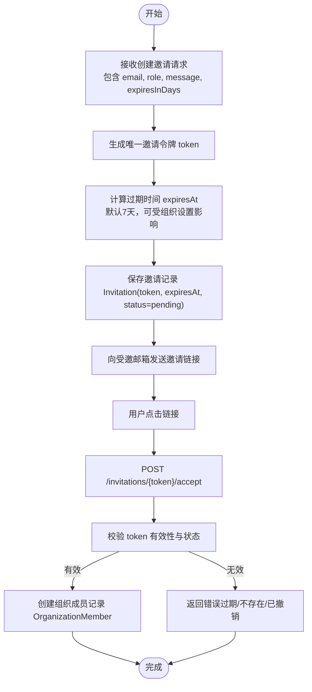
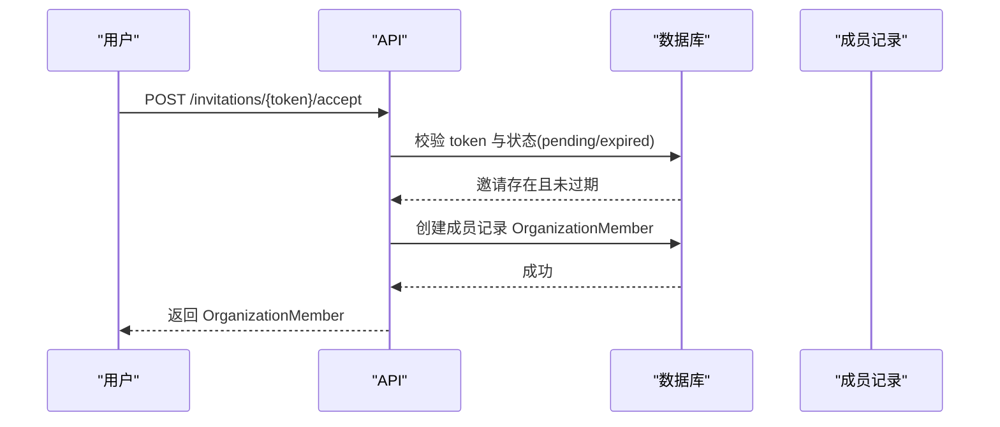
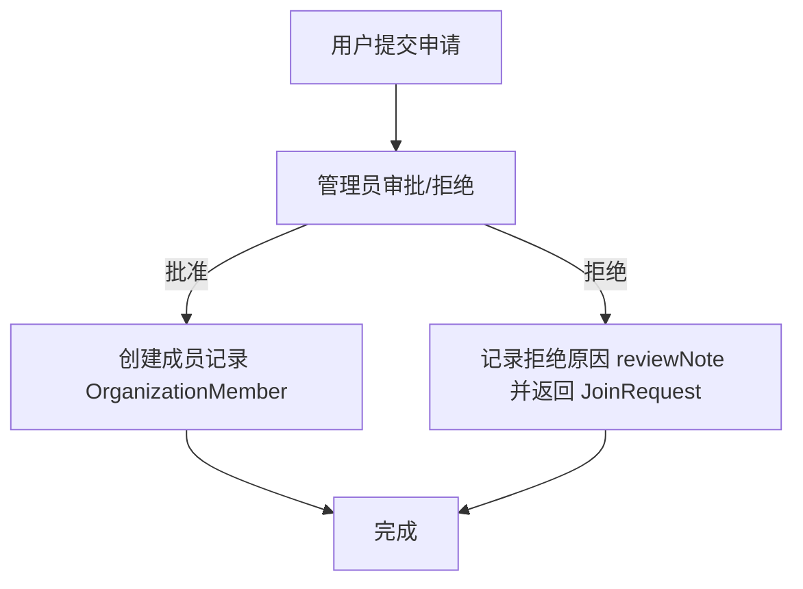
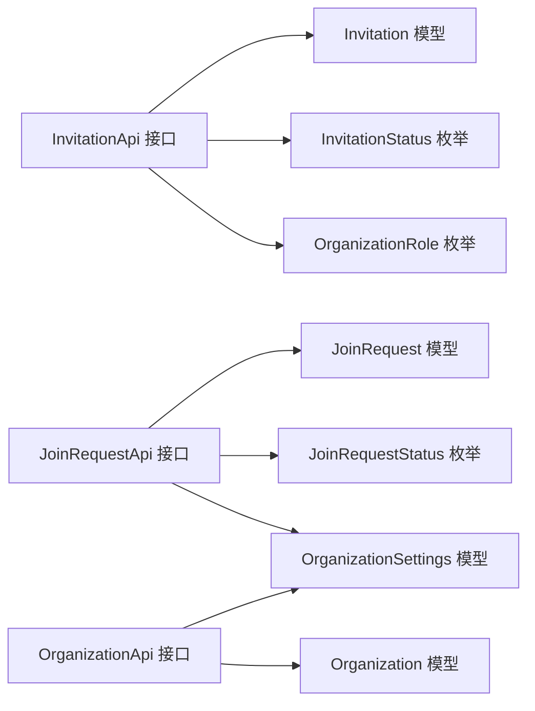

# 邀请机制

<cite>
**本文引用的文件**
- [api/tenant/invitations.tsp](file://api/tenant/invitations.tsp)
- [api/tenant/models.tsp](file://api/tenant/models.tsp)
- [api/tenant/organizations.tsp](file://api/tenant/organizations.tsp)
- [api/tenant/index.tsp](file://api/tenant/index.tsp)
</cite>

## 目录
1. [引言](#引言)
2. [项目结构](#项目结构)
3. [核心组件](#核心组件)
4. [架构总览](#架构总览)
5. [详细组件分析](#详细组件分析)
6. [依赖分析](#依赖分析)
7. [性能考虑](#性能考虑)
8. [故障排查指南](#故障排查指南)
9. [结论](#结论)
10. [附录](#附录)

## 引言
本文件系统化阐述 nexusbook-api 的“邀请机制”，围绕基于令牌的邀请系统进行设计与实现说明，覆盖邀请令牌的生成、加密、有效期控制（默认7天）、安全验证机制；详述创建邀请 API 的实现要点（邮箱验证、角色分配、邀请留言、过期策略）；深入解析邀请的撤销、接受与拒绝流程，重点说明 acceptInvitation 接口如何通过令牌验证用户身份并创建成员记录；同时全面介绍加入申请（Join Request）功能，包括用户主动申请加入、管理员审批/拒绝的完整工作流；描述邀请与申请列表的查询、过滤与分页能力，并提供 cURL 示例说明如何处理审批决策（批准时分配角色，拒绝时提供原因）。最后强调该机制在租户管理系统中的安全性与用户体验平衡。

## 项目结构
邀请机制由租户模块统一提供，核心文件如下：
- api/tenant/invitations.tsp：定义邀请与加入申请的 API 接口、请求/响应模型与路由
- api/tenant/models.tsp：定义邀请、加入申请、组织成员、组织设置等数据模型
- api/tenant/organizations.tsp：组织管理 API，包含组织设置（如邀请有效期、默认角色等）
- api/tenant/index.tsp：租户模块入口，聚合各子模块

图表来源
- [api/tenant/index.tsp](file://api/tenant/index.tsp#L1-L24)
- [api/tenant/invitations.tsp](file://api/tenant/invitations.tsp#L1-L60)
- [api/tenant/models.tsp](file://api/tenant/models.tsp#L1-L60)
- [api/tenant/organizations.tsp](file://api/tenant/organizations.tsp#L1-L40)

章节来源
- [api/tenant/index.tsp](file://api/tenant/index.tsp#L1-L24)

## 核心组件
- 邀请 API 接口：创建邀请、列出邀请、获取邀请详情、撤销邀请、接受邀请、拒绝邀请、通过令牌获取邀请信息
- 加入申请 API 接口：提交加入申请、列出申请、获取申请详情、批准申请、拒绝申请、取消申请
- 数据模型：邀请、加入申请、组织成员、组织设置、角色枚举、状态枚举
- 组织设置：邀请链接有效期、新成员默认角色、是否允许公开加入、加入是否需要审批、邮箱域名白名单

章节来源
- [api/tenant/invitations.tsp](file://api/tenant/invitations.tsp#L106-L548)
- [api/tenant/models.tsp](file://api/tenant/models.tsp#L267-L301)
- [api/tenant/models.tsp](file://api/tenant/models.tsp#L719-L942)
- [api/tenant/organizations.tsp](file://api/tenant/organizations.tsp#L34-L110)

## 架构总览
邀请机制采用“令牌驱动”的设计：管理员创建邀请时生成唯一令牌，将邀请链接发送给受邀邮箱；受邀用户点击链接后通过 acceptInvitation 接口完成身份验证并创建组织成员记录；若用户选择拒绝，则调用 declineInvitation 接口更新状态；管理员也可撤销未接受的邀请。加入申请则由用户主动发起，管理员审批后创建成员记录或拒绝并给出原因。

图表来源
- [api/tenant/invitations.tsp](file://api/tenant/invitations.tsp#L133-L323)
- [api/tenant/models.tsp](file://api/tenant/models.tsp#L758-L836)

## 详细组件分析

### 基于令牌的邀请系统设计
- 令牌生成与存储
  - 邀请模型包含 token 字段，用于链接跳转与验证
  - 邀请模型包含 expiresAt 字段，用于过期控制
- 有效期控制
  - 创建邀请请求支持 expiresInDays 参数，默认7天
  - 组织设置支持 inviteExpireDays，可作为全局默认值来源
- 安全验证机制
  - 接受邀请接口通过路径参数 token 进行令牌校验
  - 获取邀请详情接口通过 token 查询邀请信息，用于邀请接受页面展示
  - 拒绝邀请接口通过 token 更新状态为已拒绝
  - 撤销邀请接口仅对未接受的邀请生效

图表来源
- [api/tenant/invitations.tsp](file://api/tenant/invitations.tsp#L44-L61)
- [api/tenant/invitations.tsp](file://api/tenant/invitations.tsp#L133-L148)
- [api/tenant/invitations.tsp](file://api/tenant/invitations.tsp#L252-L275)
- [api/tenant/models.tsp](file://api/tenant/models.tsp#L758-L836)
- [api/tenant/models.tsp](file://api/tenant/models.tsp#L267-L301)

章节来源
- [api/tenant/invitations.tsp](file://api/tenant/invitations.tsp#L44-L61)
- [api/tenant/invitations.tsp](file://api/tenant/invitations.tsp#L133-L148)
- [api/tenant/invitations.tsp](file://api/tenant/invitations.tsp#L252-L275)
- [api/tenant/models.tsp](file://api/tenant/models.tsp#L758-L836)
- [api/tenant/models.tsp](file://api/tenant/models.tsp#L267-L301)

### 创建邀请 API 实现要点
- 路由与鉴权
  - POST /api/v1/organizations/{organizationId}/invitations
  - 需要 owner 或 admin 权限
- 请求体字段
  - email：必填，用于发送邀请链接
  - role：可选，默认 member
  - message：可选，邀请留言
  - expiresInDays：可选，默认7天
- 响应体
  - Invitation 对象，包含 token、expiresAt、status 等
- 过期策略
  - expiresInDays 决定邀请过期时间
  - 组织设置中的 inviteExpireDays 可作为默认值来源

章节来源
- [api/tenant/invitations.tsp](file://api/tenant/invitations.tsp#L133-L148)
- [api/tenant/invitations.tsp](file://api/tenant/invitations.tsp#L44-L61)
- [api/tenant/models.tsp](file://api/tenant/models.tsp#L758-L836)
- [api/tenant/models.tsp](file://api/tenant/models.tsp#L267-L301)

### 邀请撤销、接受与拒绝流程
- 撤销邀请
  - DELETE /api/v1/organizations/{organizationId}/invitations/{invitationId}
  - 仅对未接受的邀请生效
- 接受邀请
  - POST /api/v1/invitations/{token}/accept
  - 通过令牌验证邮箱匹配后创建成员记录
  - 返回 OrganizationMember
- 拒绝邀请
  - POST /api/v1/invitations/{token}/decline
  - 更新状态为已拒绝

图表来源
- [api/tenant/invitations.tsp](file://api/tenant/invitations.tsp#L252-L275)
- [api/tenant/models.tsp](file://api/tenant/models.tsp#L444-L511)

章节来源
- [api/tenant/invitations.tsp](file://api/tenant/invitations.tsp#L235-L251)
- [api/tenant/invitations.tsp](file://api/tenant/invitations.tsp#L252-L275)
- [api/tenant/invitations.tsp](file://api/tenant/invitations.tsp#L276-L299)
- [api/tenant/models.tsp](file://api/tenant/models.tsp#L444-L511)

### 加入申请（Join Request）功能
- 用户主动申请加入
  - POST /api/v1/organizations/{organizationId}/join-requests
  - 请求体包含 message（申请说明）
- 管理员审批/拒绝
  - POST /api/v1/organizations/{organizationId}/join-requests/{requestId}/approve
    - 可选授予角色（默认使用组织默认角色）
    - 可选审核备注
  - POST /api/v1/organizations/{organizationId}/join-requests/{requestId}/reject
    - 必填拒绝原因 reviewNote
- 列表与筛选
  - GET /api/v1/organizations/{organizationId}/join-requests
  - 支持分页（page/pageSize）与按状态过滤（status）

图表来源
- [api/tenant/invitations.tsp](file://api/tenant/invitations.tsp#L348-L517)
- [api/tenant/models.tsp](file://api/tenant/models.tsp#L868-L942)
- [api/tenant/models.tsp](file://api/tenant/models.tsp#L444-L511)

章节来源
- [api/tenant/invitations.tsp](file://api/tenant/invitations.tsp#L348-L517)
- [api/tenant/models.tsp](file://api/tenant/models.tsp#L868-L942)
- [api/tenant/models.tsp](file://api/tenant/models.tsp#L444-L511)

### 邀请与申请的查询、过滤与分页
- 邀请列表
  - GET /api/v1/organizations/{organizationId}/invitations
  - 支持分页（page/pageSize）与按状态过滤（status）
- 申请列表
  - GET /api/v1/organizations/{organizationId}/join-requests
  - 支持分页（page/pageSize）与按状态过滤（status）

章节来源
- [api/tenant/invitations.tsp](file://api/tenant/invitations.tsp#L163-L190)
- [api/tenant/invitations.tsp](file://api/tenant/invitations.tsp#L378-L405)

### cURL 示例与最佳实践
- 创建邀请
  - POST /api/v1/organizations/{organizationId}/invitations
  - 字段：email、role（可选，默认 member）、message（可选）、expiresInDays（可选，默认7）
- 列出邀请
  - GET /api/v1/organizations/{organizationId}/invitations?page=1&pageSize=20&status=pending
- 通过令牌获取邀请详情（用于邀请接受页面展示）
  - GET /api/v1/invitations/{token}
- 接受邀请
  - POST /api/v1/invitations/{token}/accept
- 拒绝邀请
  - POST /api/v1/invitations/{token}/decline
- 提交加入申请
  - POST /api/v1/organizations/{organizationId}/join-requests
  - 字段：message（可选）
- 列出加入申请
  - GET /api/v1/organizations/{organizationId}/join-requests?page=1&pageSize=20&status=pending
- 批准加入申请
  - POST /api/v1/organizations/{organizationId}/join-requests/{requestId}/approve
  - 字段：role（可选，默认使用组织默认角色）、reviewNote（可选）
- 拒绝加入申请
  - POST /api/v1/organizations/{organizationId}/join-requests/{requestId}/reject
  - 字段：reviewNote（必填）
- 撤销邀请
  - DELETE /api/v1/organizations/{organizationId}/invitations/{invitationId}

章节来源
- [api/tenant/invitations.tsp](file://api/tenant/invitations.tsp#L120-L131)
- [api/tenant/invitations.tsp](file://api/tenant/invitations.tsp#L157-L162)
- [api/tenant/invitations.tsp](file://api/tenant/invitations.tsp#L300-L312)
- [api/tenant/invitations.tsp](file://api/tenant/invitations.tsp#L338-L347)
- [api/tenant/invitations.tsp](file://api/tenant/invitations.tsp#L372-L377)
- [api/tenant/invitations.tsp](file://api/tenant/invitations.tsp#L444-L453)
- [api/tenant/invitations.tsp](file://api/tenant/invitations.tsp#L486-L493)
- [api/tenant/invitations.tsp](file://api/tenant/invitations.tsp#L526-L530)

## 依赖分析
- 模块耦合
  - invitations.tsp 依赖 models.tsp 中的 Invitation、JoinRequest、OrganizationMember、OrganizationRole、InvitationStatus、JoinRequestStatus 等模型
  - organizations.tsp 依赖 models.tsp 中的 Organization、OrganizationSettings 等模型
- 外部依赖
  - TypeSpec HTTP/OpenAPI 注解用于路由与文档生成
- 关键依赖链
  - 邀请 API -> Invitation 模型 -> 组织设置（inviteExpireDays、defaultRole）
  - 申请 API -> JoinRequest 模型 -> 组织设置（requireApproval、allowPublicJoin）

图表来源
- [api/tenant/invitations.tsp](file://api/tenant/invitations.tsp#L106-L548)
- [api/tenant/models.tsp](file://api/tenant/models.tsp#L719-L942)
- [api/tenant/organizations.tsp](file://api/tenant/organizations.tsp#L170-L240)

章节来源
- [api/tenant/invitations.tsp](file://api/tenant/invitations.tsp#L106-L548)
- [api/tenant/models.tsp](file://api/tenant/models.tsp#L719-L942)
- [api/tenant/organizations.tsp](file://api/tenant/organizations.tsp#L170-L240)

## 性能考虑
- 邀请令牌查询与校验
  - 通过 token 快速定位邀请记录，建议在数据库层建立索引以优化查询性能
- 列表查询
  - 邀请与申请列表支持分页与状态过滤，避免一次性加载大量数据
- 过期清理
  - 建议定期扫描过期邀请并更新状态，减少无效数据占用
- 审批流程
  - 批准/拒绝接口应尽量保持幂等与快速响应，避免阻塞用户操作

## 故障排查指南
- 邀请已过期
  - 现象：acceptInvitation 返回失败
  - 排查：检查 expiresAt 与当前时间；确认 expiresInDays 设置
- 邀请已被撤销
  - 现象：acceptInvitation 返回失败
  - 排查：确认状态是否为 revoked
- 邀请已被接受
  - 现象：acceptInvitation 返回失败
  - 排查：确认状态是否为 accepted
- 令牌无效
  - 现象：getInvitationByToken/declineInvitation 返回失败
  - 排查：确认 token 是否正确、是否存在
- 申请状态不符
  - 现象：approve/reject 返回失败
  - 排查：确认申请状态是否为 pending

章节来源
- [api/tenant/models.tsp](file://api/tenant/models.tsp#L758-L836)
- [api/tenant/models.tsp](file://api/tenant/models.tsp#L868-L942)

## 结论
本邀请机制以“令牌驱动”为核心，结合组织设置与严格的过期控制，实现了安全、可控、易用的邀请与加入申请流程。通过清晰的 API 设计与完善的模型定义，既保障了安全性，也兼顾了用户体验。建议在生产环境中配合定期清理、速率限制与审计日志，进一步提升系统的稳定性与合规性。

## 附录
- 数据模型概览（邀请、加入申请、组织成员、组织设置）
- 组织角色与状态枚举
- cURL 示例清单（创建邀请、列出邀请、接受/拒绝邀请、提交/审批/拒绝申请、撤销邀请）

章节来源
- [api/tenant/models.tsp](file://api/tenant/models.tsp#L719-L942)
- [api/tenant/models.tsp](file://api/tenant/models.tsp#L396-L443)
- [api/tenant/invitations.tsp](file://api/tenant/invitations.tsp#L120-L131)
- [api/tenant/invitations.tsp](file://api/tenant/invitations.tsp#L157-L162)
- [api/tenant/invitations.tsp](file://api/tenant/invitations.tsp#L300-L312)
- [api/tenant/invitations.tsp](file://api/tenant/invitations.tsp#L338-L347)
- [api/tenant/invitations.tsp](file://api/tenant/invitations.tsp#L372-L377)
- [api/tenant/invitations.tsp](file://api/tenant/invitations.tsp#L444-L453)
- [api/tenant/invitations.tsp](file://api/tenant/invitations.tsp#L486-L493)
- [api/tenant/invitations.tsp](file://api/tenant/invitations.tsp#L526-L530)