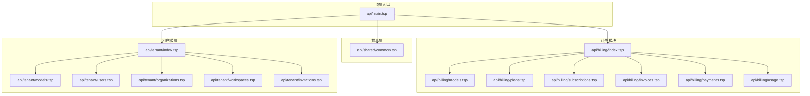
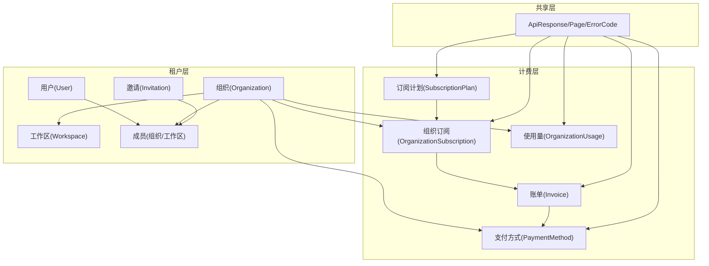
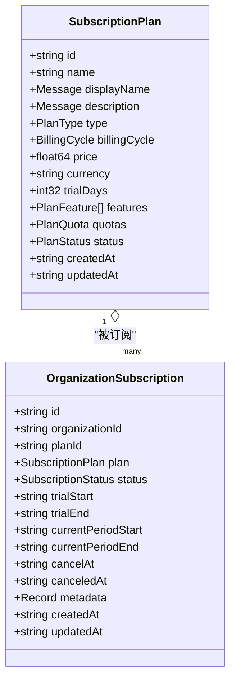
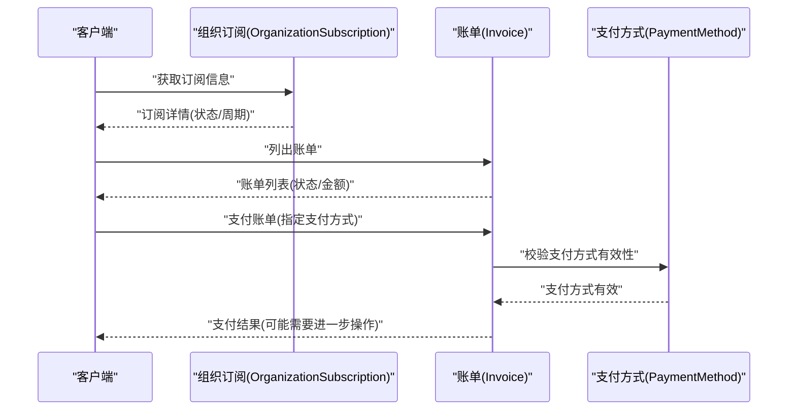
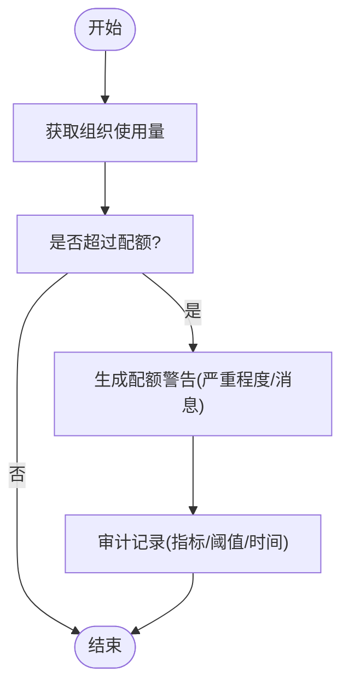
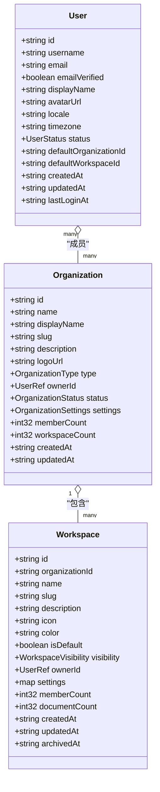
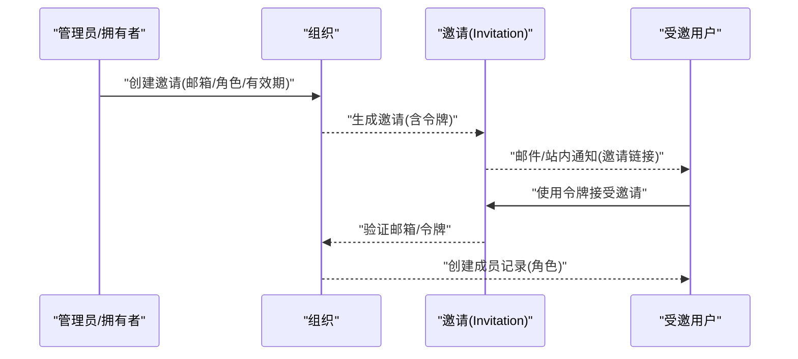
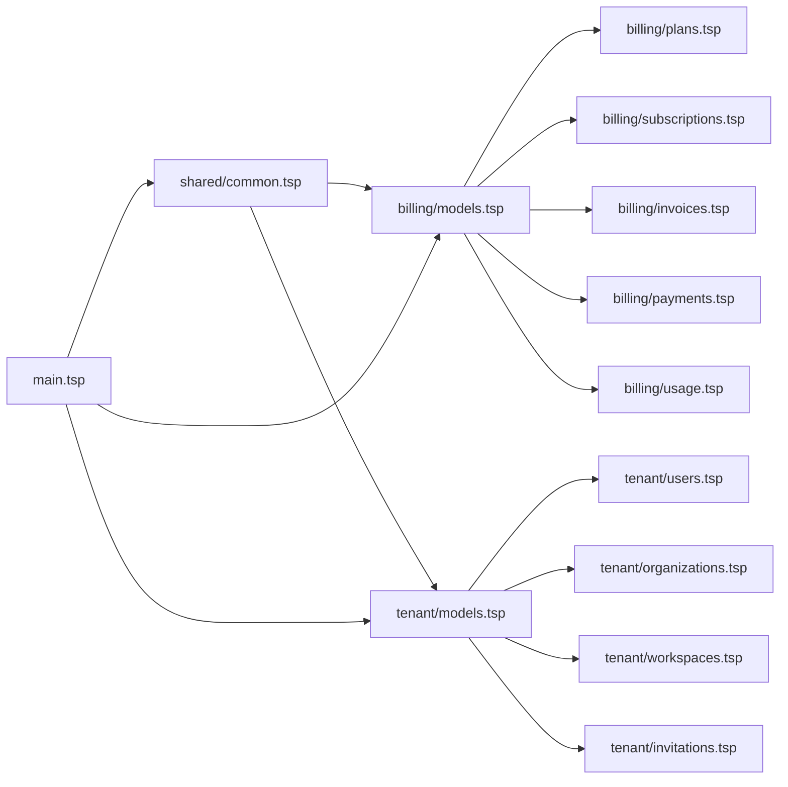

# 计费与租户管理

<cite>
**本文引用的文件**
- [api/main.tsp](file://api/main.tsp)
- [api/billing/index.tsp](file://api/billing/index.tsp)
- [api/billing/models.tsp](file://api/billing/models.tsp)
- [api/billing/plans.tsp](file://api/billing/plans.tsp)
- [api/billing/subscriptions.tsp](file://api/billing/subscriptions.tsp)
- [api/billing/invoices.tsp](file://api/billing/invoices.tsp)
- [api/billing/payments.tsp](file://api/billing/payments.tsp)
- [api/billing/usage.tsp](file://api/billing/usage.tsp)
- [api/tenant/index.tsp](file://api/tenant/index.tsp)
- [api/tenant/models.tsp](file://api/tenant/models.tsp)
- [api/tenant/users.tsp](file://api/tenant/users.tsp)
- [api/tenant/organizations.tsp](file://api/tenant/organizations.tsp)
- [api/tenant/workspaces.tsp](file://api/tenant/workspaces.tsp)
- [api/tenant/invitations.tsp](file://api/tenant/invitations.tsp)
- [api/shared/common.tsp](file://api/shared/common.tsp)
</cite>

## 目录
1. [简介](#简介)
2. [项目结构](#项目结构)
3. [核心组件](#核心组件)
4. [架构总览](#架构总览)
5. [详细组件分析](#详细组件分析)
6. [依赖分析](#依赖分析)
7. [性能考虑](#性能考虑)
8. [故障排查指南](#故障排查指南)
9. [结论](#结论)
10. [附录](#附录)

## 简介
本文件面向 naxbook-api 的计费与租户管理架构，系统性阐述多租户管理体系（Tenant Management）与商业化运营模块（Billing Module）的设计与集成。文档覆盖：
- 租户模型如何管理用户、组织、工作区与邀请机制，支撑企业级权限隔离
- 计费系统闭环：订阅计划（Plans）、订阅（Subscriptions）、账单（Invoices）、支付（Payments）、使用量（Usage）与配额控制
- 模块间依赖关系与数据流，订阅状态如何影响 API 访问权限
- 租户配额控制、用量计量与账单审计的实现要点
- 与外部支付网关的集成模式与安全注意事项

## 项目结构
- 计费模块（billing）：以 TypeSpec 定义订阅计划、订阅、账单、支付与用量接口，统一响应模型与错误码
- 租户模块（tenant）：以 TypeSpec 定义用户、组织、工作区、邀请与加入申请接口，提供企业级权限隔离
- 共享模块（shared）：统一响应格式、分页、查询模型、错误码与通用引用类型
- 顶层入口（main）：聚合各模块，声明 OpenAPI 服务与认证说明

图表来源
- [api/main.tsp](file://api/main.tsp#L1-L134)
- [api/billing/index.tsp](file://api/billing/index.tsp#L1-L11)
- [api/tenant/index.tsp](file://api/tenant/index.tsp#L1-L24)

章节来源
- [api/main.tsp](file://api/main.tsp#L1-L134)
- [api/billing/index.tsp](file://api/billing/index.tsp#L1-L11)
- [api/tenant/index.tsp](file://api/tenant/index.tsp#L1-L24)

## 核心组件
- 计费数据模型（billing/models.tsp）
  - 计划类型、计费周期、计划状态、订阅状态、账单状态、支付方式类型、使用量指标类型、配额警告严重程度
  - 计划配额与特性、订阅计划、组织订阅、账单项、账单、支付方式、使用量指标、组织使用量、使用量数据点、配额警告
- 计费接口（billing/*）
  - 计划管理（plans.tsp）
  - 订阅管理（subscriptions.tsp）
  - 账单管理（invoices.tsp）
  - 支付方式管理（payments.tsp）
  - 使用量与配额（usage.tsp）
- 租户数据模型（tenant/models.tsp）
  - 用户、OAuth 连接、组织、组织成员、工作区、工作区成员、邀请、加入申请
- 租户接口（tenant/*）
  - 用户（users.tsp）
  - 组织（organizations.tsp）
  - 工作区（workspaces.tsp）
  - 邀请与加入申请（invitations.tsp）
- 共享类型（shared/common.tsp）
  - ApiResponse、Page、ErrorCode、Message、排序与过滤模型、聚合与分组、附件与引用类型

章节来源
- [api/billing/models.tsp](file://api/billing/models.tsp#L1-L444)
- [api/billing/plans.tsp](file://api/billing/plans.tsp#L1-L41)
- [api/billing/subscriptions.tsp](file://api/billing/subscriptions.tsp#L1-L107)
- [api/billing/invoices.tsp](file://api/billing/invoices.tsp#L1-L76)
- [api/billing/payments.tsp](file://api/billing/payments.tsp#L1-L75)
- [api/billing/usage.tsp](file://api/billing/usage.tsp#L1-L68)
- [api/tenant/models.tsp](file://api/tenant/models.tsp#L1-L942)
- [api/tenant/users.tsp](file://api/tenant/users.tsp#L1-L268)
- [api/tenant/organizations.tsp](file://api/tenant/organizations.tsp#L1-L498)
- [api/tenant/workspaces.tsp](file://api/tenant/workspaces.tsp#L1-L631)
- [api/tenant/invitations.tsp](file://api/tenant/invitations.tsp#L1-L548)
- [api/shared/common.tsp](file://api/shared/common.tsp#L1-L576)

## 架构总览
计费与租户模块通过统一的响应模型与错误码进行交互，租户模块提供组织维度的权限边界，计费模块以组织为单位管理订阅、账单与用量。支付网关通过支付方式模型对接外部系统，账单与支付流程通过发票接口完成闭环。

图表来源
- [api/tenant/models.tsp](file://api/tenant/models.tsp#L1-L942)
- [api/billing/models.tsp](file://api/billing/models.tsp#L1-L444)
- [api/shared/common.tsp](file://api/shared/common.tsp#L1-L576)

## 详细组件分析

### 计费模块（Billing）

#### 计划与订阅（Plans/Subscriptions）
- 计划（SubscriptionPlan）
  - 定义计划类型、计费周期、价格、货币、试用天数、功能特性与配额
  - 通过“列出订阅计划”接口提供前端选择与定价展示
- 订阅（OrganizationSubscription）
  - 组织维度的订阅实体，包含订阅状态、试用期、当前计费周期、取消时间、元数据
  - 通过“创建/更新订阅”、“变更订阅计划”、“取消/恢复订阅”接口管理生命周期

图表来源
- [api/billing/models.tsp](file://api/billing/models.tsp#L170-L257)

章节来源
- [api/billing/plans.tsp](file://api/billing/plans.tsp#L1-L41)
- [api/billing/subscriptions.tsp](file://api/billing/subscriptions.tsp#L1-L107)
- [api/billing/models.tsp](file://api/billing/models.tsp#L170-L257)

#### 账单与支付（Invoices/Payments）
- 账单（Invoice）
  - 包含组织ID、订阅ID、账单编号、状态、小计/税/总计、货币、账单项、计费周期、到期日、支付时间、PDF链接等
  - 通过“列出账单”、“获取账单详情”、“支付账单”接口管理
- 支付方式（PaymentMethod）
  - 支持卡、支付宝、微信、银行转账等类型，支持默认支付方式与过期信息
  - 通过“列出/添加/删除/设默认”接口管理

图表来源
- [api/billing/invoices.tsp](file://api/billing/invoices.tsp#L1-L76)
- [api/billing/payments.tsp](file://api/billing/payments.tsp#L1-L75)
- [api/billing/models.tsp](file://api/billing/models.tsp#L278-L365)

章节来源
- [api/billing/invoices.tsp](file://api/billing/invoices.tsp#L1-L76)
- [api/billing/payments.tsp](file://api/billing/payments.tsp#L1-L75)
- [api/billing/models.tsp](file://api/billing/models.tsp#L278-L365)

#### 使用量与配额（Usage/Quota）
- 使用量（OrganizationUsage）
  - 按组织统计成员、工作区、文档、存储、API调用、实时会话等指标
- 配额与警告（QuotaWarning）
  - 指标类型、当前值、限制、百分比、严重程度与多语言消息
- 通过“获取当前使用量”、“获取历史趋势”、“获取配额警告”接口提供监控与告警

图表来源
- [api/billing/usage.tsp](file://api/billing/usage.tsp#L1-L68)
- [api/billing/models.tsp](file://api/billing/models.tsp#L367-L444)

章节来源
- [api/billing/usage.tsp](file://api/billing/usage.tsp#L1-L68)
- [api/billing/models.tsp](file://api/billing/models.tsp#L367-L444)

### 租户模块（Tenant）

#### 用户、组织与工作区
- 用户（User）
  - 基本信息、OAuth连接、默认组织与工作区、状态与时间戳
- 组织（Organization）
  - 类型、状态、设置（公开加入、审批、默认角色、域名白名单）、成员与工作区计数
- 工作区（Workspace）
  - 可见性、默认工作区、成员与文档计数、归档时间

图表来源
- [api/tenant/models.tsp](file://api/tenant/models.tsp#L58-L142)
- [api/tenant/models.tsp](file://api/tenant/models.tsp#L303-L394)
- [api/tenant/models.tsp](file://api/tenant/models.tsp#L540-L636)

章节来源
- [api/tenant/models.tsp](file://api/tenant/models.tsp#L58-L142)
- [api/tenant/models.tsp](file://api/tenant/models.tsp#L303-L394)
- [api/tenant/models.tsp](file://api/tenant/models.tsp#L540-L636)

#### 邀请与加入申请
- 邀请（Invitation）
  - 目标组织、被邀请邮箱、邀请人、角色、令牌与状态
- 加入申请（JoinRequest）
  - 申请说明、状态、处理记录

图表来源
- [api/tenant/invitations.tsp](file://api/tenant/invitations.tsp#L1-L548)
- [api/tenant/models.tsp](file://api/tenant/models.tsp#L758-L800)

章节来源
- [api/tenant/invitations.tsp](file://api/tenant/invitations.tsp#L1-L548)
- [api/tenant/models.tsp](file://api/tenant/models.tsp#L758-L800)

### 计费与租户的集成点
- 订阅与组织绑定
  - 组织订阅（OrganizationSubscription.organizationId）与组织（Organization.id）强关联，计费状态直接影响组织维度的访问权限
- 计划与配额
  - 计划配额（PlanQuota）决定组织使用量上限；使用量（OrganizationUsage）与配额警告（QuotaWarning）联动
- 支付与账单
  - 支付方式（PaymentMethod.organizationId）与账单（Invoice.organizationId）均以组织为单位，支付完成后更新订阅状态与账单状态
- API 访问控制
  - 订阅状态（SubscriptionStatus）可作为 API 访问权限的判定依据，例如 past_due/canceled/expired 时限制部分功能

章节来源
- [api/billing/models.tsp](file://api/billing/models.tsp#L214-L257)
- [api/billing/models.tsp](file://api/billing/models.tsp#L133-L209)
- [api/billing/models.tsp](file://api/billing/models.tsp#L367-L413)
- [api/tenant/models.tsp](file://api/tenant/models.tsp#L303-L394)

## 依赖分析
- 模块耦合
  - 计费模块依赖共享类型（ApiResponse/Page/ErrorCode）与多语言消息（Message）
  - 租户模块同样依赖共享类型与多语言消息
  - 计费模块与租户模块通过组织维度进行弱耦合（订阅与组织、支付与组织、使用量与组织）
- 直接依赖
  - 计费接口依赖计费数据模型
  - 租户接口依赖租户数据模型
  - 顶层入口导入共享、认证、租户、文档、扩展、国际化、偏好、计费与审计模块
- 外部集成
  - 支付网关通过支付方式模型对接（类型、令牌、默认设置），账单支付接口返回支付状态与是否需要进一步操作（如 3D Secure）

图表来源
- [api/shared/common.tsp](file://api/shared/common.tsp#L1-L576)
- [api/billing/models.tsp](file://api/billing/models.tsp#L1-L444)
- [api/tenant/models.tsp](file://api/tenant/models.tsp#L1-L942)
- [api/main.tsp](file://api/main.tsp#L1-L134)

章节来源
- [api/shared/common.tsp](file://api/shared/common.tsp#L1-L576)
- [api/billing/models.tsp](file://api/billing/models.tsp#L1-L444)
- [api/tenant/models.tsp](file://api/tenant/models.tsp#L1-L942)
- [api/main.tsp](file://api/main.tsp#L1-L134)

## 性能考虑
- 分页与查询
  - 使用 Page 模型与分页参数（page/pageSize）降低单次响应体积
  - 高级查询支持过滤、排序、分组与聚合，建议在计费与租户接口中合理使用，避免全量扫描
- 使用量统计
  - 使用量历史趋势接口支持按小时/天/月粒度，建议前端按需请求，避免跨长周期拉取
- 订阅状态判定
  - 订阅状态变化频繁时，建议缓存组织订阅信息并在状态变更事件后刷新
- 支付流程
  - 支付接口可能触发外部网关回调，建议异步处理并幂等化账单状态更新

[本节为通用指导，无需具体文件引用]

## 故障排查指南
- 认证与授权
  - 顶层入口明确要求 Bearer Token，所有 API 需携带有效 Token
- 统一错误码
  - 使用 ErrorCode 与 Message，便于定位与国际化展示
- 常见问题
  - 订阅状态异常：检查订阅状态枚举与变更流程（变更计划、取消/恢复）
  - 支付失败：确认支付方式有效性、令牌与网关返回状态
  - 使用量超限：检查配额警告与审计记录，必要时调整计划或清理资源
  - 邀请/加入申请：核对邮箱匹配、令牌有效性与状态流转

章节来源
- [api/main.tsp](file://api/main.tsp#L60-L95)
- [api/shared/common.tsp](file://api/shared/common.tsp#L80-L151)
- [api/billing/subscriptions.tsp](file://api/billing/subscriptions.tsp#L49-L106)
- [api/billing/invoices.tsp](file://api/billing/invoices.tsp#L50-L75)
- [api/billing/usage.tsp](file://api/billing/usage.tsp#L54-L68)
- [api/tenant/invitations.tsp](file://api/tenant/invitations.tsp#L133-L323)

## 结论
本架构以租户模块提供企业级权限隔离与组织边界，以计费模块实现订阅、账单、支付与用量闭环。通过统一的共享类型与错误码体系，模块间保持低耦合高内聚。建议在生产环境中结合订阅状态与配额警告实施访问控制与资源治理，并通过审计与告警完善账单与合规管理。

[本节为总结性内容，无需具体文件引用]

## 附录

### 订阅状态对 API 访问的影响
- trialing：允许有限试用，建议开放部分功能
- active：完全功能可用
- past_due：限制付费相关功能，保留基础读取
- canceled/expired：限制除基本只读外的功能
- archived：组织归档，全面限制访问

章节来源
- [api/billing/models.tsp](file://api/billing/models.tsp#L55-L67)
- [api/billing/subscriptions.tsp](file://api/billing/subscriptions.tsp#L1-L107)

### 外部支付网关集成模式
- 支付方式模型支持多种类型与默认设置
- 支付账单接口返回支付状态与是否需要进一步操作，适配 3D Secure 等二次验证
- 建议：
  - 使用支付令牌而非敏感卡号
  - 异步处理回调并幂等更新账单与订阅状态
  - 记录支付意图 ID 与客户端密钥以便前端二次验证

章节来源
- [api/billing/payments.tsp](file://api/billing/payments.tsp#L1-L75)
- [api/billing/invoices.tsp](file://api/billing/invoices.tsp#L50-L75)
- [api/billing/models.tsp](file://api/billing/models.tsp#L334-L365)