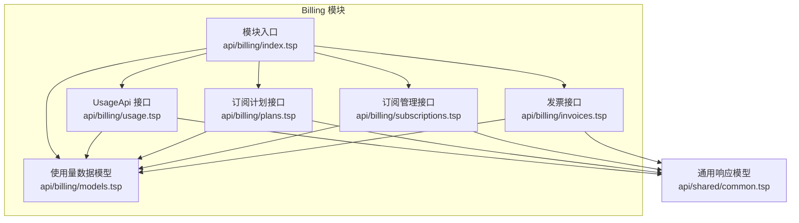
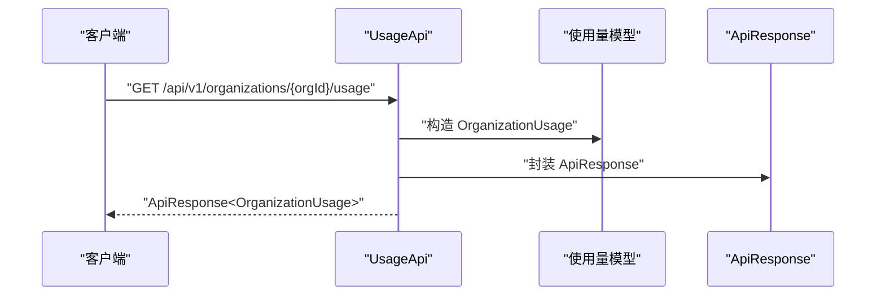
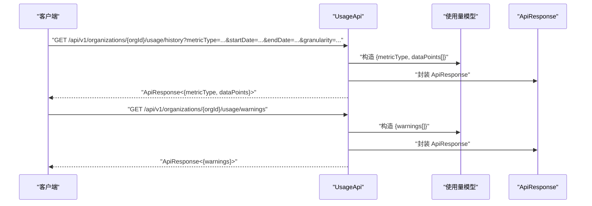
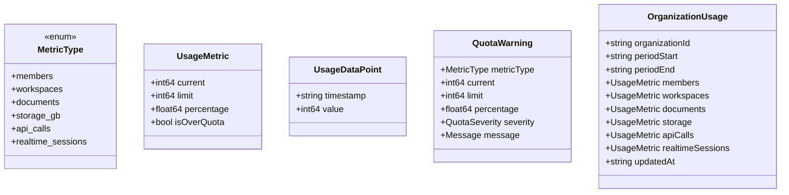
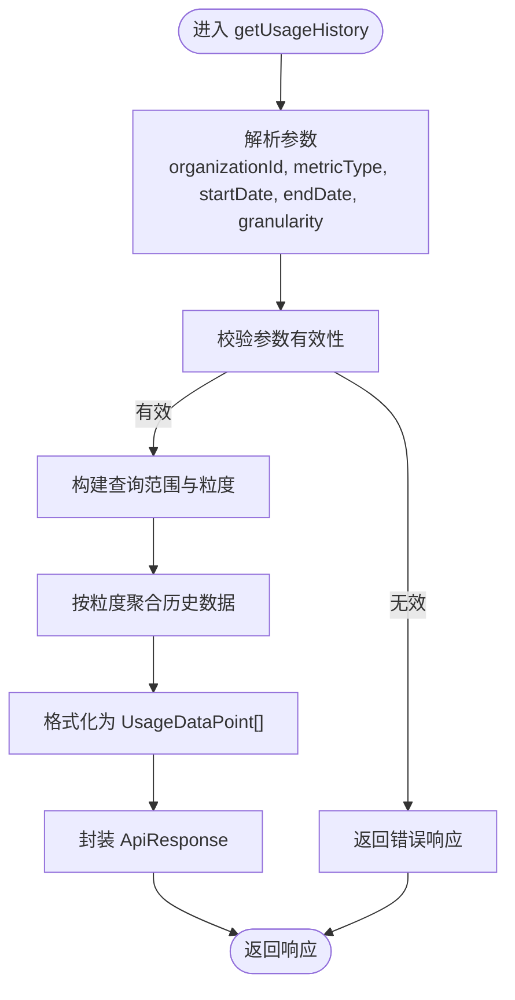
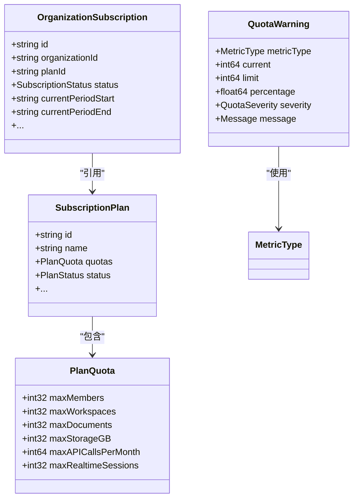
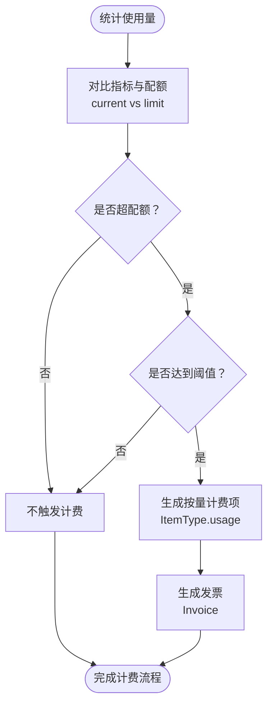
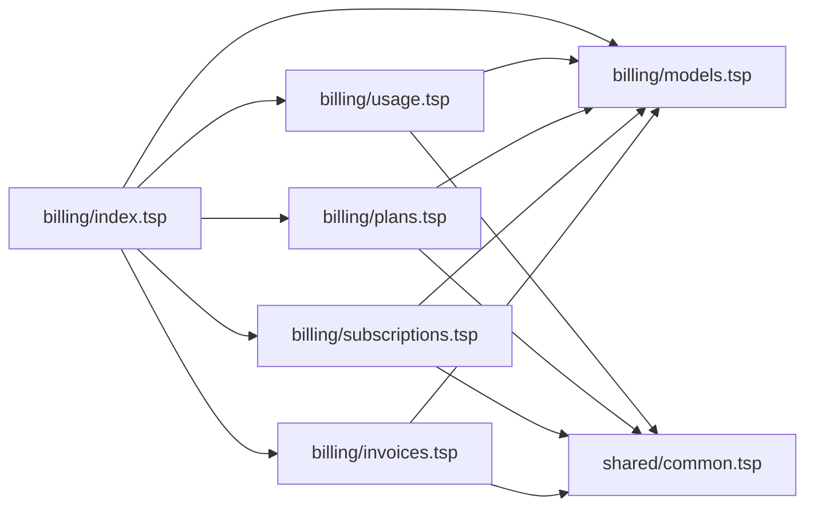

# 使用量跟踪

<cite>
**本文引用的文件**
- [api/billing/usage.tsp](file://api/billing/usage.tsp)
- [api/billing/models.tsp](file://api/billing/models.tsp)
- [api/billing/plans.tsp](file://api/billing/plans.tsp)
- [api/billing/subscriptions.tsp](file://api/billing/subscriptions.tsp)
- [api/billing/invoices.tsp](file://api/billing/invoices.tsp)
- [api/billing/index.tsp](file://api/billing/index.tsp)
- [api/shared/common.tsp](file://api/shared/common.tsp)
</cite>

## 目录
1. [简介](#简介)
2. [项目结构](#项目结构)
3. [核心组件](#核心组件)
4. [架构概览](#架构概览)
5. [详细组件分析](#详细组件分析)
6. [依赖关系分析](#依赖关系分析)
7. [性能考量](#性能考量)
8. [故障排查指南](#故障排查指南)
9. [结论](#结论)
10. [附录](#附录)

## 简介
本文件面向 naxusbook-api 的“使用量跟踪”模块，围绕 UsageApi 接口进行深入解析，涵盖以下目标：
- UsageApi：getUsage 获取组织当前资源使用量；getUsageHistory 查询历史使用趋势（支持 hour/day/month 粒度）；getQuotaWarnings 获取配额接近上限的警告信息。
- MetricType 枚举定义的计量指标（如 API 调用次数、存储空间、协作会话数等）及其采集机制。
- 实时计量数据的上报频率、聚合策略和存储方案。
- 配额控制与计费计划的关联，以及当使用量超出免费额度时的计费触发逻辑。
- 监控告警集成建议与用量数据导出能力说明。

## 项目结构
使用量跟踪模块位于 billing 子模块下，核心由接口定义、数据模型与订阅计划/发票等业务模块共同组成。入口文件将各子模块聚合在一起，形成统一的商业化运营 API。

图表来源
- [api/billing/index.tsp](file://api/billing/index.tsp#L1-L11)
- [api/billing/usage.tsp](file://api/billing/usage.tsp#L1-L67)
- [api/billing/models.tsp](file://api/billing/models.tsp#L1-L443)
- [api/billing/plans.tsp](file://api/billing/plans.tsp#L1-L40)
- [api/billing/subscriptions.tsp](file://api/billing/subscriptions.tsp#L1-L106)
- [api/billing/invoices.tsp](file://api/billing/invoices.tsp#L1-L76)
- [api/shared/common.tsp](file://api/shared/common.tsp#L1-L177)

章节来源
- [api/billing/index.tsp](file://api/billing/index.tsp#L1-L11)

## 核心组件
- UsageApi 接口：提供当前使用量查询、历史趋势查询、配额警告查询三大能力。
- MetricType 枚举：定义成员数、工作区数、文档数、存储空间、API 调用、实时会话等指标类型。
- OrganizationUsage/UsageMetric：组织使用量与单个指标的使用情况、配额、百分比、是否超限等。
- QuotaWarning：配额警告模型，包含指标类型、当前值、限制、百分比、严重程度与多语言消息。
- UsageDataPoint：历史趋势数据点，包含时间戳与数值。
- 计划与订阅：PlanQuota 与 SubscriptionPlan/SubscriptionPlanQuota 关联配额，支撑配额控制与计费触发。

章节来源
- [api/billing/usage.tsp](file://api/billing/usage.tsp#L1-L67)
- [api/billing/models.tsp](file://api/billing/models.tsp#L105-L119)
- [api/billing/models.tsp](file://api/billing/models.tsp#L133-L152)
- [api/billing/models.tsp](file://api/billing/models.tsp#L367-L413)
- [api/billing/models.tsp](file://api/billing/models.tsp#L415-L443)

## 架构概览
UsageApi 作为对外暴露的使用量查询入口，其返回结构 OrganizationUsage 与内部使用的 UsageMetric、UsageDataPoint、QuotaWarning 等模型保持一致语义。这些模型均来自 billing/models.tsp，并通过 ApiResponse 统一包装，遵循 shared/common.tsp 的响应规范。

图表来源
- [api/billing/usage.tsp](file://api/billing/usage.tsp#L18-L67)
- [api/billing/models.tsp](file://api/billing/models.tsp#L367-L413)
- [api/shared/common.tsp](file://api/shared/common.tsp#L153-L177)

## 详细组件分析

### UsageApi 接口
- getUsage：获取组织当前使用量，返回 OrganizationUsage。
- getUsageHistory：按指标类型、起止时间与粒度（hour/day/month）查询历史趋势，返回 UsageDataPoint 列表。
- getQuotaWarnings：获取配额接近上限的警告列表，返回 QuotaWarning 数组。

图表来源
- [api/billing/usage.tsp](file://api/billing/usage.tsp#L18-L67)
- [api/billing/models.tsp](file://api/billing/models.tsp#L415-L443)
- [api/shared/common.tsp](file://api/shared/common.tsp#L153-L177)

章节来源
- [api/billing/usage.tsp](file://api/billing/usage.tsp#L18-L67)

### MetricType 枚举与采集机制
- 指标类型：members、workspaces、documents、storage_gb、api_calls、realtime_sessions。
- 采集机制：仓库中未直接给出采集实现细节，但通过接口与模型可知：
  - 指标值以 UsageMetric 形式呈现，包含 current、limit、percentage、isOverQuota。
  - 历史趋势以 UsageDataPoint 提供，包含 timestamp 与 value。
  - 配额警告以 QuotaWarning 提供，包含 metricType、current、limit、percentage、severity、message。

图表来源
- [api/billing/models.tsp](file://api/billing/models.tsp#L105-L119)
- [api/billing/models.tsp](file://api/billing/models.tsp#L367-L413)
- [api/billing/models.tsp](file://api/billing/models.tsp#L415-L443)

章节来源
- [api/billing/models.tsp](file://api/billing/models.tsp#L105-L119)
- [api/billing/models.tsp](file://api/billing/models.tsp#L367-L413)
- [api/billing/models.tsp](file://api/billing/models.tsp#L415-L443)

### 历史趋势查询流程
- 输入参数：organizationId、metricType、startDate、endDate、granularity（hour/day/month）。
- 输出：包含 metricType 与 dataPoints 的结构。
- 聚合策略：仓库未给出具体聚合算法，但可通过 granularity 控制时间粒度；典型策略包括按小时/天/月聚合统计值。

图表来源
- [api/billing/usage.tsp](file://api/billing/usage.tsp#L38-L67)
- [api/billing/models.tsp](file://api/billing/models.tsp#L415-L422)

章节来源
- [api/billing/usage.tsp](file://api/billing/usage.tsp#L38-L67)
- [api/billing/models.tsp](file://api/billing/models.tsp#L415-L422)

### 配额控制与计费计划关联
- 计划配额：PlanQuota 定义了 maxMembers、maxWorkspaces、maxDocuments、maxStorageGB、maxAPICallsPerMonth、maxRealtimeSessions 等上限。
- 计划与订阅：SubscriptionPlan 与 OrganizationSubscription 提供计划选择、生效周期与状态管理。
- 配额警告：QuotaWarning 的 severity 与 message 用于提示接近上限的风险等级与多语言消息。

图表来源
- [api/billing/models.tsp](file://api/billing/models.tsp#L133-L152)
- [api/billing/models.tsp](file://api/billing/models.tsp#L170-L212)
- [api/billing/models.tsp](file://api/billing/models.tsp#L214-L257)
- [api/billing/models.tsp](file://api/billing/models.tsp#L424-L443)

章节来源
- [api/billing/models.tsp](file://api/billing/models.tsp#L133-L152)
- [api/billing/models.tsp](file://api/billing/models.tsp#L170-L212)
- [api/billing/models.tsp](file://api/billing/models.tsp#L214-L257)
- [api/billing/models.tsp](file://api/billing/models.tsp#L424-L443)

### 计费触发逻辑与免费额度
- 免费额度：PlanQuota 中的各上限字段即为免费/基础配额。
- 超额判定：UsageMetric.isOverQuota 与 QuotaWarning.percentage 提供超额判断依据。
- 计费触发：仓库未直接给出计费触发的具体实现，但结合以下事实可推断：
  - 当某指标达到或超过 limit 且 percentage 达到阈值时，系统可能生成按量计费项（ItemType.usage）并纳入发票（Invoice）。
  - 订阅计划与周期（BillingCycle）影响计费周期与金额计算。

图表来源
- [api/billing/models.tsp](file://api/billing/models.tsp#L367-L413)
- [api/billing/models.tsp](file://api/billing/models.tsp#L424-L443)
- [api/billing/models.tsp](file://api/billing/models.tsp#L277-L332)
- [api/billing/models.tsp](file://api/billing/models.tsp#L83-L91)

章节来源
- [api/billing/models.tsp](file://api/billing/models.tsp#L367-L413)
- [api/billing/models.tsp](file://api/billing/models.tsp#L424-L443)
- [api/billing/models.tsp](file://api/billing/models.tsp#L277-L332)
- [api/billing/models.tsp](file://api/billing/models.tsp#L83-L91)

### 实时计量数据的上报频率、聚合策略与存储方案
- 上报频率：仓库未提供具体频率配置，实际频率取决于业务侧埋点策略与数据采集链路。
- 聚合策略：通过 getUsageHistory 的 granularity 参数控制（hour/day/month），典型策略包括：
  - hour：按小时聚合，适合短期波动分析。
  - day：按自然日聚合，适合日常趋势观察。
  - month：按自然月聚合，适合长期趋势与预算对比。
- 存储方案：仓库未给出存储层实现细节，但历史数据以 UsageDataPoint[] 返回，建议采用时序数据库或分区表按时间维度存储，以便高效查询与压缩。

章节来源
- [api/billing/usage.tsp](file://api/billing/usage.tsp#L38-L67)
- [api/billing/models.tsp](file://api/billing/models.tsp#L415-L422)

### 监控告警集成建议
- 告警维度：基于 QuotaWarning.severity（warning/critical）与 percentage 设置阈值（如 80%/95%）。
- 告警渠道：可对接企业微信、钉钉、Slack 或邮件系统，结合 Message 的多语言能力实现本地化通知。
- 触发时机：当 isOverQuota 为 true 或 percentage 超过阈值时触发。
- 建议流程：告警 -> 自动通知 -> 人工干预 -> 升级计划或优化资源使用。

章节来源
- [api/billing/models.tsp](file://api/billing/models.tsp#L424-L443)
- [api/billing/models.tsp](file://api/billing/models.tsp#L367-L413)

### 用量数据导出功能说明
- 导出能力：仓库未提供专用导出接口，但可通过 getUsageHistory 获取历史数据点，再结合前端或外部系统进行导出。
- 建议方案：提供 CSV/JSON 导出接口，支持选择指标类型、起止时间与粒度，便于财务对账与审计。

章节来源
- [api/billing/usage.tsp](file://api/billing/usage.tsp#L38-L67)
- [api/billing/models.tsp](file://api/billing/models.tsp#L415-L422)

## 依赖关系分析
- 模块聚合：billing/index.tsp 引入 models、plans、subscriptions、invoices、payments、usage，形成统一入口。
- 接口依赖：UsageApi 依赖 models 中的 OrganizationUsage、UsageMetric、UsageDataPoint、QuotaWarning；响应统一使用 ApiResponse。
- 计划与订阅：SubscriptionPlansApi 与 OrganizationSubscriptionApi 提供计划与订阅管理，间接支撑配额与计费。

图表来源
- [api/billing/index.tsp](file://api/billing/index.tsp#L1-L11)
- [api/billing/usage.tsp](file://api/billing/usage.tsp#L1-L67)
- [api/billing/models.tsp](file://api/billing/models.tsp#L1-L443)
- [api/billing/plans.tsp](file://api/billing/plans.tsp#L1-L40)
- [api/billing/subscriptions.tsp](file://api/billing/subscriptions.tsp#L1-L106)
- [api/billing/invoices.tsp](file://api/billing/invoices.tsp#L1-L76)
- [api/shared/common.tsp](file://api/shared/common.tsp#L153-L177)

章节来源
- [api/billing/index.tsp](file://api/billing/index.tsp#L1-L11)

## 性能考量
- 查询性能：getUsageHistory 在大数据量场景下建议按时间范围与粒度进行索引优化，避免全表扫描。
- 缓存策略：对高频查询（如 getUsage）可引入缓存，设置合理的 TTL，降低后端压力。
- 分页与限额：历史趋势数据量可能较大，建议限制返回条数或提供分页参数（如仓库中通用分页模型 Page）。

## 故障排查指南
- 响应结构：统一使用 ApiResponse，若出现异常，检查 code 与 message 字段定位问题。
- 参数校验：确认 organizationId、metricType、startDate、endDate、granularity 等参数格式正确。
- 配额告警：若未收到告警，检查 percentage 与 severity 的阈值设置与数据更新频率。

章节来源
- [api/shared/common.tsp](file://api/shared/common.tsp#L153-L177)
- [api/billing/usage.tsp](file://api/billing/usage.tsp#L38-L67)

## 结论
- UsageApi 提供了组织使用量的当前值、历史趋势与配额告警三类关键能力，配合 MetricType 与相关数据模型，能够满足日常用量监控与计费联动需求。
- 计划与订阅模块为配额控制与计费提供了基础，结合 QuotaWarning 与 Invoice，可实现从预警到计费的闭环。
- 仓库未提供采集、聚合与存储的具体实现细节，建议在业务侧补充埋点策略、聚合算法与存储方案，并完善导出与告警集成。

## 附录
- 相关接口与模型路径参考：
  - [UsageApi 接口](file://api/billing/usage.tsp#L18-L67)
  - [使用量数据模型](file://api/billing/models.tsp#L367-L443)
  - [订阅计划接口](file://api/billing/plans.tsp#L1-L40)
  - [订阅管理接口](file://api/billing/subscriptions.tsp#L1-L106)
  - [发票接口](file://api/billing/invoices.tsp#L1-L76)
  - [模块入口](file://api/billing/index.tsp#L1-L11)
  - [通用响应模型](file://api/shared/common.tsp#L153-L177)