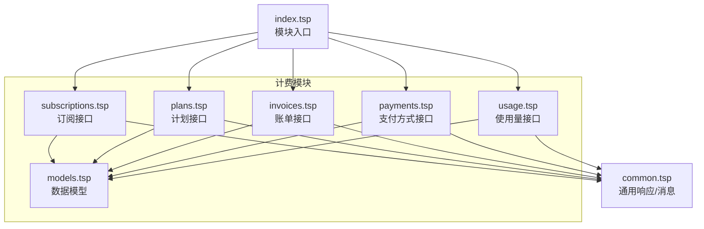
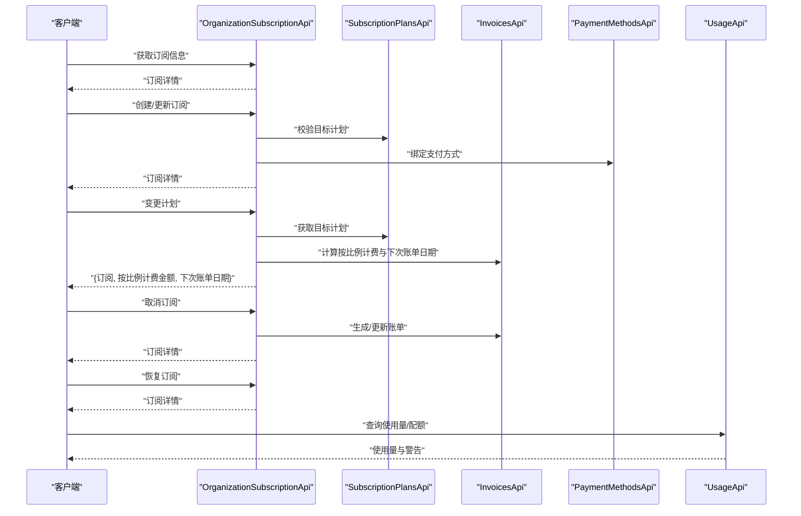
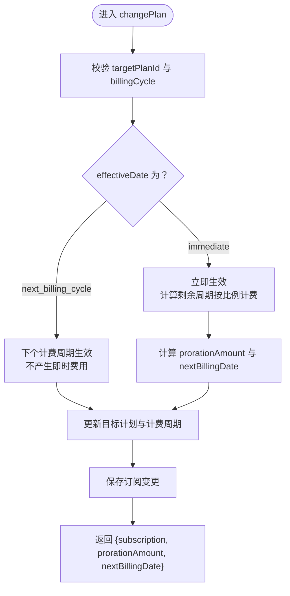
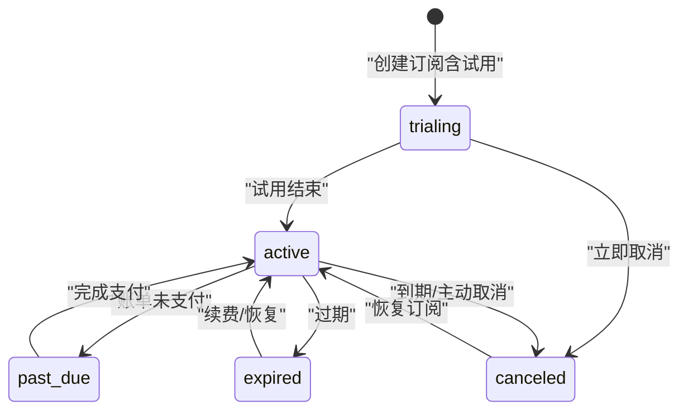
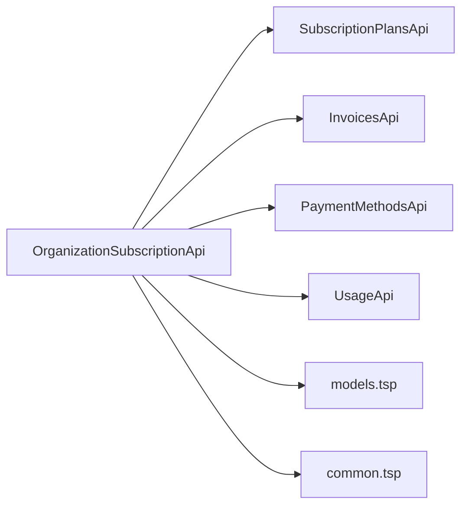

# 订阅管理

<cite>
**本文引用的文件**
- [subscriptions.tsp](file://api/billing/subscriptions.tsp)
- [models.tsp](file://api/billing/models.tsp)
- [common.tsp](file://api/shared/common.tsp)
- [index.tsp](file://api/billing/index.tsp)
- [plans.tsp](file://api/billing/plans.tsp)
- [invoices.tsp](file://api/billing/invoices.tsp)
- [payments.tsp](file://api/billing/payments.tsp)
- [usage.tsp](file://api/billing/usage.tsp)
</cite>

## 目录
1. [简介](#简介)
2. [项目结构](#项目结构)
3. [核心组件](#核心组件)
4. [架构概览](#架构概览)
5. [详细组件分析](#详细组件分析)
6. [依赖关系分析](#依赖关系分析)
7. [性能考量](#性能考量)
8. [故障排查指南](#故障排查指南)
9. [结论](#结论)

## 简介
本文件面向 naxbook-api 的订阅管理模块，聚焦 OrganizationSubscriptionApi 接口的完整生命周期能力：获取订阅、创建/更新订阅、变更计划（含按比例计费）、取消订阅（即时或周期末）、恢复订阅。文档将逐项说明各端点的请求参数、响应结构、业务规则与约束，并重点解释 changePlan 中 effectiveDate 参数在“immediate”与“next_billing_cycle”的差异处理，最后给出订阅状态转换图与与账单、支付模块的协同机制说明。

## 项目结构
订阅管理模块位于 api/billing 目录，采用按功能域拆分的模块化设计：
- 订阅接口：api/billing/subscriptions.tsp
- 数据模型：api/billing/models.tsp
- 通用响应与多语言消息：api/shared/common.tsp
- 计划管理：api/billing/plans.tsp
- 账单管理：api/billing/invoices.tsp
- 支付方式管理：api/billing/payments.tsp
- 使用量与配额：api/billing/usage.tsp
- 模块入口：api/billing/index.tsp

**图表来源**
- [index.tsp](file://api/billing/index.tsp#L1-L10)
- [subscriptions.tsp](file://api/billing/subscriptions.tsp#L1-L106)
- [models.tsp](file://api/billing/models.tsp#L1-L444)
- [common.tsp](file://api/shared/common.tsp#L1-L742)
- [plans.tsp](file://api/billing/plans.tsp#L1-L40)
- [invoices.tsp](file://api/billing/invoices.tsp#L1-L76)
- [payments.tsp](file://api/billing/payments.tsp#L1-L75)
- [usage.tsp](file://api/billing/usage.tsp#L1-L68)

**章节来源**
- [index.tsp](file://api/billing/index.tsp#L1-L10)

## 核心组件
- OrganizationSubscriptionApi：组织订阅生命周期管理的核心接口集合
- OrganizationSubscription：订阅实体，包含状态、计费周期、试用期、取消时间等
- SubscriptionPlan：订阅计划，包含类型、周期、价格、货币、功能特性与配额
- Invoice：账单，包含周期、金额、状态、到期日等
- PaymentMethod：支付方式，支持卡、支付宝、微信、银行转账等
- ApiResponse：统一响应包装，包含 success、code、message、payload

**章节来源**
- [subscriptions.tsp](file://api/billing/subscriptions.tsp#L1-L106)
- [models.tsp](file://api/billing/models.tsp#L150-L333)
- [common.tsp](file://api/shared/common.tsp#L153-L177)

## 架构概览
订阅管理围绕 OrganizationSubscriptionApi 展开，与计划、账单、支付、使用量模块协同：
- 计划模块提供可用计划列表与详情，用于创建/变更订阅时选择目标计划
- 账单模块负责账单生成与支付流程，订阅变更可能触发按比例计费与下次账单日期调整
- 支付模块提供支付方式管理，创建订阅时可绑定默认支付方式
- 使用量模块提供配额监控，帮助判断是否触发升级/降级

**图表来源**
- [subscriptions.tsp](file://api/billing/subscriptions.tsp#L1-L106)
- [plans.tsp](file://api/billing/plans.tsp#L1-L40)
- [invoices.tsp](file://api/billing/invoices.tsp#L1-L76)
- [payments.tsp](file://api/billing/payments.tsp#L1-L75)
- [usage.tsp](file://api/billing/usage.tsp#L1-L68)

## 详细组件分析

### getSubscription：获取当前订阅状态
- 路由：GET /api/v1/organizations/{organizationId}/subscription
- 请求参数
  - path.organizationId：组织 ID
- 响应
  - payload：OrganizationSubscription
- 业务规则
  - 返回当前组织的订阅状态、计费周期、试用期、取消时间等
  - 若不存在订阅，服务端应返回空订阅或相应错误（由具体实现决定）

**章节来源**
- [subscriptions.tsp](file://api/billing/subscriptions.tsp#L20-L28)
- [models.tsp](file://api/billing/models.tsp#L214-L257)

### createSubscription：创建或更新订阅
- 路由：POST /api/v1/organizations/{organizationId}/subscription
- 请求体
  - planId：目标订阅计划 ID
  - billingCycle：计费周期（monthly/yearly）
  - paymentMethodId：支付方式 ID（可选；若为空则后续需绑定）
- 响应
  - payload：OrganizationSubscription
- 业务规则
  - 若组织已有订阅，调用此接口通常视为“更新订阅”，可能触发按比例计费与下次账单日期调整（具体行为由实现决定）
  - 若首次创建，将基于 planId 与 billingCycle 初始化订阅周期
  - 若提供了 paymentMethodId，应尝试绑定支付方式（与支付模块协同）

**章节来源**
- [subscriptions.tsp](file://api/billing/subscriptions.tsp#L30-L47)
- [models.tsp](file://api/billing/models.tsp#L170-L213)
- [models.tsp](file://api/billing/models.tsp#L214-L257)
- [payments.tsp](file://api/billing/payments.tsp#L1-L75)

### changePlan：计划变更与按比例计费
- 路由：POST /api/v1/organizations/{organizationId}/subscription/change-plan
- 请求体
  - targetPlanId：目标计划 ID
  - billingCycle：计费周期（monthly/yearly）
  - effectiveDate：生效日期，取值为 "immediate" 或 "next_billing_cycle"
- 响应
  - payload.subscription：变更后的 OrganizationSubscription
  - payload.prorationAmount：按比例计费金额（可能为负值，表示退款）
  - payload.nextBillingDate：下次账单日期
- 业务规则与差异说明
  - effectiveDate = "immediate"
    - 立即生效，按剩余周期进行按比例计费，可能产生补收费用或退款
    - 下次账单日期可能提前或保持不变，取决于计费策略
  - effectiveDate = "next_billing_cycle"
    - 在当前计费周期结束后生效，不产生即时费用，仅调整下一周期的计费
    - prorationAmount 通常为 0 或接近 0
- 与账单模块协同
  - 变更后可能生成或更新账单，nextBillingDate 与 prorationAmount 由账单模块计算并返回

**图表来源**
- [subscriptions.tsp](file://api/billing/subscriptions.tsp#L50-L74)
- [models.tsp](file://api/billing/models.tsp#L170-L213)
- [models.tsp](file://api/billing/models.tsp#L214-L257)

**章节来源**
- [subscriptions.tsp](file://api/billing/subscriptions.tsp#L50-L74)
- [models.tsp](file://api/billing/models.tsp#L170-L213)
- [models.tsp](file://api/billing/models.tsp#L214-L257)

### cancelSubscription：取消订阅
- 路由：POST /api/v1/organizations/{organizationId}/subscription/cancel
- 请求体
  - cancelImmediately：是否立即取消
  - reason：取消原因（可选）
  - feedback：反馈意见（可选）
- 响应
  - payload：OrganizationSubscription
- 业务规则
  - cancelImmediately = true：立即取消，订阅在当前计费周期内仍有效，但状态标记为已取消；可能触发退款或结算
  - cancelImmediately = false：在当前计费周期结束后取消，保留当期使用权
  - 取消后，canceledAt 与 cancelAt 字段可用于追踪取消时间

**章节来源**
- [subscriptions.tsp](file://api/billing/subscriptions.tsp#L76-L94)
- [models.tsp](file://api/billing/models.tsp#L214-L257)

### resumeSubscription：恢复已取消的订阅
- 路由：POST /api/v1/organizations/{organizationId}/subscription/resume
- 请求体：无
- 响应
  - payload：OrganizationSubscription
- 业务规则
  - 仅对已取消状态的订阅有效，恢复后回到活跃状态
  - 恢复后的行为与重新创建订阅类似，可能涉及新的计费周期与账单

**章节来源**
- [subscriptions.tsp](file://api/billing/subscriptions.tsp#L96-L106)
- [models.tsp](file://api/billing/models.tsp#L214-L257)

### 订阅状态转换图
订阅状态枚举与典型转换如下：
- 状态枚举：trialing、active、past_due、canceled、expired
- 关键字段：currentPeriodStart/End、trialStart/trialEnd、cancelAt、canceledAt

**图表来源**
- [models.tsp](file://api/billing/models.tsp#L55-L67)
- [models.tsp](file://api/billing/models.tsp#L214-L257)

## 依赖关系分析
- OrganizationSubscriptionApi 依赖
  - 计划模块：用于校验目标计划与计费周期
  - 账单模块：用于按比例计费计算与下次账单日期确定
  - 支付模块：用于绑定/切换支付方式
  - 使用量模块：用于配额监控与升级/降级决策
- 数据模型依赖
  - OrganizationSubscription 依赖 SubscriptionPlan 与 Invoice 等模型
  - ApiResponse 为所有接口统一响应包装

**图表来源**
- [subscriptions.tsp](file://api/billing/subscriptions.tsp#L1-L106)
- [plans.tsp](file://api/billing/plans.tsp#L1-L40)
- [invoices.tsp](file://api/billing/invoices.tsp#L1-L76)
- [payments.tsp](file://api/billing/payments.tsp#L1-L75)
- [usage.tsp](file://api/billing/usage.tsp#L1-L68)
- [models.tsp](file://api/billing/models.tsp#L150-L333)
- [common.tsp](file://api/shared/common.tsp#L153-L177)

**章节来源**
- [index.tsp](file://api/billing/index.tsp#L1-L10)

## 性能考量
- 按比例计费计算应在变更计划时尽量缓存或延迟执行，避免重复计算
- 取消/恢复订阅时，应避免不必要的账单重算，优先复用已有账单数据
- 使用量与配额查询建议分页与限频，防止高并发下的查询风暴
- 统一响应封装减少序列化开销，提升整体吞吐

## 故障排查指南
- 常见错误与定位
  - 计划不存在或已归档：检查 SubscriptionPlansApi 的 listPlans/getPlan 返回
  - 支付方式无效：检查 PaymentMethodsApi 的 list/add/setDefault 流程
  - 账单状态异常：检查 InvoicesApi 的 list/get/pay 流程
  - 配额超限导致无法升级：通过 UsageApi 的 getQuotaWarnings 与 getUsage 定位
- 统一响应
  - 所有接口均使用 ApiResponse 包装，可通过 success、code、message、payload 快速定位问题

**章节来源**
- [common.tsp](file://api/shared/common.tsp#L153-L177)
- [plans.tsp](file://api/billing/plans.tsp#L1-L40)
- [payments.tsp](file://api/billing/payments.tsp#L1-L75)
- [invoices.tsp](file://api/billing/invoices.tsp#L1-L76)
- [usage.tsp](file://api/billing/usage.tsp#L1-L68)

## 结论
OrganizationSubscriptionApi 提供了从订阅创建、变更、取消到恢复的完整生命周期管理能力。其中 changePlan 的 effectiveDate 参数是按比例计费的关键开关，直接影响费用结算与下次账单日期。结合计划、账单、支付与使用量模块，可实现灵活的订阅治理与自动化计费闭环。建议在生产环境中对按比例计费与账单生成进行充分测试与监控，确保计费准确性与用户体验一致性。