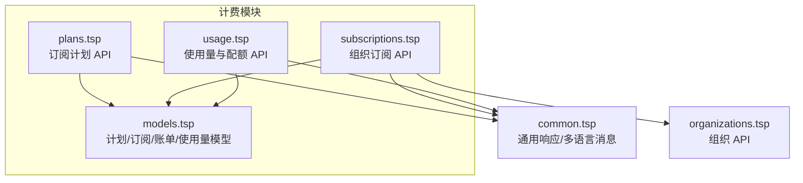
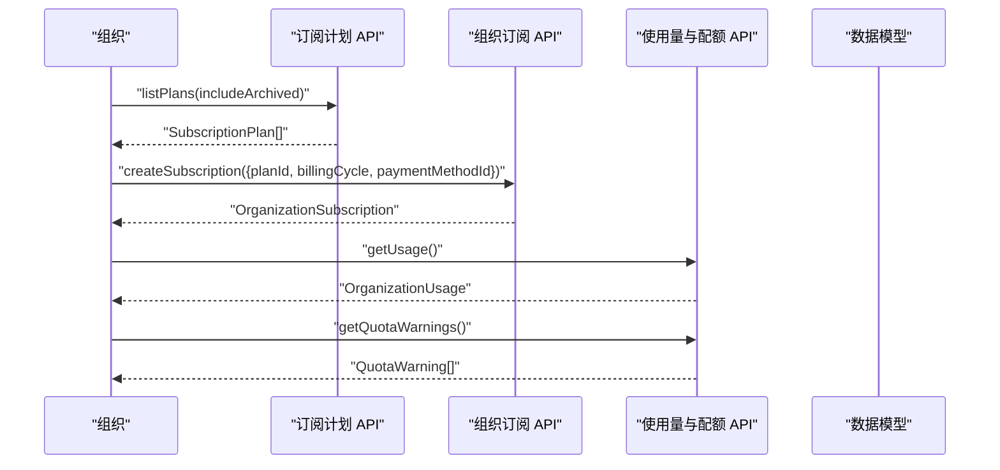
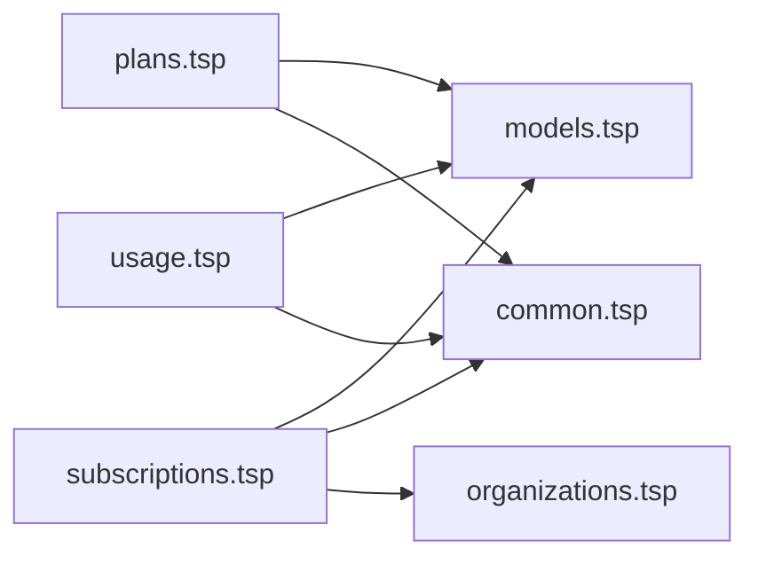

# 订阅计划

<cite>
**本文引用的文件**
- [api/billing/plans.tsp](file://api/billing/plans.tsp)
- [api/billing/models.tsp](file://api/billing/models.tsp)
- [api/billing/subscriptions.tsp](file://api/billing/subscriptions.tsp)
- [api/billing/usage.tsp](file://api/billing/usage.tsp)
- [api/billing/index.tsp](file://api/billing/index.tsp)
- [api/shared/common.tsp](file://api/shared/common.tsp)
- [api/tenant/organizations.tsp](file://api/tenant/organizations.tsp)
</cite>

## 目录
1. [简介](#简介)
2. [项目结构](#项目结构)
3. [核心组件](#核心组件)
4. [架构概览](#架构概览)
5. [详细组件分析](#详细组件分析)
6. [依赖分析](#依赖分析)
7. [性能考虑](#性能考虑)
8. [故障排查指南](#故障排查指南)
9. [结论](#结论)
10. [附录](#附录)

## 简介
本文件面向 nxb-api 的订阅计划模块，系统化梳理 SubscriptionPlan 数据模型、计费周期与定价策略、API 端点行为、与组织租户系统的集成关系，以及计划变更时的版本控制与兼容性策略。文档同时给出与计费周期、配额、功能特性、使用量监控等关键维度的交互流程，帮助开发者快速理解并正确使用订阅计划能力。

## 项目结构
订阅计划相关能力由“计费模块”统一提供，核心文件分布如下：
- 计划 API：api/billing/plans.tsp
- 计划数据模型与枚举：api/billing/models.tsp
- 订阅管理 API：api/billing/subscriptions.tsp
- 使用量与配额 API：api/billing/usage.tsp
- 计费模块入口：api/billing/index.tsp
- 通用响应与多语言消息：api/shared/common.tsp
- 组织 API（租户集成）：api/tenant/organizations.tsp

图表来源
- [api/billing/plans.tsp](file://api/billing/plans.tsp#L1-L40)
- [api/billing/models.tsp](file://api/billing/models.tsp#L1-L212)
- [api/billing/subscriptions.tsp](file://api/billing/subscriptions.tsp#L1-L106)
- [api/billing/usage.tsp](file://api/billing/usage.tsp#L1-L68)
- [api/shared/common.tsp](file://api/shared/common.tsp#L1-L177)
- [api/tenant/organizations.tsp](file://api/tenant/organizations.tsp#L1-L120)

章节来源
- [api/billing/index.tsp](file://api/billing/index.tsp#L1-L11)

## 核心组件
- 订阅计划模型 SubscriptionPlan：包含 planId、名称、描述、类型、计费周期、价格、货币、试用天数、功能特性、配额限制、状态及时间戳等字段。
- 计费周期 BillingCycle：支持 monthly 与 yearly。
- 计划状态 PlanStatus：active 与 archived。
- 组织订阅 OrganizationSubscription：绑定组织与计划，记录订阅状态、试用期、当前计费周期、取消时间、元数据等。
- 使用量与配额 OrganizationUsage/UsageMetric：用于监控组织在成员、工作区、文档、存储、API 调用、实时会话等指标上的使用情况与配额上限。
- 通用响应 ApiResponse 与多语言 Message：统一响应结构与国际化消息。

章节来源
- [api/billing/models.tsp](file://api/billing/models.tsp#L170-L212)
- [api/billing/models.tsp](file://api/billing/models.tsp#L214-L257)
- [api/billing/models.tsp](file://api/billing/models.tsp#L367-L443)
- [api/shared/common.tsp](file://api/shared/common.tsp#L69-L177)

## 架构概览
订阅计划模块围绕“计划定义—订阅绑定—使用量监控—账单结算”的闭环展开。组织通过订阅 API 选择计划与计费周期，系统据此生成账单并进行扣款；同时使用量与配额 API 提供配额预警与历史趋势，辅助运营与风控。

图表来源
- [api/billing/plans.tsp](file://api/billing/plans.tsp#L18-L40)
- [api/billing/subscriptions.tsp](file://api/billing/subscriptions.tsp#L18-L47)
- [api/billing/usage.tsp](file://api/billing/usage.tsp#L18-L67)
- [api/billing/models.tsp](file://api/billing/models.tsp#L170-L212)

## 详细组件分析

### 订阅计划数据模型 SubscriptionPlan
- 关键字段
  - id：计划唯一标识
  - name/displayName/description：名称与描述（多语言）
  - type：计划类型（trial/standard/custom）
  - billingCycle：计费周期（monthly/yearly）
  - price/currency：价格与货币代码
  - trialDays：试用天数
  - features：功能特性数组（featureKey、featureName、enabled、limit）
  - quotas：配额限制（成员数、工作区数、文档数、存储、API 调用、实时会话）
  - status：active/archived
  - createdAt/updatedAt：时间戳
- 设计要点
  - 多语言字段通过 Message 类型承载，便于国际化展示。
  - 配额限制字段支持“无限制”语义（常见为 -1）。
  - 计费周期与价格共同决定订阅费用，yearly 通常体现折扣优势。

章节来源
- [api/billing/models.tsp](file://api/billing/models.tsp#L170-L212)

### 计费周期与定价策略
- 计费周期
  - monthly：按月计费
  - yearly：按年计费
- 定价模式
  - 本模块未显式定义“免费/按量付费/阶梯定价”的枚举或字段，但可通过以下方式实现：
    - 免费：price=0 且 quotas 对应指标设为足够大的值或 -1 表示无限制。
    - 按量付费：在 features/quotas 中定义限额，超出部分通过使用量与配额 API 监控并触发提醒。
    - 阶梯定价：可在多个 SubscriptionPlan 中定义不同 price/quotas 的方案，由前端或业务层根据使用量选择合适计划。
- 与订阅变更的关系
  - changePlan 接口支持 immediate 与 next_billing_cycle 两种生效方式，便于平滑过渡不同计费周期或价格档位。

章节来源
- [api/billing/models.tsp](file://api/billing/models.tsp#L40-L45)
- [api/billing/subscriptions.tsp](file://api/billing/subscriptions.tsp#L56-L74)

### 计划 API：listPlans 与 getPlan
- listPlans
  - 路由：GET /api/v1/billing/plans
  - 参数：includeArchived（默认 false）
  - 返回：ApiResponse<SubscriptionPlan[]>
  - 作用：列出可用计划，支持过滤已归档计划
- getPlan
  - 路由：GET /api/v1/billing/plans/{planId}
  - 参数：planId
  - 返回：ApiResponse<SubscriptionPlan>
  - 作用：获取指定计划详情

章节来源
- [api/billing/plans.tsp](file://api/billing/plans.tsp#L18-L40)

### 组织订阅 API：创建/变更/取消/恢复
- createSubscription
  - 路由：POST /api/v1/organizations/{organizationId}/subscription
  - 请求体：planId、billingCycle、paymentMethodId（可选）
  - 返回：ApiResponse<OrganizationSubscription>
  - 作用：为组织创建或更新订阅
- changePlan
  - 路由：POST /api/v1/organizations/{organizationId}/subscription/change-plan
  - 请求体：targetPlanId、billingCycle、effectiveDate（immediate/next_billing_cycle）
  - 返回：包含 subscription、prorationAmount、nextBillingDate
  - 作用：升级/降级订阅计划，支持比例计费
- cancelSubscription
  - 路由：POST /api/v1/organizations/{organizationId}/subscription/cancel
  - 请求体：cancelImmediately、reason、feedback
  - 返回：ApiResponse<OrganizationSubscription>
  - 作用：取消订阅
- resumeSubscription
  - 路由：POST /api/v1/organizations/{organizationId}/subscription/resume
  - 返回：ApiResponse<OrganizationSubscription>
  - 作用：恢复已取消的订阅

章节来源
- [api/billing/subscriptions.tsp](file://api/billing/subscriptions.tsp#L18-L106)

### 使用量与配额 API：监控与预警
- getUsage
  - 路由：GET /api/v1/organizations/{organizationId}/usage
  - 返回：ApiResponse<OrganizationUsage>
  - 作用：获取组织当前使用量（成员、工作区、文档、存储、API 调用、实时会话）
- getUsageHistory
  - 路由：GET /api/v1/organizations/{organizationId}/usage/history
  - 参数：metricType、startDate、endDate、granularity（hour/day/month）
  - 返回：包含 metricType 与 dataPoints 的对象
  - 作用：获取使用量历史趋势
- getQuotaWarnings
  - 路由：GET /api/v1/organizations/{organizationId}/usage/warnings
  - 返回：ApiResponse<{ warnings: QuotaWarning[] }>
  - 作用：获取配额警告列表

章节来源
- [api/billing/usage.tsp](file://api/billing/usage.tsp#L18-L67)

### 与组织租户系统的集成关系
- 订阅 API 的路径以组织 ID 为参数，表明订阅与组织强绑定。
- 组织 API 提供组织创建、更新、成员管理等能力，为订阅的生命周期管理提供上下文。
- 计划与订阅之间的关系：计划定义能力与配额，订阅绑定组织与计划，使用量与配额 API 为运营与风控提供依据。

章节来源
- [api/billing/subscriptions.tsp](file://api/billing/subscriptions.tsp#L18-L28)
- [api/tenant/organizations.tsp](file://api/tenant/organizations.tsp#L175-L224)

### 版本控制与兼容性策略
- 计划版本化建议
  - 采用“计划+版本号”或“计划+状态”的方式区分不同版本，避免直接修改现有 planId 导致订阅绑定失效。
  - 对于重大变更（如配额/价格调整），保留旧版计划一段时间并标注 archived，确保已有订阅不受影响。
- 兼容性策略
  - changePlan 支持 immediate 与 next_billing_cycle 两种生效方式，便于在不中断服务的前提下完成迁移。
  - 使用 getQuotaWarnings 与 getUsageHistory 辅助评估变更影响，提前预警潜在风险。
- 多语言与国际化
  - displayName/description 采用 Message 类型，便于在不同语言环境下展示一致的品牌信息与条款说明。

章节来源
- [api/billing/subscriptions.tsp](file://api/billing/subscriptions.tsp#L56-L74)
- [api/billing/models.tsp](file://api/billing/models.tsp#L170-L212)
- [api/shared/common.tsp](file://api/shared/common.tsp#L69-L177)

## 依赖分析
- 计划 API 依赖
  - plans.tsp 依赖 models.tsp（SubscriptionPlan、Message）与 shared/common.tsp（ApiResponse）
- 订阅 API 依赖
  - subscriptions.tsp 依赖 models.tsp（OrganizationSubscription、BillingCycle）与 shared/common.tsp（ApiResponse）
- 使用量 API 依赖
  - usage.tsp 依赖 models.tsp（OrganizationUsage、UsageMetric、QuotaWarning、MetricType）与 shared/common.tsp（ApiResponse）
- 组织 API 依赖
  - organizations.tsp 提供组织上下文，订阅 API 通过组织 ID 与之耦合

图表来源
- [api/billing/plans.tsp](file://api/billing/plans.tsp#L1-L40)
- [api/billing/models.tsp](file://api/billing/models.tsp#L1-L212)
- [api/billing/subscriptions.tsp](file://api/billing/subscriptions.tsp#L1-L106)
- [api/billing/usage.tsp](file://api/billing/usage.tsp#L1-L67)
- [api/shared/common.tsp](file://api/shared/common.tsp#L1-L177)
- [api/tenant/organizations.tsp](file://api/tenant/organizations.tsp#L175-L224)

## 性能考虑
- 列表查询优化
  - listPlans 支持 includeArchived 过滤，建议在前端缓存活跃计划列表，减少重复请求。
- 订阅变更
  - changePlan 的 prorationAmount 可用于预估费用波动，建议在前端做预算提示。
- 使用量监控
  - getUsageHistory 的粒度参数可按需选择 day/month，避免一次性拉取过多历史数据导致性能问题。

## 故障排查指南
- 常见问题定位
  - 计划不可见：确认 PlanStatus 为 active，且 includeArchived=false 时不会返回已归档计划。
  - 订阅状态异常：检查 OrganizationSubscription.status 与 cancelAt/canceledAt 字段，判断是否处于 canceled/expired 状态。
  - 配额告警频繁：查看 getQuotaWarnings 输出，结合 getUsageHistory 分析趋势，必要时调整计划或增加配额。
- 错误码与响应
  - 使用 ApiResponse 统一响应结构，关注 code 与 message 字段，message 为多语言，便于定位问题。

章节来源
- [api/billing/models.tsp](file://api/billing/models.tsp#L48-L53)
- [api/billing/models.tsp](file://api/billing/models.tsp#L214-L257)
- [api/billing/usage.tsp](file://api/billing/usage.tsp#L54-L67)
- [api/shared/common.tsp](file://api/shared/common.tsp#L153-L177)

## 结论
订阅计划模块通过清晰的模型设计与完善的 API 能力，实现了从计划定义、订阅绑定、使用量监控到订阅变更的全链路闭环。计费周期与配额/功能特性的组合可灵活适配多种定价策略；与组织租户系统的集成确保了订阅与组织上下文的一致性。建议在生产环境中配合版本控制与兼容性策略，保障订阅迁移过程的平滑与稳定。

## 附录

### API 端点一览
- 计划
  - GET /api/v1/billing/plans
  - GET /api/v1/billing/plans/{planId}
- 订阅
  - GET /api/v1/organizations/{organizationId}/subscription
  - POST /api/v1/organizations/{organizationId}/subscription
  - POST /api/v1/organizations/{organizationId}/subscription/change-plan
  - POST /api/v1/organizations/{organizationId}/subscription/cancel
  - POST /api/v1/organizations/{organizationId}/subscription/resume
- 使用量与配额
  - GET /api/v1/organizations/{organizationId}/usage
  - GET /api/v1/organizations/{organizationId}/usage/history
  - GET /api/v1/organizations/{organizationId}/usage/warnings

章节来源
- [api/billing/plans.tsp](file://api/billing/plans.tsp#L18-L40)
- [api/billing/subscriptions.tsp](file://api/billing/subscriptions.tsp#L18-L106)
- [api/billing/usage.tsp](file://api/billing/usage.tsp#L18-L67)