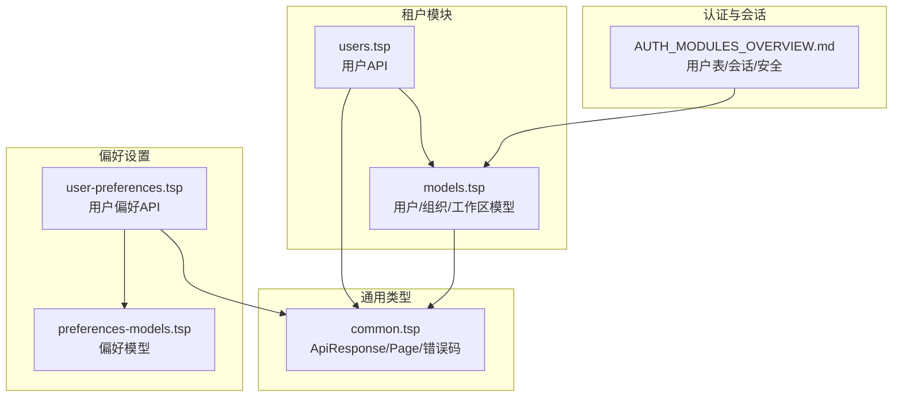
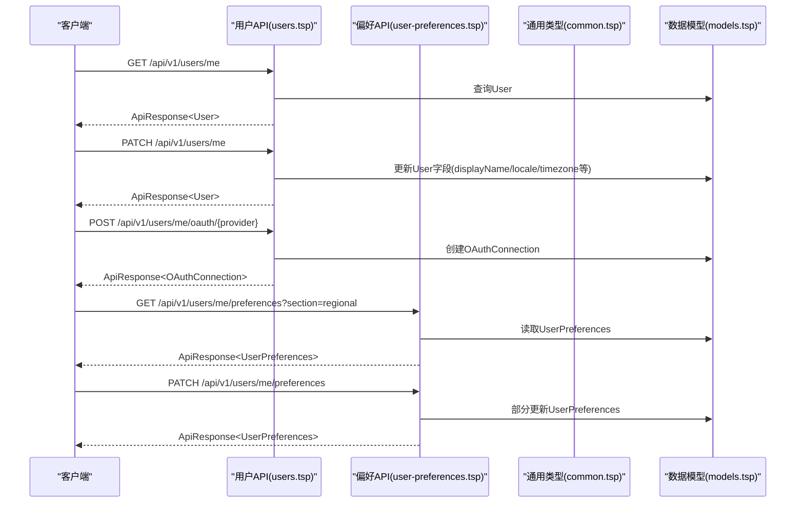
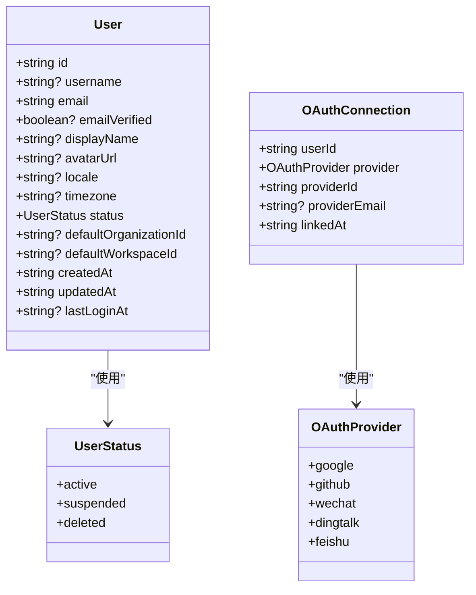
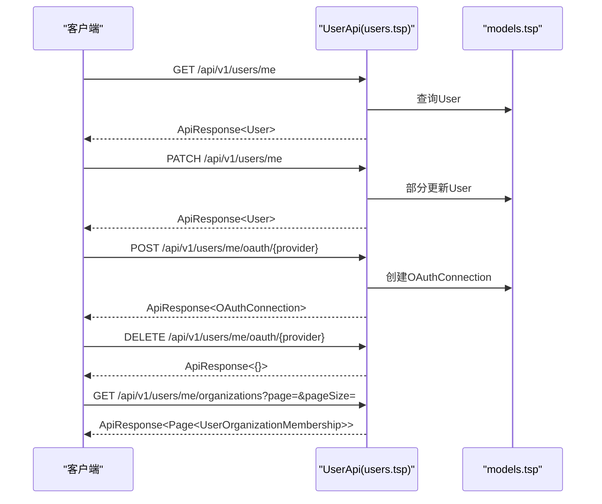
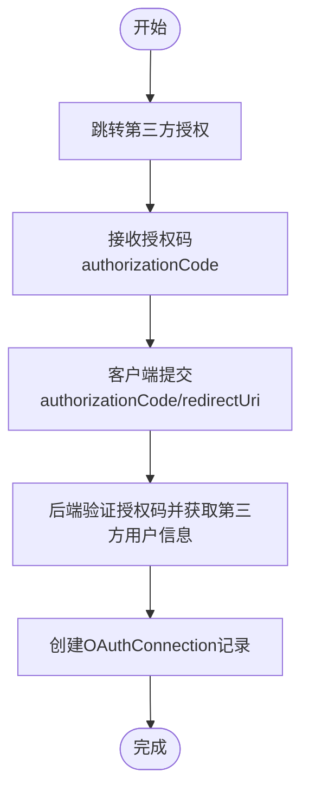
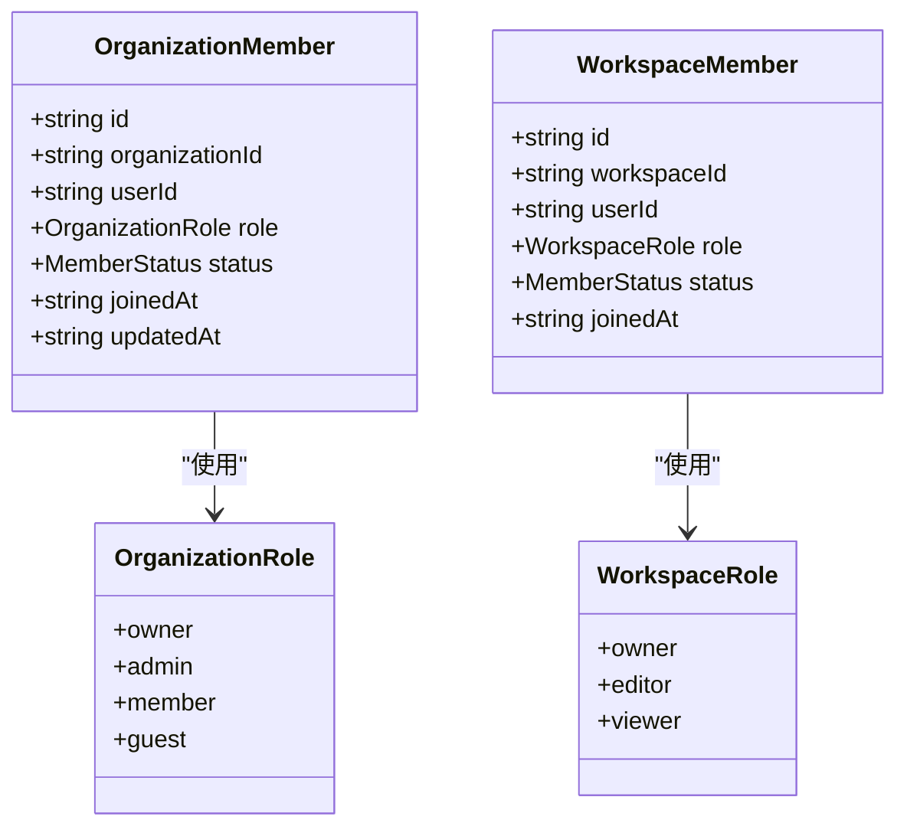
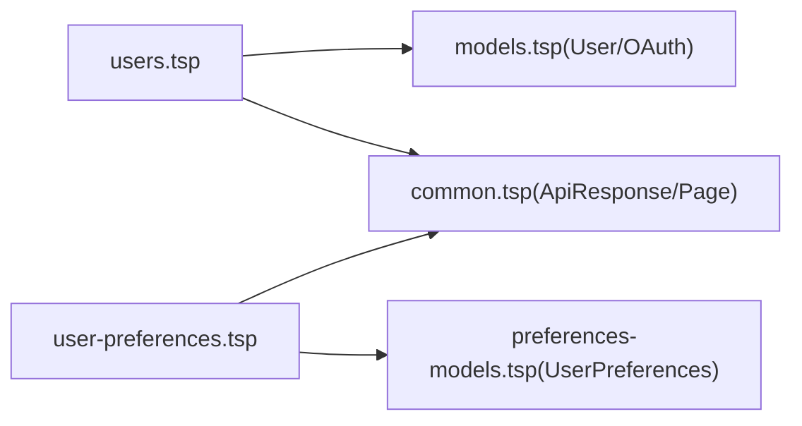

# 用户管理

<cite>
**本文引用的文件**
- [users.tsp](file://api/tenant/users.tsp)
- [models.tsp](file://api/tenant/models.tsp)
- [common.tsp](file://api/shared/common.tsp)
- [user-preferences.tsp](file://api/preferences/user-preferences.tsp)
- [preferences-models.tsp](file://api/preferences/models.tsp)
- [AUTH_MODULES_OVERVIEW.md](file://api/auth/AUTH_MODULES_OVERVIEW.md)
- [best-practices.md](file://docs-src/guides/best-practices.md)
</cite>

## 目录
1. [简介](#简介)
2. [项目结构](#项目结构)
3. [核心组件](#核心组件)
4. [架构总览](#架构总览)
5. [详细组件分析](#详细组件分析)
6. [依赖分析](#依赖分析)
7. [性能考虑](#性能考虑)
8. [故障排查指南](#故障排查指南)
9. [结论](#结论)
10. [附录](#附录)

## 简介
本章节面向“用户管理”功能，系统化阐述用户模型（User）的设计要点、用户API（users.tsp）能力边界、OAuth绑定/解绑流程、用户状态流转与跨工作区权限继承逻辑，并提供实际使用示例与隐私与性能优化建议。读者无需深入技术背景即可理解用户管理如何支撑租户体系下的个人资料、组织归属与工作区访问权限。

## 项目结构
用户管理相关的核心文件集中在租户模块与通用类型模块中：
- 租户模块（api/tenant）：用户API与数据模型（用户、组织、工作区、成员关系等）
- 通用类型（api/shared）：统一响应结构、分页、错误码等
- 偏好设置模块（api/preferences）：用户偏好API与模型
- 认证与会话（api/auth）：用户状态、会话安全与模型参考

图表来源
- [users.tsp](file://api/tenant/users.tsp#L1-L268)
- [models.tsp](file://api/tenant/models.tsp#L1-L200)
- [common.tsp](file://api/shared/common.tsp#L150-L210)
- [user-preferences.tsp](file://api/preferences/user-preferences.tsp#L1-L190)
- [preferences-models.tsp](file://api/preferences/models.tsp#L260-L312)
- [AUTH_MODULES_OVERVIEW.md](file://api/auth/AUTH_MODULES_OVERVIEW.md#L455-L480)

章节来源
- [users.tsp](file://api/tenant/users.tsp#L1-L268)
- [models.tsp](file://api/tenant/models.tsp#L1-L200)
- [common.tsp](file://api/shared/common.tsp#L150-L210)
- [user-preferences.tsp](file://api/preferences/user-preferences.tsp#L1-L190)
- [preferences-models.tsp](file://api/preferences/models.tsp#L260-L312)
- [AUTH_MODULES_OVERVIEW.md](file://api/auth/AUTH_MODULES_OVERVIEW.md#L455-L480)

## 核心组件
- 用户模型（User）
  - 唯一标识：id
  - 登录标识：username（可选）、email（主标识）
  - 验证状态：emailVerified
  - 展示信息：displayName、avatarUrl
  - 区域偏好：locale、timezone
  - 状态：status（active/suspended/deleted）
  - 默认组织/工作区：defaultOrganizationId、defaultWorkspaceId
  - 时间戳：createdAt、updatedAt、lastLoginAt
- 用户状态枚举（UserStatus）
  - active、suspended、deleted
- OAuth连接模型（OAuthConnection）
  - provider、providerId、providerEmail、linkedAt
- OAuth提供商枚举（OAuthProvider）
  - google、github、wechat、dingtalk、feishu
- 用户API（users.tsp）
  - 获取当前用户：GET /api/v1/users/me
  - 更新当前用户：PATCH /api/v1/users/me
  - 绑定OAuth：POST /api/v1/users/me/oauth/{provider}
  - 解绑OAuth：DELETE /api/v1/users/me/oauth/{provider}
  - 列出OAuth连接：GET /api/v1/users/me/oauth
  - 列出用户组织：GET /api/v1/users/me/organizations?page=&pageSize=
- 偏好设置API（user-preferences.tsp）
  - 获取/更新/重置用户偏好；语言偏好独立接口

章节来源
- [models.tsp](file://api/tenant/models.tsp#L58-L142)
- [models.tsp](file://api/tenant/models.tsp#L27-L49)
- [models.tsp](file://api/tenant/models.tsp#L145-L176)
- [models.tsp](file://api/tenant/models.tsp#L185-L215)
- [users.tsp](file://api/tenant/users.tsp#L117-L267)
- [user-preferences.tsp](file://api/preferences/user-preferences.tsp#L18-L144)

## 架构总览
用户管理围绕“用户主体”展开，通过API暴露用户信息、OAuth绑定、组织列表等能力；同时通过通用响应结构与错误码保证一致性；偏好设置独立模块提供更细粒度的个性化配置。

图表来源
- [users.tsp](file://api/tenant/users.tsp#L133-L160)
- [users.tsp](file://api/tenant/users.tsp#L162-L219)
- [users.tsp](file://api/tenant/users.tsp#L220-L267)
- [user-preferences.tsp](file://api/preferences/user-preferences.tsp#L38-L107)
- [common.tsp](file://api/shared/common.tsp#L153-L177)
- [models.tsp](file://api/tenant/models.tsp#L58-L142)
- [models.tsp](file://api/tenant/models.tsp#L185-L215)
- [preferences-models.tsp](file://api/preferences/models.tsp#L260-L312)

## 详细组件分析

### 用户模型（User）设计
- 唯一标识与登录
  - id：系统内唯一标识
  - username/email：登录凭据（email为主标识）
  - emailVerified：邮箱验证状态
- 展示与偏好
  - displayName、avatarUrl：头像与显示名
  - locale、timezone：语言与时区偏好
- 状态与默认组织/工作区
  - status：用户状态（active/suspended/deleted）
  - defaultOrganizationId、defaultWorkspaceId：默认组织与工作区
- 时间戳
  - createdAt、updatedAt、lastLoginAt：生命周期与登录记录

图表来源
- [models.tsp](file://api/tenant/models.tsp#L58-L142)
- [models.tsp](file://api/tenant/models.tsp#L27-L49)
- [models.tsp](file://api/tenant/models.tsp#L145-L176)
- [models.tsp](file://api/tenant/models.tsp#L185-L215)

章节来源
- [models.tsp](file://api/tenant/models.tsp#L58-L142)
- [models.tsp](file://api/tenant/models.tsp#L27-L49)
- [models.tsp](file://api/tenant/models.tsp#L145-L176)
- [models.tsp](file://api/tenant/models.tsp#L185-L215)

### 用户API（users.tsp）能力
- 获取当前用户：返回完整的User对象，包含默认组织与工作区信息
- 更新当前用户：支持部分更新，常见字段包括displayName、avatarUrl、locale、timezone、defaultOrganizationId、defaultWorkspaceId
- OAuth绑定/解绑：
  - 绑定：传入authorizationCode与可选redirectUri，返回OAuthConnection
  - 解绑：按provider路径删除绑定
  - 列出连接：返回OAuthConnection数组
- 列出用户组织：返回用户在组织中的成员关系及角色信息，支持分页

图表来源
- [users.tsp](file://api/tenant/users.tsp#L133-L160)
- [users.tsp](file://api/tenant/users.tsp#L162-L219)
- [users.tsp](file://api/tenant/users.tsp#L220-L267)

章节来源
- [users.tsp](file://api/tenant/users.tsp#L117-L267)

### OAuth绑定/解绑流程
- 绑定流程
  - 客户端引导用户跳转至第三方OAuth授权页面
  - 用户授权后回调携带authorizationCode
  - 客户端将authorizationCode与可选redirectUri提交给后端
  - 后端完成第三方验证并创建OAuthConnection
- 解绑流程
  - 客户端发起删除请求，移除该provider的绑定记录

图表来源
- [users.tsp](file://api/tenant/users.tsp#L162-L219)
- [models.tsp](file://api/tenant/models.tsp#L185-L215)

章节来源
- [users.tsp](file://api/tenant/users.tsp#L162-L219)
- [models.tsp](file://api/tenant/models.tsp#L185-L215)

### 用户状态流转机制
- 用户状态枚举：active、suspended、deleted
- 状态影响
  - active：正常访问
  - suspended：暂停访问，可能影响组织/工作区权限
  - deleted：删除，通常不可逆且清理相关数据
- 实际落地建议
  - 系统应基于User.status在鉴权层拦截请求
  - 对suspended用户限制关键操作（如修改密码、删除组织等）

章节来源
- [models.tsp](file://api/tenant/models.tsp#L27-L49)

### 跨工作区权限继承逻辑
- 用户在组织内的角色（owner/admin/member/guest）决定其在组织下各工作区的初始权限
- 默认情况下，用户在新工作区继承组织成员角色；具体权限由工作区成员模型（WorkspaceMember）与角色枚举（WorkspaceRole）共同决定
- 若用户在组织中被暂停或移除，其在工作区的权限应同步失效或降级

图表来源
- [models.tsp](file://api/tenant/models.tsp#L444-L511)
- [models.tsp](file://api/tenant/models.tsp#L662-L718)

章节来源
- [models.tsp](file://api/tenant/models.tsp#L444-L511)
- [models.tsp](file://api/tenant/models.tsp#L662-L718)

### 偏好设置（UserPreferences）
- 获取/更新/重置偏好：支持按section获取或部分更新
- 语言偏好：独立的GET/PUT接口，便于前端快速切换语言
- 偏好模型包含通用、外观、地区、辅助功能、隐私等部分

章节来源
- [user-preferences.tsp](file://api/preferences/user-preferences.tsp#L18-L144)
- [preferences-models.tsp](file://api/preferences/models.tsp#L260-L312)

## 依赖分析
- 用户API依赖
  - 数据模型：User、OAuthConnection、OAuthProvider、UserStatus
  - 通用响应：ApiResponse<T>、Page<T>、ErrorCode
- 偏好API依赖
  - 偏好模型：UserPreferences、RegionalPreferences、PrivacyPreferences等
  - 通用响应：ApiResponse<T>

图表来源
- [users.tsp](file://api/tenant/users.tsp#L117-L267)
- [models.tsp](file://api/tenant/models.tsp#L58-L142)
- [models.tsp](file://api/tenant/models.tsp#L185-L215)
- [common.tsp](file://api/shared/common.tsp#L153-L177)
- [user-preferences.tsp](file://api/preferences/user-preferences.tsp#L18-L144)
- [preferences-models.tsp](file://api/preferences/models.tsp#L260-L312)

章节来源
- [users.tsp](file://api/tenant/users.tsp#L117-L267)
- [models.tsp](file://api/tenant/models.tsp#L58-L142)
- [models.tsp](file://api/tenant/models.tsp#L185-L215)
- [common.tsp](file://api/shared/common.tsp#L153-L177)
- [user-preferences.tsp](file://api/preferences/user-preferences.tsp#L18-L144)
- [preferences-models.tsp](file://api/preferences/models.tsp#L260-L312)

## 性能考虑
- 缓存用户基本信息
  - 建议在网关或边缘层缓存用户基础信息（如displayName、avatarUrl、locale、timezone），TTL可设为分钟级，降低数据库查询压力
  - 参考最佳实践中的缓存策略示例
- 分页与按需加载
  - 列出组织/工作区时使用分页参数，避免一次性拉取大量数据
  - 偏好设置按section获取，减少冗余载荷
- 会话与并发
  - 参考认证模块的会话安全与并发限制建议，避免同一用户多处并发导致的资源竞争

章节来源
- [best-practices.md](file://docs-src/guides/best-practices.md#L255-L279)
- [users.tsp](file://api/tenant/users.tsp#L251-L267)
- [user-preferences.tsp](file://api/preferences/user-preferences.tsp#L38-L107)
- [AUTH_MODULES_OVERVIEW.md](file://api/auth/AUTH_MODULES_OVERVIEW.md#L445-L451)

## 故障排查指南
- 常见错误码
  - USER_NOT_FOUND、USER_ALREADY_EXISTS、EMAIL_ALREADY_USED
  - OAUTH_PROVIDER_NOT_SUPPORTED、OAUTH_PROVIDER_ALREADY_LINKED、OAUTH_PROVIDER_NOT_LINKED
- OAuth绑定失败排查
  - 确认authorizationCode有效且未过期
  - 检查redirectUri与注册配置一致
  - 确认用户未被暂停或删除
- 偏好设置更新失败
  - 检查section参数是否合法
  - 确认字段类型与范围符合模型定义

章节来源
- [common.tsp](file://api/shared/common.tsp#L80-L152)
- [users.tsp](file://api/tenant/users.tsp#L162-L219)
- [user-preferences.tsp](file://api/preferences/user-preferences.tsp#L38-L107)

## 结论
用户管理以User为核心，结合OAuth绑定、组织与工作区成员关系，形成完整的身份与权限体系。通过统一的响应结构与错误码，确保前后端交互的一致性与可观测性。建议在生产环境中实施缓存、分页与按需加载策略，并严格遵循会话安全与最小权限原则，以提升性能与安全性。

## 附录

### 实际使用示例（路径指引）
- 更新个人资料
  - 路径：PATCH /api/v1/users/me
  - 参考：[users.tsp](file://api/tenant/users.tsp#L157-L160)
- 绑定GitHub账号
  - 路径：POST /api/v1/users/me/oauth/github
  - 参考：[users.tsp](file://api/tenant/users.tsp#L179-L195)
- 解绑OAuth提供商
  - 路径：DELETE /api/v1/users/me/oauth/{provider}
  - 参考：[users.tsp](file://api/tenant/users.tsp#L209-L219)
- 切换默认组织
  - 路径：PATCH /api/v1/users/me（defaultOrganizationId）
  - 参考：[users.tsp](file://api/tenant/users.tsp#L157-L160)，[models.tsp](file://api/tenant/models.tsp#L113-L124)
- 获取语言偏好
  - 路径：GET /api/v1/users/me/preferences/language
  - 参考：[user-preferences.tsp](file://api/preferences/user-preferences.tsp#L146-L162)