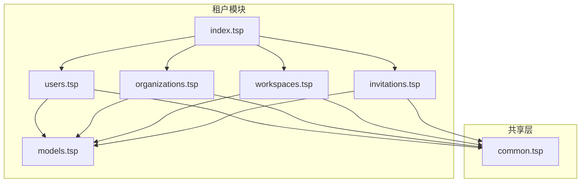
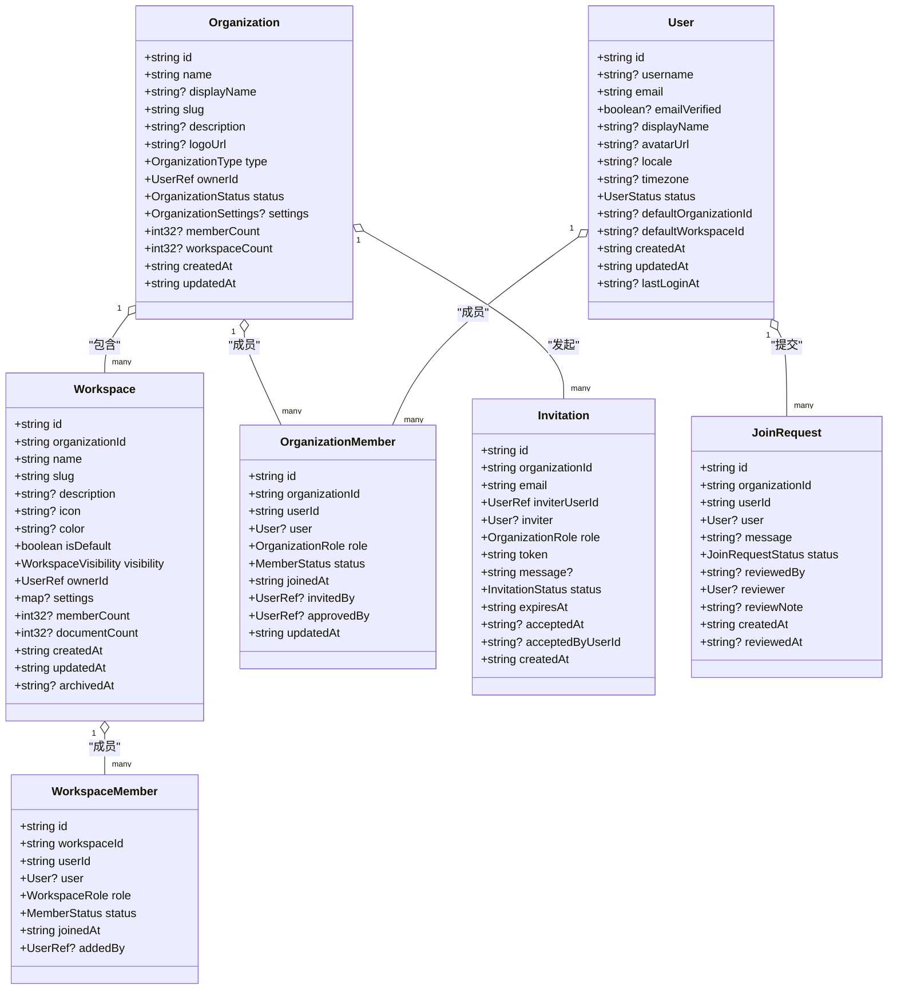
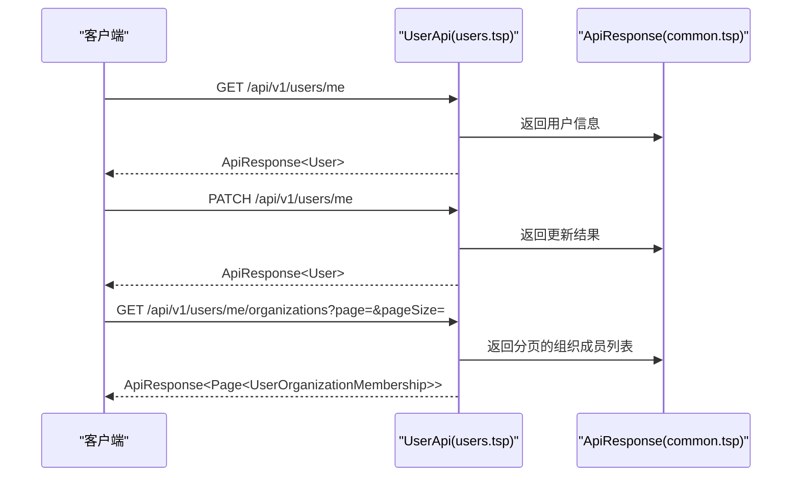
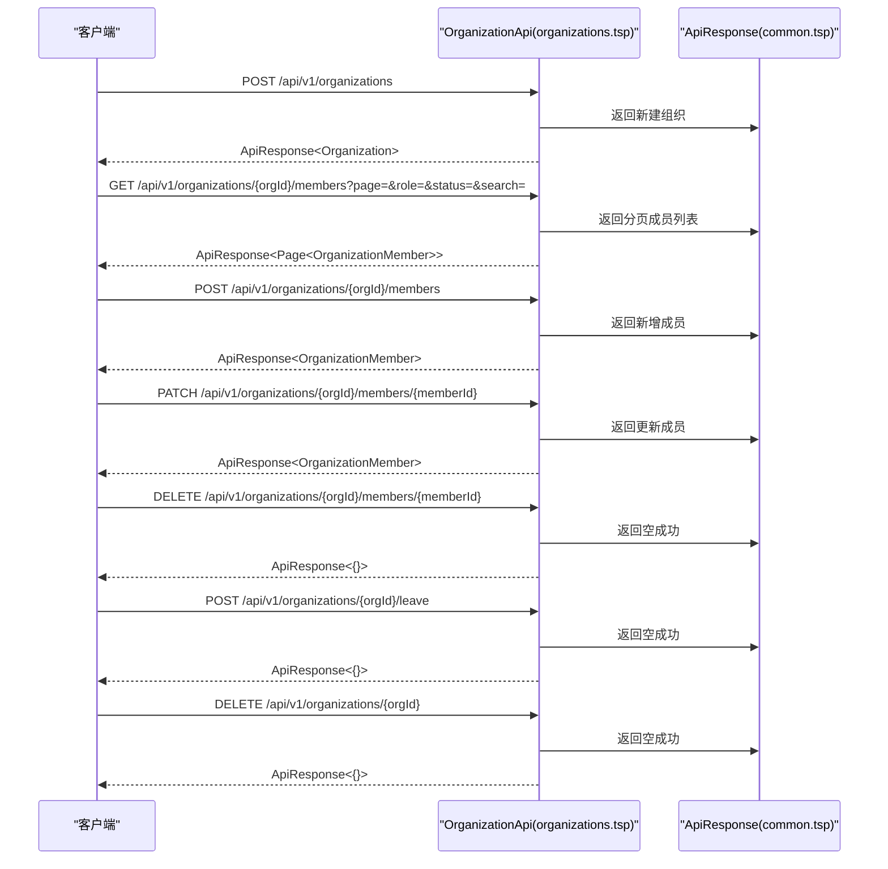
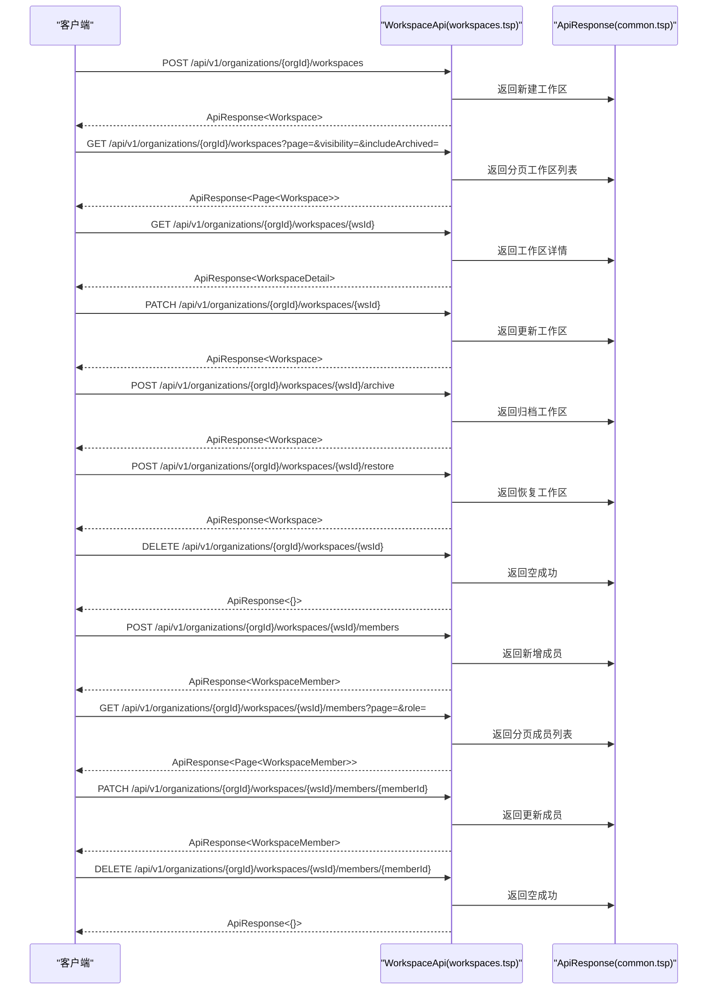
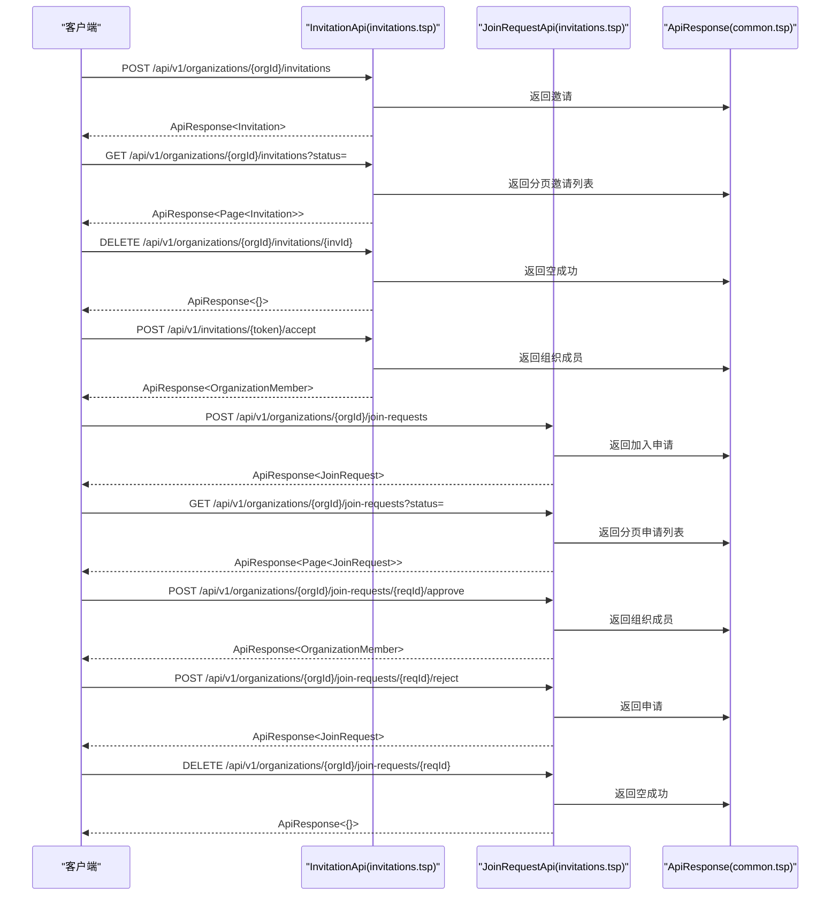
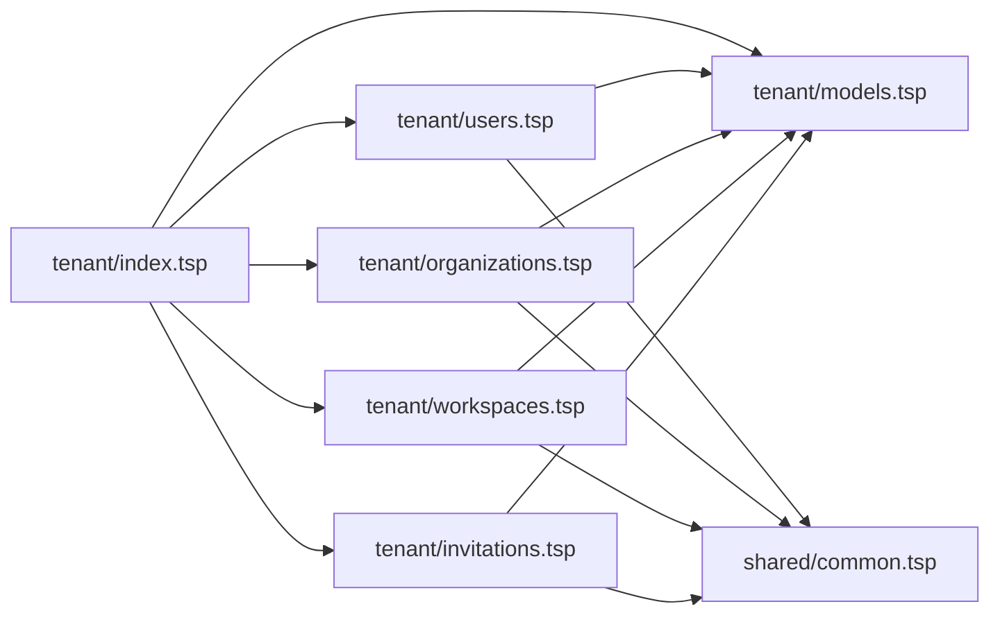

# 租户管理

<cite>
**本文引用的文件**
- [index.tsp](file://api/tenant/index.tsp)
- [users.tsp](file://api/tenant/users.tsp)
- [models.tsp](file://api/tenant/models.tsp)
- [organizations.tsp](file://api/tenant/organizations.tsp)
- [workspaces.tsp](file://api/tenant/workspaces.tsp)
- [invitations.tsp](file://api/tenant/invitations.tsp)
- [common.tsp](file://api/shared/common.tsp)
- [AUTH_MODULES_OVERVIEW.md](file://api/auth/AUTH_MODULES_OVERVIEW.md)
- [data.tsp](file://api/document/core/data.tsp)
- [index.tsp](file://api/document/index.tsp)
</cite>

## 目录
1. [简介](#简介)
2. [项目结构](#项目结构)
3. [核心组件](#核心组件)
4. [架构总览](#架构总览)
5. [详细组件分析](#详细组件分析)
6. [依赖关系分析](#依赖关系分析)
7. [性能考虑](#性能考虑)
8. [故障排查指南](#故障排查指南)
9. [结论](#结论)
10. [附录](#附录)

## 简介
本文件系统性地文档化多租户管理能力，围绕“组织（Organization）—工作区（Workspace）—用户（User）—邀请（Invitation）”的租户边界与协作模型展开，覆盖以下主题：
- 多租户架构设计原理与数据边界隔离
- 用户管理 API（users.tsp）：用户信息、OAuth 绑定、组织成员列表
- 组织管理 API（organizations.tsp）：创建、配置、成员管理、状态与策略
- 工作区管理 API（workspaces.tsp）：创建、成员管理、可见性与归档
- 邀请系统 API（invitations.tsp）：邀请创建、接受/拒绝、加入申请与审批
- 核心数据模型（models.tsp）：Tenant、User、Organization、Workspace 的关系与约束
- 典型使用场景：企业客户注册组织、管理员邀请团队、跨工作区迁移文档
- 安全与性能：基于租户的隔离与索引优化建议

## 项目结构
租户模块位于 api/tenant，采用按功能域划分的文件组织方式，统一通过 index.tsp 导入各子模块，便于扩展与维护。

图表来源
- [index.tsp](file://api/tenant/index.tsp#L1-L24)
- [users.tsp](file://api/tenant/users.tsp#L1-L268)
- [models.tsp](file://api/tenant/models.tsp#L1-L120)
- [organizations.tsp](file://api/tenant/organizations.tsp#L1-L60)
- [workspaces.tsp](file://api/tenant/workspaces.tsp#L1-L40)
- [invitations.tsp](file://api/tenant/invitations.tsp#L1-L40)
- [common.tsp](file://api/shared/common.tsp#L1-L40)

章节来源
- [index.tsp](file://api/tenant/index.tsp#L1-L24)

## 核心组件
- 用户（User）：系统最基础的身份实体，支持多种登录方式；具备状态、偏好、默认组织与工作区等属性。
- 组织（Organization）：用户协作的基本单元，包含类型、状态、设置与成员计数等；创建者自动成为 owner，并默认创建一个默认工作区。
- 工作区（Workspace）：承载业务操作的容器，支持可见性（组织内公开/仅成员）、默认工作区标记、成员与文档计数、归档状态。
- 邀请（Invitation）：组织邀请与加入申请的生命周期管理，支持状态机、过期时间、角色授予与接受流程。
- 成员关系（OrganizationMember / WorkspaceMember）：用户在组织/工作区内的角色与状态，支撑细粒度权限控制。

章节来源
- [models.tsp](file://api/tenant/models.tsp#L58-L142)
- [models.tsp](file://api/tenant/models.tsp#L303-L394)
- [models.tsp](file://api/tenant/models.tsp#L533-L636)
- [models.tsp](file://api/tenant/models.tsp#L751-L836)
- [models.tsp](file://api/tenant/models.tsp#L868-L942)

## 架构总览
租户管理以“组织”为数据边界，工作区在组织内进一步细分协作域。用户通过组织与工作区建立成员关系，形成“组织级策略 + 工作区级权限”的双层控制。

图表来源
- [models.tsp](file://api/tenant/models.tsp#L58-L142)
- [models.tsp](file://api/tenant/models.tsp#L303-L394)
- [models.tsp](file://api/tenant/models.tsp#L533-L636)
- [models.tsp](file://api/tenant/models.tsp#L751-L836)
- [models.tsp](file://api/tenant/models.tsp#L868-L942)

## 详细组件分析

### 用户管理（users.tsp）
- 功能要点
  - 获取/更新当前用户信息（含默认组织与工作区）
  - OAuth 绑定/解绑与列表
  - 列出用户加入的组织（含角色与状态）
- 关键模型
  - UpdateUserRequest：更新显示名、头像、语言、时区、默认组织/工作区
  - BindOAuthRequest：授权码与重定向 URI
  - UserOrganizationMembership：组织成员关系聚合
- 权限与边界
  - 所有接口均作用于当前登录用户，确保最小暴露面
  - 默认组织/工作区用于快速上下文切换，但不改变跨租户隔离

图表来源
- [users.tsp](file://api/tenant/users.tsp#L133-L267)
- [common.tsp](file://api/shared/common.tsp#L153-L177)

章节来源
- [users.tsp](file://api/tenant/users.tsp#L1-L268)

### 组织管理（organizations.tsp）
- 功能要点
  - 创建组织：创建者自动成为 owner，并默认创建一个默认工作区
  - 更新/删除组织：软删除（归档），仅 owner 可删
  - 成员管理：添加/更新/移除成员，离开组织（owner 不可直接离开）
  - 查询成员：支持按角色、状态、关键词过滤
- 关键模型
  - CreateOrganizationRequest/UpdateOrganizationRequest
  - OrganizationDetail：扩展包含当前用户角色与所有者信息
  - AddOrganizationMemberRequest/UpdateOrganizationMemberRequest
- 策略与设置
  - OrganizationSettings：公开加入、审批需求、邀请过期天数、默认角色、域名白名单等

图表来源
- [organizations.tsp](file://api/tenant/organizations.tsp#L171-L498)
- [common.tsp](file://api/shared/common.tsp#L153-L177)

章节来源
- [organizations.tsp](file://api/tenant/organizations.tsp#L1-L498)

### 工作区管理（workspaces.tsp）
- 功能要点
  - 创建/列出/获取/更新工作区
  - 归档/恢复/删除工作区（软删除）
  - 成员管理：添加/获取/更新/移除成员（需组织成员）
  - 可见性控制：public/private
- 关键模型
  - CreateWorkspaceRequest/UpdateWorkspaceRequest
  - WorkspaceDetail：扩展包含当前用户角色与负责人
  - AddWorkspaceMemberRequest/UpdateWorkspaceMemberRequest

图表来源
- [workspaces.tsp](file://api/tenant/workspaces.tsp#L171-L631)
- [common.tsp](file://api/shared/common.tsp#L153-L177)

章节来源
- [workspaces.tsp](file://api/tenant/workspaces.tsp#L1-L631)

### 邀请系统（invitations.tsp）
- 功能要点
  - 组织邀请：创建、列表、撤销、接受、拒绝
  - 加入申请：提交、列表、审批（批准/拒绝）、取消
- 关键模型
  - CreateInvitationRequest：邮箱、角色、消息、有效期
  - CreateJoinRequestRequest/ApproveJoinRequestRequest/RejectJoinRequestRequest
  - Invitation/JoinRequest：状态、过期、审核记录等

图表来源
- [invitations.tsp](file://api/tenant/invitations.tsp#L107-L548)
- [common.tsp](file://api/shared/common.tsp#L153-L177)

章节来源
- [invitations.tsp](file://api/tenant/invitations.tsp#L1-L548)

### 核心数据模型（models.tsp）
- 用户（User）
  - 状态：active/suspended/deleted
  - 偏好：locale/timezone
  - 默认组织/工作区：用于上下文切换
- 组织（Organization）
  - 类型：personal/team/enterprise
  - 状态：active/suspended/archived
  - 设置：allowPublicJoin、requireApproval、inviteExpireDays、defaultRole、allowedDomains
- 工作区（Workspace）
  - 可见性：public/private
  - 默认工作区：isDefault
  - 归档：archivedAt
- 成员关系（OrganizationMember/WorkspaceMember）
  - 角色：owner/admin/member/guest（组织）；owner/editor/viewer（工作区）
  - 状态：active/suspended
- 邀请与加入申请（Invitation/JoinRequest）
  - 状态机：pending/accepted/expired/revoked（邀请）；pending/approved/rejected/cancelled（申请）
  - 过期时间：expiresAt
  - 审核记录：reviewedBy/reviewNote

章节来源
- [models.tsp](file://api/tenant/models.tsp#L27-L142)
- [models.tsp](file://api/tenant/models.tsp#L218-L394)
- [models.tsp](file://api/tenant/models.tsp#L513-L636)
- [models.tsp](file://api/tenant/models.tsp#L719-L836)
- [models.tsp](file://api/tenant/models.tsp#L838-L942)

## 依赖关系分析
- 模块导入
  - index.tsp 统一导入 models、users、organizations、workspaces、invitations
  - 各 API 模块依赖 models.tsp 定义的核心数据结构
  - 所有 API 响应统一使用 ApiResponse<T> 与分页 Page<T>
- 外部依赖
  - shared/common.tsp 提供统一响应格式、错误码、查询与过滤模型
  - 文档模块（document/index.tsp）与租户模块协同，支持组织/工作区级文档能力

图表来源
- [index.tsp](file://api/tenant/index.tsp#L1-L24)
- [users.tsp](file://api/tenant/users.tsp#L1-L20)
- [organizations.tsp](file://api/tenant/organizations.tsp#L1-L20)
- [workspaces.tsp](file://api/tenant/workspaces.tsp#L1-L20)
- [invitations.tsp](file://api/tenant/invitations.tsp#L1-L20)
- [common.tsp](file://api/shared/common.tsp#L1-L40)

章节来源
- [index.tsp](file://api/tenant/index.tsp#L1-L24)
- [common.tsp](file://api/shared/common.tsp#L1-L200)

## 性能考虑
- 分页与过滤
  - 列表接口普遍支持分页与过滤，建议合理设置 pageSize 并使用服务端过滤减少网络与计算开销
- 查询模型
  - 通用查询模型支持嵌套过滤、排序、分组与聚合，适合复杂检索场景
- 索引与分区建议（基于仓库提供的用户表结构）
  - 用户表存在 email、phone 等索引，建议在组织/工作区/成员表中对常用过滤字段（如 organizationId、userId、role、status、createdAt）建立复合索引
  - 对邀请/申请表的 email、token、organizationId 建立索引，提升邀请接受与查询效率
  - 对文档表（与租户协同）建议按 organizationId/workspaceId 建立分区或分表策略，结合查询模型进行高效检索

章节来源
- [common.tsp](file://api/shared/common.tsp#L197-L331)
- [data.tsp](file://api/document/core/data.tsp#L319-L438)
- [AUTH_MODULES_OVERVIEW.md](file://api/auth/AUTH_MODULES_OVERVIEW.md#L456-L479)

## 故障排查指南
- 常见错误码
  - 用户相关：USER_NOT_FOUND、EMAIL_ALREADY_USED、OAUTH_PROVIDER_NOT_SUPPORTED 等
  - 组织相关：ORG_NOT_FOUND、ORG_SLUG_ALREADY_EXISTS、ORG_PERMISSION_DENIED、ORG_ALREADY_MEMBER、ORG_NOT_MEMBER、ORG_CANNOT_LEAVE_AS_OWNER 等
  - 工作区相关：WORKSPACE_NOT_FOUND、WORKSPACE_SLUG_ALREADY_EXISTS、WORKSPACE_PERMISSION_DENIED、WORKSPACE_NOT_MEMBER、WORKSPACE_MEMBER_NOT_FOUND 等
  - 邀请相关：INVITATION_NOT_FOUND、INVITATION_EXPIRED、INVITATION_ALREADY_ACCEPTED、INVITATION_EMAIL_MISMATCH、INVITATION_ALREADY_REVOKED 等
  - 加入申请相关：JOIN_REQUEST_NOT_FOUND、JOIN_REQUEST_ALREADY_EXISTS、JOIN_REQUEST_ALREADY_PROCESSED 等
- 排查步骤
  - 确认当前用户身份与目标资源的成员关系
  - 校验组织/工作区状态（active/archived）与权限（owner/admin/member/guest）
  - 检查邀请/申请状态与时效性
  - 使用分页与过滤参数缩小范围定位问题

章节来源
- [common.tsp](file://api/shared/common.tsp#L80-L151)

## 结论
本租户管理模块以“组织”为数据边界，通过“工作区”细化协作域，配合“邀请/加入申请”实现开放与可控的成员引入机制。统一的响应模型与错误码体系提升了可观测性与一致性。建议在生产环境中：
- 强化基于租户的访问控制与审计日志
- 为高频查询字段建立索引与分区
- 使用结构化查询模型与分页策略优化性能
- 严格遵循邀请/申请的状态机与过期策略，保障数据一致性

## 附录

### 典型使用场景
- 企业客户注册新组织
  - 用户通过创建组织接口完成注册，系统自动为其分配 owner 角色并创建默认工作区
  - 章节来源
    - [organizations.tsp](file://api/tenant/organizations.tsp#L180-L200)
- 管理员邀请团队成员
  - 管理员通过邀请接口创建邀请，被邀请人使用邀请令牌接受，系统根据组织设置自动分配角色
  - 章节来源
    - [invitations.tsp](file://api/tenant/invitations.tsp#L133-L149)
    - [invitations.tsp](file://api/tenant/invitations.tsp#L252-L275)
- 在工作区间迁移文档资源
  - 将文档从一个工作区移动到另一个工作区，需确保源/目标工作区成员权限与可见性满足要求
  - 章节来源
    - [workspaces.tsp](file://api/tenant/workspaces.tsp#L263-L292)
    - [workspaces.tsp](file://api/tenant/workspaces.tsp#L473-L512)

### 数据隔离与安全
- 多租户隔离
  - 组织作为边界，所有组织内资源（工作区、成员、邀请等）均与 organizationId 强关联
  - 用户仅能访问其成员身份所及的组织与工作区
- 安全建议
  - 严格校验路径参数（organizationId、workspaceId、memberId、invitationId、requestId）
  - 对敏感操作（删除组织/工作区、移除成员、撤销邀请）增加二次确认与审计
  - 对邀请令牌与加入申请进行时效控制与状态校验

章节来源
- [organizations.tsp](file://api/tenant/organizations.tsp#L285-L338)
- [workspaces.tsp](file://api/tenant/workspaces.tsp#L424-L471)
- [invitations.tsp](file://api/tenant/invitations.tsp#L235-L251)