# 使用量与配额监控

<cite>
**本文引用的文件**
- [usage.tsp](file://api/billing/usage.tsp)
- [models.tsp](file://api/billing/models.tsp)
- [common.tsp](file://api/shared/common.tsp)
- [index.tsp](file://api/billing/index.tsp)
- [plans.tsp](file://api/billing/plans.tsp)
- [subscriptions.tsp](file://api/billing/subscriptions.tsp)
- [invoices.tsp](file://api/billing/invoices.tsp)
- [payments.tsp](file://api/billing/payments.tsp)
</cite>

## 目录
1. [简介](#简介)
2. [项目结构](#项目结构)
3. [核心组件](#核心组件)
4. [架构概览](#架构概览)
5. [详细组件分析](#详细组件分析)
6. [依赖关系分析](#依赖关系分析)
7. [性能考量](#性能考量)
8. [故障排查指南](#故障排查指南)
9. [结论](#结论)
10. [附录](#附录)

## 简介
本文件面向使用 NexusBook API 的开发者与运维人员，系统化梳理“使用量跟踪与配额管理”的接口与数据模型，重点覆盖以下内容：
- 三个核心端点：getUsage、getUsageHistory、getQuotaWarnings 的语义、参数与返回结构
- OrganizationUsage 数据模型各指标的含义与业务背景
- getUsageHistory 的灵活查询能力：按 hour/day/month 粒度分析任意 MetricType 指标
- 配额警告系统工作机制：阈值检测与预警级别
- 使用量数据与计费系统的集成路径：订阅计划、账单与按量计费
- 异常使用模式（如突增）的监控与处置建议

## 项目结构
使用量与配额相关能力位于 billing 模块，核心文件如下：
- usage.tsp：定义使用量与配额相关的三个端点
- models.tsp：定义 MetricType、QuotaSeverity、OrganizationUsage、UsageMetric、UsageDataPoint、QuotaWarning 等数据模型
- common.tsp：定义 ApiResponse 统一响应结构
- index.tsp：聚合 billing 模块的子模块
- 计费与订阅相关接口：plans.tsp、subscriptions.tsp、invoices.tsp、payments.tsp（用于理解配额与计费的关系）

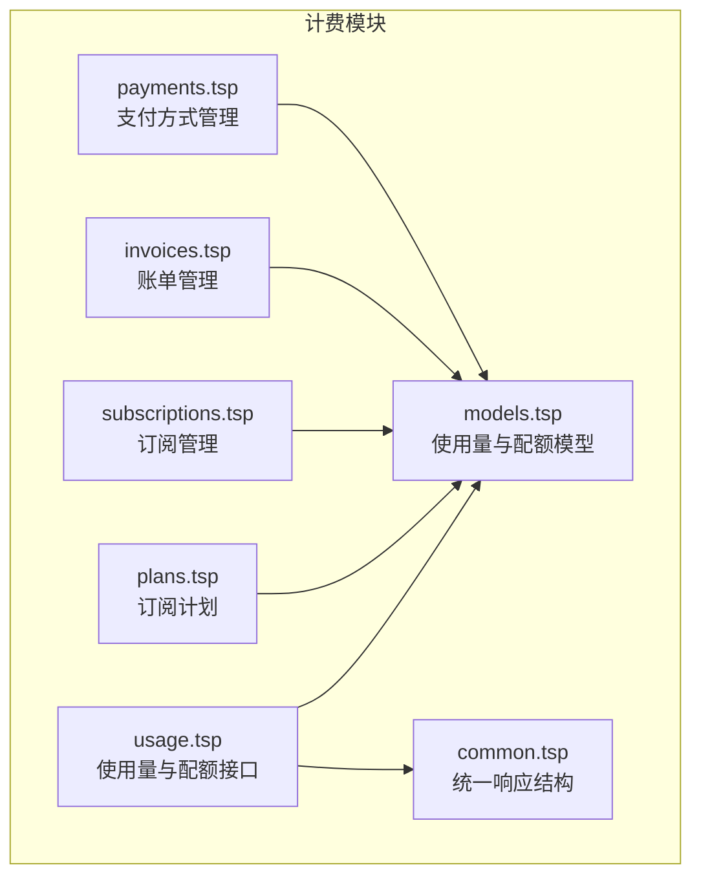

**图表来源**
- [usage.tsp](file://api/billing/usage.tsp#L1-L68)
- [models.tsp](file://api/billing/models.tsp#L1-L444)
- [common.tsp](file://api/shared/common.tsp#L1-L177)
- [index.tsp](file://api/billing/index.tsp#L1-L11)
- [plans.tsp](file://api/billing/plans.tsp#L1-L41)
- [subscriptions.tsp](file://api/billing/subscriptions.tsp#L1-L107)
- [invoices.tsp](file://api/billing/invoices.tsp#L1-L76)
- [payments.tsp](file://api/billing/payments.tsp#L1-L75)

**章节来源**
- [usage.tsp](file://api/billing/usage.tsp#L1-L68)
- [models.tsp](file://api/billing/models.tsp#L1-L444)
- [common.tsp](file://api/shared/common.tsp#L1-L177)
- [index.tsp](file://api/billing/index.tsp#L1-L11)

## 核心组件
- 使用量接口（UsageApi）
  - getUsage：获取组织当前使用量
  - getUsageHistory：获取使用量历史趋势（支持按小时/天/月粒度）
  - getQuotaWarnings：获取配额警告列表
- 数据模型
  - MetricType：指标类型枚举（成员数、工作区数、文档数、存储空间、API 调用、实时会话）
  - QuotaSeverity：配额警告严重程度（warning/critical）
  - OrganizationUsage：组织使用量快照，包含各指标的 UsageMetric
  - UsageMetric：指标当前值、配额上限、百分比、是否超配额
  - UsageDataPoint：时间序列数据点（timestamp, value）
  - QuotaWarning：配额警告条目（指标类型、当前值、配额、百分比、严重程度、消息）

**章节来源**
- [usage.tsp](file://api/billing/usage.tsp#L17-L67)
- [models.tsp](file://api/billing/models.tsp#L105-L119)
- [models.tsp](file://api/billing/models.tsp#L121-L128)
- [models.tsp](file://api/billing/models.tsp#L367-L414)
- [models.tsp](file://api/billing/models.tsp#L415-L423)
- [models.tsp](file://api/billing/models.tsp#L424-L444)

## 架构概览
使用量与配额监控的典型调用链路如下：
- 客户端调用 getUsage 获取当前使用量
- 客户端调用 getUsageHistory 获取历史趋势，按需选择粒度（hour/day/month）
- 客户端调用 getQuotaWarnings 获取配额预警
- 计费侧通过订阅计划（SubscriptionPlan）与配额（PlanQuota）决定阈值与计费边界；账单（Invoice）与支付（PaymentMethod）用于结算

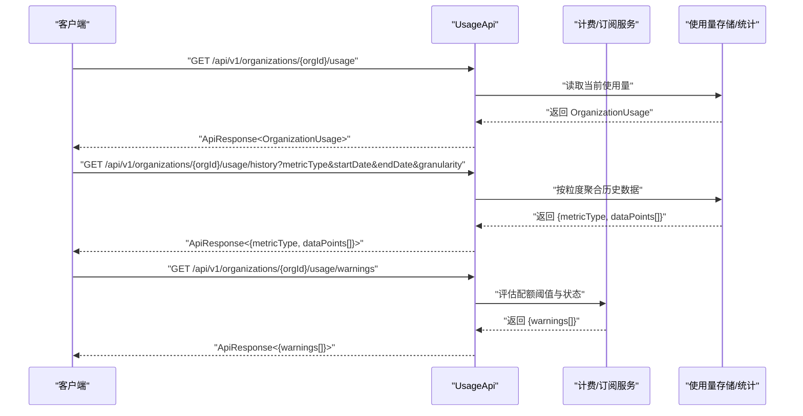

**图表来源**
- [usage.tsp](file://api/billing/usage.tsp#L17-L67)
- [models.tsp](file://api/billing/models.tsp#L367-L444)

## 详细组件分析

### getUsage：获取当前使用量
- 路径：/api/v1/organizations/{organizationId}/usage
- 方法：GET
- 输入：organizationId（路径参数）
- 输出：ApiResponse<OrganizationUsage>
- 用途：返回组织在某个统计周期内的当前使用量快照，包含各指标的 current、limit、percentage、isOverQuota

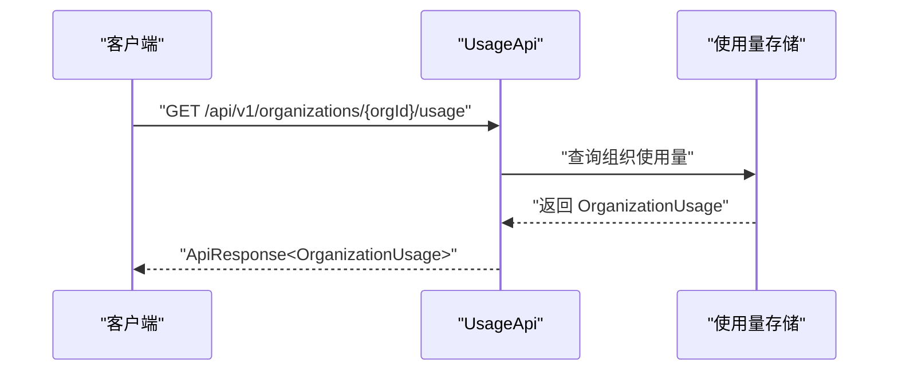

**图表来源**
- [usage.tsp](file://api/billing/usage.tsp#L24-L28)
- [models.tsp](file://api/billing/models.tsp#L382-L413)

**章节来源**
- [usage.tsp](file://api/billing/usage.tsp#L24-L28)
- [models.tsp](file://api/billing/models.tsp#L382-L413)

### getUsageHistory：获取历史趋势
- 路径：/api/v1/organizations/{organizationId}/usage/history
- 方法：GET
- 输入：
  - organizationId（路径参数）
  - metricType（查询参数，MetricType）
  - startDate（查询参数，字符串）
  - endDate（查询参数，字符串）
  - granularity（查询参数，"hour"|"day"|"month"，默认 day）
- 输出：ApiResponse<{metricType, dataPoints[]}>
- 用途：按指定粒度返回某指标的时间序列数据点，便于生成趋势图

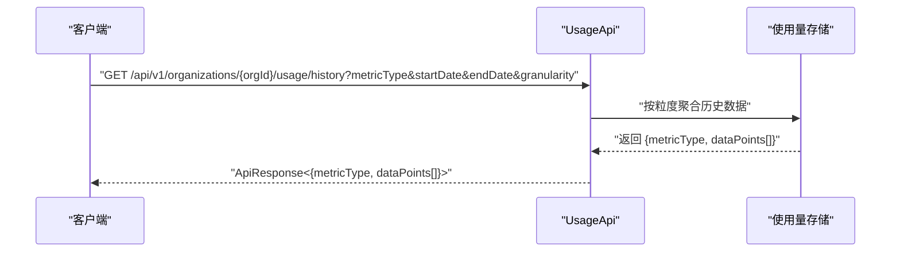

**图表来源**
- [usage.tsp](file://api/billing/usage.tsp#L41-L52)
- [models.tsp](file://api/billing/models.tsp#L415-L423)

**章节来源**
- [usage.tsp](file://api/billing/usage.tsp#L41-L52)
- [models.tsp](file://api/billing/models.tsp#L415-L423)

### getQuotaWarnings：获取配额警告
- 路径：/api/v1/organizations/{organizationId}/usage/warnings
- 方法：GET
- 输入：organizationId（路径参数）
- 输出：ApiResponse<{warnings[]}>
- 用途：返回当前组织的配额预警列表，包含指标类型、当前值、配额、百分比、严重程度与消息

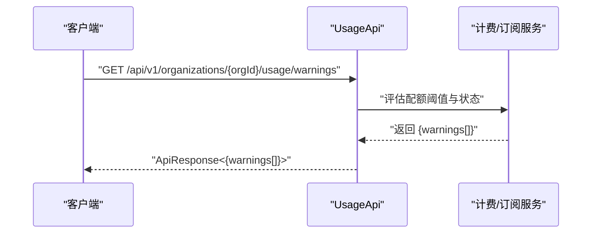

**图表来源**
- [usage.tsp](file://api/billing/usage.tsp#L61-L66)
- [models.tsp](file://api/billing/models.tsp#L424-L444)

**章节来源**
- [usage.tsp](file://api/billing/usage.tsp#L61-L66)
- [models.tsp](file://api/billing/models.tsp#L424-L444)

### OrganizationUsage 数据模型与指标含义
- 组织 ID、统计周期（periodStart/periodEnd）、updatedAt
- 指标维度：
  - members：成员数
  - workspaces：工作区数
  - documents：文档数
  - storage：存储空间（GB）
  - apiCalls：API 调用次数
  - realtimeSessions：实时协作会话数
- 每个指标对应 UsageMetric：
  - current：当前使用量
  - limit：配额上限（-1 表示无限制）
  - percentage：使用百分比
  - isOverQuota：是否超配额

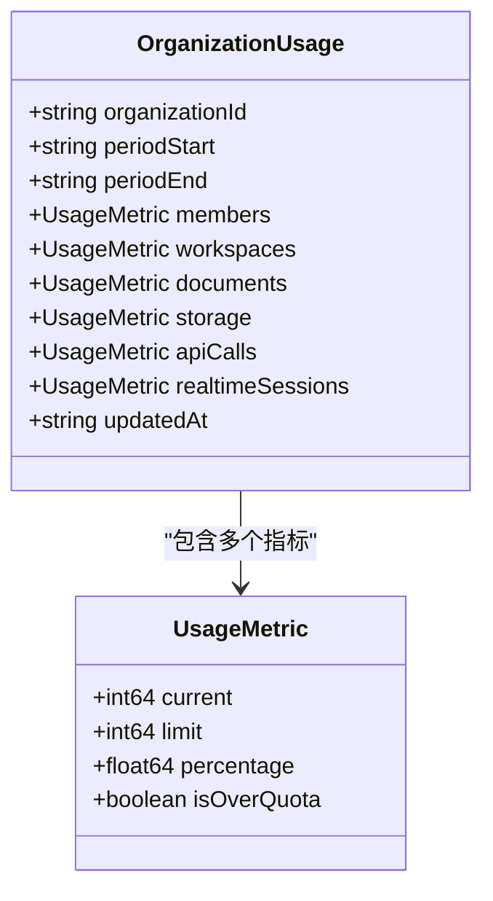

**图表来源**
- [models.tsp](file://api/billing/models.tsp#L382-L413)
- [models.tsp](file://api/billing/models.tsp#L367-L381)

**章节来源**
- [models.tsp](file://api/billing/models.tsp#L367-L413)

### MetricType 与配额阈值
- 指标类型：
  - members、workspaces、documents、storage_gb、api_calls、realtime_sessions
- 配额来源：
  - SubscriptionPlan.features/quotas（PlanQuota）定义各指标上限
  - 配额警告阈值通常基于 limit 与 percentage 计算（例如 80%/95% 作为 warning/critical）

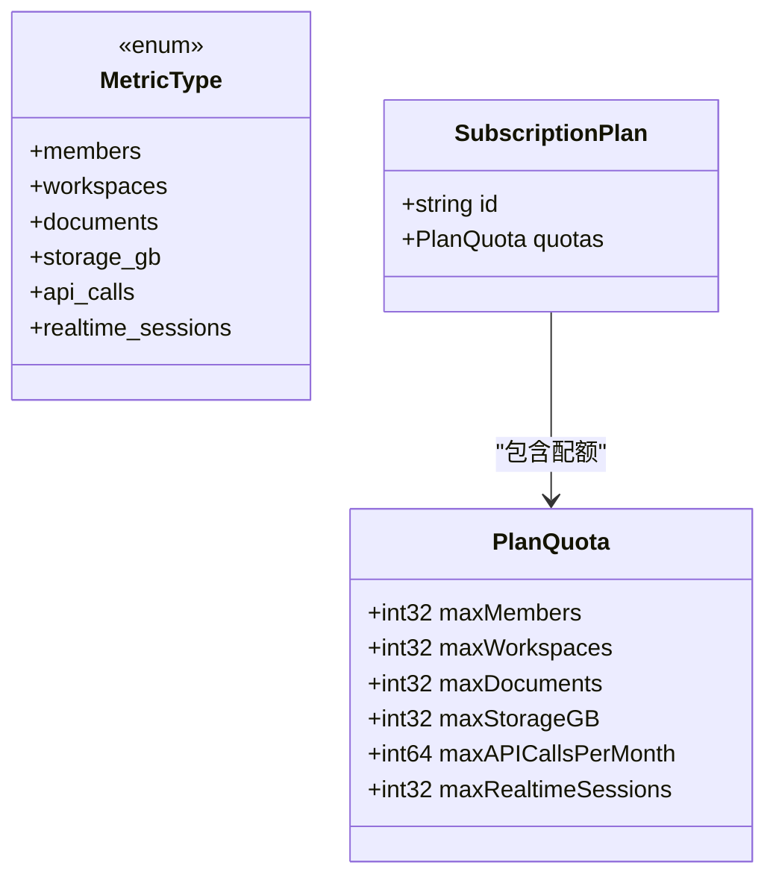

**图表来源**
- [models.tsp](file://api/billing/models.tsp#L105-L119)
- [models.tsp](file://api/billing/models.tsp#L133-L152)
- [models.tsp](file://api/billing/models.tsp#L170-L212)

**章节来源**
- [models.tsp](file://api/billing/models.tsp#L105-L119)
- [models.tsp](file://api/billing/models.tsp#L133-L152)
- [models.tsp](file://api/billing/models.tsp#L170-L212)

### 配额警告系统工作机制
- 配额警告条目（QuotaWarning）包含：
  - metricType：指标类型
  - current、limit、percentage：当前值、配额、百分比
  - severity：warning/critical
  - message：多语言消息
- 阈值检测与预警级别：
  - 常见阈值：percentage ≥ 80%（warning），percentage ≥ 95%（critical）
  - 超配额判断：isOverQuota = true
- 严重程度（QuotaSeverity）：
  - warning：接近配额，建议关注
  - critical：严重超配额，可能触发限流或暂停服务

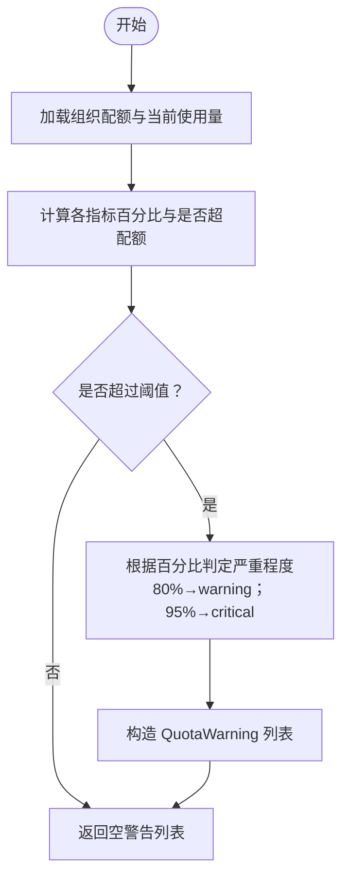

**图表来源**
- [models.tsp](file://api/billing/models.tsp#L121-L128)
- [models.tsp](file://api/billing/models.tsp#L424-L444)
- [models.tsp](file://api/billing/models.tsp#L367-L381)

**章节来源**
- [models.tsp](file://api/billing/models.tsp#L121-L128)
- [models.tsp](file://api/billing/models.tsp#L424-L444)
- [models.tsp](file://api/billing/models.tsp#L367-L381)

### 使用量历史趋势的可视化建议
- 数据点结构：timestamp、value
- 常见可视化：
  - 折线图：横轴为 timestamp，纵轴为 value，展示指标随时间的变化
  - 分面图：按指标类型拆分子图，便于对比不同指标的趋势
  - 带阈值线：在折线图上叠加配额上限或预警阈值线（如 80%/95%）
- 粒度选择：
  - hour：适合短期波动观察
  - day：适合日常趋势分析
  - month：适合长期趋势与预算对比

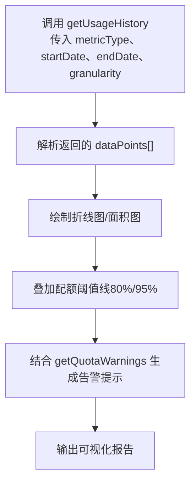

**图表来源**
- [usage.tsp](file://api/billing/usage.tsp#L41-L52)
- [models.tsp](file://api/billing/models.tsp#L415-L423)
- [models.tsp](file://api/billing/models.tsp#L424-L444)

**章节来源**
- [usage.tsp](file://api/billing/usage.tsp#L41-L52)
- [models.tsp](file://api/billing/models.tsp#L415-L423)
- [models.tsp](file://api/billing/models.tsp#L424-L444)

### 使用量数据与计费系统的集成
- 订阅计划（SubscriptionPlan）定义配额上限（PlanQuota），用于决定阈值与计费边界
- 计费周期（currentPeriodStart/currentPeriodEnd）与使用量统计周期对齐
- 账单（Invoice）与支付（PaymentMethod）用于按量计费场景的结算
- 集成要点：
  - 使用 getUsage 获取当前使用量，结合 PlanQuota 判断是否接近或超配额
  - 使用 getUsageHistory 生成月度趋势，辅助预算与容量规划
  - 使用 getQuotaWarnings 作为告警源，触发自动扩容或通知

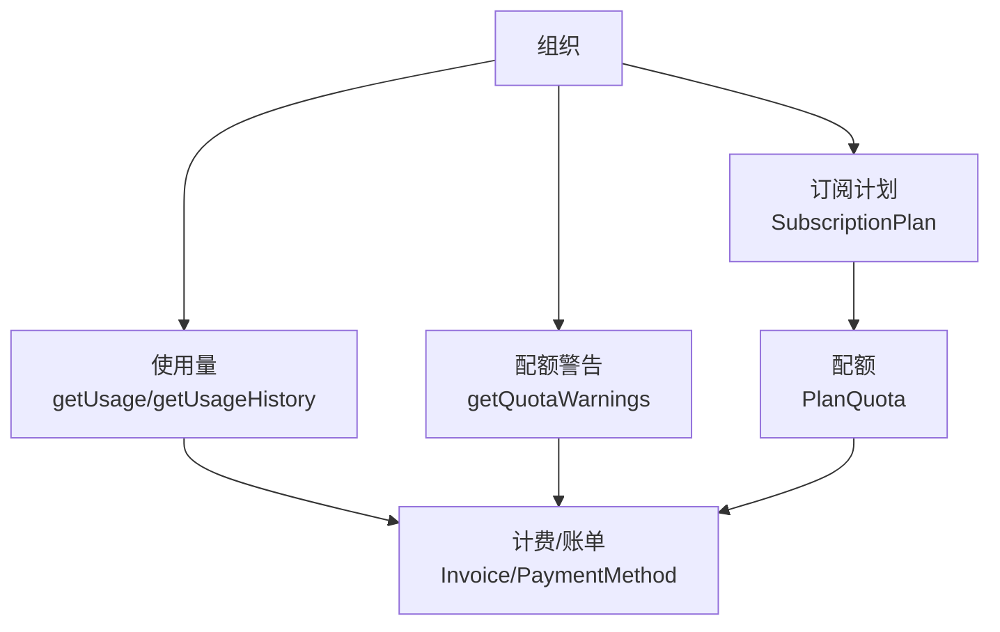

**图表来源**
- [models.tsp](file://api/billing/models.tsp#L133-L152)
- [models.tsp](file://api/billing/models.tsp#L170-L212)
- [usage.tsp](file://api/billing/usage.tsp#L24-L66)
- [invoices.tsp](file://api/billing/invoices.tsp#L1-L76)
- [payments.tsp](file://api/billing/payments.tsp#L1-L75)

**章节来源**
- [models.tsp](file://api/billing/models.tsp#L133-L152)
- [models.tsp](file://api/billing/models.tsp#L170-L212)
- [usage.tsp](file://api/billing/usage.tsp#L24-L66)
- [invoices.tsp](file://api/billing/invoices.tsp#L1-L76)
- [payments.tsp](file://api/billing/payments.tsp#L1-L75)

## 依赖关系分析
- usage.tsp 依赖：
  - common.tsp：ApiResponse 统一响应结构
  - models.tsp：MetricType、OrganizationUsage、UsageDataPoint、QuotaWarning
- 计费模块内部依赖：
  - plans.tsp、subscriptions.tsp、invoices.tsp、payments.tsp 与 models.tsp 交互，共同构成配额与计费闭环

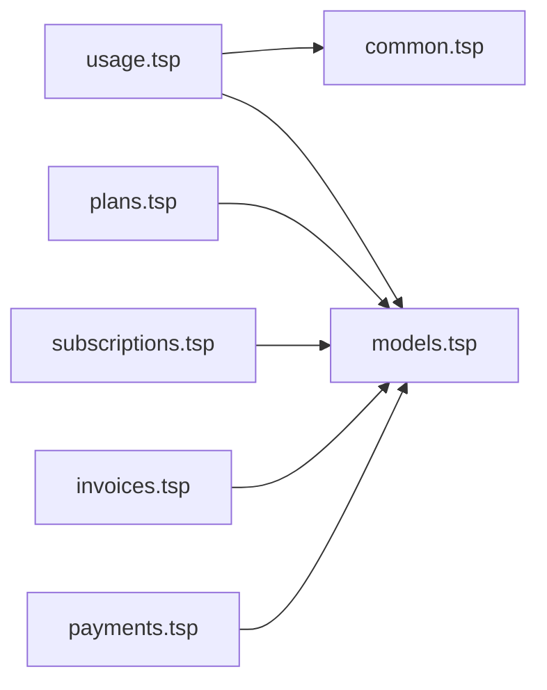

**图表来源**
- [usage.tsp](file://api/billing/usage.tsp#L1-L16)
- [common.tsp](file://api/shared/common.tsp#L1-L177)
- [models.tsp](file://api/billing/models.tsp#L1-L444)
- [plans.tsp](file://api/billing/plans.tsp#L1-L41)
- [subscriptions.tsp](file://api/billing/subscriptions.tsp#L1-L107)
- [invoices.tsp](file://api/billing/invoices.tsp#L1-L76)
- [payments.tsp](file://api/billing/payments.tsp#L1-L75)

**章节来源**
- [usage.tsp](file://api/billing/usage.tsp#L1-L16)
- [common.tsp](file://api/shared/common.tsp#L1-L177)
- [models.tsp](file://api/billing/models.tsp#L1-L444)
- [plans.tsp](file://api/billing/plans.tsp#L1-L41)
- [subscriptions.tsp](file://api/billing/subscriptions.tsp#L1-L107)
- [invoices.tsp](file://api/billing/invoices.tsp#L1-L76)
- [payments.tsp](file://api/billing/payments.tsp#L1-L75)

## 性能考量
- 历史查询的粒度选择：hour 粒度过大可能导致数据点过多，建议按需选择 day 或 month
- 分页与批量：历史数据量较大时，建议分页或分段拉取，避免一次性传输过多数据
- 缓存策略：对高频查询（如当前使用量）可采用短时缓存，降低后端压力
- 并发与限流：在高并发场景下，合理设置速率限制，避免对使用量统计服务造成冲击

## 故障排查指南
- 统一响应结构：所有接口均返回 ApiResponse，包含 success、code、message、payload
  - 常见错误码参考：参考 common.tsp 中的 ErrorCode 枚举
- 使用量异常：
  - 若 getUsage 返回的 percentage 异常偏高，检查配额上限与统计周期是否正确
  - 若 getUsageHistory 返回空数据，确认时间范围与粒度是否合理
- 配额警告：
  - 若 getQuotaWarnings 返回空但实际已超配额，检查阈值配置与 percentage 计算逻辑
- 计费集成：
  - 若账单异常，核对订阅计划的周期与配额，确保与使用量统计周期一致

**章节来源**
- [common.tsp](file://api/shared/common.tsp#L153-L177)
- [usage.tsp](file://api/billing/usage.tsp#L24-L66)

## 结论
本文档系统化梳理了使用量与配额监控的接口与数据模型，明确了：
- 三个核心端点的职责与返回结构
- OrganizationUsage 指标的业务含义
- getUsageHistory 的灵活查询能力与可视化建议
- 配额警告系统的工作机制与阈值策略
- 使用量数据与计费系统的集成路径
- 异常使用模式的监控与处置建议

建议在生产环境中：
- 建立基于百分比阈值的自动化告警（80%/95%）
- 使用历史趋势指导容量规划与预算
- 将使用量与订阅计划配额对齐，确保计费准确与合规

## 附录
- 响应统一结构：ApiResponse
  - success：布尔，是否成功
  - code：错误码（失败时）
  - message：多语言消息（失败时）
  - payload：载荷（成功时）

**章节来源**
- [common.tsp](file://api/shared/common.tsp#L153-L177)