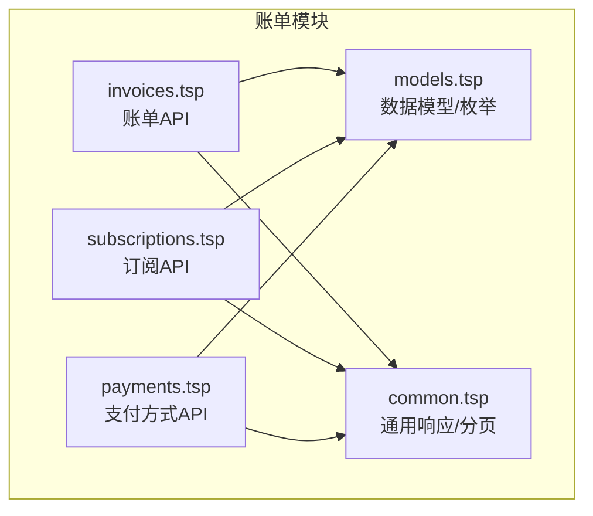
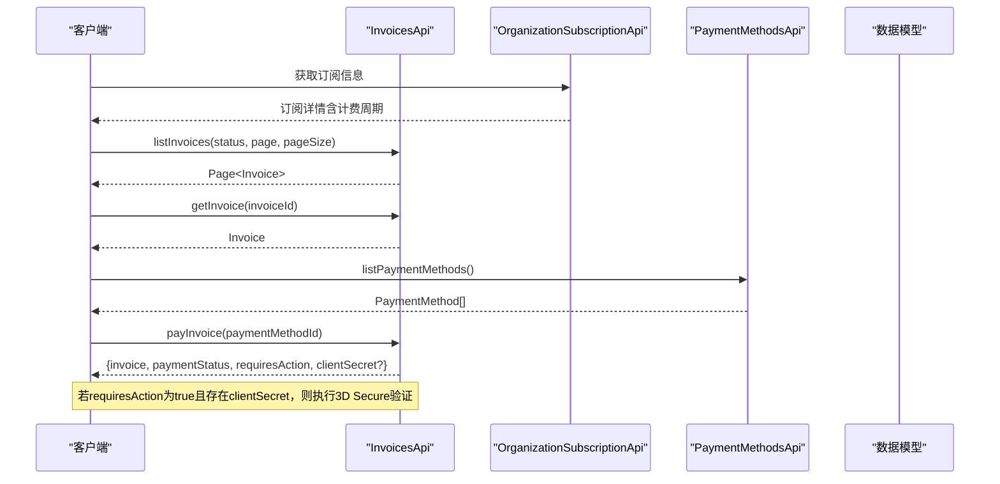
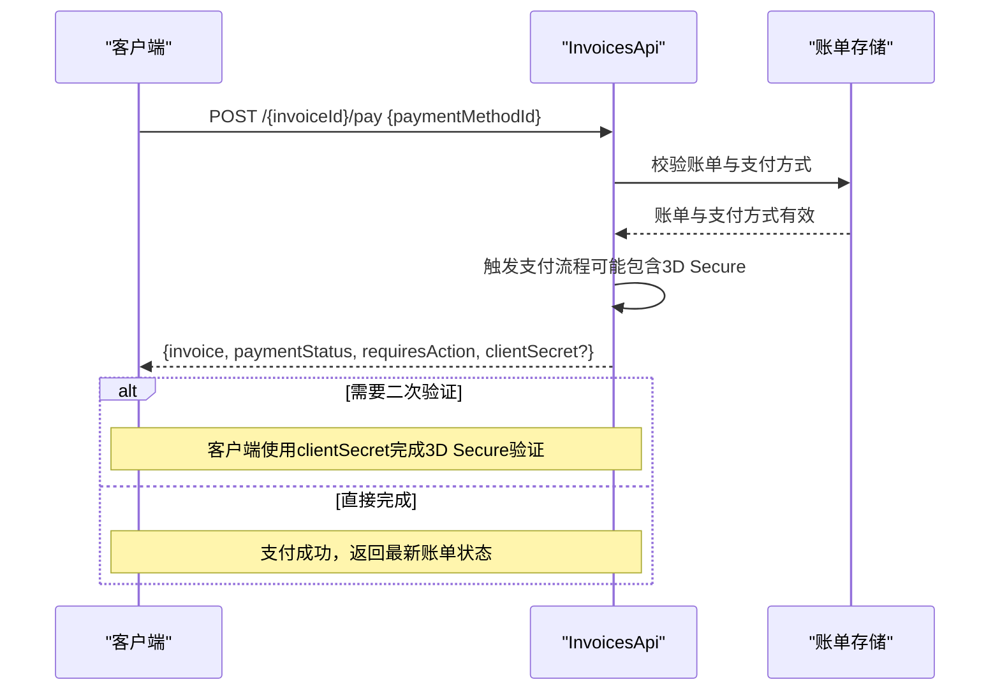
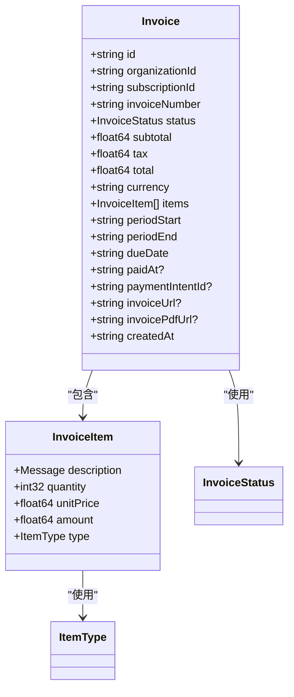
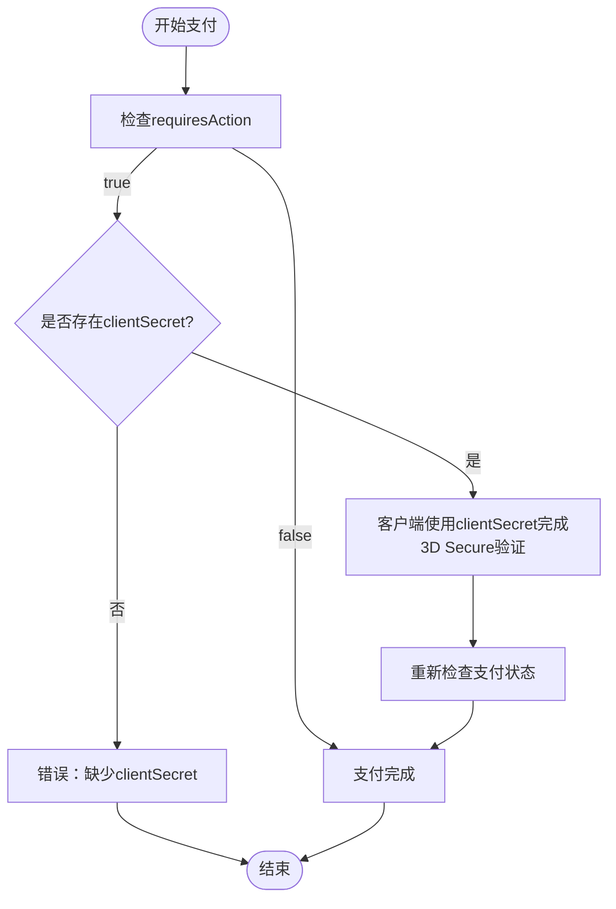
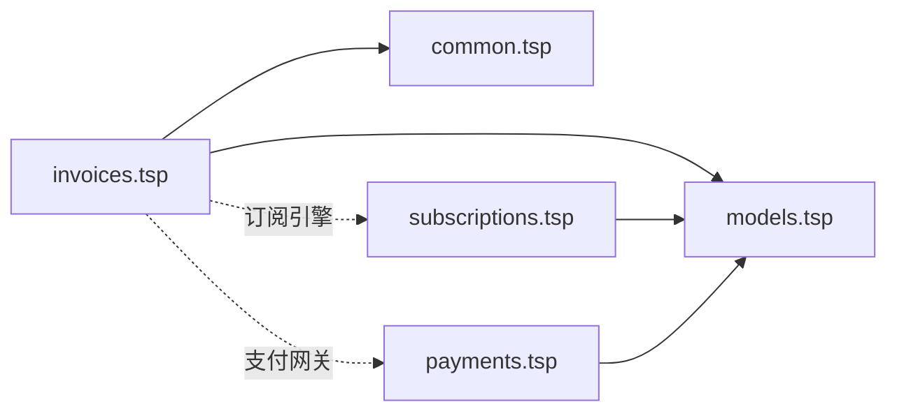

# 账单管理

<cite>
**本文引用的文件**
- [invoices.tsp](file://api/billing/invoices.tsp)
- [models.tsp](file://api/billing/models.tsp)
- [common.tsp](file://api/shared/common.tsp)
- [subscriptions.tsp](file://api/billing/subscriptions.tsp)
- [payments.tsp](file://api/billing/payments.tsp)
- [index.tsp](file://api/billing/index.tsp)
</cite>

## 目录
1. [简介](#简介)
2. [项目结构](#项目结构)
3. [核心组件](#核心组件)
4. [架构概览](#架构概览)
5. [详细组件分析](#详细组件分析)
6. [依赖分析](#依赖分析)
7. [性能考虑](#性能考虑)
8. [故障排查指南](#故障排查指南)
9. [结论](#结论)
10. [附录](#附录)

## 简介
本文件面向账单管理功能的完整API文档，聚焦于invoices.tsp中定义的账单全生命周期操作，包括：
- listInvoices：分页查询组织账单，并支持按状态过滤
- getInvoice：获取账单详情
- payInvoice：执行账单支付，重点说明requiresAction与clientSecret在3D Secure验证场景下的使用

同时，文档解释Invoice数据模型的构成（金额、税额、状态、PDF下载URL等），并给出分页参数的最佳实践；阐述账单与Subscription、PaymentMethod的关联关系，以及账单生成的时间规律（如每月初自动生成）；最后提供逾期账单与退款流程的指导建议。

## 项目结构
账单管理相关的核心文件位于api/billing目录下，其中：
- invoices.tsp：定义账单管理API（listInvoices、getInvoice、payInvoice）
- models.tsp：定义账单、订阅、支付方式等数据模型及枚举
- subscriptions.tsp：订阅管理API（与账单生成密切相关）
- payments.tsp：支付方式管理API（与账单支付绑定）
- common.tsp：通用响应结构ApiResponse与分页Page
- index.tsp：模块入口，统一导出各子模块



图表来源
- [invoices.tsp](file://api/billing/invoices.tsp#L1-L76)
- [models.tsp](file://api/billing/models.tsp#L1-L444)
- [subscriptions.tsp](file://api/billing/subscriptions.tsp#L1-L107)
- [payments.tsp](file://api/billing/payments.tsp#L1-L75)
- [common.tsp](file://api/shared/common.tsp#L1-L200)

章节来源
- [index.tsp](file://api/billing/index.tsp#L1-L10)

## 核心组件
- 账单API（InvoicesApi）
  - listInvoices：分页查询组织账单，支持status过滤、page与pageSize参数
  - getInvoice：按账单ID获取详情
  - payInvoice：提交支付方式ID完成支付，返回复杂响应结构（包含requiresAction与clientSecret）

- 数据模型与枚举
  - Invoice：账单实体，包含金额、税额、状态、PDF下载URL等
  - InvoiceStatus：账单状态枚举（draft、open、paid、void_status、uncollectible）
  - OrganizationSubscription：订阅实体，与账单生成周期密切相关
  - PaymentMethod：支付方式实体，支持多种类型

- 通用响应与分页
  - ApiResponse：统一响应结构（success、code、message、payload）
  - Page：分页结构（items、page、pageSize、total）

章节来源
- [invoices.tsp](file://api/billing/invoices.tsp#L17-L76)
- [models.tsp](file://api/billing/models.tsp#L69-L120)
- [models.tsp](file://api/billing/models.tsp#L277-L332)
- [models.tsp](file://api/billing/models.tsp#L214-L257)
- [models.tsp](file://api/billing/models.tsp#L334-L365)
- [common.tsp](file://api/shared/common.tsp#L153-L203)

## 架构概览
账单管理涉及“订阅—账单—支付方式”的协同关系。订阅决定账单生成周期与金额构成，账单承载金额、税费与到期日，支付方式提供付款渠道。支付完成后，payInvoice可能触发requiresAction与clientSecret以支持3D Secure等二次验证。



图表来源
- [invoices.tsp](file://api/billing/invoices.tsp#L17-L76)
- [subscriptions.tsp](file://api/billing/subscriptions.tsp#L17-L29)
- [payments.tsp](file://api/billing/payments.tsp#L17-L29)
- [models.tsp](file://api/billing/models.tsp#L214-L257)
- [models.tsp](file://api/billing/models.tsp#L277-L332)

## 详细组件分析

### 账单API（InvoicesApi）
- listInvoices
  - 路径：/api/v1/organizations/{organizationId}/invoices
  - 查询参数：
    - status：按InvoiceStatus过滤（draft、open、paid、void_status、uncollectible）
    - page：页码，默认1
    - pageSize：每页数量，默认20
  - 响应：ApiResponse<Page<Invoice>>

- getInvoice
  - 路径：/api/v1/organizations/{organizationId}/invoices/{invoiceId}
  - 响应：ApiResponse<Invoice>

- payInvoice
  - 路径：/api/v1/organizations/{organizationId}/invoices/{invoiceId}/pay
  - 请求体：{ paymentMethodId: string }
  - 响应：ApiResponse<{ invoice: Invoice; paymentStatus: string; requiresAction: boolean; clientSecret?: string }>
    - invoice：支付后的账单对象
    - paymentStatus：支付状态字符串
    - requiresAction：是否需要进一步操作（如3D Secure）
    - clientSecret：用于3D Secure验证的客户端密钥（可选）



图表来源
- [invoices.tsp](file://api/billing/invoices.tsp#L55-L76)
- [models.tsp](file://api/billing/models.tsp#L277-L332)

章节来源
- [invoices.tsp](file://api/billing/invoices.tsp#L17-L76)

### Invoice数据模型
- 关键字段
  - id、organizationId、subscriptionId、invoiceNumber
  - status：InvoiceStatus
  - subtotal、tax、total、currency
  - items：InvoiceItem[]
  - periodStart、periodEnd、dueDate
  - paidAt、paymentIntentId
  - invoiceUrl、invoicePdfUrl
  - createdAt

- 金额与税费
  - subtotal：不含税小计
  - tax：税费
  - total：总计（subtotal + tax）
  - currency：货币代码

- PDF下载
  - invoicePdfUrl：账单PDF下载链接（可选）



图表来源
- [models.tsp](file://api/billing/models.tsp#L277-L332)
- [models.tsp](file://api/billing/models.tsp#L259-L276)
- [models.tsp](file://api/billing/models.tsp#L69-L91)

章节来源
- [models.tsp](file://api/billing/models.tsp#L277-L332)

### 支付流程与3D Secure响应
- payInvoice响应中的关键字段
  - requiresAction：当支付需要进一步操作（如3D Secure）时为true
  - clientSecret：用于客户端发起3D Secure验证的密钥（可选）
  - paymentStatus：支付状态字符串（供前端展示与后续处理）
  - invoice：支付后的账单对象

- 3D Secure验证场景
  - 当requiresAction为true且存在clientSecret时，客户端需使用该密钥完成二次验证
  - 验证完成后，再次调用payInvoice或轮询账单状态以确认最终支付结果



图表来源
- [invoices.tsp](file://api/billing/invoices.tsp#L55-L76)

章节来源
- [invoices.tsp](file://api/billing/invoices.tsp#L55-L76)

### 分页参数最佳实践
- page与pageSize
  - 默认page=1、pageSize=20
  - 建议前端根据业务选择合理pageSize（如20、50、100），避免过大导致网络与服务端压力
  - 使用Page.total进行总记录数统计，结合前端分页控件渲染
  - 对高频查询场景，建议增加缓存策略与索引优化

- 与status过滤配合
  - 在查询时传入status以减少无关数据传输
  - 常见过滤组合：open（待支付）、paid（已支付）、draft（草稿）、void_status（作废）、uncollectible（无法收款）

章节来源
- [invoices.tsp](file://api/billing/invoices.tsp#L27-L34)
- [common.tsp](file://api/shared/common.tsp#L179-L203)

### 账单与Subscription、PaymentMethod的关系
- 账单与订阅
  - Invoice.subscriptionId指向OrganizationSubscription.id
  - OrganizationSubscription包含currentPeriodStart/End，决定账单的计费周期
  - 订阅状态（SubscriptionStatus）影响账单生成与逾期判断（如past_due）

- 账单与支付方式
  - payInvoice请求体要求提供paymentMethodId
  - PaymentMethod支持多种类型（card、alipay、wechat、bank_transfer等）
  - 支付完成后，账单可能记录paymentIntentId以便追踪

```mermaid
erDiagram
SUBSCRIPTION {
string id PK
string organizationId
string planId
enum status
string currentPeriodStart
string currentPeriodEnd
}
INVOICE {
string id PK
string organizationId
string subscriptionId FK
enum status
float64 subtotal
float64 tax
float64 total
string currency
string periodStart
string periodEnd
string dueDate
string paidAt?
string paymentIntentId?
string invoicePdfUrl?
}
PAYMENT_METHOD {
string id PK
string organizationId
enum type
boolean isDefault
string cardLast4?
string cardBrand?
int32 expiryMonth?
int32 expiryYear?
}
INVOICE }o--|| SUBSCRIPTION : "属于"
INVOICE ||--o{ PAYMENT_METHOD : "支付方式(间接关联)"
```

图表来源
- [models.tsp](file://api/billing/models.tsp#L214-L257)
- [models.tsp](file://api/billing/models.tsp#L277-L332)
- [models.tsp](file://api/billing/models.tsp#L334-L365)

章节来源
- [models.tsp](file://api/billing/models.tsp#L214-L257)
- [models.tsp](file://api/billing/models.tsp#L277-L332)
- [models.tsp](file://api/billing/models.tsp#L334-L365)

### 账单生成时间规律与逾期处理
- 账单生成时间规律
  - 订阅的currentPeriodStart/currentPeriodEnd定义了计费周期
  - 常见规则：按月计费（monthly）在每月初生成新账单
  - 具体生成策略由后端实现，前端仅消费数据模型

- 逾期账单处理
  - 订阅状态为past_due时，账单通常处于open状态且接近或超过dueDate
  - 建议：
    - 提醒用户尽快完成支付
    - 在payInvoice中优先使用默认支付方式（isDefault=true）
    - 对长期未支付的账单，可标记为uncollectible并限制功能

章节来源
- [models.tsp](file://api/billing/models.tsp#L237-L241)
- [models.tsp](file://api/billing/models.tsp#L69-L81)
- [subscriptions.tsp](file://api/billing/subscriptions.tsp#L17-L29)

### 退款流程指导建议
- 退款前提
  - 仅对已支付（paid）的账单进行退款
  - 需要后端支持退款操作（如新增refundInvoice端点或在payInvoice中扩展）

- 建议流程
  1. 校验账单状态为paid
  2. 调用退款端点（若存在），或在支付网关侧发起退款
  3. 同步退款状态至账单（如新增refundStatus字段或通过webhook通知）
  4. 通知用户退款进度与到账时间

[本节为通用指导，不直接分析具体源码文件]

## 依赖分析
- 模块耦合
  - invoices.tsp依赖models.tsp（Invoice、InvoiceStatus）与common.tsp（ApiResponse、Page）
  - subscriptions.tsp与payments.tsp分别提供订阅与支付方式数据，间接支撑账单支付链路

- 外部依赖
  - 支付网关：用于处理3D Secure与实际扣款
  - 订阅引擎：负责按周期生成账单与维护计费周期



图表来源
- [invoices.tsp](file://api/billing/invoices.tsp#L17-L76)
- [models.tsp](file://api/billing/models.tsp#L1-L444)
- [common.tsp](file://api/shared/common.tsp#L153-L203)
- [subscriptions.tsp](file://api/billing/subscriptions.tsp#L17-L29)
- [payments.tsp](file://api/billing/payments.tsp#L17-L29)

章节来源
- [index.tsp](file://api/billing/index.tsp#L1-L10)

## 性能考虑
- 分页与过滤
  - 合理设置pageSize，避免一次性拉取过多账单
  - 使用status过滤减少无效数据传输
- 缓存策略
  - 对常用查询（如最近N个月账单）增加缓存
- 索引优化
  - 对organizationId、status、dueDate、createdAt建立索引以提升查询性能

[本节提供一般性建议，不直接分析具体源码文件]

## 故障排查指南
- 常见问题
  - 404：账单不存在或路径错误
  - 400：请求参数缺失（如paymentMethodId）
  - 402：支付失败或余额不足
  - 409：账单状态冲突（如重复支付）

- 排查步骤
  1. 确认organizationId与invoiceId正确
  2. 检查status过滤是否合理
  3. 确认paymentMethodId有效且为默认支付方式
  4. 若requiresAction为true，确保clientSecret正确传递并完成3D Secure验证
  5. 查看ApiResponse.code与message定位错误原因

章节来源
- [common.tsp](file://api/shared/common.tsp#L153-L177)

## 结论
本文档系统梳理了账单管理的API与数据模型，明确了listInvoices、getInvoice、payInvoice的使用方法与响应结构，重点解释了requiresAction与clientSecret在3D Secure场景下的作用。同时，给出了分页参数的最佳实践、账单与Subscription/PaymentMethod的关联关系、账单生成时间规律以及逾期与退款的处理建议。建议在生产环境中结合缓存与索引优化以提升性能，并完善错误处理与通知机制。

## 附录
- API端点一览
  - GET /api/v1/organizations/{organizationId}/invoices
  - GET /api/v1/organizations/{organizationId}/invoices/{invoiceId}
  - POST /api/v1/organizations/{organizationId}/invoices/{invoiceId}/pay

- 关键枚举与模型
  - InvoiceStatus：draft、open、paid、void_status、uncollectible
  - SubscriptionStatus：trialing、active、past_due、canceled、expired
  - PaymentMethodType：card、alipay、wechat、bank_transfer

章节来源
- [invoices.tsp](file://api/billing/invoices.tsp#L17-L76)
- [models.tsp](file://api/billing/models.tsp#L69-L120)
- [models.tsp](file://api/billing/models.tsp#L214-L257)
- [models.tsp](file://api/billing/models.tsp#L334-L365)