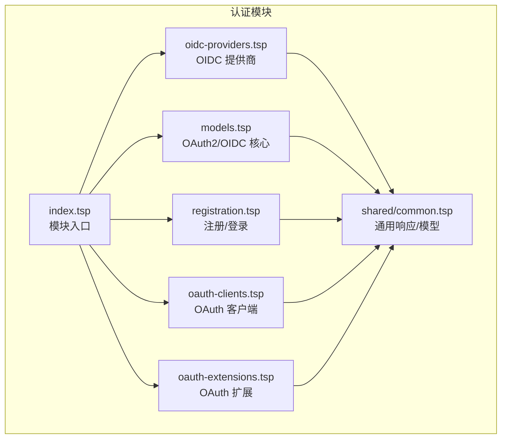
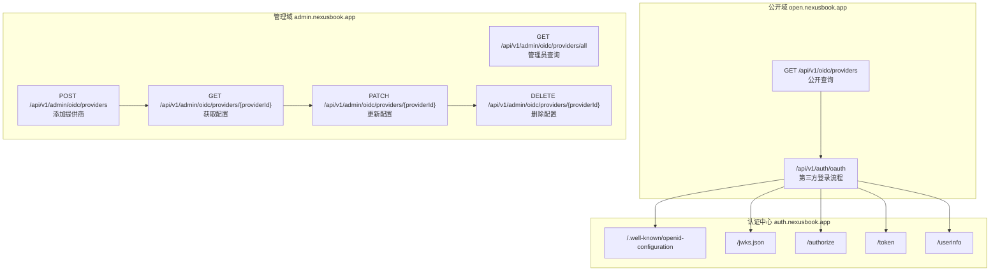
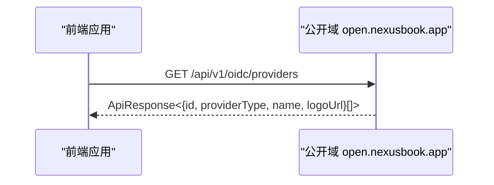
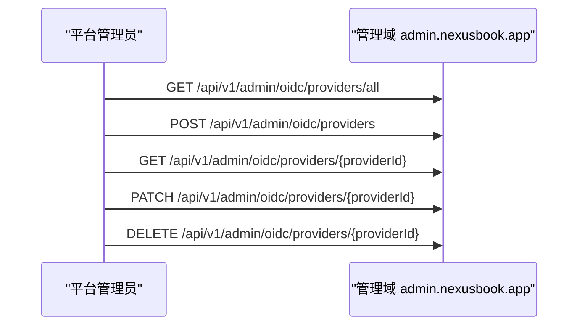
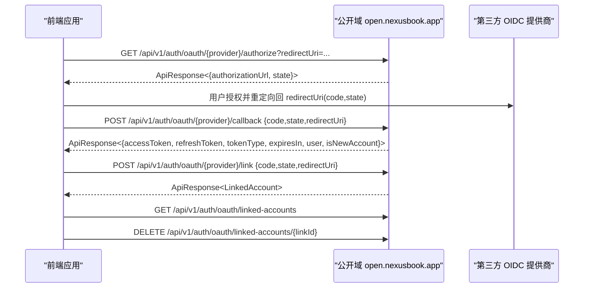
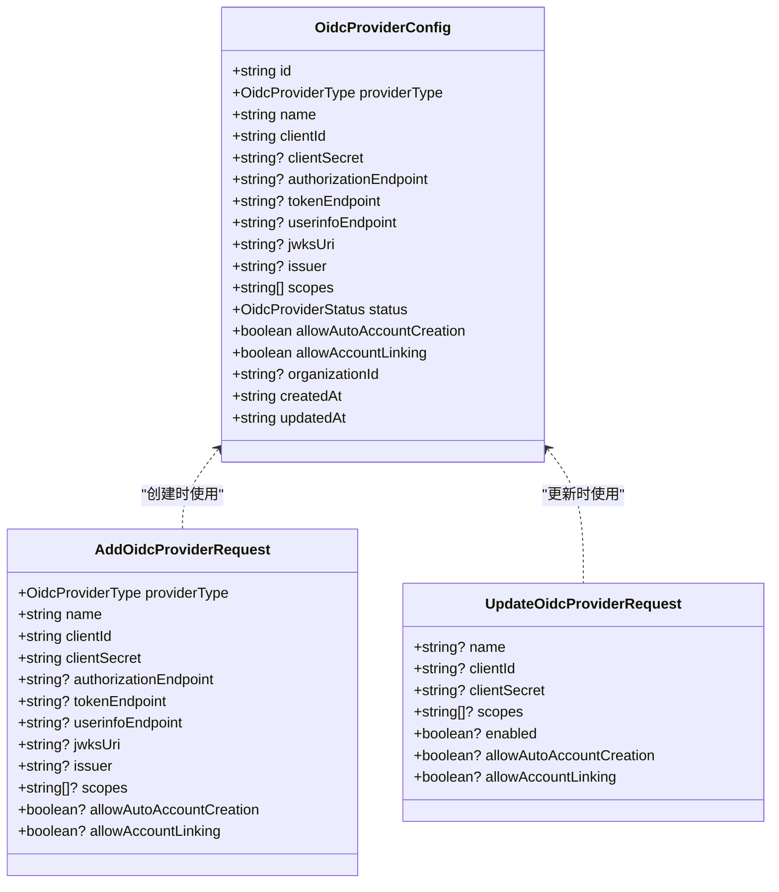
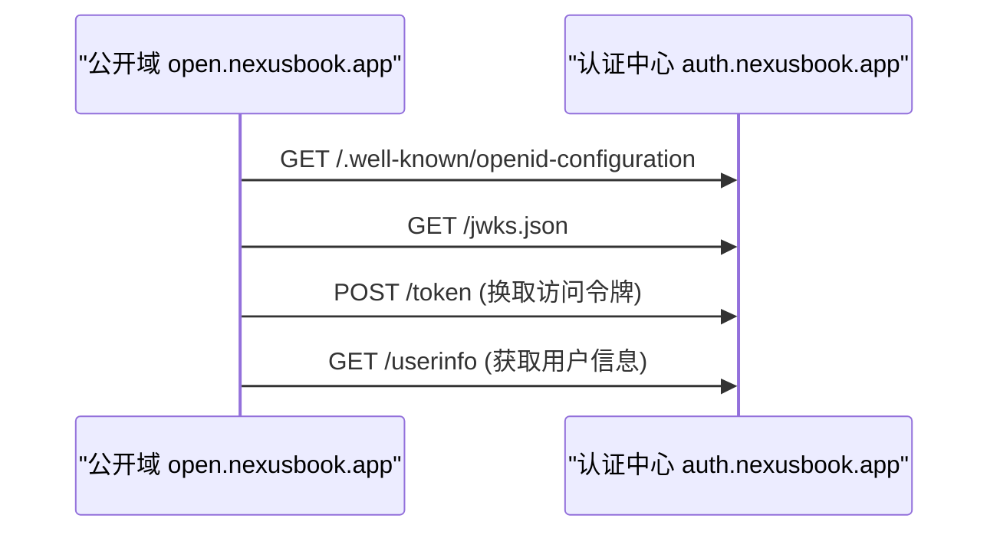
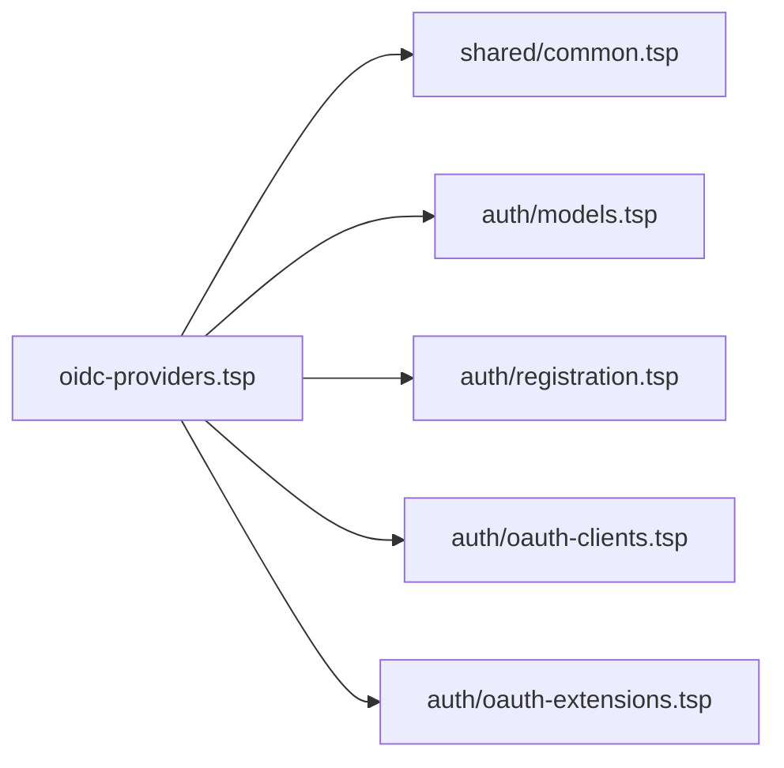

# OIDC 身份提供商

<cite>
**本文引用的文件**
- [api/auth/oidc-providers.tsp](file://api/auth/oidc-providers.tsp)
- [api/auth/index.tsp](file://api/auth/index.tsp)
- [api/auth/models.tsp](file://api/auth/models.tsp)
- [api/auth/registration.tsp](file://api/auth/registration.tsp)
- [api/auth/oauth-clients.tsp](file://api/auth/oauth-clients.tsp)
- [api/auth/oauth-extensions.tsp](file://api/auth/oauth-extensions.tsp)
- [api/shared/index.tsp](file://api/shared/index.tsp)
- [api/shared/common.tsp](file://api/shared/common.tsp)
- [AUTH_API_TYPESPEC_ADJUSTMENTS.md](file://AUTH_API_TYPESPEC_ADJUSTMENTS.md)
- [AUTH_MODULES_OVERVIEW.md](file://AUTH_MODULES_OVERVIEW.md)
</cite>

## 目录
1. [简介](#简介)
2. [项目结构](#项目结构)
3. [核心组件](#核心组件)
4. [架构总览](#架构总览)
5. [详细组件分析](#详细组件分析)
6. [依赖分析](#依赖分析)
7. [性能考虑](#性能考虑)
8. [故障排查指南](#故障排查指南)
9. [结论](#结论)
10. [附录](#附录)

## 简介
本文件聚焦于“第三方 OIDC 身份提供商”能力，基于仓库中的 TypeSpec 定义与相关模块，系统化阐述 OIDC 提供商的配置、公开查询、OAuth 登录流程、账号关联与管理、以及与认证授权体系的整体协作关系。同时结合域名规划与接口拆分建议，帮助读者快速理解与落地实现。

## 项目结构
OIDC 身份提供商能力位于认证模块下，采用模块化设计，核心文件如下：
- OIDC 提供商定义与接口：api/auth/oidc-providers.tsp
- 认证模块入口索引：api/auth/index.tsp
- OAuth2/OIDC 核心协议端点：api/auth/models.tsp
- 用户注册与登录：api/auth/registration.tsp
- OAuth 客户端管理：api/auth/oauth-clients.tsp
- OAuth 扩展功能：api/auth/oauth-extensions.tsp
- 共享类型与通用响应模型：api/shared/common.tsp
- 模块概览与使用示例：AUTH_MODULES_OVERVIEW.md
- TypeSpec 文档与域名规划调整建议：AUTH_API_TYPESPEC_ADJUSTMENTS.md

图表来源
- [api/auth/index.tsp](file://api/auth/index.tsp#L1-L48)
- [api/auth/oidc-providers.tsp](file://api/auth/oidc-providers.tsp#L462-L749)
- [api/auth/models.tsp](file://api/auth/models.tsp#L1-L583)
- [api/auth/registration.tsp](file://api/auth/registration.tsp#L1-L711)
- [api/auth/oauth-clients.tsp](file://api/auth/oauth-clients.tsp#L1-L637)
- [api/auth/oauth-extensions.tsp](file://api/auth/oauth-extensions.tsp#L1-L571)
- [api/shared/common.tsp](file://api/shared/common.tsp#L1-L742)

章节来源
- [api/auth/index.tsp](file://api/auth/index.tsp#L1-L48)

## 核心组件
- OIDC 提供商类型与状态枚举：定义支持的提供商类型（如 Google、GitHub、Microsoft、Apple、Facebook、Twitter、LinkedIn、Slack、GitLab、Bitbucket、企业微信、钉钉、飞书、自定义 OIDC）与配置状态（active/disabled）。
- OIDC 提供商配置模型：包含提供商类型、名称、客户端 ID/Secret、自定义端点（授权、令牌、用户信息、JWKS、发行者）、授权范围、启用状态、自动账号创建与账号关联策略、所属组织等。
- 公开查询接口：列出可用的 OIDC 提供商（返回简化信息，不含密钥）。
- 管理接口：列出/添加/获取/更新/删除 OIDC 提供商配置（管理员权限，返回完整配置）。
- OAuth 登录接口：获取第三方登录授权 URL、处理回调、关联第三方账号、列出与解除关联。
- 通用响应模型：统一 ApiResponse、分页 Page、错误码等，确保跨模块一致的响应格式。

章节来源
- [api/auth/oidc-providers.tsp](file://api/auth/oidc-providers.tsp#L24-L232)
- [api/auth/oidc-providers.tsp](file://api/auth/oidc-providers.tsp#L234-L359)
- [api/auth/oidc-providers.tsp](file://api/auth/oidc-providers.tsp#L462-L749)
- [api/shared/common.tsp](file://api/shared/common.tsp#L153-L204)

## 架构总览
OIDC 身份提供商在整体认证体系中的位置与交互如下：
- 公开查询：前端登录页通过公开接口获取可用提供商列表，决定展示哪些第三方登录入口。
- 管理后台：平台管理员在管理域配置提供商，设置客户端凭据、端点、范围、策略等。
- OAuth 登录：用户点击第三方登录后，系统生成授权 URL 并跳转至提供商；回调后换取令牌并完成登录或账号关联。
- 与核心协议协同：OIDC 提供商配置与 OAuth2/OIDC 核心端点（授权、令牌、用户信息、发现、JWKS）共同构成完整的认证链路。

图表来源
- [api/auth/oidc-providers.tsp](file://api/auth/oidc-providers.tsp#L462-L749)
- [api/auth/models.tsp](file://api/auth/models.tsp#L1-L583)
- [AUTH_API_TYPESPEC_ADJUSTMENTS.md](file://AUTH_API_TYPESPEC_ADJUSTMENTS.md#L51-L119)

章节来源
- [AUTH_API_TYPESPEC_ADJUSTMENTS.md](file://AUTH_API_TYPESPEC_ADJUSTMENTS.md#L51-L119)

## 详细组件分析

### OIDC 提供商公开查询接口
- 路由与定位：公开查询接口，用于登录页面展示可用的第三方登录选项。
- 返回字段：提供商 ID、类型、名称、Logo URL（简化信息，不含密钥）。
- 适用场景：前端根据该列表渲染第三方登录按钮，引导用户选择提供商进行登录。

图表来源
- [api/auth/oidc-providers.tsp](file://api/auth/oidc-providers.tsp#L462-L513)

章节来源
- [api/auth/oidc-providers.tsp](file://api/auth/oidc-providers.tsp#L462-L513)

### OIDC 提供商管理接口（管理员）
- 路由与定位：平台管理员专用接口，配置第三方 OIDC 登录提供商。
- 支持操作：列出全部配置、添加、获取、更新、删除。
- 权限要求：平台管理员。
- 返回内容：添加/更新/获取返回完整配置（含密钥等敏感信息）。

图表来源
- [api/auth/oidc-providers.tsp](file://api/auth/oidc-providers.tsp#L515-L618)

章节来源
- [api/auth/oidc-providers.tsp](file://api/auth/oidc-providers.tsp#L515-L618)

### OAuth 登录流程（第三方登录）
- 获取授权 URL：根据提供商类型与配置生成授权 URL，并返回 state 参数用于防 CSRF。
- 处理回调：接收授权码、state、redirectUri，与提供商交换令牌，返回访问令牌、刷新令牌、用户信息，并标记是否新账号。
- 关联账号：已登录用户可将第三方账号与当前账户关联。
- 列出/解除关联：管理当前用户已关联的第三方账号。

图表来源
- [api/auth/oidc-providers.tsp](file://api/auth/oidc-providers.tsp#L620-L749)

章节来源
- [api/auth/oidc-providers.tsp](file://api/auth/oidc-providers.tsp#L620-L749)

### OIDC 提供商配置模型与字段说明
- 关键字段：提供商类型、名称、客户端 ID/Secret、自定义端点（授权、令牌、用户信息、JWKS、发行者）、授权范围、启用状态、自动账号创建、账号关联策略、所属组织、时间戳等。
- 自定义 OIDC：当 providerType 为 custom 时，需提供授权、令牌、用户信息端点、JWKS、发行者等必要信息。

图表来源
- [api/auth/oidc-providers.tsp](file://api/auth/oidc-providers.tsp#L126-L232)
- [api/auth/oidc-providers.tsp](file://api/auth/oidc-providers.tsp#L234-L359)

章节来源
- [api/auth/oidc-providers.tsp](file://api/auth/oidc-providers.tsp#L126-L232)
- [api/auth/oidc-providers.tsp](file://api/auth/oidc-providers.tsp#L234-L359)

### 与 OAuth2/OIDC 核心协议的协作
- OIDC 元数据与 JWKS：认证中心提供发现文档与公钥集合，用于验证令牌与用户信息。
- 授权与令牌：公开域的 OAuth 登录流程通过认证中心的授权与令牌端点完成令牌交换。
- 用户信息：回调后可调用认证中心的用户信息端点获取标准化声明。

图表来源
- [api/auth/models.tsp](file://api/auth/models.tsp#L1-L583)
- [api/auth/oidc-providers.tsp](file://api/auth/oidc-providers.tsp#L620-L749)

章节来源
- [api/auth/models.tsp](file://api/auth/models.tsp#L1-L583)

### 与用户注册/登录模块的衔接
- 用户注册与登录支持邮箱/手机/OAuth 多种方式；OAuth 登录可直接走第三方 OIDC 流程。
- 两步验证、会话管理等安全能力与 OIDC 登录流程可并行使用。

章节来源
- [api/auth/registration.tsp](file://api/auth/registration.tsp#L1-L711)
- [AUTH_MODULES_OVERVIEW.md](file://AUTH_MODULES_OVERVIEW.md#L65-L125)

### 与 OAuth 客户端管理的边界
- OAuth 客户端管理面向第三方应用（如自建 SPA/移动端），用于注册与管理自己的 OAuth 客户端。
- OIDC 提供商管理面向平台管理员，用于配置第三方身份提供商（Google/GitHub 等）。

章节来源
- [api/auth/oauth-clients.tsp](file://api/auth/oauth-clients.tsp#L1-L637)
- [AUTH_MODULES_OVERVIEW.md](file://AUTH_MODULES_OVERVIEW.md#L573-L636)

### 与 OAuth 扩展功能的关系
- OAuth 扩展（令牌撤销、自省、设备授权、PKCE）主要在认证中心实现，与 OIDC 提供商配置形成互补，保障令牌生命周期与安全。

章节来源
- [api/auth/oauth-extensions.tsp](file://api/auth/oauth-extensions.tsp#L1-L571)

## 依赖分析
- 模块耦合
  - OIDC 提供商模块依赖共享通用响应模型（ApiResponse/Page/ErrorCode）。
  - 公开查询与管理接口分别面向不同域（open/admin），职责清晰。
  - OAuth 登录流程依赖认证中心的核心协议端点。
- 外部依赖
  - 第三方 OIDC 提供商（Google、GitHub、Microsoft 等）的授权、令牌、用户信息端点。
  - 自定义 OIDC 需要提供标准 OIDC 元数据与 JWKS。

图表来源
- [api/auth/oidc-providers.tsp](file://api/auth/oidc-providers.tsp#L462-L749)
- [api/shared/common.tsp](file://api/shared/common.tsp#L153-L204)
- [api/auth/models.tsp](file://api/auth/models.tsp#L1-L583)

章节来源
- [api/auth/oidc-providers.tsp](file://api/auth/oidc-providers.tsp#L462-L749)
- [api/shared/common.tsp](file://api/shared/common.tsp#L153-L204)

## 性能考虑
- 公开查询接口返回简化信息，避免泄露敏感配置，降低网络传输与解析成本。
- OAuth 登录流程涉及跨域往返，建议：
  - 合理缓存 JWKS 与 OIDC 元数据；
  - 控制回调参数长度，避免超长 URL；
  - 对第三方提供商端点进行超时与重试策略配置。
- 管理接口仅在后台使用，建议开启严格的速率限制与审计日志。

## 故障排查指南
- 常见问题与定位
  - 提供商配置缺失或错误：检查客户端 ID/Secret、授权/令牌/用户信息端点、JWKS、发行者等字段。
  - 回调失败：核对 redirectUri、state 参数一致性、授权码时效性。
  - 令牌验证失败：确认 JWKS 与 OIDC 元数据可用，检查签名算法与 kid。
  - 账号关联冲突：检查是否已存在相同第三方账号绑定，或是否允许账号关联。
- 错误码参考
  - 通用错误码涵盖用户、组织、工作区、邀请、请求、审批等场景；OIDC 相关错误可参考用户相关错误码（如提供商不支持、已关联、未关联等）。

章节来源
- [api/shared/common.tsp](file://api/shared/common.tsp#L80-L151)
- [AUTH_MODULES_OVERVIEW.md](file://AUTH_MODULES_OVERVIEW.md#L638-L761)

## 结论
OIDC 身份提供商模块通过公开查询与管理接口，实现了对国际主流与自定义 OIDC 提供商的统一配置与管理；配合认证中心的核心协议端点与 OAuth 登录流程，构建了完整的第三方登录与账号关联能力。结合域名规划与接口拆分建议，可进一步提升系统的可维护性与安全性。

## 附录
- 域名规划与接口拆分建议
  - 认证中心（auth.nexusbook.app）：OAuth2/OIDC 核心协议端点。
  - 开放域（open.nexusbook.app）：用户认证、API Key、OAuth 客户端、第三方登录等面向用户与第三方应用的业务接口。
  - 管理域（admin.nexusbook.app）：平台管理员专用接口，如 OIDC 提供商管理。
  - 建议拆分 OIDC 提供商接口为公开查询与管理两类，并为所有接口添加 @server 注解明确域名归属。

章节来源
- [AUTH_API_TYPESPEC_ADJUSTMENTS.md](file://AUTH_API_TYPESPEC_ADJUSTMENTS.md#L51-L119)
- [AUTH_API_TYPESPEC_ADJUSTMENTS.md](file://AUTH_API_TYPESPEC_ADJUSTMENTS.md#L243-L351)