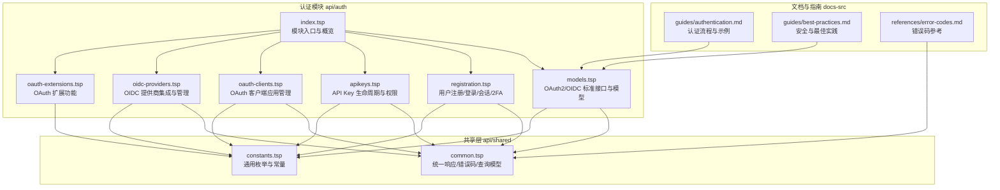
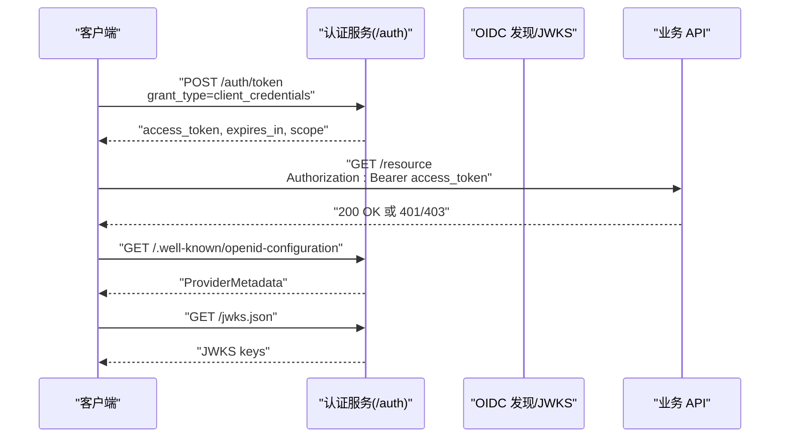
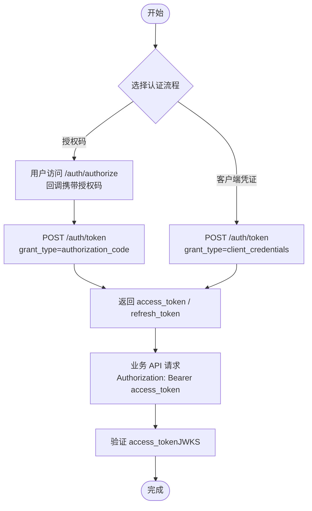
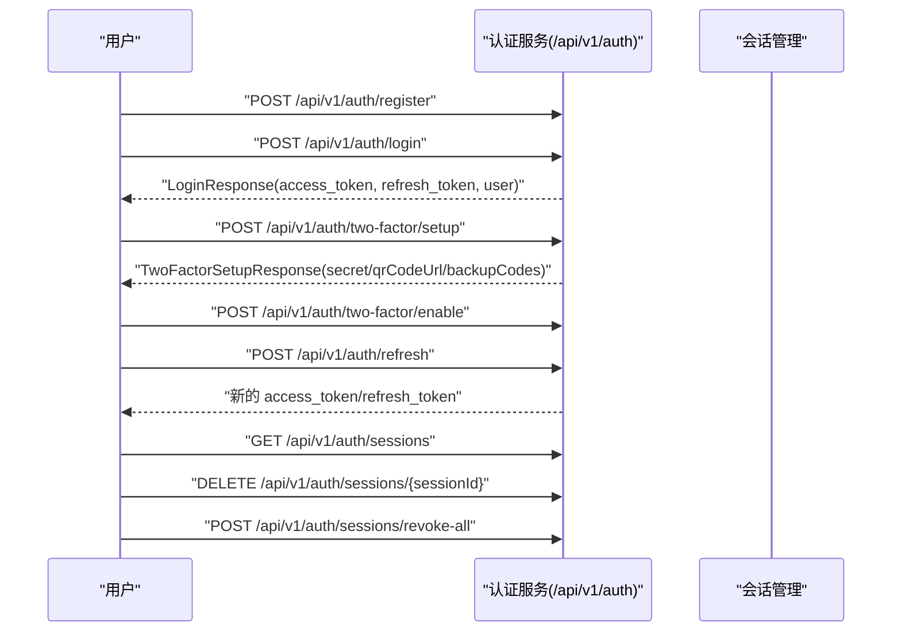
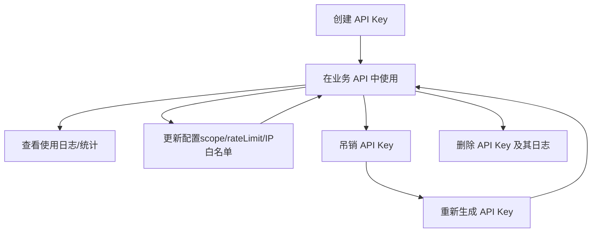
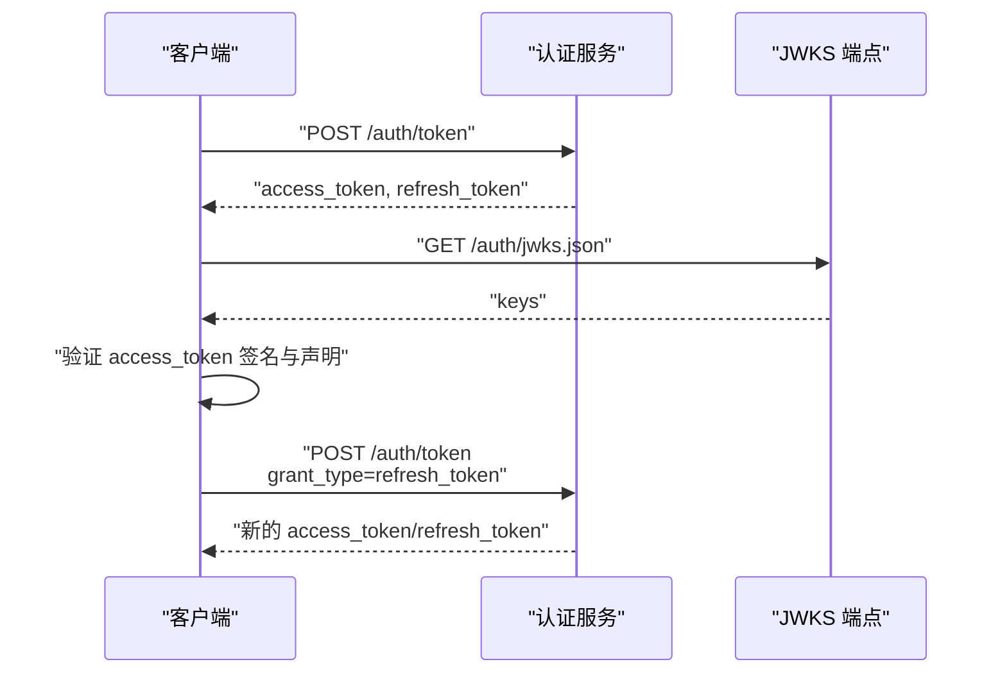
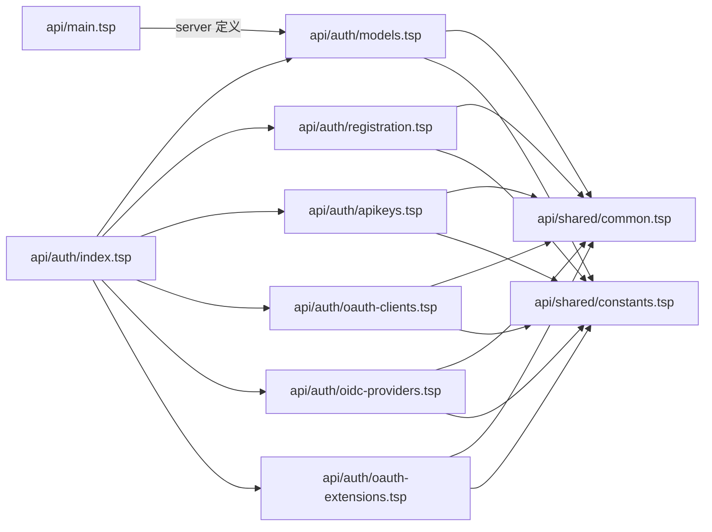

# 认证与授权

<cite>
**本文引用的文件**
- [api/auth/index.tsp](file://api/auth/index.tsp)
- [api/auth/models.tsp](file://api/auth/models.tsp)
- [api/auth/registration.tsp](file://api/auth/registration.tsp)
- [api/auth/apikeys.tsp](file://api/auth/apikeys.tsp)
- [api/auth/oauth-clients.tsp](file://api/auth/oauth-clients.tsp)
- [api/auth/oidc-providers.tsp](file://api/auth/oidc-providers.tsp)
- [api/shared/common.tsp](file://api/shared/common.tsp)
- [api/shared/constants.tsp](file://api/shared/constants.tsp)
- [docs-src/guides/authentication.md](file://docs-src/guides/authentication.md)
- [docs-src/guides/best-practices.md](file://docs-src/guides/best-practices.md)
- [docs-src/references/error-codes.md](file://docs-src/references/error-codes.md)
- [api/main.tsp](file://api/main.tsp)
</cite>

## 更新摘要
**变更内容**
- 新增 OAuth 客户端管理功能，包括 `/api/v1/oauth/clients` 端点
- 新增 OIDC 提供商管理功能，包括 `/api/v1/admin/oidc/providers` 管理端点和 `/api/v1/oidc/providers` 公开端点
- 整合 OAuthLoginApi 的登录流程和账户链接功能
- 更新项目结构图以反映新增模块

## 目录
1. [简介](#简介)
2. [项目结构](#项目结构)
3. [核心组件](#核心组件)
4. [架构总览](#架构总览)
5. [详细组件分析](#详细组件分析)
6. [依赖关系分析](#依赖关系分析)
7. [性能考量](#性能考量)
8. [故障排查指南](#故障排查指南)
9. [结论](#结论)
10. [附录](#附录)

## 简介
本文件面向开发者，系统化梳理 nexusbook-api 的认证与授权能力，覆盖 OAuth2 与 OIDC 兼容的认证服务、JWT 令牌的生成与验证、基于 Scope 的权限控制、标准 OIDC 发现端点与 JWKS、以及 API Key 生命周期管理。文档同时提供 cURL 示例、安全最佳实践、常见问题排查与错误码说明，帮助快速落地安全、可维护的鉴权方案。

## 项目结构
认证与授权相关代码主要位于 api/auth 目录，配合 api/shared 提供统一响应与错误码模型；认证指南与最佳实践位于 docs-src。



图表来源
- [api/auth/index.tsp](file://api/auth/index.tsp#L1-L48)
- [api/auth/models.tsp](file://api/auth/models.tsp#L1-L583)
- [api/auth/registration.tsp](file://api/auth/registration.tsp#L1-L711)
- [api/auth/apikeys.tsp](file://api/auth/apikeys.tsp#L1-L637)
- [api/auth/oauth-clients.tsp](file://api/auth/oauth-clients.tsp#L1-L637)
- [api/auth/oidc-providers.tsp](file://api/auth/oidc-providers.tsp#L1-L749)
- [api/shared/common.tsp](file://api/shared/common.tsp#L1-L576)
- [api/shared/constants.tsp](file://api/shared/constants.tsp#L1-L314)
- [docs-src/guides/authentication.md](file://docs-src/guides/authentication.md#L1-L507)
- [docs-src/guides/best-practices.md](file://docs-src/guides/best-practices.md#L1-L474)
- [docs-src/references/error-codes.md](file://docs-src/references/error-codes.md#L1-L58)

章节来源
- [api/auth/index.tsp](file://api/auth/index.tsp#L1-L48)
- [api/auth/models.tsp](file://api/auth/models.tsp#L1-L583)
- [api/auth/registration.tsp](file://api/auth/registration.tsp#L1-L711)
- [api/auth/apikeys.tsp](file://api/auth/apikeys.tsp#L1-L637)
- [api/auth/oauth-clients.tsp](file://api/auth/oauth-clients.tsp#L1-L637)
- [api/auth/oidc-providers.tsp](file://api/auth/oidc-providers.tsp#L1-L749)
- [api/shared/common.tsp](file://api/shared/common.tsp#L1-L576)
- [api/shared/constants.tsp](file://api/shared/constants.tsp#L1-L314)
- [docs-src/guides/authentication.md](file://docs-src/guides/authentication.md#L1-L507)
- [docs-src/guides/best-practices.md](file://docs-src/guides/best-practices.md#L1-L474)
- [docs-src/references/error-codes.md](file://docs-src/references/error-codes.md#L1-L58)

## 核心组件
- OAuth2/OIDC 认证与发现
  - 授权端点、令牌端点、用户信息端点、OIDC 发现与 JWKS
  - 支持授权码流程与客户端凭证流程
- 用户注册与登录
  - 多种登录方式、验证码、密码找回/重置/修改、两步验证（TOTP/SMS/Email/备用码）、会话管理
- API Key 管理
  - 生命周期（创建/更新/吊销/删除/重新生成）、权限范围、使用日志与统计、速率限制与白名单
- OAuth 客户端管理
  - 开发者自助式 OAuth 应用管理（类似 GitHub OAuth Apps）
  - 支持客户端凭证管理、重定向 URI 管理、授权范围配置
- OIDC 提供商集成与管理
  - 公开查询接口：列出可用的第三方登录提供商
  - 管理接口：平台管理员配置 Google、GitHub、Microsoft 等 OIDC 提供商
- 统一响应与错误码
  - ApiResponse 标准结构、ErrorCode 枚举、HTTP 状态映射

章节来源
- [api/auth/models.tsp](file://api/auth/models.tsp#L1-L583)
- [api/auth/registration.tsp](file://api/auth/registration.tsp#L1-L711)
- [api/auth/apikeys.tsp](file://api/auth/apikeys.tsp#L1-L637)
- [api/auth/oauth-clients.tsp](file://api/auth/oauth-clients.tsp#L1-L637)
- [api/auth/oidc-providers.tsp](file://api/auth/oidc-providers.tsp#L1-L749)
- [api/shared/common.tsp](file://api/shared/common.tsp#L80-L177)

## 架构总览
认证服务以 TypeSpec 定义的命名空间与接口为核心，结合共享层的统一响应与错误模型，形成“接口定义—数据模型—错误码—文档示例”的闭环。



图表来源
- [api/auth/models.tsp](file://api/auth/models.tsp#L521-L582)
- [docs-src/guides/authentication.md](file://docs-src/guides/authentication.md#L171-L211)

章节来源
- [api/auth/models.tsp](file://api/auth/models.tsp#L521-L582)
- [docs-src/guides/authentication.md](file://docs-src/guides/authentication.md#L171-L211)

## 详细组件分析

### OAuth2/OIDC 认证与令牌管理
- 接口与端点
  - 授权端点：/auth/authorize（授权码流程）
  - 令牌端点：/auth/token（授权码/客户端凭证/刷新令牌）
  - 用户信息端点：/auth/userinfo
  - OIDC 发现：/auth/.well-known/openid-configuration
  - JWKS：/auth/jwks.json
- 数据模型
  - TokenResponse：access_token、token_type、expires_in、refresh_token、scope
  - ProviderMetadata：issuer、authorization_endpoint、token_endpoint、userinfo_endpoint、jwks_uri、scopes_supported、response_types_supported、grant_types_supported、id_token_signing_alg_values_supported、claims_supported
  - JWK：kty、kid、use、alg、n、e、crv、x、y
  - UserInfo：sub、name、preferred_username、email、email_verified、locale、updated_at、picture、roles、tenants
- 流程要点
  - 授权码流程：用户被重定向至授权端点，回调后用授权码换取令牌
  - 客户端凭证流程：直接使用 client_id/client_secret 获取令牌
  - OIDC 发现：客户端可动态获取授权端点、令牌端点、JWKS 等元数据
  - JWKS：用于验证 JWT 签名



图表来源
- [api/auth/models.tsp](file://api/auth/models.tsp#L521-L582)
- [docs-src/guides/authentication.md](file://docs-src/guides/authentication.md#L1-L170)

章节来源
- [api/auth/models.tsp](file://api/auth/models.tsp#L521-L582)
- [docs-src/guides/authentication.md](file://docs-src/guides/authentication.md#L1-L170)

### 用户注册与登录、两步验证与会话管理
- 注册/登录
  - 支持邮箱/手机号注册与登录，支持 OAuth 与魔法链接登录
  - 登录响应包含 access_token、refresh_token、expires_in、user 信息
- 两步验证（2FA/MFA）
  - 支持 TOTP、SMS、Email、备用码；提供设置、启用、禁用流程
- 会话管理
  - 列出会话、吊销指定会话、吊销所有其他会话
- 刷新令牌
  - 使用 refresh_token 获取新的 access_token



图表来源
- [api/auth/registration.tsp](file://api/auth/registration.tsp#L467-L711)
- [docs-src/guides/authentication.md](file://docs-src/guides/authentication.md#L272-L391)

章节来源
- [api/auth/registration.tsp](file://api/auth/registration.tsp#L1-L711)
- [docs-src/guides/authentication.md](file://docs-src/guides/authentication.md#L272-L391)

### API Key 生命周期与权限控制
- 权限范围（Scopes）
  - doc:read、doc:write、doc:delete、data:read、data:write、data:delete、org:manage、workspace:manage、user:manage、webhook:manage、all
- 生命周期
  - 创建、列出、查看、更新、吊销、重新生成、删除
  - 支持过期时间、速率限制、IP 白名单、CORS 来源限制
- 使用审计
  - 使用记录与统计（按端点、状态码、平均响应时间等）



图表来源
- [api/auth/apikeys.tsp](file://api/auth/apikeys.tsp#L1-L803)
- [docs-src/guides/authentication.md](file://docs-src/guides/authentication.md#L352-L379)

章节来源
- [api/auth/apikeys.tsp](file://api/auth/apikeys.tsp#L1-L803)
- [docs-src/guides/authentication.md](file://docs-src/guides/authentication.md#L352-L379)

### JWT 令牌生成、验证与管理
- 令牌结构与字段
  - 使用 JWT 格式，典型字段包括 sub、client_id、scope、iat、exp 等
- 验证机制
  - 通过 /auth/jwks.json 获取公钥集合，验证签名算法与签发者
- 存储与传输
  - 建议使用 HttpOnly Cookie、安全存储（Keychain/Keystore）、环境变量或密钥管理服务
- 刷新机制
  - 使用 refresh_token 获取新的 access_token，并在过期前自动刷新



图表来源
- [api/auth/models.tsp](file://api/auth/models.tsp#L92-L152)
- [docs-src/guides/authentication.md](file://docs-src/guides/authentication.md#L212-L318)

章节来源
- [api/auth/models.tsp](file://api/auth/models.tsp#L92-L152)
- [docs-src/guides/authentication.md](file://docs-src/guides/authentication.md#L212-L318)

### 基于 Scope 的权限控制
- Scope 概念
  - 通过 scope 控制对资源与操作的访问权限，遵循最小权限原则
- 常用组合
  - 只读：doc:read data:read
  - 数据管理：doc:read data:read data:write
  - 完全访问：包含文档、数据、视图、评论、审批、请求、Webhook 等管理权限
- 错误处理
  - 权限不足返回 403/401，提示需要包含所需 Scope 的 Token

章节来源
- [docs-src/guides/authentication.md](file://docs-src/guides/authentication.md#L319-L351)
- [docs-src/references/error-codes.md](file://docs-src/references/error-codes.md#L33-L58)

### 标准 OIDC 发现端点与 JWKS
- 发现端点
  - GET /auth/.well-known/openid-configuration
  - 返回 issuer、authorization_endpoint、token_endpoint、userinfo_endpoint、jwks_uri、scopes_supported、response_types_supported、grant_types_supported 等
- JWKS 端点
  - GET /auth/jwks.json
  - 返回 keys 数组，用于验证 JWT 签名

章节来源
- [api/auth/models.tsp](file://api/auth/models.tsp#L565-L578)
- [docs-src/guides/authentication.md](file://docs-src/guides/authentication.md#L171-L211)

### OAuth 客户端应用管理
- 功能概述
  - 开发者自助式 OAuth 应用管理，类似 GitHub OAuth Apps
  - 支持客户端凭证管理、重定向 URI 管理、授权范围配置
- 核心端点
  - `/api/v1/oauth/clients` - 注册、列出、获取、更新 OAuth 客户端
  - `/api/v1/oauth/clients/:clientId/regenerate-secret` - 重新生成客户端密钥
  - `/api/v1/oauth/clients/:clientId/revoke` - 吊销 OAuth 客户端
  - `/api/v1/oauth/clients/authorizations` - 列出用户授权
- 数据模型
  - OAuthClient：包含 clientId、clientSecret、name、description、clientType、grantTypes、redirectUris、scopes、requirePkce 等字段
  - OAuthClientType：public（公开客户端）、confidential（机密客户端）
  - OAuthGrantType：authorization_code、client_credentials、refresh_token、urn_ietf_params_oauth_grant_type_device_code
- 使用示例
  - 创建 OAuth 客户端：
    ```bash
    curl -X POST 'https://open.nexusbook.app/api/v1/oauth/clients' \
      -H 'Authorization: Bearer TOKEN' \
      -H 'Content-Type: application/json' \
      -d '{
        "name": "我的应用",
        "clientType": "confidential",
        "grantTypes": ["authorization_code", "refresh_token"],
        "redirectUris": ["https://myapp.com/callback"],
        "scopes": ["openid", "profile", "email", "doc:read"],
        "requirePkce": false
      }'
    ```

**Section sources**
- [api/auth/oauth-clients.tsp](file://api/auth/oauth-clients.tsp#L1-L637)

### OIDC 提供商集成与管理
- 功能概述
  - 支持国际主流 OIDC 提供商登录，如 Google、GitHub、Microsoft、Apple 等
  - 分为公开查询接口和管理接口
- 公开查询接口
  - `/api/v1/oidc/providers` - 列出可用的 OIDC 提供商（公开）
  - 返回简化信息，用于登录页面展示可用的第三方登录选项
- 管理接口
  - `/api/v1/admin/oidc/providers` - 平台管理员配置第三方 OIDC 登录提供商
  - 支持添加、获取、更新、删除 OIDC 提供商配置
  - 需要平台管理员权限
- 核心模型
  - OidcProviderConfig：包含 id、providerType、name、clientId、clientSecret、authorizationEndpoint、tokenEndpoint、userinfoEndpoint、jwksUri、issuer、scopes、status 等字段
  - OidcProviderType：google、github、microsoft、apple、facebook、twitter、linkedin、slack、gitlab、bitbucket、wechat_work、dingtalk、lark、custom
- OAuth 登录流程
  - 获取登录 URL：`/api/v1/auth/oauth/:provider/authorize`
  - 回调处理：`/api/v1/auth/oauth/:provider/callback`
  - 账号关联：`/api/v1/auth/oauth/:provider/link`
  - 列出关联账号：`/api/v1/auth/oauth/linked-accounts`
  - 解除关联：`/api/v1/auth/oauth/linked-accounts/:linkId`

**Section sources**
- [api/auth/oidc-providers.tsp](file://api/auth/oidc-providers.tsp#L1-L749)

## 依赖关系分析
- 模块耦合
  - api/auth/index.tsp 统一导入 models、registration、apikeys、oauth-clients、oidc-providers，形成认证模块聚合
  - models 与 registration、apikeys、oauth-clients、oidc-providers 均依赖 api/shared/common.tsp 提供统一响应与错误模型
- 外部依赖
  - TypeSpec HTTP/OpenAPI 注解驱动接口与文档生成
  - 服务端定义位于 api/main.tsp，指向 auth 服务根路径



图表来源
- [api/auth/index.tsp](file://api/auth/index.tsp#L1-L48)
- [api/auth/models.tsp](file://api/auth/models.tsp#L1-L583)
- [api/auth/registration.tsp](file://api/auth/registration.tsp#L1-L711)
- [api/auth/apikeys.tsp](file://api/auth/apikeys.tsp#L1-L637)
- [api/auth/oauth-clients.tsp](file://api/auth/oauth-clients.tsp#L1-L637)
- [api/auth/oidc-providers.tsp](file://api/auth/oidc-providers.tsp#L1-L749)
- [api/shared/common.tsp](file://api/shared/common.tsp#L1-L576)
- [api/shared/constants.tsp](file://api/shared/constants.tsp#L1-L314)
- [api/main.tsp](file://api/main.tsp#L110-L133)

章节来源
- [api/auth/index.tsp](file://api/auth/index.tsp#L1-L48)
- [api/shared/common.tsp](file://api/shared/common.tsp#L1-L576)
- [api/shared/constants.tsp](file://api/shared/constants.tsp#L1-L314)
- [api/main.tsp](file://api/main.tsp#L110-L133)

## 性能考量
- 令牌刷新策略
  - 在 access_token 过期前（预留缓冲）使用 refresh_token 自动刷新，减少频繁登录
- 速率限制与配额
  - API Key 支持 rateLimit、burstLimit 等配置，避免滥用
- 会话并发与过期
  - 合理设置会话有效期与自动过期策略，降低无效会话占用
- 日志与审计
  - 使用使用日志与统计接口监控高频端点与错误分布，及时优化

[本节为通用指导，无需具体文件来源]

## 故障排查指南
- 常见错误与处理
  - INVALID_CLIENT：检查 client_id 与 client_secret
  - INVALID_TOKEN/UNAUTHORIZED：确保 Authorization 头与 Token 有效；必要时刷新
  - FORBIDDEN/INSUFFICIENT_SCOPE：请求包含所需权限的 Token
- 错误响应格式
  - 统一 ApiResponse 结构，包含 success、code、message、payload
- HTTP 状态映射
  - 400 参数错误、401 未认证、403 权限不足、404 资源不存在、429 速率限制、500 服务器错误

章节来源
- [docs-src/references/error-codes.md](file://docs-src/references/error-codes.md#L1-L58)
- [api/shared/common.tsp](file://api/shared/common.tsp#L153-L177)

## 结论
nexusbook-api 的认证与授权体系以 OAuth2/OIDC 标准为基础，结合 JWT 令牌、Scope 权限与 API Key 生命周期管理，提供了从用户登录到系统集成的完整能力。通过 OIDC 发现与 JWKS，客户端可动态集成；通过最小权限与审计统计，开发者可安全可控地扩展与运维。

[本节为总结，无需具体文件来源]

## 附录

### 实际示例（cURL）
- 客户端凭证流程获取访问令牌
  - 参考：[docs-src/guides/authentication.md](file://docs-src/guides/authentication.md#L34-L42)
- 授权码流程换取令牌
  - 参考：[docs-src/guides/authentication.md](file://docs-src/guides/authentication.md#L120-L169)
- OIDC 发现与 JWKS
  - 参考：[docs-src/guides/authentication.md](file://docs-src/guides/authentication.md#L171-L211)
- 使用 Bearer Token 访问 API
  - 参考：[docs-src/guides/authentication.md](file://docs-src/guides/authentication.md#L206-L210)

### 安全最佳实践
- 令牌存储
  - Web 应用：HttpOnly Cookie；移动应用：Keychain/Keystore；服务端：环境变量/密钥管理服务
  - 参考：[docs-src/guides/authentication.md](file://docs-src/guides/authentication.md#L235-L271)
- 刷新机制
  - 使用 refresh_token 自动刷新；过期前刷新；失败时重新登录
  - 参考：[docs-src/guides/authentication.md](file://docs-src/guides/authentication.md#L259-L318)
- 会话管理
  - 列出会话、吊销异常会话、强制登出；合理设置有效期
  - 参考：[docs-src/guides/authentication.md](file://docs-src/guides/authentication.md#L386-L391)
- API Key 安全
  - 最小权限、过期时间、IP 白名单、速率限制、使用日志与统计
  - 参考：[docs-src/guides/authentication.md](file://docs-src/guides/authentication.md#L352-L379)

### Scope 权限对照
- 常用 Scope 与说明
  - doc:read、doc:write、doc:delete、data:read、data:write、data:delete、org:manage、workspace:manage、user:manage、webhook:manage、all
  - 参考：[docs-src/guides/authentication.md](file://docs-src/guides/authentication.md#L319-L351)