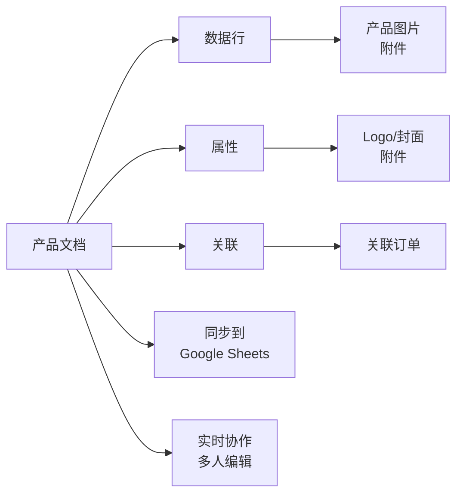

# Document 模块新增功能详解

## 🎯 概述

本次更新为 NexusBook API 的 Document 模块新增了四个核心功能模块，极大增强了多维表格的企业级能力。

---

## 📦 新增模块

### 1️⃣ **Relations (文档关联)** - `api/document/relations/`

**功能**: 提供文档间的双向关联管理

#### 核心特性

- ✅ **双向关联** - 自动维护关系的两端
- ✅ **级联策略** - 支持 5 种级联删除策略
- ✅ **关联验证** - 防止循环引用、重复关联
- ✅ **批量操作** - 批量创建/删除关联
- ✅ **关联配置** - 字段级别的关联规则

#### 级联删除策略

```typescript
enum CascadeDeleteStrategy {
  none,      // 不级联
  unlink,    // 仅删除关联关系
  soft,      // 软删除关联记录
  hard,      // 硬删除关联记录
  prevent,   // 阻止删除（如果有关联）
}
```

#### API 端点

| 端点 | 方法 | 说明 |
|------|------|------|
| `/doc/{docType}/{docId}/relations/configs` | GET | 获取关联配置 |
| `/doc/{docType}/{docId}/relations/configs` | POST | 创建关联配置 |
| `/doc/{docType}/{docId}/relations` | GET | 列出关联关系 |
| `/doc/{docType}/{docId}/relations` | POST | 创建关联 |
| `/doc/{docType}/{docId}/relations/batch` | POST | 批量创建关联 |
| `/doc/{docType}/{docId}/relations/{relationId}` | DELETE | 删除关联 |
| `/doc/{docType}/{docId}/relations/check-circular` | POST | 检查循环引用 |

#### 使用示例

**创建双向关联**:
```bash
curl -X POST 'https://open.nexusbook.com/api/v1/doc/order/123/relations' \
  -H 'Authorization: Bearer TOKEN' \
  -d '{
    "sourceRowId": "row-1",
    "fieldId": "products",
    "targetDocType": "product",
    "targetDocId": "456",
    "targetRowId": "row-2",
    "metadata": {"quantity": 10}
  }'
```

---

### 2️⃣ **Attachments (附件管理)** - `api/document/attachments/`

**功能**: 完整的附件存储和管理系统

#### 核心特性

- ✅ **文件上传** - 支持多种文件格式
- ✅ **版本管理** - 附件版本历史追踪
- ✅ **安全扫描** - 病毒和恶意内容检测
- ✅ **预览生成** - 图片、PDF 等文件的预览
- ✅ **存储配额** - 组织级别的存储限额管理
- ✅ **多存储后端** - 支持本地、S3、OSS、COS 等

#### 支持的存储提供商

```typescript
enum StorageProvider {
  local,    // 本地存储
  s3,       // AWS S3
  oss,      // 阿里云 OSS
  cos,      // 腾讯云 COS
  qiniu,    // 七牛云
  azure,    // Azure Blob
  gcs,      // Google Cloud Storage
}
```

#### 扫描状态

```typescript
enum ScanStatus {
  pending,    // 待扫描
  scanning,   // 扫描中
  completed,  // 已完成
  failed,     // 失败
  skipped,    // 跳过
}
```

#### API 端点

| 端点 | 方法 | 说明 |
|------|------|------|
| `/attachments/upload` | POST | 上传附件 |
| `/attachments/upload/batch` | POST | 批量上传 |
| `/attachments` | GET | 列出附件 |
| `/attachments/{id}` | GET | 获取详情 |
| `/attachments/{id}` | PATCH | 更新元数据 |
| `/attachments/{id}` | DELETE | 删除附件 |
| `/attachments/{id}/versions` | GET | 获取版本列表 |
| `/attachments/{id}/versions` | POST | 创建新版本 |
| `/attachments/{id}/preview` | GET | 获取预览 |
| `/attachments/{id}/download` | GET | 获取下载链接 |
| `/attachments/quota/{orgId}` | GET | 获取存储配额 |
| `/attachments/cleanup` | POST | 清理过期附件 |

#### 使用示例

**上传附件**:
```bash
curl -X POST 'https://open.nexusbook.com/api/v1/attachments/upload' \
  -H 'Authorization: Bearer TOKEN' \
  -F 'file=@image.png'
```

**在数据行中使用**:
```json
{
  "id": "row-1",
  "values": [
    {
      "fieldId": "productImages",
      "value": {
        "attachment": [
          {
            "id": "att-123",
            "fileName": "product.png",
            "url": "https://cdn.example.com/att-123.png",
            "mimeType": "image/png",
            "size": 102400
          }
        ]
      }
    }
  ]
}
```

**在属性中使用**:
```json
{
  "id": "prop-1",
  "properties": {
    "coverImage": "att-123",
    "logo": "att-456",
    "documents": ["att-789", "att-101"]
  }
}
```

---

### 3️⃣ **Sync (数据同步)** - `api/document/sync/`

**功能**: 与外部数据源的双向同步

#### 核心特性

- ✅ **多数据源** - Google Sheets、CSV、API、数据库等
- ✅ **双向同步** - 单向导入/导出 + 双向同步
- ✅ **冲突处理** - 5 种冲突解决策略
- ✅ **定时同步** - 基于 Cron 表达式
- ✅ **增量同步** - 仅同步变更数据
- ✅ **同步历史** - 完整的审计日志

#### 支持的数据源

```typescript
enum SyncSourceType {
  google_sheets,   // Google Sheets
  excel_online,    // Microsoft Excel Online
  csv,             // CSV 文件
  json_api,        // JSON API
  rest_api,        // REST API
  graphql_api,     // GraphQL API
  database,        // 数据库 (MySQL, PostgreSQL)
  webhook,         // Webhook
  airtable,        // Airtable
  notion,          // Notion
}
```

#### 同步模式

```typescript
enum SyncMode {
  one_way_import,   // 单向导入
  one_way_export,   // 单向导出
  two_way,          // 双向同步
}
```

#### 冲突解决策略

```typescript
enum ConflictResolution {
  keep_local,    // 保留本地
  keep_remote,   // 保留远程
  ask_user,      // 询问用户
  latest_wins,   // 最新修改胜出
  merge,         // 合并
}
```

#### API 端点

| 端点 | 方法 | 说明 |
|------|------|------|
| `/doc/{docType}/{docId}/sync` | GET | 列出同步配置 |
| `/doc/{docType}/{docId}/sync` | POST | 创建同步配置 |
| `/doc/{docType}/{docId}/sync/{configId}` | GET | 获取配置详情 |
| `/doc/{docType}/{docId}/sync/{configId}` | PUT | 更新配置 |
| `/doc/{docType}/{docId}/sync/{configId}` | DELETE | 删除配置 |
| `/doc/{docType}/{docId}/sync/{configId}/trigger` | POST | 手动触发同步 |
| `/doc/{docType}/{docId}/sync/{configId}/tasks` | GET | 获取同步历史 |
| `/doc/{docType}/{docId}/sync/{configId}/tasks/{taskId}` | GET | 获取任务详情 |
| `/doc/{docType}/{docId}/sync/{configId}/conflicts` | GET | 获取同步冲突 |
| `/doc/{docType}/{docId}/sync/{configId}/conflicts/{conflictId}/resolve` | POST | 解决冲突 |
| `/doc/{docType}/{docId}/sync/test-connection` | POST | 测试连接 |

#### 使用示例

**创建同步配置**:
```bash
curl -X POST 'https://open.nexusbook.com/api/v1/doc/product/123/sync' \
  -H 'Authorization: Bearer TOKEN' \
  -d '{
    "name": "Sync from Google Sheets",
    "sourceType": "google_sheets",
    "sourceConfig": {
      "spreadsheetId": "abc123",
      "sheetName": "Products"
    },
    "syncMode": "one_way_import",
    "schedule": "0 * /6 * * *",
    "fieldMapping": [
      {
        "localFieldId": "name",
        "remoteFieldName": "Product Name"
      },
      {
        "localFieldId": "price",
        "remoteFieldName": "Price"
      }
    ]
  }'
```

---

### 4️⃣ **Realtime (实时协作)** - `api/document/realtime/`

**功能**: 基于 Yjs CRDT 的实时协作

#### 核心特性

- ✅ **实时同步** - Yjs CRDT 自动冲突解决
- ✅ **在线状态** - 实时显示在线用户和光标
- ✅ **单元格锁定** - 临时锁定防止冲突
- ✅ **Awareness** - 用户状态和选择区域共享
- ✅ **操作历史** - 完整的协作操作记录
- ✅ **离线支持** - 离线编辑后自动同步

#### 技术实现

- **传输协议**: WebSocket / Server-Sent Events
- **CRDT 引擎**: Yjs (Y.Doc, Y.Array, Y.Map)
- **持久化**: 定期保存 Yjs 文档快照
- **增量更新**: 仅传输变更增量

#### 实时事件类型

```typescript
enum RealtimeEventType {
  yjs_update,         // Yjs 更新
  awareness_update,   // Awareness 更新
  user_joined,        // 用户加入
  user_left,          // 用户离开
  cell_locked,        // 单元格锁定
  cell_unlocked,      // 单元格解锁
  cursor_moved,       // 光标移动
  selection_changed,  // 选择变更
  comment_added,      // 评论添加
  data_changed,       // 数据变更
}
```

#### API 端点

| 端点 | 方法 | 说明 |
|------|------|------|
| `/realtime/doc/{docType}/{docId}/connect` | GET | 获取 WebSocket 连接信息 |
| `/realtime/doc/{docType}/{docId}/users` | GET | 获取在线用户 |
| `/realtime/doc/{docType}/{docId}/lock` | POST | 锁定单元格 |
| `/realtime/doc/{docType}/{docId}/unlock/{lockId}` | DELETE | 解锁单元格 |
| `/realtime/doc/{docType}/{docId}/locks` | GET | 获取锁定列表 |
| `/realtime/doc/{docType}/{docId}/snapshot` | GET | 获取 Yjs 快照 |
| `/realtime/doc/{docType}/{docId}/snapshot` | POST | 保存 Yjs 快照 |
| `/realtime/doc/{docType}/{docId}/snapshots` | GET | 获取快照历史 |
| `/realtime/doc/{docType}/{docId}/apply-update` | POST | 应用 Yjs 更新 |
| `/realtime/doc/{docType}/{docId}/awareness` | POST | 更新 Awareness |
| `/realtime/doc/{docType}/{docId}/events` | GET | 获取事件历史 |
| `/realtime/doc/{docType}/{docId}/disconnect-all` | POST | 断开所有会话 |

#### 使用示例

**WebSocket 连接流程**:

1. **获取连接信息**:
```bash
curl -X GET 'https://open.nexusbook.com/api/v1/realtime/doc/product/123/connect' \
  -H 'Authorization: Bearer TOKEN'
```

响应:
```json
{
  "success": true,
  "payload": {
    "wsUrl": "wss://open.nexusbook.com/api/v1/realtime/ws",
    "token": "eyJhbGc...",
    "expiresAt": "2024-12-05T16:00:00Z",
    "serverTime": "2024-12-05T15:00:00Z"
  }
}
```

2. **建立 WebSocket 连接**:
```javascript
const ws = new WebSocket('wss://open.nexusbook.com/api/v1/realtime/ws');

ws.onopen = () => {
  // 发送认证消息
  ws.send(JSON.stringify({
    type: 'auth',
    token: 'eyJhbGc...',
    docType: 'product',
    docId: '123'
  }));
};

ws.onmessage = (event) => {
  const data = JSON.parse(event.data);
  
  switch (data.type) {
    case 'yjs_update':
      // 应用 Yjs 更新
      Y.applyUpdate(ydoc, data.update);
      break;
      
    case 'awareness_update':
      // 更新 awareness 状态
      awareness.setStates(data.states);
      break;
      
    case 'user_joined':
      console.log('User joined:', data.user);
      break;
  }
};
```

3. **发送 Yjs 更新**:
```javascript
ydoc.on('update', (update) => {
  ws.send(JSON.stringify({
    type: 'yjs_update',
    update: Array.from(update)
  }));
});
```

---

## 🔗 模块关系图

```
Document Module
├── core/
│   ├── metadata.tsp       (字段定义)
│   ├── data.tsp           (数据行) ──┐
│   ├── properties.tsp     (文档属性)│
│   └── views.tsp          (视图)    │
│                                     │
├── relations/             (关联)    │ 使用附件
│   └── index.tsp                    │
│                                     │
├── attachments/           (附件) ◄──┘
│   └── index.tsp
│
├── sync/                  (同步)
│   └── index.tsp          └─► 同步数据到外部
│
└── realtime/              (实时协作)
    └── index.tsp          └─► WebSocket + Yjs
```

---

## 📊 数据流示例

### 场景：电商产品管理



**1. 产品数据行**:
```json
{
  "id": "row-1",
  "values": [
    {"fieldId": "name", "value": {"text": "iPhone 15"}},
    {"fieldId": "price", "value": {"currency": 999.00}},
    {"fieldId": "images", "value": {
      "attachment": [
        {"id": "att-1", "url": "https://cdn.../iphone-1.jpg"},
        {"id": "att-2", "url": "https://cdn.../iphone-2.jpg"}
      ]
    }}
  ]
}
```

**2. 产品属性**:
```json
{
  "id": "prop-1",
  "properties": {
    "brand": "Apple",
    "category": "Electronics",
    "logo": "att-logo-123",
    "coverImage": "att-cover-456"
  }
}
```

**3. 产品关联订单**:
```bash
POST /doc/product/123/relations
{
  "sourceRowId": "row-1",
  "fieldId": "orders",
  "targetDocType": "order",
  "targetDocId": "456",
  "targetRowId": "order-row-1"
}
```

**4. 同步到 Google Sheets**:
```bash
POST /doc/product/123/sync
{
  "name": "Export to Sheets",
  "sourceType": "google_sheets",
  "syncMode": "one_way_export",
  "schedule": "0 0 * * *"
}
```

**5. 多人实时编辑**:
```javascript
// 用户 A 和用户 B 同时编辑产品价格
// Yjs CRDT 自动合并冲突
```

---

## 🎨 完整性增强

### 在 common.tsp 中的 Value 类型已包含

```typescript
union Value {
  text: string,
  long_text: string,
  number: float64,
  // ...
  attachment: Attachment[],  // ✅ 附件数组
  relation: RelationRef[],   // ✅ 关联引用数组
  // ...
}
```

### 在 properties.tsp 中新增附件支持

```typescript
properties: {
  coverImage: "att-123",           // 单个附件
  documents: ["att-1", "att-2"],   // 附件数组
  attachments: ["att-3", "att-4"]  // 通用附件
}
```

---

## 🚀 实施建议

### Phase 1: 附件和关联（2 周）
1. 实现附件上传和存储
2. 实现文档间关联
3. 测试双向关联和级联删除

### Phase 2: 数据同步（2 周）
1. 实现 Google Sheets 同步
2. 实现冲突检测和解决
3. 添加定时任务支持

### Phase 3: 实时协作（3 周）
1. 集成 Yjs CRDT
2. 实现 WebSocket 服务
3. 实现 Awareness 和单元格锁定
4. 性能优化和压力测试

---

## 📝 总结

本次更新新增了 **2934 行代码**，涵盖：

- ✅ **4 个新模块**
- ✅ **40+ API 端点**
- ✅ **完整的 TypeSpec 类型定义**
- ✅ **详细的文档和示例**

这些功能使 NexusBook API 具备了**企业级多维表格**的完整能力，可与 Airtable 等产品竞争。
