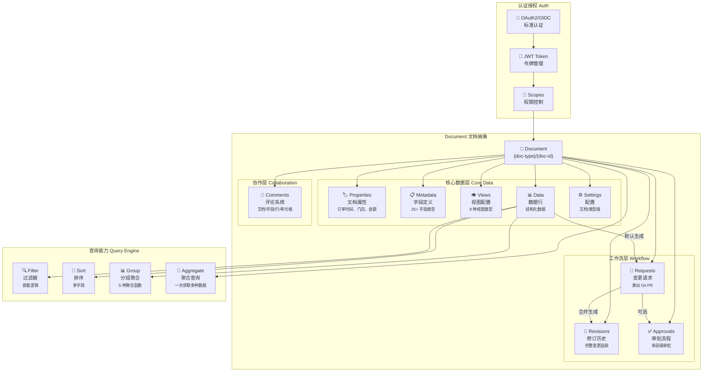
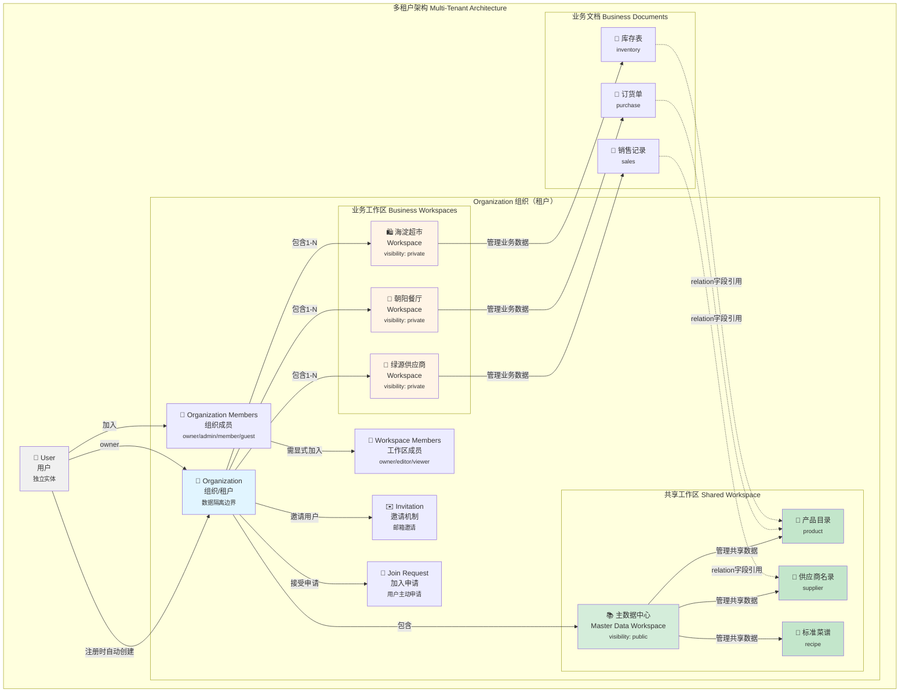
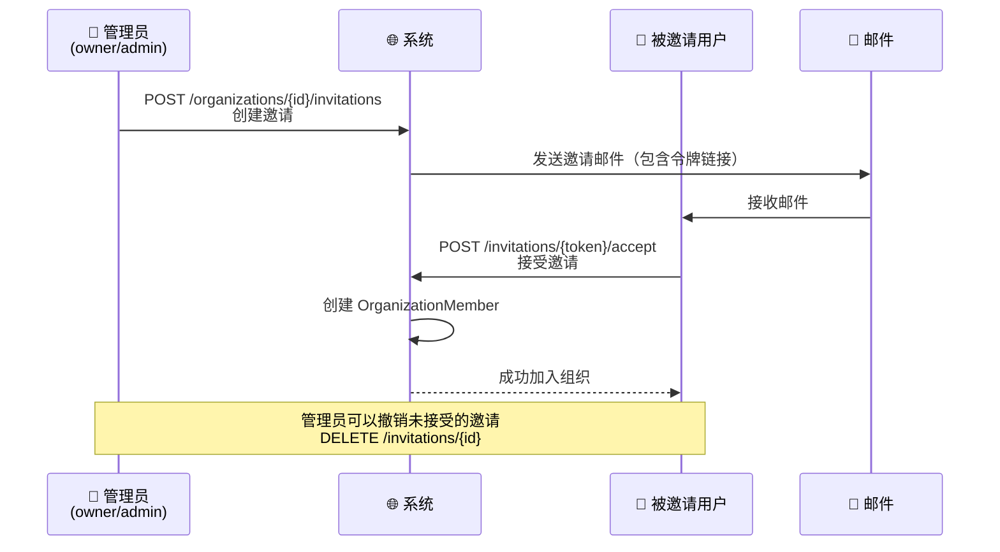
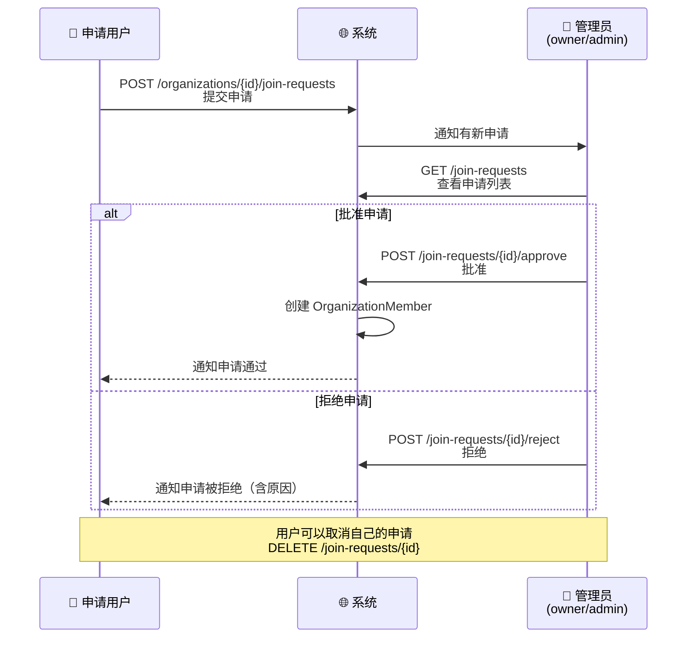
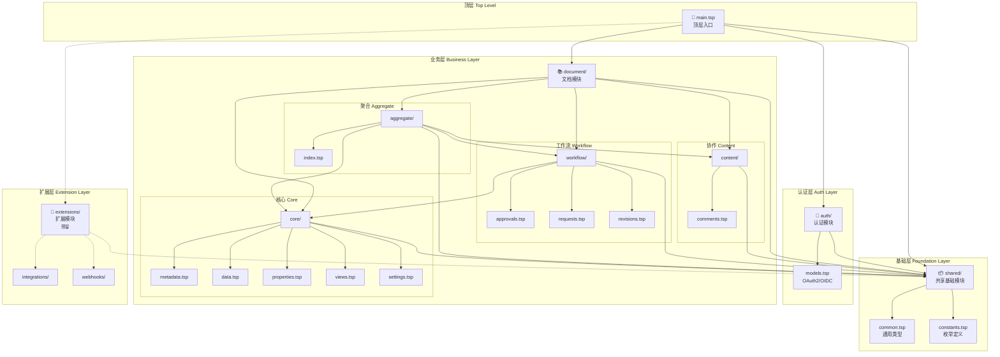
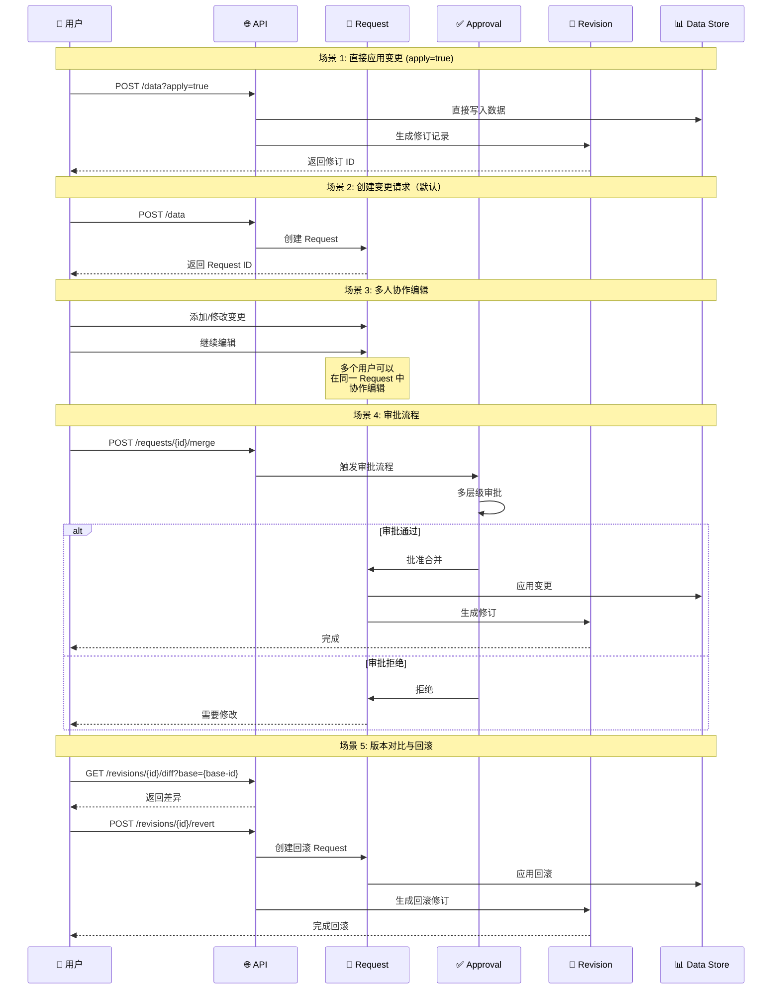
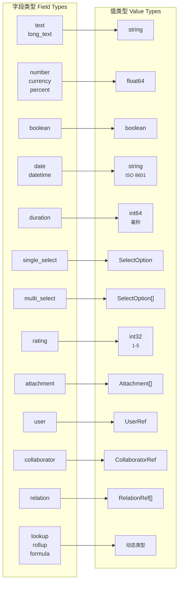

# 架构设计

本文档详细介绍 NexusBook API 的架构设计、目录结构和设计原则。

## Document 核心概念架构



**核心概念说明：**

- **Document** - 统一的文档抽象，支持多种业务类型（订货单、产品、库存等）
- **核心数据层** - Properties（文档属性）、Metadata（字段定义）、Views（视图）、Data（数据行）、Settings（配置）
- **协作层** - Comments 支持在文档任何位置进行评论和讨论
- **工作流层** - Requests（变更请求）→ Revisions（修订历史）+ Approvals（审批流程）
- **查询能力** - 强大的过滤、排序、分组和聚合查询
- **认证授权** - OAuth2/OIDC 标准认证，基于 Scope 的权限控制

## 租户数据核心概念架构

NexusBook 采用多租户 SaaS 架构，通过 Organization（组织）和 Workspace（工作区）实现数据隔离和权限管理，设计理念参考 Miro 的协作模式。



### 核心概念说明

#### 1. User（用户）- 独立身份实体
- **独立性**：用户是系统中的独立实体，不依附于任何组织
- **自动组织**：用户注册时，系统自动创建一个 Personal 类型的 Organization，用户成为该组织的 owner
- **多组织成员**：一个用户可以同时是多个 Organization 的成员
- **身份验证**：支持邮箱/密码、OAuth 第三方登录（Google、GitHub、微信、钉钉、飞书）

#### 2. Organization（组织）- 租户边界
- **租户隔离**：Organization 是数据隔离的基本单元，类似 Miro 的 Team
- **组织类型**：
  - `personal`：个人组织（用户注册时自动创建）
  - `team`：团队组织
  - `enterprise`：企业组织
- **成员角色**：
  - `owner`：组织拥有者，拥有所有权限（包括删除组织、转让所有权）
  - `admin`：管理员，可管理成员、工作区、组织设置
  - `member`：普通成员，可访问被授权的工作区
  - `guest`：访客，仅能访问特定资源
- **默认工作区**：创建组织时自动创建一个默认 Workspace

#### 3. Workspace（工作区）- 业务容器

Workspace 分为两种类型：**共享工作区**和**业务工作区**。

**📚 共享工作区（主数据中心）**：
- **特殊标识**：`visibility: public`，组织内所有成员可见
- **主要职责**：存放组织级共享主数据，供多个业务工作区引用
- **典型数据**：
  - 产品目录：餐饮集团的所有菜品信息
  - 供应商名录：全部合作供应商的联系信息
  - 标准菜谱：集团统一的菜品制作标准
  - 质量标准、标准操作流程等
- **权限控制**：
  - 数据管理员：`editor`（可编辑主数据）
  - 业务人员：`viewer`（只读访问，不能修改）

**🍜 业务工作区**：
- **业务隔离**：Workspace 是实际业务开展的容器，承载供应链管理的各种业务
- **现实映射**：
  - 🍜 餐厅：每家餐厅的独立运营管理（朝阳餐厅、西城餐厅等）
  - 🛍️ 超市：超市的采购与库存管理（海淀超市、西单超市等）
  - 🚚 供应商：供应商的订单与发货管理（绿源供应商、丰收农场等）
  - 🏭 仓库：仓库的进出库管理
- **显式加入**：组织成员需要被显式添加到 Workspace 才能访问其中的内容
- **成员角色**：
  - `owner`：工作区负责人，可管理工作区和成员
  - `editor`：编辑者，可创建和编辑文档
  - `viewer`：查看者，只读权限
- **可见性控制**：
  - `public`：组织内所有成员可见
  - `private`：仅成员可见（建议业务工作区使用）

#### 4. Workspace 与 Document 的关系

**一对多关系**：一个 Workspace 可以包含多个 Document

**共享工作区的 Document**：
- 产品目录 Document（`product` 类型）
- 供应商名录 Document（`supplier` 类型）
- 标准菜谱 Document（`recipe` 类型）

**业务工作区的 Document**：
- 订货单 Document（`purchase` 类型）
- 库存表 Document（`inventory` 类型）
- 销售记录 Document（`sales` 类型）
- 发货单 Document（`shipment` 类型）

**跨 Workspace 数据引用**：
- 业务工作区的 Document 可以通过 `relation` 字段类型引用共享工作区的主数据
- 例如：餐厅的订货单中的“产品”字段关联到主数据中心的“产品目录”
- 实现数据一致性：主数据更新后，所有引用处自动生效

**权限继承**：Document 的访问权限基于 Workspace 成员权限

#### 5. 成员管理机制

**邀请流程（Invitation）**：


**加入申请流程（Join Request）**：


#### 6. 角色权限矩阵

**Organization 角色权限**：

| 操作 | owner | admin | member | guest |
|------|-------|-------|--------|-------|
| 查看组织信息 | ✅ | ✅ | ✅ | ✅ |
| 更新组织设置 | ✅ | ✅ | ❌ | ❌ |
| 删除组织 | ✅ | ❌ | ❌ | ❌ |
| 邀请成员 | ✅ | ✅ | ❌ | ❌ |
| 管理成员角色 | ✅ | ✅ | ❌ | ❌ |
| 移除成员 | ✅ | ✅ | ❌ | ❌ |
| 创建工作区 | ✅ | ✅ | ❌ | ❌ |
| 管理工作区 | ✅ | ✅ | ❌ | ❌ |

**Workspace 角色权限**：

| 操作 | owner | editor | viewer |
|------|-------|--------|--------|
| 查看工作区 | ✅ | ✅ | ✅ |
| 查看文档 | ✅ | ✅ | ✅ |
| 创建文档 | ✅ | ✅ | ❌ |
| 编辑文档 | ✅ | ✅ | ❌ |
| 删除文档 | ✅ | ✅ | ❌ |
| 管理成员 | ✅ | ❌ | ❌ |
| 工作区设置 | ✅ | ❌ | ❌ |

#### 7. 数据隔离与安全

**隔离层级**：
```
Organization（租户级隔离）
  └── Workspace（业务级隔离）
        └── Document（文档级隔离）
              ├── Properties（文档属性）
              ├── Metadata（字段定义）
              ├── Data（数据行）
              └── Views（视图配置）
```

**权限校验流程**：
1. **用户身份验证**：验证 JWT Token
2. **组织成员检查**：确认用户是该 Organization 的成员
3. **工作区权限检查**：确认用户在该 Workspace 中的角色
4. **操作权限验证**：根据角色验证是否有权限执行操作
5. **数据访问控制**：仅返回用户有权访问的数据

### 典型使用场景

#### 场景 1：新用户注册
```bash
# 1. 用户注册
POST /api/v1/auth/register
{
  "email": "user@example.com",
  "password": "******",
  "displayName": "张三"
}

# 系统自动执行：
# - 创建 User 记录
# - 创建个人 Organization（type: personal）
# - 创建默认 Workspace
# - 设置用户为 Organization owner
```

#### 场景 2：创建团队组织
```bash
# 2. 创建餐饮集团组织
POST /api/v1/organizations
{
  "name": "鲜食餐饮集团",
  "slug": "fresh-dining",
  "type": "enterprise",
  "description": "餐饮集团供应链管理"
}

# 返回：
# - Organization ID
# - 自动创建默认 Workspace
# - 创建者成为 owner
```

#### 场景 3：创建主数据中心
```bash
# 3. 创建共享的主数据工作区
POST /api/v1/organizations/{orgId}/workspaces
{
  "name": "📚 主数据中心",
  "slug": "master-data",
  "description": "集团共享主数据管理",
  "visibility": "public",  // 组织内所有成员可见
  "settings": {
    "isShared": true,      // 自定义标识：共享工作区
    "isMasterData": true   // 自定义标识：主数据工作区
  }
}

# 4. 添加数据管理员（可编辑主数据）
POST /api/v1/organizations/{orgId}/workspaces/{masterDataWsId}/members
{
  "userId": "admin-user-id",
  "role": "editor"  // 有权编辑产品目录
}

# 5. 在主数据中心创建产品目录
POST /api/v1/doc/product/create
{
  "workspaceId": "{masterDataWsId}",
  "name": "集团产品目录",
  "metadata": {
    "fields": [
      {"id": "name", "name": "菜品名称", "type": "text"},
      {"id": "category", "name": "类别", "type": "single_select"},
      {"id": "unit_price", "name": "标准价格", "type": "currency"},
      {"id": "unit", "name": "计量单位", "type": "text"}
    ]
  }
}

# 6. 添加产品数据
POST /api/v1/doc/product/{productDocId}/data
{
  "values": [
    {"fieldId": "name", "value": {"text": "宫保鸡丁"}},
    {"fieldId": "category", "value": {"selectOption": {"id": "main-course"}}},
    {"fieldId": "unit_price", "value": {"currency": 48.00}},
    {"fieldId": "unit", "value": {"text": "份"}}
  ]
}
```

#### 场景 4：邀请团队成员
```bash
# 7. 邀请成员加入组织
POST /api/v1/organizations/{orgId}/invitations
{
  "email": "manager@example.com",
  "role": "admin",
  "message": "欢迎加入餐饮集团管理团队！"
}

# 8. 被邀请人接受邀请
POST /api/v1/invitations/{token}/accept

# 9. 将餐厅经理加入主数据中心（viewer 角色）
POST /api/v1/organizations/{orgId}/workspaces/{masterDataWsId}/members
{
  "userId": "manager-user-id",
  "role": "viewer"  // 只读访问，不能修改主数据
}
```

#### 场景 5：创建业务工作区
```bash
# 10a. 创建餐厅工作区
POST /api/v1/organizations/{orgId}/workspaces
{
  "name": "🍜 朝阳餐厅",
  "slug": "chaoyang-restaurant",
  "description": "朝阳店运营管理",
  "visibility": "private"
}

# 10b. 创建超市工作区
POST /api/v1/organizations/{orgId}/workspaces
{
  "name": "🛍️ 海淀超市",
  "slug": "haidian-supermarket",
  "description": "海淀店采购与库存管理",
  "visibility": "private"
}

# 10c. 创建供应商工作区
POST /api/v1/organizations/{orgId}/workspaces
{
  "name": "🚚 绿源供应商",
  "slug": "greensource-supplier",
  "description": "绿源供应商订单管理",
  "visibility": "private"
}

# 11. 添加餐厅经理到工作区
POST /api/v1/organizations/{orgId}/workspaces/{restaurantWsId}/members
{
  "userId": "restaurant-manager-id",
  "role": "owner"  // 餐厅负责人
}

# 12. 添加超市采购员到工作区
POST /api/v1/organizations/{orgId}/workspaces/{supermarketWsId}/members
{
  "userId": "purchaser-user-id",
  "role": "editor"  // 可编辑订货单
}
```

#### 场景 6：创建订货单并引用主数据
```bash
# 13. 在餐厅工作区创建订货单
POST /api/v1/doc/purchase/create
{
  "workspaceId": "{restaurantWsId}",
  "name": "2024年12月订货单",
  "metadata": {
    "fields": [
      {
        "id": "product",
        "name": "产品",
        "type": "relation",
        "config": {
          // 关联到主数据中心的产品目录
          "targetWorkspace": "{masterDataWsId}",
          "targetDocument": "{productDocId}",
          "displayFields": ["name", "category", "unit_price"]
        }
      },
      {"id": "quantity", "name": "数量", "type": "number"},
      {"id": "total_price", "name": "总价", "type": "currency"}
    ]
  }
}

# 14. 添加订货数据（引用主数据）
POST /api/v1/doc/purchase/{purchaseDocId}/data
{
  "values": [
    {
      "fieldId": "product",
      "value": {
        "relation": {
          // 跨 Workspace 引用主数据中心的产品
          "workspaceId": "{masterDataWsId}",
          "documentId": "{productDocId}",
          "rowId": "product-001"  // 宫保鸡丁
        }
      }
    },
    {"fieldId": "quantity", "value": {"number": 50}},
    {"fieldId": "total_price", "value": {"currency": 2400.00}}
  ]
}

# 优势：
# - 产品信息统一维护，主数据中心更新后所有引用处自动生效
# - 避免多处重复录入相同产品，保证数据一致性
# - 集团级产品价格调整时，所有餐厅的订货单自动同步
```

#### 场景 7：查看共享数据

### 架构优势

1. **灵活的组织结构**：支持个人、团队、企业多种组织类型
2. **细粒度权限控制**：Organization 和 Workspace 双层角色体系
3. **业务隔离**：不同业务（餐厅、超市、供应商、仓库）独立管理
4. **协作友好**：完善的邀请和申请机制
5. **可扩展性**：支持无限扩展 Workspace 和 Document
6. **主数据管理**：通过共享 Workspace 实现组织级主数据统一管理
7. **数据一致性**：跨 Workspace 引用机制，主数据更新自动同步到所有引用处

## 目录结构

```
api/
├── main.tsp                    # 顶层入口
│
├── shared/                     # 共享基础模块
│   ├── common.tsp             # 通用类型（ApiResponse, Filter, Value...）
│   ├── constants.tsp          # 枚举定义
│   └── index.tsp              # 模块入口
│
├── auth/                       # 认证模块
│   ├── models.tsp             # OAuth2/OIDC 模型
│   └── index.tsp              # 模块入口
│
└── document/                   # 文档模块
    ├── core/                  # 核心数据模型
    │   ├── metadata.tsp       # 字段定义
    │   ├── data.tsp           # 数据行管理
    │   ├── properties.tsp     # 文档属性
    │   ├── views.tsp          # 视图配置
    │   ├── settings.tsp       # 设置
    │   └── index.tsp
    │
    ├── content/               # 内容协作
    │   ├── comments.tsp       # 评论系统
    │   └── index.tsp
    │
    ├── workflow/              # 工作流管理
    │   ├── approvals.tsp      # 审批流程
    │   ├── requests.tsp       # 变更请求
    │   ├── revisions.tsp      # 修订历史
    │   └── index.tsp
    │
    ├── aggregate/             # 聚合查询
    │   └── index.tsp
    │
    ├── operations/            # 预留目录
    └── index.tsp
```

## 架构层次



**依赖关系说明：**

- **实线箭头** - 直接依赖关系
- **虚线箭头** - 预留/可选依赖
- **颜色分层** - 蓝色（顶层）→ 橙色（基础）→ 粉色（认证）→ 绿色（业务）→ 紫色（扩展）

**依赖原则：**

1. **单向依赖** - 上层依赖下层，下层不依赖上层
2. **基础优先** - 所有模块都依赖 shared 基础层
3. **模块独立** - 同层模块之间尽量独立
4. **聚合组合** - aggregate 模块组合其他模块的功能

## 设计原则

1. **分层架构** - 清晰的 4 层结构（shared → auth → document → extensions）
2. **单一职责** - 每个模块功能明确，职责单一
3. **依赖管理** - 明确的依赖关系，避免循环依赖
4. **可扩展性** - 预留扩展目录，支持动态扩展
5. **模块化** - 高内聚低耦合，便于维护和测试

## 模块职责

| 模块 | 职责 | 主要内容 |
|------|------|---------|
| **shared** | 基础设施 | 通用类型、错误码、过滤器、聚合函数 |
| **auth** | 认证授权 | OAuth2、OIDC、JWT、用户信息 |
| **document/core** | 核心数据 | 元数据、数据行、属性、视图、设置 |
| **document/content** | 内容协作 | 评论系统 |
| **document/workflow** | 工作流 | 审批、请求、修订 |
| **document/aggregate** | 聚合查询 | 一次性获取多种数据 |
| **extensions** | 扩展功能 | 集成、Webhooks（预留） |

## 数据流与工作流



**工作流说明：**

1. **直接应用** - 使用 `?apply=true` 参数直接写入数据并生成修订
2. **变更请求** - 默认创建 Request，支持多人协作编辑
3. **审批流程** - 可选的多层级审批机制
4. **修订追踪** - 所有变更都会生成修订记录
5. **版本回滚** - 支持对比和回滚到任意历史版本

## 字段类型与值类型映射



## 文档类型路由

**Provider 模式：**

```
/api/v1/doc/{doc-type}/{doc-id}
              ↓
        Provider 解析
              ↓
    ┌─────────┼─────────┐
    ▼         ▼         ▼
 Product  Purchase   Invoice
 Provider  Provider  Provider
```

**扩展新类型：**
- 实现对应的 Provider
- 注册到路由系统
- 无需修改 API 定义

## 资源抽象

```
Doc: {doc-type} + {doc-id}
  ├── properties    # 文档属性（订单时间、门店、金额等）
  ├── metadata      # 字段定义
  ├── views         # 视图配置
  ├── data          # 数据行
  ├── comments      # 评论
  ├── revisions     # 修订历史
  ├── requests      # 变更请求
  ├── approval      # 审批流程
  └── settings      # 设置
```

## 下一步

- 查看 [API 参考文档](../references/api-reference.md) 了解详细的 API 端点
- 查看 [开发指南](./development.md) 了解如何扩展和修改 API
- 查看 [数据操作指南](./data-operations.md) 了解查询和过滤功能
