# 架构设计

本文档详细介绍 NexusBook API 的架构设计、目录结构和设计原则。

## Document 核心概念架构



**核心概念说明：**

- **Document** - 统一的文档抽象，支持多种业务类型（订货单、产品、库存等）
- **核心数据层** - Properties（文档属性）、Metadata（字段定义）、Views（视图）、Data（数据行）、Settings（配置）
- **协作层** - Comments 支持在文档任何位置进行评论和讨论
- **工作流层** - Requests（变更请求）→ Revisions（修订历史）+ Approvals（审批流程）
- **查询能力** - 强大的过滤、排序、分组和聚合查询
- **认证授权** - OAuth2/OIDC 标准认证，基于 Scope 的权限控制

## 租户数据核心概念架构

NexusBook 采用多租户 SaaS 架构，通过 Organization（组织）和 Workspace（工作区）实现数据隔离和权限管理，设计理念参考 Miro 的协作模式。



### 核心概念说明

#### 1. User（用户）- 独立身份实体
- **独立性**：用户是系统中的独立实体，不依附于任何组织
- **自动组织**：用户注册时，系统自动创建一个 Personal 类型的 Organization，用户成为该组织的 owner
- **多组织成员**：一个用户可以同时是多个 Organization 的成员
- **身份验证**：支持邮箱/密码、OAuth 第三方登录（Google、GitHub、微信、钉钉、飞书）

#### 2. Organization（组织）- 租户边界
- **租户隔离**：Organization 是数据隔离的基本单元，类似 Miro 的 Team
- **组织类型**：
  - `personal`：个人组织（用户注册时自动创建）
  - `team`：团队组织
  - `enterprise`：企业组织
- **成员角色**：
  - `owner`：组织拥有者，拥有所有权限（包括删除组织、转让所有权）
  - `admin`：管理员，可管理成员、工作区、组织设置
  - `member`：普通成员，可访问被授权的工作区
  - `guest`：访客，仅能访问特定资源
- **默认工作区**：创建组织时自动创建一个默认 Workspace，通常作为主数据中心使用

#### 3. Workspace（工作区）- 业务容器

Workspace 是 Organization 内的数据组织容器，所有 Workspace 地位平等，通过**数据源引用**机制实现跨工作区数据共享。

**基本特性**：
- **数据隔离**：每个 Workspace 的 Document 数据默认独立隔离
- **灵活共享**：可选择性地引用其他 Workspace 的特定 document type 数据
- **显式加入**：组织成员需要被显式添加到 Workspace 才能访问其中的内容
- **成员角色**：
  - `owner`：工作区负责人，可管理工作区和成员
  - `editor`：编辑者，可创建和编辑文档
  - `viewer`：查看者，只读权限
- **可见性控制**：
  - `public`：组织内所有成员可见（建议主数据中心使用）
  - `private`：仅成员可见（建议业务工作区使用）

**典型场景**：
- 📚 **主数据中心**：存放组织级共享主数据（产品目录、供应商名录、标准菜谱等）
- 🍜 **餐厅工作区**：每家餐厅的独立运营管理（朝阳餐厅、西城餐厅等）
- 🛍️ **超市工作区**：超市的采购与库存管理（海淀超市、西单超市等）
- 🚚 **供应商工作区**：供应商的订单与发货管理（绿源供应商、丰收农场等）
- 🏭 **仓库工作区**：仓库的进出库管理

#### 4. 数据源引用机制（Data Source Reference）

**核心设计**：

创建 Workspace 时，可以配置**数据源引用**，指定使用其他 Workspace 的特定 document type 数据。

```typescript
// 创建 Workspace 时配置数据源引用
POST /api/v1/organizations/{orgId}/workspaces
{
  "name": "🍜 朝阳餐厅",
  "slug": "chaoyang-restaurant",
  "visibility": "private",
  "dataSourceReferences": [
    {
      "sourceWorkspaceId": "workspace-a",  // 主数据中心 ID
      "documentType": "product",           // 引用的文档类型
      "mode": "readonly",                  // 只读模式
      "priority": 1                        // 优先级（用于排序）
    }
  ]
}
```

**数据管理上下文隔离**：

⚠️ **重要原则**：用户在管理数据时，必须进入特定 Workspace 的上下文，只能修改当前 Workspace 的数据。

```bash
# ✅ 正确：在 Workspace B 中只能修改 B 的本地数据
PATCH /api/v1/workspaces/{workspace-b}/documents/product/data/{rowId}
{
  "values": [
    {"fieldId": "name", "value": {"text": "本店特色菜"}}
  ]
}
# 只能修改 workspace-b 自己的 product 数据

# ❌ 错误：不能在 Workspace B 中修改引用的数据
PATCH /api/v1/workspaces/{workspace-b}/documents/product/data/{product-from-workspace-a}
# 后端应返回 403 Forbidden，因为这是引用数据，只读

# ✅ 正确：要修改主数据，必须切换到主数据中心的上下文
PATCH /api/v1/workspaces/{workspace-a}/documents/product/data/{rowId}
{
  "values": [
    {"fieldId": "unit_price", "value": {"currency": 52.00}}
  ]
}
# 必须有 workspace-a 的 editor 权限
```

**🔐 安全防护机制**：

虽然 API 路径包含 `workspaceId`，但**不会**存在篡改风险，因为后端会进行严格的权限校验：

```typescript
// 后端权限校验伪代码
async function handleWorkspaceRequest(
  workspaceId: string,  // 来自 URL 路径
  userId: string,       // 来自认证 token
  action: 'read' | 'write'
) {
  // 步骤1：验证用户是否是该 Workspace 的成员
  const membership = await getWorkspaceMembership(workspaceId, userId);
  if (!membership) {
    throw new ForbiddenError(
      `User ${userId} is not a member of workspace ${workspaceId}`
    );
  }
  
  // 步骤2：验证用户角色是否有对应权限
  const hasPermission = checkRolePermission(membership.role, action);
  if (!hasPermission) {
    throw new ForbiddenError(
      `Role ${membership.role} does not have ${action} permission`
    );
  }
  
  // 步骤3：对于写操作，额外验证数据来源
  if (action === 'write') {
    const data = await getData(rowId);
    if (data._source.workspaceId !== workspaceId) {
      throw new ForbiddenError(
        `Cannot modify data from workspace ${data._source.workspaceId}`
      );
    }
  }
  
  // 通过所有检查，允许操作
  return true;
}
```

**安全保障**：

1. ✅ **认证层**：JWT Token 验证用户身份
2. ✅ **成员校验**：检查用户是否是该 Workspace 成员
3. ✅ **角色权限**：检查用户角色是否有操作权限
4. ✅ **数据来源**：检查数据是否属于当前 Workspace
5. ✅ **审计日志**：记录所有访问尝试（包括失败的）

**恶意请求示例**：

```bash
# 恶意用户尝试访问无权限的 Workspace
PATCH /api/v1/workspaces/{competitor-workspace}/documents/product/data/{rowId}
Authorization: Bearer <attacker-token>

# 后端响应：
HTTP/1.1 403 Forbidden
{
  "error": {
    "code": "WORKSPACE_ACCESS_DENIED",
    "message": "User is not a member of workspace competitor-workspace",
    "workspaceId": "competitor-workspace",
    "userId": "attacker-id",
    "timestamp": "2024-12-12T16:00:00Z"
  }
}

# 同时记录审计日志：
# [SECURITY] Unauthorized workspace access attempt
#   User: attacker-id
#   Workspace: competitor-workspace
#   Action: WRITE
#   IP: 192.168.1.100
#   Timestamp: 2024-12-12T16:00:00Z
```

**查询逻辑**：

当在 Workspace B 中查询 product 类型的 Document 数据时：

```bash
GET /api/v1/workspaces/{workspace-b}/documents/product/data
```

后端会自动合并数据：
1. **本地数据**：Workspace B 自己的 product 数据（可编辑）
2. **引用数据**：Workspace A 的 product 数据（只读）

```json
{
  "items": [
    {
      "id": "product-001",
      "name": "宫保鸡丁",
      "price": 48.00,
      "_source": {
        "workspaceId": "workspace-a",
        "workspaceName": "主数据中心",
        "readonly": true  // 标记为只读
      },
      "_permissions": {
        "canEdit": false,   // 不可编辑
        "canDelete": false  // 不可删除
      }
    },
    {
      "id": "product-002",
      "name": "本店特色菜",
      "price": 58.00,
      "_source": {
        "workspaceId": "workspace-b",
        "workspaceName": "朝阳餐厅",
        "readonly": false  // 可编辑
      },
      "_permissions": {
        "canEdit": true,    // 可编辑
        "canDelete": true   // 可删除
      }
    }
  ],
  "meta": {
    "totalCount": 2,
    "sources": [
      {"workspaceId": "workspace-b", "count": 1, "editable": true},
      {"workspaceId": "workspace-a", "count": 1, "editable": false}
    ]
  }
}
```

**核心特性**：

1. **选择性共享**：只引用需要的 document type，不是全部共享
2. **严格只读**：引用的数据不能修改，避免数据污染
3. **上下文隔离**：用户必须切换到源 Workspace 才能修改源数据
4. **数据标记**：明确标记数据来源和权限，前端可差异化显示
5. **权限校验**：用户必须对源 Workspace 有读权限才能看到引用数据
6. **多源引用**：可引用多个 Workspace 的不同 document type

**优势分析**：

✅ **架构统一**：所有 Workspace 地位平等，没有"特殊"工作区
✅ **灵活性高**：可以精确控制哪些数据共享，哪些隔离
✅ **权限清晰**：本地数据可编辑，引用数据只读，上下文隔离
✅ **扩展性好**：支持复杂的数据共享关系
✅ **数据安全**：源数据变更不会影响引用方逻辑，且只能在源 Workspace 修改
✅ **职责分离**：主数据管理员在主数据中心维护，业务人员在各自 Workspace 使用

**🛡️ 安全最佳实践**：

1. **永远不信任客户端输入**：
   - ❌ 错误：依赖前端校验 workspaceId
   - ✅ 正确：后端总是验证 workspaceId 与用户权限

2. **使用数据库关联查询**：
   ```sql
   -- ✅ 好：通过 JOIN 确保用户有权限
   SELECT d.* FROM documents d
   JOIN workspace_members wm 
     ON d.workspace_id = wm.workspace_id 
     AND wm.user_id = :userId
   WHERE d.workspace_id = :workspaceId;
   
   -- ❌ 差：直接查询，没有权限检查
   SELECT * FROM documents 
   WHERE workspace_id = :workspaceId;
   ```

3. **实现资源级权限控制**：
   ```typescript
   // ✅ 好：每个操作都检查权限
   @RequireWorkspaceMembership('editor')
   async updateDocument(workspaceId, docId, userId) {
     // 装饰器自动检查成员资格和角色
   }
   
   // ❌ 差：仅检查用户登录状态
   @RequireAuth()
   async updateDocument(workspaceId, docId, userId) {
     // 缺少 Workspace 成员校验
   }
   ```

4. **记录详细审计日志**：
   ```typescript
   // 记录所有失败的访问尝试
   if (!hasPermission) {
     await auditLog.create({
       level: 'SECURITY',
       action: 'WORKSPACE_ACCESS_DENIED',
       userId,
       workspaceId,
       ip: request.ip,
       userAgent: request.headers['user-agent'],
       timestamp: new Date()
     });
     
     // 如果同一用户短时间内多次失败，发送告警
     await checkForSuspiciousActivity(userId);
   }
   ```

5. **限制访问频率**：
   ```typescript
   // 防止暴力枚举 workspaceId
   @RateLimit({
     maxAttempts: 10,
     windowMs: 60000,  // 1分钟内最多10次
     keyGenerator: (req) => `${req.userId}:workspace-access`
   })
   async accessWorkspace(workspaceId, userId) {
     // ...
   }
   ```

#### 5. 成员管理机制

**邀请流程（Invitation）**：


**加入申请流程（Join Request）**：


#### 6. 角色权限矩阵

**Organization 角色权限**：

| 操作 | owner | admin | member | guest |
|------|-------|-------|--------|-------|
| 查看组织信息 | ✅ | ✅ | ✅ | ✅ |
| 更新组织设置 | ✅ | ✅ | ❌ | ❌ |
| 删除组织 | ✅ | ❌ | ❌ | ❌ |
| 邀请成员 | ✅ | ✅ | ❌ | ❌ |
| 管理成员角色 | ✅ | ✅ | ❌ | ❌ |
| 移除成员 | ✅ | ✅ | ❌ | ❌ |
| 创建工作区 | ✅ | ✅ | ❌ | ❌ |
| 管理工作区 | ✅ | ✅ | ❌ | ❌ |

**Workspace 角色权限**：

| 操作 | owner | editor | viewer |
|------|-------|--------|--------|
| 查看工作区 | ✅ | ✅ | ✅ |
| 查看文档 | ✅ | ✅ | ✅ |
| 创建文档 | ✅ | ✅ | ❌ |
| 编辑文档 | ✅ | ✅ | ❌ |
| 删除文档 | ✅ | ✅ | ❌ |
| 管理成员 | ✅ | ❌ | ❌ |
| 工作区设置 | ✅ | ❌ | ❌ |

#### 7. 数据隔离与安全

**隔离层级**：
```
Organization（租户级隔离）
  └── Workspace（业务级隔离）
        └── Document（文档级隔离）
              ├── Properties（文档属性）
              ├── Metadata（字段定义）
              ├── Data（数据行）
              └── Views（视图配置）
```

**权限校验流程**：
1. **用户身份验证**：验证 JWT Token
2. **组织成员检查**：确认用户是该 Organization 的成员
3. **工作区权限检查**：确认用户在该 Workspace 中的角色
4. **操作权限验证**：根据角色验证是否有权限执行操作
5. **数据访问控制**：仅返回用户有权访问的数据

### 典型使用场景

#### 场景 1：新用户注册
```bash
# 1. 用户注册
POST /api/v1/auth/register
{
  "email": "user@example.com",
  "password": "******",
  "displayName": "张三"
}

# 系统自动执行：
# - 创建 User 记录
# - 创建个人 Organization（type: personal）
# - 创建默认 Workspace
# - 设置用户为 Organization owner
```

#### 场景 2：创建团队组织
```bash
# 2. 创建餐饮集团组织
POST /api/v1/organizations
{
  "name": "鲜食餐饮集团",
  "slug": "fresh-dining",
  "type": "enterprise",
  "description": "餐饮集团供应链管理"
}

# 系统自动执行：
# - 创建 Organization
# - 自动创建默认 Workspace（通常作为主数据中心使用）
# - 创建者成为 owner
```

#### 场景 3：配置主数据中心
```bash
# 3. 将默认 Workspace 配置为主数据中心
PATCH /api/v1/organizations/{orgId}/workspaces/{defaultWsId}
{
  "name": "📚 主数据中心",
  "slug": "master-data",
  "description": "集团共享主数据管理",
  "visibility": "public"  // 组织内所有成员可见
}

# 4. 添加数据管理员
POST /api/v1/organizations/{orgId}/workspaces/{defaultWsId}/members
{
  "userId": "admin-user-id",
  "role": "editor"  // 有权编辑主数据
}

# 5. 在主数据中心创建产品目录
POST /api/v1/doc/product/create
{
  "workspaceId": "{defaultWsId}",
  "name": "集团产品目录",
  "metadata": {
    "fields": [
      {"id": "name", "name": "菜品名称", "type": "text"},
      {"id": "category", "name": "类别", "type": "single_select"},
      {"id": "unit_price", "name": "标准价格", "type": "currency"},
      {"id": "unit", "name": "计量单位", "type": "text"}
    ]
  }
}

# 6. 添加产品数据
POST /api/v1/doc/product/{productDocId}/data
{
  "values": [
    {"fieldId": "name", "value": {"text": "宫保鸡丁"}},
    {"fieldId": "category", "value": {"selectOption": {"id": "main-course"}}},
    {"fieldId": "unit_price", "value": {"currency": 48.00}},
    {"fieldId": "unit", "value": {"text": "份"}}
  ]
}
```

#### 场景 4：邀请团队成员
```bash
# 7. 邀请成员加入组织
POST /api/v1/organizations/{orgId}/invitations
{
  "email": "manager@example.com",
  "role": "admin",
  "message": "欢迎加入餐饮集团管理团队！"
}

# 8. 被邀请人接受邀请
POST /api/v1/invitations/{token}/accept
```

#### 场景 5：创建并引用主数据的业务工作区
```bash
# 9. 创建餐厅工作区（引用主数据中心的 product 数据）
POST /api/v1/organizations/{orgId}/workspaces
{
  "name": "🍜 朝阳餐厅",
  "slug": "chaoyang-restaurant",
  "description": "朝阳店运营管理",
  "visibility": "private",
  "dataSourceReferences": [
    {
      "sourceWorkspaceId": "{masterDataWsId}",  // 引用主数据中心
      "documentType": "product",                // 引用产品数据
      "mode": "readonly",
      "priority": 1
    }
  ]
}

# 10. 创建超市工作区（引用 product 和 supplier）
POST /api/v1/organizations/{orgId}/workspaces
{
  "name": "🛍️ 海淀超市",
  "slug": "haidian-supermarket",
  "description": "海淀店采购与库存管理",
  "visibility": "private",
  "dataSourceReferences": [
    {
      "sourceWorkspaceId": "{masterDataWsId}",
      "documentType": "product",
      "mode": "readonly",
      "priority": 1
    },
    {
      "sourceWorkspaceId": "{masterDataWsId}",
      "documentType": "supplier",
      "mode": "readonly",
      "priority": 2
    }
  ]
}

# 11. 创建供应商工作区（不引用任何数据，独立管理）
POST /api/v1/organizations/{orgId}/workspaces
{
  "name": "🚚 绿源供应商",
  "slug": "greensource-supplier",
  "description": "绿源供应商订单管理",
  "visibility": "private"
  // 不配置 dataSourceReferences，数据完全独立
}

# 12. 添加餐厅经理
POST /api/v1/organizations/{orgId}/workspaces/{restaurantWsId}/members
{
  "userId": "restaurant-manager-id",
  "role": "owner"
}
```

#### 场景 6：查询合并数据
```bash
# 13. 在餐厅工作区查询 product 数据
GET /api/v1/workspaces/{restaurantWsId}/documents/product/data

# 返回结果（自动合并本地和引用数据）
{
  "items": [
    {
      "id": "product-001",
      "name": "宫保鸡丁",
      "price": 48.00,
      "_source": {
        "workspaceId": "{masterDataWsId}",
        "workspaceName": "主数据中心",
        "readonly": true  // 来自主数据中心，只读
      }
    },
    {
      "id": "product-local-001",
      "name": "本店特色菜",
      "price": 68.00,
      "_source": {
        "workspaceId": "{restaurantWsId}",
        "workspaceName": "朝阳餐厅",
        "readonly": false  // 本地数据，可编辑
      }
    }
  ],
  "meta": {
    "totalCount": 2,
    "sources": [
      {"workspaceId": "{restaurantWsId}", "count": 1},
      {"workspaceId": "{masterDataWsId}", "count": 1}
    ]
  }
}

# 优势：
# - 餐厅既能使用集团统一产品，也能添加本店特色菜
# - 数据来源明确，前端可差异化显示（如只读数据灰色显示）
# - 主数据更新后，所有引用处自动生效
```

#### 场景 7：动态添加数据源引用
```bash
# 14. 后续为工作区添加新的数据源引用
PATCH /api/v1/organizations/{orgId}/workspaces/{restaurantWsId}
{
  "dataSourceReferences": [
    {
      "sourceWorkspaceId": "{masterDataWsId}",
      "documentType": "product",
      "mode": "readonly",
      "priority": 1
    },
    {
      // 新增：引用供应商数据
      "sourceWorkspaceId": "{masterDataWsId}",
      "documentType": "supplier",
      "mode": "readonly",
      "priority": 2
    }
  ]
}

# 优势：灵活调整数据共享关系，无需重建工作区
```

### 架构优势

1. **架构统一性**：所有 Workspace 地位平等，没有“特殊”工作区概念
2. **灵活的数据共享**：通过数据源引用机制，精确控制哪些数据共享、哪些隔离
3. **上下文隔离**：用户必须进入特定 Workspace 管理数据，只能修改当前 Workspace 的数据
4. **细粒度权限控制**：Organization 和 Workspace 双层角色体系，引用数据自动只读
5. **业务隔离**：不同业务（餐厅、超市、供应商、仓库）独立管理
6. **协作友好**：完善的邀请和申请机制
7. **可扩展性**：支持无限扩展 Workspace，支持复杂的多源引用关系
8. **数据一致性**：主数据更新后，所有引用处自动生效，无需手动同步
9. **职责分离**：主数据管理员在主数据中心维护，业务人员在各自 Workspace 使用
10. **避免特殊化逻辑**：不需要为“共享工作区”实现特殊的业务逻辑


## 目录结构

```
api/
├── main.tsp                    # 顶层入口
│
├── shared/                     # 共享基础模块
│   ├── common.tsp             # 通用类型（ApiResponse, Filter, Value...）
│   ├── constants.tsp          # 枚举定义
│   └── index.tsp              # 模块入口
│
├── auth/                       # 认证模块
│   ├── models.tsp             # OAuth2/OIDC 模型
│   └── index.tsp              # 模块入口
│
└── document/                   # 文档模块
    ├── core/                  # 核心数据模型
    │   ├── metadata.tsp       # 字段定义
    │   ├── data.tsp           # 数据行管理
    │   ├── properties.tsp     # 文档属性
    │   ├── views.tsp          # 视图配置
    │   ├── settings.tsp       # 设置
    │   └── index.tsp
    │
    ├── content/               # 内容协作
    │   ├── comments.tsp       # 评论系统
    │   └── index.tsp
    │
    ├── workflow/              # 工作流管理
    │   ├── approvals.tsp      # 审批流程
    │   ├── requests.tsp       # 变更请求
    │   ├── revisions.tsp      # 修订历史
    │   └── index.tsp
    │
    ├── aggregate/             # 聚合查询
    │   └── index.tsp
    │
    ├── operations/            # 预留目录
    └── index.tsp
```

## 架构层次



**依赖关系说明：**

- **实线箭头** - 直接依赖关系
- **虚线箭头** - 预留/可选依赖
- **颜色分层** - 蓝色（顶层）→ 橙色（基础）→ 粉色（认证）→ 绿色（业务）→ 紫色（扩展）

**依赖原则：**

1. **单向依赖** - 上层依赖下层，下层不依赖上层
2. **基础优先** - 所有模块都依赖 shared 基础层
3. **模块独立** - 同层模块之间尽量独立
4. **聚合组合** - aggregate 模块组合其他模块的功能

## 设计原则

1. **分层架构** - 清晰的 4 层结构（shared → auth → document → extensions）
2. **单一职责** - 每个模块功能明确，职责单一
3. **依赖管理** - 明确的依赖关系，避免循环依赖
4. **可扩展性** - 预留扩展目录，支持动态扩展
5. **模块化** - 高内聚低耦合，便于维护和测试

## 模块职责

| 模块 | 职责 | 主要内容 |
|------|------|---------|
| **shared** | 基础设施 | 通用类型、错误码、过滤器、聚合函数 |
| **auth** | 认证授权 | OAuth2、OIDC、JWT、用户信息 |
| **document/core** | 核心数据 | 元数据、数据行、属性、视图、设置 |
| **document/content** | 内容协作 | 评论系统 |
| **document/workflow** | 工作流 | 审批、请求、修订 |
| **document/aggregate** | 聚合查询 | 一次性获取多种数据 |
| **extensions** | 扩展功能 | 集成、Webhooks（预留） |

## 数据流与工作流



**工作流说明：**

1. **直接应用** - 使用 `?apply=true` 参数直接写入数据并生成修订
2. **变更请求** - 默认创建 Request，支持多人协作编辑
3. **审批流程** - 可选的多层级审批机制
4. **修订追踪** - 所有变更都会生成修订记录
5. **版本回滚** - 支持对比和回滚到任意历史版本

## 字段类型与值类型映射



## 文档类型路由

**Provider 模式：**

```
/api/v1/doc/{doc-type}/{doc-id}
              ↓
        Provider 解析
              ↓
    ┌─────────┼─────────┐
    ▼         ▼         ▼
 Product  Purchase   Invoice
 Provider  Provider  Provider
```

**扩展新类型：**
- 实现对应的 Provider
- 注册到路由系统
- 无需修改 API 定义

## 资源抽象

```
Doc: {doc-type} + {doc-id}
  ├── properties    # 文档属性（订单时间、门店、金额等）
  ├── metadata      # 字段定义
  ├── views         # 视图配置
  ├── data          # 数据行
  ├── comments      # 评论
  ├── revisions     # 修订历史
  ├── requests      # 变更请求
  ├── approval      # 审批流程
  └── settings      # 设置
```

## 下一步

- 查看 [API 参考文档](../references/api-reference.md) 了解详细的 API 端点
- 查看 [开发指南](./development.md) 了解如何扩展和修改 API
- 查看 [数据操作指南](./data-operations.md) 了解查询和过滤功能
