# 架构设计

本文档详细介绍 NexusBook API 的架构设计、目录结构和设计原则。

## Document 核心概念架构



**核心概念说明：**

- **Document** - 统一的文档抽象，支持多种业务类型（订货单、产品、库存等）
- **核心数据层** - Properties（文档属性）、Metadata（字段定义）、Views（视图）、Data（数据行）、Settings（配置）
- **协作层** - Comments 支持在文档任何位置进行评论和讨论
- **工作流层** - Requests（变更请求）→ Revisions（修订历史）+ Approvals（审批流程）
- **查询能力** - 强大的过滤、排序、分组和聚合查询
- **认证授权** - OAuth2/OIDC 标准认证，基于 Scope 的权限控制

## 目录结构

```
api/
├── main.tsp                    # 顶层入口
│
├── shared/                     # 共享基础模块
│   ├── common.tsp             # 通用类型（ApiResponse, Filter, Value...）
│   ├── constants.tsp          # 枚举定义
│   └── index.tsp              # 模块入口
│
├── auth/                       # 认证模块
│   ├── models.tsp             # OAuth2/OIDC 模型
│   └── index.tsp              # 模块入口
│
└── document/                   # 文档模块
    ├── core/                  # 核心数据模型
    │   ├── metadata.tsp       # 字段定义
    │   ├── data.tsp           # 数据行管理
    │   ├── properties.tsp     # 文档属性
    │   ├── views.tsp          # 视图配置
    │   ├── settings.tsp       # 设置
    │   └── index.tsp
    │
    ├── content/               # 内容协作
    │   ├── comments.tsp       # 评论系统
    │   └── index.tsp
    │
    ├── workflow/              # 工作流管理
    │   ├── approvals.tsp      # 审批流程
    │   ├── requests.tsp       # 变更请求
    │   ├── revisions.tsp      # 修订历史
    │   └── index.tsp
    │
    ├── aggregate/             # 聚合查询
    │   └── index.tsp
    │
    ├── operations/            # 预留目录
    └── index.tsp
```

## 架构层次



**依赖关系说明：**

- **实线箭头** - 直接依赖关系
- **虚线箭头** - 预留/可选依赖
- **颜色分层** - 蓝色（顶层）→ 橙色（基础）→ 粉色（认证）→ 绿色（业务）→ 紫色（扩展）

**依赖原则：**

1. **单向依赖** - 上层依赖下层，下层不依赖上层
2. **基础优先** - 所有模块都依赖 shared 基础层
3. **模块独立** - 同层模块之间尽量独立
4. **聚合组合** - aggregate 模块组合其他模块的功能

## 设计原则

1. **分层架构** - 清晰的 4 层结构（shared → auth → document → extensions）
2. **单一职责** - 每个模块功能明确，职责单一
3. **依赖管理** - 明确的依赖关系，避免循环依赖
4. **可扩展性** - 预留扩展目录，支持动态扩展
5. **模块化** - 高内聚低耦合，便于维护和测试

## 模块职责

| 模块 | 职责 | 主要内容 |
|------|------|---------|
| **shared** | 基础设施 | 通用类型、错误码、过滤器、聚合函数 |
| **auth** | 认证授权 | OAuth2、OIDC、JWT、用户信息 |
| **document/core** | 核心数据 | 元数据、数据行、属性、视图、设置 |
| **document/content** | 内容协作 | 评论系统 |
| **document/workflow** | 工作流 | 审批、请求、修订 |
| **document/aggregate** | 聚合查询 | 一次性获取多种数据 |
| **extensions** | 扩展功能 | 集成、Webhooks（预留） |

## 数据流与工作流



**工作流说明：**

1. **直接应用** - 使用 `?apply=true` 参数直接写入数据并生成修订
2. **变更请求** - 默认创建 Request，支持多人协作编辑
3. **审批流程** - 可选的多层级审批机制
4. **修订追踪** - 所有变更都会生成修订记录
5. **版本回滚** - 支持对比和回滚到任意历史版本

## 字段类型与值类型映射



## 文档类型路由

**Provider 模式：**

```
/api/v1/doc/{doc-type}/{doc-id}
              ↓
        Provider 解析
              ↓
    ┌─────────┼─────────┐
    ▼         ▼         ▼
 Product  Purchase   Invoice
 Provider  Provider  Provider
```

**扩展新类型：**
- 实现对应的 Provider
- 注册到路由系统
- 无需修改 API 定义

## 资源抽象

```
Doc: {doc-type} + {doc-id}
  ├── properties    # 文档属性（订单时间、门店、金额等）
  ├── metadata      # 字段定义
  ├── views         # 视图配置
  ├── data          # 数据行
  ├── comments      # 评论
  ├── revisions     # 修订历史
  ├── requests      # 变更请求
  ├── approval      # 审批流程
  └── settings      # 设置
```

## 下一步

- 查看 [API 参考文档](../references/api-reference.md) 了解详细的 API 端点
- 查看 [开发指南](./development.md) 了解如何扩展和修改 API
- 查看 [数据操作指南](./data-operations.md) 了解查询和过滤功能
