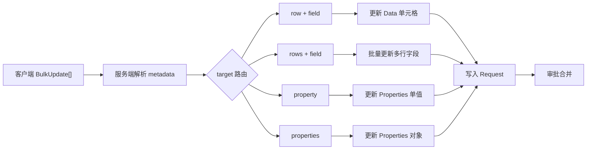

# 数据操作指南

本指南介绍如何使用 NexusBook API 进行数据行的增删改查操作。

## 数据行基本概念

数据行（Row）是文档的核心内容，每一行包含多个字段值。

### 数据行结构

```typescript
{
  "id": "row-001",              // 行 ID（唯一标识）
  "values": [                   // 字段值数组
    {
      "fieldId": "name",        // 字段 ID
      "value": {                // 字段值（根据字段类型不同）
        "text": "产品名称"
      }
    },
    {
      "fieldId": "price",
      "value": {
        "number": 99.99
      }
    }
  ],
  "version": 1,                 // 版本号（用于并发控制）
  "createdAt": "2024-12-01T10:00:00Z",
  "createdBy": "user-123",
  "updatedAt": "2024-12-01T11:00:00Z",
  "updatedBy": "user-456"
}
```

## CRUD 操作

### 创建数据行

**单行创建**：

```bash
curl -X POST 'https://open.nexusbook.com/api/v1/doc/product/123/data?requestId=req-1' \
  -H 'Authorization: Bearer TOKEN' \
  -H 'Content-Type: application/json' \
  -d '{
    "id": "row-001",
    "values": [
      {"fieldId": "name", "value": {"text": "iPhone 15"}},
      {"fieldId": "price", "value": {"number": 799.99}},
      {"fieldId": "stock", "value": {"number": 100}}
    ]
  }'
```

**批量创建（已废弃）**：请改用“批量更新（BulkUpdate）”接口，支持同时更新数据与属性，且统一走 `requestId` 工作流。

```bash
# 推荐：BulkUpdate 统一接口
curl -X POST 'https://open.nexusbook.com/api/v1/doc/product/123/data/bulk?requestId=req-1' \
  -H 'Authorization: Bearer TOKEN' \
  -H 'Content-Type: application/json' \
  -d '[
    {"target": {"row": "row-001"}, "value": {"name": "iPhone 15", "price": 799.99, "stock": 100}},
    {"target": {"row": "row-002"}, "value": {"name": "iPad Pro", "price": 1099.99, "stock": 50}}
  ]'
```

### 读取数据行

**获取单行**：

```bash
curl 'https://open.nexusbook.com/api/v1/doc/product/123/data/row-001' \
  -H 'Authorization: Bearer TOKEN'
```

**列表查询**：

```bash
curl 'https://open.nexusbook.com/api/v1/doc/product/123/data?page=1&pageSize=20' \
  -H 'Authorization: Bearer TOKEN'
```

**结构化查询**：

```bash
curl -X POST 'https://open.nexusbook.com/api/v1/doc/product/123/data/query' \
  -H 'Authorization: Bearer TOKEN' \
  -H 'Content-Type: application/json' \
  -d '{
    "filters": {
      "logic": "and",
      "conditions": [
        {"field": "status", "operator": "eq", "value": "active"},
        {"field": "price", "operator": "gte", "value": 100}
      ]
    },
    "sorts": [{"field": "price", "direction": "desc"}],
    "page": 1,
    "pageSize": 50
  }'
```

### 更新数据行

**全量更新**：

```bash
curl -X PUT 'https://open.nexusbook.com/api/v1/doc/product/123/data/row-001?requestId=req-1' \
  -H 'Authorization: Bearer TOKEN' \
  -H 'Content-Type: application/json' \
  -d '{
    "values": [
      {"fieldId": "name", "value": {"text": "iPhone 15 Pro"}},
      {"fieldId": "price", "value": {"number": 999.99}}
    ],
    "version": 1
  }'
```

**部分更新**：

```bash
curl -X PATCH 'https://open.nexusbook.com/api/v1/doc/product/123/data/row-001?requestId=req-1' \
  -H 'Authorization: Bearer TOKEN' \
  -H 'Content-Type: application/json' \
  -d '{
    "values": [
      {"fieldId": "price", "value": {"number": 899.99}}
    ],
    "version": 1
  }'
```

### 删除数据行

**单行删除**：

```bash
curl -X DELETE 'https://open.nexusbook.com/api/v1/doc/product/123/data/row-001?requestId=req-1' \
  -H 'Authorization: Bearer TOKEN'
```

**批量删除**：

```bash
curl -X POST 'https://open.nexusbook.com/api/v1/doc/product/123/data/bulk?apply=true' \
  -H 'Authorization: Bearer TOKEN' \
  -H 'Content-Type: application/json' \
  -d '{
    "delete": ["row-001", "row-002", "row-003"]
  }'
```

## 批量更新（灵活 target/value）




- 统一接口：`POST /api/v1/doc/{docType}/{docId}/data/bulk?requestId=req-1`
- 模型：`BulkUpdate[]`，其中 `target: {}` 为灵活结构，`value: unknown`

示例：

```json
[
  {"target": {"row": "row-1", "field": "price"}, "value": 99.99},
  {"target": {"row": "row-2"}, "value": {"name": "iPhone 15", "stock": 50}},
  {"target": {"rows": ["row-3","row-4"], "field": "status"}, "value": "active"},
  {"target": {"property": "amount"}, "value": 5000.00},
  {"target": {"properties": true}, "value": {"amount": 5000, "quantity": 100}}
]
```

说明：
- 客户端只需提供原始值（数字/字符串/布尔/对象/数组），服务端根据 `metadata` 自动解析与校验。
- 支持数据与属性在一次请求中混合更新。

## 字段值类型映射

不同的字段类型对应不同的值格式：

| 字段类型 | 值类型 | 示例 |
|---------|-------|------|
| text | string | `{"text": "文本内容"}` |
| number | float64 | `{"number": 123.45}` |
| boolean | boolean | `{"boolean": true}` |
| date | string (ISO 8601) | `{"date": "2024-12-01"}` |
| datetime | string (ISO 8601) | `{"datetime": "2024-12-01T10:00:00Z"}` |
| single_select | SelectOption | `{"selectOption": {"id": "opt-1", "name": "选项A"}}` |
| multi_select | SelectOption[] | `{"selectOptions": [{"id": "opt-1"}, {"id": "opt-2"}]}` |

完整的字段类型参考见：[字段类型参考](../references/field-types.html)

## 变更请求工作流（requestId）

所有写操作（创建/更新/删除/批量更新）必须携带 `requestId` 参数，系统会将变更写入对应的变更请求（Request）。多人协同在同一个 Request 上进行，审批通过后变更才生效。

### 为什么需要 requestId
- 保障数据可审计与可回滚
- 支持协同编辑与冲突解决
- 与修订历史、审批流程联动

### 默认 Request 与协作
- 如果未显式提供 `requestId`，系统可创建默认的临时 Request（实现依赖服务端策略）
- 建议客户端明确传入 `requestId` 以便协作追踪


### （已废弃）apply 参数

> 说明：`apply` 参数已不再支持，全部写操作统一通过 `requestId` 工作流进行。请在写接口中附带 `?requestId=...` 或在请求体中包含 `{"requestId":"..."}`。

- 统一入口：`POST /doc/{docType}/{docId}/data/bulk?requestId=req-1`
- 示例参见上文“批量更新（BulkUpdate）格式”和各写操作示例

## 并发控制

使用版本号（version）进行乐观锁控制：

```bash
# 1. 获取当前数据
curl 'https://open.nexusbook.com/api/v1/doc/product/123/data/row-001' \
  -H 'Authorization: Bearer TOKEN'

# 响应
{
  "id": "row-001",
  "values": [...],
  "version": 5
}

# 2. 更新时提供版本号
curl -X PUT 'https://open.nexusbook.com/api/v1/doc/product/123/data/row-001?apply=true' \
  -H 'Authorization: Bearer TOKEN' \
  -d '{
    "values": [...],
    "version": 5  // 必须匹配当前版本
  }'
```

**冲突处理**：

如果版本不匹配，API 返回错误：
```json
{
  "success": false,
  "code": "VERSION_CONFLICT",
  "message": {
    "zh": "数据已被其他用户修改，请刷新后重试",
    "en": "Data has been modified by another user, please refresh and retry"
  }
}
```

## 性能优化建议

### 1. 优先使用批量操作

```bash
# ❌ 不推荐：循环调用 100 次
for i in {1..100}; do
  curl -X POST '.../data?apply=true' -d "{...row $i...}"
done

# ✅ 推荐：一次批量创建 100 行
curl -X POST '.../data/bulk?apply=true' -d '{
  "rows": [
    {...row 1...},
    {...row 2...},
    ...
    {...row 100...}
  ]
}'
```

### 2. 合理设置分页大小

```bash
# ❌ 太小：请求次数过多
curl '.../data?page=1&pageSize=10'

# ❌ 太大：响应时间长
curl '.../data?page=1&pageSize=1000'

# ✅ 推荐：20-100 之间
curl '.../data?page=1&pageSize=50'
```

### 3. 只查询需要的字段

```bash
# ❌ 查询所有字段
curl '.../data/query' -d '{
  "fields": ["*"]
}'

# ✅ 只查询需要的字段
curl '.../data/query' -d '{
  "fields": ["id", "name", "price", "stock"]
}'
```

### 4. 使用过滤减少数据量

```bash
# ❌ 获取所有数据后在客户端过滤
curl '.../data?pageSize=1000'

# ✅ 在服务端过滤
curl -X POST '.../data/query' -d '{
  "filters": {
    "logic": "and",
    "conditions": [
      {"field": "status", "operator": "eq", "value": "active"}
    ]
  }
}'
```

## 常见问题

### 1. 如何处理大数据量？

使用游标分页：

```bash
# 首次请求
curl '.../data?pageSize=100'

# 响应包含 cursor
{
  "items": [...],
  "cursor": "eyJpZCI6InJvdy0xMDAifQ==",
  "hasMore": true
}

# 下一页
curl '.../data?pageSize=100&cursor=eyJpZCI6InJvdy0xMDAifQ=='
```

### 2. 如何处理复杂查询？

使用嵌套过滤条件：

```bash
curl -X POST '.../data/query' -d '{
  "filters": {
    "logic": "or",
    "conditions": [
      {
        "logic": "and",
        "conditions": [
          {"field": "category", "operator": "eq", "value": "electronics"},
          {"field": "price", "operator": "gte", "value": 1000}
        ]
      },
      {
        "field": "featured", "operator": "eq", "value": true
      }
    ]
  }
}'
```

### 3. 如何导出数据？

```bash
# 导出为 JSON
curl '.../data/export?format=json' \
  -H 'Authorization: Bearer TOKEN' \
  > data.json

# 导出为 CSV
curl '.../data/export?format=csv' \
  -H 'Authorization: Bearer TOKEN' \
  > data.csv
```

## 下一步

- 📊 阅读 [文档模型详解](document-model.html)
- 🔔 阅读 [Webhook 使用指南](webhooks.html)
- 💡 阅读 [最佳实践](best-practices.html)
- 📚 查看 [完整示例](examples.html)
