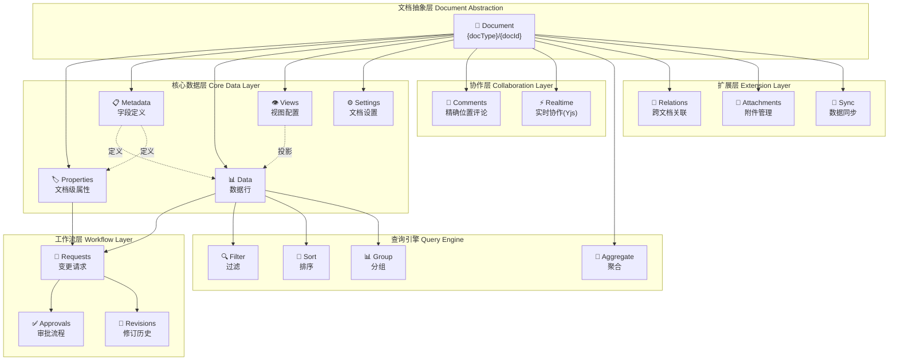
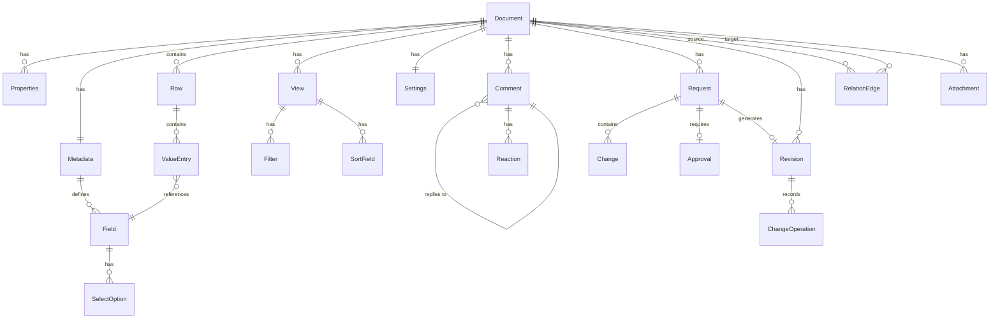

# NexusBook 文档模型完整指南

## 目录
- [1. 引言：为什么需要文档模型](#1-引言为什么需要文档模型)
- [2. 设计哲学](#2-设计哲学)
- [3. 核心架构](#3-核心架构)
- [4. 七层模型详解](#4-七层模型详解)
- [5. 变更工作流](#5-变更工作流)
- [6. 实现原理](#6-实现原理)
- [7. 完整业务流程](#7-完整业务流程)
- [8. 最佳实践](#8-最佳实践)

---

## 1. 引言：为什么需要文档模型

### 1.1 业务背景

在现代企业中，**结构化数据文档**无处不在：
- 📦 **订货单** - 采购团队需要协同管理供应商订单
- 📄 **发票** - 财务需要追踪每一笔开票记录
- 📊 **库存表** - 仓库要实时更新商品库存状态
- 📋 **项目计划** - 项目组需要多人协作任务分配

这些文档都有共同的特点：
1. **结构化** - 有明确的字段定义（产品名称、数量、金额等）
2. **协作性** - 多人同时编辑、评论、讨论
3. **可追溯** - 需要知道谁在什么时候改了什么
4. **需审批** - 重要变更需要经过审批流程
5. **多视角** - 同一份数据需要不同的展示方式

### 1.2 传统方案的问题

传统的解决方案存在诸多问题：

**方案1：使用Excel/Google Sheets**
- ❌ 版本控制困难，容易丢失历史记录
- ❌ 多人协作容易冲突
- ❌ 缺乏审批流程
- ❌ 权限控制粗糙

**方案2：为每种文档类型开发独立系统**
- ❌ 开发成本高，周期长
- ❌ 代码重复，维护困难
- ❌ 各系统孤立，数据难以互通
- ❌ 每次新增文档类型都需要重新开发

**方案3：使用传统数据库**
- ❌ Schema 固定，扩展性差
- ❌ 缺乏协作和审批能力
- ❌ 版本控制需要额外实现
- ❌ 多视图展示需要大量开发

### 1.3 NexusBook 文档模型的解决方案

NexusBook 提供了一个**统一的文档抽象模型**，就像"搭积木"一样：

```
┌─────────────────────────────────────────────────────────────┐
│                    任何业务文档                               │
├─────────────────────────────────────────────────────────────┤
│                                                               │
│  ┌──────────────┐  ┌──────────────┐  ┌──────────────┐       │
│  │ Properties   │  │   Metadata   │  │    Views     │       │
│  │ 文档属性      │  │   字段定义    │  │   视图配置    │       │
│  │ (订单时间)    │  │  (产品名称)   │  │  (表格/看板)  │       │
│  └──────────────┘  └──────────────┘  └──────────────┘       │
│                                                               │
│  ┌────────────────────────────────────────────────────────┐ │
│  │                 Data (数据行)                           │ │
│  │  存储实际的业务数据，遵循 Metadata 定义的结构            │ │
│  └────────────────────────────────────────────────────────┘ │
│                                                               │
│  ┌──────────────┐  ┌──────────────┐  ┌──────────────┐       │
│  │  Comments    │  │  Requests    │  │  Revisions   │       │
│  │  协作评论     │  │  变更请求     │  │  版本历史     │       │
│  └──────────────┘  └──────────────┘  └──────────────┘       │
│                                                               │
└─────────────────────────────────────────────────────────────┘
```

**核心优势**：
- ✅ **一次开发，无限复用** - 同一套模型支持所有类型的文档
- ✅ **开箱即用的协作能力** - 评论、@提及、讨论线程
- ✅ **完整的版本控制** - 类似 Git 的变更追踪
- ✅ **灵活的审批流程** - 支持串签、并签、条件审批
- ✅ **强大的查询能力** - 过滤、排序、分组、聚合
- ✅ **多视图展示** - 表格、看板、日历、图表等8种视图

---

## 2. 设计哲学

### 2.1 核心设计原则

#### 原则1：清晰分层
```
Properties (文档属性)  - 文档级元信息，如订单时间、总金额
Metadata (字段定义)    - 定义数据结构，如产品名称是文本类型
Data (数据行)         - 实际业务数据，如具体的产品清单
Views (视图)          - 数据展示方式，如表格视图、看板视图
Comments (评论)       - 协作讨论，可精确到单元格
Requests (变更请求)   - 变更的草稿，类似 Git PR
Revisions (修订历史)  - 已合并的变更历史，不可修改
Settings (设置)       - 权限、通知等配置
```

**为什么这样分层？**
- Properties 和 Data 分离，避免混淆"订单总额"和"每个产品的单价"
- Metadata 独立，可以动态调整字段定义而不影响已有数据
- Views 不持有数据，只是数据的不同"窗口"
- 工作流层（Requests/Revisions）独立，保证数据安全和可追溯

#### 原则2：元数据驱动

**所有字段都由 Metadata 定义**：

```typescript
// 1. 先定义字段结构
{
  "fields": [
    { "id": "productName", "type": "text", "required": true },
    { "id": "quantity", "type": "number", "required": true },
    { "id": "price", "type": "currency" }
  ]
}

// 2. 数据行必须遵循这个结构
{
  "values": [
    { "fieldId": "productName", "value": { "text": "iPhone 15" } },
    { "fieldId": "quantity", "value": { "number": 10 } },
    { "fieldId": "price", "value": { "number": 799.99 } }
  ]
}
```

**好处**：
- 🔒 **类型安全** - 服务端自动验证数据类型
- 🎯 **一致性保证** - 不会出现字段ID不存在的情况
- 🔄 **动态扩展** - 新增字段不需要修改数据库表结构
- 📊 **自动UI生成** - 前端可以根据 Metadata 自动渲染表单

#### 原则3：不可变历史

```
用户编辑 → Request (可修改) → 审批通过 → Revision (不可修改)
                              ↓
                         永久记录在历史中
```

**为什么不可变？**
- 审计要求：财务、法律审计需要完整的变更证据链
- 信任基础：用户知道历史不会被篡改
- 回滚能力：可以基于历史创建新的变更，而不是修改历史

#### 原则4：审批先行

**所有写操作都需要 requestId**：

```bash
# ❌ 不支持直接写入
POST /doc/order/123/rows
{ "values": [...] }

# ✅ 必须指定 requestId
POST /doc/order/123/rows?requestId=req-1
{ "values": [...] }
```

**工作流**：
1. 用户创建 Request（草稿）
2. 多人在同一个 Request 中协同编辑
3. 审批者审核 Request
4. 审批通过后，Request 合并生成 Revision
5. Revision 记录所有变更和贡献者

#### 原则5：关系是一等公民

**跨文档关联（Relations）和附件（Attachments）是核心能力**：

```typescript
// 发票引用订货单
{
  "type": "references",
  "source": { "docType": "invoice", "docId": "inv-123", "rowId": "row-1" },
  "target": { "docType": "purchaseOrder", "docId": "po-456", "rowId": "row-99" }
}
```

**关系不嵌入任何一方**：
- 独立存储为"边"（Edge）
- 支持双向查询（出边/入边）
- 删除保护（避免悬空引用）
- 权限控制（跨文档边需要两端权限）

### 2.2 与其他系统的对比

| 特性 | Excel | Airtable | Notion | **NexusBook** |
|------|-------|----------|--------|---------------|
| 结构化数据 | ✅ | ✅ | ⚠️ 半结构化 | ✅ |
| 多人协作 | ⚠️ 冲突多 | ✅ | ✅ | ✅ |
| 版本控制 | ❌ | ⚠️ 简单 | ⚠️ 简单 | ✅ 完整 |
| 审批流程 | ❌ | ❌ | ❌ | ✅ |
| 跨文档关联 | ❌ | ✅ | ✅ | ✅ |
| API优先设计 | ❌ | ✅ | ⚠️ 有限 | ✅ |
| 自托管 | ❌ | ❌ | ❌ | ✅ |
| 变更可追溯 | ❌ | ⚠️ 有限 | ⚠️ 有限 | ✅ Git级别 |

---

## 3. 核心架构

### 3.1 整体架构图



### 3.2 数据流向

```
┌─────────────────────────────────────────────────────────────┐
│                       用户操作                               │
└────────────┬────────────────────────────────────────────────┘
             │
             ▼
┌─────────────────────────────────────────────────────────────┐
│  1. 创建 Request (草稿)                                      │
│     - requestId: req-1                                       │
│     - status: open                                           │
└────────────┬────────────────────────────────────────────────┘
             │
             ▼
┌─────────────────────────────────────────────────────────────┐
│  2. 多次编辑 (所有操作携带 requestId)                         │
│     - POST /rows?requestId=req-1                             │
│     - PUT /rows/123?requestId=req-1                          │
│     - PATCH /properties?requestId=req-1                      │
│                                                               │
│  Request 中累积 Changes:                                      │
│     - Change 1: 创建行 row-1                                  │
│     - Change 2: 更新行 row-1                                  │
│     - Change 3: 更新属性 totalAmount                          │
└────────────┬────────────────────────────────────────────────┘
             │
             ▼
┌─────────────────────────────────────────────────────────────┐
│  3. 提交审批 (可选)                                           │
│     - 指定审批者                                              │
│     - 审批者可查看 diff                                        │
│     - 审批者做出决策 (通过/拒绝/请求修改)                       │
└────────────┬────────────────────────────────────────────────┘
             │ 审批通过
             ▼
┌─────────────────────────────────────────────────────────────┐
│  4. 合并 Request                                             │
│     POST /requests/req-1/merge                               │
│                                                               │
│  发生的事情:                                                  │
│  a. 所有 Changes 转换为 ChangeOperations                      │
│  b. 创建 Revision (rev-001)                                  │
│  c. Revision 包含:                                           │
│     - 所有 ChangeOperations                                  │
│     - 所有贡献者 (contributors)                               │
│     - 合并者 (mergedBy)                                       │
│     - 统计信息 (rowsCreated, rowsUpdated...)                 │
│  d. 更新 Request.generatedRevisionId = rev-001               │
│  e. 更新 Request.status = merged                             │
│  f. 实际数据库写入生效                                        │
└────────────┬────────────────────────────────────────────────┘
             │
             ▼
┌─────────────────────────────────────────────────────────────┐
│  5. Revision 永久保存                                        │
│     - 不可修改                                                │
│     - 可查询                                                  │
│     - 可对比 (diff)                                           │
│     - 可基于它创建新的回滚变更                                 │
└─────────────────────────────────────────────────────────────┘
```

### 3.3 对象关系图



---

## 4. 七层模型详解

### 4.1 Properties（文档属性）- 元信息层

#### 4.1.1 职责定位

**Properties 存储文档级别的元信息**，而不是数据行的内容。

类比：
- 📄 **文档** = 一份完整的订货单
- 🏷️ **Properties** = 订单编号、订单日期、门店、总金额
- 📊 **Data (行)** = 每个产品的明细（产品名、数量、单价）

#### 4.1.2 数据模型

```typescript
model DocumentProperties {
  id: string;                    // 属性记录ID
  docId: string;                 // 所属文档ID
  docType: string;               // 文档类型
  organizationId?: string;       // 组织ID
  workspaceId?: string;          // 工作区ID
  
  properties: ValueEntry[];      // 属性值集合
  
  version?: int64;               // 乐观锁版本号
  createdAt?: string;
  updatedAt?: string;
  updatedBy?: UserRef;
}

// ValueEntry 是类型化的值
model ValueEntry {
  fieldId: string;               // 对应 Metadata.properties 中的字段ID
  value: Value;                  // 类型化的值
}

model Value {
  text?: string;
  number?: number;
  boolean?: boolean;
  date?: string;
  select?: string;
  multiSelect?: string[];
  user?: UserRef;
  // ... 25+ 种类型
}
```

#### 4.1.3 为什么需要 Metadata.properties？

**Metadata 包含两部分字段定义**：

1. **Metadata.fields** - 定义数据行（Data）的字段结构
2. **Metadata.properties** - 定义文档属性（Properties）的字段结构

```typescript
{
  "fields": [
    // 数据行的字段
    { "id": "productName", "type": "text", "name": "产品名称" },
    { "id": "quantity", "type": "number", "name": "数量" }
  ],
  "properties": [
    // 文档属性的字段
    { "id": "orderDate", "type": "date", "name": "订单日期", "required": true },
    { "id": "store", "type": "text", "name": "门店" },
    { "id": "totalAmount", "type": "currency", "name": "总金额" }
  ]
}
```

**为什么这样设计？**

1. **类型安全**: Properties 的值也需要类型验证
   ```typescript
   // ✅ 正确：totalAmount 是 currency 类型
   { "fieldId": "totalAmount", "value": { "number": 5000.00 } }
   
   // ❌ 错误：类型不匹配
   { "fieldId": "totalAmount", "value": { "text": "five thousand" } }
   ```

2. **动态表单生成**: 前端可以根据 Metadata.properties 自动生成属性编辑表单

3. **验证规则**: 可以定义属性的必填、唯一、格式等规则
   ```typescript
   {
     "id": "invoiceNumber",
     "type": "text",
     "required": true,
     "unique": true,
     "validations": [{
       "ruleType": "pattern",
       "config": { "pattern": "^INV-\\d{4}-\\d{3}$" }
     }]
   }
   ```

4. **计算字段**: Properties 也可以包含公式字段
   ```typescript
   {
     "id": "totalAmount",
     "type": "formula",
     "formula": "SUM(data.*.total)"  // 汇总所有数据行的小计
   }
   ```

#### 4.1.4 API 操作

```bash
# 1. 创建/初始化属性
POST /doc/purchaseOrder/order-123/properties
{
  "properties": [
    { "fieldId": "orderDate", "value": { "date": "2024-12-01" } },
    { "fieldId": "store", "value": { "text": "Beijing Branch" } },
    { "fieldId": "totalAmount", "value": { "number": 0 } }
  ]
}

# 2. 全量替换属性
PUT /doc/purchaseOrder/order-123/properties?requestId=req-1
{
  "properties": [
    { "fieldId": "orderDate", "value": { "date": "2024-12-02" } },
    { "fieldId": "store", "value": { "text": "Shanghai Branch" } },
    { "fieldId": "totalAmount", "value": { "number": 5000.00 } }
  ]
}

# 3. 部分更新属性 (merge=true)
PATCH /doc/purchaseOrder/order-123/properties?requestId=req-1&merge=true
{
  "properties": [
    { "fieldId": "totalAmount", "value": { "number": 6000.00 } },
    { "fieldId": "status", "value": { "select": "approved" } }
  ]
}

# 4. 查看属性变更历史
GET /doc/purchaseOrder/order-123/properties/history
```

#### 4.1.5 使用场景

**场景1：订货单**
```json
{
  "properties": [
    { "fieldId": "orderDate", "value": { "date": "2024-12-01T10:00:00Z" } },
    { "fieldId": "store", "value": { "text": "Beijing Branch" } },
    { "fieldId": "supplier", "value": { "text": "Apple Inc." } },
    { "fieldId": "totalAmount", "value": { "number": 50000.00 } },
    { "fieldId": "status", "value": { "select": "pending" } },
    { "fieldId": "priority", "value": { "select": "high" } },
    { "fieldId": "notes", "value": { "text": "Urgent delivery required" } }
  ]
}
```

**场景2：发票**
```json
{
  "properties": [
    { "fieldId": "invoiceNumber", "value": { "text": "INV-2024-001" } },
    { "fieldId": "issueDate", "value": { "date": "2024-12-01" } },
    { "fieldId": "dueDate", "value": { "date": "2025-01-01" } },
    { "fieldId": "taxRate", "value": { "number": 0.13 } },
    { "fieldId": "taxAmount", "value": { "number": 6500.00 } },
    { "fieldId": "totalAmount", "value": { "number": 56500.00 } },
    { "fieldId": "paymentStatus", "value": { "select": "pending" } }
  ]
}
```

---

### 4.2 Metadata（元数据）- 字段定义层

#### 4.2.1 职责定位

**Metadata 是整个文档的"Schema"**，定义：
- 数据行有哪些字段（fields）
- 文档属性有哪些字段（properties）
- 每个字段的类型、验证规则、计算逻辑

#### 4.2.2 字段类型体系

**NexusBook 支持 25+ 种字段类型**：

```typescript
enum FieldType {
  // 基础文本类型
  text,              // 单行文本
  long_text,         // 多行文本
  
  // 数值类型
  number,            // 数字
  currency,          // 货币
  percent,           // 百分比
  
  // 日期时间类型
  date,              // 日期
  datetime,          // 日期时间
  
  // 布尔类型
  boolean,           // 是/否
  
  // 选择类型
  single_select,     // 单选
  multi_select,      // 多选
  
  // 附件和用户
  attachment,        // 附件
  user,              // 用户
  collaborator,      // 协作者
  
  // 关联类型
  relation,          // 关联其他文档/行
  lookup,            // 查找（从关联记录获取值）
  rollup,            // 汇总（聚合关联记录）
  
  // 计算类型
  formula,           // 公式字段
  
  // 系统字段
  auto_number,       // 自动编号
  created_time,      // 创建时间
  updated_time,      // 更新时间
  created_by,        // 创建人
  updated_by,        // 更新人
}
```

#### 4.2.3 计算字段详解

**1. Formula 字段 - 公式计算**

```typescript
{
  "id": "total",
  "name": "小计",
  "type": "formula",
  "formula": "quantity * price"
}
```

支持的函数：
- 数学：SUM, AVG, MIN, MAX, ROUND, CEIL, FLOOR
- 文本：CONCAT, UPPER, LOWER, TRIM, SUBSTRING
- 日期：NOW, YEAR, MONTH, DAY, DATEDIFF
- 逻辑：IF, AND, OR, NOT

**2. Lookup 字段 - 跨文档查找**

```typescript
{
  "id": "supplierName",
  "name": "供应商名称",
  "type": "lookup",
  "lookup": {
    "relationFieldId": "supplier",      // 关联字段
    "targetFieldId": "name"              // 目标字段
  }
}

// 工作原理：
// 1. 当前行的 supplier 字段关联到 supplier 文档的某一行
// 2. 从那一行取出 name 字段的值
// 3. 显示在当前行的 supplierName 字段中
```

**3. Rollup 字段 - 聚合计算**

```typescript
{
  "id": "totalOrderAmount",
  "name": "订单总额",
  "type": "rollup",
  "rollup": {
    "relationFieldId": "orderItems",    // 关联字段（一对多）
    "targetFieldId": "total",           // 目标字段
    "agg": "sum"                        // 聚合函数
  }
}

// 支持的聚合函数：
// - sum: 求和
// - avg: 平均值
// - min: 最小值
// - max: 最大值
// - count: 计数
```

#### 4.2.4 验证规则

```typescript
{
  "id": "email",
  "name": "邮箱",
  "type": "text",
  "required": true,
  "unique": true,
  "validations": [
    {
      "ruleType": "pattern",
      "config": {
        "pattern": "^[a-zA-Z0-9._%+-]+@[a-zA-Z0-9.-]+\\.[a-zA-Z]{2,}$"
      },
      "message": {
        "zh": "请输入有效的邮箱地址",
        "en": "Please enter a valid email address"
      }
    }
  ]
}
```

**内置验证规则类型**：
- `pattern` - 正则表达式
- `min` / `max` - 数值范围
- `minLength` / `maxLength` - 文本长度
- `enum` - 枚举值
- `custom` - 自定义验证逻辑

#### 4.2.5 选项管理

```typescript
{
  "id": "status",
  "name": "状态",
  "type": "single_select",
  "selectOptions": [
    {
      "id": "opt-1",
      "name": { "zh": "待处理", "en": "Pending" },
      "color": "yellow"
    },
    {
      "id": "opt-2",
      "name": { "zh": "进行中", "en": "In Progress" },
      "color": "blue"
    },
    {
      "id": "opt-3",
      "name": { "zh": "已完成", "en": "Completed" },
      "color": "green"
    },
    {
      "id": "opt-4",
      "name": { "zh": "已取消", "en": "Cancelled" },
      "color": "red"
    }
  ]
}
```

---

### 4.3 Data（数据行）- 内容层

#### 4.3.1 数据模型

```typescript
model Row {
  id: string;                    // 行ID
  values: ValueEntry[];          // 字段值集合
  
  version?: int64;               // 乐观锁版本号
  createdAt?: string;
  createdBy?: UserRef;
  updatedAt?: string;
  updatedBy?: UserRef;
}
```

#### 4.3.2 CRUD 操作

```bash
# 1. 创建行（必须携带 requestId）
POST /doc/purchaseOrder/order-123/rows?requestId=req-1
{
  "values": [
    { "fieldId": "productName", "value": { "text": "iPhone 15" } },
    { "fieldId": "quantity", "value": { "number": 10 } },
    { "fieldId": "price", "value": { "number": 799.99 } }
  ]
}

# 2. 更新行
PUT /doc/purchaseOrder/order-123/rows/row-1?requestId=req-1
{
  "values": [
    { "fieldId": "productName", "value": { "text": "iPhone 15 Pro" } },
    { "fieldId": "quantity", "value": { "number": 15 } },
    { "fieldId": "price", "value": { "number": 999.99 } }
  ],
  "version": 2
}

# 3. 删除行
DELETE /doc/purchaseOrder/order-123/rows/row-1?requestId=req-1

# 4. 查询行（支持分页、过滤、排序）
GET /doc/purchaseOrder/order-123/rows?page=1&pageSize=20
POST /doc/purchaseOrder/order-123/rows/query
{
  "filters": {
    "logic": "and",
    "conditions": [
      { "field": "quantity", "operator": "gte", "value": 10 }
    ]
  },
  "sorts": [
    { "field": "createdAt", "direction": "desc" }
  ],
  "page": 1,
  "pageSize": 20
}
```

#### 4.3.3 批量更新（BulkUpdate）

**统一的批量更新格式**：

```typescript
// 批量更新支持灵活的 target 定位
POST /doc/purchaseOrder/order-123/rows/batch-update?requestId=req-1
[
  // 1. 更新单个单元格
  {
    "target": { "row": "row-1", "field": "price" },
    "value": 99.99
  },
  
  // 2. 更新整行（多个字段）
  {
    "target": { "row": "row-2" },
    "value": {
      "productName": "iPad Pro",
      "quantity": 5,
      "price": 1099.99
    }
  },
  
  // 3. 批量更新多行的同一字段
  {
    "target": { "rows": ["row-3", "row-4", "row-5"], "field": "status" },
    "value": "active"
  },
  
  // 4. 更新文档属性
  {
    "target": { "property": "totalAmount" },
    "value": 50000.00
  },
  
  // 5. 批量更新多个属性
  {
    "target": { "properties": true },
    "value": {
      "totalAmount": 50000.00,
      "itemCount": 100
    }
  }
]
```

**服务端自动处理**：
1. 根据 `target` 定位要更新的位置
2. 根据 Metadata 解析 `value` 的类型
3. 执行类型验证
4. 记录到 Request 的 Changes 中

---

### 4.4 Views（视图）- 展示层

#### 4.4.1 视图类型

```typescript
enum ViewType {
  table,      // 表格视图 - 最常用，类似 Excel
  gallery,    // 画廊视图 - 卡片展示，适合图片类内容
  kanban,     // 看板视图 - 按状态分组，适合任务管理
  calendar,   // 日历视图 - 按日期展示，适合事件管理
  chart,      // 图表视图 - 数据可视化
  form,       // 表单视图 - 单条记录编辑
  map,        // 地图视图 - 地理位置展示
  timeline,   // 时间线视图 - 按时间轴展示
}
```

#### 4.4.2 视图配置

```typescript
model View {
  id: string;
  name: string;
  type: ViewType;
  
  config: {
    // 显示哪些字段
    columns?: string[];
    
    // 过滤条件
    filters?: Filter;
    
    // 排序规则
    sorts?: SortField[];
    
    // 分组字段
    groupBy?: string;
    
    // 视图特定配置
    kanbanConfig?: {
      groupByField: string;       // 按哪个字段分组（如 status）
      cardFields: string[];       // 卡片显示哪些字段
    };
    
    calendarConfig?: {
      dateField: string;          // 日期字段
      titleField: string;         // 标题字段
    };
    
    chartConfig?: {
      xField: string;             // X轴字段
      yField: string;             // Y轴字段
      chartType: "bar" | "line" | "pie";
    };
  };
}
```

#### 4.4.3 过滤器示例

```typescript
// 复杂过滤条件
{
  "logic": "and",
  "conditions": [
    {
      "field": "status",
      "operator": "eq",
      "value": "pending"
    },
    {
      "logic": "or",
      "conditions": [
        {
          "field": "priority",
          "operator": "eq",
          "value": "high"
        },
        {
          "field": "amount",
          "operator": "gte",
          "value": 10000
        }
      ]
    }
  ]
}
```

**支持的操作符**：
- `eq` / `ne` - 等于/不等于
- `gt` / `gte` / `lt` / `lte` - 大于/大于等于/小于/小于等于
- `in` / `notIn` - 包含于/不包含于
- `contains` / `startsWith` / `endsWith` - 文本包含/开头/结尾
- `isEmpty` / `isNotEmpty` - 为空/不为空

---

### 4.5 Comments（评论）- 协作层

#### 4.5.1 精确位置评论

**支持四级定位**：

```typescript
// 1. 文档级评论
{
  "content": "这个订单需要尽快处理",
  "target": {
    "scope": "document"
  }
}

// 2. 字段级评论
{
  "content": "产品名称字段的格式需要统一",
  "target": {
    "scope": "field",
    "fieldId": "productName"
  }
}

// 3. 行级评论
{
  "content": "这一行的数量有问题",
  "target": {
    "scope": "row",
    "rowId": "row-123"
  }
}

// 4. 单元格级评论
{
  "content": "这个单价需要确认",
  "target": {
    "scope": "cell",
    "rowId": "row-123",
    "fieldId": "price"
  }
}
```

#### 4.5.2 评论线程

```typescript
// 1. 创建顶层评论
POST /doc/order/123/comments
{
  "content": "请检查第3行的数量",
  "target": { "scope": "row", "rowId": "row-3" }
}
// 返回: { "id": "comment-1" }

// 2. 回复评论（形成线程）
POST /doc/order/123/comments
{
  "content": "已经检查过了，数量正确",
  "parentId": "comment-1"
}

// 3. 继续回复
POST /doc/order/123/comments
{
  "content": "好的，那我通过审批",
  "parentId": "comment-1"
}
```

#### 4.5.3 @提及和通知

```typescript
{
  "content": "@user-456 请帮忙确认这个订单的单价",
  "mentions": ["user-456"],
  "target": {
    "scope": "cell",
    "rowId": "row-1",
    "fieldId": "price"
  }
}
```

#### 4.5.4 表情反应

```typescript
// 添加表情反应
POST /doc/order/123/comments/comment-1/reactions
{
  "emoji": "👍"
}

// 评论对象包含反应统计
{
  "id": "comment-1",
  "content": "这个方案不错",
  "reactions": [
    {
      "emoji": "👍",
      "users": ["user-1", "user-2", "user-3"],
      "count": 3
    },
    {
      "emoji": "❤️",
      "users": ["user-4"],
      "count": 1
    }
  ]
}
```

#### 4.5.5 解决状态

```typescript
// 标记评论已解决
POST /doc/order/123/comments/comment-1/resolve

// 查询未解决的评论
GET /doc/order/123/comments?resolved=false
```

---

### 4.6 Requests & Revisions - 工作流层

#### 4.6.1 Request（变更请求）模型

```typescript
model Request {
  id: string;
  docType: string;
  docId: string;
  
  title?: string;
  description?: string;
  
  status: "open" | "merged" | "closed";
  
  author: UserRef;
  reviewers?: UserRef[];
  contributors?: UserRef[];         // 所有编辑过这个 Request 的人
  
  changes: Change[];                // 待合并的变更
  
  generatedRevisionId?: string;     // 合并后生成的 Revision ID
  
  createdAt: string;
  updatedAt: string;
  mergedAt?: string;
  mergedBy?: UserRef;
}

model Change {
  id: string;
  type: string;                     // row-create, row-update, property-update...
  operation: "create" | "update" | "delete";
  targetId?: string;                // 目标行/属性ID
  data: unknown;                    // 变更数据
  changedAt: string;
  changedBy: UserRef;
}
```

#### 4.6.2 Revision（修订历史）模型

```typescript
model Revision {
  id: string;
  version: int64;
  
  requestId?: string;               // 源 Request ID
  title?: string;
  description?: string;
  
  contributors: UserRef[];          // 所有贡献者
  mergedBy: UserRef;
  
  changes: ChangeOperation[];       // 具体的变更操作
  
  stats: {                          // 统计信息
    rowsCreated: int32;
    rowsUpdated: int32;
    rowsDeleted: int32;
    fieldsCreated: int32;
    fieldsUpdated: int32;
    fieldsDeleted: int32;
  };
  
  previousRevisionId?: string;      // 前一个 Revision ID
  createdAt: string;
  updatedAt: string;
}

model ChangeOperation {
  id: string;
  type: string;
  
  target: {
    kind: string;                   // row, property, field...
    rowId?: string;
    fieldId?: string;
  };
  
  oldValue?: unknown;               // 修改前的值
  newValue?: unknown;               // 修改后的值
  
  operator: string;                 // 操作人
  timestamp: string;
  note?: string;
}
```

#### 4.6.3 完整工作流

```
┌─────────────────────────────────────────────────────────────┐
│ Step 1: 创建 Request                                         │
└─────────────────────────────────────────────────────────────┘
POST /doc/purchaseOrder/order-123/requests
{
  "title": "更新12月采购订单",
  "description": "调整数量和价格"
}
返回: { "id": "req-1" }

┌─────────────────────────────────────────────────────────────┐
│ Step 2: 多人协同编辑 (所有操作携带 requestId=req-1)           │
└─────────────────────────────────────────────────────────────┘

// 用户A: 创建新行
POST /doc/purchaseOrder/order-123/rows?requestId=req-1
{ "values": [...] }
→ Request.changes 新增 Change { type: "row-create" }
→ Request.contributors 新增 用户A

// 用户B: 更新行
PUT /doc/purchaseOrder/order-123/rows/row-1?requestId=req-1
{ "values": [...] }
→ Request.changes 新增 Change { type: "row-update" }
→ Request.contributors 新增 用户B

// 用户C: 更新属性
PATCH /doc/purchaseOrder/order-123/properties?requestId=req-1
{ "properties": [...] }
→ Request.changes 新增 Change { type: "property-update" }
→ Request.contributors 新增 用户C

┌─────────────────────────────────────────────────────────────┐
│ Step 3: 查看 Request 状态                                    │
└─────────────────────────────────────────────────────────────┘
GET /doc/purchaseOrder/order-123/requests/req-1
{
  "id": "req-1",
  "title": "更新12月采购订单",
  "status": "open",
  "author": { "id": "user-A" },
  "contributors": ["user-A", "user-B", "user-C"],
  "changes": [
    { "type": "row-create", "changedBy": "user-A" },
    { "type": "row-update", "changedBy": "user-B" },
    { "type": "property-update", "changedBy": "user-C" }
  ]
}

┌─────────────────────────────────────────────────────────────┐
│ Step 4: 查看 Diff                                            │
└─────────────────────────────────────────────────────────────┘
GET /doc/purchaseOrder/order-123/requests/req-1/diff
{
  "added": [
    { "rowId": "row-10", "values": [...] }
  ],
  "updated": [
    {
      "rowId": "row-1",
      "fieldId": "quantity",
      "oldValue": 10,
      "newValue": 15
    }
  ],
  "properties": {
    "totalAmount": {
      "oldValue": 50000,
      "newValue": 55000
    }
  }
}

┌─────────────────────────────────────────────────────────────┐
│ Step 5: 提交审批 (可选)                                      │
└─────────────────────────────────────────────────────────────┘
POST /doc/purchaseOrder/order-123/requests/req-1/submit-approval
{
  "approvers": ["user-manager"]
}

// 审批者查看并批准
POST /doc/purchaseOrder/order-123/approvals/approval-1/approve
{
  "decision": "approved",
  "comment": "采购单价合理，批准"
}

┌─────────────────────────────────────────────────────────────┐
│ Step 6: 合并 Request                                         │
└─────────────────────────────────────────────────────────────┘
POST /doc/purchaseOrder/order-123/requests/req-1/merge

// 系统自动执行:
1. 将所有 Changes 转换为 ChangeOperations
2. 创建 Revision
   {
     "id": "rev-001",
     "version": 1,
     "requestId": "req-1",
     "contributors": ["user-A", "user-B", "user-C"],
     "mergedBy": "user-manager",
     "changes": [
       {
         "type": "row-create",
         "target": { "kind": "row", "rowId": "row-10" },
         "newValue": {...},
         "operator": "user-A"
       },
       {
         "type": "row-update",
         "target": { "kind": "row", "rowId": "row-1", "fieldId": "quantity" },
         "oldValue": 10,
         "newValue": 15,
         "operator": "user-B"
       },
       {
         "type": "property-update",
         "target": { "kind": "property", "fieldId": "totalAmount" },
         "oldValue": 50000,
         "newValue": 55000,
         "operator": "user-C"
       }
     ],
     "stats": {
       "rowsCreated": 1,
       "rowsUpdated": 1,
       "rowsDeleted": 0
     }
   }
3. 更新 Request
   {
     "status": "merged",
     "generatedRevisionId": "rev-001",
     "mergedAt": "2024-12-01T14:00:00Z",
     "mergedBy": "user-manager"
   }
4. 实际写入数据库

┌─────────────────────────────────────────────────────────────┐
│ Step 7: 查看历史和对比                                       │
└─────────────────────────────────────────────────────────────┘

// 查看所有修订
GET /doc/purchaseOrder/order-123/revisions
[
  {
    "id": "rev-001",
    "version": 1,
    "title": "更新12月采购订单",
    "contributors": ["user-A", "user-B", "user-C"],
    "stats": { "rowsCreated": 1, "rowsUpdated": 1 }
  }
]

// 查看修订详情
GET /doc/purchaseOrder/order-123/revisions/rev-001
{
  "changes": [...],  // 所有 ChangeOperations
  "stats": {...}
}

// 对比两个修订
GET /doc/purchaseOrder/order-123/revisions/rev-002/diff?base=rev-001

// 查询某行的完整变更历史
GET /doc/purchaseOrder/order-123/revisions/history?targetKind=row&rowId=row-1
```

---

### 4.7 Settings（设置）- 配置层

```typescript
model DocumentSettings {
  permissions: {
    view: string[];                 // 谁可以查看
    edit: string[];                 // 谁可以编辑
    delete: string[];               // 谁可以删除
    share: string[];                // 谁可以分享
  };
  
  notifications: {
    onCommentAdd: boolean;          // 新评论时通知
    onDataChange: boolean;          // 数据变更时通知
    onMerge: boolean;               // Request 合并时通知
  };
  
  workflow: {
    requiresApproval: boolean;      // 是否需要审批
    approvers: string[];            // 审批者列表
    autoMerge: boolean;             // 审批通过后自动合并
  };
}

model DocumentTypeSettings {
  // 文档类型级别的设置
  defaultMetadata: Metadata;        // 默认字段定义
  defaultViews: View[];             // 默认视图
  permissions: {...};               // 默认权限
}
```

---

## 5. 变更工作流

### 5.1 为什么需要 Request/Revision 机制？

**问题场景**：
- 多人同时编辑一个订单，如何避免冲突？
- 如何知道谁在什么时候改了什么？
- 重要变更需要经理审批，如何实现？
- 发现错误需要回滚，如何安全回退？

**传统方案的问题**：
```
直接修改数据库
  ↓
数据立即生效
  ↓
❌ 无法协同：多人同时改会冲突
❌ 无法追溯：不知道谁改的
❌ 无法审批：改完就生效了
❌ 难以回滚：不知道改了什么
```

**NexusBook 方案**：
```
用户修改 → Request (草稿)
  ↓
多人协同编辑同一个 Request
  ↓
审批流程 (可选)
  ↓
合并 Request → Revision (永久记录)
  ↓
数据库写入生效
```

### 5.2 类比：Git 工作流

| Git | NexusBook | 说明 |
|-----|-----------|------|
| Working Directory | 用户本地编辑 | 临时修改 |
| Branch | Request | 变更集合 |
| Commit | Change | 单个变更 |
| Pull Request | Request + Approval | 审批流程 |
| Merge | Merge Request | 合并到主分支 |
| Commit History | Revision | 不可变历史 |
| Revert | Revert Revision | 基于历史创建新的回滚变更 |

### 5.3 并发控制

**乐观锁机制**：

```typescript
// 1. 读取行（获取版本号）
GET /doc/order/123/rows/row-1
{
  "id": "row-1",
  "values": [...],
  "version": 5
}

// 2. 更新时携带版本号
PUT /doc/order/123/rows/row-1?requestId=req-1
{
  "values": [...],
  "version": 5        // 必须匹配当前版本
}

// 3. 如果版本不匹配，返回冲突错误
{
  "success": false,
  "code": "VERSION_CONFLICT",
  "message": {
    "zh": "数据已被其他用户修改，请刷新后重试",
    "en": "Data has been modified by another user"
  },
  "payload": {
    "currentVersion": 6,
    "yourVersion": 5
  }
}
```

### 5.4 Approval（审批）工作流

```typescript
// 1. 提交审批
POST /doc/order/123/requests/req-1/submit-approval
{
  "approvers": ["manager-1", "manager-2"],
  "strategy": "sequential"          // sequential: 串签, parallel: 并签
}

// 2. 审批者查看 Request
GET /doc/order/123/requests/req-1
GET /doc/order/123/requests/req-1/diff

// 3. 审批者做出决策
POST /doc/order/123/approvals/approval-1/approve
{
  "decision": "approved",           // approved, rejected, request_changes
  "comment": "采购价格合理，批准"
}

// 4. 所有审批通过后，可以合并
POST /doc/order/123/requests/req-1/merge
```

**审批策略**：
- **串签** (sequential): 按顺序逐个审批，前一个通过才能到下一个
- **并签** (parallel): 所有审批者同时审批，全部通过才算通过
- **条件签**: 根据条件选择审批者（如金额>10万需要总监审批）

---

## 6. 实现原理

### 6.1 TypeSpec 定义到 OpenAPI

NexusBook 使用 **TypeSpec** 定义 API，自动生成 OpenAPI 规范：

```typescript
// api/document/core/data.tsp
@route("/doc/{docType}/{docId}/rows")
@tag("Document - Core")
interface DataApi {
  @post
  @summary("创建数据行")
  createRow(
    @path docType: string,
    @path docId: string,
    @query requestId: string,
    @body row: CreateRowRequest,
  ): ApiResponse<Row>;
}
```

**编译流程**：
```
TypeSpec (.tsp)
  ↓ tsp compile
OpenAPI 3.0 (openapi.yaml)
  ↓ openapi-generator
服务端代码 (Go/Java/...)
客户端SDK (TypeScript/Python/...)
API文档 (Redocly)
```

### 6.2 存储模型

**逻辑模型 vs 物理模型**：

```
┌─────────────────────────────────────────────────────────────┐
│ 逻辑模型 (用户视角)                                           │
├─────────────────────────────────────────────────────────────┤
│ Document                                                      │
│ ├─ Properties                                                │
│ ├─ Metadata                                                  │
│ ├─ Data (Rows)                                               │
│ ├─ Views                                                     │
│ ├─ Comments                                                  │
│ ├─ Requests                                                  │
│ └─ Revisions                                                 │
└─────────────────────────────────────────────────────────────┘

┌─────────────────────────────────────────────────────────────┐
│ 物理模型 (数据库)                                             │
├─────────────────────────────────────────────────────────────┤
│ documents (文档基本信息)                                      │
│ document_properties (属性值，JSON 列)                         │
│ document_metadata (元数据定义，JSON 列)                       │
│ document_rows (数据行，JSON 列存储 values)                    │
│ document_views (视图配置，JSON 列)                            │
│ document_comments (评论)                                      │
│ document_requests (变更请求，JSON 列存储 changes)             │
│ document_revisions (修订历史，JSON 列存储 changes)            │
│ document_settings (设置)                                      │
│ relation_edges (关系边)                                       │
│ attachments (附件元数据)                                      │
└─────────────────────────────────────────────────────────────┘
```

**为什么用 JSON 列？**
- 灵活的 Schema：每个文档类型可以有不同的字段
- 减少表数量：不需要为每种文档类型创建表
- 查询优化：现代数据库（PostgreSQL, MySQL 8.0+）对 JSON 查询有良好支持
- 索引支持：可以对 JSON 中的特定字段建立索引

### 6.3 查询引擎实现

**Filter 翻译为 SQL**：

```typescript
// API 请求
{
  "filters": {
    "logic": "and",
    "conditions": [
      { "field": "status", "operator": "eq", "value": "pending" },
      { "field": "amount", "operator": "gte", "value": 10000 }
    ]
  }
}

// 翻译为 SQL (PostgreSQL)
SELECT *
FROM document_rows
WHERE doc_id = 'order-123'
  AND values->>'status' = 'pending'
  AND CAST(values->>'amount' AS DECIMAL) >= 10000
```

**性能优化**：
- **JSON索引**: `CREATE INDEX idx_status ON document_rows ((values->>'status'))`
- **函数索引**: `CREATE INDEX idx_amount ON document_rows (CAST(values->>'amount' AS DECIMAL))`
- **分区表**: 按 docType 或时间分区
- **缓存**: Metadata 和 Settings 长期缓存

---

## 7. 完整业务流程

### 7.1 场景：创建并管理一个采购订单

```
┌─────────────────────────────────────────────────────────────┐
│ Day 1: 采购员A创建订单                                        │
└─────────────────────────────────────────────────────────────┘

1. 创建文档
POST /doc/purchaseOrder
{
  "id": "order-2024-12-001",
  "organizationId": "org-1",
  "workspaceId": "ws-1"
}

2. 初始化 Properties
POST /doc/purchaseOrder/order-2024-12-001/properties
{
  "properties": [
    { "fieldId": "orderDate", "value": { "date": "2024-12-01" } },
    { "fieldId": "store", "value": { "text": "Beijing Branch" } },
    { "fieldId": "status", "value": { "select": "draft" } }
  ]
}

3. 创建 Metadata (定义字段)
POST /doc/purchaseOrder/order-2024-12-001/metadata
{
  "fields": [
    { "id": "productName", "name": "产品名称", "type": "text", "required": true },
    { "id": "quantity", "name": "数量", "type": "number", "required": true },
    { "id": "price", "name": "单价", "type": "currency", "required": true },
    { "id": "total", "name": "小计", "type": "formula", "formula": "quantity * price" }
  ],
  "properties": [
    { "id": "orderDate", "name": "订单日期", "type": "date", "required": true },
    { "id": "store", "name": "门店", "type": "text", "required": true },
    { "id": "totalAmount", "name": "总金额", "type": "currency" },
    { "id": "status", "name": "状态", "type": "single_select" }
  ]
}

4. 创建默认视图
POST /doc/purchaseOrder/order-2024-12-001/views
{
  "name": "全部产品",
  "type": "table",
  "config": {
    "columns": ["productName", "quantity", "price", "total"],
    "sorts": [{ "field": "createdAt", "direction": "desc" }]
  }
}

┌─────────────────────────────────────────────────────────────┐
│ Day 1 下午: 采购员A添加产品                                   │
└─────────────────────────────────────────────────────────────┘

5. 创建 Request
POST /doc/purchaseOrder/order-2024-12-001/requests
{
  "title": "添加初始产品清单"
}
返回: { "id": "req-1" }

6. 添加产品行 (携带 requestId)
POST /doc/purchaseOrder/order-2024-12-001/rows?requestId=req-1
{
  "values": [
    { "fieldId": "productName", "value": { "text": "iPhone 15" } },
    { "fieldId": "quantity", "value": { "number": 10 } },
    { "fieldId": "price", "value": { "number": 799.99 } }
  ]
}

POST /doc/purchaseOrder/order-2024-12-001/rows?requestId=req-1
{
  "values": [
    { "fieldId": "productName", "value": { "text": "iPad Pro" } },
    { "fieldId": "quantity", "value": { "number": 5 } },
    { "fieldId": "price", "value": { "number": 1099.99 } }
  ]
}

7. 合并 Request (无需审批)
POST /doc/purchaseOrder/order-2024-12-001/requests/req-1/merge
→ 生成 Revision rev-001
→ 数据正式写入

┌─────────────────────────────────────────────────────────────┐
│ Day 2: 采购员B发现价格有误，提出评论                          │
└─────────────────────────────────────────────────────────────┘

8. 添加评论
POST /doc/purchaseOrder/order-2024-12-001/comments
{
  "content": "@user-A iPad Pro 的单价应该是 999.99，不是 1099.99",
  "target": {
    "scope": "cell",
    "rowId": "row-2",
    "fieldId": "price"
  },
  "mentions": ["user-A"]
}

9. 采购员A回复
POST /doc/purchaseOrder/order-2024-12-001/comments
{
  "content": "好的，我来修改",
  "parentId": "comment-1"
}

┌─────────────────────────────────────────────────────────────┐
│ Day 2: 采购员A修正价格，提交审批                              │
└─────────────────────────────────────────────────────────────┘

10. 创建新的 Request
POST /doc/purchaseOrder/order-2024-12-001/requests
{
  "title": "修正 iPad Pro 价格"
}
返回: { "id": "req-2" }

11. 更新价格
PUT /doc/purchaseOrder/order-2024-12-001/rows/row-2?requestId=req-2
{
  "values": [
    { "fieldId": "productName", "value": { "text": "iPad Pro" } },
    { "fieldId": "quantity", "value": { "number": 5 } },
    { "fieldId": "price", "value": { "number": 999.99 } }  // 修正
  ],
  "version": 1
}

12. 提交审批
POST /doc/purchaseOrder/order-2024-12-001/requests/req-2/submit-approval
{
  "approvers": ["manager-1"]
}

13. 经理审批通过
POST /doc/purchaseOrder/order-2024-12-001/approvals/approval-1/approve
{
  "decision": "approved",
  "comment": "价格修正正确"
}

14. 合并 Request
POST /doc/purchaseOrder/order-2024-12-001/requests/req-2/merge
→ 生成 Revision rev-002
→ 价格更新生效

15. 标记评论已解决
POST /doc/purchaseOrder/order-2024-12-001/comments/comment-1/resolve

┌─────────────────────────────────────────────────────────────┐
│ Day 3: 查看变更历史和审计                                     │
└─────────────────────────────────────────────────────────────┘

16. 查看所有修订
GET /doc/purchaseOrder/order-2024-12-001/revisions
[
  {
    "id": "rev-001",
    "version": 1,
    "title": "添加初始产品清单",
    "contributors": ["user-A"],
    "stats": { "rowsCreated": 2 }
  },
  {
    "id": "rev-002",
    "version": 2,
    "title": "修正 iPad Pro 价格",
    "contributors": ["user-A"],
    "mergedBy": "manager-1",
    "stats": { "rowsUpdated": 1 }
  }
]

17. 对比两个版本
GET /doc/purchaseOrder/order-2024-12-001/revisions/rev-002/diff?base=rev-001
{
  "updated": [
    {
      "rowId": "row-2",
      "fieldId": "price",
      "oldValue": 1099.99,
      "newValue": 999.99
    },
    {
      "rowId": "row-2",
      "fieldId": "total",  // 公式字段自动更新
      "oldValue": 5499.95,
      "newValue": 4999.95
    }
  ]
}

18. 查看某行的完整变更历史
GET /doc/purchaseOrder/order-2024-12-001/revisions/history?targetKind=row&rowId=row-2
[
  {
    "revisionId": "rev-001",
    "operation": "create",
    "operator": "user-A",
    "timestamp": "2024-12-01T10:00:00Z"
  },
  {
    "revisionId": "rev-002",
    "operation": "update",
    "operator": "user-A",
    "timestamp": "2024-12-02T14:30:00Z",
    "changes": [
      { "fieldId": "price", "oldValue": 1099.99, "newValue": 999.99 }
    ]
  }
]
```

### 7.2 场景：跨文档关联

```
┌─────────────────────────────────────────────────────────────┐
│ 场景：发票引用采购订单                                        │
└─────────────────────────────────────────────────────────────┘

1. 创建发票文档
POST /doc/invoice
{
  "id": "inv-2024-12-001"
}

2. 创建关联关系 (在 Request 中)
POST /relations?requestId=req-inv-1
{
  "type": "references",
  "direction": "uni",
  "source": {
    "docType": "invoice",
    "docId": "inv-2024-12-001",
    "rowId": "inv-row-1"
  },
  "target": {
    "docType": "purchaseOrder",
    "docId": "order-2024-12-001",
    "rowId": "row-1"
  },
  "metadata": {
    "note": "发票第1行引用采购订单第1行"
  }
}

3. 查询出边 (从发票出发)
GET /doc/invoice/inv-2024-12-001/relations
[
  {
    "id": "rel-001",
    "type": "references",
    "target": {
      "docType": "purchaseOrder",
      "docId": "order-2024-12-001",
      "rowId": "row-1"
    }
  }
]

4. 查询入边 (指向采购订单)
GET /doc/purchaseOrder/order-2024-12-001/relations/inbound
[
  {
    "id": "rel-001",
    "type": "references",
    "source": {
      "docType": "invoice",
      "docId": "inv-2024-12-001",
      "rowId": "inv-row-1"
    }
  }
]

5. 删除保护 (尝试删除被引用的行)
DELETE /doc/purchaseOrder/order-2024-12-001/rows/row-1?requestId=req-3
→ 返回错误
{
  "success": false,
  "code": "RELATION_CONFLICT",
  "message": {
    "zh": "该行被其他文档引用，无法删除",
    "en": "This row is referenced by other documents and cannot be deleted"
  },
  "payload": {
    "inboundRelations": [
      {
        "id": "rel-001",
        "source": { "docType": "invoice", "docId": "inv-2024-12-001" }
      }
    ]
  }
}
```

### 7.3 场景：数据同步

```
┌─────────────────────────────────────────────────────────────┐
│ 场景：将产品数据同步到外部系统                                 │
└─────────────────────────────────────────────────────────────┘

1. 配置同步
POST /doc/product/prod-catalog/sync/configs
{
  "name": "同步到 ERP 系统",
  "targetType": "webhook",
  "targetConfig": {
    "url": "https://erp.example.com/api/products",
    "method": "POST",
    "headers": {
      "Authorization": "Bearer xxx"
    }
  },
  "schedule": "0 0 * * *",  // 每天凌晨同步
  "enabled": true
}

2. 手动触发同步
POST /doc/product/prod-catalog/sync/configs/sync-1/execute
{
  "filters": {
    "logic": "and",
    "conditions": [
      { "field": "status", "operator": "eq", "value": "active" }
    ]
  }
}

3. 查看同步日志
GET /doc/product/prod-catalog/sync/configs/sync-1/logs
[
  {
    "id": "log-1",
    "status": "success",
    "recordsSynced": 150,
    "startedAt": "2024-12-01T00:00:00Z",
    "completedAt": "2024-12-01T00:05:30Z"
  }
]
```

---

## 8. 最佳实践

### 8.1 Properties 设计

**✅ 推荐**：
```typescript
{
  "properties": [
    { "fieldId": "orderDate", "value": { "date": "2024-12-01" } },
    { "fieldId": "store", "value": { "text": "Beijing Branch" } },
    { "fieldId": "totalAmount", "value": { "number": 50000.00 } }
  ]
}
```

**❌ 避免**：
```typescript
// ❌ 不要在 Properties 中存储列表数据
{
  "properties": [
    {
      "fieldId": "products",
      "value": {
        "text": "iPhone 15, iPad Pro, MacBook Air"  // 应该用 Data 行
      }
    }
  ]
}

// ❌ 不要过度嵌套
{
  "properties": [
    {
      "fieldId": "address",
      "value": {
        "text": JSON.stringify({
          "country": "China",
          "province": "Beijing",
          "city": "Beijing",
          "district": "Chaoyang"
        })
      }
    }
  ]
}
// ✅ 应该拆分为多个属性字段
```

### 8.2 Metadata 设计

**✅ 推荐**：
```typescript
// 使用清晰的字段 ID
{
  "id": "customerEmail",       // ✅ 自描述
  "name": "客户邮箱",
  "type": "text"
}

// 提供验证规则
{
  "id": "phone",
  "name": "手机号",
  "type": "text",
  "required": true,
  "validations": [
    {
      "ruleType": "pattern",
      "config": { "pattern": "^1[3-9]\\d{9}$" },
      "message": {
        "zh": "请输入有效的手机号",
        "en": "Please enter a valid phone number"
      }
    }
  ]
}
```

**❌ 避免**：
```typescript
// ❌ 字段 ID 不明确
{
  "id": "field1",              // 难以理解
  "name": "邮箱",
  "type": "text"
}

// ❌ 缺少必要的验证
{
  "id": "amount",
  "name": "金额",
  "type": "number"             // 缺少 min/max 验证
}
```

### 8.3 批量操作优化

**✅ 推荐**：
```typescript
// 使用批量更新
POST /doc/order/123/rows/batch-update?requestId=req-1
[
  { "target": { "row": "row-1", "field": "status" }, "value": "active" },
  { "target": { "row": "row-2", "field": "status" }, "value": "active" },
  { "target": { "row": "row-3", "field": "status" }, "value": "active" }
]
```

**❌ 避免**：
```typescript
// ❌ 逐个更新
for (const rowId of rowIds) {
  await PUT(`/doc/order/123/rows/${rowId}?requestId=req-1`, {...})
}
// 性能差，产生大量网络请求
```

### 8.4 Request 管理

**✅ 推荐**：
```typescript
// 相关的变更放在同一个 Request 中
const requestId = "req-1";

// 1. 更新多行
await bulkUpdate(requestId, [...]);

// 2. 更新属性
await updateProperties(requestId, {...});

// 3. 一次性合并
await mergeRequest(requestId);
```

**❌ 避免**：
```typescript
// ❌ 为每个操作创建单独的 Request
const req1 = await createRequest();  // 更新行1
const req2 = await createRequest();  // 更新行2
const req3 = await createRequest();  // 更新属性

// 产生过多的 Revision，难以追溯
```

### 8.5 评论使用

**✅ 推荐**：
```typescript
// 精确定位到问题位置
{
  "content": "这个单价需要确认",
  "target": {
    "scope": "cell",
    "rowId": "row-1",
    "fieldId": "price"
  }
}

// 使用 @提及
{
  "content": "@manager 请审核这个订单",
  "mentions": ["manager-1"],
  "target": { "scope": "document" }
}

// 及时标记已解决
POST /doc/order/123/comments/comment-1/resolve
```

**❌ 避免**：
```typescript
// ❌ 在评论中存储结构化数据
{
  "content": "更新后的数据：{productName: 'iPhone', price: 999}"
}
// 应该直接修改数据，评论只用于讨论

// ❌ 过度评论
// 每个小修改都评论，导致噪音过多
// 应该合并相关讨论，问题解决后清理
```

### 8.6 性能优化

**1. 分页查询**：
```typescript
// ✅ 使用分页
GET /doc/order/123/rows?page=1&pageSize=100

// ❌ 一次性获取所有数据
GET /doc/order/123/rows?pageSize=10000
```

**2. 选择性查询**：
```typescript
// ✅ 只获取需要的部分
GET /doc/order/123?include=properties,metadata

// ❌ 获取整个文档
GET /doc/order/123?include=properties,metadata,data,comments,revisions
```

**3. 缓存策略**：
```typescript
// Metadata 和 Settings 变化少，可以长期缓存
const metadata = await cache.get(`metadata:${docType}:${docId}`, async () => {
  return await fetchMetadata(docType, docId);
}, { ttl: 3600 });

// Data 变化频繁，短期缓存或不缓存
const rows = await fetchRows(docType, docId);

// Revisions 不可变，可以永久缓存
const revision = await cache.get(`revision:${revId}`, async () => {
  return await fetchRevision(revId);
}, { ttl: Infinity });
```

### 8.7 安全实践

**1. 权限检查**：
```typescript
// 在每个操作前检查权限
if (!hasPermission(user, doc, 'write')) {
  throw new ForbiddenError();
}
```

**2. 输入验证**：
```typescript
// 服务端严格验证
- 字段类型是否匹配 Metadata
- 必填字段是否存在
- 验证规则是否通过
- 关联关系是否有效
```

**3. 审计日志**：
```typescript
// 所有敏感操作记录审计日志
await auditLog({
  action: 'document.delete',
  userId: currentUser.id,
  docType,
  docId,
  metadata: { reason: 'cleanup' }
});
```

### 8.8 错误处理

**✅ 推荐**：
```typescript
try {
  await updateRow(docType, docId, rowId, data, requestId);
} catch (error) {
  if (error.code === 'VERSION_CONFLICT') {
    // 版本冲突，提示用户刷新
    await refreshData();
    showMessage('数据已被其他用户修改，请重新编辑');
  } else if (error.code === 'FIELD_TYPE_MISMATCH') {
    // 类型不匹配，显示具体错误
    showValidationError(error.payload.field, error.message);
  } else {
    // 其他错误
    showError('操作失败，请稍后重试');
  }
}
```

---

## 9. 总结

### 9.1 核心价值

NexusBook 文档模型通过**七层架构**提供了：

1. **Properties** - 文档级元信息，清晰分离文档属性和数据内容
2. **Metadata** - 元数据驱动，25+ 种字段类型，支持计算字段和验证规则
3. **Data** - 结构化数据行，支持灵活查询和批量操作
4. **Views** - 8 种视图类型，同一数据多种展示方式
5. **Comments** - 四级精确定位，完整的协作讨论能力
6. **Requests** - 类 Git 的变更工作流，支持多人协同和审批
7. **Revisions** - 不可变历史，完整的变更追踪和审计能力

### 9.2 设计优势

✅ **一次开发，无限复用** - 同一套模型支持订单、发票、库存等所有文档类型

✅ **开箱即用的协作** - 评论、@提及、讨论线程、表情反应

✅ **Git 级别的版本控制** - Request → Revision 机制确保数据安全和可追溯

✅ **灵活的审批流程** - 串签、并签、条件审批，满足各种审批需求

✅ **强大的查询能力** - 过滤、排序、分组、聚合，支持复杂业务查询

✅ **关系是一等公民** - 跨文档关联、附件管理、数据同步
