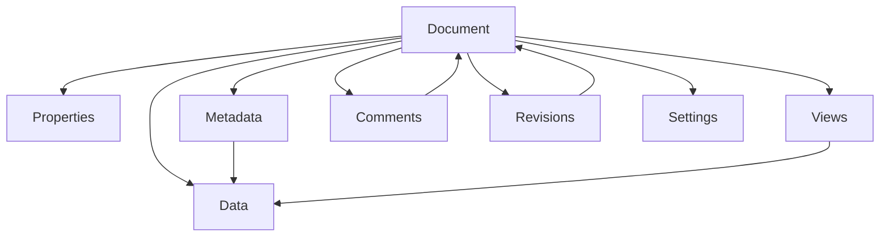
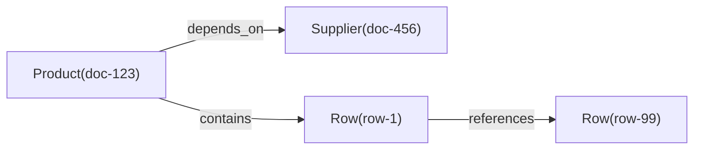

# NexusBook 文档模型设计文档

## 概述

NexusBook 的**文档模型**是一个灵活、高度可扩展的抽象框架，用于管理结构化数据文档。无论是订货单、发票、产品清单、项目计划等任何类型的表格型文档，都可以通过这个统一的模型来管理。

```
┌─────────────────────────────────────────────────────────────┐
│                      Document Bundle                         │
├─────────────────────────────────────────────────────────────┤
│                                                               │
│  ┌──────────────┐  ┌──────────────┐  ┌──────────────┐       │
│  │ Properties   │  │   Metadata   │  │    Views     │       │
│  │ (订单时间、   │  │  (字段配置)   │  │  (视图定义)   │       │
│  │  门店、金额)  │  │              │  │              │       │
│  └──────────────┘  └──────────────┘  └──────────────┘       │
│                                                               │
│  ┌────────────────────────────────────────────────────────┐ │
│  │                 Data (行集合)                           │ │
│  │  - 列表行（最核心的数据）                                │ │
│  │  - 支持创建/更新/删除/查询                               │ │
│  │  - 支持批量操作                                          │ │
│  │  - 支持分页                                              │ │
│  └────────────────────────────────────────────────────────┘ │
│                                                               │
│  ┌──────────────┐  ┌──────────────┐  ┌──────────────┐       │
│  │  Comments    │  │  Revisions   │  │   Settings   │       │
│  │  (评论讨论)   │  │  (修订历史)   │  │  (文档设置)   │       │
│  │              │  │              │  │              │       │
│  └──────────────┘  └──────────────┘  └──────────────┘       │
│                                                               │
└─────────────────────────────────────────────────────────────┘
```

## 核心层次结构



## 设计原则与一致性规范
- 清晰分层：Properties/Metadata/Data/Views/Comments/Revisions/Settings。
- 一致性原则：Metadata 定义字段，Data 必须遵守；Properties 与 Data 分离，避免交叉污染。
- 不可变记录：Revision 为只读历史，不可变更；通过 Revert 创建新的变更而非修改历史。
- 审批先行：所有写入通过 Request，审批通过后生成 Revision 并落库。
- 可审计性：每次写入都有 Request → Revision 链路，附带 contributors、timestamp。
- 可扩展性：Attachment 与 Relation 为一等公民，可在 Properties 或 Data 中使用。

## 对象关系总览
- Document 持有 Properties/Metadata/Views/Data/Comments/Revisions/Settings。
- Metadata 与 Data 存在强约束：Data 的 `values[].fieldId` 必须存在于 Metadata。
- Views 不持有数据，只保存 `config`（列、过滤、排序、分组），用于投影 Data。
- Comments 支持定位到 document/field/row/cell 四级。
- Revisions 记录 ChangeOperation 序列，指向源 Request。

## 生命周期与变更流
1. Draft：初始化 Properties、Metadata、Views。
2. Edit：用户在 Request 上协作修改 Data/Properties。
3. Review：审批流程进行，可能通过/拒绝/回滚。
4. Merge：合并生成 Revision，冻结操作历史。
5. Audit：通过 Revisions/Operations/Diff 进行审计或回溯。

### 1. Properties（文档属性）- 元信息层

存储**文档本身的属性信息**，不同于数据行的内容。

#### 用途
- **订货单**：订单时间、门店、总金额、总数量、状态、备注
- **发票**：发票号、开票时间、付款期限、税率、收款方信息
- **产品**：SKU、品牌、分类、供应商、生产日期
- **项目**：项目名称、负责人、预算、截止日期、优先级

#### 数据结构
```typescript
model DocumentProperties {
  id: string;              // 属性记录ID
  docId: string;           // 文档ID
  docType: string;         // 文档类型（purchaseOrder, invoice等）
  
  properties?: {           // 灵活的键值对对象
    [key: string]: any     // 支持任意属性
  };
  
  version?: int64;         // 并发控制版本号
  createdAt?: string;      // 创建时间
  updatedAt?: string;      // 更新时间
  updatedBy?: string;      // 最后修改人
}
```

#### API 端点
```
GET    /doc/{docType}/{docId}/properties          # 获取属性
POST   /doc/{docType}/{docId}/properties          # 创建属性
PUT    /doc/{docType}/{docId}/properties          # 替换属性（全量）
PATCH  /doc/{docType}/{docId}/properties          # 更新属性（部分）
GET    /doc/{docType}/{docId}/properties/history  # 查看属性历史
DELETE /doc/{docType}/{docId}/properties          # 删除属性
```

#### 示例：订货单属性
```bash
# 创建订货单属性
curl -X POST 'https://open.nexusbook.app/api/v1/doc/purchaseOrder/order-123/properties' \
  -H 'Authorization: Bearer TOKEN' \
  -H 'Content-Type: application/json' \
  -d '{
    "id": "prop-001",
    "docId": "order-123",
    "docType": "purchaseOrder",
    "properties": {
      "orderTime": "2024-12-01T10:00:00Z",
      "store": "Beijing Branch",
      "amount": 5000.00,
      "quantity": 50,
      "status": "pending",
      "notes": "Urgent delivery required"
    }
  }'

# 部分更新属性（仅更新金额和数量）
curl -X PATCH 'https://open.nexusbook.app/api/v1/doc/purchaseOrder/order-123/properties?merge=true' \
  -H 'Authorization: Bearer TOKEN' \
  -d '{
    "properties": {
      "amount": 6000.00,
      "quantity": 60
    }
  }'
```

### 2. Metadata（元数据）- 字段定义层

定义文档的**字段结构**，描述每个字段的类型、验证规则、显示方式等。

#### 用途
- 定义文档包含哪些字段（如订货单的"产品名称""数量""单价"等）
- 指定字段的数据类型（文本、数字、日期、选择等）
- 配置字段的验证规则、显示名称、帮助提示等
- 定义字段的读写权限

#### 数据结构概览
```typescript
model Metadata {
  id: string;              // 元数据ID
  docId: string;
  docType: string;
  
  fields?: Field[];        // 字段定义数组
  version?: int64;
  createdAt?: string;
  updatedAt?: string;
}

model Field {
  id: string;              // 字段ID（在表单中作为column）
  name: string;            // 字段显示名
  type: "text" | "number" | "date" | "select" | ...;
  required?: boolean;
  pattern?: string;        // 验证正则
  description?: string;    // 字段说明
}
```

#### 示例
```json
{
  "id": "meta-order-123",
  "docId": "order-123",
  "docType": "purchaseOrder",
  "fields": [
    {
      "id": "productName",
      "name": "产品名称",
      "type": "text",
      "required": true
    },
    {
      "id": "quantity",
      "name": "数量",
      "type": "number",
      "required": true,
      "pattern": "^[1-9]\\d*$"
    },
    {
      "id": "price",
      "name": "单价",
      "type": "number",
      "required": true
    }
  ]
}
```

### 3. Data（数据）- 内容层

存储**实际的数据行**，这是文档的核心内容。

#### 用途
- 订货单的每一个订单项（产品名称、数量、单价等）
- 发票的每一条明细行
- 库存表的每一条产品记录
- 项目计划的每一个任务行

#### 数据结构
```typescript
model Row {
  id: string;              // 行ID
  
  values: {                // 字段值集合
    fieldId: string;       // 字段ID（对应Metadata中定义）
    value: {               // 实际值，支持多种类型
      text?: string;
      number?: number;
      date?: string;
      select?: string;
    };
  }[];
  
  version?: int64;         // 用于并发控制
  createdAt?: string;
  createdBy?: string;
  updatedAt?: string;
  updatedBy?: string;
}
```

#### API 端点
```
GET    /doc/{docType}/{docId}/rows                          # 查询行（分页）
POST   /doc/{docType}/{docId}/rows                          # 创建行（需 requestId）
PUT    /doc/{docType}/{docId}/rows/{rowId}                  # 更新行（需 requestId）
DELETE /doc/{docType}/{docId}/rows/{rowId}                  # 删除行（需 requestId）

# 下列批量端点中，批量创建（batch-create）已废弃，统一使用批量更新（batch-update，BulkUpdate 格式）
# 所有写操作都必须携带 requestId
POST   /doc/{docType}/{docId}/rows/batch-update             # 批量更新（BulkUpdate）
POST   /doc/{docType}/{docId}/rows/batch-delete             # 批量删除（需 requestId）
```

#### 批量更新（BulkUpdate）格式

- 使用灵活的 `target` + 原始 `value` 结构；服务端根据 `metadata` 自动解析。
- `value` 可以是单值或对象，亦可为数组；可以同时更新数据行或文档属性。

```json
[
  {"target": {"row": "row-1", "field": "price"}, "value": 99.99},
  {"target": {"row": "row-2"}, "value": {"productName": "iPhone 15", "quantity": 50}},
  {"target": {"rows": ["row-3", "row-4"], "field": "status"}, "value": "active"},
  {"target": {"property": "amount"}, "value": 5000.00},
  {"target": {"properties": true}, "value": {"amount": 5000, "quantity": 100}}
]
```

#### 写操作的 requestId 工作流

- 所有写操作（创建/更新/删除/批量更新）都必须携带 `requestId`。
- 客户端通过同一个 `requestId` 协同编辑；审批通过后才写入生效版本；不支持直接 `apply`。
- 示例：`POST /doc/{docType}/{docId}/rows?requestId=req-1` 或在请求体中包含 `{"requestId":"req-1"}`。


#### 示例
```bash
# 创建一行数据（携带 requestId）
curl -X POST 'https://open.nexusbook.app/api/v1/doc/purchaseOrder/order-123/rows?requestId=req-1' \
  -H 'Authorization: Bearer TOKEN' \
  -H 'Content-Type: application/json' \
  -d '{
    "values": [
      { "fieldId": "productName", "value": { "text": "iPhone 15" } },
      { "fieldId": "quantity",    "value": { "number": 10 } },
      { "fieldId": "price",       "value": { "number": 799.99 } }
    ]
  }'

# 批量更新（BulkUpdate，统一格式；服务端根据 metadata 解析）
curl -X POST 'https://open.nexusbook.app/api/v1/doc/purchaseOrder/order-123/rows/batch-update?requestId=req-1' \
  -H 'Authorization: Bearer TOKEN' \
  -H 'Content-Type: application/json' \
  -d '[
    {"target": {"row": "row-1", "field": "price"}, "value": 99.99},
    {"target": {"row": "row-2"}, "value": {"productName": "iPhone 15", "quantity": 50}},
    {"target": {"rows": ["row-3","row-4"], "field": "status"}, "value": "active"}
  ]'
```

> 注：批量创建（`batch-create`）已废弃，请使用批量更新（`batch-update` + BulkUpdate 结构）来进行多行数据的写入与修改；最终写入需通过审批合并。


### 4. Views（视图）- 展示层

定义**不同的数据展示方式**。同一份数据可以用多种视图展示。

#### 用途
- **表格视图**：标准行列表展示
- **看板视图**：按状态分类展示
- **日历视图**：按日期组织
- **统计视图**：数据汇总展示
- **自定义视图**：用户定义的过滤/排序/分组方式

#### 数据结构概览
```typescript
model View {
  id: string;              // 视图ID
  name: string;            // 视图名称
  type: "table" | "kanban" | "calendar" | "chart" | ...;
  
  config?: {               // 视图配置
    columns?: string[];    // 显示的字段
    filters?: Filter[];    // 过滤条件
    sort?: SortField[];    // 排序规则
    groupBy?: string;      // 分组字段
  };
}
```

#### 示例
```json
{
  "id": "view-pending",
  "name": "待处理订单",
  "type": "table",
  "config": {
    "columns": ["productName", "quantity", "price"],
    "filters": [
      {
        "fieldId": "status",
        "operator": "equals",
        "value": "pending"
      }
    ],
    "sort": [
      {
        "fieldId": "orderTime",
        "direction": "desc"
      }
    ]
  }
}
```

### 5. Comments（评论）- 协作层

在**任何位置**（文档、字段、行、单元格）添加**评论、讨论和反馈**。

#### 用途
- 对整个订货单进行讨论
- 对某一行产品提出问题
- 对某个字段值进行评论
- 对某个单元格标记问题

#### 核心特性
- **精确定位**：支持在文档/字段/行/单元格级别评论
- **评论线程**：通过 `parentId` 形成回复链
- **表情反应**：可以对评论添加 emoji 反应
- **解决状态**：标记评论是否已解决

#### 数据结构概览
```typescript
model Comment {
  id: string;
  
  target: {                // 评论位置（精确到各层级）
    scope: "document" | "field" | "row" | "cell";
    fieldId?: string;
    rowId?: string;
  };
  
  parentId?: string;       // 回复的评论ID（用于线程）
  content: string;         // 评论内容
  mentions?: string[];     // @提及的用户
  
  reactions?: {            // emoji表情反应
    emoji: string;         // 表情符号
    users: string[];       // 添加反应的用户
    count: int32;
  }[];
  
  resolved?: boolean;      // 是否已解决
  replyCount?: int32;      // 回复数量
  
  createdAt?: string;
  createdBy?: string;
}
```

#### API 端点
```
GET    /doc/{docType}/{docId}/comments                       # 查询评论
POST   /doc/{docType}/{docId}/comments                       # 创建评论
PUT    /doc/{docType}/{docId}/comments/{commentId}           # 更新评论
DELETE /doc/{docType}/{docId}/comments/{commentId}           # 删除评论

POST   /doc/{docType}/{docId}/comments/{commentId}/pin       # 置顶评论
POST   /doc/{docType}/{docId}/comments/{commentId}/resolve   # 标记解决
POST   /doc/{docType}/{docId}/comments/{commentId}/reactions # 添加反应
```

#### 示例
```bash
# 对整个文档进行评论
curl -X POST 'https://open.nexusbook.app/api/v1/doc/purchaseOrder/order-123/comments' \
  -H 'Authorization: Bearer TOKEN' \
  -d '{
    "content": "请尽快处理这个订单",
    "target": {
      "scope": "document"
    },
    "mentions": ["@user-456"]
  }'

# 对某一行进行评论
curl -X POST 'https://open.nexusbook.app/api/v1/doc/purchaseOrder/order-123/comments' \
  -d '{
    "content": "这行的数量似乎有误",
    "target": {
      "scope": "row",
      "rowId": "row-001"
    }
  }'

# 对某个单元格进行评论
curl -X POST 'https://open.nexusbook.app/api/v1/doc/purchaseOrder/order-123/comments' \
  -d '{
    "content": "单价需要确认",
    "target": {
      "scope": "cell",
      "rowId": "row-001",
      "fieldId": "price"
    }
  }'

# 回复某个评论（线程）
curl -X POST 'https://open.nexusbook.app/api/v1/doc/purchaseOrder/order-123/comments' \
  -d '{
    "content": "我来检查一下",
    "parentId": "comment-001"
  }'

# 对评论添加表情反应
curl -X POST 'https://open.nexusbook.app/api/v1/doc/purchaseOrder/order-123/comments/comment-001/reactions' \
  -d '{
    "emoji": "👍"
  }'
```

### 6. Revisions（修订）- 版本控制层

记录文档**所有的变更历史**，支持版本比对和回滚。

#### 用途
- 跟踪谁在什么时候修改了什么
- 对比两个版本之间的差异
- 审计完整的变更历史
- 必要时回滚到之前的版本

#### 核心特性
- **完整记录**：记录每一个操作（创建/更新/删除）
- **多人协作**：记录所有参与编辑的人员
- **请求关联**：修订由合并请求自动生成
- **链式历史**：通过 `previousRevisionId` 快速导航

#### 数据结构概览
```typescript
model ChangeOperation {
  id: string;
  
  type: string;            // 操作类型：row-create/update/delete等
  
  target: {                // 操作目标位置
    kind: string;
    rowId?: string;
    fieldId?: string;
  };
  
  oldValue?: any;          // 修改前的值
  newValue?: any;          // 修改后的值
  operator?: string;       // 操作人
  timestamp?: string;      // 操作时间
  note?: string;           // 操作说明
}

model Revision {
  id: string;
  version: int64;          // 版本号
  
  requestId?: string;      // 源合并请求ID
  title?: string;
  description?: string;
  
  contributors?: string[]; // 所有贡献者
  mergedBy?: string;       // 合并执行者
  
  changes?: ChangeOperation[];  // 所有变更操作
  
  stats?: {                // 统计信息
    rowsCreated?: int32;
    rowsUpdated?: int32;
    rowsDeleted?: int32;
    fieldsCreated?: int32;
    fieldsUpdated?: int32;
    fieldsDeleted?: int32;
  };
  
  previousRevisionId?: string;  // 前一个修订ID
  createdAt?: string;
}
```

#### API 端点
```
GET    /doc/{docType}/{docId}/revisions                      # 查询修订历史
GET    /doc/{docType}/{docId}/revisions/{revId}              # 获取修订详情
GET    /doc/{docType}/{docId}/revisions/{revId}/operations   # 查看修订中的所有操作
GET    /doc/{docType}/{docId}/revisions/{revId}/diff         # 对比两个修订
GET    /doc/{docType}/{docId}/revisions/history              # 查询特定对象的变更历史
POST   /doc/{docType}/{docId}/revisions/{revId}/revert       # 回滚到指定修订
```

#### 示例
```bash
# 查看修订历史
curl 'https://open.nexusbook.app/api/v1/doc/purchaseOrder/order-123/revisions' \
  -H 'Authorization: Bearer TOKEN'

# 对比两个修订之间的差异
curl 'https://open.nexusbook.app/api/v1/doc/purchaseOrder/order-123/revisions/rev-002/diff?base=rev-001' \
  -H 'Authorization: Bearer TOKEN'

# 查询某行的完整变更历史
curl 'https://open.nexusbook.app/api/v1/doc/purchaseOrder/order-123/revisions/history?targetKind=row&rowId=row-001' \
  -H 'Authorization: Bearer TOKEN'

# 回滚到指定修订
curl -X POST 'https://open.nexusbook.app/api/v1/doc/purchaseOrder/order-123/revisions/rev-001/revert' \
  -H 'Authorization: Bearer TOKEN' \
  -d '{
    "reason": "恢复到之前的状态"
  }'
```

### 7. Settings（设置）- 配置层

文档级别的**配置和选项**。

#### 用途
- 文档的访问权限
- 通知设置
- 工作流配置
- 自定义规则

#### 示例
```json
{
  "id": "settings-order-123",
  "docType": "purchaseOrder",
  "permissions": {
    "view": ["user-1", "team-1"],
    "edit": ["user-1", "user-2"],
    "delete": ["user-1"],
    "share": ["user-1"]
  },
  "notifications": {
    "onCommentAdd": true,
    "onDataChange": true,
    "onMerge": true
  },
  "workflow": {
    "requiresApproval": true,
    "approvers": ["user-manager"]
  }
}
```

## 跨文档关联（Relation）与附件（Attachments）

### 设计目标
- 解耦数据实体，通过“边”连接不同文档或行，形成可导航的业务图谱
- 提供双向关联，支持快速查询入边与出边，提高跨文档操作的可用性
- 保持引用完整性（Referential Integrity），在删除/合并/克隆等操作中提供明确的级联策略
- 权限可控：跨文档关联遵循源/目标文档的访问控制，不越权

### 模型定义（逻辑模型）
```typescript
// 逻辑模型（说明性），实际以 OpenAPI/TypeSpec 为准
model RelationEdge {
  id: string;
  type: string;           // 关系类型：depends_on | references | contains | blocks | linked_to ...
  direction: "uni" | "bi"; // 单向或双向（bi 表示对称关系）

  source: {
    docType: string;
    docId: string;
    rowId?: string;       // 可选：指向具体行（cell 级不直接建边，建议通过行 + field 标识）
  };

  target: {
    docType: string;
    docId: string;
    rowId?: string;
  };

  metadata?: Record<string, unknown>; // 辅助信息（权重、标签、备注等）
  createdBy?: string;
  createdAt?: string;
}
```

- 边（Edge）为一等公民：不嵌入到任意一侧文档，独立存储，便于查询和治理
- `type` 建议采用受控枚举，在业务域内约束语义；也可允许自定义前缀（如 `custom:rel`）

### 关系类型与基数（Cardinality）
- 文档 ↔ 文档：`doc` 与 `doc` 之间的关联（如发票依赖订货单）
- 行 ↔ 行：`row` 与 `row` 之间的细粒度引用（如明细行对齐）
- 行 ↔ 文档：`row` 指向 `doc`（如某库存行关联到产品资料文档）
- 基数：一对一/一对多/多对多均通过 Edge 表示，不额外区分；由查询条件与业务约束控制

### API 设计（建议）
```
GET    /doc/{docType}/{docId}/relations                # 查询出边（from 当前文档/可选按 rowId）
GET    /doc/{docType}/{docId}/relations/inbound        # 查询入边（指向当前文档/可选按 rowId）
POST   /relations                                      # 创建关系（请求体包含 source/target/type/metadata）
PUT    /relations/{relId}                              # 更新关系（仅 metadata/type）
DELETE /relations/{relId}                              # 删除关系
POST   /relations/query                                # 复杂查询（按类型、范围、方向、文档集合、分页）
```

- 创建/更新/删除均走 `requestId` 工作流；审批通过后关系生效并入修订（Revision）
- 查询默认分页，支持按照 `type/direction/docType/docId/rowId` 过滤

### 一致性与级联策略
- 删除策略（建议默认：限制删除）
  - 删除目标文档/行时，如存在关系边，返回 `RELATION_CONFLICT`，引导用户先解除关系或改为软删
  - 可配置某些 `type` 支持“级联删除”，但需谨慎使用并在审计中记录
- 合并与克隆
  - 合并文档：保留指向合并后实体的边，旧实体边迁移；在修订中记录自动迁移操作
  - 克隆行/文档：默认不复制边；可选开启“边复制”策略（复制为新边并指向克隆目标）
- 事务与审计
  - 关系变更与数据变更同属请求内事务，审批通过后统一生成 Revision 的 `ChangeOperation` 记录

### 权限与安全
- 读取边：需要对 `source` 与 `target` 至少具备读取权限（建议以更严格者为准）
- 写入边：需要对 `source` 具备写权限，并满足组织/空间策略（如跨租户禁止）
- 跨文档边的暴露遵循最小权限原则，必要时对目标端进行脱敏（仅暴露 ID 与类型）

### 索引与性能建议
- 复合索引：`source(docType, docId, rowId) + type`、`target(docType, docId, rowId) + type`
- 大量边的分页：游标分页优先；避免一次拉取全部入/出边
- 批量查询：支持 `POST /relations/query` 以文档集合为输入，返回聚合计数与示例边

### 使用示例
```bash
# 创建行到行的引用关系（在 Request req-1 中）
curl -X POST 'https://open.nexusbook.app/api/v1/relations?requestId=req-1' \
  -H 'Authorization: Bearer TOKEN' \
  -H 'Content-Type: application/json' \
  -d '{
    "type": "references",
    "direction": "uni",
    "source": {"docType": "invoice", "docId": "inv-123", "rowId": "row-1"},
    "target": {"docType": "purchaseOrder", "docId": "po-456", "rowId": "row-99"},
    "metadata": {"note": "发票行引用订货单行"}
  }'

# 查询文档的所有出边（按类型过滤）
curl 'https://open.nexusbook.app/api/v1/doc/inventory/inv-001/relations?type=contains' \
  -H 'Authorization: Bearer TOKEN'

# 查询指向当前文档的入边（按行过滤）
curl 'https://open.nexusbook.app/api/v1/doc/product/prod-001/relations/inbound?rowId=row-42' \
  -H 'Authorization: Bearer TOKEN'
```

### 关系示意图


## 聚合查询（DocBundle）

### 概念
一次性获取文档的多个层次的数据，避免多次请求。

### 使用场景
- 页面初始化：加载文档的所有必要信息
- 文档预览：快速获取文档摘要
- 数据导出：收集完整的文档数据

### 请求示例

```bash
# 获取完整的订货单信息
curl 'https://open.nexusbook.app/api/v1/doc/purchaseOrder/order-123?include=properties,metadata,views,data,comments,revisions,settings&page=1&pageSize=20' \
  -H 'Authorization: Bearer TOKEN'

# 只获取元数据和数据
curl 'https://open.nexusbook.app/api/v1/doc/purchaseOrder/order-123?include=metadata,data&page=1&pageSize=50' \
  -H 'Authorization: Bearer TOKEN'

# 获取属性和最近的评论/修订
curl 'https://open.nexusbook.app/api/v1/doc/purchaseOrder/order-123?include=properties,comments,revisions&commentsLimit=5&revisionsLimit=3' \
  -H 'Authorization: Bearer TOKEN'
```

### 响应示例
```json
{
  "properties": {
    "id": "prop-001",
    "docId": "order-123",
    "properties": {
      "orderTime": "2024-12-01T10:00:00Z",
      "store": "Beijing Branch",
      "amount": 5000.00,
      "quantity": 50
    }
  },
  "metadata": {
    "id": "meta-001",
    "fields": [
      { "id": "productName", "name": "产品名称", "type": "text" },
      { "id": "quantity", "name": "数量", "type": "number" }
    ]
  },
  "data": {
    "items": [
      {
        "id": "row-001",
        "values": [
          { "fieldId": "productName", "value": { "text": "iPhone 15" } },
          { "fieldId": "quantity", "value": { "number": 10 } }
        ]
      }
    ],
    "pageSize": 20,
    "totalItems": 100
  },
  "comments": [
    {
      "id": "comment-001",
      "target": { "scope": "document" },
      "content": "请尽快处理"
    }
  ],
  "revisions": [
    {
      "id": "rev-002",
      "version": 2,
      "changes": [...],
      "mergedBy": "user-1"
    }
  ]
}
```

## 工作流集成

### 完整的订货工作流


```
1. 创建文档
   ├─ 初始化 Properties（订单时间、门店等）
   ├─ 创建 Metadata（字段定义）
   └─ 创建 View（显示方式）

2. 添加数据
   ├─ 创建 Row（产品行）
   ├─ 更新 Row（修改数量/价格）
   └─ 可选：创建多个 View（不同的过滤视角）

3. 协作与讨论
   ├─ 添加 Comment（在行/单元格级别反馈）
   ├─ 提及相关人员
   └─ 标记评论已解决

4. 变更管理
   ├─ 用户编辑数据产生 ChangeOperation
   ├─ 自动生成修订记录每个操作
   └─ Revision 记录完整的 contributors

5. 合并请求
   ├─ 创建 Request（聚合所有待合并变更）
   ├─ 审核 Request（查看 diff）
   └─ 合并时：
      ├─ 生成 Revision（冻结所有操作）
      ├─ 记录 contributors（所有编辑者）
      └─ 更新 generatedRevisionId

6. 回溯
   ├─ 查看 Revision 历史
   ├─ 比对两个版本差异
   ├─ 查看谁改了什么
   └─ 必要时回滚到之前版本
```

## 权限模型与审批工作流
- 权限域（Scopes）：`doc:read/doc:write/data:read/data:write/views:manage/comments:write/approvals:manage/requests:manage`。
- 角色示例：Reader/Editor/Approver/Admin，不同角色映射不同 Scopes。
- 审批策略：串签/并签/条件签；通过 `approval_*` 事件与 Webhook 通知外部系统。
- Request 与 Revision：每个 Request 合并后生成一个 Revision，拒绝则保留为草稿或关闭；Diff 对比基于 ChangeOperation。
- 并发控制：行级 version 乐观锁；锁定机制用于细粒度协作（结合实时协同）。

## 使用场景详解

### 场景1：订货单（Purchase Order）

#### 属性（Properties）
```json
{
  "orderTime": "2024-12-01T10:00:00Z",
  "store": "Beijing Branch",
  "totalAmount": 5000.00,
  "totalQuantity": 50,
  "status": "pending",
  "priority": "high",
  "notes": "Urgent delivery required"
}
```

#### 元数据（Metadata）
```json
{
  "fields": [
    { "id": "productName", "name": "产品名称", "type": "text" },
    { "id": "quantity", "name": "数量", "type": "number" },
    { "id": "price", "name": "单价", "type": "number" },
    { "id": "total", "name": "小计", "type": "number" }
  ]
}
```

#### 数据（Data）
```
| 产品名称      | 数量 | 单价   | 小计    |
|-------------|------|--------|---------|
| iPhone 15   | 10   | 799.99 | 7999.90 |
| iPad Pro    | 5    | 1099.99| 5499.95 |
| MacBook Air | 2    | 1999.99| 3999.98 |
```

#### 工作流
1. 订单员创建订货单（初始化 Properties）
2. 多个采购员添加产品行（增加 Data）
3. 经理对某些行添加评论，提出修改意见（Comment）
4. 采购员根据反馈修改数据（ChangeOperation）
5. 经理审核并合并（Request → Revision）
6. 自动生成完整的修订历史（Revision with all ChangeOperations）

### 场景2：发票（Invoice）

#### 属性（Properties）
```json
{
  "invoiceNumber": "INV-2024-001",
  "issueDate": "2024-12-01",
  "dueDate": "2025-01-01",
  "totalAmount": 10000.00,
  "taxRate": 0.13,
  "taxAmount": 1300.00,
  "paymentStatus": "pending",
  "paymentMethod": "bank_transfer"
}
```

#### 元数据（Metadata）
```json
{
  "fields": [
    { "id": "description", "name": "描述", "type": "text" },
    { "id": "quantity", "name": "数量", "type": "number" },
    { "id": "unitPrice", "name": "单价", "type": "number" },
    { "id": "lineTotal", "name": "金额", "type": "number" }
  ]
}
```

### 场景3：库存表（Inventory）

#### 属性（Properties）
```json
{
  "warehouseId": "warehouse-001",
  "warehouseName": "Beijing Warehouse",
  "lastUpdated": "2024-12-01T10:00:00Z",
  "totalItems": 1000,
  "totalValue": 50000.00
}
```

#### 元数据（Metadata）
```json
{
  "fields": [
    { "id": "sku", "name": "SKU", "type": "text" },
    { "id": "productName", "name": "产品名称", "type": "text" },
    { "id": "quantity", "name": "数量", "type": "number" },
    { "id": "lastRestockDate", "name": "最后补货时间", "type": "date" },
    { "id": "status", "name": "状态", "type": "select" }
  ]
}
```

## 命名与ID规范
- 文档 ID：`doc-{type}-{ulid}`，例如 `doc-product-01H...`。
- 行 ID：`row-{ulid}`；字段 ID 使用 `snake_case` 或 `camelCase`，与 Metadata 保持一致。
- 视图 ID：`view-{ulid}`；评论 ID：`comment-{ulid}`；修订 ID：`rev-{ulid}`；请求 ID：`req-{ulid}`。
- 附件 ID：`att-{ulid}`；关系 ID：`rel-{ulid}`。
- 建议使用 ULID/UUID，避免语义化 ID 泄露业务信息。

## 最佳实践

### 1. 属性设计
- ✅ 使用驼峰命名法（camelCase）
- ✅ 属性名应该自描述（`orderTime` 而不是 `time`）
- ✅ 相关属性可以分组使用下划线（`shipping_address`, `billing_address`）
- ❌ 避免过于复杂的嵌套结构
- ❌ 避免在属性中存储列表数据（应该用 Data 行）

### 2. 元数据设计
- ✅ 字段ID 应该对应数据中的实际字段
- ✅ 提供清晰的字段说明和验证规则
- ✅ 根据字段类型设置适当的验证
- ❌ 避免频繁修改元数据（会影响已有数据）
- ❌ 不要在元数据中存储默认值（应在创建数据时处理）

### 3. 数据操作
- ✅ 优先使用批量操作（batch-create/update/delete）
- ✅ 提供有意义的版本号以支持乐观锁
- ✅ 对大量修改使用合并请求（Request）
- ❌ 避免频繁的单行操作（应该批量处理）
- ❌ 不要依赖修订来恢复错误数据（应该使用适当的验证）

### 4. 评论和协作
- ✅ 对不同位置的评论使用精确的 target 定位
- ✅ 使用 mentions（@提及）来吸引注意
- ✅ 及时标记已解决的评论
- ❌ 不要在评论中保存结构化数据（应该修改实际数据）
- ❌ 避免过度的评论（应该在问题解决后清理）

### 5. 版本和审计
- ✅ 对重要的修改创建有意义的修订说明
- ✅ 定期查看修订历史以审计变更
- ✅ 使用修订来追踪数据的演变过程
- ❌ 不要滥用回滚功能（应该明确修改而不是频繁回滚）
- ❌ 避免删除重要的修订记录

## 性能考虑

### 分页和限制
```bash
# 对于大量数据，使用分页
curl 'https://open.nexusbook.app/api/v1/doc/purchaseOrder/order-123/rows?page=1&pageSize=100' \
  -H 'Authorization: Bearer TOKEN'

# 在聚合查询中限制评论/修订数量
curl 'https://open.nexusbook.app/api/v1/doc/purchaseOrder/order-123?include=comments,revisions&commentsLimit=10&revisionsLimit=5' \
  -H 'Authorization: Bearer TOKEN'
```

### 选择需要的数据
```bash
# 只获取必要的数据部分
curl 'https://open.nexusbook.app/api/v1/doc/purchaseOrder/order-123?include=properties,metadata' \
  -H 'Authorization: Bearer TOKEN'
# 避免获取整个数据集
```

### 缓存策略
- 元数据变化较少，可以长期缓存
- 数据和评论变化频繁，考虑短期缓存
- 修订通常是不可变的，可以永久缓存

## 总结

NexusBook 的文档模型通过**分层设计**提供了高度的灵活性：

- **Properties** - 文档的元信息（订单时间、门店等）
- **Metadata** - 字段定义（结构）
- **Data** - 实际的数据行（内容）
- **Views** - 展示方式（视角）
- **Comments** - 精确位置的协作讨论
- **Revisions** - 完整的变更历史和版本控制
- **Settings** - 文档配置和权限

这个设计支持：
✅ 不同类型的文档（订货单、发票、库存等）
✅ 多人协作和审批工作流
✅ 完整的审计跟踪
✅ 灵活的数据查询和展示
✅ 版本控制和数据恢复
✅ 精确位置的评论和反馈
