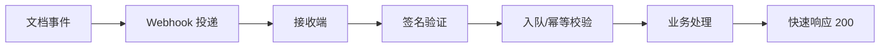

# Webhook 使用指南

## 概述




Webhook 提供事件驱动的通知机制，当文档发生特定变更时，系统会自动向您配置的 URL 发送 HTTP POST 请求。

## 支持的事件类型

### 1. Request 相关事件

| 事件类型 | 说明 | 触发时机 |
|---------|------|---------|
| `request_created` | 创建变更请求 | 用户创建新的变更请求时 |
| `request_merged` | 请求已合并 | 变更请求被合并到主文档时 |
| `request_closed` | 请求已关闭 | 变更请求被关闭（拒绝）时 |
| `request_reopened` | 请求重新打开 | 已关闭的请求被重新打开时 |

**载荷示例：**
```json
{
  "event": "request_merged",
  "timestamp": "2024-12-01T10:00:00Z",
  "webhookId": "webhook-123",
  "deliveryId": "delivery-456",
  "docType": "product",
  "docId": "123",
  "triggeredBy": "user-789",
  "payload": {
    "requestId": "req-001",
    "title": "更新产品价格",
    "author": "user-789",
    "mergedBy": "user-admin",
    "mergedAt": "2024-12-01T10:00:00Z",
    "revisionId": "rev-100",
    "changesApplied": 5
  }
}
```

### 2. Approval 相关事件

| 事件类型 | 说明 | 触发时机 |
|---------|------|---------|
| `approval_started` | 审批流程开始 | 发起审批流程时 |
| `approval_approved` | 审批通过 | 审批流程全部通过时 |
| `approval_rejected` | 审批拒绝 | 审批被拒绝时 |
| `approval_canceled` | 审批取消 | 审批流程被取消时 |
| `approval_node_completed` | 审批节点完成 | 单个审批节点完成时 |

**载荷示例：**
```json
{
  "event": "approval_approved",
  "timestamp": "2024-12-01T11:00:00Z",
  "webhookId": "webhook-123",
  "deliveryId": "delivery-457",
  "docType": "product",
  "docId": "123",
  "triggeredBy": "user-approver",
  "payload": {
    "instanceId": "approval-001",
    "status": "approved",
    "currentNode": "final",
    "approver": "user-approver",
    "decision": "approve",
    "comment": "批准通过",
    "completedAt": "2024-12-01T11:00:00Z"
  }
}
```

### 3. Comment 相关事件

| 事件类型 | 说明 | 触发时机 |
|---------|------|---------|
| `comment_created` | 创建评论 | 用户创建新评论时 |
| `comment_updated` | 更新评论 | 评论内容被修改时 |
| `comment_deleted` | 删除评论 | 评论被删除时 |
| `comment_resolved` | 评论已解决 | 评论被标记为已解决时 |
| `comment_mentioned` | 用户被 @提及 | 评论中 @提及用户时 |

**载荷示例：**
```json
{
  "event": "comment_created",
  "timestamp": "2024-12-01T12:00:00Z",
  "webhookId": "webhook-123",
  "deliveryId": "delivery-458",
  "docType": "product",
  "docId": "123",
  "triggeredBy": "user-001",
  "payload": {
    "commentId": "comment-001",
    "target": {
      "scope": "cell",
      "rowId": "row-123",
      "fieldId": "price"
    },
    "content": "@张三 这个价格需要确认",
    "mentions": [
      {
        "id": "user-002",
        "displayName": "张三"
      }
    ],
    "createdBy": "user-001",
    "createdAt": "2024-12-01T12:00:00Z"
  }
}
```

### 4. Metadata 相关事件

| 事件类型 | 说明 | 触发时机 |
|---------|------|---------|
| `metadata_updated` | 元数据更新 | 元数据整体更新时 |
| `metadata_field_added` | 添加字段 | 新增字段时 |
| `metadata_field_updated` | 更新字段 | 修改字段配置时 |
| `metadata_field_deleted` | 删除字段 | 删除字段时 |

**载荷示例：**
```json
{
  "event": "metadata_field_added",
  "timestamp": "2024-12-01T13:00:00Z",
  "webhookId": "webhook-123",
  "deliveryId": "delivery-459",
  "docType": "product",
  "docId": "123",
  "triggeredBy": "user-admin",
  "payload": {
    "field": {
      "id": "field-new",
      "name": "库存数量",
      "type": "number",
      "required": true,
      "defaultValue": 0
    },
    "updatedBy": "user-admin",
    "updatedAt": "2024-12-01T13:00:00Z"
  }
}
```

### 5. View 相关事件

| 事件类型 | 说明 | 触发时机 |
|---------|------|---------|
| `view_created` | 创建视图 | 创建新视图时 |
| `view_updated` | 更新视图 | 修改视图配置时 |
| `view_deleted` | 删除视图 | 删除视图时 |
| `view_default_changed` | 默认视图变更 | 更改默认视图时 |

**载荷示例：**
```json
{
  "event": "view_created",
  "timestamp": "2024-12-01T14:00:00Z",
  "webhookId": "webhook-123",
  "deliveryId": "delivery-460",
  "docType": "product",
  "docId": "123",
  "triggeredBy": "user-001",
  "payload": {
    "viewId": "view-new",
    "name": "低库存产品",
    "type": "table",
    "filters": {
      "logic": "and",
      "conditions": [
        {
          "field": "stock",
          "operator": "range",
          "rangeStart": 0,
          "rangeEnd": 10
        }
      ]
    },
    "createdBy": "user-001",
    "createdAt": "2024-12-01T14:00:00Z"
  }
}
```

### 6. Data 相关事件

| 事件类型 | 说明 | 触发时机 |
|---------|------|---------|
| `data_row_created` | 创建数据行 | 新增数据行时 |
| `data_row_updated` | 更新数据行 | 修改数据行时 |
| `data_row_deleted` | 删除数据行 | 删除数据行时 |
| `data_bulk_operation` | 批量操作 | 批量创建/更新/删除时 |

### 7. Revision 相关事件

| 事件类型 | 说明 | 触发时机 |
|---------|------|---------|
| `revision_created` | 创建修订 | 生成新修订记录时 |
| `revision_reverted` | 修订回滚 | 回滚到历史版本时 |

## 快速开始

### 1. 创建 Webhook

```bash
curl -X POST 'https://open.nexusbook.app/api/v1/webhooks' \
  -H 'Authorization: Bearer YOUR_TOKEN' \
  -H 'Content-Type: application/json' \
  -d '{
    "name": "产品变更通知",
    "description": "监控产品文档的所有变更",
    "url": "https://your-domain.com/webhooks/nexusbook",
    "events": [
      "request_merged",
      "approval_approved",
      "comment_created",
      "metadata_field_added",
      "view_created"
    ],
    "filters": {
      "docTypes": ["product"],
      "docIds": ["123", "456"]
    },
    "timeout": 30,
    "maxRetries": 3,
    "retryInterval": 60
  }'
```

### 2. 接收 Webhook 事件

**Node.js 示例：**

```javascript
const express = require('express');
const crypto = require('crypto');

const app = express();
app.use(express.json());

// Webhook 密钥（从 NexusBook 获取）
const WEBHOOK_SECRET = 'your_webhook_secret';

// 验证签名
function verifySignature(payload, signature) {
  const hmac = crypto.createHmac('sha256', WEBHOOK_SECRET);
  const digest = 'sha256=' + hmac.update(payload).digest('hex');
  return crypto.timingSafeEqual(
    Buffer.from(signature),
    Buffer.from(digest)
  );
}

app.post('/webhooks/nexusbook', (req, res) => {
  const signature = req.headers['x-webhook-signature'];
  const payload = JSON.stringify(req.body);

  // 验证签名
  if (!verifySignature(payload, signature)) {
    return res.status(401).send('Invalid signature');
  }

  const event = req.body;
  console.log('Received event:', event.event);

  // 处理不同类型的事件
  switch (event.event) {
    case 'request_merged':
      handleRequestMerged(event);
      break;
    case 'approval_approved':
      handleApprovalApproved(event);
      break;
    case 'comment_created':
      handleCommentCreated(event);
      break;
    // ... 其他事件类型
  }

  // 快速响应 200，避免超时
  res.status(200).send('OK');
});

function handleRequestMerged(event) {
  const { requestId, title, revisionId } = event.payload;
  console.log(`Request ${requestId} merged: ${title}`);
  // 发送通知、更新数据库等
}

function handleApprovalApproved(event) {
  const { instanceId, approver } = event.payload;
  console.log(`Approval ${instanceId} approved by ${approver}`);
  // 触发后续流程
}

function handleCommentCreated(event) {
  const { commentId, content, mentions } = event.payload;
  console.log(`New comment: ${content}`);
  // 发送邮件通知被 @提及的用户
  mentions?.forEach(user => {
    sendEmailNotification(user.email, content);
  });
}

app.listen(3000, () => {
  console.log('Webhook server listening on port 3000');
});
```

**Python 示例：**

```python
from flask import Flask, request, jsonify
import hmac
import hashlib

app = Flask(__name__)

WEBHOOK_SECRET = 'your_webhook_secret'

def verify_signature(payload, signature):
    mac = hmac.new(
        WEBHOOK_SECRET.encode(),
        payload.encode(),
        hashlib.sha256
    )
    expected = 'sha256=' + mac.hexdigest()
    return hmac.compare_digest(expected, signature)

@app.route('/webhooks/nexusbook', methods=['POST'])
def webhook():
    signature = request.headers.get('X-Webhook-Signature')
    payload = request.get_data(as_text=True)
    
    if not verify_signature(payload, signature):
        return jsonify({'error': 'Invalid signature'}), 401
    
    event = request.json
    event_type = event['event']
    
    if event_type == 'request_merged':
        handle_request_merged(event)
    elif event_type == 'approval_approved':
        handle_approval_approved(event)
    elif event_type == 'comment_created':
        handle_comment_created(event)
    
    return jsonify({'status': 'ok'}), 200

def handle_request_merged(event):
    request_id = event['payload']['requestId']
    print(f'Request {request_id} merged')

def handle_approval_approved(event):
    instance_id = event['payload']['instanceId']
    print(f'Approval {instance_id} approved')

def handle_comment_created(event):
    comment_id = event['payload']['commentId']
    print(f'Comment {comment_id} created')

if __name__ == '__main__':
    app.run(port=3000)
```

### 3. 测试 Webhook

```bash
# 发送测试事件
curl -X POST 'https://open.nexusbook.app/api/v1/webhooks/webhook-123/test' \
  -H 'Authorization: Bearer YOUR_TOKEN' \
  -H 'Content-Type: application/json' \
  -d '{
    "event": "request_merged",
    "payload": {
      "requestId": "test-req",
      "title": "测试请求"
    }
  }'
```

## 事件过滤

### 按文档类型过滤

```json
{
  "filters": {
    "docTypes": ["product", "inventory"]
  }
}
```

### 按文档 ID 过滤

```json
{
  "filters": {
    "docIds": ["123", "456", "789"]
  }
}
```

### 按用户过滤

```json
{
  "filters": {
    "userIds": ["user-001", "user-002"]
  }
}
```

### 自定义条件过滤

```json
{
  "filters": {
    "conditions": [
      {
        "path": "$.payload.status",
        "operator": "eq",
        "value": "urgent"
      },
      {
        "path": "$.payload.amount",
        "operator": "range",
        "value": [1000, 10000]
      }
    ]
  }
}
```

## 安全最佳实践

### 1. 验证签名

始终验证 `X-Webhook-Signature` 头，确保请求来自 NexusBook：

```javascript
const signature = req.headers['x-webhook-signature'];
const isValid = verifySignature(payload, signature);
if (!isValid) {
  return res.status(401).send('Invalid signature');
}
```

### 2. 快速响应

在 30 秒内响应 200 状态码，避免超时重试：

```javascript
app.post('/webhook', async (req, res) => {
  // 立即响应
  res.status(200).send('OK');
  
  // 异步处理事件
  processEventAsync(req.body);
});
```

### 3. 幂等性处理

使用 `deliveryId` 确保事件只处理一次：

```javascript
const processedDeliveries = new Set();

function processEvent(event) {
  if (processedDeliveries.has(event.deliveryId)) {
    console.log('Event already processed');
    return;
  }
  
  // 处理事件
  // ...
  
  processedDeliveries.add(event.deliveryId);
}
```

### 4. 错误处理

妥善处理错误，避免频繁失败导致 Webhook 被禁用：

```javascript
app.post('/webhook', async (req, res) => {
  try {
    await processEvent(req.body);
    res.status(200).send('OK');
  } catch (error) {
    console.error('Error processing webhook:', error);
    // 返回 200 避免重试（如果是业务逻辑错误）
    res.status(200).send('Error logged');
  }
});
```

## 管理 Webhook

### 查看投递历史

```bash
curl 'https://open.nexusbook.app/api/v1/webhooks/webhook-123/deliveries' \
  -H 'Authorization: Bearer YOUR_TOKEN'
```

### 查看统计信息

```bash
curl 'https://open.nexusbook.app/api/v1/webhooks/webhook-123/stats' \
  -H 'Authorization: Bearer YOUR_TOKEN'
```

### 暂停 Webhook

```bash
curl -X POST 'https://open.nexusbook.app/api/v1/webhooks/webhook-123/pause' \
  -H 'Authorization: Bearer YOUR_TOKEN'
```

### 恢复 Webhook

```bash
curl -X POST 'https://open.nexusbook.app/api/v1/webhooks/webhook-123/resume' \
  -H 'Authorization: Bearer YOUR_TOKEN'
```

### 重新投递失败的事件

```bash
curl -X POST 'https://open.nexusbook.app/api/v1/webhooks/webhook-123/deliveries/delivery-456/redeliver' \
  -H 'Authorization: Bearer YOUR_TOKEN'
```

## 常见问题

### Q: Webhook 会重试多少次？

A: 默认重试 3 次，间隔 60 秒。可以在创建 Webhook 时自定义 `maxRetries` 和 `retryInterval`。

### Q: 如何确保事件不会丢失？

A: 系统会持久化所有投递记录，即使 Webhook 暂时失败，也可以通过投递历史查看并手动重新投递。

### Q: 可以接收历史事件吗？

A: Webhook 只推送创建后发生的新事件。如需历史数据，请使用 API 查询。

### Q: 如何调试 Webhook？

A: 
1. 使用测试端点发送测试事件
2. 查看投递历史和详细日志
3. 使用 webhook.site 等工具接收和查看请求

### Q: Webhook URL 必须是 HTTPS 吗？

A: 生产环境强烈建议使用 HTTPS，确保数据传输安全。开发环境可以使用 HTTP。

## 使用场景示例

### 1. 自动通知团队

当重要变更被合并时，自动发送 Slack/钉钉通知：

```javascript
function handleRequestMerged(event) {
  const { title, mergedBy } = event.payload;
  sendSlackNotification({
    channel: '#product-updates',
    text: `🎉 ${mergedBy} 合并了变更: ${title}`
  });
}
```

### 2. 触发 CI/CD 流程

元数据变更时自动触发部署：

```javascript
function handleMetadataUpdated(event) {
  triggerCICD({
    pipeline: 'deploy-schema',
    params: {
      docType: event.docType,
      docId: event.docId
    }
  });
}
```

### 3. 同步到其他系统

数据变更时同步到 ERP/CRM 系统：

```javascript
function handleDataRowUpdated(event) {
  const { rowId, values } = event.payload;
  syncToERP({
    id: rowId,
    data: values
  });
}
```

### 4. 审计日志

记录所有重要操作到审计系统：

```javascript
function handleAnyEvent(event) {
  auditLog.record({
    event: event.event,
    user: event.triggeredBy,
    timestamp: event.timestamp,
    details: event.payload
  });
}
```

## 与 SSE 事件流的对比与选择

- **Webhook（推送）**：由服务器向你配置的 URL 主动发送 HTTP POST；适合触发下游流程、跨系统集成、离线处理；支持失败重试与投递历史。
- **SSE（拉取只读流）**：客户端与 `GET /doc/{docType}/{docId}/events/stream` 建立长连接，持续接收只读事件流；适合看板/仪表盘的近实时更新；由客户端维护连接与断线重连。
- **选择建议**：
  - **服务端到服务端集成**、需可靠投递与重试 → 优先 Webhook。
  - **前端实时展示** 或 **轻量监听** → 优先 SSE。
  - 二者可同时使用：Webhook 驱动流程，SSE 提供页面实时状态。

## 签名验证细节与防重放

- **签名算法**：`HMAC-SHA256(secret, timestamp + '.' + rawPayload)`；HTTP 头：`X-Webhook-Signature`、`X-Webhook-Timestamp`（毫秒）。
- **防重放**：校验 `timestamp` 与当前时间的偏差（建议 ≤ 300 秒）；签名必须使用**原始请求体**（raw body），避免 JSON 重排导致验签失败。

```javascript
const crypto = require('crypto');
const WEBHOOK_SECRET = process.env.WEBHOOK_SECRET;

function safeEqual(a, b) {
  const bufA = Buffer.from(a);
  const bufB = Buffer.from(b);
  if (bufA.length !== bufB.length) return false;
  return crypto.timingSafeEqual(bufA, bufB);
}

function verifyWebhook(req) {
  const signature = req.headers['x-webhook-signature'];
  const timestamp = req.headers['x-webhook-timestamp'];
  const raw = req.rawBody || JSON.stringify(req.body); // 确保使用原始载荷

  const base = `${timestamp}.${raw}`;
  const expected = 'sha256=' + crypto.createHmac('sha256', WEBHOOK_SECRET).update(base).digest('hex');

  // 防重放窗口（5分钟）
  const skew = Math.abs(Date.now() - Number(timestamp));
  if (skew > 300000) return false;

  return safeEqual(expected, signature);
}
```

## 重试策略建议

- **指数退避 + 抖动**：在 `retryInterval` 基础上引入指数退避（如 60s → 120s → 240s）并加入随机抖动，避免突发拥塞；最大重试次数由 `maxRetries` 控制。
- **幂等性**：以 `deliveryId` 为幂等键，使用持久化存储（DB/Redis）记录已处理投递，确保“至多一次”。
- **响应约定**：
  - 业务可重试错误返回非 2xx（如 429/503）以触发重试；
  - 业务逻辑错误但不需重试，返回 200 并记录错误日志。

## 事件过滤最佳实践

- 尽量精确：限定 `docTypes`、`docIds` 与 `userIds`，减少无关流量。
- 使用条件匹配：通过 `filters.conditions` 对载荷进行路径匹配与范围判断，降低下游处理压力。
- 在 URL 层级进行隔离：为不同事件类别使用不同的 Webhook 接收端点，方便权限与速率限制。
