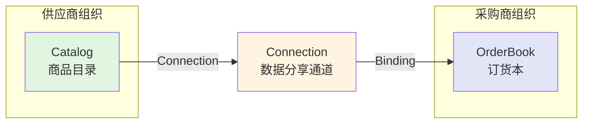
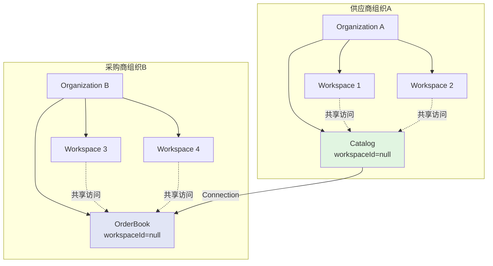
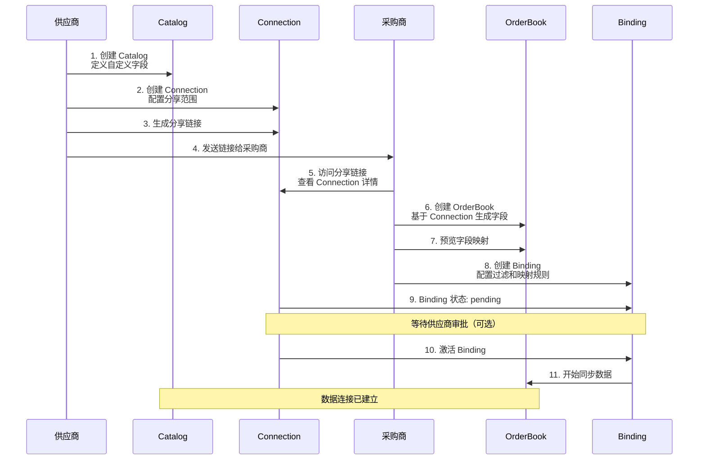
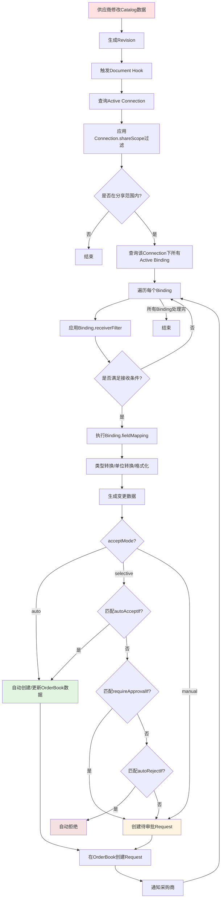
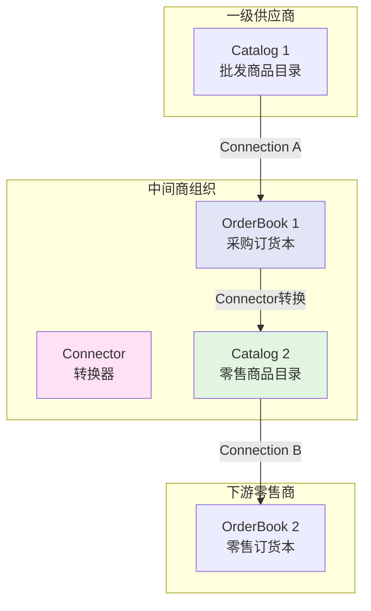
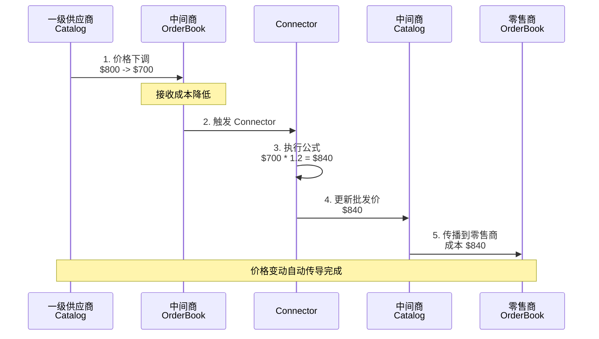
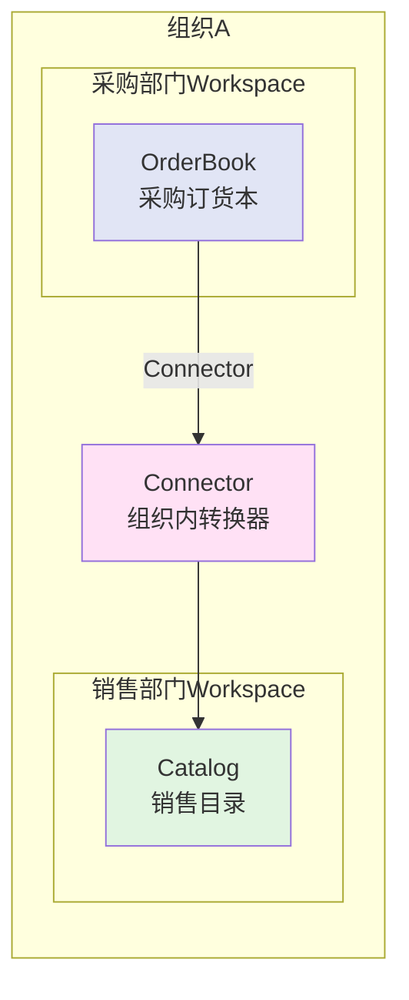
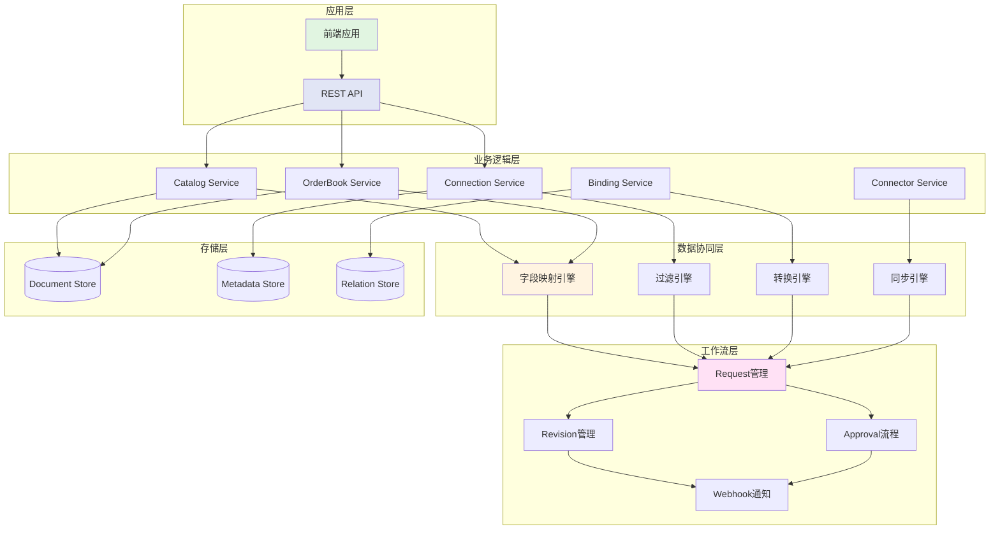

# Catalog-OrderBook 数据协同参考

## 概述

NexusBook 的 Catalog-OrderBook 系统是一个完整的供应链数据协同解决方案，支持跨组织的商品信息共享、订货管理和多级分销。本文档详细介绍其架构设计、工作机制和典型应用场景。

**目标读者**：产品经理、业务分析师、解决方案架构师、技术团队

## 核心概念

### 1. 三大核心资源



- **Catalog（商品目录）**：供应商维护的商品清单，支持自定义字段以适应不同行业（电子产品、服装、食品等）
- **OrderBook（订货本）**：采购商基于供应商 Catalog 生成的订货清单，可自定义字段映射和过滤规则
- **Connection（连接）**：跨组织的数据分享通道，由供应商创建并配置分享范围和权限

### 2. 组织级别资源设计

**关键原则**：Catalog 和 OrderBook 都是组织级别资源（`workspaceId = null`），支持组织内多个 Workspace 共享访问。



**设计优势**：
- 避免在不同 Workspace 中重复维护相同数据
- 支持跨工作区的数据协同和权限控制
- 便于组织级别的数据统计和管理

---

## 第一部分：供应商-采购商联动机制

### 场景 1：建立数据连接

#### 步骤 1：供应商创建 Catalog 并配置自定义字段

供应商根据行业特点定义商品字段。

**示例：电子产品供应商**

```bash
POST /api/v1/organizations/org-supplier/catalogs
{
  "name": "电子产品目录 2024",
  "catalogType": "supplier",
  "sharingEnabled": true,
  "fields": [
    {
      "name": "品牌",
      "type": "single_select",
      "required": true,
      "selectOptions": [
        {"label": "Apple", "color": "#000000"},
        {"label": "Samsung", "color": "#1428A0"},
        {"label": "Huawei", "color": "#FF0000"}
      ]
    },
    {
      "name": "型号",
      "type": "text",
      "required": true
    },
    {
      "name": "规格参数",
      "type": "long_text"
    },
    {
      "name": "库存数量",
      "type": "number",
      "required": true
    },
    {
      "name": "批发价（美元）",
      "type": "currency",
      "required": true
    },
    {
      "name": "建议零售价（美元）",
      "type": "currency"
    }
  ]
}
```

**示例：服装供应商**

```bash
POST /api/v1/organizations/org-fashion/catalogs
{
  "name": "春季服装目录",
  "catalogType": "supplier",
  "fields": [
    {
      "name": "款式名称",
      "type": "text",
      "required": true
    },
    {
      "name": "尺码",
      "type": "multi_select",
      "selectOptions": [
        {"label": "XS"}, {"label": "S"}, {"label": "M"}, 
        {"label": "L"}, {"label": "XL"}, {"label": "XXL"}
      ]
    },
    {
      "name": "颜色",
      "type": "multi_select",
      "selectOptions": [
        {"label": "黑色", "color": "#000000"},
        {"label": "白色", "color": "#FFFFFF"},
        {"label": "红色", "color": "#FF0000"}
      ]
    },
    {
      "name": "材质",
      "type": "text"
    },
    {
      "name": "批发价（人民币）",
      "type": "currency"
    }
  ]
}
```

#### 步骤 2：供应商创建 Connection 并配置分享规则

```bash
POST /api/v1/organizations/org-supplier/connections
{
  "name": "面向大型零售商的连接",
  "sourceCatalogId": "catalog-001",
  "shareMode": "multiple",
  
  # 访问控制：仅允许特定组织访问
  "accessControl": {
    "mode": "whitelist",
    "allowedOrganizations": ["org-retailer-a", "org-retailer-b"]
  },
  
  # 分享范围：仅分享库存大于 10 的商品
  "shareScope": {
    "mode": "filter",
    "filterGroup": {
      "operator": "AND",
      "conditions": [
        {
          "fieldId": "stock_quantity",
          "operator": "gt",
          "value": 10
        },
        {
          "fieldId": "status",
          "operator": "eq",
          "value": "active"
        }
      ]
    }
  },
  
  # 建议的字段映射和冲突解决策略
  "defaultReceiverConfig": {
    "suggestedFieldMapping": {
      "rules": [
        {
          "sourceFieldId": "wholesale_price_usd",
          "targetFieldId": "cost_price",
          "transformType": "unit_convert",
          "unitConversion": {
            "sourceUnit": "USD",
            "targetUnit": "CNY",
            "conversionType": "currency",
            "exchangeRateSource": "daily"
          }
        }
      ],
      "unmappedFields": "create"
    },
    "suggestedAcceptMode": "selective"
  },
  
  # 订阅变更事件
  "propagationEvents": {
    "eventTypes": [
      "row_created",
      "row_updated",
      "row_deleted",
      "field_value_changed"
    ],
    "batchMerge": true,
    "batchWindowSeconds": 300
  }
}
```

#### 步骤 3：供应商生成并分享连接链接

```bash
# 生成分享链接
POST /api/v1/organizations/org-supplier/connections/conn-001/share-link
{
  "expiresAt": "2024-12-31T23:59:59Z",
  "maxUses": 100
}

# 响应
{
  "shareUrl": "https://open.nexusbook.app/connect/share/abc123def456",
  "qrCode": "data:image/png;base64,...",
  "expiresAt": "2024-12-31T23:59:59Z"
}
```

#### 步骤 4：采购商接受连接并创建 Binding

**4.1 采购商访问分享链接**

```bash
GET /connect/share/abc123def456

# 响应：Connection 详情
{
  "connectionId": "conn-001",
  "name": "面向大型零售商的连接",
  "sourceOrganization": {
    "id": "org-supplier",
    "name": "科技供应链有限公司"
  },
  "sourceCatalog": {
    "id": "catalog-001",
    "name": "电子产品目录 2024",
    "productCount": 350
  },
  "shareMode": "multiple"
}
```

**4.2 采购商创建 OrderBook（基于 Connection 自动生成字段）**

```bash
POST /api/v1/organizations/org-retailer/orderbooks
{
  "name": "电子产品订货本",
  "description": "来自科技供应链的商品",
  
  # 基于已连接的 Connection 创建
  "sourceConnectionIds": ["conn-001"],
  
  # 自定义额外字段
  "fields": [
    {
      "name": "我方SKU",
      "type": "text",
      "description": "内部商品编码"
    },
    {
      "name": "销售价格（人民币）",
      "type": "currency"
    },
    {
      "name": "最小起订量",
      "type": "number"
    }
  ]
}

# 响应：自动生成的 OrderBook（已包含源字段映射）
{
  "orderBookId": "orderbook-001",
  "fields": [
    # 来自 Catalog 的映射字段
    {
      "id": "brand",
      "name": "品牌",
      "type": "single_select",
      "sourceCatalogId": "catalog-001",
      "sourceFieldId": "brand"
    },
    {
      "id": "model",
      "name": "型号",
      "type": "text",
      "sourceCatalogId": "catalog-001",
      "sourceFieldId": "model"
    },
    {
      "id": "cost_price",
      "name": "采购成本（人民币）",
      "type": "currency",
      "sourceCatalogId": "catalog-001",
      "sourceFieldId": "wholesale_price_usd"
    },
    # 自定义字段
    {
      "id": "internal_sku",
      "name": "我方SKU",
      "type": "text"
    },
    {
      "id": "retail_price",
      "name": "销售价格（人民币）",
      "type": "currency"
    }
  ]
}
```

**4.3 预览字段映射**

```bash
POST /api/v1/organizations/org-retailer/orderbooks/orderbook-001/field-mapping/preview
{
  "connectionId": "conn-001"
}

# 响应：建议的映射规则
{
  "suggestedMappings": [
    {
      "sourceFieldId": "brand",
      "targetFieldId": "brand",
      "transformType": "direct",
      "propagationMode": "oneway"
    },
    {
      "sourceFieldId": "wholesale_price_usd",
      "targetFieldId": "cost_price",
      "transformType": "unit_convert",
      "unitConversion": {
        "sourceUnit": "USD",
        "targetUnit": "CNY",
        "conversionType": "currency",
        "exchangeRateSource": "daily",
        "fixedRate": 7.2
      },
      "propagationMode": "oneway"
    },
    {
      "sourceFieldId": "stock_quantity",
      "targetFieldId": "available_stock",
      "transformType": "direct",
      "propagationMode": "oneway"
    }
  ],
  "unmappedSourceFields": ["suggested_retail_price"],
  "unmappedTargetFields": ["internal_sku", "retail_price"]
}
```

**4.4 创建 Binding 并配置过滤规则**

```bash
POST /api/v1/organizations/org-retailer/orderbooks/orderbook-001/bindings
{
  "connectionId": "conn-001",
  "targetOrderBookId": "orderbook-001",
  
  # 接收方过滤：只接收特定品牌和价格范围的商品
  "receiverFilter": {
    "filterGroup": {
      "operator": "AND",
      "conditions": [
        {
          "fieldId": "brand",
          "operator": "in",
          "values": ["Apple", "Samsung"]
        },
        {
          "fieldId": "wholesale_price_usd",
          "operator": "lte",
          "value": 1000
        }
      ],
      "groups": [
        {
          "operator": "OR",
          "conditions": [
            {
              "fieldId": "stock_quantity",
              "operator": "gte",
              "value": 50
            },
            {
              "fieldId": "is_pre_order",
              "operator": "eq",
              "value": true
            }
          ]
        }
      ]
    },
    "acceptMode": "selective",
    "manualAcceptRules": {
      # 自动接受：价格低于500美元且库存充足
      "autoAcceptIf": {
        "operator": "AND",
        "conditions": [
          {
            "fieldId": "wholesale_price_usd",
            "operator": "lt",
            "value": 500
          },
          {
            "fieldId": "stock_quantity",
            "operator": "gt",
            "value": 100
          }
        ]
      },
      # 需要审批：高价商品
      "requireApprovalIf": {
        "operator": "AND",
        "conditions": [
          {
            "fieldId": "wholesale_price_usd",
            "operator": "gte",
            "value": 500
          }
        ]
      },
      # 自动拒绝：库存不足
      "autoRejectIf": {
        "operator": "AND",
        "conditions": [
          {
            "fieldId": "stock_quantity",
            "operator": "lt",
            "value": 10
          }
        ]
      },
      "defaultAction": "manual"
    },
    "deduplicationStrategy": "by_field",
    "deduplicationFieldIds": ["model"]
  },
  
  # 字段映射配置
  "fieldMapping": {
    "rules": [
      {
        "sourceFieldId": "brand",
        "targetFieldId": "brand",
        "transformType": "direct",
        "propagationMode": "oneway",
        "enabled": true
      },
      {
        "sourceFieldId": "model",
        "targetFieldId": "model",
        "transformType": "direct",
        "propagationMode": "oneway"
      },
      {
        "sourceFieldId": "wholesale_price_usd",
        "targetFieldId": "cost_price",
        "transformType": "unit_convert",
        "unitConversion": {
          "sourceUnit": "USD",
          "targetUnit": "CNY",
          "conversionType": "currency",
          "exchangeRateSource": "daily"
        },
        "propagationMode": "oneway"
      },
      {
        "sourceFieldId": "specs",
        "targetFieldId": "product_description",
        "transformType": "format",
        "formatConfig": {
          "template": "规格：${value}"
        },
        "propagationMode": "oneway"
      }
    ],
    "unmappedFields": "ignore"
  },
  
  # 冲突解决策略
  "conflictResolution": {
    "defaultStrategy": "keep_upstream",
    "fieldStrategies": {
      "cost_price": {
        "strategy": "latest_wins"
      }
    }
  }
}
```

### 完整连接建立流程图



---

## 第二部分：商品信息变动联动机制

### 数据传播完整流程

当供应商的 Catalog 发生变更时，系统会自动将变更传播到所有连接的 OrderBook。



### 场景 2：价格变动

**供应商降价**

```bash
# 供应商更新 Catalog 商品价格
PATCH /api/v1/organizations/org-supplier/catalogs/catalog-001/rows/row-123?requestId=req-price-001
{
  "values": [
    {
      "fieldId": "wholesale_price_usd",
      "value": {
        "number": 699.99  # 从 799.99 降到 699.99
      }
    }
  ]
}

# 系统自动生成 Revision
# 触发 Document Hook
# 查询所有 Active Connection
# 对每个 Connection 下的 Binding 执行传播
```

**采购商侧的自动处理**

```bash
# Binding 配置的字段映射会自动转换价格
# wholesale_price_usd (699.99 USD) 
#   -> unit_convert (汇率 7.2)
#   -> cost_price (5039.93 CNY)

# 根据 acceptMode 决定如何处理
# 如果 acceptMode = "auto"，直接更新 OrderBook
# 如果 acceptMode = "selective"，检查 autoAcceptIf 规则

# 假设满足自动接受条件
POST /api/v1/organizations/org-retailer/orderbooks/orderbook-001/rows/batch-update?requestId=req-sync-001
{
  "rows": [
    {
      "target": {
        "row": "row-456"
      },
      "values": [
        {
          "fieldId": "cost_price",
          "value": {
            "number": 5039.93
          }
        }
      ],
      "metadata": {
        "syncSource": {
          "connectionId": "conn-001",
          "sourceCatalogId": "catalog-001",
          "sourceRowId": "row-123",
          "sourceRevisionId": "rev-price-001",
          "syncedAt": "2024-12-14T10:00:00Z"
        }
      }
    }
  ]
}
```

### 场景 3：库存变动

**供应商补货**

```bash
# 供应商更新库存
PATCH /api/v1/organizations/org-supplier/catalogs/catalog-001/rows/row-123?requestId=req-stock-001
{
  "values": [
    {
      "fieldId": "stock_quantity",
      "value": {
        "number": 150  # 从 20 更新到 150
      }
    }
  ]
}
```

**采购商侧的处理**

如果该商品之前因库存不足被 `autoRejectIf` 规则拒绝，现在库存充足后会重新触发同步：

```bash
# 系统检测到库存从 20 增加到 150
# 满足 Binding.receiverFilter 条件（stock_quantity >= 50）
# 创建新的 Request 通知采购商

POST /api/v1/organizations/org-retailer/orderbooks/orderbook-001/requests
{
  "requestId": "req-new-product-001",
  "requestType": "data_sync",
  "source": {
    "connectionId": "conn-001",
    "catalogId": "catalog-001",
    "rowId": "row-123"
  },
  "changes": [
    {
      "operation": "create_row",
      "data": {
        "values": [
          {
            "fieldId": "brand",
            "value": {"text": "Apple"}
          },
          {
            "fieldId": "model",
            "value": {"text": "iPhone 15 Pro"}
          },
          {
            "fieldId": "cost_price",
            "value": {"number": 5039.93}
          },
          {
            "fieldId": "available_stock",
            "value": {"number": 150}
          }
        ]
      }
    }
  ],
  "status": "pending",
  "message": {
    "zh": "检测到新的可订购商品",
    "en": "New orderable product detected"
  }
}

# 发送通知给采购商
POST /webhooks/order-manager
{
  "event": "orderbook_sync_request_created",
  "payload": {
    "requestId": "req-new-product-001",
    "orderBookId": "orderbook-001",
    "productInfo": {
      "brand": "Apple",
      "model": "iPhone 15 Pro",
      "newStock": 150
    }
  }
}
```

### 场景 4：商品下架

**供应商停止销售某商品**

```bash
# 供应商删除商品或标记为不可用
DELETE /api/v1/organizations/org-supplier/catalogs/catalog-001/rows/row-123?requestId=req-remove-001

# 或者更新状态
PATCH /api/v1/organizations/org-supplier/catalogs/catalog-001/rows/row-123?requestId=req-status-001
{
  "values": [
    {
      "fieldId": "status",
      "value": {
        "selectOption": "discontinued"
      }
    }
  ]
}
```

**采购商侧的处理**

```bash
# 根据 Connection.shareScope 的配置
# 如果商品不再满足分享条件（status != "active"）
# 会触发删除或更新操作

# 生成 Request 通知采购商
POST /api/v1/organizations/org-retailer/orderbooks/orderbook-001/requests
{
  "requestId": "req-remove-product-001",
  "requestType": "data_sync",
  "changes": [
    {
      "operation": "delete_row",
      "rowId": "row-456",
      "reason": {
        "zh": "供应商已停止供应此商品",
        "en": "Supplier has discontinued this product"
      }
    }
  ],
  "status": "pending"
}
```

### 批量变更处理

供应商批量更新商品信息时，系统会在批处理窗口内合并变更：

```bash
# 供应商批量更新 100 个商品的价格
POST /api/v1/organizations/org-supplier/catalogs/catalog-001/rows/batch-update?requestId=req-batch-001
{
  "rows": [...100 rows...]
}

# 系统配置：propagationEvents.batchMerge = true
#          propagationEvents.batchWindowSeconds = 300

# 5分钟内的所有变更会合并成一个 Revision
# 然后批量传播到所有 OrderBook
# 减少网络请求和数据库操作
```

---

## 第三部分：中间商（二级分销）机制

中间商既是采购商（从上游进货），也是供应商（向下游销售）。

### 架构模式



### 场景 5：中间商工作流程

#### 5.1 作为采购商：接收上游商品

```bash
# 中间商从一级供应商接收商品
# Connection A: 一级供应商 Catalog 1 -> 中间商 OrderBook 1

POST /api/v1/organizations/org-middle/orderbooks/orderbook-001/bindings
{
  "connectionId": "conn-upstream-001",
  "receiverFilter": {
    "filterGroup": {
      "operator": "AND",
      "conditions": [
        {
          "fieldId": "wholesale_price_usd",
          "operator": "lte",
          "value": 500  # 只采购单价低于500美元的商品
        },
        {
          "fieldId": "min_order_quantity",
          "operator": "lte",
          "value": 10  # 起订量不超过10件
        }
      ]
    },
    "acceptMode": "auto"
  },
  "fieldMapping": {
    "rules": [
      {
        "sourceFieldId": "wholesale_price_usd",
        "targetFieldId": "purchase_cost_usd",
        "transformType": "direct"
      }
    ]
  }
}
```

#### 5.2 转换为下游 Catalog

使用 Connector 将 OrderBook 转换为新的 Catalog：

```bash
POST /api/v1/organizations/org-middle/connectors
{
  "name": "订货本转零售目录",
  "connectorType": "orderbook_to_catalog",
  "sourceDocId": "orderbook-001",
  "sourceDocType": "orderbook",
  "targetDocId": "catalog-002",
  "targetDocType": "catalog",
  
  "orderbookToCatalogConfig": {
    # 字段映射：添加利润率
    "fieldMapping": {
      "rules": [
        {
          "sourceFieldId": "purchase_cost_usd",
          "targetFieldId": "wholesale_price_usd",
          "transformType": "formula",
          "formula": "purchase_cost_usd * 1.2",  # 加价20%
          "propagationMode": "sync"
        },
        {
          "sourceFieldId": "brand",
          "targetFieldId": "brand",
          "transformType": "direct"
        },
        {
          "sourceFieldId": "model",
          "targetFieldId": "model",
          "transformType": "direct"
        }
      ]
    },
    
    # 过滤规则：只转换有利润空间的商品
    "sourceFilter": {
      "operator": "AND",
      "conditions": [
        {
          "fieldId": "purchase_cost_usd",
          "operator": "lt",
          "value": 400  # 成本低于400美元的商品才转换
        }
      ]
    },
    
    # 同步模式：实时同步
    "syncMode": "realtime",
    "conflictResolution": "source_wins"
  }
}
```

#### 5.3 作为供应商：向下游分享

```bash
# 创建面向零售商的 Connection
POST /api/v1/organizations/org-middle/connections
{
  "name": "零售商连接",
  "sourceCatalogId": "catalog-002",
  "shareMode": "multiple",
  
  "shareScope": {
    "mode": "filter",
    "filterGroup": {
      "operator": "AND",
      "conditions": [
        {
          "fieldId": "wholesale_price_usd",
          "operator": "lte",
          "value": 600
        }
      ]
    }
  },
  
  "defaultReceiverConfig": {
    "suggestedFieldMapping": {
      "rules": [
        {
          "sourceFieldId": "wholesale_price_usd",
          "targetFieldId": "cost_price",
          "transformType": "direct"
        }
      ]
    }
  }
}
```

### 价格传导机制



### 库存管理

中间商可以设置库存缓冲策略：

```bash
# Connector 配置：库存转换规则
{
  "orderbookToCatalogConfig": {
    "fieldMapping": {
      "rules": [
        {
          "sourceFieldId": "available_stock",
          "targetFieldId": "stock_quantity",
          "transformType": "formula",
          # 只转换80%的库存，保留20%作为安全库存
          "formula": "FLOOR(available_stock * 0.8)"
        }
      ]
    }
  }
}
```

---

## 第四部分：组织内文档连接

在同一组织内，可以将 OrderBook 转换为 Catalog，用于内部分销或跨部门共享。

### 场景 6：OrderBook 转 Catalog

**用例**：采购部门的 OrderBook 转换为销售部门的 Catalog



**配置示例**：

```bash
POST /api/v1/organizations/org-company/connectors
{
  "name": "采购到销售转换",
  "connectorType": "orderbook_to_catalog",
  "sourceDocId": "orderbook-purchase-001",
  "targetDocId": "catalog-sales-001",
  
  "orderbookToCatalogConfig": {
    "fieldMapping": {
      "rules": [
        # 成本价转为内部批发价（加价30%）
        {
          "sourceFieldId": "purchase_cost",
          "targetFieldId": "internal_wholesale_price",
          "transformType": "formula",
          "formula": "purchase_cost * 1.3"
        },
        
        # 建议零售价（加价50%）
        {
          "sourceFieldId": "purchase_cost",
          "targetFieldId": "suggested_retail_price",
          "transformType": "formula",
          "formula": "purchase_cost * 1.5"
        },
        
        # 直接映射
        {
          "sourceFieldId": "product_name",
          "targetFieldId": "product_name",
          "transformType": "direct"
        },
        
        # 库存转换（预留10%）
        {
          "sourceFieldId": "total_stock",
          "targetFieldId": "available_stock",
          "transformType": "formula",
          "formula": "FLOOR(total_stock * 0.9)"
        }
      ],
      "unmappedFields": "ignore"
    },
    
    # 只转换已验收的商品
    "sourceFilter": {
      "operator": "AND",
      "conditions": [
        {
          "fieldId": "inspection_status",
          "operator": "eq",
          "value": "approved"
        },
        {
          "fieldId": "stock_location",
          "operator": "eq",
          "value": "main_warehouse"
        }
      ]
    },
    
    "syncMode": "scheduled",
    "scheduleConfig": {
      "cron": "0 0 * * *",  # 每天凌晨同步
      "timezone": "Asia/Shanghai"
    }
  }
}
```

### 场景 7：Catalog 克隆

在组织内复制 Catalog 用于不同业务场景：

```bash
POST /api/v1/organizations/org-company/connectors
{
  "name": "主目录克隆到促销目录",
  "connectorType": "catalog_clone",
  "sourceDocId": "catalog-main-001",
  "targetDocId": "catalog-promo-001",
  
  "catalogCloneConfig": {
    "fieldMapping": {
      "rules": [
        # 价格打8折
        {
          "sourceFieldId": "regular_price",
          "targetFieldId": "promo_price",
          "transformType": "formula",
          "formula": "regular_price * 0.8"
        }
      ]
    },
    
    # 只克隆促销商品
    "sourceFilter": {
      "operator": "AND",
      "conditions": [
        {
          "fieldId": "promo_eligible",
          "operator": "eq",
          "value": true
        }
      ]
    },
    
    "syncMode": "realtime",
    "bidirectional": false
  }
}
```

---

## 第五部分：完整架构总览

### 系统架构层次



### 核心组件职责

#### 1. Catalog Service
- 管理供应商商品目录
- 支持自定义字段定义
- 处理商品增删改查
- 生成数据变更 Revision

#### 2. OrderBook Service
- 管理采购商订货本
- 基于 Connection 自动生成字段
- 接收上游数据同步
- 支持字段映射预览

#### 3. Connection Service（Outbound）
- 创建跨组织数据分享通道
- 配置分享范围和访问控制
- 管理默认接收方配置
- 监听源 Catalog 变更事件

#### 4. Binding Service（Inbound）
- 建立 OrderBook 到 Connection 的绑定
- 配置接收方过滤规则
- 配置字段映射转换
- 执行数据同步逻辑

#### 5. Connector Service
- 组织内文档转换
- OrderBook -> Catalog 转换
- Catalog -> Catalog 克隆
- 支持实时/定时同步

#### 6. 字段映射引擎
- 直接映射（direct）
- 类型转换（type_convert）
- 单位转换（unit_convert）
- 选项映射（option_mapping）
- 公式计算（formula）
- 字符串格式化（format）
- 字段合并/拆分（merge/split）

#### 7. 过滤引擎
- 嵌套逻辑条件组（AND/OR）
- 多种比较运算符
- 自动接受/拒绝规则
- 去重策略

#### 8. 同步引擎
- 事件监听和触发
- 批量变更合并
- 冲突解决
- 增量同步

---

## 第六部分：典型业务场景

### 场景 8：跨境电商

**业务需求**：
- 中国供应商向美国零售商销售商品
- 需要货币转换（人民币 -> 美元）
- 需要单位转换（公斤 -> 磅）
- 需要选项翻译（中文 -> 英文）

**解决方案**：

```bash
# Connection 配置
{
  "defaultReceiverConfig": {
    "suggestedFieldMapping": {
      "rules": [
        # 货币转换
        {
          "sourceFieldId": "price_cny",
          "targetFieldId": "price_usd",
          "transformType": "unit_convert",
          "unitConversion": {
            "sourceUnit": "CNY",
            "targetUnit": "USD",
            "conversionType": "currency",
            "exchangeRateSource": "realtime"
          }
        },
        
        # 重量单位转换
        {
          "sourceFieldId": "weight_kg",
          "targetFieldId": "weight_lb",
          "transformType": "unit_convert",
          "unitConversion": {
            "sourceUnit": "kg",
            "targetUnit": "lb",
            "conversionType": "weight",
            "customRate": 2.20462
          }
        },
        
        # 选项翻译
        {
          "sourceFieldId": "color_cn",
          "targetFieldId": "color_en",
          "transformType": "option_mapping",
          "optionMapping": {
            "mappings": {
              "红色": "Red",
              "蓝色": "Blue",
              "绿色": "Green",
              "黑色": "Black",
              "白色": "White"
            },
            "unmappedStrategy": "keep_original"
          }
        }
      ]
    }
  }
}
```

### 场景 9：季节性促销

**业务需求**：
- 供应商在促销季节降价
- 采购商只接受降价通知，涨价需要审批
- 自动更新促销商品

**解决方案**：

```bash
# Binding 配置
{
  "receiverFilter": {
    "acceptMode": "selective",
    "manualAcceptRules": {
      # 自动接受：价格下降
      "autoAcceptIf": {
        "operator": "AND",
        "conditions": [
          {
            "fieldId": "_change_type",
            "operator": "eq",
            "value": "price_decrease"
          }
        ]
      },
      
      # 需要审批：价格上涨
      "requireApprovalIf": {
        "operator": "AND",
        "conditions": [
          {
            "fieldId": "_change_type",
            "operator": "eq",
            "value": "price_increase"
          }
        ]
      },
      
      "defaultAction": "accept"
    }
  },
  
  "conflictResolution": {
    "fieldStrategies": {
      "price": {
        "strategy": "keep_upstream"  # 价格变动始终以上游为准
      },
      "internal_notes": {
        "strategy": "keep_local"  # 内部备注保持本地值
      }
    }
  }
}
```

### 场景 10：多供应商整合

**业务需求**：
- 采购商从多个供应商采购同类商品
- 需要统一字段格式
- 需要去重和合并

**解决方案**：

```bash
# OrderBook 配置多个 Binding
POST /api/v1/organizations/org-retailer/orderbooks/orderbook-001/bindings
{
  "connectionId": "conn-supplier-a-001",
  "fieldMapping": {
    "rules": [
      # 供应商A的字段映射
      {
        "sourceFieldId": "item_code",
        "targetFieldId": "unified_sku",
        "transformType": "format",
        "formatConfig": {
          "template": "SUP-A-${value}"
        }
      }
    ]
  },
  "receiverFilter": {
    "deduplicationStrategy": "by_fields",
    "deduplicationFieldIds": ["brand", "model"]
  }
}

POST /api/v1/organizations/org-retailer/orderbooks/orderbook-001/bindings
{
  "connectionId": "conn-supplier-b-001",
  "fieldMapping": {
    "rules": [
      # 供应商B的字段映射
      {
        "sourceFieldId": "product_id",
        "targetFieldId": "unified_sku",
        "transformType": "format",
        "formatConfig": {
          "template": "SUP-B-${value}"
        }
      }
    ]
  },
  "receiverFilter": {
    "deduplicationStrategy": "by_fields",
    "deduplicationFieldIds": ["brand", "model"]
  }
}
```

---

## 第七部分：最佳实践

### 1. Connection 设计原则

**✅ 推荐做法**：
- 使用有意义的 Connection 名称（如"面向大型零售商"而非"连接1"）
- 明确配置 `shareScope`，避免分享敏感或不必要的数据
- 设置合理的 `accessControl`，使用白名单模式
- 配置 `defaultReceiverConfig`，为下游提供建议的映射规则
- 启用 `batchMerge`，减少频繁的小批量同步

**❌ 避免做法**：
- 不要设置过于宽松的访问控制（如 `mode: "approval"` 但无审批人）
- 不要在 `shareScope` 中使用复杂的嵌套条件（影响性能）
- 不要频繁修改 Connection 配置（会影响已有 Binding）

### 2. Binding 设计原则

**✅ 推荐做法**：
- 明确配置 `receiverFilter`，只接收需要的商品
- 使用 `selective` 模式，结合自动规则减少人工干预
- 配置去重策略，避免重复数据
- 为关键字段配置冲突解决策略
- 使用字段映射预览 API 验证配置

**❌ 避免做法**：
- 不要使用 `acceptMode: "auto"` 且无任何过滤条件（会接收所有数据）
- 不要忽略 `unmappedFields` 的处理策略
- 不要在生产环境直接修改 Binding，应先在测试环境验证

### 3. 字段映射最佳实践

**✅ 推荐做法**：
- 优先使用 `direct` 映射，减少转换开销
- 货币转换使用 `realtime` 或 `daily` 汇率源
- 公式转换保持简单，避免复杂计算
- 选项映射提供 `unmappedStrategy`
- 为每个映射规则添加 `description`

**❌ 避免做法**：
- 不要在字段映射中执行业务逻辑（如订单计算）
- 不要使用过于复杂的公式（影响性能和可维护性）
- 不要忽略数据类型兼容性检查

### 4. 性能优化建议

**批量处理**：
```bash
# 配置批处理窗口
{
  "propagationEvents": {
    "batchMerge": true,
    "batchWindowSeconds": 300  # 5分钟窗口
  }
}
```

**增量同步**：
```bash
# 使用 lastSyncRevisionId 实现增量同步
GET /api/v1/organizations/org-supplier/catalogs/catalog-001/revisions?since=rev-123
```

**异步处理**：
- 数据传播使用异步任务队列
- Webhook 通知使用后台任务
- 大批量数据同步使用分页处理

### 5. 安全性建议

**访问控制**：
- 使用白名单模式限制访问组织
- 定期审查 Connection 的访问权限
- 为敏感字段配置只读权限

**数据验证**：
- 在字段映射中添加验证规则
- 使用 `receiverFilter` 过滤非法数据
- 配置数据完整性检查

**审计追踪**：
- 所有数据同步生成 Revision
- 关键操作生成审计日志
- 配置 Webhook 实时监控

---

## 第八部分：故障排查

### 常见问题

#### 1. 数据未同步

**可能原因**：
- Connection 状态为 `paused` 或 `disabled`
- Binding 状态为 `pending` 或 `rejected`
- 数据不满足 `shareScope` 过滤条件
- 数据被 `receiverFilter` 拒绝

**排查步骤**：
```bash
# 1. 检查 Connection 状态
GET /api/v1/organizations/org-supplier/connections/conn-001

# 2. 检查 Binding 状态
GET /api/v1/organizations/org-retailer/orderbooks/orderbook-001/bindings

# 3. 查看同步日志
GET /api/v1/organizations/org-retailer/orderbooks/orderbook-001/sync-logs?bindingId=binding-001

# 4. 检查待处理的 Request
GET /api/v1/organizations/org-retailer/orderbooks/orderbook-001/requests?status=pending
```

#### 2. 字段映射错误

**可能原因**：
- 源字段和目标字段类型不兼容
- 转换配置错误
- 公式语法错误

**排查步骤**：
```bash
# 使用预览 API 验证映射
POST /api/v1/organizations/org-retailer/orderbooks/orderbook-001/field-mapping/preview
{
  "connectionId": "conn-001"
}

# 检查字段定义
GET /api/v1/organizations/org-supplier/catalogs/catalog-001/fields
GET /api/v1/organizations/org-retailer/orderbooks/orderbook-001/fields
```

#### 3. 冲突频繁发生

**可能原因**：
- 多个 Binding 同时更新同一数据
- 冲突解决策略配置不当
- 缺少去重策略

**解决方案**：
```bash
# 配置明确的冲突解决策略
{
  "conflictResolution": {
    "defaultStrategy": "latest_wins",
    "fieldStrategies": {
      "price": {
        "strategy": "keep_upstream"
      }
    }
  }
}

# 启用去重
{
  "receiverFilter": {
    "deduplicationStrategy": "by_fields",
    "deduplicationFieldIds": ["brand", "model"]
  }
}
```

---

## 总结

NexusBook 的 Catalog-OrderBook 系统通过以下设计实现了灵活、强大的供应链数据协同：

### 核心优势

1. **组织级别资源**：支持跨 Workspace 共享，避免数据重复
2. **自定义字段**：适应不同行业的业务需求
3. **灵活的映射转换**：支持类型、单位、选项、公式等多种转换
4. **智能过滤**：嵌套条件组和自动规则减少人工干预
5. **实时同步**：基于事件驱动的增量同步机制
6. **完整的审计**：所有变更通过 Request-Revision 工作流追踪
7. **多级分销**：支持中间商和组织内转换

### 适用场景

- ✅ B2B 电商平台
- ✅ 供应链管理系统
- ✅ 分销管理系统
- ✅ 跨境贸易平台
- ✅ 多品牌零售管理
- ✅ 企业采购平台

### 进一步参考

- [API 参考手册](./api-reference.md) - 完整的 API 端点文档
- [字段类型参考](./field-types.md) - 25+ 种字段类型详解
- [错误码参考](./error-codes.md) - 错误处理指南
- [Webhook 使用指南](../guides/webhooks.md) - 事件通知机制
- [最佳实践](../guides/best-practices.md) - 性能优化和安全建议
